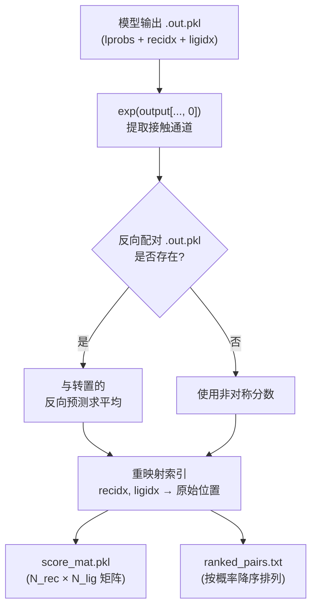
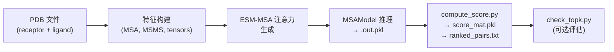

---
slug:19-contact-score-computation
blog_type:normal
---


接触分数计算是 Glinter 预测流程的**最终解释阶段**——在此阶段，原始的神经网络对数几率被转换为具有生物学意义的残基-残基接触概率矩阵和排序后的界面残基对列表。该阶段在模型的 2D 输出张量（逐位置对的对数概率）与使用具体接触预测的下游评估或对接流程之间架起了桥梁。

## 从模型输出到接触概率

`MSAModel` 的前向传播在残基对网格的空间维度上以一个**双通道 log-softmax** 运算终止。前向传播方法的最后三行在架构上起决定性作用：

```python
g = self.resnet(x)
logits = self.fc(g)           # Conv2d: C→2, kernel=1
lprobs = F.log_softmax(logits, dim=1).permute(0,2,3,1)
```

`self.fc` 层将 96 通道的 ResNet 特征图投影降维至 **2 个通道**（接触 / 非接触），`F.log_softmax` 将其转换为对数概率。`.permute(0,2,3,1)` 将输出维度重排为 `(B, N_rec, N_lig, 2)`，把类别维度置于最后。**通道 0** 代表“接触”类别；通道 1 代表“非接触”类别。这是二元残基-残基接触预测的标准形式。

在推理期间，模型将完整的 `lprobs` 张量连同比对索引数组 `recidx` 和 `ligidx` 一起序列化到 pickle 文件中：

```python
output = {'model':{}}
with torch.no_grad():
    move_to_cuda_(batch['data'])
    output['model']['output'] = model(batch['data']).cpu()
output['model']['recidx'] = batch['data']['recidx'].cpu()
output['model']['ligidx'] = batch['data']['ligidx'].cpu()
```

来源: [msa_model.py](/glinter/models/msa_model.py#L242-L246), [msa_model.py](/glinter/models/msa_model.py#L334-L343)

## 分数提取流程

`compute_score.py` 脚本是专用的后处理器，负责将模型输出的 pickle 文件转换为**接触概率矩阵**和**排序后的残基对列表**。其 `show()` 函数实现了三个关键操作：概率提取、对称化和索引重映射。



### 概率提取

核心提取操作对 log-softmax 输出的**通道 0** 应用 `exp()`，从而恢复原始的接触概率：

```python
score = np.exp(data['output'][0,:,:,0].cpu().numpy())
```

此操作生成一个 `(N_rec, N_lig)` 矩阵，其中每个元素 `score[i,j]` 表示受体残基 `i` 与配体残基 `j` 发生接触的预测概率。

### 通过反向配对平均进行对称化

Glinter 可以针对二聚体配对的两种朝向生成预测——`(receptor:ligand)` 和 `(ligand:receptor)`。当反向预测的 pickle 文件存在时，脚本会将正向预测与转置后的反向预测取平均，从而对分数矩阵进行**对称化**：

```python
if os.path.exists(f'{d}/{name2}:{name1}.out.pkl'):
    dataT = pickle.load(fh)['model']['output']
    score += np.exp(dataT[0,:,:,0].cpu().numpy().T)
    score /= 2
```

该对称化利用了这样一个事实：对于真实的接触，`score_rec→lig[i,j]` 与 `score_lig→rec[j,i]` 应当一致。对两者取平均可以减少依赖于朝向的噪声，从而产生更稳健的估计。当只有一个方向的预测可用时，则直接使用非对称分数。

### 索引重映射与排序配对输出

模型输出中存储的 `recidx` 和 `ligidx` 数组是**比对索引**——它们负责将模型内部的序列表示（在 MSA 构建期间可能会被裁剪或重排）映射回原始的 PDB 残基位置。`show()` 函数构建一个参考位置数组并对其进行索引：

```python
_pos1 = np.repeat(pos1[:,np.newaxis], len(pos2), axis=-1)
_pos2 = np.repeat(pos2[np.newaxis, :], len(pos1), axis=0)
ref_pos = np.concatenate(
    (_pos1[...,np.newaxis], _pos2[...,np.newaxis]), axis=-1
)[recidx, :][:,ligidx]
```

随后，分数矩阵被**展平并按降序排序**，以生成排序后的残基对列表：

```python
top_idx = np.argsort(score.reshape(-1))[::-1]
ranked_score = score.reshape(-1)[top_idx]
ranked_pos_pair = ref_pos.reshape(-1, 2)[top_idx]
```

最终输出的文件为：

| 文件 | 格式 | 内容 |
|------|--------|---------|
| `score_mat.pkl` | Pickled NumPy 数组 | `(N_rec, N_lig)` 概率矩阵 |
| `ranked_pairs.txt` | 空格分隔的文本 | 每行 `seq1 seq2 prob`，按概率降序排列 |

来源: [compute_score.py](/scripts/compute_score.py#L13-L40), [compute_score.py](/scripts/compute_score.py#L42-L53)

## 残基位置追踪

`read_residue_positions()` 函数加载可选的 `.pos` 文件，这些文件枚举了每条链的原始 PDB 残基编号。当 `.pos` 文件不存在时，则假定使用从 1 开始的顺序编号：

```python
def read_residue_positions(pos_file):
    if not os.path.exists(pos_file):
        return
    with open(pos_file, 'rt') as fh:
        pos = [ int(_) for _ in fh.readline().strip().split() ]
    pos = np.array(pos, dtype=np.long)
    return pos
```

这些位置文件由 `pdbseq.py` 预处理器在异二聚体/同二聚体预测流程中生成，确保排序后的输出使用**具有生物学意义的残基编号**（例如 PDB 插入码和链偏移量），而非内部从 0 开始的索引。

来源: [compute_score.py](/scripts/compute_score.py#L5-L11), [build_hetero.sh](/scripts/build_hetero.sh#L29-L30)

## 对照真实距离进行评估

`check_topk.py` 脚本通过将排序后的残基对与**真实原子间距离矩阵**（由 `compute_dist.py` 计算）进行对比，来评估预测接触的质量。评估方案计算的是：在 Top-K 预测接触中，其真实 Cβ–Cβ 距离低于阈值（默认 8 Å）的比例：

| 指标 | 描述 |
|--------|-------------|
| Top-10 | 得分最高的 10 对中的精确度 |
| Top-25 | 得分最高的 25 对中的精确度 |
| Top-50 | 得分最高的 50 对中的精确度 |
| Top-L/10 | 前 `⌊min(N_rec, N_lig)/10⌋` 对中的精确度 |
| Top-L/5 | 前 `⌊min(N_rec, N_lig)/5⌋` 对中的精确度 |
| 所有接触 | 整个矩阵中真实接触的总体比例 |

`compute_dist.py` 中的距离计算使用了基于 PyTorch 的批量欧氏距离，并结合 `torch_scatter.segment_csr` 实现跨原子的逐残基最小聚合，即使对于大型蛋白质也能实现高效计算。

来源: [check_topk.py](/scripts/check_topk.py#L29-L45), [compute_dist.py](/scripts/compute_dist.py#L19-L30)

## 端到端分数计算流程

完整的评分流程由 `build_hetero.sh`（或 `build_homo.sh`）编排，该脚本将所有阶段从原始 PDB 输入串联至最终排序的接触预测：



推理步骤（`build_hetero.sh` 的第 69 行）使用 `heavy-atom-graph,surface-graph,coordinate-ca-graph,pickled-esm` 特征集运行模型，并写入原始输出的 pickle 文件。紧接着，调用 `compute_score.py` 并传入源目录和链名称，以生成最终的分数矩阵和排序残基对。

<CgxTip>接触概率是从 2 类 log-softmax 输出的**通道 0** 中提取的（`exp(output[...,0])`），而非来自 sigmoid 或原始 logit。这意味着模型是基于二元接触/非接触分类的交叉熵损失进行训练的，且 softmax 归一化确保了对于每一个残基对都满足 `P(contact) + P(non-contact) = 1`。</CgxTip>

<CgxTip>当 `(A:B)` 和 `(B:A)` 的预测 pickle 文件同时存在时，对称化分数 `S[i,j] = (S_{A→B}[i,j] + S_{B→A}[j,i]) / 2` 绝对比任一单一方向的预测更可靠。对于关键应用，务必同时运行两个方向的预测。</CgxTip>

来源: [build_hetero.sh](/scripts/build_hetero.sh#L65-L71), [msa_model.py](/glinter/models/msa_model.py#L74-L77)

## 与相邻流程阶段的关系

接触分数计算消费了[异二聚体与同二聚体预测](18-heterodimer-vs-homodimer-prediction)的输出，并可以作为 [AlphaFold-Multimer 集成](20-alphafold-multimer-integration)的输入，在该集成中，排序后的接触对将作为空间约束来指导复合物结构的组装。实现位置重映射的 `recidx`/`ligidx` 比对索引是在 [DimerDataset 与特征加载](11-dimerdataset-and-feature-loading)阶段，通过应用于 MSA 比对图的 `cigar_to_index` 函数构建的。