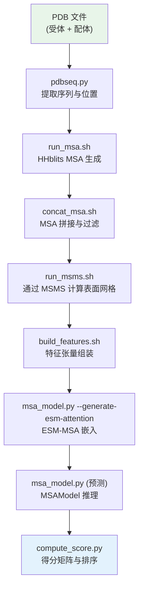

---
slug:2-quick-start
blog_type:normal
---


在 15 分钟内让 GLINTER 实现端到端运行——从安装到完成你的首次蛋白质间接触预测。本指南涵盖了完整设置、环境配置，以及**异源二聚体**和**同源二聚体**两种接触预测模式的执行方法。

## 前提条件

GLINTER 要求 **Python ≥ 3.7** 以及若干无法通过 pip 安装的外部生物信息学工具。下表汇总了所有依赖项及其在流水线中的作用。

| 依赖项 | 安装来源 | 流水线作用 |
|---|---|---|
| PyTorch ≥ 1.6 | [pytorch.org](https://pytorch.org/) | 张量计算，GPU 推理 |
| torch_geometric | [pytorch_geometric](https://github.com/rusty1s/pytorch_geometric) | 图神经网络操作 |
| MSMS | [mgltools.scripps.edu](http://mgltools.scripps.edu/packages/MSMS/) | 蛋白质表面网格计算 |
| reduce | [kinemage.biochem.duke.edu](http://kinemage.biochem.duke.edu/software/reduce.php) | PDB 质子化 / 添加氢原子 |
| hh-suite | [github.com/soedinglab/hh-suite](https://github.com/soedinglab/hh-suite) | 通过 HHblits 生成 MSA |
| esm_msa1_t12_100M_UR50S | [dl.fbaipublicfiles.com](https://dl.fbaipublicfiles.com/fair-esm/models/esm_msa1_t12_100M_UR50S.pt) | ESM-MSA 注意力嵌入模型 |
| Uniclust30 数据库 | [uniclust](http://wwwuser.gwdg.de/~compbiol/uniclust/2016_09/) | HHblits 序列搜索数据库 |
| Taxonomy 数据库 | [Zenodo 10.5281/zenodo.5172929](https://doi.org/10.5281/zenodo.5172929) | 物种级别的 MSA 过滤 |

<CgxTip>代码仓库中内置的检查点 `ckpts/glinter1.pt` 是**正确的**模型权重——请**不要**使用 Zenodo 上托管的版本，该版本已过时。</CgxTip>

来源: [README.md](/README.md#L1-L66), [setup.py](/setup.py#L1-L30)

## 安装

### 步骤 1 — 克隆并安装 Python 包

```bash
git clone https://github.com/zw2x/glinter.git
cd glinter
pip install -e .
```

`pip install -e .` 命令会以可编辑模式安装 GLINTER 及其核心 Python 依赖项：`numpy`、`tqdm`、`biopython`、`matplotlib`、`trimesh` 和 `scipy`。你仍需根据你的 CUDA 版本手动安装 PyTorch 和 torch_geometric。

来源: [README.md](/README.md#L3-L11), [setup.py](/setup.py#L10-L17)

### 步骤 2 — 安装外部工具

将编译好的二进制文件放入 `external/` 目录结构中，如下所示：

```
external/
├── hhblits-bin/       ← hh-suite 二进制文件 (hhblits, hhfilter, ...)
├── msms               ← MSMS 二进制文件
├── reduce/            ← reduce 二进制文件 + reduce_wwPDB_het_dict.txt
├── meff_cdhit         ← 已提供
├── verify_fasta       ← 已提供
└── A3M_SpecBloc/      ← 分类学过滤工具 (已提供)
```

### 步骤 3 — 下载 ESM-MSA 模型和序列数据库

```bash
mkdir -p scratch
# ESM-MSA 预训练模型
wget -P scratch https://dl.fbaipublicfiles.com/fair-esm/models/esm_msa1_t12_100M_UR50S.pt
# Uniclust30 数据库 (解压至 scratch/)
# 请调整下方的路径以匹配你的下载位置
```

来源: [README.md](/README.md#L13-L22), [scripts/set_env.sh](/scripts/set_env.sh#L1-L14)

## 环境配置

脚本 `scripts/set_env.sh` 会导出流水线所需的所有路径。在 source 该脚本之前，请**先编辑它**以指向你的安装路径。

```bash
# 查看并修改 scripts/set_env.sh 中的这些行：
export HHBLITS_BIN=$GLINT_ROOT/external/hhblits-bin   # hh-suite 二进制文件目录
export HHDB=$GLINT_ROOT/scratch/uniclust30_2016_09/uniclust30_2016_09  # 序列数据库
```

然后激活环境：

```bash
source scripts/set_env.sh
```

该脚本会通过检查 `.ffindex` 文件来验证 HHblits 数据库。如果你看到 `ERROR: invalid or damaged sequence database`，请验证你的 `HHDB` 路径。

来源: [scripts/set_env.sh](/scripts/set_env.sh#L1-L14)

## 运行你的首次预测

GLINTER 接受两个**单体 PDB 文件**作为输入，并预测每对残基位置（分别来自两条链）形成蛋白质间接触的概率。完整的流水线由一条 shell 命令统筹执行。

### 流水线概览



### 异源二聚体预测

若要预测两个**不同**链之间的蛋白质间接触（例如 `1a59A.pdb` 和 `1a59B.pdb`）：

```bash
scripts/build_hetero.sh examples/1a59A.pdb examples/1a59B.pdb examples/
```

这三个参数分别是：**受体 PDB**、**配体 PDB** 和**输出根目录**。GLINTER 会预测**双向**接触（A→B 和 B→A）并将其平均以得出最终得分。

### 同源二聚体预测

若要预测两条链共享相同序列的**对称**二聚体的接触，你需要指定一个**代表性单体**（即基于该链构建 MSA）：

```bash
scripts/build_homo.sh examples/1a59A.pdb examples/1a59B.pdb examples/ 1a59B
```

这四个参数分别是：**受体 PDB**、**配体 PDB**、**输出根目录** 和**代表性链名称**。流水线会将两条序列对齐至代表性链，并仅构建一个 MSA，从而减少计算量。

<CgxTip>对于同源二聚体，即使受体和配体共享相同的序列，也要确保它们具有**不同的名称**——流水线会使用名称来构建目录路径和输出文件标识符。</CgxTip>

来源: [scripts/build_hetero.sh](/scripts/build_hetero.sh#L1-L72), [scripts/build_homo.sh](/scripts/build_homo.sh#L1-L68), [README.md](/README.md#L27-L54)

## 理解输出

所有输出均写入输出根目录下名为 `<受体>:<配体>` 的子目录中。例如，对于受体 `1a59A` 和配体 `1a59B`，输出目录为 `examples/1a59A:1a59B/`。

| 文件 | 格式 | 描述 |
|---|---|---|
| `1a59A:1a59B.out.pkl` | Python pickle | A→B 方向的原始模型输出（对数概率 + 残基索引） |
| `1a59B:1a59A.out.pkl` | Python pickle | B→A 方向的原始模型输出（仅限异源二聚体） |
| `score_mat.pkl` | Python pickle | 最终接触概率矩阵（NumPy 数组，形状：`reclen × liglen`） |
| `ranked_pairs.txt` | 纯文本 | 排序后的残基对：每行格式为 `rec_pos lig_pos probability` |

`score_mat.pkl` 包含一个二维 NumPy 数组，其中条目 `(i, j)` 表示受体残基 `i` 与配体残基 `j` 发生接触的概率。对于异源二聚体，这是两个方向预测的**对称平均值**。`ranked_pairs.txt` 文件按概率降序列出了所有残基对。

来源: [scripts/compute_score.py](/scripts/compute_score.py#L1-L54), [README.md](/README.md#L49-L54)

## 底层运行机制

每次调用 `build_hetero.sh` / `build_homo.sh` 都会执行六个连续阶段。理解这些阶段有助于在出现问题时进行调试。

| 阶段 | 脚本 / 模块 | 目的 |
|---|---|---|
| 1. 输入设置 | `format_input_paths.sh` | 创建目录结构，复制 PDB 文件 |
| 2. 序列提取 | `preprocess/pdbseq.py` | 从 PDB 中提取氨基酸序列和残基位置映射 |
| 3. MSA 生成 | `scripts/run_msa.sh` → `run_hhblits.sh` → `msa_to_hhm.sh` | 运行 3 次 HHblits 迭代，计算 HMM 和 meff |
| 4. MSA 拼接 | `scripts/concat_msa.sh` → `concat_msa.sh` + `filter_msa.sh` | 拼接 MSA（异源）或复制代表性 MSA（同源），然后进行过滤 |
| 5. 表面计算 | `scripts/run_msms.sh` | 运行 `reduce` + `MSMS` 以计算蛋白质表面网格（顶点、面、面积） |
| 6. 特征组装 | `scripts/build_features.sh` | 构建表面特征、单体张量、MSA 张量，并将它们收集到单个 `.pkl` 中 |
| 7. ESM 嵌入 | `msa_model.py --generate-esm-attention` | 生成 ESM-MSA 行注意力嵌入（保存为 `.esm.npz`） |
| 8. 预测 | `msa_model.py`（推理模式） | 加载检查点，运行 MSAModel 前向传播，保存 `.out.pkl` |
| 9. 评分 | `scripts/compute_score.py` | 将对数概率转换为概率，进行对称化处理，并对残基对排序 |

来源: [scripts/build_hetero.sh](/scripts/build_hetero.sh#L26-L72), [scripts/build_features.sh](/scripts/build_features.sh#L1-L32), [preprocess/MSA/run_hhblits.sh](/preprocess/MSA/run_hhblits.sh#L1-L82)

## 故障排除

| 症状 | 可能原因 | 解决方法 |
|---|---|---|
| `ERROR: invalid or damaged sequence database` | `set_env.sh` 中的 `HHDB` 路径错误 | 验证路径是否指向 Uniclust30 的 `.ffindex` / `.ffdata` 文件 |
| `Cannot build .../1a59A.a3m` | HHblits 未找到同源物 | 检查 `HHBLITS_BIN` 是否包含有效的二进制文件，以及 `HHDB` 是否设置正确 |
| `ERROR: invalid utility .../meff_cdhit` | 缺少外部工具 | 确保 `external/meff_cdhit` 存在且具有可执行权限 (`chmod +x`) |
| CUDA 内存不足 | 对于大蛋白质 GPU 显存不足 | 使用显存 ≥ 16 GB 的 GPU，或通过编辑 `msa_model.py` 中的 `cut_msa_` 来减少 MSA 深度 |
| `A3M_SpecBloc` 分类学错误 | 缺少分类学注释 | 使用标头以 `tr|` 开头且包含 `OS=$TAX` 的 Uniclust 数据库 |

来源: [scripts/set_env.sh](/scripts/set_env.sh#L11-L14), [preprocess/MSA/run_hhblits.sh](/preprocess/MSA/run_hhblits.sh#L10-L13), [README.md](/README.md#L61-L63)

## 后续步骤

现在你已经让 GLINTER 运行起来了，可以进一步探索其内部原理和高级用法：

- **深入了解完整的流水线** → [预测流水线详解](3-prediction-pipeline-walkthrough)
- **探索模型架构** → [架构概览](4-architecture-overview)
- **与 AlphaFold-Multimer 集成** → [AlphaFold-Multimer 集成](20-alphafold-multimer-integration)
- **自定义特征配置** → [特征配置系统](13-feature-configuration-system)