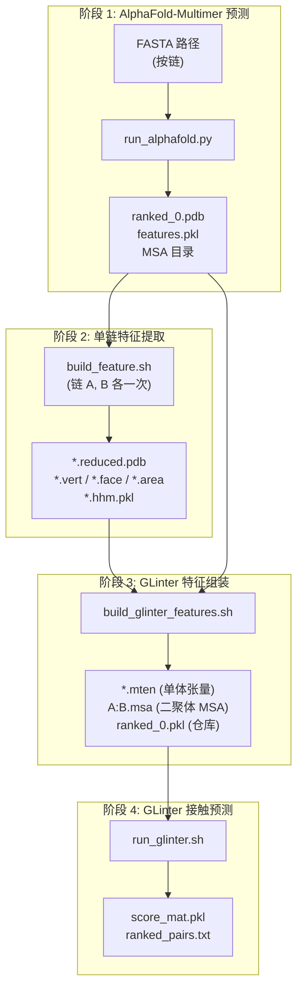
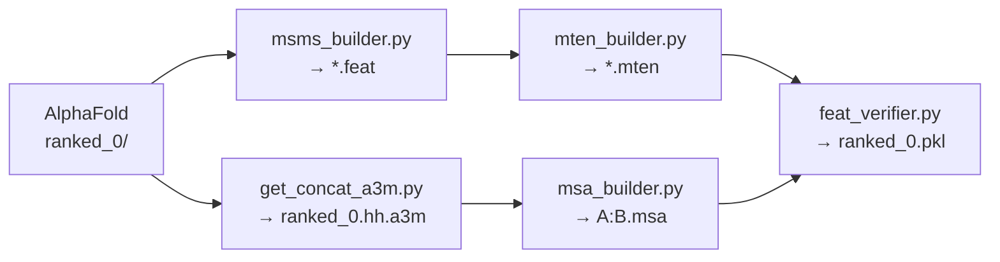

---
slug:20-alphafold-multimer-integration
blog_type:normal
---


GLinter 的 AlphaFold-Multimer 集成实现了一个**事后接口评估流水线**：AlphaFold-Multimer 生成候选的多聚体结构，随后 GLinter 根据这些结构计算蛋白质间接触概率，以此评估每个预测接口的质量。这种双系统架构将结构生成与接口评分解耦，使得 GLinter 的几何与进化特征能够对 AlphaFold 的多聚体预测进行重新排序或验证，而无需修改 AlphaFold 的内部模型。

来源: [example_run.sh](alphafold/example_run.sh#L1-L19), [run_glinter.sh](alphafold/run_glinter.sh#L1-L24)

## 流水线架构

该集成过程通过**四个顺序阶段**进行，每个阶段都将前一阶段的输出转换为下一阶段所需的输入表示。从 FASTA 输入到经 GLinter 排序的接触预测，完整的流程由 [example_run.sh](alphafold/example_run.sh#L1-L19) 编排，该脚本按依赖顺序将所有阶段串联起来。



阶段 1 调用 AlphaFold-Multimer 生成结构预测。阶段 2 从排名最高的预测中提取单链几何特征。阶段 3 将 AlphaFold 的多聚体 MSA 桥接为 GLinter 的拼接表示，并组装单体张量特征。阶段 4 运行 GLinter 的神经模型，生成链间接触概率图和排序后的残基对。

来源: [example_run.sh](alphafold/example_run.sh#L1-L19)

## 阶段 1: AlphaFold-Multimer 预测

入口点 [run_alphafold.py](alphafold/run_alphafold.py#L1-L263) 是 DeepMind 的 AlphaFold-Multimer 的精简封装，硬编码了 `model_preset = 'multimer'` 并默认使用单一集成 (`num_ensemble = 1`)。它用自定义的 [SimpleDataPipeline](alphafold/monomer_pipeline.py#L38-L92) 替换了 AlphaFold 的标准单体数据流水线，该自定义流水线**仅针对 UniClust30 运行 HHblits**——省略了针对 UniRef90/BFD 的 Jackhmmer 以及所有模板搜索步骤。这种简化以牺牲 MSA 多样性为代价换取了速度，其前提是 GLinter 自身的 MSA 处理（阶段 3）将补充进化信号。

`SimpleDataPipeline.process()` 方法解析单序列 FASTA，通过 HHblits 搜索 UniClust30，利用 AlphaFold 标准的 `pipeline.make_sequence_features()` 和 `pipeline.make_msa_features()` 构建序列和 MSA 特征，并通过 [`_make_empty_template_features()`](alphafold/monomer_pipeline.py#L17-L36) 用零值默认值填充模板特征。多聚体 `DataPipeline` 将来自此单体流水线的各链结果与针对 UniProt 的 Jackhmmer 组合，以构建配对的 MSA。

| 参数 | 默认值 | 用途 |
|-----------|---------|---------|
| `--fasta-paths` | (必需) | 逗号分隔的 FASTA 路径，每条链一个 |
| `--data-dir` | (必需) | AlphaFold 模型参数目录 |
| `--output-dir` | (必需) | 根输出目录 |
| `--uniclust30-database-path` | (必需) | 用于 HHblits 的 UniClust30 数据库 |
| `--uniprot-database-path` | (必需) | 用于配对 MSA 的 UniProt 数据库 |
| `--use-precomputed-msas` | `False` | 复用先前运行的 MSA |

输出产物包括 `ranked_0.pdb`（最高分结构）、`features.pkl`（AlphaFold 特征字典）以及 `msas/` 下的各链 MSA 子目录。

来源: [run_alphafold.py](alphafold/run_alphafold.py#L40-L44), [run_alphafold.py](alphafold/run_alphafold.py#L201-L257), [monomer_pipeline.py](alphafold/monomer_pipeline.py#L38-L92)

## 阶段 2: 单链特征提取

[build_feature.sh](alphafold/build_feature.sh#L1-L57) 作用于单个链目录（例如 `msas/A`）和 AlphaFold 的输出根目录。它对排名最高的预测结构执行三种转换：

1. **HHM 文件生成** — 如果 `{chain}.hhm.pkl` 不存在，则对 UniClust 命中的 A3M 运行 `hhmake`，然后通过 [`LoadHHM.py`](glinter/hhm/LoadHHM.py#L161-L164) 序列化 HMM 文件，该脚本解析发射分数、转移概率，并利用针对 Gonnet 替换矩阵的伪计数正则化推导出 PSFM/PSSM 矩阵。

2. **结构精简** — 两次使用 `reduce` 工具：首先使用 `-Trim` 剥除氢原子，然后使用 `-HIS` 对组氨酸重新加质子，生成化学性质一致的 `{chain}.reduced.pdb`。

3. **表面网格计算** — 通过 [`xyzrn.py`](glinter/points/xyzrn.py) 从精简后的 PDB 生成 `.xyzrn` 文件，然后在密度 3.0 和探针半径 1.5 Å 的条件下调用 **MSMS**，生成顶点（`.vert`）、面（`.face`）和溶剂排除面积（`.area`）文件。这些文件被移动到目标目录 `{output}/ranked_0/{chain}/` 中。

该脚本使用临时目录（`/tmp/glinter-XXXXXX`）存放中间文件，并在输入 PKL 缺失或表面面积文件生成失败（表明 MSMS 在预测几何结构上运行失败）时提前退出。

来源: [build_feature.sh](alphafold/build_feature.sh#L1-L57)

## 阶段 3: GLinter 特征组装

[build_glinter_features.sh](alphafold/build_glinter_features.sh#L1-L21) 是关键的桥接阶段，它将 AlphaFold 的输出转换为 GLinter 的原生表示。它按顺序执行五个步骤：



**步骤 1: MSMS 特征组装** — [`msms_builder.py`](preprocess/msms_builder.py#L178-L200) 读取各链的 `.reduced.pdb`、`.area`、`.vert`、`.face` 文件，计算 DSSP 二级结构，并将每个原子的 SASA 及每个残基的结构特征收集到包含 `coords`、`atom_feats`、`residue_feats`、`seq`、`seqmap` 和 `vertex` 数据的 `.feat` pickle 文件中。

**步骤 2: 单体张量构建** — [`mten_builder.py`](preprocess/mten_builder.py#L88-L176) 将每个 `.feat` 文件张量化，将原子类型、坐标、SASA、PSSM（来自 `.hhm.pkl`）以及表面顶点/法向量数据编码为紧凑的半精度张量，并保存为 `.mten` 文件。PSSM 从阶段 2 生成的 HHM 文件中加载。

**步骤 3: 拼接 MSA 提取** — [`get_concat_a3m.py`](alphafold/get_concat_a3m.py#L1-L34) 是 AlphaFold 与 GLinter 的 MSA 表示之间的关键桥梁。它读取 AlphaFold 的 `features.pkl`，提取多聚体 MSA（前 128 行），并使用 `residue_constants.restypes_with_x_and_gap` 将整数氨基酸类型转换回字符。它从 `asym_id` 特征推断链长，并输出拼接的 A3M，其头部将链边界编码为 `chain_id 0 / length ->` 条目，由 `&` 连接。这种格式正是 GLinter 的 [`read_a3mcc()`](preprocess/msa_builder.py#L34-L66) 在处理拼接二聚体 MSA 时所期望的。

**步骤 4: 二聚体 MSA 构建** — [`msa_builder.py`](preprocess/msa_builder.py#L93-L161) 使用 `--use-concat --use-hhfilter` 读取拼接的 A3M，通过 [`heniw()`](preprocess/msa_builder.py#L73-L91) 应用 Henikoff 加权，按权重截断至前 128 条序列，并将结果保存为 `A:B.msa`。该文件从 `ranked_0.hh.msa` 重命名为 `A:B.msa`，以符合 GLinter 的二聚体命名约定。

**步骤 5: 特征验证与仓库组装** — [`feat_verifier.py`](preprocess/feat_verifier.py#L38-L136) 检查单体张量（`.mten`）、二聚体 MSA（`.msa`）和结构仓库之间的一致性。它验证序列映射、通过 CIGAR 字符串验证比对索引以及序列同一性阈值。验证通过后，它组装包含 `rec`、`lig` 和 `tgt` 条目的 `ranked_0.pkl` 仓库——这是 GLinter 模型的完整输入包。

来源: [build_glinter_features.sh](alphafold/build_glinter_features.sh#L1-L21), [get_concat_a3m.py](alphafold/get_concat_a3m.py#L1-L34), [msa_builder.py](preprocess/msa_builder.py#L73-L91), [feat_verifier.py](preprocess/feat_verifier.py#L38-L136)

## 阶段 4: GLinter 接触预测

[run_glinter.sh](alphafold/run_glinter.sh#L1-L24) 执行两次 GLinter 模型传递，随后进行分数计算：

**传递 1: ESM-MSA 注意力生成** — 调用带 `--generate-esm-attention` 参数的 [`msa_model.py`](glinter/models/msa_model.py#L304-L331)，加载 ESM-MSA-1b Transformer (`esm_msa1_t12_100M_UR50S`) 以计算拼接二聚体 MSA 上的行注意力图。注意力张量以半精度保存为 `{name}.esm.npz`，捕获了 AlphaFold 配对 MSA 所编码的跨链进化耦合信号。

**传递 2: GLinter 预测** — 运行带 `heavy-atom-graph,surface-graph,coordinate-ca-graph,pickled-esm` 特征和 `glinter1.pt` 检查点的 [`msa_model.py`](glinter/models/msa_model.py#L333-L344)。模型加载预计算的 ESM 注意力（`pickled-esm`），将其与几何图特征一起通过 [AtomGCN](glinter/modules/atomgcn.py) 编码器和 2D ResNet 输入，并生成接触对数概率图。结果保存为 `{name}.out.pkl`，包含输出张量、受体索引（`recidx`）和配体索引（`ligidx`）。

**分数计算** — [`compute_score.py`](scripts/compute_score.py#L13-L40) 读取预测输出，将对数概率指数化以获得接触概率，如果存在反向预测（`B:A.out.pkl`），则对正向和转置后的反向分数取平均以保证对称性。然后它按概率对所有残基对进行排序，并写入完整的 `score_mat.pkl` 矩阵以及包含 `seq1 seq2 prob` 列的人类可读的 `ranked_pairs.txt`。

来源: [run_glinter.sh](alphafold/run_glinter.sh#L1-L24), [msa_model.py](glinter/models/msa_model.py#L290-L344), [compute_score.py](scripts/compute_score.py#L13-L54)

## 辅助工具

**链拆分** — [`split_chain.py`](alphafold/split_chain.py#L1-L27) 使用 AlphaFold 的 `protein.from_pdb_string()` 解析器将多聚体 PDB 分解为各链文件，写入 `ranked_0_A.pdb`、`ranked_0_B.pdb` 等。当预测结构需要为下游处理提取各链数据时使用此工具。

**链间距离排序** — [`compute_alphafold_ranked_pairs.py`](alphafold/compute_alphafold_ranked_pairs.py#L1-L22) 计算 AlphaFold 预测中链 0 和链 1 之间的 Cα–Cα 距离矩阵，按距离升序对所有链间残基对进行排序，并将它们写为 `index1 index2 distance` 三元组。这提供了一个结构基线，用于将 GLinter 的接触概率排序与预测结构中的实际几何邻近度进行比较。

| 工具 | 输入 | 输出 | 用途 |
|---------|-------|--------|---------|
| `split_chain.py` | 多聚体 PDB | 单链 PDB | 将预测分解为单体 |
| `compute_alphafold_ranked_pairs.py` | 多聚体 PDB | 排序后的距离对 | 结构距离基线 |
| `get_concat_a3m.py` | `features.pkl` | 拼接的 A3M | 桥接 AF MSA → GLinter 格式 |

来源: [split_chain.py](alphafold/split_chain.py#L1-L27), [compute_alphafold_ranked_pairs.py](alphafold/compute_alphafold_ranked_pairs.py#L1-L22), [get_concat_a3m.py](alphafold/get_concat_a3m.py#L1-L34)

## 完整执行示例

[example_run.sh](alphafold/example_run.sh#L1-L19) 脚本演示了包含所有必需参数的完整四阶段流水线：

```bash
# 阶段 1: AlphaFold-Multimer
python run_alphafold.py --data-dir ${data_dir} --output-dir ${output_dir} \
    --fasta-paths ${fasta_path} \
    --uniprot-database-path ${data_dir}/uniprot/uniprot.fasta \
    --uniclust30-database-path ${data_dir}/uniclust/uniclust30 \
    --use-precomputed-msas

# 阶段 2: 单链特征 (链 A 和 B)
bash build_feature.sh examples_output/example1/msas/A examples_output/example1
bash build_feature.sh examples_output/example1/msas/B examples_output/example1

# 阶段 3: GLinter 特征组装
bash build_glinter_features.sh examples_output/example1

# 阶段 4: GLinter 接触预测
bash run_glinter.sh examples_output/example1/ranked_0 ${esm_path}
```

变量 `${esm_path}` 必须指向 ESM-MSA 检查点（`esm/esm_msa1_t12_100M_UR50S.tt`），且 `${data_dir}` 必须包含 AlphaFold 模型参数以及 UniProt 和 UniClust30 数据库。

<CgxTip>该流水线是严格顺序执行的——每个阶段消耗前一阶段的产物。如果 AlphaFold 排名最高的结构（`ranked_0.pkl`）不存在，`run_glinter.sh` 将立即以代码 1 退出。如果 MSMS 在某条链的几何结构上运行失败（未生成 `.area` 文件），`build_feature.sh` 将静默退出，导致后续阶段跳过该链。</CgxTip>

<CgxTip>通过 `get_concat_a3m.py` 实现的 MSA 桥接是架构上的关键枢纽：AlphaFold 的多聚体 MSA（包含来自 Jackhmmer/UniProt 的配对行）被重新用作 GLinter 的拼接二聚体 MSA。`features.pkl` 中的 `asym_id` 特征决定了链边界，确保在 ESM-MSA Transformer 的前向传播中计算跨链注意力时进行正确的分区。</CgxTip>

来源: [example_run.sh](alphafold/example_run.sh#L1-L19)

## 设计原理与局限性

该集成遵循**松耦合**设计：AlphaFold 和 GLinter 仅通过文件系统产物（PDB 文件、序列化的特征字典、A3M 文件）进行通信。两个系统之间没有内存中的数据传递，这使得流水线能够适应任一组件的版本变更。然而，这是以冗余 I/O 为代价的——相同的数据在各个阶段中被多次序列化和反序列化。

精简的单体流水线（仅 HHblits，无模板）意味着对于模板信息至关重要的目标，AlphaFold 的预测可能不够准确。GLinter 的重新评估通过提供独立的接口质量信号进行了部分补偿，但该流水线目前并未将 GLinter 的接触预测反馈作为约束重新输入到 AlphaFold 中——耦合是单向的，即从结构预测到接口评分。

欲深入了解特征组装期间所调用组件的原理，请参阅 [使用 MSMS 进行表面计算](16-surface-computation-with-msms)、[特征张量组装](17-feature-tensor-assembly) 和 [MSA 构建与 Henikoff 加权](12-msa-building-and-henikoff-weighting)。关于使用这些特征的模型，请参阅 [MSAModel 与前向传播](5-msamodel-and-forward-pass)。关于如何解释结果分数，请参阅 [接触分数计算](19-contact-score-computation)。