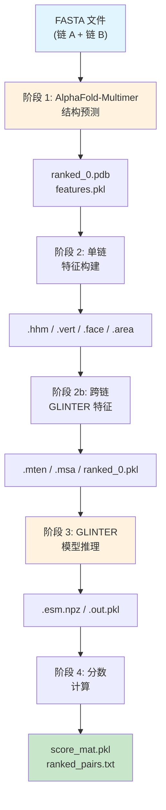
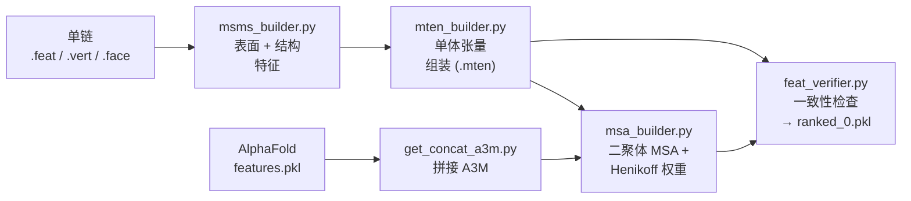

---
slug:3-prediction-pipeline-walkthrough
blog_type:normal
---


本页将向你介绍 GLINTER 的**完整端到端预测流水线**——从一对蛋白质 FASTA 序列到排序后的链间接触预测列表。该流水线包含四个阶段：**结构生成 → 特征构建 → 模型推理 → 分数计算**。每个阶段都会在磁盘上生成中间产物，使得流水线在每个阶段都可恢复和可检查。

## 流水线概览

完整流水线由 [`example_run.sh`](alphafold/example_run.sh) 编排，它依次调用四个子流水线。下图展示了从原始 FASTA 输入到最终接触分数的数据流：



| 阶段 | 脚本 | 输入 | 输出 | 目的 |
|-------|--------|-------|--------|---------|
| 1 | `run_alphafold.py` | FASTA 路径 | `ranked_0.pdb`, `features.pkl` | 使用 AlphaFold-Multimer 生成二聚体结构 |
| 2a | `build_feature.sh` × 2 | 单链 PDB + MSA | `.hhm`, `.vert`, `.face`, `.area` | 构建单链 HMM 和表面网格 |
| 2b | `build_glinter_features.sh` | 阶段 2a 输出 | `.mten`, `.msa`, `ranked_0.pkl` | 组装单体张量、MSA 和验证包 |
| 3 | `run_glinter.sh` | `ranked_0.pkl` + ESM 模型 | `.esm.npz`, `.out.pkl` | 生成 ESM 注意力 + 运行 GLINTER 预测 |
| 4 | `compute_score.py` | `.out.pkl` | `score_mat.pkl`, `ranked_pairs.txt` | 按概率对残基-残基接触对进行排序 |

来源: [example_run.sh](alphafold/example_run.sh#L1-L19), [run_glinter.sh](alphafold/run_glinter.sh#L1-L24)

## 阶段 1: AlphaFold-Multimer 结构预测

流水线首先使用 **AlphaFold-Multimer** 生成初始二聚体结构。脚本 [`run_alphafold.py`](alphafold/run_alphafold.py) 接受一个或多个 FASTA 文件路径（每条链一个），并运行完整的 AlphaFold 多聚体数据流水线，随后进行模型推理。

**该阶段的关键步骤：**

1. **MSA 搜索** — HHblits 针对 UniClust30 和 UniProt 数据库进行搜索，为每条链生成多序列比对。如果设置了 `--use-precomputed-msas`，则会从磁盘复用已有的 MSA。
2. **特征组装** — `pipeline_multimer.DataPipeline` 将单链 MSA、模板特征和序列特征合并为一个单独的 `feature_dict`。
3. **模型推理** — 每个配置好的模型运行器处理这些特征，并生成带有 pLDDT 置信度分数的预测结构。
4. **排序** — 模型按 `iptm+ptm` 置信度排序；最佳模型保存为 `ranked_0.pdb`。

**后续阶段消耗的关键输出：**
- `features.pkl` — 完整的 AlphaFold 特征字典（包含带有 `asym_id` 的拼接 MSA，用于链分离）。
- `ranked_0.pdb` — 排名最高的预测二聚体结构，该结构将被拆分为单链 PDB，用于下游特征构建。

`example_run.sh` 调用传递了数据库路径和 FASTA 输入：

```bash
python run_alphafold.py --data-dir ${data_dir} --output-dir ${output_dir} \
    --fasta-paths ${fasta_path} \
    --uniprot-database-path ${data_dir}/uniprot/uniprot.fasta \
    --uniclust30-database-path ${data_dir}/uniclust/uniclust30 \
    --use-precomputed-msas
```

来源: [run_alphafold.py](alphafold/run_alphafold.py#L76-L199), [example_run.sh](alphafold/example_run.sh#L7-L11)

## 阶段 2a: 单链特征构建

在 AlphaFold 生成二聚体结构后，将对每条链（A 和 B）分别运行一次 [`build_feature.sh`](alphafold/build_feature.sh)。该脚本接受两个参数：该链的 MSA 目录和输出根目录。

**`build_feature.sh` 内部逐步执行：**

1. **HMM 生成** — 如果 `{chain}.hhm.pkl` 不存在，`hhmake` 会将 UniClust 命中结果的 A3M 转换为 HMM 配置文件，然后 [`LoadHHM.py`](glinter/hhm/LoadHHM.py) 将生成的 PSSM 序列化保存，以便快速加载。
2. **PDB 约简** — `reduce` 工具去除氢原子并标准化组氨酸质子化状态，生成 `*.reduced.pdb`。
3. **表面网格计算** — 脚本运行 `xyzrn.py` 将约简后的 PDB 转换为 XYZRN 格式，然后调用 **MSMS** 分子表面工具，使用 1.5Å 的探针半径和 3.0 的密度，生成顶点（`.vert`）、面（`.face`）和面积（`.area`）文件。
4. **产物迁移** — 所有表面文件和约简后的 PDB 都会从临时目录移动到目标目录 `{output}/ranked_0/{chain}/` 中。

如果 `.face` 已存在，脚本将提前退出，这使其具有**幂等性**——可以安全地重新运行而不会产生冗余计算。

```bash
# 在 example_run.sh 中被调用两次:
bash build_feature.sh examples_output/example1/msas/A examples_output/example1
bash build_feature.sh examples_output/example1/msas/B examples_output/example1
```

来源: [build_feature.sh](alphafold/build_feature.sh#L1-L57), [example_run.sh](alphafold/example_run.sh#L13-L14)

## 阶段 2b: 跨链 GLINTER 特征组装

有了单链产物后，[`build_glinter_features.sh`](alphafold/build_glinter_features.sh) 将组装 GLINTER 模型所需的**跨链特征**。这是特征最丰富的阶段，依次调用四个 Python 脚本：



| 脚本 | 输入 | 输出 | 功能描述 |
|--------|-------|--------|--------------|
| `msms_builder.py` | 单链 `.feat`、PDB、MSMS 文件 | 更新后的 `.feat`，包含表面顶点、DSSP、SAS | 读取坐标、二级结构、溶剂可及面积；将单链特征字典序列化保存 |
| `mten_builder.py` | `.feat` 文件 + `.hhm.pkl` | `.mten` (单体张量) | 将序列、原子坐标、SAS、PSSM、表面顶点/法向量张量化并存入单个 pickle 文件 |
| `get_concat_a3m.py` | `features.pkl` | `ranked_0.hh.a3m` (标准输出) | 从 AlphaFold 的特征字典中提取拼接的 MSA，将残基类型转回氨基酸字母 |
| `msa_builder.py` | 拼接的 A3M | `A:B.msa` | 读取跨链 A3M，计算 **Henikoff 序列权重**，裁剪至前 128 条序列，并将 MSA 张量序列化保存 |
| `feat_verifier.py` | `.mten`, `.msa` | `ranked_0.pkl` | 验证单体张量和二聚体 MSA 之间的一致性，然后将所有内容打包至单个 pickle 文件中供模型加载 |

<CgxTip>`ranked_0.pkl` 文件是**自包含的预测输入**——它存储了两条链的单体张量以及二聚体 MSA。`DimerDataset` 在推理时直接从此文件加载，因此模型前向传播不需要其他任何中间文件。</CgxTip>

来源: [build_glinter_features.sh](alphafold/build_glinter_features.sh#L1-L21), [msms_builder.py](preprocess/msms_builder.py#L1-L200), [mten_builder.py](preprocess/mten_builder.py#L88-L176), [msa_builder.py](preprocess/msa_builder.py#L93-L161), [feat_verifier.py](preprocess/feat_verifier.py#L38-L136)

## 阶段 3: GLINTER 模型推理

这是核心预测阶段，由 [`run_glinter.sh`](alphafold/run_glinter.sh) 编排。它对 [`msa_model.py`](glinter/models/msa_model.py) 执行**两次顺序调用**——首先生成 ESM-MSA 注意力嵌入，然后运行完整的 GLINTER 模型。

### 步骤 3a: ESM-MSA 注意力生成

```bash
python msa_model.py --dimer-root ranked_0.pkl --feature esm \
    --ckpt-path $ESM_PATH --generate-esm-attention
```

设置 `--generate-esm-attention` 后，模型会加载 **ESM-MSA-1b** 预训练 Transformer，并在拼接的二聚体 MSA 上以评估模式运行。模型从 ESM Transformer 中提取**行注意力图**——具体来说是受体和配体位置之间的跨链注意力。它们被保存为压缩的 NumPy 数组：

- **输出**: `{model_name}.esm.npz`，包含 float16 格式的注意力张量。

在 `MSAModel.forward()` 方法内部，ESM 注意力提取遵循以下逻辑：行注意力被切片到受体→配体象限（位置 `[:reclen, reclen:]`），并根据 `--row-attn-op` 标志（默认值: `sym`）选择性地与配体→受体象限进行对称化处理。

### 步骤 3b: GLINTER 接触预测

```bash
python msa_model.py --dimer-root ranked_0.pkl --esm-root $srcdir \
    --feature heavy-atom-graph,surface-graph,coordinate-ca-graph,pickled-esm \
    --ckpt-path ckpts/glinter1.pt
```

此步骤加载**训练好的 GLINTER 检查点** (`glinter1.pt`)，并使用四种特征类型运行完整的前向传播：

| 特征标志 | 来源 | 嵌入维度 | 描述 |
|-------------|--------|---------------------|-------------|
| `pickled-esm` | 步骤 3a 的 `.esm.npz` | 144 | 预计算的 ESM-MSA 跨链注意力 |
| `coordinate-ca-graph` | `.mten` CA 坐标 | 128 | 带有局部参考系的 Cα 距离图 |
| `heavy-atom-graph` | `.mten` 原子坐标 | 128 | 6Å 半径内的重原子图 |
| `surface-graph` | `.mten` 顶点/法向量 | 128 | 6Å 半径内的表面网格图 |

`DimerDataset` 使用 `build_ca_graph`、`build_atom_graph` 和 `build_surface_graph` 从单体张量中动态构建这些几何图。每个图在推理时都会被随机旋转。`Collater` 使用 PyG 的 `Batch.from_data_list` 将图特征打包成批次样本（预测时批次大小为 1）。

模型的前向传播过程：
1. **1D 编码** — `AtomGCN` 编码器处理所有几何图，并为受体和配体生成每个残基的 128 维嵌入。
2. **外积** — 受体和配体嵌入通过外积展开进行组合：每个受体残基嵌入与每个配体残基嵌入拼接，生成 256 通道的成对特征图。
3. **ESM 融合** — 144 通道的 ESM 注意力与 256 通道的几何特征拼接。
4. **2D ResNet** — 带有 `BasicBlock2d` 的 `ResNet` 通过 16 个残差块处理 400 通道的成对特征图，输出 96 个通道。
5. **分类** — 1×1 卷积将通道数降为 2（接触 / 非接触），`log_softmax` 生成最终的对数概率图。

**输出**: `{model_name}.out.pkl`，包含对数概率张量、受体索引映射和配体索引映射。

来源: [run_glinter.sh](alphafold/run_glinter.sh#L17-L22), [msa_model.py](glinter/models/msa_model.py#L164-L246), [msa_model.py](glinter/models/msa_model.py#L290-L344), [dimer_dataset.py](glinter/dataset/dimer_dataset.py#L159-L280)

## 阶段 4: 分数计算与排序

最终脚本 [`compute_score.py`](scripts/compute_score.py) 将原始模型对数概率转换为可解释的**排序接触列表**。它接受三个参数：源目录和两条链的名称（例如 `A` 和 `B`）。

**评分工作原理：**

1. **加载预测** — 读取 `A:B.out.pkl` 并提取接触概率图：`score = exp(log_prob[:, :, 0])`（对接触类别的 logit 取指数）。
2. **对称化** — 如果 `B:A.out.pkl`（反向预测）也存在，则对分数取平均：`score = (score_AB + score_BA^T) / 2`。通过结合两个方向的视图，这可以提高预测质量。
3. **索引映射** — 使用 `.pos` 文件将残基位置从 MSA 比对索引映射回原始 PDB 残基编号（或以顺序编号作为后备）。
4. **排序** — 所有残基对按接触概率降序排列。

**最终输出：**

| 文件 | 格式 | 内容 |
|------|--------|---------|
| `score_mat.pkl` | 序列化的 NumPy 数组 | 完整的 L_rec × L_lig 概率矩阵 |
| `ranked_pairs.txt` | 空格分隔的文本 | 排序后的列表：每行 `seq1 seq2 prob`（概率最高者优先） |

```bash
python compute_score.py $srcdir A B
```

<CgxTip>`ranked_pairs.txt` 文件是你的主要结果——每行给出一个残基-残基对及其预测的接触概率。文件顶部的对是 GLINTER 预测置信度最高的链间接触。</CgxTip>

来源: [compute_score.py](scripts/compute_score.py#L1-L54)

## 完整文件流汇总

下表追踪了流水线中的每个文件产物，显示了它由哪个阶段创建以及被哪个阶段消耗：

| 文件 | 创建者 | 消耗者 | 描述 |
|------|-----------|-------------|-------------|
| `features.pkl` | 阶段 1 (`run_alphafold.py`) | 阶段 2b (`get_concat_a3m.py`) | 带有 MSA + asym_id 的 AlphaFold 特征字典 |
| `ranked_0.pdb` | 阶段 1 | 阶段 2a (隐式，通过链拆分) | 排名最高的二聚体结构 |
| `ranked_0_A.pdb` / `ranked_0_B.pdb` | 阶段 1 (链拆分) | 阶段 2a (`reduce`) | 单链 PDB 文件 |
| `{chain}.hhm.pkl` | 阶段 2a (`LoadHHM.py`) | 阶段 2b (`mten_builder.py`) | 序列化的 HMM 配置文件 / PSSM |
| `{chain}.vert/face/area` | 阶段 2a (MSMS) | 阶段 2b (`msms_builder.py`) | 表面网格几何信息 |
| `{chain}.feat` | 阶段 2b (`msms_builder.py`) | 阶段 2b (`mten_builder.py`) | 单链结构特征 |
| `{chain}.mten` | 阶段 2b (`mten_builder.py`) | 阶段 3 (`DimerDataset`) | 张量化的单体特征 |
| `A:B.msa` | 阶段 2b (`msa_builder.py`) | 阶段 3 (通过 `ranked_0.pkl`) | 加权的二聚体 MSA 张量 |
| `ranked_0.pkl` | 阶段 2b (`feat_verifier.py`) | 阶段 3 (`DimerDataset`) | 打包的预测输入 |
| `{name}.esm.npz` | 阶段 3a (ESM 前向传播) | 阶段 3b (`DimerDataset`) | ESM-MSA 注意力嵌入 |
| `{name}.out.pkl` | 阶段 3b (GLINTER 前向传播) | 阶段 4 (`compute_score.py`) | 对数概率接触图 |
| `score_mat.pkl` | 阶段 4 | 用户 | 完整概率矩阵 |
| `ranked_pairs.txt` | 阶段 4 | 用户 | 排序后的接触列表 |

来源: [example_run.sh](alphafold/example_run.sh#L1-L19), [run_glinter.sh](alphafold/run_glinter.sh#L1-L24), [build_glinter_features.sh](alphafold/build_glinter_features.sh#L1-L21)

## 接下来去哪

现在你已经了解了完整的预测流程，可以深入研究你感兴趣的组件：

- **模型内部机制**: [MSAModel 与前向传播](5-msamodel-and-forward-pass) 详细解释了 ResNet + AtomGCN 架构。
- **特征工程**: [几何图构建](8-geometric-graph-construction) 介绍了如何从单体张量构建 Cα、原子和表面图。
- **预处理深度**: [特征张量组装](17-feature-tensor-assembly) 详细说明了如何从原始结构数据构建 `.mten` 文件。
- **评分细节**: [接触分数计算](19-contact-score-computation) 探讨了对称化和排序逻辑。
- **AlphaFold 集成**: [AlphaFold-Multimer 集成](20-alphafold-multimer-integration) 介绍了如何配置结构预测阶段。