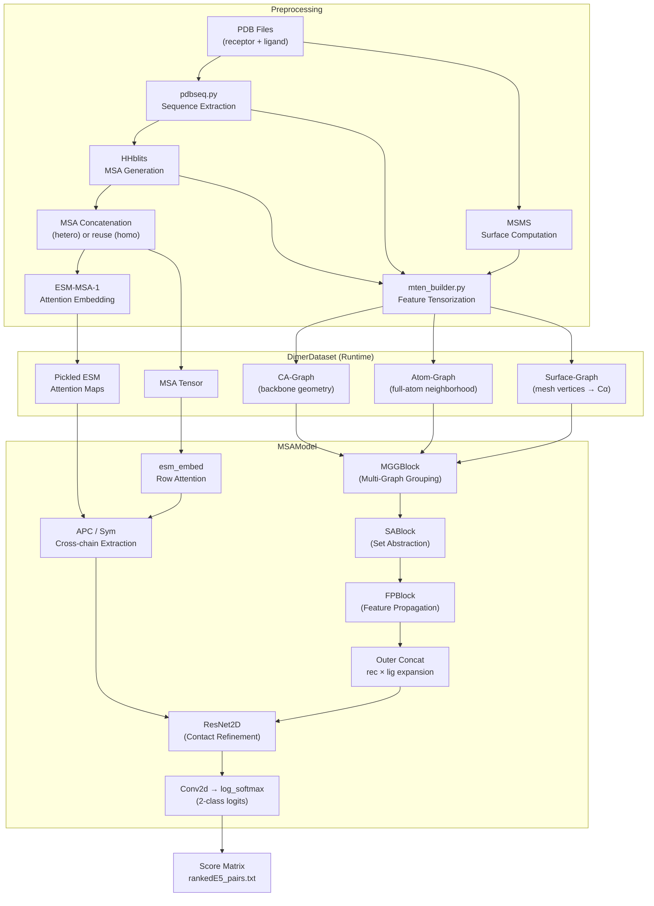
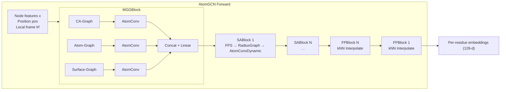

---
slug:4-architecture-overview
blog_type:normal
---


Glinter（**蛋白质间接触的图学习**）是一个深度学习系统，用于预测两条蛋白质链（受体和配体）之间的残基-残基接触。其架构融合了蛋白质结构和进化的三种互补表征——**基于 MSA 的共进化信号**、**多尺度几何图**和**蛋白质表面网格**——构成统一的预测流程，输出逐对残基的接触概率矩阵。本页描绘了从预处理到推理的完整系统架构，建立起后续“深入剖析”页面将详细探讨的概念框架。

来源: [README.md](/README.md#L1-L66), [glinter/models/msa_model.py](/glinter/models/msa_model.py#L30-L46)

## 系统架构图

下图展示了端到端的数据流，从原始 PDB 输入经过预处理阶段，通过神经网络模型，最终得到评分后的接触预测：



来源: [scripts/build_hetero.sh](/scripts/build_hetero.sh#L1-L72), [glinter/models/msa_model.py](/glinter/models/msa_model.py#L164-L246)

## 架构层

系统自然分解为四个架构层，每层具有明确的职责和数据契约：

| 层 | 职责 | 核心模块 | 输出产物 |
|-------|---------------|-------------|-----------------|
| **预处理** | 将原始 PDB 转换为张量化特征文件 | `preprocess/`, `scripts/` | `.mten`, `.msa`, `.esm.npz` 文件 |
| **数据集** | 在运行时加载并构建几何图 | `glinter/dataset/` | `Data` 对象 (PyG 图 + 张量) |
| **神经网络模型** | 融合表征并预测接触 | `glinter/models/`, `glinter/modules/` | 对数概率张量 `(L_rec, L_lig, 2)` |
| **评分** | 将方向性预测聚合为排序对 | `scripts/compute_score.py` | `score_mat.pkl`, `ranked_pairs.txt` |

<CgxTip>预处理层生成**离线产物**（`.mten`、`.esm.npz`），数据集层在运行时加载它们。这种分离意味着模型推理永远不会重新运行 HHblits 或 MSMS —— 它仅从预张量化的特征中构建几何图。理解这一边界对调试至关重要：如果特征缺失，应追溯到预处理阶段，而不是数据集阶段。</CgxTip>

来源: [preprocess/mten_builder.py](/preprocess/mten_builder.py#L88-L177), [preprocess/msa_builder.py](/preprocess/msa_builder.py#L93-L161)

## 双信息通路

Glinter 中最重要的架构模式是用于接触信号提取的**双通路**。`MSAModel.forward` 前向传播在进入最终的 2D ResNet 之前，合并了两个结构上截然不同的信息流：

### 通路 1 — 共进化注意力 (2D)

该通路利用编码在多序列比对中的进化耦合信号。拼接的受体-配体 MSA 被传入 **ESM-MSA-1**（一个预训练的 MSA Transformer），提取生成的行注意力图作为形状为 `(B, L×N, K, K)` 的 2D 张量。然后，模型使用以下四种策略之一，选择此注意力矩阵的**跨链象限** —— 即受体位置关注配体位置的块：

| 策略 | 操作 | 依据 |
|----------|-----------|-----------|
| `lower_tri` | `x[:, :, :rec, rec:]` | 单向注意力 |
| `upper_tri` | `x[:, :, rec:, :rec]ᵀ` | 反向，转置 |
| `sym` | `x[:,:,:rec,rec:] + x[:,:,rec:,:rec]ᵀ` | 对称组合（默认） |
| `apc` | `APC(x + xᵀ)[:,:,:rec,rec:]` | 对对称图进行平均乘积校正 |

输出为形状 `(B, C_esm, L_rec, L_lig)` 的 2D 特征图，其中 `C_esm = 144`。

来源: [glinter/models/msa_model.py](/glinter/models/msa_model.py#L164-L212)

### 通路 2 — 几何图嵌入 (1D → 2D)

该通路通过 `AtomGCN` 编码器独立编码每个单体的 **3D 结构上下文**。对于每条链，多图网络聚合来自最多三个源图（CA-图、原子-图、表面-图）的信息，应用带最远点采样的集合抽象，并反向传播特征 —— 生成维度为 128 的逐残基嵌入。这些 1D 嵌入随后被**外拼接**成 2D 图：

```
y = cat(y_rec.unsqueeze(3).expand(…, L_lig),
        y_lig.unsqueeze(2).expand(…, L_rec))
```

这生成了形状为 `(B, 256, L_rec, L_lig)` 的 2D 特征图。关键的设计决策是**结构编码是逐单体的** —— 此通路中不流通任何跨链几何信息。跨链信号完全来自共进化通路。

来源: [glinter/models/msa_model.py](/glinter/models/msa_model.py#L225-L246)

### 融合与预测

两条通路沿通道维度拼接，并由 2D ResNet（`BasicBlock2d`，16 层，96 通道）处理，随后接一个 1×1 `Conv2d`，映射为 2 类逻辑值（接触 / 非接触）。最终输出是在类别维度上的 `log_softmax`：

```
x = cat(esm_2d, graph_2d)   # (B, 144+256, L_rec, L_lig)
g = ResNet(x)                # (B, 96, L_rec, L_lig)
logits = Conv2d(g)           # (B, 2, L_rec, L_lig)
lprobs = log_softmax(logits) # (B, L_rec, L_lig, 2)
```

来源: [glinter/models/msa_model.py](/glinter/models/msa_model.py#L242-L246), [glinter/modules/conv.py](/glinter/modules/conv.py#L21-L78)

## 多图几何编码器

`AtomGCN` 模块实现了适配多图蛋白质输入的 **PointNet++ 风格层次编码器**。其三个内部阶段构成了 U 型架构：



**MGGBlock**（多图分组）在每个源图上同时运行并行的 `AtomConv` 消息传递层，然后拼接输出。每个 `AtomConv` 在**局部参考系**（LRF）中计算消息 —— 位移向量在传入局部 MLP 之前被旋转到目标节点的 LRF 中，从而确保编码器的 SE(3) 等变性。

**SABlock**（集合抽象）应用最远点采样（FPS）对节点进行下采样，构建半径图，并运行 `AtomConvDynamic` 消息传递 —— 这是下采样（编码）路径。

**FPBlock**（特征传播）使用 k-近邻插值从粗点集到细点集进行上采样，并与来自相应抽象层的跳跃连接拼接 —— 这是上采样（解码）路径。

来源: [glinter/modules/atomgcn.py](/glinter/modules/atomgcn.py#L196-L273), [glinter/modules/atomconv.py](/glinter/modules/atomconv.py#L8-L133)

## 三个源图

几何编码器源自三种不同的图构建方式，每种捕获蛋白质结构的不同尺度和模态：

| 图 | 节点 | 边 | 节点特征 | 边特征 | 尺度 |
|-------|-------|-------|---------------|---------------|-------|
| **CA-图** | Cα 原子 | 半径图 (r=8Å) | SAS, AA 独热编码, 位置编码, PSSM (43-d) | 距离 (可选) | 骨架 |
| **原子-图** | 所有重原子 | 半径图 (r=6Å, 从原子 → Cα) | 原子类型独热编码, SAS, 残基类型 (33-d) | 同残基指示符 | 全原子 |
| **表面-图** | 网格顶点 | 半径图 (r=4Å, 从顶点 → Cα) | 无 (0-d) | 法向量 (通过 `use_nor`) | 表面 |

每个图均使用**半径图**构建，其中边连接距离目标（查询）节点在距离阈值内的源节点。CA-图和原子-图分别是查询到查询和源到查询的；表面-图将 MSMS 计算的表面顶点连接到其最近的 Cα 原子，使得表面的化学和几何属性能够影响残基级嵌入。

<CgxTip>特征配置系统（`DimerFeature`）决定了运行时哪些图处于活跃状态。典型的生产配置是 `heavy-atom-graph,surface-graph,coordinate-ca-graph,pickled-esm` —— 意味着所有三个几何图加上预计算的 ESM 注意力。`coordinate-ca-graph` 标志指示应使用 LRF 相对位置编码（与使用标量距离的 `distance-ca-graph` 相反）。</CgxTip>

来源: [glinter/dataset/_geometric_graph.py](/glinter/dataset/_geometric_graph.py#L42-L143), [glinter/dataset/_feature.py](/glinter/dataset/_feature.py#L1-L36)

## 预处理流水线

预处理阶段将原始 PDB 结构转换为数据集层所使用的张量化产物。对于异源二聚体预测，流水线按以下严格顺序执行：

1. **序列提取** (`pdbseq.py`) —— 读取 PDB，提取逐链序列和残基位置映射
2. **MSA 生成** (`run_msa.sh` → HHblits) —— 针对 UniClust 为每条链构建 a3m 比对
3. **MSA 拼接** (`concat_msa.sh`) —— 将受体和配体的 MSA 交织为联合比对
4. **ESM 注意力预计算** —— 在拼接的 MSA 上运行 ESM-MSA-1，将行注意力图保存为 `.esm.npz`
5. **表面计算** (`run_msms.sh` → MSMS) —— 计算溶剂排除表面网格（顶点 + 法向量）
6. **特征张量化** (`mten_builder.py`) —— 将坐标、原子类型、SAS、PSSM、表面顶点组装成 `.mten` 文件
7. **特征打包** (`build_features.sh`) —— 将单体和二聚体张量捆绑成单个 `.pkl` 数据集文件

对于**同源二聚体**，跳过第 3 步（配体 MSA 复用受体 MSA），且仅计算一个预测方向。对于**异源二聚体**，流水线同时运行 `A:B` 和 `B:A` 两个方向并取平均分。

来源: [scripts/build_hetero.sh](/scripts/build_hetero.sh#L26-L71), [preprocess/msa_builder.py](/preprocess/msa_builder.py#L93-L161), [preprocess/mten_builder.py](/preprocess/mten_builder.py#L88-L177)

## 特征配置系统

`DimerFeature` 类充当控制哪些表征流经模型的**特征门控**。它解析逗号分隔的字符串（例如 `coordinate-ca-graph,atom-graph,surface-graph,pickled-esm`），并暴露一个 `use(*keys)` 方法，供模型和数据集调用以有条件地启用代码路径。有效的特征组为：

| 特征组 | 激活的组件 |
|--------------|---------------------|
| `esm` | 实时 ESM-MSA-1 推理（计算昂贵，用于预计算） |
| `pickled-esm` | 从 `.esm.npz` 加载预计算的 ESM 注意力（推理模式） |
| `ccm` | 共进化耦合矩阵，作为 ESM 的替代 |
| `ca-embed` | Cα 节点特征上的 1D Conv 编码器（无图边） |
| `coordinate-ca-graph` | 带 LRF 相对位置编码的 CA-图 |
| `distance-ca-graph` | 带标量距离边特征的 CA-图 |
| `atom-graph` | 带残基组指示符的全原子到 Cα 图 |
| `surface-graph` | 带法向量的表面网格顶点到 Cα 图 |
| `heavy-atom-graph` | 移除氢原子的原子-图 |

`esm` 和 `pickled-esm` 标志互斥。在 ESM 预计算期间，使用 `--feature esm --generate-esm-attention`；在最终预测期间，`--feature pickled-esm` 加载缓存结果。

来源: [glinter/dataset/_feature.py](/glinter/dataset/_feature.py#L1-L36), [glinter/models/msa_model.py](/glinter/models/msa_model.py#L57-L78)

## 项目结构参考

仓库按照架构层清晰地分离了关注点：

```
glinter/                        # 核心库 (可 pip 安装)
├── models/                     # 神经网络模型定义
│   ├── msa_model.py            #   MSAModel — 顶层模型 + 推理循环
│   └── checkpoint_utils.py     #   检查点加载工具
├── modules/                    # 可复用的神经网络构建模块
│   ├── atomgcn.py              #   AtomGCN, MGGBlock, SABlock, FPBlock
│   ├── atomconv.py             #   AtomConv, AtomConvDynamic (消息传递)
│   ├── conv.py                 #   2D ResNet (BasicBlock2d, Bottleneck2d)
│   └── mlp.py                  #   MLP 工具
├── dataset/                    # 数据加载与图构建
│   ├── dimer_dataset.py        #   DimerDataset — 特征加载 + 图构建
│   ├── collater.py             #   PyG Data + 字典的自定义整理
│   ├── _geometric_graph.py     #   build_ca_graph, build_atom_graph, build_surface_graph
│   ├── _feature.py             #   DimerFeature 配置解析器
│   ├── _sequence.py            #   序列编码工具
│   ├── _dist.py                #   距离计算工具
│   └── msa_utils.py            #   MSA 加载与分词
├── esm_embed/                  # ESM-MSA-1 集成 (改编自 FAIR)
├── protein/                    # 蛋白质结构解析与编码
├── points/                     # 表面网格处理 (MSMS I/O, LRF)
└── hhm/                        # HMM 配置文件加载 (来自 HHsearch 的 PSSM)

preprocess/                     # 离线预处理脚本
├── msa_builder.py              #   MSA 构建 + Henikoff 加权
├── mten_builder.py             #   单体特征张量化
├── msms_builder.py             #   表面计算编排
├── pdbseq.py                   #   PDB 序列提取
└── MSA/                        #   HHblits 流水线的 Shell 脚本

scripts/                        # 端到端流水线编排
├── build_hetero.sh             #   完整的异源二聚体预测流水线
├── build_homo.sh               #   完整的同源二聚体预测流水线
├── compute_score.py            #   评分聚合 + 排序
└── set_env.sh                  #   环境变量配置

alphafold/                      # AlphaFold-Multimer 集成
ckpts/                          # 模型检查点 (glinter1.pt)
examples/                       # 示例 PDB 输入
```

来源: [setup.py](/setup.py), [README.md](/README.md#L7-L11)

## 阅读顺序

现在你已了解架构骨架，深入剖析页面将从实现细节上探讨每个组件。推荐的阅读顺序遵循数据流：

1. **[MSAModel 与前向传播](5-msamodel-and-forward-pass)** — 顶层模型编排与双通路融合逻辑
2. **[AtomGCN 多图网络](6-atomgcn-multi-graph-network)** — 包含 MGGBlock、SABlock 和 FPBlock 的层次几何编码器
3. **[AtomConv 消息传递](7-atomconv-message-passing)** — 带局部参考系的 SE(3) 感知消息传递原语
4. **[几何图构建](8-geometric-graph-construction)** — PDB 特征如何在运行时成为半径图
5. **[ESM-MSA 注意力嵌入](9-esm-msa-attention-embedding)** — 共进化通路与跨链注意力提取
6. **[DimerDataset 与特征加载](11-dimerdataset-and-feature-loading)** — 将预处理产物桥接至模型的数据集类
7. **[特征配置系统](13-feature-configuration-system)** — 控制模型架构的特征门控机制
8. **[异源二聚体与同源二聚体预测](18-heterodimer-vs-homodimer-prediction)** — 对称与非对称二聚体的流水线差异