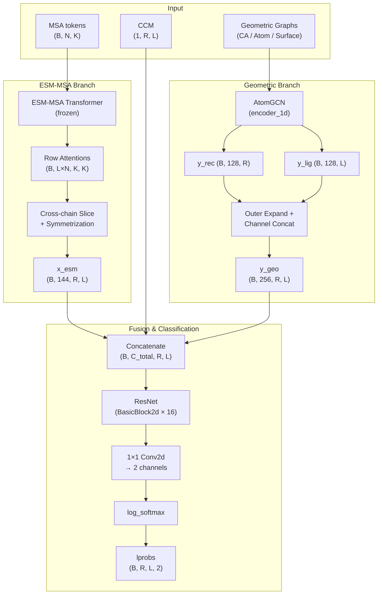

---
slug:5-msamodel-and-forward-pass
blog_type:normal
---


**MSAModel** 是 Glinter 的核心神经网络——一个二聚体界面接触预测器。它将来自 ESM-MSA Transformer 的进化注意力信号与来自多尺度蛋白质结构图的几何图嵌入进行融合，然后通过 ResNet 解析融合后的 2D 特征图，得到残基对级别的接触 logits。理解其前向传播过程，是理解每个特征通道（MSA 行注意力、共进化耦合、原子图消息和表面图消息）如何汇聚为单一二值接触概率图的关键。

来源：[msa_model.py](/glinter/models/msa_model.py#L1-L345)

## 架构概述

该模型遵循**双分支融合 → 2D ResNet → log-softmax**的拓扑结构。一个分支从冻结的 ESM-MSA-1b Transformer 中提取链间注意力模式；另一个分支通过 AtomGCN 多图网络编码每条链的 3D 结构。这两个分支均生成 2D 特征图，这些特征图沿通道维度拼接后，送入 2D 残差网络。



来源：[msa_model.py](/glinter/models/msa_model.py#L44-L78), [msa_model.py](/glinter/models/msa_model.py#L164-L246)

## 构造器：构建子模块

`__init__` 方法根据 `args.feature` 配置字符串有条件地构建三个核心子模块：

| 子模块 | 条件 | 作用 |
|---|---|---|
| `self.esm_embed` | `'esm'` in `args.feature` | 冻结的 ESM-MSA-1b，生成行注意力图 |
| `self.encoder_1d` | 启用任意图特征 | AtomGCN，编码 3D 几何结构 |
| `self.resnet` + `self.fc` | `gen_esm=False` | 2D ResNet 分类器 + 1×1 Conv2d 头 |

**嵌入维度计算**在 `embed_dim` 中递增执行：

- **ESM 注意力**：增加 **144 个通道**（12 层 × 12 个头 = 144 个行注意力图）。当 `gen_esm=True` 时，模型在 *ESM 生成模式* 下运行——它返回原始注意力张量而不构建 ResNet，用于离线预计算。
- **Pickled ESM**：从预计算的 `.esm.npz` 文件中增加 144 个通道，绕过在线 Transformer。
- **CCM（共进化耦合矩阵）**：从预计算的 CCM 张量中增加 **1 个通道**。
- **1D 编码器输出**：增加 `output_dim × 2` 个通道（128 × 2 = **256**）——受体残基和配体残基各一个 128 维向量，扩展至 2D 配对图。

汇总所有通道后，构建 2D 分类头：一个包含 16 个 `BasicBlock2d` 模块的单阶段 `ResNet`，将 `embed_dim` 投影至 96 个通道，随后接一个 1×1 `Conv2d` 将通道数从 96 映射到 2（接触 / 非接触）。

来源：[msa_model.py](/glinter/models/msa_model.py#L44-L78)

## 1D 编码器：`_build_encoder_1d`

此方法组装 `encoder_1d` 子模块，它可以是 1D ConvNet（仅用于 `ca-embed`）或 **AtomGCN** 多图网络。当存在任意几何图特征时，即激活 AtomGCN 路径：

| 特征标志 | 图类型 | `node_dim` | `edge_dim` | 特殊属性 |
|---|---|---|---|---|
| `coordinate-ca-graph` | Cα 图 | `args.node_embed_dim` (43) | 0 | `use_pos=True` |
| `distance-ca-graph` | Cα 图 | `args.node_embed_dim` (43) | 1 | `use_pos` 取决于坐标标志 |
| `atom-graph` | 全原子图 | 33 | 1 | `use_pos=True` |
| `surface-graph` | 表面网格图 | 0 | — | `use_pos=True`, `use_nor=True` |

所有图规范以字典形式收集到 `src_graphs` 中，并传递给 AtomGCN 构造器。AtomGCN 通过 `--num-1d-layers` 控制配置 `num_sa`（集抽象）块的数量，其中每个 SA 块使用来自 `--rates` 的采样率和来自 `--rs` 的半径。在默认的 `--num-1d-layers 1` 设置下，不会创建 SA/FP 块——仅运行初始的 MGGBlock（多图分组）。

来源：[msa_model.py](/glinter/models/msa_model.py#L80-L162), [atomgcn.py](/glinter/modules/atomgcn.py#L196-L273)

## 前向传播：逐步解析

### 步骤 1 — ESM-MSA 行注意力提取

当 `self.esm_embed` 不为 `None` 时，MSA 标记（`data['msa']`）在 `torch.no_grad()` 下通过冻结的 ESM-MSA Transformer。输出键 `'row_attentions'` 产生形状为 **(B, L, N, K, K)** 的张量，其中 B 为批次大小，L 为 Transformer 层数（12），N 为注意力头数（12），K 为拼接后的序列长度（受体 + 配体 + 1 个 BOS 标记）。

若 `self.prepend_bos` 为 `True`，则 BOS 标记的注意力行和列将被切除：`x = x[..., 1:, 1:]`。随后，张量从 (B, L, N, K, K) 重塑为 **(B, L×N, K, K)**，将层数和头数合并为单一的 144 通道维度。

### 步骤 2 — 跨链注意力切片

拼接的 MSA 同时包含受体（长度为 `reclen`）和配体（长度为 `liglen`）残基。**链间注意力**——即对对接有意义的信号——位于 K×K 注意力图的非对角线块中。通过 `--row-attn-op` 可使用四种切片策略：

| 操作 | 公式 | 输出形状 |
|---|---|---|
| `lower_tri` | `x[:, :, :reclen, reclen:]` | (B, 144, R, L) |
| `upper_tri` | `x[:, :, reclen:, :reclen].transpose(-2,-1)` | (B, 144, R, L) |
| **`sym`**（默认） | `x[:,:,:reclen,reclen:] + x[:,:,reclen:,:reclen].T` | (B, 144, R, L) |
| `apc` | `apc(x + x.T)[:,:,:reclen,reclen:]` | (B, 144, R, L) |

**`sym`** 操作对称化两个跨链块，确保注意力信号与哪条链“关注”另一条链无关。**`apc`** 操作额外应用了**平均乘积校正**——这是接触预测中的一种标准技术，通过减去行均值和列均值的外积来消除系统发育偏差。

<CgxTip>`apc` 函数执行原位除法（`avg.div_(a12)`）以减少内存占用。当使用 `--row-attn-op apc` 时，首先计算对称化注意力，然后进行 APC 校正，最后提取受体×配体块。</CgxTip>

在 **ESM 生成模式**（`gen_esm=True`）下，模型会断言批次大小为 1，压缩批次维度，并立即返回原始注意力张量——不再进行后续处理。

来源：[msa_model.py](/glinter/models/msa_model.py#L164-L212)

### 步骤 3 — Pickled ESM 和 CCM 特征注入

如果特征列表中包含 `'pickled-esm'`，则从 `data['esm']`（源自 `.esm.npz` 文件）加载预计算的 ESM 注意力张量。这完全绕过了在线 Transformer，以磁盘 I/O 换取 GPU 计算资源的节省。

如果启用了 `'ccm'`，则将共进化耦合矩阵 `data['ccm']`（形状为 (1, R, L)）沿通道维度与现有特征张量 `x` 拼接。

来源：[msa_model.py](/glinter/models/msa_model.py#L214-L223)

### 步骤 4 — 几何编码器前向传播

`encoder_1d_forward` 方法将几何图数据分派至 `self.encoder_1d`（即 AtomGCN）。这里执行两次独立的前向传播——一次用于受体图，一次用于配体图——以生成各残基的嵌入：

- **图组装**：根据启用的特征收集受体图 `[rec_cag, rec_atg?, rec_sug?]` 和配体图 `[lig_cag, lig_atg?, lig_sug?]`。Cα 图（`rec_cag`/`lig_cag`）始终作为 *查询* 图，提供节点特征 `x`、位置 `pos` 和局部参考系 `lrf`。
- **AtomGCN 前向传播**：调用方式为 `self.encoder_1d(cag.x, cag.pos, cag.lrf, graphs)`，产生形状为 (num_nodes, 128) 的输出。
- **重塑**：输出经解压和转置，从 (num_nodes, 128) 变为 **(1, 128, num_nodes)**。

对两条链编码完成后，逐链的 1D 嵌入通过外广播机制**扩展为 2D 配对图**：

```python
y = torch.cat(
    (
        y_rec.unsqueeze(3).expand(-1, -1, -1, liglen),  # (1, 128, R, L)
        y_lig.unsqueeze(2).expand(-1, -1, reclen, -1),  # (1, 128, R, L)
    ),
    dim=1,  # → (1, 256, R, L)
)
```

这会生成一个 (256, R, L) 通道图，其中前 128 个通道将受体残基嵌入在所有配体位置上重复，后 128 个通道将配体残基嵌入在所有受体位置上重复。`recidx` 和 `ligidx` 索引数组用于从完整的编码器输出中选择已比对的残基子集。

来源：[msa_model.py](/glinter/models/msa_model.py#L225-L277)

### 步骤 5 — ResNet 分类与 Log-Softmax

形状为 **(B, C_total, R, L)** 的完整 2D 特征张量 `x` 依次经过：

1. **ResNet**：包含 16 个 `BasicBlock2d` 残差块的单阶段网络（每个块：3×3 Conv2d → BatchNorm2d → ELU → 3×3 Conv2d → BatchNorm2d → 跳跃连接 → ELU），将 `C_total` 投影至 96 个通道。
2. **1×1 Conv2d**：将通道数从 96 降为 2（接触 / 非接触 logits）。
3. **log_softmax**：沿通道维度应用，然后从 (B, 2, R, L) 重排为 **(B, R, L, 2)**，供下游使用。

最终输出 `lprobs` 包含每个受体-配体残基对的对数概率。

来源：[msa_model.py](/glinter/models/msa_model.py#L242-L246)

## 通道预算汇总

输入 ResNet 的总通道维度取决于启用的特征组合。以下是**全特征**配置（`esm,ccm,coordinate-ca-graph,atom-graph,surface-graph`）的预算：

| 特征来源 | 通道数 | 累计通道数 |
|---|---|---|
| ESM-MSA 行注意力 | 144 | 144 |
| CCM | 1 | 145 |
| AtomGCN 受体 (128-d) | 128 | 273 |
| AtomGCN 配体 (128-d) | 128 | 401 |
| **总计 → ResNet 输入** | **401** | — |

若仅使用 `pickled-esm,ccm,distance-ca-graph`（无在线 ESM，无原子/表面图），由于 AtomGCN 每条链的输出维度仍为 128，总通道数同样降至 144 + 1 + 256 = **401**。

来源：[msa_model.py](/glinter/models/msa_model.py#L57-L77)

## 推理模式

`msa_model.py` 的 `__main__` 块演示了两种不同的推理模式：

| 模式 | 标志 | 行为 |
|---|---|---|
| **ESM 预计算** | `--generate-esm-attention` | 加载在线 ESM-MSA，以 `gen_esm=True` 模式运行，保存包含 float16 注意力数组的 `.esm.npz` 文件 |
| **接触预测** | （默认） | 加载 pickled 特征 + 可选的检查点权重，运行完整前向传播，保存包含模型输出和索引数组的 `.out.pkl` 文件 |

检查点加载路径使用 `checkpoint_utils.py` 中的 `load_state`，该函数将张量映射至 CPU 并应用 `load_state_dict(strict=True)`。

<CgxTip>运行 ESM 预计算时，`cut_msa_` 会在前向传播前将 MSA 深度限制为 128 条序列（`num_seq=128`），而预测路径则不应用此截断——预期 MSA 已在数据准备阶段完成预过滤。</CgxTip>

来源：[msa_model.py](/glinter/models/msa_model.py#L279-L345), [checkpoint_utils.py](/glinter/models/checkpoint_utils.py#L35-L41)

## APC：平均乘积校正

当选择 `--row-attn-op apc` 时，`apc` 函数是关键的信号处理步骤。它移除了注意力矩阵中由保守位置普遍吸引注意力（系统发育噪声）而产生的显著秩为 1 的分量，仅保留位置对特异性的信号：

```python
def apc(x):
    a1 = x.sum(-1, keepdims=True)    # 行和
    a2 = x.sum(-2, keepdims=True)    # 列和
    a12 = x.sum((-1, -2), keepdims=True)  # 总和
    avg = a1 * a2
    avg.div_(a12)                     # 边际乘积的外积 / 总和
    normalized = x - avg              # 减去秩为 1 的背景
    return normalized
```

这与经典基于共进化的接触预测（如 CCMpred）中使用的 APC 公式相同，此处针对 Transformer 注意力矩阵进行了适配。

来源：[msa_model.py](/glinter/models/msa_model.py#L14-L23)

## 数据流一览

下表汇总了前向传播读取的 `data` 字典中的每个键、其来源以及消费它的模型组件：

| 键 | 形状 | 来源 | 消费者 |
|---|---|---|---|
| `msa` | (B, N_seq, K) | DimerDataset（拼接的 MSA） | `self.esm_embed` |
| `reclen` | 标量 | DimerDataset | 跨链切片 |
| `liglen` | 标量 | DimerDataset | 跨链切片 |
| `esm` | (B, 144, R, L) | 预计算的 `.esm.npz` | 直接拼接至 `x` |
| `ccm` | (1, R, L) | 预计算的 `.dten` | 直接拼接至 `x` |
| `recidx` | (2, R_full) | 单体比对索引 | `y_rec` 上的残基选择 |
| `ligidx` | (2, L_full) | 单体比对索引 | `y_lig` 上的残基选择 |
| `rec_cag` / `lig_cag` | PyG Batch | `build_ca_graph` | AtomGCN 查询图 |
| `rec_atg` / `lig_atg` | PyG Batch | `build_atom_graph` | AtomGCN 源图 |
| `rec_sug` / `lig_sug` | PyG Batch | `build_surface_graph` | AtomGCN 源图 |

来源：[msa_model.py](/glinter/models/msa_model.py#L164-L246), [dimer_dataset.py](/glinter/dataset/dimer_dataset.py#L184-L279)

## 后续步骤

- 驱动几何分支的 AtomGCN 多图网络详见 [AtomGCN 多图网络](6-atomgcn-multi-graph-network)。
- 每个图核心的消息传递卷积涵盖于 [AtomConv 消息传递](7-atomconv-message-passing)。
- 有关 ESM-MSA Transformer 如何生成行注意力信号，请参见 [ESM-MSA 注意力嵌入](9-esm-msa-attention-embedding)。
- 数据字典键及其构建过程记录在 [DimerDataset 与特征加载](11-dimerdataset-and-feature-loading) 中。