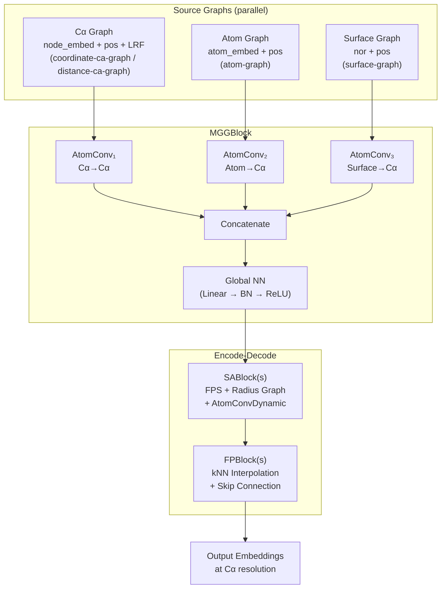
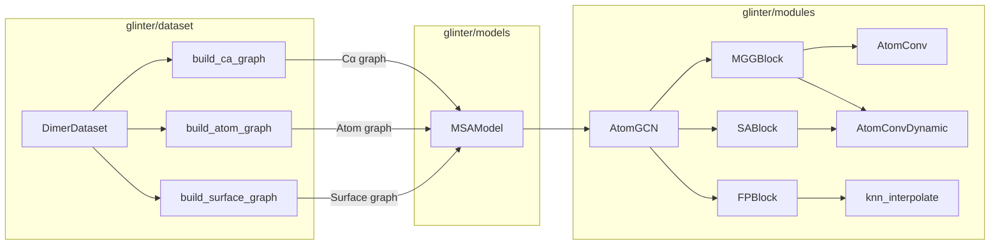

---
slug:6-atomgcn-multi-graph-network
blog_type:normal
---


**AtomGCN** 是 Glinter 中的核心几何神经网络模块，它实现了一种多图卷积架构，该架构并行聚合来自异构蛋白质表示——Cα 骨架图、全原子图和表面网格图——的结构信息，随后通过 PointNet++ 风格的编码-解码管线来精炼合并后的嵌入。其设计基于这样一个观察：蛋白质界面信号分布在多个结构尺度上：骨架几何捕捉折叠层面的模式，原子接触编码理化特异性，而表面拓扑决定空间互补性。通过在融合前经由独立的消息传递流并行处理所有三种表示，AtomGCN 避免了将这些不同模态坍缩为单一图时会产生的信息瓶颈。

来源：[atomgcn.py](glinter/modules/atomgcn.py#L1-L289), [msa_model.py](glinter/models/msa_model.py#L80-L162)

## 架构概述

AtomGCN 将三种块类型组合为一次前向传播。**MGGBlock**（多图分组块，Multi-Graph Grouping Block）在所有源图上执行并行消息传递并拼接输出。**SABlock**（集合抽象块，Set Abstraction Block）通过最远点采样（FPS）和动态半径图构建执行层次化下采样，然后聚合邻居特征。**FPBlock**（特征传播块，Feature Propagation Block）通过 k 近邻插值恢复原始分辨率，并跳跃连接来自对应 SA 层级的特征。完整的数据流如下：源图 → MGGBlock → [SABlock]×N → [FPBlock]×N → 输出。



MGGBlock 是决定性的结构基序——每个源图驱动一个独立的 `AtomConv` 实例，将消息从源节点传递到目标（Cα）节点。如果输出的总维度与目标维度不匹配，拼接后的输出可选择通过一个全局神经网络进行投影。这种“先并行后融合”的策略确保了每种结构模态在交互前发展出各自的特征空间，而不是在共享图中竞争容量。

来源：[atomgcn.py](glinter/modules/atomgcn.py#L7-L80), [atomgcn.py](glinter/modules/atomgcn.py#L196-L273)

## MGGBlock：多图分组

`MGGBlock` 由一个 `graph_kwargs` 字典列表构建而成，每个字典为一条并行卷积流指定超参数。在初始化期间，它遍历每个参数集，调用 `_build_conv_layer` 实例化一个 `AtomConv`（或 `AtomConvDynamic`），并累加输出维度。如果拼接后的总维度与 `out_dim` 不同，则会追加一个投影网络（`global_nn`）。

`_build_conv_layer` 工厂方法通过求和以下部分的贡献来计算有效的嵌入维度：源节点特征、边特征、查询节点特征（当 `use_concat=True` 时）、位置位移（当 `use_pos=True` 时为 3D）以及表面法向量（当 `use_nor=True` 时为 3D）。该嵌入维度被输入到 `local_nn`（消息网络）、可选的 `gate_nn`（sigmoid 门控调制）以及 `global_nn`（更新网络）中：

| 参数 | 对架构的影响 |
|---|---|
| `node_dim` | 源图节点特征维度；从 kwargs 中移除并用作 `src_dim` |
| `edge_dim` | 边特征维度；加入嵌入维度 |
| `local_dim` | 消息 MLP 的隐藏维度（默认 128） |
| `tgt_dim` (global_dim) | 每条流的更新 MLP 输出维度（默认 128） |
| `use_concat` | 将查询节点特征拼接到消息输入中 |
| `use_pos` | 在消息中包含 LRF 变换后的位置位移 |
| `use_nor` | 在消息中包含 LRF 变换后的表面法向量 |
| `use_gate_nn` | 启用 sigmoid 门控的消息调制 |
| `use_dynamic` | 使用 `AtomConvDynamic` 代替静态的 `AtomConv` |

在前向传播中，MGGBlock 接收一个 `Batch` 图对象元组（每个源图一个），并遍历 `(graph, conv)` 对。对于每一对，它根据卷积层是否使用位置特征，有条件地传入位置数据（`pos`、`lrf`、`nor`）。源节点特征、边索引和边嵌入通过带有 `None` 回退的 `getattr` 来获取，这使得缺少某些属性的图（例如，没有 `x` 或 `edge_embed` 的表面图）也能正常处理。每条流的输出沿特征维度拼接，并可选择通过 `global_nn` 进行投影。

来源：[atomgcn.py](glinter/modules/atomgcn.py#L7-L138)

## 源图规格

馈入 MGGBlock 的三个源图在 `MSAModel` 的 `_build_encoder_1d` 中构建，对应于不同的蛋白质结构表示。每种图类型定义了一个二分消息传递拓扑——从源节点到目标 Cα 节点——并具有特定的节点特征、边特征和几何属性。

### Cα 骨架图

**Cα 图**是主要的结构图，同时充当目标图。其节点位于 Cα 位置，嵌入由溶剂可及表面积（1D）、独热氨基酸编码（20D）、位置编码（1D）和 PSSM 分数（20D）组成——默认总计 43 维。边通过 `radius` 图搜索（默认 r=8Å）构建，连接截断距离内的 Cα。当启用 `distance-ca-graph` 时，边特征包括节点间距离。当启用 `coordinate-ca-graph` 时，位置特征（LRF 变换后的位移）将包含在消息中。在每个 Cα 处使用 N–Cα 键作为 x 轴、N–Cα–C 平面法向量作为 z 轴计算**局部参考系**（LRF），产生逐节点旋转矩阵，确保 SE(3) 等变的坐标编码。

### 全原子图

**原子图**在每个重原子位置放置节点。节点嵌入由独热原子类型编码（重原子为 12D）、溶剂可及表面积（1D）和残基层面的独热氨基酸编码（20D）组成，总计 33 维。二分边结构在半径截断内将所有原子（源）连接到 Cα 位置（目标），具有单一的二元边特征，指示原子和 Cα 是否属于同一残基。该图捕捉了在 Cα 分辨率下不可见的原子级理化上下文——侧链方向、氢键几何和空间位阻。

### 表面网格图

**表面图**由 MSMS 计算的溶剂排除表面顶点构建。它不携带节点特征（`node_dim=0`）——其信息纯粹是几何性的，通过表面法向量（`nor`，3D）和相对于目标 Cα 节点的位置位移（`pos`，3D）编码。边在更小的半径（默认 r=4Å）内连接表面顶点与 Cα 位置。该图将蛋白质的形状互补信号直接传导至 Cα 嵌入中，这对界面预测至关重要，因为互补是一种表面级现象。

| 图 | 源节点 | 节点维度 | 边维度 | 位置 | 法向量 | 半径 |
|---|---|---|---|---|---|---|
| Cα 骨架 | Cα 原子 | 43 | 0 或 1 | ✓ (LRF) | ✗ | 8Å |
| 全原子 | 所有的重原子 | 33 | 1 | ✓ (LRF) | ✗ | 8Å |
| 表面网格 | 表面顶点 | 0 | 0 | ✓ (LRF) | ✓ (LRF) | 4Å |

来源：[_geometric_graph.py](glinter/dataset/_geometric_graph.py#L42-L259), [msa_model.py](glinter/models/msa_model.py#L105-L141), [utils.py](glinter/points/utils.py#L36-L48)

## SABlock：集合抽象

`SABlock` 使用 `AtomConvDynamic` 实现层次化点云抽象，后者在运行时动态构建图。前向传播应用最远点采样（FPS）按指定 `rate` 对目标点云进行下采样，然后在源位置和下采样后的目标位置之间构建半径为 `r`、最大邻居数为 `k` 的半径图。消息使用 LRF 变换后的位置位移进行计算，经过聚合（默认：max）后传递通过更新网络。

FPS 步骤选择一个近似均匀分布的代表点子集，在保留几何覆盖的同时降低计算成本。随后在下采样点集上构建的半径图有效地增大了感受野——每条消息现在聚合了更粗尺度上更大空间邻域的信息。堆叠多个 SABlock 会创建类似于 PointNet++ 中编码器的多尺度层次结构。

来源：[atomgcn.py](glinter/modules/atomgcn.py#L141-L167), [atomconv.py](glinter/modules/atomconv.py#L135-L202)

## FPBlock：特征传播

`FPBlock` 使用 PyTorch Geometric 的 `knn_interpolate` 进行 k 近邻插值，将特征从下采样（抽象后）的点集插值回更密集的点集，从而恢复原始点分辨率。然后，它将插值后的特征与来自对应编码器层级的跳跃连接特征（如果提供）拼接，并通过一个共享 MLP（`Linear → BatchNorm → ReLU`）进行投影。

跳跃连接至关重要：若没有它，解码器将需要仅从粗糙的抽象中重建精细的空间细节，而这会造成信息损失。通过在相同分辨率下拼接编码器的中间特征，FPBlock 在整合抽象期间学到的全局上下文表示的同时，保留了局部结构信号。FPBlock 的数量与 SABlock 的数量相匹配，并以相反的顺序应用——从最粗的抽象返回到原始分辨率。

来源：[atomgcn.py](glinter/modules/atomgcn.py#L169-L194), [atomgcn.py](glinter/modules/atomgcn.py#L257-L273)

## AtomGCN 前向传播

`AtomGCN.forward` 方法编排了完整的编码-解码管线。它接收查询（Cα）节点特征 `x`、位置 `pos`、局部参考系 `lrf` 以及一个源图元组 `src_graphs`：

1. **多图聚合**：`x = self.src_block(x, src_graphs, pos, lrf)` —— MGGBlock 将消息从所有源图并行传递到 Cα 节点，拼接并投影结果。
2. **集合抽象**（若 `num_sa > 0`）：迭代 SABlocks，每一层返回更新后的 `(x, pos, lrf)`。若启用了特征传播，则存储中间的 `(x, pos)` 对以供跳跃连接使用。
3. **特征传播**（若 `use_fp=True`）：反向迭代 FPBlocks，从较粗分辨率插值到较细分辨率，并拼接跳跃连接。

当 `num_sa = 0` 时，AtomGCN 退化为一个没有层次处理的纯多图聚合模块。当 `use_fp = False` 时，仅应用集合抽象编码器，返回最粗分辨率的特征以及位置和 LRF——适用于需要全局而非逐残基表示的任务。

```python
# Simplified forward flow
def forward(self, x, pos, lrf, src_graphs):
    x = self.src_block(x, src_graphs, pos=pos, lrf=lrf)  # MGGBlock
    ags = [(x, pos)]  # store for skip connections
    for sa in self.sa_blocks:
        x, pos, lrf = sa(x, pos, lrf)  # set abstraction
        ags.append((x, pos))
    for i, fp in enumerate(self.fp_blocks):
        y, pos_y = ags[-i-2]  # skip connection target
        x = fp(x, pos_x, pos_y, y)  # feature propagation
        pos_x = pos_y
    return x  # per-Cα embeddings
```

来源：[atomgcn.py](glinter/modules/atomgcn.py#L196-L273)

## 来自 MSAModel 的配置

`MSAModel._build_encoder_1d` 方法根据由 `DimerFeature` 解析的特征字符串动态配置 AtomGCN。它通过检查特征标志并追加相应的图规格字典来构建 `src_graphs` 列表：

| 特征标志 | 添加的图 | 配置 |
|---|---|---|
| `coordinate-ca-graph` | Cα 图 | `use_pos=True`, `edge_dim=0` |
| `distance-ca-graph` | Cα 图 | `use_pos=True`, `edge_dim=1` |
| `atom-graph` | 原子图 | `node_dim=33`, `use_pos=True`, `use_concat=True`, `edge_dim=1` |
| `surface-graph` | 表面图 | `node_dim=0`, `use_pos=True`, `use_nor=True`, `use_concat=True` |

当 `coordinate-ca-graph` 和 `distance-ca-graph` 同时存在时，会添加一个带有 `use_pos=True` 和 `edge_dim=1` 的单一 Cα 图条目。SABlock/FPBlock 层的数量由 `num_1d_layers`（默认为 1）控制，其中 `num_sa = num_layers - 1`。每个 SA 层的采样率和半径取自 `--rates` 和 `--rs` CLI 参数。当 `num_1d_layers = 1` 时，AtomGCN 作为没有任何 SA/FP 层级结构的纯 MGGBlock 运行，这也是默认配置。

<CgxTip>默认配置（`num_1d_layers=1`）运行不带 SA/FP 块的 AtomGCN，使其成为纯多图消息传递模块。增加 `num_1d_layers` 会添加层次化点云处理，但需要匹配长度为 `num_layers - 1` 的 `--rates` 和 `--rs` 列表。</CgxTip>

来源：[msa_model.py](glinter/models/msa_model.py#L80-L162), [_feature.py](glinter/dataset/_feature.py#L1-L36)

## 集成到预测管线

在 `MSAModel.encoder_1d_forward` 中，AtomGCN 分别针对受体链和配体链调用。每条链的源图由批数据组装而成：`rec_cag`/`lig_cag`（Cα 图）、`rec_atg`/`lig_atg`（原子图）和 `rec_sug`/`lig_sug`（表面图）。Cα 图的节点特征（`x`）、位置（`pos`）和局部参考系（`lrf`）作为主要输入，而图的完整列表作为 `src_graphs` 传入：

```python
# Per-chain invocation (simplified)
y_rec = self.encoder_1d(rec_cag.x, rec_cag.pos, rec_cag.lrf, rec_graphs)
y_lig = self.encoder_1d(lig_cag.x, lig_cag.pos, lig_cag.lrf, lig_graphs)
```

输出嵌入被转置为 `(batch, feature_dim, num_residues)` 格式，随后通过外扩展进行组合：受体特征沿配体维度广播，反之亦然，然后拼接成形状为 `(1, 2×output_dim, L_rec, L_lig)` 的成对特征张量。该成对表示随后由 2D ResNet 和最终卷积处理，以生成逐残基对的接触 logits。

<CgxTip>`encoder_1d_forward` 对每条链独立应用 AtomGCN，因此受体和配体共享权重，但处理互不相交的几何图。编码后的成对外扩展创造了馈入 ResNet 的跨链交互信号。</CgxTip>

来源：[msa_model.py](glinter/models/msa_model.py#L248-L277), [msa_model.py](glinter/models/msa_model.py#L225-L246)

## 模块依赖图

下图展示了 AtomGCN 的内部模块组成及其与更广泛模型的关系：



来源：[atomgcn.py](glinter/modules/atomgcn.py#L1-L6), [msa_model.py](glinter/models/msa_model.py#L10-L11)

## 后续步骤

`AtomConv` 和 `AtomConvDynamic` 内部的消息传递机制——包括 LRF 变换的位置编码、门控消息调制和动态图构建——详见 [AtomConv 消息传递](7-atomconv-message-passing)。从原始 PDB 数据构建三种源图类型的过程在 [几何图构建](8-geometric-graph-construction) 中涵盖。有关从 MSA 注意力经 AtomGCN 到成对评分的完整模型级数据流，请参阅 [MSAModel 与前向传播](5-msamodel-and-forward-pass)。