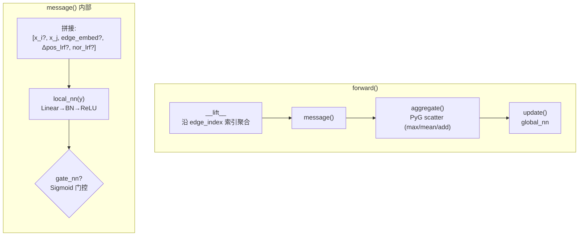
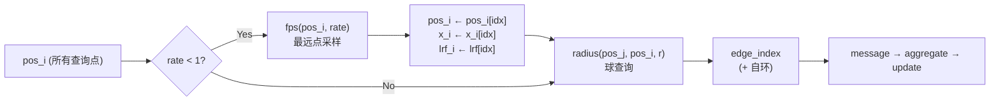

---
slug:7-atomconv-message-passing
blog_type:normal
---


**AtomConv** 是 Glinter 蛋白质界面预测核心的几何消息传递原语。它基于 PyTorch Geometric 的 `MessagePassing` 框架构建，引入了**局部参考系 (LRF)**，将所有位置信号投影到每个目标残基的内在坐标系中——从而无需数据增强即可实现旋转等变的消息传递。它存在两种变体：`AtomConv` 在预构建的静态图上运行；而 `AtomConvDynamic` 通过球查询和最远点采样动态构建邻域，实现了 [AtomGCN 多图网络](6-atomgcn-multi-graph-network) 中使用的 PointNet++ 风格的集合抽象。

来源: [atomconv.py](/glinter/modules/atomconv.py#L1-L6)

## 架构概述

单个 `AtomConv` 层内的完整消息传递流水线遵循四阶段模式——**提升 → 消息 → 聚合 → 更新**——关键的几何变换发生在消息阶段：



**提升** 操作沿边索引收集源节点和目标节点特征，生成逐边张量。随后，**消息** 函数通过拼接最多五个信号通道来组装每个边的特征向量，通过 `local_nn` 对其进行变换，可选择应用 Sigmoid 门控，并返回结果。聚合操作将逐边消息散射回逐节点表示，最后 `global_nn` 生成最终的输出嵌入。

来源: [atomconv.py](/glinter/modules/atomconv.py#L40-L86)

## 基于 LRF 的旋转等变位置编码

AtomConv 的核心创新在于其 **局部参考系** 机制。AtomConv 并非将原始的欧几里得位移向量（具有旋转差异性）输入网络，而是将每个位移投影到 *目标* 节点的局部坐标系中：

$$\Delta\mathbf{p}_{\text{lrf}} = (\mathbf{p}_j - \mathbf{p}_i) \cdot \mathbf{R}_i$$

其中 $\mathbf{R}_i \in \mathbb{R}^{3 \times 3}$ 是目标节点 $i$ 处的 LRF。相同的投影也应用于曲面法向量：$\hat{\mathbf{n}}_{\text{lrf}} = \mathbf{n}_j \cdot \mathbf{R}_i$。

### LRF 构建

局部参考系使用 `compute_centered_lrf` 从每个残基的主链几何结构中构建：

| 轴 | 推导 | 几何意义 |
|------|-----------|-------------------|
| **x** | $\widehat{\text{CA} \to \text{C}}$ | 沿肽链方向指向 |
| **z** | $\widehat{(\text{C}-\text{CA}) \times (\text{N}-\text{CA})}$ | 垂直于肽平面 |
| **y** | $\mathbf{x} \times \mathbf{z}$ | 构成右手系 |

这确保了整个蛋白质结构的任意旋转会同时同等旋转位移向量和 LRF，因此投影坐标 $\Delta\mathbf{p}_{\text{lrf}}$ 保持 **不变**——无论全局朝向如何，网络看到的输入都是相同的。

来源: [utils.py](/glinter/points/utils.py#L36-L48), [atomconv.py](/glinter/modules/atomconv.py#L100-L107)

## 五个信号通道

`message()` 方法通过拼接最多五个独立的信号通道来组装逐边特征向量。每个通道由构造函数标志控制：

| 通道 | 标志 | 每边形状 | 描述 |
|---------|------|---------------|-------------|
| 目标节点特征 | `use_concat` | `d_query` | 来自目标节点 $x_i$ 的残差连接 |
| 源节点特征 | *(始终启用)* | `d_source` | 源节点 $x_j$ 的特征 |
| 边嵌入 | *(若提供)* | `d_edge` | 标量/几何边属性（例如，距离，残基归属） |
| LRF 投影位移 | `use_pos` | 3 | $(\mathbf{p}_j - \mathbf{p}_i) \cdot \mathbf{R}_i$ |
| LRF 投影法向量 | `use_nor` | 3 | $\mathbf{n}_j \cdot \mathbf{R}_i$ (曲面法向量) |

拼接顺序是固定且重要的：`[x_i?, x_j, edge_embed?, Δpos_lrf?, nor_lrf?]`。`local_nn` 的输入维度必须涵盖所有启用的通道。该维度在 `MGGBlock._build_conv_layer()` 中动态计算，该方法会检查图配置以推导出 `embed_dim = src_dim + edge_dim + (query_dim if use_concat) + (3 if use_pos) + (3 if use_nor)`。

来源: [atomconv.py](/glinter/modules/atomconv.py#L88-L125), [atomgcn.py](/glinter/modules/atomgcn.py#L82-L98)

## 三阶段神经网络流水线

每条消息在聚合前都会经过一个三阶段神经网络流水线：

### 阶段 1 — local_nn (特征变换)

```python
local_nn = nn.Sequential(
    nn.Linear(embed_dim, local_dim),   # embed_dim = 活跃通道之和
    nn.BatchNorm1d(local_dim),
    nn.ReLU(),
)
```

将异构拼接映射到统一的隐藏空间。BatchNorm1d 在批次的边上进行归一化，稳定了在大小差异巨大的蛋白质间的训练过程。

### 阶段 2 — gate_nn (可选 Sigmoid 门控)

当 `use_gate_nn=True` 时，一个独立通路会产生 Sigmoid 值门控：

```python
gate_nn = nn.Sequential(
    nn.Linear(embed_dim, local_dim),
    nn.BatchNorm1d(local_dim),
    nn.Sigmoid(),    # ← 与 local_nn 的关键区别
)
# 门控输出: f = gate_nn(y) * local_nn(y)
```

这是一种 **逐元素注意力** 机制：每个特征维度独立学习是传递还是抑制其信号。与针对邻居的 Softmax 注意力不同，这种门控以 *逐边、逐维度* 的方式操作——它控制流动的信息内容，而非选择关注的邻居。

### 阶段 3 — global_nn (聚合后变换)

```python
global_nn = nn.Sequential(
    nn.Linear(local_dim, global_dim),
    nn.BatchNorm1d(global_dim),
    nn.ReLU(),
)
```

在聚合后的 `update()` 步骤中应用，将池化后的邻域表示投影到输出维度。

来源: [atomconv.py](/glinter/modules/atomconv.py#L116-L133), [atomgcn.py](/glinter/modules/atomgcn.py#L100-L119)

## AtomConv — 静态图变体

`AtomConv` 在 **预计算的边索引** 上运行，当图拓扑固定时（例如，在预处理期间构建的 CA 原子图、原子到 CA 图和表面到 CA 图），它是合适的选择。其 `forward` 签名从外部接收所有几何量：

```python
def forward(self, x, edge_index, edge_embed=None, pos=None, lrf=None, nor=None):
```

双源元组模式 `(x_j, x_i)` 实现了 **异构消息传递**，即源图和目标图可以具有不同的特征维度——例如，表面顶点（无节点特征，仅有法向量）向 CA 原子传递消息。提升操作使用 `index_select` 沿边索引收集特征，并对带有额外矩阵维度的 LRF 张量显式重写了 `node_dim`。

来源: [atomconv.py](/glinter/modules/atomconv.py#L8-L86)

## AtomConvDynamic — 动态图变体

`AtomConvDynamic` 通过 **动态邻域构建** 扩展了 `AtomConv`，实现了 PointNet++ 集合抽象的核心。它用两种几何操作替代了外部的 `edge_index`：



### 最远点采样 (FPS)

当 `rate < 1` 时，FPS 选择在空间上最大分散的目标节点子集，`ratio` 控制保留的比例。这会在连续的 SA 块中逐步粗化点云——这是多尺度集合抽象层次的标志性特征。`random_start` 标志与 `self.training` 绑定，确保在推理时进行确定性采样。

### 球查询 (半径图)

来自 `torch_cluster` 的 `radius()` 函数寻找每个（采样后的）目标节点距离 `r` 内的所有源节点，`max_num_neighbors=k` 限制了邻域大小。当 `k > 0` 时，会在移除偶然自环后显式添加自环，确保每个节点在聚合期间能接收到自身的特征。

### 主要构造参数

| 参数 | 默认值 | 作用 |
|-----------|---------|------|
| `rate` | 1.0 | FPS 采样比例；1.0 = 不进行下采样 |
| `r` | 12.0 | 球查询半径 (埃) |
| `k` | -1 | 每次查询的最大邻居数；-1 = 无限制 |
| `aggr` | 'max' | Scatter 归约方式: max, mean 或 add |

来源: [atomconv.py](/glinter/modules/atomconv.py#L135-L202)

## 提升中的 LRF 维度处理

一个微妙但关键的实现细节：`__lift__` 方法对不同类型的张量使用不同的 `node_dim` 值。标准节点特征 (`x_j`, `x_i`) 使用 `node_dim=0`（节点轴是第一维度）。然而，LRF 张量的形状为 `(N, 3, 3)`——节点轴是第一维度，但尾部的 `(3, 3)` 是旋转矩阵。在 `AtomConv.forward` 中，LRF 提升显式指定 `node_dim=0`，而 `AtomConvDynamic.forward` 使用 `node_dim=-3`，以正确索引节点维度同时保留尾部的矩阵结构。这种区分至关重要：不正确的 `node_dim` 会打乱旋转矩阵并破坏等变性。

来源: [atomconv.py](/glinter/modules/atomconv.py#L27-L38), [atomconv.py](/glinter/modules/atomconv.py#L65), [atomconv.py](/glinter/modules/atomconv.py#L192)

## 与多图架构的集成

AtomConv 从未被孤立使用——它在 [AtomGCN 多图网络](6-atomgcn-multi-graph-network) 中由 `MGGBlock._build_conv_layer()` 实例化。每个源图（CA 图、原子图、表面图）都接收自己的 `AtomConv` 实例，其通道标志根据图类型进行设置：

| 图类型 | `use_pos` | `use_concat` | `use_nor` | `edge_dim` |
|-----------|-----------|-------------|-----------|-----------|
| CA 坐标图 | True | True | False | 0 |
| CA 距离图 | True | True | False | 1 |
| 原子图 | True | True | False | 1 |
| 表面图 | True | True | True | 0 |

并行的 `AtomConv` 输出被拼接，并可选地通过融合 `global_nn` (Linear → BN → ReLU)，将拼接后的多图表示投影到目标输出维度。

<CgxTip>为 AtomConv 配置新的源图时，传递给 `local_nn` 的 `embed_dim` 必须与所有活跃通道维度的总和完全匹配。`MGGBlock._build_conv_layer()` 方法会自动计算此值——务必通过 `graph_kwargs` 配置添加新的通道类型，而非手动构建 `AtomConv` 实例，以避免维度不匹配导致静默产生错误结果。</CgxTip>

<CgxTip>选择 `aggr='max'` 作为默认聚合方式是针对蛋白质结构深思熟虑的结果：最大池化对邻域顺序具有不变性，且对生物图中高度可变的节点度数具有鲁棒性（表面区域邻域密集，埋藏残基邻域稀疏）。在不调整学习率的情况下切换为 `'mean'` 可能会降低低度数节点上的性能。</CgxTip>

来源: [atomgcn.py](/glinter/modules/atomgcn.py#L82-L138), [msa_model.py](/glinter/models/msa_model.py#L105-L141)

## 等距采样工具

该模块包含一个 `spaced_sampling()` 函数，提供了 FPS 的确定性替代方案——它以 `step = 1 / (1 - rate)` 的常规索引间隔选择节点。目前在 `AtomConvDynamic.forward` 中该函数已被注释掉以优先使用 FPS，但在需要无随机性可复现的场景下仍然可用。