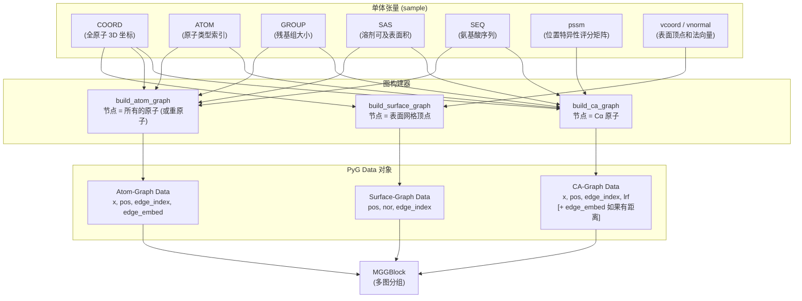

---
slug:8-geometric-graph-construction
blog_type:normal
---


Glinter 构建了**三种不同的几何图类型**——CA-graph、atom-graph 和 surface-graph——每种图都编码了蛋白质单体的不同结构分辨率。这些图作为 [AtomGCN Multi-Graph Network](6-atomgcn-multi-graph-network) 的空间骨架，消息传递在其中并行运作。整个构建流程位于单个模块中，并由 [DimerDataset and Feature Loading](11-dimerdataset-and-feature-loading) 系统通过特征配置字符串（如 `coordinate-ca-graph`、`atom-graph` 和 `surface-graph`）进行驱动。

来源: [_geometric_graph.py](/glinter/dataset/_geometric_graph.py#L1-L292), [_feature.py](/glinter/dataset/_feature.py#L1-L36)

## 架构概述

这三种图构建器共享共同的架构基因：每个构建器都从预处理后的单体张量（`sample`）中提取坐标，可选地应用随机 SO(3) 旋转进行数据增强，通过 `torch_cluster.radius` 计算基于半径的邻域，并返回一个 `torch_geometric.data.Data` 对象。它们的区别在于**什么构成节点**、**如何连边**以及**在节点和边上嵌入什么信息**。



来源: [_geometric_graph.py](/glinter/dataset/_geometric_graph.py#L42-L259), [dimer_dataset.py](/glinter/dataset/dimer_dataset.py#L189-L230)

## 特征配置与图选择

`DimerFeature` 类充当**特征守门人**，解析逗号分隔的字符串来决定构建哪些图。与几何图相关的有效特征组如下：

| 特征字符串 | 构建的图 | 核心作用 |
|---|---|---|
| `coordinate-ca-graph` | 带有 LRF 的 CA-graph (无边距离) | 启用基于位置的等变消息 |
| `distance-ca-graph` | 带有 LRF + 边距离 的 CA-graph | 为边嵌入添加标量距离 |
| `ca-embed` | 仅 CA-节点嵌入 (无图) | 返回扁平嵌入，不进行消息传递 |
| `atom-graph` | Atom-graph (包括 H 在内的所有原子) | 完整的原子级邻域 |
| `heavy-atom-graph` | Atom-graph (去除氢原子) | 仅重原子邻域 |
| `surface-graph` | Surface-graph | 带有法向量的网格顶点邻域 |

一个关键的相互作用：`distance-ca-graph` **强制** `only_embed=False`，而 `ca-embed` **强制** `use_distance_graph=False`。这些是互斥的模式——你要么获得用于消息传递的完整图，要么获得用于 1D 卷积的扁平嵌入张量。

来源: [_feature.py](/glinter/dataset/_feature.py#L1-L36), [_geometric_graph.py](/glinter/dataset/_geometric_graph.py#L42-L50)

## CA-Graph: 残基级几何图

**CA-graph** (`build_ca_graph`) 是主要的图结构。每个**节点都是一个 Cα 原子**，代表一个残基。其构建过程分为四个连续阶段：

### 阶段 1 — 坐标提取与旋转

所有原子的坐标以 `float32` 格式加载，然后可选地应用随机旋转矩阵。这种 SO(3) 增强在训练期间至关重要——`DimerDataset` 为受体和配体独立调用 `get_random_rotmat(3)`，确保每个单体接收不同的随机旋转。

```python
coords = sample['COORD'].to(torch.float32)
if rotmat is not None:
    coords = torch.matmul(
        coords.unsqueeze(1), rotmat.unsqueeze(0)
    ).squeeze(1)
```

旋转应用于**所有原子**，在提取任何 Cα 之前，这保证了共享相同 `rotmat` 的所有下游图的几何一致性。

来源: [_geometric_graph.py](/glinter/dataset/_geometric_graph.py#L53-L57), [dimer_dataset.py](/glinter/dataset/dimer_dataset.py#L195-L201)

### 阶段 2 — 节点嵌入组装

CA-graph 节点嵌入是四个特征通道的 **43 维拼接**：

| 组件 | 维度 | 来源 | 描述 |
|---|---|---|---|
| SAS | 1 | `sum_over_sas(sas, group)` | 每个残基的溶剂可及表面积 |
| AA one-hot | 21 | `encode_aa1(seq, onehot=True)` | 20 种标准氨基酸 + 未知氨基酸 'X' |
| 位置编码 | 1 | `arange(L) / L` | 归一化序列位置 |
| PSSM | 20 | `sample['pssm']` via `alnidx` | 位置特异性评分矩阵 |

SAS 聚合使用 `torch_scatter.segment_csr` 将每个原子的 SAS 值求和为每个残基的值，由记录每个残基包含多少个原子的 `GROUP` 张量引导。PSSM 通过比对索引（`srcidx`、`tgtidx`）进行映射，这些索引将 PDB 序列位置与 MSA 序列位置连接起来——这就是进化信息与结构坐标之间的桥梁。

来源: [_geometric_graph.py](/glinter/dataset/_geometric_graph.py#L63-L87), [encoding_utils.py](/glinter/protein/encoding_utils.py#L76-L94)

### 阶段 3 — 半径图构建

边使用 Cα 坐标上的**半径邻域**形成：

```python
col, row = radius(ca_coords, ca_coords, r, max_num_neighbors=k)
edge_index = torch.stack((row, col,), dim=0)  # (src, tgt)
```

默认半径为 **r=8Å**（可通过 `--cag-radius` 配置），`k` 默认为 Cα 原子的总数（无界邻域）。来自 `torch_cluster` 的 `radius` 函数返回所有满足 `‖pos_j - pos_i‖ ≤ r` 的对 (j, i)，生成一个有向图，其中 `edge_index[0]` 是源（邻居），`edge_index[1]` 是目标（中心）。

来源: [_geometric_graph.py](/glinter/dataset/_geometric_graph.py#L94-L98), [dimer_dataset.py](/glinter/dataset/dimer_dataset.py#L120-L121)

### 阶段 4 — 局部参考系 (LRF)

**局部参考系**是关键的等变机制。对于每个残基，由骨架原子构建一个正交的 3×3 参考系：

```
x 轴:  归一化(Cα → C 方向)
z 轴:  归一化((Cα→C) × (Cα→N))
y 轴:  x × z
```

这创建了一个**逐节点坐标系**，[AtomConv Message Passing](7-atomconv-message-passing) 模块使用它通过 `matmul((pos_j - pos_i), lrf_i)` 将位移向量 `pos_j - pos_i` 转换到节点 *i* 的局部坐标系中。这确保了消息函数是 **SE(3) 等变的**——旋转输入会相应地旋转输出，因为 LRF 随结构一起旋转。

来源: [_geometric_graph.py](/glinter/dataset/_geometric_graph.py#L100-L103), [utils.py](/glinter/points/utils.py#L36-L48)

### CA-Graph 输出变体

该函数具有由 `only_embed` 和 `use_distance_graph` 标志控制的三种返回模式：

| 模式 | 条件 | 返回类型 | 字段 |
|---|---|---|---|
| 仅嵌入 | `only_embed=True` | `Tensor (L×43)` | 节点嵌入 (无图) |
| 坐标 CA-graph | 默认 | `Data` | `x, pos, edge_index, lrf` |
| 距离 CA-graph | `use_distance_graph=True` | `Data` | `x, pos, edge_index, lrf, edge_embed` |

在距离模式下，`edge_embed` 是逐边的标量 `‖pos_j - pos_i‖`，在等变位置编码之外提供显式的距离信息。

来源: [_geometric_graph.py](/glinter/dataset/_geometric_graph.py#L91-L143)

## Atom-Graph: 全原子几何图

**atom-graph** (`build_atom_graph`) 在**全原子分辨率**下运行。每个节点是一个单独的原子（而不是残基），边将原子连接到附近的 Cα 中心——形成从原子到残基锚点的**类似二部图的结构**。

### 节点嵌入

atom-graph 节点嵌入拼接了三个通道：

| 组件 | 维度 | 描述 |
|---|---|---|
| 原子类型 one-hot | 11 | CA, N, C, CB, O, NX, CX, OX, SX, HX, X |
| SAS | 1 | 每个原子的溶剂可及表面积 |
| 残基类型 one-hot | 21 | 继承自父残基 |

残基类型通过由 `GROUP` 字段构建的 `residue_index` 张量传播到每个原子——这是一个将每个原子映射到其父残基索引的向量。这使得模型能够区分，例如，缬氨酸中的 Cβ 和丙氨酸中的 Cβ。

### 边构建与嵌入

半径查询是**非对称的**：`radius(coords, ca_coords, r)` 查找每个 Cα 中心半径 `r` 内的所有原子（默认 **r=6Å**，通过 `--atg-radius` 设置）。这围绕每个残基锚点创建了一个星型拓扑。

边嵌入是一个**单一的二值特征**，指示原子和 Cα 是否属于同一残基：

```python
residue_edge_embed = (
    residue_index.index_select(0, edge_index[1]) == edge_index[0]
)
```

这种残基内标志允许 [AtomConv](7-atomconv-message-passing) 层区分共价键邻居和空间邻居，这对于分别学习骨架几何和非共价堆积相互作用至关重要。

### 氢原子去除

当指定 `heavy-atom-graph` 时，所有类型为 `HX` 的原子会在图构建之前被过滤掉，从而减少携带极少结构信息的氢原子位置的噪声。

来源: [_geometric_graph.py](/glinter/dataset/_geometric_graph.py#L145-L215), [dimer_dataset.py](/glinter/dataset/dimer_dataset.py#L210-L220)

## Surface-Graph: 分子表面图

**surface-graph** (`build_surface_graph`) 在由 MSMS 计算的**蛋白质溶剂排除表面**上运行（参见 [Surface Computation with MSMS](16-surface-computation-with-msms)）。节点是带有相关法向量的**表面网格顶点**。

### 结构

surface-graph 是三种图中最轻量的：

| 字段 | 类型 | 描述 |
|---|---|---|
| `pos` | `(V, 3)` float32 | 表面顶点坐标 |
| `nor` | `(V, 3)` float32 | 每个顶点处的外向表面法向量 |
| `edge_index` | `(2, E)` long | 从顶点到 Cα 中心的半径边 |

与其他图的显著区别：
- **无节点特征 (`x`)**——表面图完全依赖位置和法向量
- **无边嵌入**——几何信息通过位置和法向量编码
- **无 LRF**——法向量代替其作为方向参考
- **二部边**——`radius(vcoords, ca_coords, r)` 将表面顶点连接到 Cα 锚点（默认 **r=6Å**，通过 `--sug-radius` 设置）

法向量被 [AtomConv](7-atomconv-message-passing) 通过 `use_nor=True` 标志消费，该标志将源法向量转换到目标 LRF 中：`matmul(nor_j, lrf_i)`。这提供了一种**等变表面几何编码**，捕获了蛋白质边界的局部形状。

来源: [_geometric_graph.py](/glinter/dataset/_geometric_graph.py#L217-L259), [dimer_dataset.py](/glinter/dataset/dimer_dataset.py#L222-L230)

## 模型对图的消费

这三种图通过 `DimerDataset.getitem()` 和 `MSAModel.encoder_1d_forward()` 中的精确流程流入模型：

1. **数据集构建图**，分别针对受体和配体独立进行，各自拥有独立的随机旋转
2. **整理器通过** `Batch.from_data_list()` **将它们批处理**为 PyG `Batch` 对象
3. **MSAModel 将源图收集**为有序元组：`(rec_cag, rec_atg, rec_sug)` 和 `(lig_cag, lig_atg, lig_sug)`
4. **AtomGCN.forward()** 将这些元组传递给 `MGGBlock`，后者运行并行的 `AtomConv` 层——每个源图对应一个
5. 每个 `AtomConv` 通过 `getattr()` 调用提取图特定的字段（`x`、`edge_index`、`edge_embed`、`pos`、`nor`），使得消息传递在层级别上是**与图无关的**

CA-graph 始终作为**查询图**（为外部 `AtomGCN.forward()` 提供 `x`、`pos`、`lrf`），而 atom-graph 和 surface-graph 作为**源图**将信息传播到 Cα 节点中。这创建了一种**多分辨率层级池化**方案：原子细节和表面几何被聚合到残基级表示中。

来源: [dimer_dataset.py](/glinter/dataset/dimer_dataset.py#L189-L230), [msa_model.py](/glinter/models/msa_model.py#L248-L277), [atomgcn.py](/glinter/modules/atomgcn.py#L48-L80)

## 数据增强与缓存

两种增强策略与图构建交互：

**随机旋转**：每个单体接收一个独立的 `get_random_rotmat(3)`——一个随机 SO(3) 旋转，通过在 [−180°, 180°] 均匀角度下围绕每个轴合成旋转来采样。相同的旋转矩阵在给定单体的所有图类型之间共享（作为 `rotmat` 传递给所有三个构建器），以保持几何一致性。

**高斯噪声**：在训练期间设置 `--add-gaussian-noise` 时，`add_gaussian_noise(pos, std=0.5)` 会在构建后扰乱所有图的位置。这在数据集级别通过深拷贝操作，以避免改变缓存的图。

图在首次构建后被**缓存**在 `self.dataset[i]` 中。在后续访问中，直接返回缓存的特征，并且（如果启用）将噪声应用于深拷贝。

<CgxTip>随机旋转在图构建**之前**应用（在每个构建器内部），而高斯噪声在图构建**之后**应用（在数据集获取器内部）。这意味着半径邻域和 LRF 是在旋转后——但未加噪声的——坐标上计算的，这保持了邻域结构的几何有效性。</CgxTip>

来源: [dimer_dataset.py](/glinter/dataset/dimer_dataset.py#L129-L168), [utils.py](/glinter/points/utils.py#L8-L34)

## 对比总结

| 属性 | CA-Graph | Atom-Graph | Surface-Graph |
|---|---|---|---|
| **节点** | Cα 原子 (每残基 1 个) | 所有的原子 (每残基约 6–16 个) | 表面网格顶点 |
| **节点维度** | 43 | 33 | 0 (仅 pos + nor) |
| **边类型** | Cα ↔ Cα (对称) | Atom → Cα (非对称) | Vertex → Cα (非对称) |
| **默认半径** | 8Å | 6Å | 6Å |
| **LRF** | ✅ 骨架衍生 | ❌ | ❌ (使用法向量) |
| **边嵌入** | 可选距离 | 残基内标志 | 无 |
| **等变性** | LRF 转换位移 | 基于位置 | 法向量 + 位置 |
| **模型中的角色** | 查询图 + 源图 | 仅源图 | 仅源图 |

来源: [_geometric_graph.py](/glinter/dataset/_geometric_graph.py#L42-L259)

## 后续步骤

此处构建的几何图将被等变消息传递层消费，相关文档见 [AtomGCN Multi-Graph Network](6-atomgcn-multi-graph-network) 和 [AtomConv Message Passing](7-atomconv-message-passing)。对于生成输入张量（`COORD`、`GROUP`、`SAS` 等）的流程，请参见 [Feature Tensor Assembly](17-feature-tensor-assembly)。对于 surface-graph 使用的表面顶点数据（`vcoord`、`vnormal`），请参见 [Protein Surface Mesh Processing](10-protein-surface-mesh-processing)。