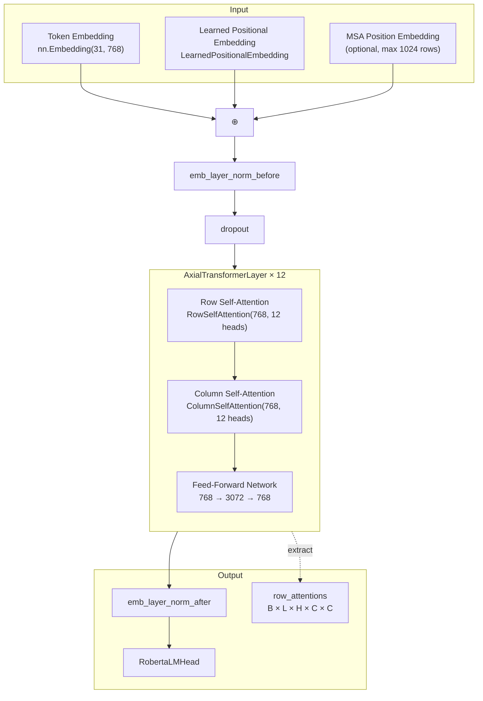
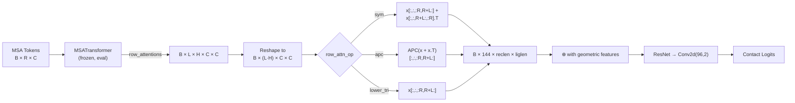

---
slug:9-esm-msa-attention-embedding
blog_type:normal
---

ESM-MSA 注意力嵌入是 GLINTER 的进化编码主干，它通过 Facebook Research 的 **MSA Transformer** 架构，将原始多序列比对（MSA）标记矩阵转换为丰富的链间注意力图。与单独处理单条链的标准序列嵌入不同，该模块基于 **2D 轴向注意力** 范式运行——同时沿着序列行（同源序列）和列（比对位置）进行注意力计算——以提取可被接触预测头直接使用的共进化信号。关键洞察在于，GLINTER **不**使用 MSA Transformer 的隐藏层表示；相反，它提取**原始行注意力权重**（形状为 `B × L × H × C × C`），并应用非对称分割以隔离受体→配体的共进化耦合。

来源：[model.py](glinter/esm_embed/model.py#L198-L425)，[msa_model.py](glinter/models/msa_model.py#L164-L212)

## 架构：MSATransformer 与轴向注意力

`MSATransformer` 类实现了一组 `AxialTransformerLayer` 块的堆叠，每个块包含按严格顺序执行的三个子操作：**行自注意力 → 列自注意力 → 前馈网络**。每个子操作都被封装在 `NormalizedResidualBlock` 中，该块依次应用预层归一化、子层本身、Dropout 以及残差连接。这种预归一化（pre-norm）公式在 12 层的默认深度下稳定了训练过程。

默认配置（ESM-MSA-1，`t12_100M_UR50S`）使用 **12 层**、**768 维嵌入**、**12 个注意力头**以及 **3072 维的前馈网络（FFN）**。位置编码是可学习的（`LearnedPositionalEmbedding`），可选的 `msa_position_embedding` 参数（形状为 `1 × 1024 × 1 × 1`）可以注入行深度感知，最大支持 1024 条比对序列。模型处理形状为 `B × R × C`（批次 × 行数/比对数 × 列数/残基数）的输入张量，并在内部置换为 `R × C × B × D` 以实现高效的轴向计算。

来源：[model.py](glinter/esm_embed/model.py#L198-L308)，[modules.py](glinter/esm_embed/modules.py#L129-L210)

## 行与列自注意力机制

轴向注意力分解是核心架构模式。与其将 2D MSA 展平为 1D 序列（这会破坏行/列结构），`RowSelfAttention` 和 `ColumnSelfAttention` 模块分别沿一个轴进行注意力计算，同时在正交轴上**共享参数**。

| 属性 | RowSelfAttention | ColumnSelfAttention |
|---|---|---|
| **注意力轴** | 沿行（每个位置关注同一列中不同 MSA 序列的所有位置） | 沿列（每个位置关注同一行/单条序列内的所有位置） |
| **输入形状** | `R × C × B × D` | `R × C × B × D` |
| **爱因斯坦求和** | `rinhd, rjnhd → hnij` | `icnhd, jcnhd → hcnij` |
| **输出注意力形状** | `H × B × C × C` | `H × C × B × R × R` |
| **缩放比例** | `1 / √(head_dim × num_rows)` | `1 / √(head_dim)` |
| **内存批处理** | 当 `R × C > max_tokens_per_msa` 时拆分行 | 当 `R × C > max_tokens_per_msa` 时拆分列 |
| **生物学意义** | 不同同源序列对每个位置的关注方式 | 单条序列内位置彼此间的关注方式 |

这两个模块共享相同的投影结构：独立的 `q_proj`、`k_proj`、`v_proj` 线性层（均为 `768 → 768`）以及共享的 `out_proj`。填充标记通过将填充位置的查询向量置零，并将注意力逻辑值填充 `-10000` 来屏蔽，以抑制 Softmax 概率质量。`max_tokens_per_msa` 阈值（默认为 `2^14 = 16384`）在禁用梯度时触发内存高效的批量推理，将主导轴分块以避免大型 MSA 上出现 OOM。

<CgxTip>行注意力是 GLINTER 的关键输出：`hnij` 收缩生成形状为 `H × B × C × C` 的逐列注意力图，直接编码了所有同源序列中比对位置之间的共进化耦合。列注意力虽被计算但在生产环境中会被丢弃（`need_row_attn=True` 会导致 `del column_attn`），从而在保留 GLINTER 实际消费的注意力信号的同时节省了内存。</CgxTip>

来源：[axial_attention.py](glinter/esm_embed/axial_attention.py#L11-L133)，[axial_attention.py](glinter/esm_embed/axial_attention.py#L136-L243)，[modules.py](glinter/esm_embed/modules.py#L181-L210)

## 字母表与标记化

`Alphabet` 类在原始氨基酸序列与 `MSATransformer` 消费的整数标记之间进行转换。对于 `msa_transformer` 架构，标记词汇表构建如下：

1. **前置标记**：`<cls>`、`<pad>`、`<eos>`、`<unk>`
2. **标准残基**：27 个字符 — 20 种标准氨基酸加上 `X`、`B`、`U`、`Z`、`O`、`.`、`-`
3. **填充至 8 字节对齐**：空标记 `<null_N>`，直到总数可被 8 整除
4. **后置标记**：`<mask>`

这产生了一个大小为 31 的总字母表（4 个前置 + 27 个标准 + 0 个填充空值 + 1 个后置 = 32，经对齐调整后得出）。特定于 MSA 的字母表设置 `prepend_bos=True` 和 `append_eos=False`，这意味着每行会前置一个 `<cls>` 标记，但不后置 `<eos>` 标记。转换表（位于 `esm/esm_msa1_t12_100M_UR50S.tt` 的 `.tt` 文件）将原始整数 MSA 编码映射到 ESM 标记索引，通过 `load_tt()` 加载。

来源：[data.py](glinter/esm_embed/data.py#L15-L95)，[constants.py](glinter/esm_embed/constants.py#L6-L8)，[msa_utils.py](glinter/dataset/msa_utils.py#L1-L66)

## 从注意力图到链间特征

从原始 MSA 标记到 GLINTER 接触预测的集成路径是一个精确的流水线，包含一个关键的非对称提取步骤。在 `MSAModel.forward()` 中，ESM 嵌入在评估模式下于 `torch.no_grad()` 中运行，输出的 `row_attentions` 张量（形状为 `B × L × H × C × C`）被重塑为 `B × (L×H) × C × C`。然后，给定 `reclen` 和 `liglen`（受体和配体链长度，其中 `C = reclen + liglen`），四种**行注意力算子**之一将提取链间信号：

| 算子 | 公式 | 描述 |
|---|---|---|
| `lower_tri` | `x[:, :, :reclen, reclen:]` | 仅左上块（受体查询 → 配体键） |
| `upper_tri` | `x[:, :, reclen:, :reclen].T` | 右下块，转置（配体 → 受体） |
| `sym` | `x[:,:,:reclen,reclen:] + x[:,:,reclen:,:reclen].T` | **默认**。两个交叉块的对称求和 |
| `apc` | `APC(x + x.T)[:,:,:reclen,reclen:]` | 对称化后应用平均乘积校正 |

`sym` 算子（默认）生成形状为 `B × (L×H) × reclen × liglen` 的链间注意力图，捕获受体与配体残基之间的相互共进化耦合。随后，这个 144 通道的映射图（12 层 × 12 头）与几何图特征拼接，并传入 2D ResNet 进行最终的接触预测。

<CgxTip>当 `gen_esm=True` 时，MSAModel 在**预计算模式**下运行：它执行 ESM 嵌入，提取注意力图，并将其保存为压缩的 `.esm.npz` 文件（float16）。在训练时，`pickled-esm` 特性标志会加载这些缓存的映射图，而不是运行昂贵的 MSA Transformer 前向传播，从而极大地减少了 GPU 显存和计算量。这种两阶段设计（预计算 → 训练）对于在大型二聚体数据集上进行实际训练至关重要。</CgxTip>

来源：[msa_model.py](glinter/models/msa_model.py#L164-L212)，[msa_model.py](glinter/models/msa_model.py#L287-L331)，[dimer_dataset.py](glinter/dataset/dimer_dataset.py#L320-L328)

## 预训练模型加载

`load_esm_model()` 函数解析本地检查点路径，并委托给 `load_model_and_alphabet_core()`，后者处理三种架构变体：`roberta_large`（ESM-1b）、`protein_bert_base`（ESM-1）和 `msa_transformer`。特别是对于 MSA Transformer，状态字典通过 `prs3` 经历一次关键的键重映射：在所有键中将字符串 `"row"` 与 `"column"` 互换。这弥补了预训练检查点与 GLINTER 模块定义之间的命名约定差异。模型被实例化为 `MSATransformer(Namespace(**model_args), alphabet)`，并在回归权重共存时以 `strict=True` 加载，若不存在则以 `strict=False` 加载并发出警告。

来源：[pretrained.py](glinter/esm_embed/pretrained.py#L14-L96)，[__init__.py](glinter/esm_embed/__init__.py#L6-L13)

## 模块层次结构摘要

| 模块 | 类 | 核心职责 |
|---|---|---|
| `esm_embed/model.py` | `MSATransformer` | 12 层轴向 Transformer，行注意力提取 |
| `esm_embed/model.py` | `ProteinBertModel` | 单序列 ESM-1/1b（未在 GLINTER 流水线中使用） |
| `esm_embed/axial_attention.py` | `RowSelfAttention` | 带有批量内存管理的行级自注意力 |
| `esm_embed/axial_attention.py` | `ColumnSelfAttention` | 列级自注意力，针对单行 MSA 进行特例处理 |
| `esm_embed/modules.py` | `AxialTransformerLayer` | 组合行 → 列 → FFN 与归一化残差 |
| `esm_embed/modules.py` | `NormalizedResidualBlock` | 预层归一化 + 子层 + Dropout + 残差 |
| `esm_embed/modules.py` | `FeedForwardNetwork` | 768→3072→768 配合 GELU 激活 |
| `esm_embed/modules.py` | `ContactPredictionHead` | 对称化 + APC + 基于注意力的逻辑斯蒂回归 |
| `esm_embed/data.py` | `Alphabet` | 标记词汇表构建，感知 MSA 的批转换 |
| `esm_embed/pretrained.py` | `load_esm_model` | 检查点加载，配合特定架构的状态字典重映射 |
| `dataset/msa_utils.py` | `load_msa` | MSA 张量准备，注入 BOS/EOS 标记 |
| `models/msa_model.py` | `MSAModel` | 消费者：运行 ESM，提取链间注意力，馈入 ResNet |

来源：[model.py](glinter/esm_embed/model.py#L1-L425)，[modules.py](glinter/esm_embed/modules.py#L1-L399)，[axial_attention.py](glinter/esm_embed/axial_attention.py#L1-L243)，[data.py](glinter/esm_embed/data.py#L1-L96)，[pretrained.py](glinter/esm_embed/pretrained.py#L1-L97)

## 相关页面

- 此处生成的注意力图由 [MSAModel 和前向传播](5-msamodel-and-forward-pass) 消费，用于链间接触预测
- 输入此模块的 MSA 标记由 [DimerDataset 与特征加载](11-dimerdataset-and-feature-loading) 及 [MSA 构建与 Henikoff 加权](12-msa-building-and-henikoff-weighting) 准备
- 从原始 PDB 到注意力图的完整数据流在 [预测流水线演练](3-prediction-pipeline-walkthrough) 中追溯