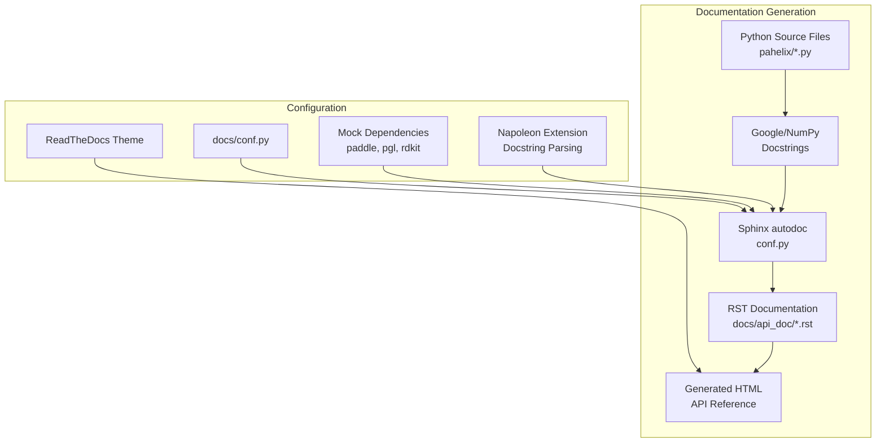
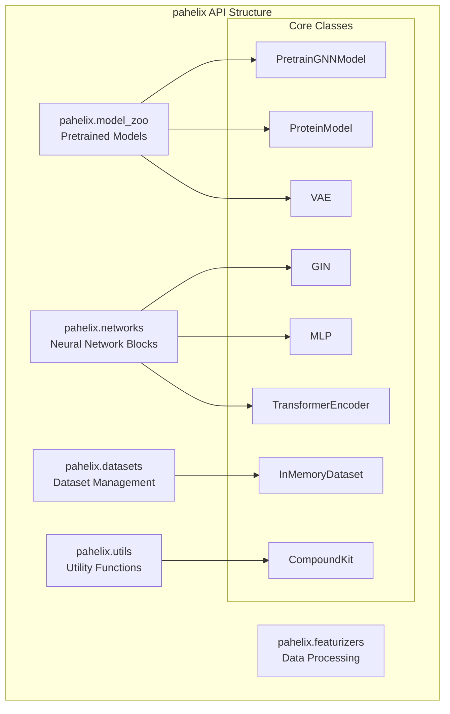
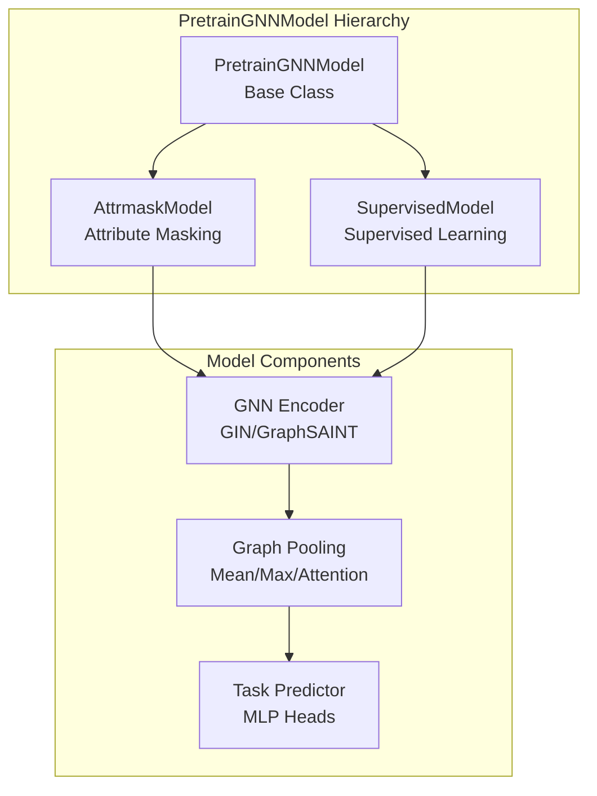
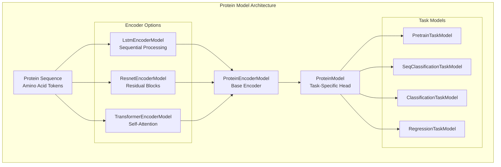
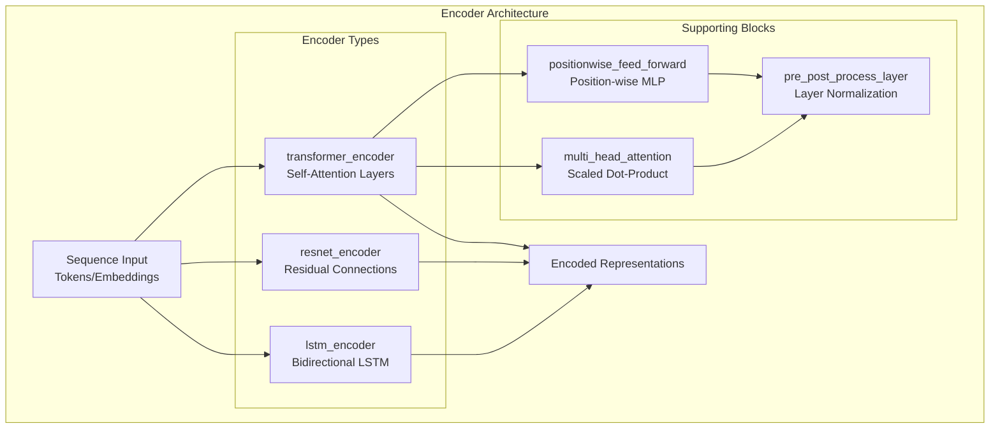
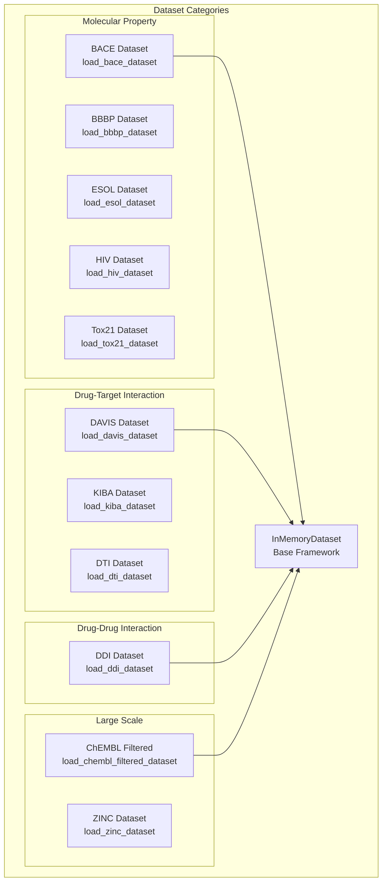
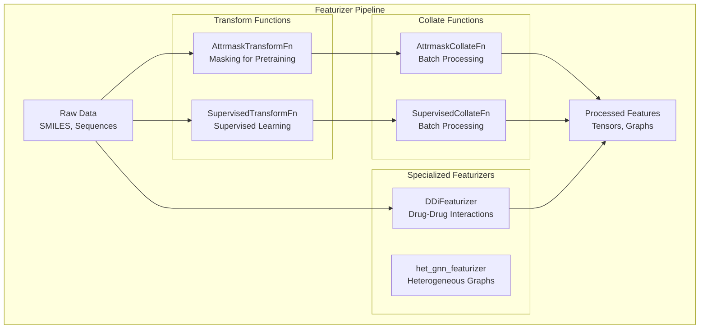
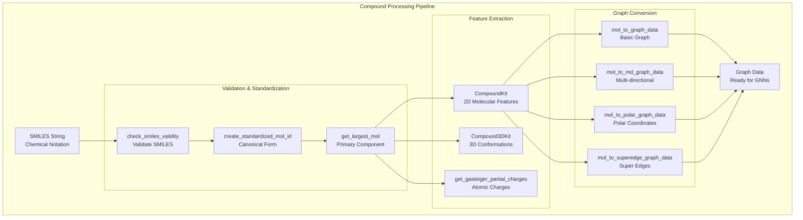

# API Reference

> **Relevant source files**
> * [docs/api_doc/datasets.rst](https://github.com/PaddlePaddle/PaddleHelix/blob/7fdd7a18/docs/api_doc/datasets.rst)
> * [docs/api_doc/featurizers.rst](https://github.com/PaddlePaddle/PaddleHelix/blob/7fdd7a18/docs/api_doc/featurizers.rst)
> * [docs/api_doc/model_zoo.rst](https://github.com/PaddlePaddle/PaddleHelix/blob/7fdd7a18/docs/api_doc/model_zoo.rst)
> * [docs/api_doc/networks.rst](https://github.com/PaddlePaddle/PaddleHelix/blob/7fdd7a18/docs/api_doc/networks.rst)
> * [docs/api_doc/utils.rst](https://github.com/PaddlePaddle/PaddleHelix/blob/7fdd7a18/docs/api_doc/utils.rst)
> * [docs/conf.py](https://github.com/PaddlePaddle/PaddleHelix/blob/7fdd7a18/docs/conf.py)
> * [docs/requirements.txt](https://github.com/PaddlePaddle/PaddleHelix/blob/7fdd7a18/docs/requirements.txt)

This page provides comprehensive documentation of the PaddleHelix Python API, automatically generated from source code docstrings using the Sphinx documentation system. The API reference covers all public classes, functions, and modules available for developers building bio-computing applications with PaddleHelix.

For general usage guides and tutorials, see [Getting Started](/PaddlePaddle/PaddleHelix/2-getting-started). For specific application domain guides, see [Core Applications](/PaddlePaddle/PaddleHelix/3-core-applications). For information about pretrained models, see [Pretrained Models](/PaddlePaddle/PaddleHelix/4-pretrained-models).

## API Documentation System

PaddleHelix uses Sphinx with autodoc extensions to automatically generate API documentation from Python docstrings. The documentation system is configured to handle the complex dependencies typical in bio-computing environments through mock imports and specialized parsing.

*Sources: [docs/conf.py L1-L112](https://github.com/PaddlePaddle/PaddleHelix/blob/7fdd7a18/docs/conf.py#L1-L112)

 [docs/requirements.txt L1-L6](https://github.com/PaddlePaddle/PaddleHelix/blob/7fdd7a18/docs/requirements.txt#L1-L6)*

## API Module Structure

The PaddleHelix API is organized into five primary modules, each serving distinct functional areas of bio-computing applications:

| Module | Purpose | Key Components |
| --- | --- | --- |
| `pahelix.model_zoo` | Pretrained and task-specific models | `PretrainGNNModel`, `ProteinModel`, `VAE` |
| `pahelix.networks` | Neural network building blocks | `GIN`, `MLP`, `TransformerEncoder` |
| `pahelix.datasets` | Dataset loaders and management | `InMemoryDataset`, dataset loaders |
| `pahelix.featurizers` | Data preprocessing and feature extraction | `AttrmaskTransformFn`, `DDiFeaturizer` |
| `pahelix.utils` | Utilities and helper functions | `CompoundKit`, `ProteinTokenizer`, splitters |

*Sources: [docs/api_doc/model_zoo.rst L1-L60](https://github.com/PaddlePaddle/PaddleHelix/blob/7fdd7a18/docs/api_doc/model_zoo.rst#L1-L60)

 [docs/api_doc/networks.rst L1-L75](https://github.com/PaddlePaddle/PaddleHelix/blob/7fdd7a18/docs/api_doc/networks.rst#L1-L75)

 [docs/api_doc/datasets.rst L1-L147](https://github.com/PaddlePaddle/PaddleHelix/blob/7fdd7a18/docs/api_doc/datasets.rst#L1-L147)

 [docs/api_doc/featurizers.rst L1-L46](https://github.com/PaddlePaddle/PaddleHelix/blob/7fdd7a18/docs/api_doc/featurizers.rst#L1-L46)

 [docs/api_doc/utils.rst L1-L72](https://github.com/PaddlePaddle/PaddleHelix/blob/7fdd7a18/docs/api_doc/utils.rst#L1-L72)*

## Model Zoo API

The `pahelix.model_zoo` module provides pretrained models and task-specific architectures for bio-computing applications.

### Graph Neural Network Models

The pretrained GNN models support molecular property prediction and compound representation learning:

Key classes include:

* `PretrainGNNModel`: Base class for graph neural network models
* `AttrmaskModel`: Self-supervised pretraining with attribute masking
* `SupervisedModel`: Supervised learning for molecular property prediction

### Protein Sequence Models

The protein modeling framework provides various encoder architectures:

*Sources: [docs/api_doc/model_zoo.rst L7-L48](https://github.com/PaddlePaddle/PaddleHelix/blob/7fdd7a18/docs/api_doc/model_zoo.rst#L7-L48)*

## Networks API

The `pahelix.networks` module provides fundamental neural network building blocks used across PaddleHelix models.

### Core Building Blocks

| Component | Class | Purpose |
| --- | --- | --- |
| Activation | `Activation` | Configurable activation functions |
| Multi-layer Perceptron | `MLP` | Fully connected layers with dropout |
| Graph Convolution | `GIN` | Graph Isomorphism Network layers |
| Attention | `multi_head_attention` | Multi-head self-attention mechanism |
| Normalization | `GraphNorm` | Graph-specific normalization |

### Specialized Encoders

*Sources: [docs/api_doc/networks.rst L1-L75](https://github.com/PaddlePaddle/PaddleHelix/blob/7fdd7a18/docs/api_doc/networks.rst#L1-L75)*

## Datasets API

The `pahelix.datasets` module provides standardized dataset loaders for common bio-computing benchmarks and the `InMemoryDataset` framework for custom data handling.

### Dataset Categories

### Dataset Loaders

All dataset loaders follow a consistent pattern and return data compatible with the `InMemoryDataset` framework:

* **Function naming**: `load_{dataset_name}_dataset()`
* **Task names**: `get_default_{dataset_name}_task_names()`
* **Data ranges**: `get_default_{dataset_name}_range()` (for regression tasks)

*Sources: [docs/api_doc/datasets.rst L1-L147](https://github.com/PaddlePaddle/PaddleHelix/blob/7fdd7a18/docs/api_doc/datasets.rst#L1-L147)*

## Featurizers API

The `pahelix.featurizers` module handles data preprocessing and feature extraction for different input modalities.

### Featurizer Types

*Sources: [docs/api_doc/featurizers.rst L1-L46](https://github.com/PaddlePaddle/PaddleHelix/blob/7fdd7a18/docs/api_doc/featurizers.rst#L1-L46)*

## Utils API

The `pahelix.utils` module provides essential utility functions for data processing, molecular manipulation, and model training support.

### Utility Categories

| Category | Module | Key Functions |
| --- | --- | --- |
| Basic Utilities | `basic_utils` | `mp_pool_map`, `load_json_config` |
| Compound Processing | `compound_tools` | `CompoundKit`, `Compound3DKit`, `mol_to_graph_data` |
| Data Management | `data_utils` | `save_data_list_to_npz`, `load_npz_to_data_list` |
| Protein Processing | `protein_tools` | `ProteinTokenizer` |
| Data Splitting | `splitters` | `RandomSplitter`, `ScaffoldSplitter` |
| Language Models | `language_model_tools` | `apply_bert_mask` |

### Compound Tools

The `CompoundKit` and related functions provide comprehensive molecular processing capabilities:

*Sources: [docs/api_doc/utils.rst L1-L72](https://github.com/PaddlePaddle/PaddleHelix/blob/7fdd7a18/docs/api_doc/utils.rst#L1-L72)*

## Documentation Configuration

The API documentation is generated using Sphinx with the following key configuration settings:

* **Extensions**: `sphinx.ext.autodoc`, `sphinx.ext.napoleon`, `sphinx.ext.viewcode`
* **Docstring Formats**: Google and NumPy docstring conventions
* **Mock Dependencies**: Automatic mocking of `paddle`, `pgl`, `rdkit`, and scientific packages
* **Theme**: ReadTheDocs theme with navigation depth of 5 levels
* **Version**: 1.0.0

The configuration handles the complex dependency requirements of bio-computing libraries through comprehensive mock imports, allowing documentation generation without requiring full installation of all dependencies.

*Sources: [docs/conf.py L1-L112](https://github.com/PaddlePaddle/PaddleHelix/blob/7fdd7a18/docs/conf.py#L1-L112)

 [docs/requirements.txt L1-L6](https://github.com/PaddlePaddle/PaddleHelix/blob/7fdd7a18/docs/requirements.txt#L1-L6)*