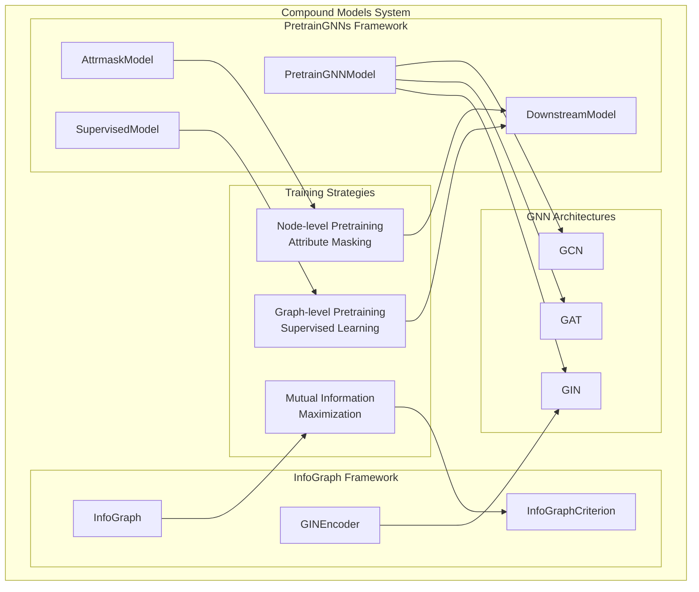
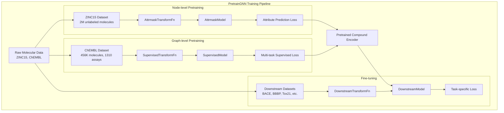
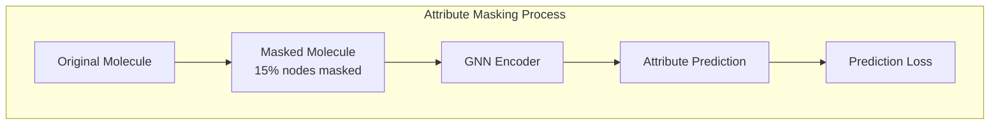
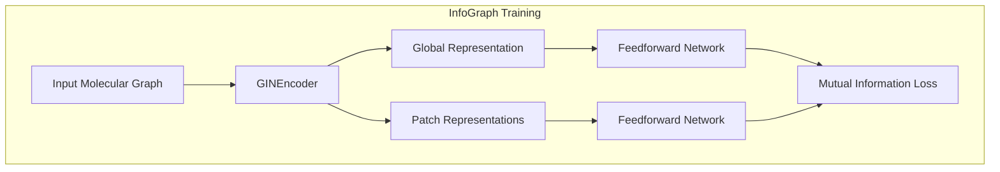
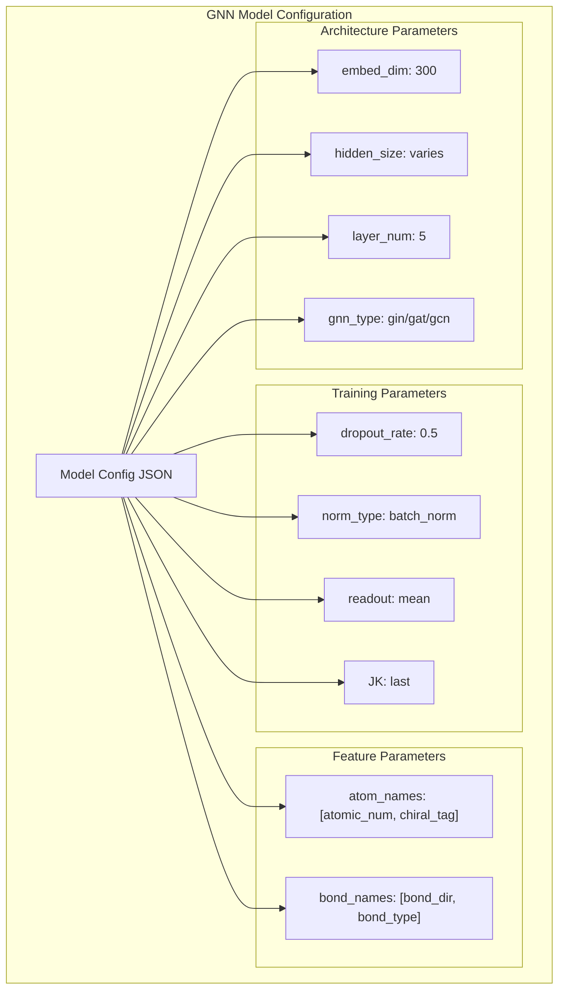
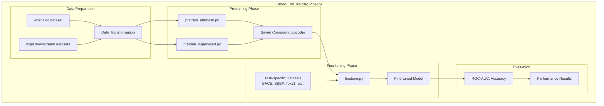
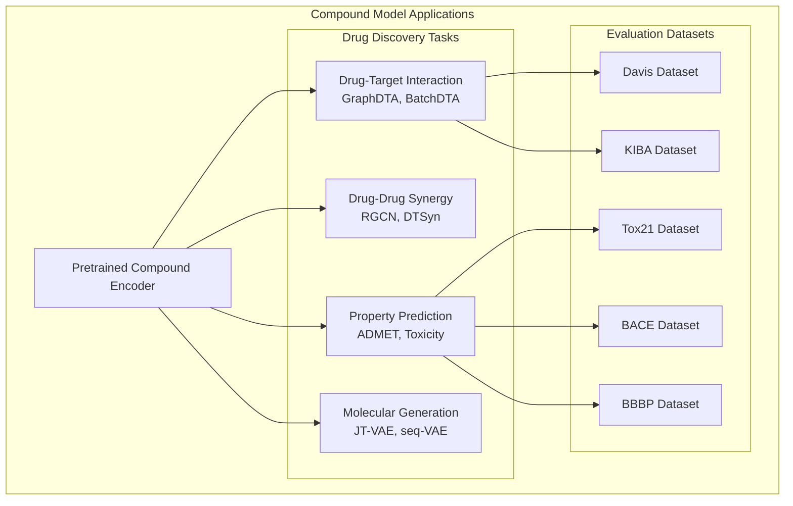
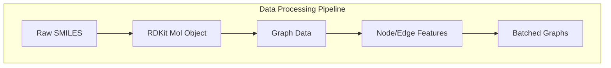

# Compound Models

> **Relevant source files**
> * [apps/drug_target_interaction/graph_dta/README.md](https://github.com/PaddlePaddle/PaddleHelix/blob/7fdd7a18/apps/drug_target_interaction/graph_dta/README.md?plain=1)
> * [apps/drug_target_interaction/graph_dta/README_cn.md](https://github.com/PaddlePaddle/PaddleHelix/blob/7fdd7a18/apps/drug_target_interaction/graph_dta/README_cn.md?plain=1)
> * [apps/drug_target_interaction/graph_dta/scripts/preprocess_data.py](https://github.com/PaddlePaddle/PaddleHelix/blob/7fdd7a18/apps/drug_target_interaction/graph_dta/scripts/preprocess_data.py)
> * [apps/drug_target_interaction/graph_dta/scripts/train.sh](https://github.com/PaddlePaddle/PaddleHelix/blob/7fdd7a18/apps/drug_target_interaction/graph_dta/scripts/train.sh)
> * [apps/pretrained_compound/info_graph/README.md](https://github.com/PaddlePaddle/PaddleHelix/blob/7fdd7a18/apps/pretrained_compound/info_graph/README.md?plain=1)
> * [apps/pretrained_compound/info_graph/README_cn.md](https://github.com/PaddlePaddle/PaddleHelix/blob/7fdd7a18/apps/pretrained_compound/info_graph/README_cn.md?plain=1)
> * [apps/pretrained_compound/info_graph/scripts/preprocess_data.py](https://github.com/PaddlePaddle/PaddleHelix/blob/7fdd7a18/apps/pretrained_compound/info_graph/scripts/preprocess_data.py)
> * [apps/pretrained_compound/info_graph/scripts/unsupervised_pretrain.sh](https://github.com/PaddlePaddle/PaddleHelix/blob/7fdd7a18/apps/pretrained_compound/info_graph/scripts/unsupervised_pretrain.sh)
> * [apps/pretrained_compound/info_graph/src/model.py](https://github.com/PaddlePaddle/PaddleHelix/blob/7fdd7a18/apps/pretrained_compound/info_graph/src/model.py)
> * [apps/pretrained_compound/pretrain_gnns/README.md](https://github.com/PaddlePaddle/PaddleHelix/blob/7fdd7a18/apps/pretrained_compound/pretrain_gnns/README.md?plain=1)
> * [apps/pretrained_compound/pretrain_gnns/README_cn.md](https://github.com/PaddlePaddle/PaddleHelix/blob/7fdd7a18/apps/pretrained_compound/pretrain_gnns/README_cn.md?plain=1)
> * [apps/pretrained_compound/pretrain_gnns/imgs/Evaluation_results.png](https://github.com/PaddlePaddle/PaddleHelix/blob/7fdd7a18/apps/pretrained_compound/pretrain_gnns/imgs/Evaluation_results.png)
> * [apps/pretrained_compound/pretrain_gnns/imgs/pregnn.png](https://github.com/PaddlePaddle/PaddleHelix/blob/7fdd7a18/apps/pretrained_compound/pretrain_gnns/imgs/pregnn.png)
> * [tutorials/compound_property_prediction_tutorial.ipynb](https://github.com/PaddlePaddle/PaddleHelix/blob/7fdd7a18/tutorials/compound_property_prediction_tutorial.ipynb)
> * [tutorials/compound_property_prediction_tutorial_cn.ipynb](https://github.com/PaddlePaddle/PaddleHelix/blob/7fdd7a18/tutorials/compound_property_prediction_tutorial_cn.ipynb)

This page documents the pretrained compound representation models available in PaddleHelix, including their architectures, training methodologies, and applications. These models enable learning molecular representations from graph neural networks for various drug discovery tasks.

For protein representation models, see [Protein Models](/PaddlePaddle/PaddleHelix/4.1-protein-models). For specific drug discovery applications using these models, see [Drug-Target Interaction](/PaddlePaddle/PaddleHelix/3.2.2-drug-target-interaction) and [Drug-Drug Synergy](/PaddlePaddle/PaddleHelix/3.2.3-drug-drug-synergy).

## System Overview

PaddleHelix provides two main approaches for learning compound representations: **PretrainGNNs** and **InfoGraph**. Both systems use graph neural networks to encode molecular structures, but employ different pretraining strategies to learn generalizable molecular representations.

### Architecture Overview



Sources: [apps/pretrained_compound/pretrain_gnns/README.md](https://github.com/PaddlePaddle/PaddleHelix/blob/7fdd7a18/apps/pretrained_compound/pretrain_gnns/README.md?plain=1)

 [apps/pretrained_compound/info_graph/README.md](https://github.com/PaddlePaddle/PaddleHelix/blob/7fdd7a18/apps/pretrained_compound/info_graph/README.md?plain=1)

## PretrainGNN Models

The PretrainGNN framework implements the strategies from "Strategies for Pre-training Graph Neural Networks" paper, providing both node-level and graph-level pretraining approaches for molecular representation learning.

### Core Components

| Component | Purpose | Implementation |
| --- | --- | --- |
| `PretrainGNNModel` | Base GNN encoder | [pahelix.model_zoo.pretrain_gnns_model.PretrainGNNModel](https://github.com/PaddlePaddle/PaddleHelix/blob/7fdd7a18/pahelix.model_zoo.pretrain_gnns_model.PretrainGNNModel) |
| `AttrmaskModel` | Node-level pretraining | [pahelix.model_zoo.pretrain_gnns_model.AttrmaskModel](https://github.com/PaddlePaddle/PaddleHelix/blob/7fdd7a18/pahelix.model_zoo.pretrain_gnns_model.AttrmaskModel) |
| `DownstreamModel` | Fine-tuning wrapper | [apps/pretrained_compound/pretrain_gnns/src/model.py](https://github.com/PaddlePaddle/PaddleHelix/blob/7fdd7a18/apps/pretrained_compound/pretrain_gnns/src/model.py) |

### Training Pipeline



Sources: [apps/pretrained_compound/pretrain_gnns/README.md L61-L229](https://github.com/PaddlePaddle/PaddleHelix/blob/7fdd7a18/apps/pretrained_compound/pretrain_gnns/README.md?plain=1#L61-L229)

 [tutorials/compound_property_prediction_tutorial.ipynb L11-L14](https://github.com/PaddlePaddle/PaddleHelix/blob/7fdd7a18/tutorials/compound_property_prediction_tutorial.ipynb#L11-L14)

### Pretraining Strategies

#### Node-level Pretraining (Attribute Masking)

The attribute masking strategy randomly masks node/edge attributes and trains the model to predict these masked attributes based on the graph structure.

**Configuration**: [apps/pretrained_compound/pretrain_gnns/model_configs/pre_Attrmask.json](https://github.com/PaddlePaddle/PaddleHelix/blob/7fdd7a18/apps/pretrained_compound/pretrain_gnns/model_configs/pre_Attrmask.json)

**Training Script**: [apps/pretrained_compound/pretrain_gnns/pretrain_attrmask.py](https://github.com/PaddlePaddle/PaddleHelix/blob/7fdd7a18/apps/pretrained_compound/pretrain_gnns/pretrain_attrmask.py)



#### Graph-level Pretraining (Supervised Learning)

Multi-task supervised pretraining uses the ChEMBL dataset to predict various biochemical assays, learning graph-level representations.

**Configuration**: [apps/pretrained_compound/pretrain_gnns/model_configs/pre_Supervised.json](https://github.com/PaddlePaddle/PaddleHelix/blob/7fdd7a18/apps/pretrained_compound/pretrain_gnns/model_configs/pre_Supervised.json)

**Training Script**: [apps/pretrained_compound/pretrain_gnns/pretrain_supervised.py](https://github.com/PaddlePaddle/PaddleHelix/blob/7fdd7a18/apps/pretrained_compound/pretrain_gnns/pretrain_supervised.py)

Sources: [apps/pretrained_compound/pretrain_gnns/README.md L208-L228](https://github.com/PaddlePaddle/PaddleHelix/blob/7fdd7a18/apps/pretrained_compound/pretrain_gnns/README.md?plain=1#L208-L228)

 [apps/pretrained_compound/pretrain_gnns/README_cn.md L181-L213](https://github.com/PaddlePaddle/PaddleHelix/blob/7fdd7a18/apps/pretrained_compound/pretrain_gnns/README_cn.md?plain=1#L181-L213)

## InfoGraph Models

InfoGraph learns graph-level representations through maximizing mutual information between global graph representations and local substructure representations.

### Core Architecture

| Component | Purpose | Implementation |
| --- | --- | --- |
| `GINEncoder` | Graph encoding backbone | [apps/pretrained_compound/info_graph/src/model.py L31-L90](https://github.com/PaddlePaddle/PaddleHelix/blob/7fdd7a18/apps/pretrained_compound/info_graph/src/model.py#L31-L90) |
| `InfoGraph` | Main model with MI maximization | [apps/pretrained_compound/info_graph/src/model.py L136-L161](https://github.com/PaddlePaddle/PaddleHelix/blob/7fdd7a18/apps/pretrained_compound/info_graph/src/model.py#L136-L161) |
| `InfoGraphCriterion` | Mutual information loss | [apps/pretrained_compound/info_graph/src/model.py L163-L192](https://github.com/PaddlePaddle/PaddleHelix/blob/7fdd7a18/apps/pretrained_compound/info_graph/src/model.py#L163-L192) |

### Training Process



Sources: [apps/pretrained_compound/info_graph/src/model.py L136-L192](https://github.com/PaddlePaddle/PaddleHelix/blob/7fdd7a18/apps/pretrained_compound/info_graph/src/model.py#L136-L192)

 [apps/pretrained_compound/info_graph/README.md L14-L16](https://github.com/PaddlePaddle/PaddleHelix/blob/7fdd7a18/apps/pretrained_compound/info_graph/README.md?plain=1#L14-L16)

## Model Architectures

PaddleHelix supports three main GNN architectures for compound encoding:

### Architecture Comparison

| Architecture | Description | Key Features | Configuration |
| --- | --- | --- | --- |
| **GIN** | Graph Isomorphism Network | Theoretically powerful for graph classification | [apps/pretrained_compound/pretrain_gnns/model_configs/pregnn_paper.json](https://github.com/PaddlePaddle/PaddleHelix/blob/7fdd7a18/apps/pretrained_compound/pretrain_gnns/model_configs/pregnn_paper.json) |
| **GAT** | Graph Attention Network | Attention-based neighbor aggregation | Edge-dependent attention weights |
| **GCN** | Graph Convolutional Network | Classic spectral-based convolution | Efficient message passing |

### Model Configuration



Sources: [apps/pretrained_compound/pretrain_gnns/model_configs/pregnn_paper.json](https://github.com/PaddlePaddle/PaddleHelix/blob/7fdd7a18/apps/pretrained_compound/pretrain_gnns/model_configs/pregnn_paper.json)

 [apps/pretrained_compound/pretrain_gnns/README.md L132-L177](https://github.com/PaddlePaddle/PaddleHelix/blob/7fdd7a18/apps/pretrained_compound/pretrain_gnns/README.md?plain=1#L132-L177)

## Training and Fine-tuning Pipeline

### Complete Training Workflow



### Training Scripts and Commands

**Pretraining Commands**:

```markdown
# Node-level pretrainingpython pretrain_attrmask.py --batch_size=256 --max_epoch=100 --data_path=../../../data/chem_dataset/zinc_standard_agent # Graph-level pretraining  python pretrain_supervised.py --batch_size=256 --max_epoch=100 --data_path=../../../data/chem_dataset/chembl_filtered
```

**Fine-tuning Command**:

```
python finetune.py --batch_size=32 --max_epoch=4 --dataset_name=tox21 --init_model=path/to/pretrained/model
```

Sources: [apps/pretrained_compound/pretrain_gnns/README.md L89-L132](https://github.com/PaddlePaddle/PaddleHelix/blob/7fdd7a18/apps/pretrained_compound/pretrain_gnns/README.md?plain=1#L89-L132)

 [tutorials/compound_property_prediction_tutorial.ipynb L195-L253](https://github.com/PaddlePaddle/PaddleHelix/blob/7fdd7a18/tutorials/compound_property_prediction_tutorial.ipynb#L195-L253)

## Applications and Integration

### Downstream Task Integration

The pretrained compound models integrate with various drug discovery applications:



### Performance Results

Based on the evaluation results for molecular property prediction tasks:

| Dataset | Method | ROC-AUC | Task Type |
| --- | --- | --- | --- |
| Tox21 | PretrainGNN | 0.67+ | Toxicity Prediction |
| BACE | PretrainGNN | - | BACE-1 Inhibition |
| BBBP | PretrainGNN | - | Blood-Brain Barrier Permeability |

Sources: [apps/pretrained_compound/pretrain_gnns/README.md L259-L272](https://github.com/PaddlePaddle/PaddleHelix/blob/7fdd7a18/apps/pretrained_compound/pretrain_gnns/README.md?plain=1#L259-L272)

 [apps/drug_target_interaction/graph_dta/README.md L111-L128](https://github.com/PaddlePaddle/PaddleHelix/blob/7fdd7a18/apps/drug_target_interaction/graph_dta/README.md?plain=1#L111-L128)

## Dataset Support

### Pretraining Datasets

| Dataset | Purpose | Size | Description |
| --- | --- | --- | --- |
| **ZINC15** | Node-level pretraining | 2M molecules | Unlabeled molecular structures |
| **ChEMBL** | Graph-level pretraining | 456K molecules, 1310 assays | Biochemical activity data |

### Downstream Datasets

| Dataset | Task | Molecules | Description |
| --- | --- | --- | --- |
| **BACE** | Binary classification | 1,522 | BACE-1 inhibitor prediction |
| **BBBP** | Binary classification | 2,000+ | Blood-brain barrier permeability |
| **ClinTox** | Multi-task classification | 1,491 | Clinical trial toxicity |
| **HIV** | Binary classification | 40,000+ | HIV replication inhibition |
| **Tox21** | Multi-task classification | 8,000 | Toxicity across 12 targets |
| **SIDER** | Multi-task classification | 1,427 | Drug side effects |

### Data Processing Pipeline



**Key Processing Functions**:

* `AttrmaskTransformFn`: Node-level pretraining data transformation
* `DownstreamTransformFn`: Fine-tuning data transformation
* `AttrmaskCollateFn`: Batch collation for attribute masking
* `DownstreamCollateFn`: Batch collation for downstream tasks

Sources: [apps/pretrained_compound/pretrain_gnns/README.md L267-L375](https://github.com/PaddlePaddle/PaddleHelix/blob/7fdd7a18/apps/pretrained_compound/pretrain_gnns/README.md?plain=1#L267-L375)

 [pahelix.featurizers.pretrain_gnn_featurizer](https://github.com/PaddlePaddle/PaddleHelix/blob/7fdd7a18/pahelix.featurizers.pretrain_gnn_featurizer)