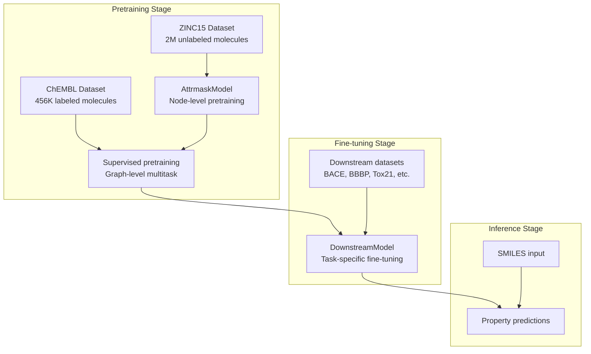
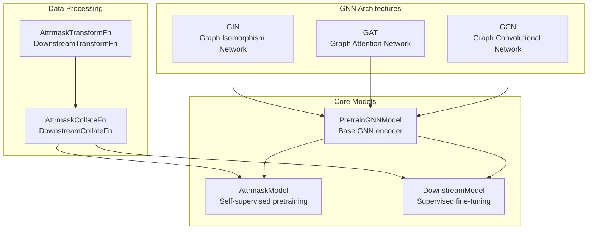
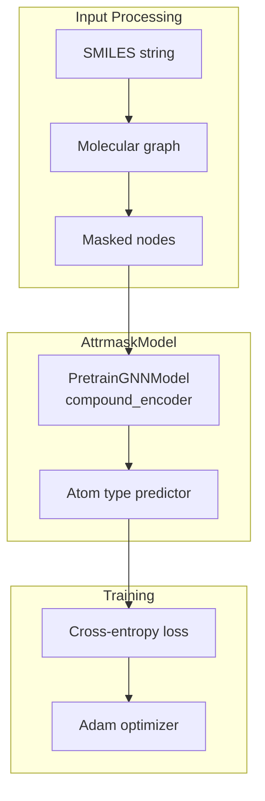
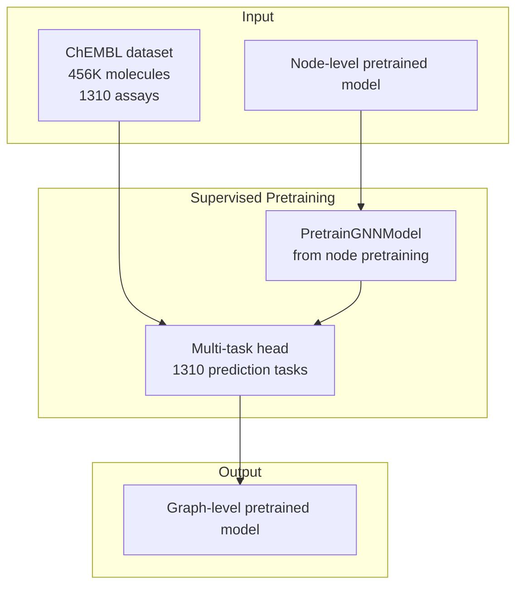
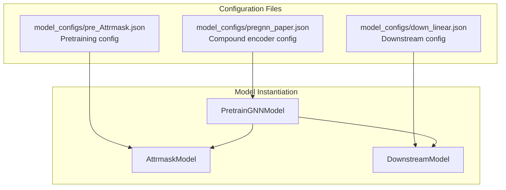
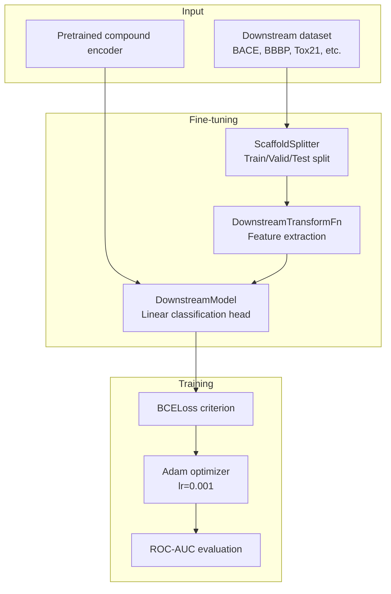
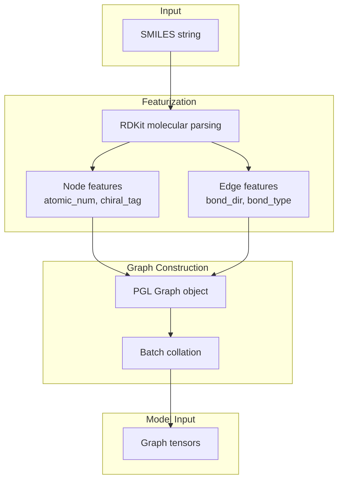

# Compound Representation Learning

> **Relevant source files**
> * [apps/pretrained_compound/pretrain_gnns/README.md](https://github.com/PaddlePaddle/PaddleHelix/blob/7fdd7a18/apps/pretrained_compound/pretrain_gnns/README.md?plain=1)
> * [apps/pretrained_compound/pretrain_gnns/README_cn.md](https://github.com/PaddlePaddle/PaddleHelix/blob/7fdd7a18/apps/pretrained_compound/pretrain_gnns/README_cn.md?plain=1)
> * [apps/pretrained_compound/pretrain_gnns/imgs/Evaluation_results.png](https://github.com/PaddlePaddle/PaddleHelix/blob/7fdd7a18/apps/pretrained_compound/pretrain_gnns/imgs/Evaluation_results.png)
> * [apps/pretrained_compound/pretrain_gnns/imgs/pregnn.png](https://github.com/PaddlePaddle/PaddleHelix/blob/7fdd7a18/apps/pretrained_compound/pretrain_gnns/imgs/pregnn.png)
> * [tutorials/compound_property_prediction_tutorial.ipynb](https://github.com/PaddlePaddle/PaddleHelix/blob/7fdd7a18/tutorials/compound_property_prediction_tutorial.ipynb)
> * [tutorials/compound_property_prediction_tutorial_cn.ipynb](https://github.com/PaddlePaddle/PaddleHelix/blob/7fdd7a18/tutorials/compound_property_prediction_tutorial_cn.ipynb)

This document covers PaddleHelix's compound representation learning system, which provides pretrained Graph Neural Network (GNN) models for molecular property prediction. The system enables self-supervised pretraining on large chemical datasets followed by fine-tuning on specific downstream tasks.

For drug-target interaction prediction, see [Drug-Target Interaction](/PaddlePaddle/PaddleHelix/3.2.2-drug-target-interaction). For molecular generation capabilities, see [Molecular Generation](/PaddlePaddle/PaddleHelix/3.4-molecular-generation).

## System Architecture

The compound representation learning system follows a two-stage approach: pretraining on large unlabeled molecular datasets, followed by fine-tuning on task-specific labeled datasets.

### Core Workflow



Sources: [apps/pretrained_compound/pretrain_gnns/README.md L40-L42](https://github.com/PaddlePaddle/PaddleHelix/blob/7fdd7a18/apps/pretrained_compound/pretrain_gnns/README.md?plain=1#L40-L42)

 [apps/pretrained_compound/pretrain_gnns/README_cn.md L40-L41](https://github.com/PaddlePaddle/PaddleHelix/blob/7fdd7a18/apps/pretrained_compound/pretrain_gnns/README_cn.md?plain=1#L40-L41)

### Model Components



Sources: [apps/pretrained_compound/pretrain_gnns/README.md L134-L184](https://github.com/PaddlePaddle/PaddleHelix/blob/7fdd7a18/apps/pretrained_compound/pretrain_gnns/README.md?plain=1#L134-L184)

 [tutorials/compound_property_prediction_tutorial.ipynb L57-L62](https://github.com/PaddlePaddle/PaddleHelix/blob/7fdd7a18/tutorials/compound_property_prediction_tutorial.ipynb#L57-L62)

## Pretraining Strategies

### Node-Level Pretraining

The system implements attribute masking for self-supervised pretraining at the node level using the `AttrmaskModel`.

**Attribute Masking Process:**

1. Randomly masks atom types in molecular graphs
2. Trains the model to predict masked atom types based on neighboring structure
3. Uses ZINC15 dataset with 2 million unlabeled molecules

Key parameters:

* `mask_ratio`: Proportion of nodes to mask (default: 0.15)
* Batch size: 256 for pretraining
* Learning rate: 0.001



Sources: [apps/pretrained_compound/pretrain_gnns/README.md L196-L215](https://github.com/PaddlePaddle/PaddleHelix/blob/7fdd7a18/apps/pretrained_compound/pretrain_gnns/README.md?plain=1#L196-L215)

 [apps/pretrained_compound/pretrain_gnns/pretrain_attrmask.py L1-L100](https://github.com/PaddlePaddle/PaddleHelix/blob/7fdd7a18/apps/pretrained_compound/pretrain_gnns/pretrain_attrmask.py#L1-L100)

### Graph-Level Supervised Pretraining

Following node-level pretraining, the system performs supervised pretraining on the entire graph using ChEMBL dataset.

**Supervised Pretraining Process:**

1. Loads node-level pretrained model
2. Trains on ChEMBL dataset with 456K molecules and 1310 biochemical assays
3. Performs multi-task learning across different molecular properties



Sources: [apps/pretrained_compound/pretrain_gnns/README.md L216-L234](https://github.com/PaddlePaddle/PaddleHelix/blob/7fdd7a18/apps/pretrained_compound/pretrain_gnns/README.md?plain=1#L216-L234)

 [apps/pretrained_compound/pretrain_gnns/pretrain_supervised.py L1-L100](https://github.com/PaddlePaddle/PaddleHelix/blob/7fdd7a18/apps/pretrained_compound/pretrain_gnns/pretrain_supervised.py#L1-L100)

## GNN Architectures

### Available Models

| Model | Description | Key Parameters |
| --- | --- | --- |
| GIN | Graph Isomorphism Network | `hidden_size`, `embed_dim`, `layer_num` |
| GAT | Graph Attention Network | `hidden_size`, `embed_dim`, `layer_num` |
| GCN | Graph Convolutional Network | `hidden_size`, `embed_dim`, `layer_num` |

### Model Configuration

The system uses JSON configuration files to define model architectures:

* `compound_encoder_config`: Defines the base GNN encoder
* `model_config`: Defines task-specific model heads
* Common settings: `dropout_rate=0.2`, `layer_num=5`, `embed_dim=300`



Sources: [apps/pretrained_compound/pretrain_gnns/README.md L134-L184](https://github.com/PaddlePaddle/PaddleHelix/blob/7fdd7a18/apps/pretrained_compound/pretrain_gnns/README.md?plain=1#L134-L184)

 [tutorials/compound_property_prediction_tutorial.ipynb L104-L111](https://github.com/PaddlePaddle/PaddleHelix/blob/7fdd7a18/tutorials/compound_property_prediction_tutorial.ipynb#L104-L111)

## Downstream Applications

### Supported Datasets

The system supports fine-tuning on multiple molecular property prediction tasks:

| Dataset | Task | Molecules | Properties |
| --- | --- | --- | --- |
| BACE | β-secretase inhibition | 1,522 | pIC50, binary class |
| BBBP | Blood-brain barrier penetration | 2,000+ | Binary permeability |
| ClinTox | Clinical trial toxicity | 1,491 | FDA approval, toxicity |
| HIV | HIV replication inhibition | 40,000+ | Activity classification |
| Tox21 | Toxicity prediction | 8,000+ | 12 toxicity assays |
| SIDER | Side effects | 1,427 | 27 organ classes |

### Fine-tuning Process



Sources: [apps/pretrained_compound/pretrain_gnns/README.md L240-L267](https://github.com/PaddlePaddle/PaddleHelix/blob/7fdd7a18/apps/pretrained_compound/pretrain_gnns/README.md?plain=1#L240-L267)

 [tutorials/compound_property_prediction_tutorial.ipynb L408-L419](https://github.com/PaddlePaddle/PaddleHelix/blob/7fdd7a18/tutorials/compound_property_prediction_tutorial.ipynb#L408-L419)

## Usage Workflow

### Training Commands

**Pretraining (Attribute Masking):**

```
python pretrain_attrmask.py \    --batch_size=256 \    --max_epoch=100 \    --data_path=data/chem_dataset/zinc_standard_agent \    --compound_encoder_config=model_configs/pregnn_paper.json \    --model_config=model_configs/pre_Attrmask.json \    --model_dir=output/pretrain_gnns/pretrain_attrmask
```

**Supervised Pretraining:**

```
python pretrain_supervised.py \    --batch_size=256 \    --max_epoch=100 \    --data_path=data/chem_dataset/chembl_filtered \    --init_model=output/pretrain_gnns/pretrain_attrmask/compound_encoder.pdparams \    --model_dir=output/pretrain_gnns/pretrain_supervised
```

**Fine-tuning:**

```
python finetune.py \    --batch_size=32 \    --max_epoch=4 \    --dataset_name=tox21 \    --data_path=data/chem_dataset/tox21 \    --init_model=output/pretrain_gnns/pretrained_model.pdparams \    --model_dir=output/pretrain_gnns/finetune/tox21
```

Sources: [apps/pretrained_compound/pretrain_gnns/README.md L89-L132](https://github.com/PaddlePaddle/PaddleHelix/blob/7fdd7a18/apps/pretrained_compound/pretrain_gnns/README.md?plain=1#L89-L132)

 [apps/pretrained_compound/pretrain_gnns/scripts/](https://github.com/PaddlePaddle/PaddleHelix/blob/7fdd7a18/apps/pretrained_compound/pretrain_gnns/scripts/)

### Data Processing Pipeline



Sources: [pahelix/featurizers/pretrain_gnn_featurizer.py L1-L100](https://github.com/PaddlePaddle/PaddleHelix/blob/7fdd7a18/pahelix/featurizers/pretrain_gnn_featurizer.py#L1-L100)

 [tutorials/compound_property_prediction_tutorial.ipynb L185-L192](https://github.com/PaddlePaddle/PaddleHelix/blob/7fdd7a18/tutorials/compound_property_prediction_tutorial.ipynb#L185-L192)

### Model Inference

For inference on new SMILES strings, the system provides a streamlined interface:

```rust
# Load pretrained modelmodel = DownstreamModel(config, compound_encoder)model.set_state_dict(paddle.load('model.pdparams')) # Process SMILEStransform_fn = DownstreamTransformFn(is_inference=True)collate_fn = DownstreamCollateFn(is_inference=True)graph = collate_fn([transform_fn({'smiles': smiles_string})]) # Predict propertiespredictions = model(graph.tensor()).numpy()
```

Sources: [tutorials/compound_property_prediction_tutorial.ipynb L684-L696](https://github.com/PaddlePaddle/PaddleHelix/blob/7fdd7a18/tutorials/compound_property_prediction_tutorial.ipynb#L684-L696)

 [apps/pretrained_compound/pretrain_gnns/finetune.py L1-L50](https://github.com/PaddlePaddle/PaddleHelix/blob/7fdd7a18/apps/pretrained_compound/pretrain_gnns/finetune.py#L1-L50)