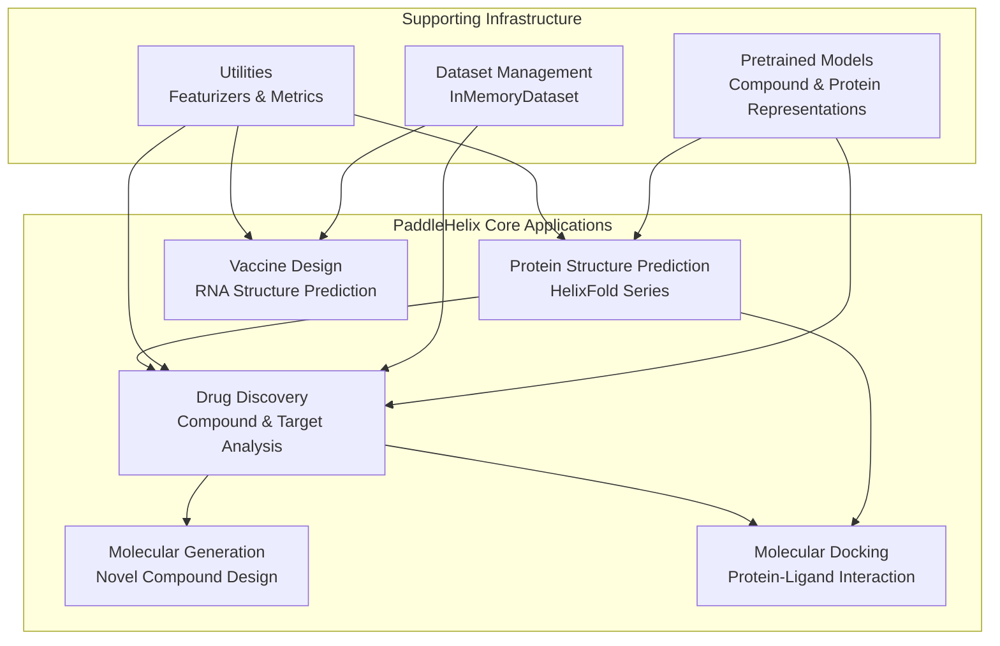
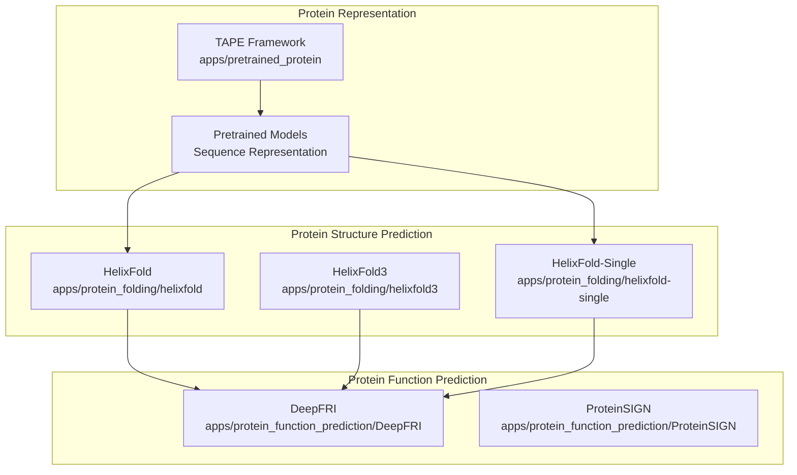
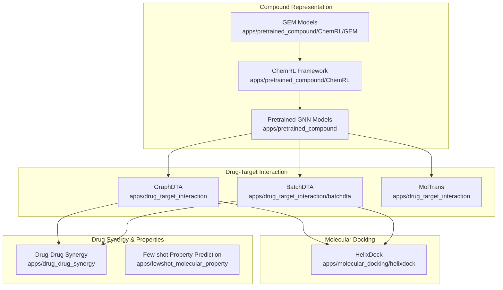
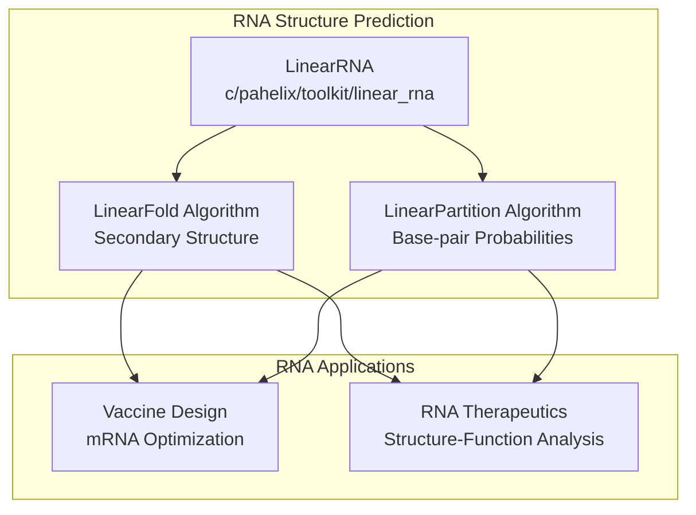
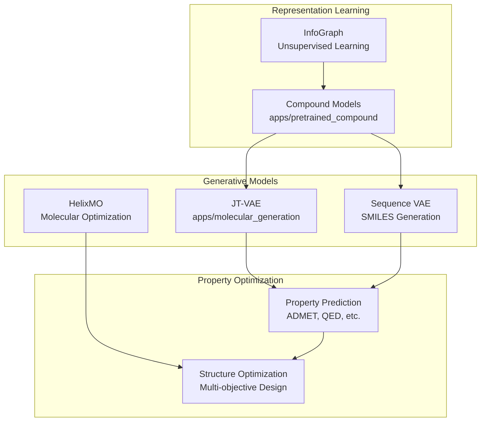
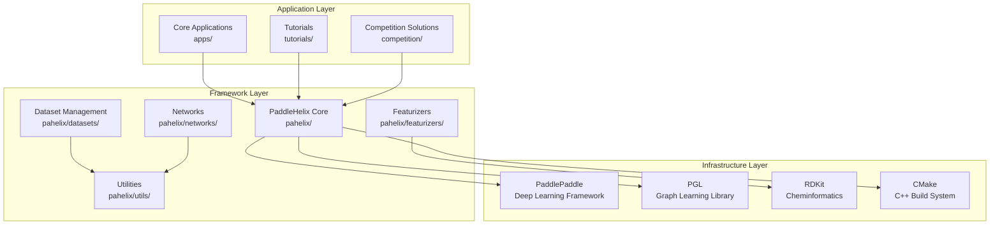

# Core Applications

> **Relevant source files**
> * [README.md](https://github.com/PaddlePaddle/PaddleHelix/blob/7fdd7a18/README.md?plain=1)
> * [README_cn.md](https://github.com/PaddlePaddle/PaddleHelix/blob/7fdd7a18/README_cn.md?plain=1)
> * [apps/README.md](https://github.com/PaddlePaddle/PaddleHelix/blob/7fdd7a18/apps/README.md?plain=1)
> * [apps/README_cn.md](https://github.com/PaddlePaddle/PaddleHelix/blob/7fdd7a18/apps/README_cn.md?plain=1)
> * [apps/molecular_docking/helixdock/README.md](https://github.com/PaddlePaddle/PaddleHelix/blob/7fdd7a18/apps/molecular_docking/helixdock/README.md?plain=1)
> * [apps/molecular_docking/helixdock/README_cn.md](https://github.com/PaddlePaddle/PaddleHelix/blob/7fdd7a18/apps/molecular_docking/helixdock/README_cn.md?plain=1)
> * [apps/protein_function_prediction/ProteinSIGN/custom_metrics.py](https://github.com/PaddlePaddle/PaddleHelix/blob/7fdd7a18/apps/protein_function_prediction/ProteinSIGN/custom_metrics.py)
> * [installation_guide.md](https://github.com/PaddlePaddle/PaddleHelix/blob/7fdd7a18/installation_guide.md?plain=1)
> * [installation_guide_cn.md](https://github.com/PaddlePaddle/PaddleHelix/blob/7fdd7a18/installation_guide_cn.md?plain=1)
> * [setup.py](https://github.com/PaddlePaddle/PaddleHelix/blob/7fdd7a18/setup.py)
> * [tutorials/README.md](https://github.com/PaddlePaddle/PaddleHelix/blob/7fdd7a18/tutorials/README.md?plain=1)
> * [tutorials/README_cn.md](https://github.com/PaddlePaddle/PaddleHelix/blob/7fdd7a18/tutorials/README_cn.md?plain=1)

This document provides an overview of PaddleHelix's core application domains and their interconnections. PaddleHelix is organized around four primary areas: protein structure prediction, drug discovery, vaccine design, and molecular generation. Each domain contains specialized algorithms and models that can be used independently or in combination for comprehensive bio-computing workflows.

For specific implementation details of individual applications, see the corresponding subsections under this page. For installation and setup information, see [Getting Started](/PaddlePaddle/PaddleHelix/2-getting-started).

## Application Domain Overview

PaddleHelix organizes its capabilities into distinct but interconnected application domains, each addressing specific challenges in computational biology and drug discovery.

**Application Domain Relationships**

Sources: [README.md L69-L73](https://github.com/PaddlePaddle/PaddleHelix/blob/7fdd7a18/README.md?plain=1#L69-L73)

 [apps/README.md L3-L21](https://github.com/PaddlePaddle/PaddleHelix/blob/7fdd7a18/apps/README.md?plain=1#L3-L21)

## Protein Structure and Function Applications

The protein structure prediction domain provides state-of-the-art algorithms for predicting three-dimensional protein structures from amino acid sequences.

**Key Components:**

* `HelixFold`: AlphaFold2 implementation for high-accuracy structure prediction
* `HelixFold3`: Biomolecular complex prediction including proteins, nucleic acids, and ligands
* `HelixFold-Single`: MSA-free structure prediction for rapid inference
* `DeepFRI` and `ProteinSIGN`: Function prediction from structure and sequence

Sources: [README.md L108-L111](https://github.com/PaddlePaddle/PaddleHelix/blob/7fdd7a18/README.md?plain=1#L108-L111)

 [apps/README.md L14-L20](https://github.com/PaddlePaddle/PaddleHelix/blob/7fdd7a18/apps/README.md?plain=1#L14-L20)

## Drug Discovery Pipeline

The drug discovery domain encompasses compound representation learning, drug-target interaction prediction, and drug synergy analysis.

**Key Components:**

* `ChemRL`: Chemical representation learning framework
* `GraphDTA`/`BatchDTA`/`MolTrans`: Drug-target affinity prediction models
* `HelixDock`: Protein-ligand docking with pre-trained conformations
* Drug-drug synergy prediction using RGCN architectures

Sources: [README.md L88-L92](https://github.com/PaddlePaddle/PaddleHelix/blob/7fdd7a18/README.md?plain=1#L88-L92)

 [README.md L101-L104](https://github.com/PaddlePaddle/PaddleHelix/blob/7fdd7a18/README.md?plain=1#L101-L104)

 [apps/molecular_docking/helixdock/README.md L2-L6](https://github.com/PaddlePaddle/PaddleHelix/blob/7fdd7a18/apps/molecular_docking/helixdock/README.md?plain=1#L2-L6)

## Vaccine Design and RNA Analysis

The vaccine design domain focuses on RNA structure prediction and design algorithms essential for vaccine development and RNA therapeutics.

**Key Components:**

* `LinearRNA`: C++ implementation of linear-time RNA folding algorithms
* `LinearFold`: Efficient secondary structure prediction
* `LinearPartition`: Partition function calculation for base-pair probabilities

Sources: [README.md L72](https://github.com/PaddlePaddle/PaddleHelix/blob/7fdd7a18/README.md?plain=1#L72-L72)

 [README.md L94](https://github.com/PaddlePaddle/PaddleHelix/blob/7fdd7a18/README.md?plain=1#L94-L94)

 [apps/README.md L12-L13](https://github.com/PaddlePaddle/PaddleHelix/blob/7fdd7a18/apps/README.md?plain=1#L12-L13)

## Molecular Generation Systems

The molecular generation domain provides algorithms for creating novel molecular structures with desired properties.

**Key Components:**

* `JT-VAE`: Junction Tree Variational Autoencoder for molecular graphs
* Sequence-based VAE for SMILES string generation
* `HelixMO`: Sample-efficient molecular optimization
* Integration with compound representation models for property prediction

Sources: [README.md L92](https://github.com/PaddlePaddle/PaddleHelix/blob/7fdd7a18/README.md?plain=1#L92-L92)

 [README.md L31](https://github.com/PaddlePaddle/PaddleHelix/blob/7fdd7a18/README.md?plain=1#L31-L31)

 [apps/README.md L9](https://github.com/PaddlePaddle/PaddleHelix/blob/7fdd7a18/apps/README.md?plain=1#L9-L9)

## Technical Implementation Architecture

The core applications are built on a unified technical foundation that provides consistent APIs and data handling across all domains.

**Key Technical Components:**

* `pahelix/datasets/`: Unified dataset management with `InMemoryDataset` base class
* `pahelix/featurizers/`: Molecular and protein feature extraction
* `pahelix/networks/`: Neural network architectures for bio-computing
* `pahelix/utils/`: Metrics, splitters, and common utilities

Sources: [setup.py L115-L134](https://github.com/PaddlePaddle/PaddleHelix/blob/7fdd7a18/setup.py#L115-L134)

 [installation_guide.md L8-L19](https://github.com/PaddlePaddle/PaddleHelix/blob/7fdd7a18/installation_guide.md?plain=1#L8-L19)

## Integration Patterns and Workflows

Applications within PaddleHelix are designed to work together in integrated workflows, enabling comprehensive bio-computing pipelines.

| Application Domain | Input Data Types | Output Data Types | Integration Points |
| --- | --- | --- | --- |
| Protein Structure | Amino acid sequences | 3D coordinates, PDB files | → Drug Discovery, Function Prediction |
| Drug Discovery | SMILES, compound graphs | Affinity scores, predictions | ← Protein Structure, → Molecular Generation |
| Vaccine Design | RNA sequences | Secondary structures, energies | → Structure-based design |
| Molecular Generation | Property targets | Novel SMILES, structures | ← Drug Discovery, → Property Prediction |
| Molecular Docking | Protein + ligand | Binding poses, scores | ← Protein Structure, ← Drug Discovery |

**Common Integration Patterns:**

1. **Structure-to-Function**: Protein structure prediction → Function/interaction prediction
2. **Target-to-Lead**: Drug-target interaction → Molecular generation → Optimization
3. **Sequence-to-Structure**: RNA/protein sequences → Structure prediction → Downstream applications

Sources: [README.md L69-L73](https://github.com/PaddlePaddle/PaddleHelix/blob/7fdd7a18/README.md?plain=1#L69-L73)

 [tutorials/README.md L6-L12](https://github.com/PaddlePaddle/PaddleHelix/blob/7fdd7a18/tutorials/README.md?plain=1#L6-L12)