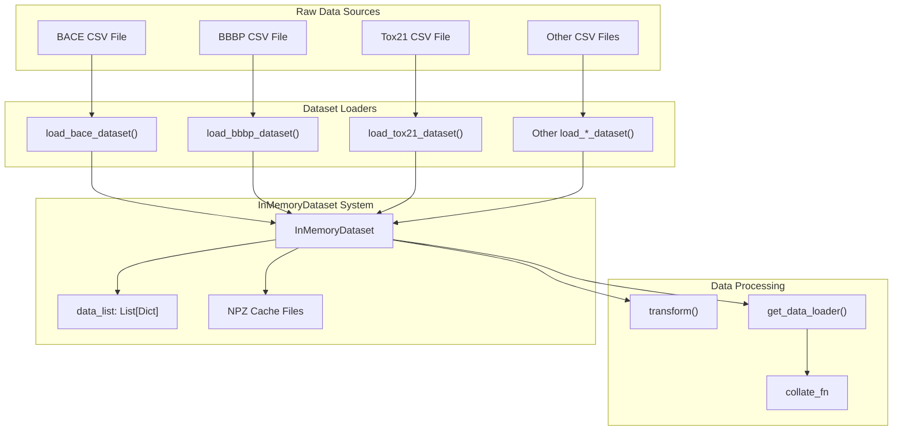
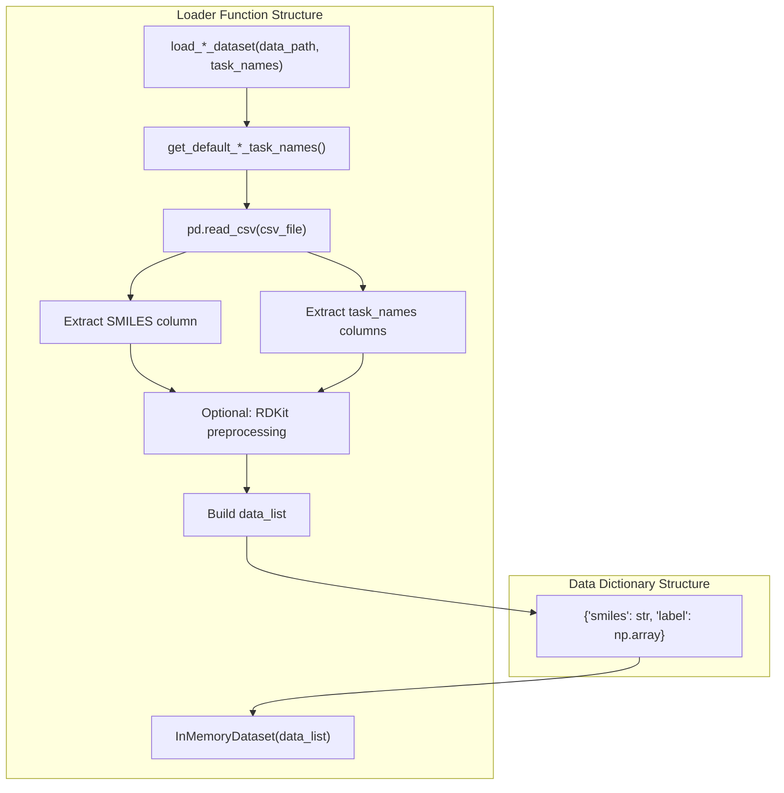
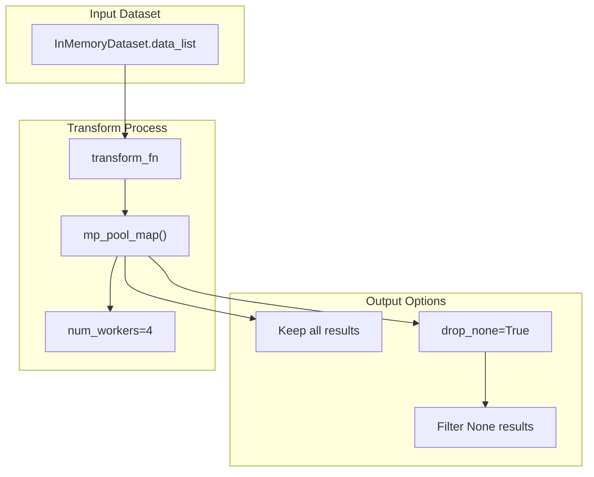

# Dataset Management

> **Relevant source files**
> * [pahelix/datasets/bace_dataset.py](https://github.com/PaddlePaddle/PaddleHelix/blob/7fdd7a18/pahelix/datasets/bace_dataset.py)
> * [pahelix/datasets/bbbp_dataset.py](https://github.com/PaddlePaddle/PaddleHelix/blob/7fdd7a18/pahelix/datasets/bbbp_dataset.py)
> * [pahelix/datasets/clintox_dataset.py](https://github.com/PaddlePaddle/PaddleHelix/blob/7fdd7a18/pahelix/datasets/clintox_dataset.py)
> * [pahelix/datasets/esol_dataset.py](https://github.com/PaddlePaddle/PaddleHelix/blob/7fdd7a18/pahelix/datasets/esol_dataset.py)
> * [pahelix/datasets/freesolv_dataset.py](https://github.com/PaddlePaddle/PaddleHelix/blob/7fdd7a18/pahelix/datasets/freesolv_dataset.py)
> * [pahelix/datasets/hiv_dataset.py](https://github.com/PaddlePaddle/PaddleHelix/blob/7fdd7a18/pahelix/datasets/hiv_dataset.py)
> * [pahelix/datasets/inmemory_dataset.py](https://github.com/PaddlePaddle/PaddleHelix/blob/7fdd7a18/pahelix/datasets/inmemory_dataset.py)
> * [pahelix/datasets/lipophilicity_dataset.py](https://github.com/PaddlePaddle/PaddleHelix/blob/7fdd7a18/pahelix/datasets/lipophilicity_dataset.py)
> * [pahelix/datasets/muv_dataset.py](https://github.com/PaddlePaddle/PaddleHelix/blob/7fdd7a18/pahelix/datasets/muv_dataset.py)
> * [pahelix/datasets/sider_dataset.py](https://github.com/PaddlePaddle/PaddleHelix/blob/7fdd7a18/pahelix/datasets/sider_dataset.py)
> * [pahelix/datasets/tox21_dataset.py](https://github.com/PaddlePaddle/PaddleHelix/blob/7fdd7a18/pahelix/datasets/tox21_dataset.py)
> * [pahelix/datasets/toxcast_dataset.py](https://github.com/PaddlePaddle/PaddleHelix/blob/7fdd7a18/pahelix/datasets/toxcast_dataset.py)

This document covers PaddleHelix's dataset management system, which provides a unified interface for loading, processing, and managing biological and chemical datasets. The system is built around the `InMemoryDataset` class and includes built-in loaders for popular molecular property prediction datasets from MoleculeNet and other sources.

For information about data featurization and preprocessing, see [Compound Representation Learning](/PaddlePaddle/PaddleHelix/3.2.1-compound-representation-learning). For model training workflows that use these datasets, see [Drug Discovery](/PaddlePaddle/PaddleHelix/3.2-drug-discovery).

## Core Dataset Architecture

PaddleHelix's dataset management is centered on the `InMemoryDataset` class, which provides a list-like interface for managing collections of molecular data. The system follows a consistent pattern where raw CSV files are processed by dataset-specific loader functions that return `InMemoryDataset` instances.

### InMemoryDataset Class

The `InMemoryDataset` class serves as the primary container for molecular datasets in PaddleHelix. It manages a `data_list` where each element is a dictionary containing molecular information (typically SMILES strings and labels).

**Core Dataset Architecture**



Sources: [pahelix/datasets/inmemory_dataset.py L33-L169](https://github.com/PaddlePaddle/PaddleHelix/blob/7fdd7a18/pahelix/datasets/inmemory_dataset.py#L33-L169)

 [pahelix/datasets/bace_dataset.py L46-L97](https://github.com/PaddlePaddle/PaddleHelix/blob/7fdd7a18/pahelix/datasets/bace_dataset.py#L46-L97)

 [pahelix/datasets/bbbp_dataset.py L44-L106](https://github.com/PaddlePaddle/PaddleHelix/blob/7fdd7a18/pahelix/datasets/bbbp_dataset.py#L44-L106)

### Dataset Initialization and Caching

The `InMemoryDataset` supports multiple initialization modes for flexible data management:

| Initialization Mode | Description | Use Case |
| --- | --- | --- |
| `data_list` | Direct list of dictionaries | Creating new datasets |
| `npz_data_path` | Path to cached NPZ directory | Loading previously saved datasets |
| `npz_data_files` | List of NPZ file paths | Loading specific cached files |

The caching system automatically partitions large datasets into multiple NPZ files with a default limit of 10,000 samples per file, managed by the `_save_npz_data()` method.

Sources: [pahelix/datasets/inmemory_dataset.py L59-L81](https://github.com/PaddlePaddle/PaddleHelix/blob/7fdd7a18/pahelix/datasets/inmemory_dataset.py#L59-L81)

 [pahelix/datasets/inmemory_dataset.py L96-L103](https://github.com/PaddlePaddle/PaddleHelix/blob/7fdd7a18/pahelix/datasets/inmemory_dataset.py#L96-L103)

## Built-in Dataset Loaders

PaddleHelix includes loaders for multiple datasets commonly used in molecular property prediction and drug discovery research. Each loader follows a standardized pattern for processing raw CSV data into `InMemoryDataset` instances.

### Dataset Loader Pattern

All dataset loaders implement a consistent interface:

**Dataset Loader Implementation Pattern**



Sources: [pahelix/datasets/bace_dataset.py L46-L97](https://github.com/PaddlePaddle/PaddleHelix/blob/7fdd7a18/pahelix/datasets/bace_dataset.py#L46-L97)

 [pahelix/datasets/bbbp_dataset.py L44-L106](https://github.com/PaddlePaddle/PaddleHelix/blob/7fdd7a18/pahelix/datasets/bbbp_dataset.py#L44-L106)

 [pahelix/datasets/clintox_dataset.py L43-L108](https://github.com/PaddlePaddle/PaddleHelix/blob/7fdd7a18/pahelix/datasets/clintox_dataset.py#L43-L108)

### Supported Datasets

The following datasets are supported with dedicated loader functions:

| Dataset | Task Type | Size | Key Features |
| --- | --- | --- | --- |
| **BACE** | Binary Classification | 1,513 compounds | β-secretase inhibitor activity |
| **BBBP** | Binary Classification | 2,039 compounds | Blood-brain barrier penetration |
| **ClinTox** | Multi-task Classification | 1,491 compounds | FDA approval + clinical toxicity |
| **ESOL** | Regression | 1,128 compounds | Aqueous solubility prediction |
| **FreeSolv** | Regression | 642 compounds | Hydration free energy |
| **HIV** | Binary Classification | 41,127 compounds | HIV replication inhibition |
| **Lipophilicity** | Regression | 4,200 compounds | Octanol/water distribution |
| **MUV** | Multi-task Classification | 93,087 compounds | 17 challenging virtual screening tasks |
| **SIDER** | Multi-task Classification | 1,427 compounds | 27 side effect categories |
| **Tox21** | Multi-task Classification | 7,831 compounds | 12 toxicity endpoints |
| **ToxCast** | Multi-task Classification | 8,575 compounds | 600+ toxicity assays |

Sources: [pahelix/datasets/bace_dataset.py L20-L23](https://github.com/PaddlePaddle/PaddleHelix/blob/7fdd7a18/pahelix/datasets/bace_dataset.py#L20-L23)

 [pahelix/datasets/bbbp_dataset.py L20-L22](https://github.com/PaddlePaddle/PaddleHelix/blob/7fdd7a18/pahelix/datasets/bbbp_dataset.py#L20-L22)

 [pahelix/datasets/clintox_dataset.py L20-L21](https://github.com/PaddlePaddle/PaddleHelix/blob/7fdd7a18/pahelix/datasets/clintox_dataset.py#L20-L21)

 [pahelix/datasets/esol_dataset.py L20-L21](https://github.com/PaddlePaddle/PaddleHelix/blob/7fdd7a18/pahelix/datasets/esol_dataset.py#L20-L21)

### Label Processing

Different datasets employ various label preprocessing strategies:

* **Binary Classification**: Convert 0 labels to -1 for compatibility with certain loss functions
* **Multi-task**: Handle missing values by converting NaN to 0 (inactive/unknown)
* **RDKit Preprocessing**: Some datasets apply RDKit molecule standardization to clean SMILES

Sources: [pahelix/datasets/bbbp_dataset.py L94-L95](https://github.com/PaddlePaddle/PaddleHelix/blob/7fdd7a18/pahelix/datasets/bbbp_dataset.py#L94-L95)

 [pahelix/datasets/tox21_dataset.py L86-L87](https://github.com/PaddlePaddle/PaddleHelix/blob/7fdd7a18/pahelix/datasets/tox21_dataset.py#L86-L87)

 [pahelix/datasets/toxcast_dataset.py L97-L98](https://github.com/PaddlePaddle/PaddleHelix/blob/7fdd7a18/pahelix/datasets/toxcast_dataset.py#L97-L98)

## Data Processing Workflows

The `InMemoryDataset` provides several methods for data processing and batch generation that integrate with PaddlePaddle's training infrastructure.

### Transformation Pipeline

The `transform()` method enables parallel processing of datasets using multiprocessing:

**Data Transformation Architecture**



Sources: [pahelix/datasets/inmemory_dataset.py L135-L143](https://github.com/PaddlePaddle/PaddleHelix/blob/7fdd7a18/pahelix/datasets/inmemory_dataset.py#L135-L143)

### Batch Data Loading

The `get_data_loader()` method creates batch iterators compatible with PaddlePaddle training loops:

| Parameter | Description | Default |
| --- | --- | --- |
| `batch_size` | Number of samples per batch | Required |
| `num_workers` | Multiprocessing workers | 4 |
| `shuffle` | Randomize sample order | False |
| `collate_fn` | Batch aggregation function | None |

The data loader uses PGL's `Dataloader` class internally to handle multiprocessed batch generation.

Sources: [pahelix/datasets/inmemory_dataset.py L146-L168](https://github.com/PaddlePaddle/PaddleHelix/blob/7fdd7a18/pahelix/datasets/inmemory_dataset.py#L146-L168)

## Usage Examples

### Basic Dataset Loading

```javascript
# Load a dataset with default task namesfrom pahelix.datasets.bace_dataset import load_bace_datasetdataset = load_bace_dataset('./bace_data')print(f"Dataset size: {len(dataset)}") # Access individual samplessample = dataset[0]print(f"SMILES: {sample['smiles']}")print(f"Label: {sample['label']}")
```

### Custom Task Selection

```javascript
# Load multi-task dataset with specific tasksfrom pahelix.datasets.tox21_dataset import load_tox21_dataset, get_default_tox21_task_names # Get all available tasksall_tasks = get_default_tox21_task_names()print(f"Available tasks: {all_tasks}") # Load subset of tasksselected_tasks = ['NR-AR', 'NR-ER', 'SR-ARE']dataset = load_tox21_dataset('./tox21_data', task_names=selected_tasks)
```

### Dataset Caching and Reloading

```python
# Save processed dataset to cachedataset.save_data('./cached_dataset') # Reload from cache (much faster)cached_dataset = InMemoryDataset(npz_data_path='./cached_dataset')
```

### Integration with Training Pipeline

```sql
# Create data loader for trainingtrain_loader = dataset.get_data_loader(    batch_size=32,    num_workers=4,    shuffle=True,    collate_fn=my_collate_function) # Use in training loopfor batch in train_loader:    # Process batch for model training    pass
```

Sources: [pahelix/datasets/bace_dataset.py L67-L71](https://github.com/PaddlePaddle/PaddleHelix/blob/7fdd7a18/pahelix/datasets/bace_dataset.py#L67-L71)

 [pahelix/datasets/inmemory_dataset.py L48-L57](https://github.com/PaddlePaddle/PaddleHelix/blob/7fdd7a18/pahelix/datasets/inmemory_dataset.py#L48-L57)