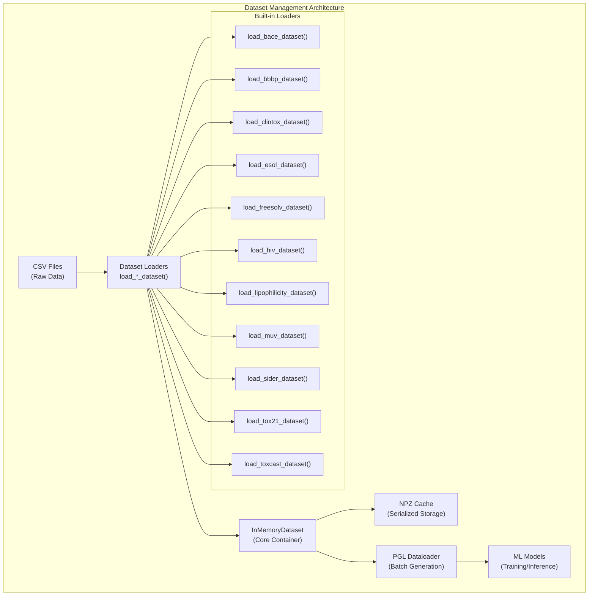
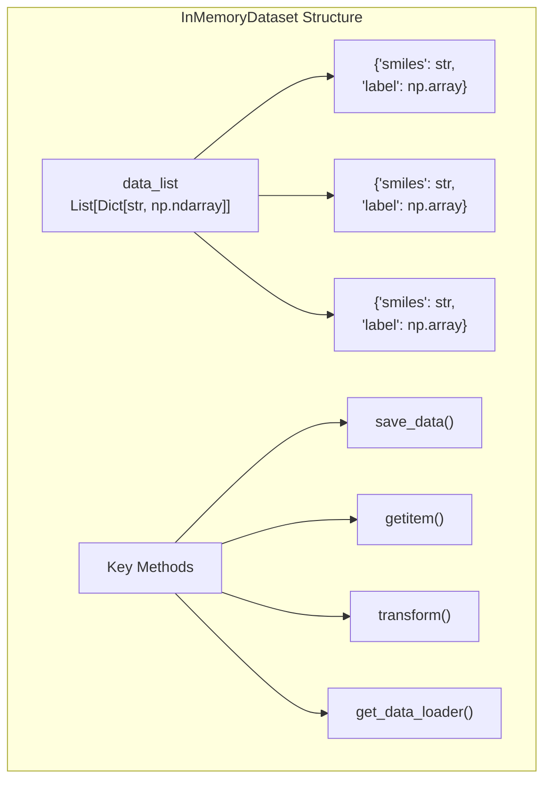
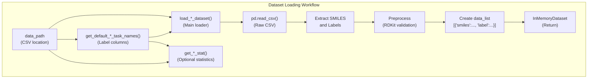
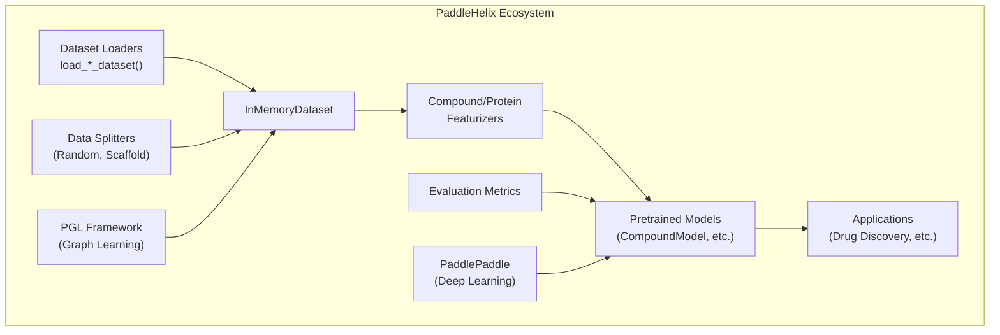

# Datasets and Utilities

> **Relevant source files**
> * [pahelix/datasets/bace_dataset.py](https://github.com/PaddlePaddle/PaddleHelix/blob/7fdd7a18/pahelix/datasets/bace_dataset.py)
> * [pahelix/datasets/bbbp_dataset.py](https://github.com/PaddlePaddle/PaddleHelix/blob/7fdd7a18/pahelix/datasets/bbbp_dataset.py)
> * [pahelix/datasets/clintox_dataset.py](https://github.com/PaddlePaddle/PaddleHelix/blob/7fdd7a18/pahelix/datasets/clintox_dataset.py)
> * [pahelix/datasets/esol_dataset.py](https://github.com/PaddlePaddle/PaddleHelix/blob/7fdd7a18/pahelix/datasets/esol_dataset.py)
> * [pahelix/datasets/freesolv_dataset.py](https://github.com/PaddlePaddle/PaddleHelix/blob/7fdd7a18/pahelix/datasets/freesolv_dataset.py)
> * [pahelix/datasets/hiv_dataset.py](https://github.com/PaddlePaddle/PaddleHelix/blob/7fdd7a18/pahelix/datasets/hiv_dataset.py)
> * [pahelix/datasets/inmemory_dataset.py](https://github.com/PaddlePaddle/PaddleHelix/blob/7fdd7a18/pahelix/datasets/inmemory_dataset.py)
> * [pahelix/datasets/lipophilicity_dataset.py](https://github.com/PaddlePaddle/PaddleHelix/blob/7fdd7a18/pahelix/datasets/lipophilicity_dataset.py)
> * [pahelix/datasets/muv_dataset.py](https://github.com/PaddlePaddle/PaddleHelix/blob/7fdd7a18/pahelix/datasets/muv_dataset.py)
> * [pahelix/datasets/sider_dataset.py](https://github.com/PaddlePaddle/PaddleHelix/blob/7fdd7a18/pahelix/datasets/sider_dataset.py)
> * [pahelix/datasets/tox21_dataset.py](https://github.com/PaddlePaddle/PaddleHelix/blob/7fdd7a18/pahelix/datasets/tox21_dataset.py)
> * [pahelix/datasets/toxcast_dataset.py](https://github.com/PaddlePaddle/PaddleHelix/blob/7fdd7a18/pahelix/datasets/toxcast_dataset.py)

This section covers PaddleHelix's dataset management infrastructure and built-in biological datasets. The system provides a unified interface for loading, processing, and managing various molecular and biological datasets commonly used in drug discovery and computational biology research. For information about pretrained models that work with these datasets, see [Pretrained Models](/PaddlePaddle/PaddleHelix/4-pretrained-models).

## Overview

PaddleHelix provides a comprehensive dataset management system built around the `InMemoryDataset` class, which serves as the core data container for all biological datasets. The system includes built-in loaders for popular benchmark datasets from MoleculeNet and other sources, along with utilities for data processing, splitting, and batch generation.



Sources: [pahelix/datasets/inmemory_dataset.py L1-L169](https://github.com/PaddlePaddle/PaddleHelix/blob/7fdd7a18/pahelix/datasets/inmemory_dataset.py#L1-L169)

 [pahelix/datasets/bace_dataset.py L1-L102](https://github.com/PaddlePaddle/PaddleHelix/blob/7fdd7a18/pahelix/datasets/bace_dataset.py#L1-L102)

 [pahelix/datasets/bbbp_dataset.py L1-L107](https://github.com/PaddlePaddle/PaddleHelix/blob/7fdd7a18/pahelix/datasets/bbbp_dataset.py#L1-L107)

## Core Dataset Management

### InMemoryDataset Class

The `InMemoryDataset` class is the foundation of PaddleHelix's dataset system. It manages a list of data dictionaries where each dictionary represents a single data sample with consistent keys across all samples.

**Key Features:**

* **Data Storage**: Manages `data_list` containing dictionaries of numpy arrays
* **Persistence**: Save/load functionality using NPZ format
* **Indexing**: List-like access with slicing support
* **Batch Processing**: Integration with PGL's `Dataloader` for batch generation
* **Transformations**: Multiprocess data transformation capabilities



**Constructor Options:**

* `data_list`: Direct list of data dictionaries
* `npz_data_path`: Path to cached NPZ files directory
* `npz_data_files`: List of specific NPZ files to load

Sources: [pahelix/datasets/inmemory_dataset.py L33-L58](https://github.com/PaddlePaddle/PaddleHelix/blob/7fdd7a18/pahelix/datasets/inmemory_dataset.py#L33-L58)

 [pahelix/datasets/inmemory_dataset.py L59-L81](https://github.com/PaddlePaddle/PaddleHelix/blob/7fdd7a18/pahelix/datasets/inmemory_dataset.py#L59-L81)

### Data Loading and Caching

The system supports efficient data caching through NPZ format serialization:

```python
# Save dataset to diskdataset.save_data('./cached_data') # Load from cached filescached_dataset = InMemoryDataset(npz_data_path='./cached_data')
```

The `save_data()` method automatically splits large datasets into multiple NPZ files (default: 10,000 samples per file) for efficient loading.

Sources: [pahelix/datasets/inmemory_dataset.py L96-L113](https://github.com/PaddlePaddle/PaddleHelix/blob/7fdd7a18/pahelix/datasets/inmemory_dataset.py#L96-L113)

## Built-in Datasets

### Dataset Categories

PaddleHelix includes loaders for several categories of biological datasets:

| Category | Datasets | Task Type | Description |
| --- | --- | --- | --- |
| **Drug Safety** | BACE, BBBP, ClinTox, SIDER | Classification | Drug safety and toxicity prediction |
| **Toxicology** | Tox21, ToxCast | Multi-task Classification | Environmental and biological toxicity |
| **Antiviral** | HIV | Classification | HIV replication inhibition |
| **Molecular Properties** | ESOL, FreeSolv, Lipophilicity | Regression | Physical-chemical properties |
| **Virtual Screening** | MUV | Classification | Bioassay activity prediction |

### Common Dataset Loading Pattern

All dataset loaders follow a consistent pattern:



**Standard Function Signatures:**

* `get_default_*_task_names()`: Returns list of label column names
* `load_*_dataset(data_path, task_names=None)`: Main loading function
* `get_*_stat(data_path, task_names)`: Statistics calculation (for regression tasks)

Sources: [pahelix/datasets/bace_dataset.py L41-L44](https://github.com/PaddlePaddle/PaddleHelix/blob/7fdd7a18/pahelix/datasets/bace_dataset.py#L41-L44)

 [pahelix/datasets/bace_dataset.py L46-L98](https://github.com/PaddlePaddle/PaddleHelix/blob/7fdd7a18/pahelix/datasets/bace_dataset.py#L46-L98)

### Dataset Details

#### Classification Datasets

**BACE (Beta-secretase 1)**

* **Task**: Binary classification of BACE-1 inhibitors
* **Size**: 1,522 compounds
* **Labels**: `['Class']` - inhibitor activity
* **Source**: Scientific literature compilation

**BBBP (Blood-Brain Barrier Penetration)**

* **Task**: Binary classification of BBB permeability
* **Size**: ~2,000 compounds
* **Labels**: `['p_np']` - penetration/non-penetration
* **Preprocessing**: RDKit SMILES validation and canonicalization

**ClinTox (Clinical Toxicity)**

* **Task**: Multi-task binary classification
* **Size**: 1,491 compounds
* **Labels**: `['FDA_APPROVED', 'CT_TOX']` - FDA approval and clinical trial toxicity

**HIV (Antiviral Activity)**

* **Task**: Binary classification of HIV replication inhibition
* **Size**: ~40,000 compounds
* **Labels**: `['HIV_active']` - active/inactive classification

Sources: [pahelix/datasets/bace_dataset.py L17-L28](https://github.com/PaddlePaddle/PaddleHelix/blob/7fdd7a18/pahelix/datasets/bace_dataset.py#L17-L28)

 [pahelix/datasets/bbbp_dataset.py L17-L26](https://github.com/PaddlePaddle/PaddleHelix/blob/7fdd7a18/pahelix/datasets/bbbp_dataset.py#L17-L26)

 [pahelix/datasets/clintox_dataset.py L17-L25](https://github.com/PaddlePaddle/PaddleHelix/blob/7fdd7a18/pahelix/datasets/clintox_dataset.py#L17-L25)

 [pahelix/datasets/hiv_dataset.py L17-L25](https://github.com/PaddlePaddle/PaddleHelix/blob/7fdd7a18/pahelix/datasets/hiv_dataset.py#L17-L25)

#### Regression Datasets

**ESOL (Aqueous Solubility)**

* **Task**: Regression of water solubility
* **Size**: 1,128 compounds
* **Labels**: `['measured log solubility in mols per litre']`
* **Statistics**: Mean, std, and count calculation available

**FreeSolv (Hydration Free Energy)**

* **Task**: Regression of solvation free energy
* **Size**: 642 compounds
* **Labels**: `['expt']` - experimental hydration free energy

**Lipophilicity (LogD)**

* **Task**: Regression of octanol/water distribution coefficient
* **Size**: 4,200 compounds
* **Labels**: `['exp']` - experimental logD at pH 7.4

Sources: [pahelix/datasets/esol_dataset.py L17-L25](https://github.com/PaddlePaddle/PaddleHelix/blob/7fdd7a18/pahelix/datasets/esol_dataset.py#L17-L25)

 [pahelix/datasets/freesolv_dataset.py L17-L25](https://github.com/PaddlePaddle/PaddleHelix/blob/7fdd7a18/pahelix/datasets/freesolv_dataset.py#L17-L25)

 [pahelix/datasets/lipophilicity_dataset.py L17-L25](https://github.com/PaddlePaddle/PaddleHelix/blob/7fdd7a18/pahelix/datasets/lipophilicity_dataset.py#L17-L25)

#### Multi-task Datasets

**Tox21 (Toxicology 21st Century)**

* **Task**: 12-task binary classification
* **Size**: ~8,000 compounds
* **Labels**: Nuclear receptor (NR-*) and stress response (SR-*) pathways
* **Missing Values**: NaN converted to 0, inactive labels converted to -1

**ToxCast (Extended Toxicology)**

* **Task**: 600+ bioassay classification tasks
* **Size**: ~8,000 compounds
* **Labels**: Dynamic task names extracted from CSV headers
* **Processing**: Extensive RDKit validation and missing value handling

**SIDER (Side Effect Resource)**

* **Task**: 27-task classification of adverse drug reactions
* **Size**: 1,427 compounds
* **Labels**: Medical Dictionary for Regulatory Activities (MedDRA) classifications

Sources: [pahelix/datasets/tox21_dataset.py L17-L25](https://github.com/PaddlePaddle/PaddleHelix/blob/7fdd7a18/pahelix/datasets/tox21_dataset.py#L17-L25)

 [pahelix/datasets/toxcast_dataset.py L17-L25](https://github.com/PaddlePaddle/PaddleHelix/blob/7fdd7a18/pahelix/datasets/toxcast_dataset.py#L17-L25)

 [pahelix/datasets/sider_dataset.py L17-L25](https://github.com/PaddlePaddle/PaddleHelix/blob/7fdd7a18/pahelix/datasets/sider_dataset.py#L17-L25)

## Data Processing Utilities

### Label Preprocessing

Most classification datasets apply consistent label transformations:

```markdown
# Convert 0 to -1 for binary classificationlabels = labels.replace(0, -1) # Handle missing valueslabels = labels.fillna(0)  # NaN to 0 (unlabeled)
```

This preprocessing ensures compatibility with PaddlePaddle's binary classification expectations.

Sources: [pahelix/datasets/bbbp_dataset.py L93-L96](https://github.com/PaddlePaddle/PaddleHelix/blob/7fdd7a18/pahelix/datasets/bbbp_dataset.py#L93-L96)

 [pahelix/datasets/tox21_dataset.py L86-L87](https://github.com/PaddlePaddle/PaddleHelix/blob/7fdd7a18/pahelix/datasets/tox21_dataset.py#L86-L87)

### SMILES Validation

Several datasets include RDKit-based SMILES validation:

```javascript
from rdkit.Chem import AllChem # Validate and canonicalize SMILESrdkit_mol_objs = [AllChem.MolFromSmiles(s) for s in smiles_list]preprocessed_mols = [m if m is not None else None for m in rdkit_mol_objs]canonical_smiles = [AllChem.MolToSmiles(m) if m is not None else None                    for m in preprocessed_mols]
```

Invalid SMILES are filtered out during dataset construction.

Sources: [pahelix/datasets/bbbp_dataset.py L86-L91](https://github.com/PaddlePaddle/PaddleHelix/blob/7fdd7a18/pahelix/datasets/bbbp_dataset.py#L86-L91)

 [pahelix/datasets/toxcast_dataset.py L88-L95](https://github.com/PaddlePaddle/PaddleHelix/blob/7fdd7a18/pahelix/datasets/toxcast_dataset.py#L88-L95)

### Statistics Calculation

Regression datasets provide statistical utilities:

```python
def get_esol_stat(data_path, task_names):    """Return mean and std of labels"""    # Load CSV and calculate statistics    return {        'mean': np.mean(labels, 0),        'std': np.std(labels, 0),         'N': len(labels)    }
```

Sources: [pahelix/datasets/esol_dataset.py L93-L103](https://github.com/PaddlePaddle/PaddleHelix/blob/7fdd7a18/pahelix/datasets/esol_dataset.py#L93-L103)

 [pahelix/datasets/freesolv_dataset.py L94-L104](https://github.com/PaddlePaddle/PaddleHelix/blob/7fdd7a18/pahelix/datasets/freesolv_dataset.py#L94-L104)

## Integration with PaddleHelix

### Featurizer Integration

Datasets work seamlessly with PaddleHelix featurizers for molecular representation:

```javascript
from pahelix.featurizers.compound_featurizer import CompoundFeaturizer dataset = load_bace_dataset('./bace_data')featurizer = CompoundFeaturizer() # Transform SMILES to molecular graphsdataset.transform(featurizer.gen_features, num_workers=4)
```

### Model Training Integration

The `get_data_loader()` method integrates with PGL's training pipeline:

```rust
train_loader = dataset.get_data_loader(    batch_size=32,    num_workers=4,    shuffle=True,    collate_fn=collate_fn  # Batch aggregation function) for batch_data in train_loader:    # Training loop    pass
```

Sources: [pahelix/datasets/inmemory_dataset.py L146-L168](https://github.com/PaddlePaddle/PaddleHelix/blob/7fdd7a18/pahelix/datasets/inmemory_dataset.py#L146-L168)

### Relationship to Other Systems



The dataset system serves as the foundation layer that feeds into PaddleHelix's featurization, modeling, and application layers, providing a standardized interface for biological data processing.

Sources: [pahelix/datasets/inmemory_dataset.py L24](https://github.com/PaddlePaddle/PaddleHelix/blob/7fdd7a18/pahelix/datasets/inmemory_dataset.py#L24-L24)

 [pahelix/datasets/inmemory_dataset.py L164-L168](https://github.com/PaddlePaddle/PaddleHelix/blob/7fdd7a18/pahelix/datasets/inmemory_dataset.py#L164-L168)