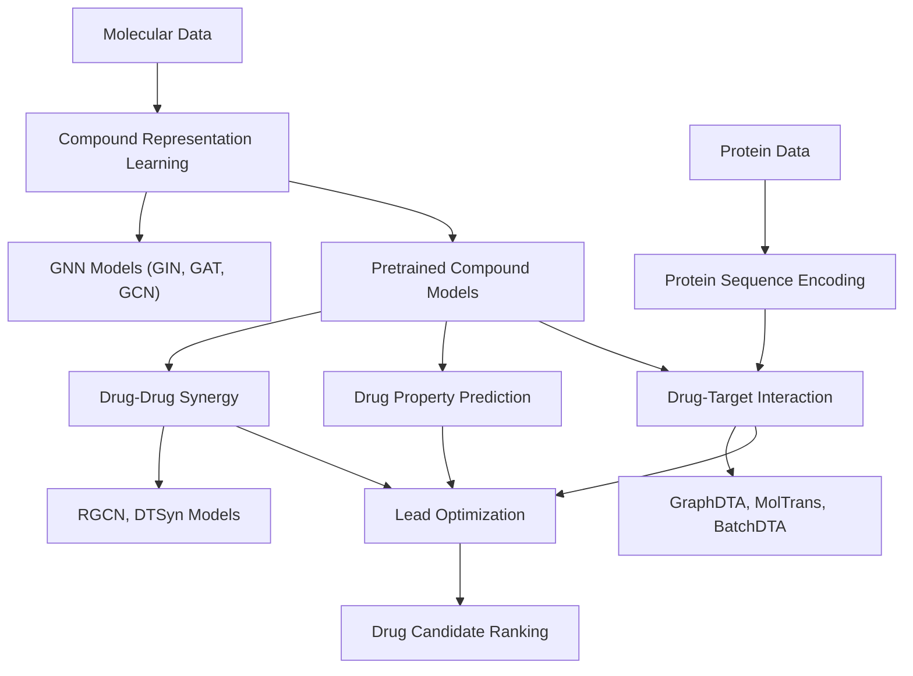
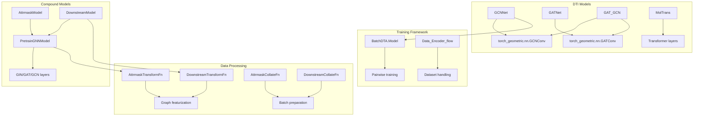

# Drug Discovery

> **Relevant source files**
> * [apps/drug_target_interaction/README.md](https://github.com/PaddlePaddle/PaddleHelix/blob/7fdd7a18/apps/drug_target_interaction/README.md?plain=1)
> * [apps/drug_target_interaction/README_cn.md](https://github.com/PaddlePaddle/PaddleHelix/blob/7fdd7a18/apps/drug_target_interaction/README_cn.md?plain=1)
> * [apps/drug_target_interaction/batchdta/README.md](https://github.com/PaddlePaddle/PaddleHelix/blob/7fdd7a18/apps/drug_target_interaction/batchdta/README.md?plain=1)
> * [apps/drug_target_interaction/batchdta/pairwise/DeepDTA/model.py](https://github.com/PaddlePaddle/PaddleHelix/blob/7fdd7a18/apps/drug_target_interaction/batchdta/pairwise/DeepDTA/model.py)
> * [apps/drug_target_interaction/batchdta/pairwise/DeepDTA/run_pairwise_deepdta_CV.py](https://github.com/PaddlePaddle/PaddleHelix/blob/7fdd7a18/apps/drug_target_interaction/batchdta/pairwise/DeepDTA/run_pairwise_deepdta_CV.py)
> * [apps/drug_target_interaction/batchdta/pairwise/DeepDTA/run_pairwise_deepdta_bindingDB.py](https://github.com/PaddlePaddle/PaddleHelix/blob/7fdd7a18/apps/drug_target_interaction/batchdta/pairwise/DeepDTA/run_pairwise_deepdta_bindingDB.py)
> * [apps/drug_target_interaction/batchdta/pairwise/DeepDTA/utils.py](https://github.com/PaddlePaddle/PaddleHelix/blob/7fdd7a18/apps/drug_target_interaction/batchdta/pairwise/DeepDTA/utils.py)
> * [apps/drug_target_interaction/batchdta/pairwise/GraphDTA/models/gat.py](https://github.com/PaddlePaddle/PaddleHelix/blob/7fdd7a18/apps/drug_target_interaction/batchdta/pairwise/GraphDTA/models/gat.py)
> * [apps/drug_target_interaction/batchdta/pairwise/GraphDTA/models/gat_gcn.py](https://github.com/PaddlePaddle/PaddleHelix/blob/7fdd7a18/apps/drug_target_interaction/batchdta/pairwise/GraphDTA/models/gat_gcn.py)
> * [apps/drug_target_interaction/batchdta/pairwise/GraphDTA/models/gcn.py](https://github.com/PaddlePaddle/PaddleHelix/blob/7fdd7a18/apps/drug_target_interaction/batchdta/pairwise/GraphDTA/models/gcn.py)
> * [apps/drug_target_interaction/moltrans_dti/README.md](https://github.com/PaddlePaddle/PaddleHelix/blob/7fdd7a18/apps/drug_target_interaction/moltrans_dti/README.md?plain=1)
> * [apps/pretrained_compound/pretrain_gnns/README.md](https://github.com/PaddlePaddle/PaddleHelix/blob/7fdd7a18/apps/pretrained_compound/pretrain_gnns/README.md?plain=1)
> * [apps/pretrained_compound/pretrain_gnns/README_cn.md](https://github.com/PaddlePaddle/PaddleHelix/blob/7fdd7a18/apps/pretrained_compound/pretrain_gnns/README_cn.md?plain=1)
> * [apps/pretrained_compound/pretrain_gnns/imgs/Evaluation_results.png](https://github.com/PaddlePaddle/PaddleHelix/blob/7fdd7a18/apps/pretrained_compound/pretrain_gnns/imgs/Evaluation_results.png)
> * [apps/pretrained_compound/pretrain_gnns/imgs/pregnn.png](https://github.com/PaddlePaddle/PaddleHelix/blob/7fdd7a18/apps/pretrained_compound/pretrain_gnns/imgs/pregnn.png)
> * [tutorials/compound_property_prediction_tutorial.ipynb](https://github.com/PaddlePaddle/PaddleHelix/blob/7fdd7a18/tutorials/compound_property_prediction_tutorial.ipynb)
> * [tutorials/compound_property_prediction_tutorial_cn.ipynb](https://github.com/PaddlePaddle/PaddleHelix/blob/7fdd7a18/tutorials/compound_property_prediction_tutorial_cn.ipynb)

## Purpose and Scope

This section covers PaddleHelix's drug discovery capabilities, which provide a comprehensive platform for computational drug discovery and development. The framework implements state-of-the-art deep learning methods for molecular property prediction, drug-target interaction analysis, and drug combination studies.

For protein structure prediction methods, see [Protein Structure Prediction](/PaddlePaddle/PaddleHelix/3.1-protein-structure-prediction). For molecular generation techniques, see [Molecular Generation](/PaddlePaddle/PaddleHelix/3.4-molecular-generation). For pretrained model details, see [Pretrained Models](/PaddlePaddle/PaddleHelix/4-pretrained-models).

## Drug Discovery Pipeline Overview

PaddleHelix implements a complete computational drug discovery pipeline that integrates multiple interconnected components:



**Drug Discovery Pipeline in PaddleHelix**

This pipeline transforms raw molecular and protein data into actionable insights for drug discovery through three main analytical pathways that can be used independently or in combination.

Sources: [apps/pretrained_compound/pretrain_gnns/README.md](https://github.com/PaddlePaddle/PaddleHelix/blob/7fdd7a18/apps/pretrained_compound/pretrain_gnns/README.md?plain=1)

 [apps/drug_target_interaction/README.md](https://github.com/PaddlePaddle/PaddleHelix/blob/7fdd7a18/apps/drug_target_interaction/README.md?plain=1)

 [tutorials/compound_property_prediction_tutorial.ipynb](https://github.com/PaddlePaddle/PaddleHelix/blob/7fdd7a18/tutorials/compound_property_prediction_tutorial.ipynb)

## Core Components

### Compound Representation Learning

PaddleHelix provides sophisticated graph neural network models for learning molecular representations from chemical structures. The system supports both supervised and self-supervised pretraining strategies.

**Key Models and Classes:**

* `PretrainGNNModel`: Base GNN architecture supporting GIN, GAT, and GCN variants
* `AttrmaskModel`: Self-supervised pretraining through attribute masking
* `DownstreamModel`: Fine-tuning for specific molecular property prediction tasks

**Pretraining Strategies:**

* **Attribute Masking**: Randomly masks atom types and predicts masked attributes
* **Context Prediction**: Predicts molecular substructure relationships
* **Supervised Pretraining**: Multi-task learning on large-scale bioactivity datasets

Sources: [apps/pretrained_compound/pretrain_gnns/README.md](https://github.com/PaddlePaddle/PaddleHelix/blob/7fdd7a18/apps/pretrained_compound/pretrain_gnns/README.md?plain=1)

 [tutorials/compound_property_prediction_tutorial.ipynb](https://github.com/PaddlePaddle/PaddleHelix/blob/7fdd7a18/tutorials/compound_property_prediction_tutorial.ipynb)

### Drug-Target Interaction Prediction

The platform implements multiple state-of-the-art architectures for predicting binding affinities between drug compounds and protein targets.

**Available Methods:**

* **GraphDTA**: Graph neural networks combined with CNN for protein sequences
* **MolTrans**: Transformer-based molecular interaction modeling
* **BatchDTA**: Batch-sensitive training framework to handle experimental batch effects
* **S-MAN**: Attention mechanisms for drug-target interaction
* **SIGN**: Simplified graph convolution networks

**Key Datasets:**

* DAVIS: Kinase inhibitor binding affinities (Kd values)
* KIBA: Integrated binding affinity scores for 2,116 drugs and 229 targets
* BindingDB: Large-scale protein-ligand binding database
* ChEMBL: Bioactivity database with >1.6M compound structures

Sources: [apps/drug_target_interaction/README.md](https://github.com/PaddlePaddle/PaddleHelix/blob/7fdd7a18/apps/drug_target_interaction/README.md?plain=1)

 [apps/drug_target_interaction/moltrans_dti/README.md](https://github.com/PaddlePaddle/PaddleHelix/blob/7fdd7a18/apps/drug_target_interaction/moltrans_dti/README.md?plain=1)

 [apps/drug_target_interaction/batchdta/README.md](https://github.com/PaddlePaddle/PaddleHelix/blob/7fdd7a18/apps/drug_target_interaction/batchdta/README.md?plain=1)

### Drug-Drug Synergy Analysis

PaddleHelix supports prediction of synergistic drug combinations through specialized graph-based models that analyze drug interaction networks.

**Models:**

* **RGCN**: Relational graph convolutional networks for drug combination effects
* **DTSyn**: Deep learning models for drug synergy prediction

Sources: [apps/drug_target_interaction/README_cn.md](https://github.com/PaddlePaddle/PaddleHelix/blob/7fdd7a18/apps/drug_target_interaction/README_cn.md?plain=1)

## Model Architecture and Code Entities



**Code Entity Mapping for Drug Discovery Models**

This diagram shows the relationship between conceptual model types and their concrete implementations in the codebase, facilitating navigation from high-level concepts to specific code files.

Sources: [apps/pretrained_compound/pretrain_gnns/README.md](https://github.com/PaddlePaddle/PaddleHelix/blob/7fdd7a18/apps/pretrained_compound/pretrain_gnns/README.md?plain=1)

 [apps/drug_target_interaction/batchdta/pairwise/GraphDTA/models/gcn.py](https://github.com/PaddlePaddle/PaddleHelix/blob/7fdd7a18/apps/drug_target_interaction/batchdta/pairwise/GraphDTA/models/gcn.py)

 [apps/drug_target_interaction/batchdta/pairwise/GraphDTA/models/gat.py](https://github.com/PaddlePaddle/PaddleHelix/blob/7fdd7a18/apps/drug_target_interaction/batchdta/pairwise/GraphDTA/models/gat.py)

 [apps/drug_target_interaction/batchdta/pairwise/DeepDTA/model.py](https://github.com/PaddlePaddle/PaddleHelix/blob/7fdd7a18/apps/drug_target_interaction/batchdta/pairwise/DeepDTA/model.py)

## Datasets and Evaluation

### Molecular Property Datasets

| Dataset | Purpose | Size | Tasks | Metrics |
| --- | --- | --- | --- | --- |
| BACE | β-secretase inhibition | 1,522 compounds | Binary classification | ROC-AUC |
| BBBP | Blood-brain barrier permeability | 2,000+ compounds | Binary classification | ROC-AUC |
| Tox21 | Toxicity prediction | 8K compounds | 12 tasks | ROC-AUC |
| SIDER | Side effects | 1,427 drugs | 27 tasks | ROC-AUC |
| HIV | Anti-HIV activity | 40K+ compounds | Binary classification | ROC-AUC |

### Drug-Target Interaction Datasets

| Dataset | Drugs | Targets | Interactions | Metric |
| --- | --- | --- | --- | --- |
| DAVIS | 68 | 442 | 30,056 | Concordance Index |
| KIBA | 2,116 | 229 | 118,254 | Concordance Index |
| BindingDB | 11K ligands | 110 targets | 20K affinities | MSE, CI |
| ChEMBL | 1.6M compounds | 11K targets | 14M activities | Various |

Sources: [apps/pretrained_compound/pretrain_gnns/README.md](https://github.com/PaddlePaddle/PaddleHelix/blob/7fdd7a18/apps/pretrained_compound/pretrain_gnns/README.md?plain=1)

 [apps/drug_target_interaction/moltrans_dti/README.md](https://github.com/PaddlePaddle/PaddleHelix/blob/7fdd7a18/apps/drug_target_interaction/moltrans_dti/README.md?plain=1)

## Usage Workflow

### 1. Compound Pretraining

```rust
# Load configuration and initialize modelscompound_encoder_config = load_json_config("model_configs/pregnn_paper.json")compound_encoder = PretrainGNNModel(compound_encoder_config)model = AttrmaskModel(model_config, compound_encoder) # Prepare dataset with featurizationtransform_fn = AttrmaskTransformFn()dataset.transform(transform_fn, num_workers=2)
```

### 2. Downstream Fine-tuning

```markdown
# Initialize downstream model with pretrained encodermodel = DownstreamModel(model_config, compound_encoder)compound_encoder.set_state_dict(paddle.load('pretrain_model.pdparams')) # Fine-tune on specific tasksdataset = load_tox21_dataset("./data/tox21", task_names)dataset.transform(DownstreamTransformFn(), num_workers=4)
```

### 3. Drug-Target Interaction Prediction

Training GraphDTA models:

```markdown
# GCN-based GraphDTApython train_davis.py --batchsize 512 --epochs 100 --model 2 # MolTrans for DTIpython train_reg.py --batchsize 64 --epochs 200 --dataset benchmark_davis
```

Sources: [tutorials/compound_property_prediction_tutorial.ipynb](https://github.com/PaddlePaddle/PaddleHelix/blob/7fdd7a18/tutorials/compound_property_prediction_tutorial.ipynb)

 [apps/drug_target_interaction/moltrans_dti/README.md](https://github.com/PaddlePaddle/PaddleHelix/blob/7fdd7a18/apps/drug_target_interaction/moltrans_dti/README.md?plain=1)

## Integration with PaddleHelix Ecosystem

The drug discovery module integrates seamlessly with other PaddleHelix components:

* **Protein Structure Prediction**: Uses HelixFold outputs as 3D structural features for drug-target modeling
* **Molecular Generation**: Leverages compound representations for guided molecular design
* **Datasets and Utilities**: Shares common data processing pipelines and evaluation metrics

For detailed implementation guides, see [Compound Representation Learning](/PaddlePaddle/PaddleHelix/3.2.1-compound-representation-learning), [Drug-Target Interaction](/PaddlePaddle/PaddleHelix/3.2.2-drug-target-interaction), and [Drug-Drug Synergy](/PaddlePaddle/PaddleHelix/3.2.3-drug-drug-synergy).

Sources: [apps/pretrained_compound/pretrain_gnns/README.md](https://github.com/PaddlePaddle/PaddleHelix/blob/7fdd7a18/apps/pretrained_compound/pretrain_gnns/README.md?plain=1)

 [apps/drug_target_interaction/README.md](https://github.com/PaddlePaddle/PaddleHelix/blob/7fdd7a18/apps/drug_target_interaction/README.md?plain=1)