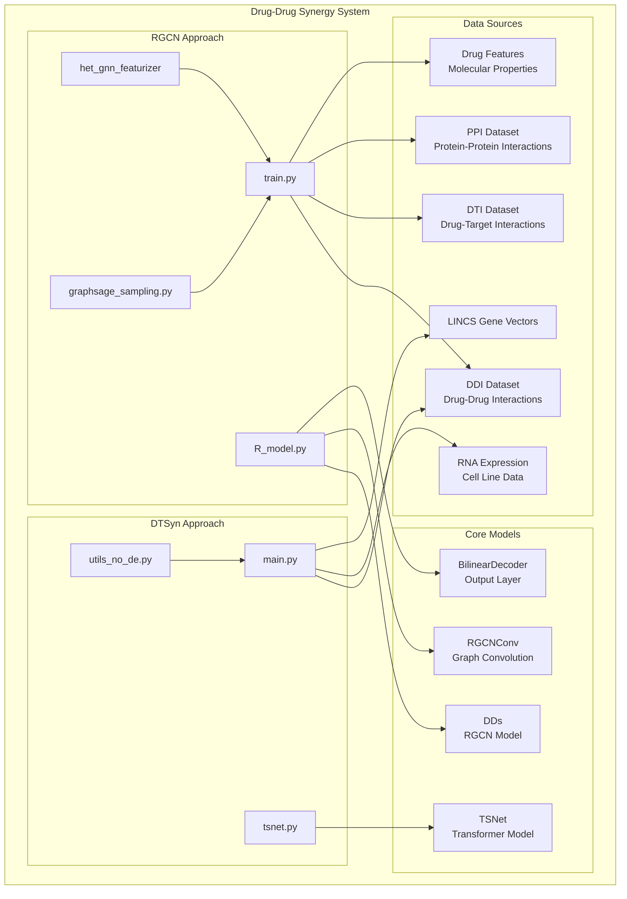
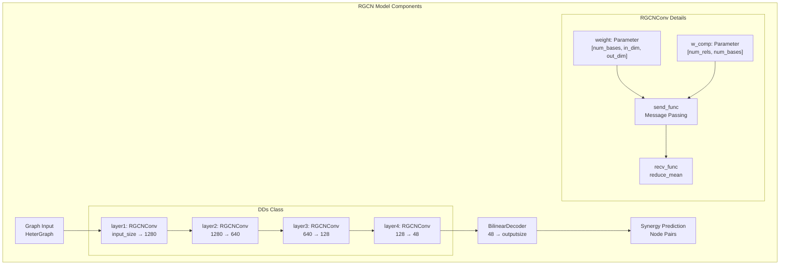
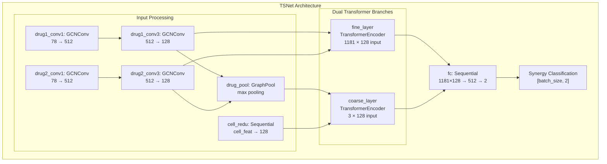
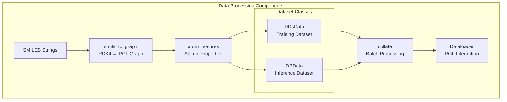

# Drug-Drug Synergy

> **Relevant source files**
> * [apps/drug_drug_synergy/DTSyn/README.md](https://github.com/PaddlePaddle/PaddleHelix/blob/7fdd7a18/apps/drug_drug_synergy/DTSyn/README.md?plain=1)
> * [apps/drug_drug_synergy/DTSyn/README_cn.md](https://github.com/PaddlePaddle/PaddleHelix/blob/7fdd7a18/apps/drug_drug_synergy/DTSyn/README_cn.md?plain=1)
> * [apps/drug_drug_synergy/DTSyn/__init__.py](https://github.com/PaddlePaddle/PaddleHelix/blob/7fdd7a18/apps/drug_drug_synergy/DTSyn/__init__.py)
> * [apps/drug_drug_synergy/DTSyn/main.py](https://github.com/PaddlePaddle/PaddleHelix/blob/7fdd7a18/apps/drug_drug_synergy/DTSyn/main.py)
> * [apps/drug_drug_synergy/DTSyn/tsnet.py](https://github.com/PaddlePaddle/PaddleHelix/blob/7fdd7a18/apps/drug_drug_synergy/DTSyn/tsnet.py)
> * [apps/drug_drug_synergy/DTSyn/utils_no_de.py](https://github.com/PaddlePaddle/PaddleHelix/blob/7fdd7a18/apps/drug_drug_synergy/DTSyn/utils_no_de.py)
> * [apps/drug_drug_synergy/README.md](https://github.com/PaddlePaddle/PaddleHelix/blob/7fdd7a18/apps/drug_drug_synergy/README.md?plain=1)
> * [apps/drug_drug_synergy/README_cn.md](https://github.com/PaddlePaddle/PaddleHelix/blob/7fdd7a18/apps/drug_drug_synergy/README_cn.md?plain=1)
> * [apps/drug_drug_synergy/RGCN/README.md](https://github.com/PaddlePaddle/PaddleHelix/blob/7fdd7a18/apps/drug_drug_synergy/RGCN/README.md?plain=1)
> * [apps/drug_drug_synergy/RGCN/README_cn.md](https://github.com/PaddlePaddle/PaddleHelix/blob/7fdd7a18/apps/drug_drug_synergy/RGCN/README_cn.md?plain=1)
> * [apps/drug_drug_synergy/RGCN/R_model.py](https://github.com/PaddlePaddle/PaddleHelix/blob/7fdd7a18/apps/drug_drug_synergy/RGCN/R_model.py)
> * [apps/drug_drug_synergy/RGCN/graphsage_sampling.py](https://github.com/PaddlePaddle/PaddleHelix/blob/7fdd7a18/apps/drug_drug_synergy/RGCN/graphsage_sampling.py)
> * [apps/drug_drug_synergy/RGCN/train.py](https://github.com/PaddlePaddle/PaddleHelix/blob/7fdd7a18/apps/drug_drug_synergy/RGCN/train.py)

This document covers the drug-drug synergy prediction capabilities within PaddleHelix, which provide computational methods for identifying synergistic drug combinations. The system implements two distinct approaches: RGCN (Relational Graph Convolutional Network) and DTSyn (Dual-Transformer neural network) for predicting drug combination efficacy.

For drug-target interaction prediction, see [Drug-Target Interaction](/PaddlePaddle/PaddleHelix/3.2.2-drug-target-interaction). For compound representation learning, see [Compound Representation Learning](/PaddlePaddle/PaddleHelix/3.2.1-compound-representation-learning).

## System Architecture Overview

The drug-drug synergy prediction system consists of two independent yet complementary approaches, each with distinct model architectures and data processing pipelines.



**Sources:** [apps/drug_drug_synergy/README.md L1-L9](https://github.com/PaddlePaddle/PaddleHelix/blob/7fdd7a18/apps/drug_drug_synergy/README.md?plain=1#L1-L9)

 [apps/drug_drug_synergy/RGCN/train.py L1-L168](https://github.com/PaddlePaddle/PaddleHelix/blob/7fdd7a18/apps/drug_drug_synergy/RGCN/train.py#L1-L168)

 [apps/drug_drug_synergy/DTSyn/main.py L1-L206](https://github.com/PaddlePaddle/PaddleHelix/blob/7fdd7a18/apps/drug_drug_synergy/DTSyn/main.py#L1-L206)

## RGCN Approach

The RGCN approach integrates multiple biological networks using relational graph convolutional networks to predict drug-drug synergy. It constructs a heterogeneous graph incorporating drug-drug interactions, drug-target interactions, and protein-protein interactions.

### RGCN Model Architecture



The core model is implemented in the `DDs` class which stacks four `RGCNConv` layers with decreasing dimensions. Each `RGCNConv` layer performs relation-specific message passing using learnable weight matrices.

**Sources:** [apps/drug_drug_synergy/RGCN/R_model.py L174-L209](https://github.com/PaddlePaddle/PaddleHelix/blob/7fdd7a18/apps/drug_drug_synergy/RGCN/R_model.py#L174-L209)

 [apps/drug_drug_synergy/RGCN/R_model.py L73-L147](https://github.com/PaddlePaddle/PaddleHelix/blob/7fdd7a18/apps/drug_drug_synergy/RGCN/R_model.py#L73-L147)

### Training Process

The RGCN training process involves subgraph sampling and negative sampling to handle the large-scale heterogeneous graph:

| Component | Function | Description |
| --- | --- | --- |
| `subgraph_gen` | Graph Sampling | Samples subgraphs using GraphSAGE methodology |
| `negative_Sampling` | Data Balancing | Generates negative samples with 1:2 ratio |
| `train` | Model Training | Iterates over multiple subgraphs with cross-entropy loss |

The training script uses the `het_gnn_featurizer.DDiFeaturizer` to process multiple data sources into a unified heterogeneous graph representation.

**Sources:** [apps/drug_drug_synergy/RGCN/train.py L44-L92](https://github.com/PaddlePaddle/PaddleHelix/blob/7fdd7a18/apps/drug_drug_synergy/RGCN/train.py#L44-L92)

 [apps/drug_drug_synergy/RGCN/graphsage_sampling.py L57-L89](https://github.com/PaddlePaddle/PaddleHelix/blob/7fdd7a18/apps/drug_drug_synergy/RGCN/graphsage_sampling.py#L57-L89)

 [apps/drug_drug_synergy/RGCN/R_model.py L213-L225](https://github.com/PaddlePaddle/PaddleHelix/blob/7fdd7a18/apps/drug_drug_synergy/RGCN/R_model.py#L213-L225)

## DTSyn Approach

DTSyn employs a dual-transformer architecture to capture biological interactions at different granularity levels, combining coarse-grained and fine-grained attention mechanisms.

### DTSyn Model Architecture



The `TSNet` class implements this dual-branch architecture where the coarse branch processes aggregated drug and cell representations, while the fine branch incorporates detailed molecular and gene-level features.

**Sources:** [apps/drug_drug_synergy/DTSyn/tsnet.py L25-L118](https://github.com/PaddlePaddle/PaddleHelix/blob/7fdd7a18/apps/drug_drug_synergy/DTSyn/tsnet.py#L25-L118)

### Data Processing Pipeline

DTSyn uses specialized data processing components for molecular featurization and dataset management:



The molecular featurization process converts SMILES strings into graph representations with atomic features including element type, degree, hydrogen count, valence, and aromaticity.

**Sources:** [apps/drug_drug_synergy/DTSyn/utils_no_de.py L49-L77](https://github.com/PaddlePaddle/PaddleHelix/blob/7fdd7a18/apps/drug_drug_synergy/DTSyn/utils_no_de.py#L49-L77)

 [apps/drug_drug_synergy/DTSyn/utils_no_de.py L104-L139](https://github.com/PaddlePaddle/PaddleHelix/blob/7fdd7a18/apps/drug_drug_synergy/DTSyn/utils_no_de.py#L104-L139)

 [apps/drug_drug_synergy/DTSyn/utils_no_de.py L141-L179](https://github.com/PaddlePaddle/PaddleHelix/blob/7fdd7a18/apps/drug_drug_synergy/DTSyn/utils_no_de.py#L141-L179)

## Data Requirements and Formats

Both approaches require specific datasets with defined formats:

### RGCN Data Requirements

| Dataset | Description | Format | Usage |
| --- | --- | --- | --- |
| DDI | Drug-drug interactions | CSV with synergy scores | Target labels |
| DTI | Drug-target interactions | TSV with drug-protein links | Graph edges |
| PPI | Protein-protein interactions | TXT with protein links | Graph edges |
| Drug Features | Molecular descriptors | FET format, 2325 dimensions | Node features |

### DTSyn Data Requirements

| Dataset | Description | Format | Usage |
| --- | --- | --- | --- |
| DDI | Drug combinations | CSV with SMILES and labels | Input pairs |
| RNA | Cell line expression | CSV with gene expression | Cell context |
| LINCS | Gene embeddings | CSV with 978-dimensional vectors | Fine-grained features |

**Sources:** [apps/drug_drug_synergy/RGCN/README.md L20-L40](https://github.com/PaddlePaddle/PaddleHelix/blob/7fdd7a18/apps/drug_drug_synergy/RGCN/README.md?plain=1#L20-L40)

 [apps/drug_drug_synergy/DTSyn/README.md L18-L22](https://github.com/PaddlePaddle/PaddleHelix/blob/7fdd7a18/apps/drug_drug_synergy/DTSyn/README.md?plain=1#L18-L22)

## Training and Evaluation

### RGCN Training Command

```
CUDA_VISIBLE_DEVICES=0 python3 train.py \    --ddi ./data/DDI/DDs.csv \    --dti ./data/DTI/drug_protein_links.tsv \    --ppi ./data/PPI/protein_protein_links.txt \    --d_feat ./data/all_drugs_name.fet \    --epochs 10 \    --num_graph 10 \    --sub_neighbours 10 10 \    --cuda
```

### DTSyn Training Command

```
CUDA_VISIBLE_DEVICES=0 python3 main.py \    --ddi ./data/ddi.csv \    --lincs ./data/gene_vector.csv \    --rna ./data/rna.csv \    --epochs 150 \    --batch_size 32 \    --lr 5e-6 \    --dropout 0.6
```

Both models support comprehensive evaluation metrics including AUC, PRAUC, accuracy, balanced accuracy, precision, recall, and Cohen's kappa score for assessing synergy prediction performance.

**Sources:** [apps/drug_drug_synergy/RGCN/README.md L42-L56](https://github.com/PaddlePaddle/PaddleHelix/blob/7fdd7a18/apps/drug_drug_synergy/RGCN/README.md?plain=1#L42-L56)

 [apps/drug_drug_synergy/DTSyn/README.md L24-L33](https://github.com/PaddlePaddle/PaddleHelix/blob/7fdd7a18/apps/drug_drug_synergy/DTSyn/README.md?plain=1#L24-L33)

 [apps/drug_drug_synergy/DTSyn/main.py L81-L92](https://github.com/PaddlePaddle/PaddleHelix/blob/7fdd7a18/apps/drug_drug_synergy/DTSyn/main.py#L81-L92)