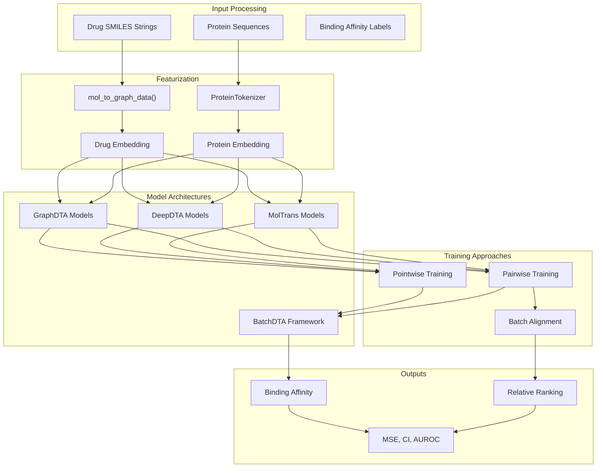
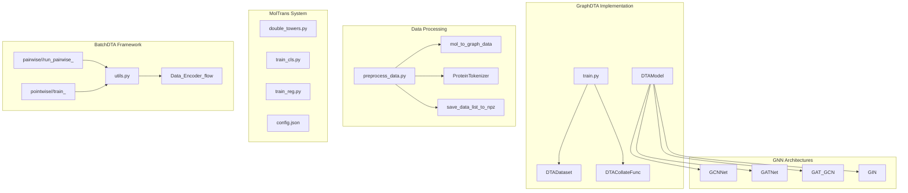
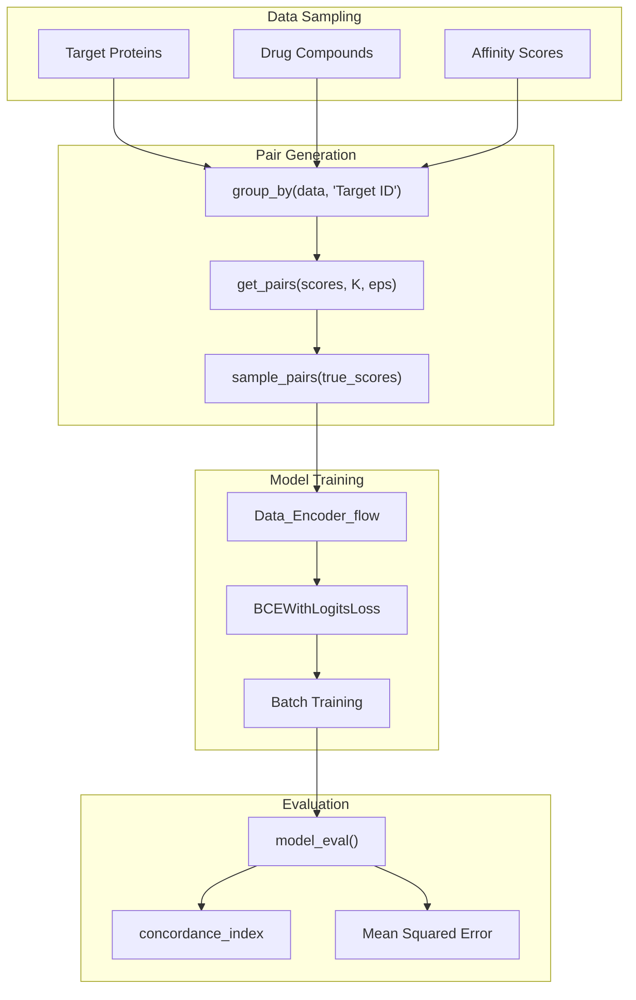

# Drug-Target Interaction

> **Relevant source files**
> * [apps/drug_target_interaction/README.md](https://github.com/PaddlePaddle/PaddleHelix/blob/7fdd7a18/apps/drug_target_interaction/README.md?plain=1)
> * [apps/drug_target_interaction/README_cn.md](https://github.com/PaddlePaddle/PaddleHelix/blob/7fdd7a18/apps/drug_target_interaction/README_cn.md?plain=1)
> * [apps/drug_target_interaction/batchdta/README.md](https://github.com/PaddlePaddle/PaddleHelix/blob/7fdd7a18/apps/drug_target_interaction/batchdta/README.md?plain=1)
> * [apps/drug_target_interaction/batchdta/pairwise/DeepDTA/model.py](https://github.com/PaddlePaddle/PaddleHelix/blob/7fdd7a18/apps/drug_target_interaction/batchdta/pairwise/DeepDTA/model.py)
> * [apps/drug_target_interaction/batchdta/pairwise/DeepDTA/run_pairwise_deepdta_CV.py](https://github.com/PaddlePaddle/PaddleHelix/blob/7fdd7a18/apps/drug_target_interaction/batchdta/pairwise/DeepDTA/run_pairwise_deepdta_CV.py)
> * [apps/drug_target_interaction/batchdta/pairwise/DeepDTA/run_pairwise_deepdta_bindingDB.py](https://github.com/PaddlePaddle/PaddleHelix/blob/7fdd7a18/apps/drug_target_interaction/batchdta/pairwise/DeepDTA/run_pairwise_deepdta_bindingDB.py)
> * [apps/drug_target_interaction/batchdta/pairwise/DeepDTA/utils.py](https://github.com/PaddlePaddle/PaddleHelix/blob/7fdd7a18/apps/drug_target_interaction/batchdta/pairwise/DeepDTA/utils.py)
> * [apps/drug_target_interaction/batchdta/pairwise/GraphDTA/models/gat.py](https://github.com/PaddlePaddle/PaddleHelix/blob/7fdd7a18/apps/drug_target_interaction/batchdta/pairwise/GraphDTA/models/gat.py)
> * [apps/drug_target_interaction/batchdta/pairwise/GraphDTA/models/gat_gcn.py](https://github.com/PaddlePaddle/PaddleHelix/blob/7fdd7a18/apps/drug_target_interaction/batchdta/pairwise/GraphDTA/models/gat_gcn.py)
> * [apps/drug_target_interaction/batchdta/pairwise/GraphDTA/models/gcn.py](https://github.com/PaddlePaddle/PaddleHelix/blob/7fdd7a18/apps/drug_target_interaction/batchdta/pairwise/GraphDTA/models/gcn.py)
> * [apps/drug_target_interaction/graph_dta/README.md](https://github.com/PaddlePaddle/PaddleHelix/blob/7fdd7a18/apps/drug_target_interaction/graph_dta/README.md?plain=1)
> * [apps/drug_target_interaction/graph_dta/README_cn.md](https://github.com/PaddlePaddle/PaddleHelix/blob/7fdd7a18/apps/drug_target_interaction/graph_dta/README_cn.md?plain=1)
> * [apps/drug_target_interaction/graph_dta/scripts/preprocess_data.py](https://github.com/PaddlePaddle/PaddleHelix/blob/7fdd7a18/apps/drug_target_interaction/graph_dta/scripts/preprocess_data.py)
> * [apps/drug_target_interaction/graph_dta/scripts/train.sh](https://github.com/PaddlePaddle/PaddleHelix/blob/7fdd7a18/apps/drug_target_interaction/graph_dta/scripts/train.sh)
> * [apps/drug_target_interaction/graph_dta/train.py](https://github.com/PaddlePaddle/PaddleHelix/blob/7fdd7a18/apps/drug_target_interaction/graph_dta/train.py)
> * [apps/drug_target_interaction/moltrans_dti/README.md](https://github.com/PaddlePaddle/PaddleHelix/blob/7fdd7a18/apps/drug_target_interaction/moltrans_dti/README.md?plain=1)
> * [apps/pretrained_compound/info_graph/README.md](https://github.com/PaddlePaddle/PaddleHelix/blob/7fdd7a18/apps/pretrained_compound/info_graph/README.md?plain=1)
> * [apps/pretrained_compound/info_graph/README_cn.md](https://github.com/PaddlePaddle/PaddleHelix/blob/7fdd7a18/apps/pretrained_compound/info_graph/README_cn.md?plain=1)
> * [apps/pretrained_compound/info_graph/classifier.py](https://github.com/PaddlePaddle/PaddleHelix/blob/7fdd7a18/apps/pretrained_compound/info_graph/classifier.py)
> * [apps/pretrained_compound/info_graph/scripts/preprocess_data.py](https://github.com/PaddlePaddle/PaddleHelix/blob/7fdd7a18/apps/pretrained_compound/info_graph/scripts/preprocess_data.py)
> * [apps/pretrained_compound/info_graph/scripts/unsupervised_pretrain.sh](https://github.com/PaddlePaddle/PaddleHelix/blob/7fdd7a18/apps/pretrained_compound/info_graph/scripts/unsupervised_pretrain.sh)
> * [apps/pretrained_compound/info_graph/src/model.py](https://github.com/PaddlePaddle/PaddleHelix/blob/7fdd7a18/apps/pretrained_compound/info_graph/src/model.py)
> * [apps/pretrained_compound/info_graph/unsupervised_pretrain.py](https://github.com/PaddlePaddle/PaddleHelix/blob/7fdd7a18/apps/pretrained_compound/info_graph/unsupervised_pretrain.py)

This document covers the drug-target interaction (DTI) prediction capabilities in PaddleHelix, including multiple neural network architectures, training frameworks, and evaluation approaches for predicting binding affinity between drug compounds and target proteins.

For compound representation learning without target interaction, see [Compound Representation Learning](/PaddlePaddle/PaddleHelix/3.2.1-compound-representation-learning). For drug synergy prediction involving multiple drugs, see [Drug-Drug Synergy](/PaddlePaddle/PaddleHelix/3.2.3-drug-drug-synergy).

## Overview

Drug-target interaction prediction is a fundamental task in computational drug discovery that estimates the binding affinity between small molecule compounds and target proteins. PaddleHelix provides several state-of-the-art approaches including graph neural networks, convolutional architectures, and transformer models, along with specialized training frameworks to handle real-world data challenges.

## System Architecture

### Model Architecture Overview



Sources: [apps/drug_target_interaction/README.md L1-L12](https://github.com/PaddlePaddle/PaddleHelix/blob/7fdd7a18/apps/drug_target_interaction/README.md?plain=1#L1-L12)

 [apps/drug_target_interaction/graph_dta/scripts/preprocess_data.py L32-L34](https://github.com/PaddlePaddle/PaddleHelix/blob/7fdd7a18/apps/drug_target_interaction/graph_dta/scripts/preprocess_data.py#L32-L34)

 [apps/drug_target_interaction/graph_dta/train.py L27-L29](https://github.com/PaddlePaddle/PaddleHelix/blob/7fdd7a18/apps/drug_target_interaction/graph_dta/train.py#L27-L29)

### Core Components and Code Mapping



Sources: [apps/drug_target_interaction/graph_dta/src/model.py](https://github.com/PaddlePaddle/PaddleHelix/blob/7fdd7a18/apps/drug_target_interaction/graph_dta/src/model.py)

 [apps/drug_target_interaction/graph_dta/src/data_gen.py](https://github.com/PaddlePaddle/PaddleHelix/blob/7fdd7a18/apps/drug_target_interaction/graph_dta/src/data_gen.py)

 [apps/drug_target_interaction/batchdta/pairwise/GraphDTA/models/gcn.py L8-L32](https://github.com/PaddlePaddle/PaddleHelix/blob/7fdd7a18/apps/drug_target_interaction/batchdta/pairwise/GraphDTA/models/gcn.py#L8-L32)

 [apps/drug_target_interaction/moltrans_dti/README.md L134-L149](https://github.com/PaddlePaddle/PaddleHelix/blob/7fdd7a18/apps/drug_target_interaction/moltrans_dti/README.md?plain=1#L134-L149)

## Model Architectures

### GraphDTA Models

GraphDTA represents drugs as molecular graphs and uses graph neural networks for feature extraction. The system supports multiple GNN architectures:

| Architecture | Configuration File | Description |
| --- | --- | --- |
| GCN | `fix_prot_len_gcn_config.json` | Graph Convolutional Network |
| GAT | `fix_prot_len_gat_config.json` | Graph Attention Network |
| GAT-GCN | `fix_prot_len_gat_gcn_config.json` | Hybrid attention + convolution |
| GIN | `fix_prot_len_gin_config.json` | Graph Isomorphism Network |

The `DTAModel` class in [apps/drug_target_interaction/graph_dta/src/model.py](https://github.com/PaddlePaddle/PaddleHelix/blob/7fdd7a18/apps/drug_target_interaction/graph_dta/src/model.py)

 implements the core architecture, taking molecular graphs and protein sequences as input through the `DTACollateFunc` collation function.

**Key Classes:**

* `DTADataset`: Handles data loading and preprocessing
* `DTACollateFunc`: Collates molecular graphs and protein sequences
* `DTAModelCriterion`: Loss function for training

Sources: [apps/drug_target_interaction/graph_dta/README.md L81-L86](https://github.com/PaddlePaddle/PaddleHelix/blob/7fdd7a18/apps/drug_target_interaction/graph_dta/README.md?plain=1#L81-L86)

 [apps/drug_target_interaction/graph_dta/train.py L27-L29](https://github.com/PaddlePaddle/PaddleHelix/blob/7fdd7a18/apps/drug_target_interaction/graph_dta/train.py#L27-L29)

### DeepDTA Models

DeepDTA uses 1D convolutional neural networks for both drug and protein sequence processing. The architecture consists of:

1. **Drug Branch**: CNN over SMILES character sequences
2. **Protein Branch**: CNN over protein amino acid sequences
3. **Fusion Layer**: Concatenated features fed through dense layers

The implementation supports both pointwise training (individual affinity prediction) and pairwise training (relative ranking) through the BatchDTA framework.

Sources: [apps/drug_target_interaction/batchdta/pairwise/DeepDTA/model.py L20-L110](https://github.com/PaddlePaddle/PaddleHelix/blob/7fdd7a18/apps/drug_target_interaction/batchdta/pairwise/DeepDTA/model.py#L20-L110)

### MolTrans Models

MolTrans leverages transformer architecture for drug-target interaction prediction with dual-tower design:

```css
# Key configuration parameters{    "drug_max_seq": 50,    "target_max_seq": 545,     "emb_size": 384,    "num_attention_heads": 12,    "layer_size": 2,    "dropout_ratio": 0.1}
```

The system supports both classification and regression tasks through separate training scripts (`train_cls.py` and `train_reg.py`).

Sources: [apps/drug_target_interaction/moltrans_dti/README.md L136-L149](https://github.com/PaddlePaddle/PaddleHelix/blob/7fdd7a18/apps/drug_target_interaction/moltrans_dti/README.md?plain=1#L136-L149)

## BatchDTA Training Framework

BatchDTA addresses batch effects in drug-target affinity datasets by using implicit batch alignment during training. The framework supports multiple backbone models and training strategies:

### Pairwise Training Approach



The pairwise approach trains models to predict relative rankings between drug-target pairs sharing the same target protein, helping to mitigate batch effects across different assay conditions.

**Key Functions:**

* `group_by()`: Groups data by target protein ID
* `get_pairs()`: Generates ordered pairs with score differences > threshold
* `sample_pairs()`: Samples training pairs with filtering
* `Data_Encoder_flow`: DataLoader for pairwise training data

Sources: [apps/drug_target_interaction/batchdta/README.md L5-L9](https://github.com/PaddlePaddle/PaddleHelix/blob/7fdd7a18/apps/drug_target_interaction/batchdta/README.md?plain=1#L5-L9)

 [apps/drug_target_interaction/batchdta/pairwise/DeepDTA/utils.py L30-L99](https://github.com/PaddlePaddle/PaddleHelix/blob/7fdd7a18/apps/drug_target_interaction/batchdta/pairwise/DeepDTA/utils.py#L30-L99)

## Datasets and Data Processing

### Supported Datasets

| Dataset | Drugs | Targets | Metric | Description |
| --- | --- | --- | --- | --- |
| **Davis** | 72 | 442 | Kd (nM) | Kinase inhibitor selectivity |
| **KIBA** | 2,116 | 229 | KIBA score | Integrated Ki, Kd, IC50 |
| **BindingDB** | ~11,000 | 110 | Multiple | Protein-ligand binding |
| **ChEMBL** | >1.6M | ~11,000 | Various | Bioactivity database |
| **BioSNAP** | Variable | Variable | Binary | Biomedical networks |

### Data Preprocessing Pipeline

The preprocessing pipeline converts raw datasets into training-ready format:

1. **Molecular Processing**: SMILES → RDKit Mol → Graph features via `mol_to_graph_data()`
2. **Protein Processing**: Amino acid sequences → Token IDs via `ProteinTokenizer`
3. **Data Splitting**: Train/validation/test splits with protein-based or random partitioning
4. **Format Conversion**: Save processed data as NPZ files via `save_data_list_to_npz()`

**Key Processing Functions:**

* [apps/drug_target_interaction/graph_dta/scripts/preprocess_data.py L92-L94](https://github.com/PaddlePaddle/PaddleHelix/blob/7fdd7a18/apps/drug_target_interaction/graph_dta/scripts/preprocess_data.py#L92-L94) : Molecular graph conversion
* [apps/drug_target_interaction/graph_dta/scripts/preprocess_data.py L97-L99](https://github.com/PaddlePaddle/PaddleHelix/blob/7fdd7a18/apps/drug_target_interaction/graph_dta/scripts/preprocess_data.py#L97-L99) : Protein tokenization
* [apps/drug_target_interaction/graph_dta/scripts/preprocess_data.py L110-L111](https://github.com/PaddlePaddle/PaddleHelix/blob/7fdd7a18/apps/drug_target_interaction/graph_dta/scripts/preprocess_data.py#L110-L111) : Data serialization

Sources: [apps/drug_target_interaction/graph_dta/README.md L26-L36](https://github.com/PaddlePaddle/PaddleHelix/blob/7fdd7a18/apps/drug_target_interaction/graph_dta/README.md?plain=1#L26-L36)

 [apps/drug_target_interaction/moltrans_dti/README.md L94-L111](https://github.com/PaddlePaddle/PaddleHelix/blob/7fdd7a18/apps/drug_target_interaction/moltrans_dti/README.md?plain=1#L94-L111)

## Training and Evaluation

### Training Scripts and Usage

Each model provides specific training scripts with standardized interfaces:

**GraphDTA Training:**

```
./scripts/train.sh davis model_configs/fix_prot_len_gin_config.json --use_kiba_label
```

**MolTrans Training:**

```markdown
# Classification taskpython train_cls.py --batchsize 64 --epochs 200 --lr 5e-4 --dataset cls_davis # Regression task  python train_reg.py --batchsize 64 --epochs 200 --lr 5e-4 --dataset benchmark_davis
```

**BatchDTA Training:**

```markdown
# Pairwise training with multiple GPUspython -m torch.distributed.launch run_pairwise_GraphDTA_CV.py --data_path '../../Data/' --dataset 'DAVIS' --is_mixed False
```

Sources: [apps/drug_target_interaction/graph_dta/README.md L100-L106](https://github.com/PaddlePaddle/PaddleHelix/blob/7fdd7a18/apps/drug_target_interaction/graph_dta/README.md?plain=1#L100-L106)

 [apps/drug_target_interaction/moltrans_dti/README.md L155-L175](https://github.com/PaddlePaddle/PaddleHelix/blob/7fdd7a18/apps/drug_target_interaction/moltrans_dti/README.md?plain=1#L155-L175)

 [apps/drug_target_interaction/batchdta/README.md L49-L55](https://github.com/PaddlePaddle/PaddleHelix/blob/7fdd7a18/apps/drug_target_interaction/batchdta/README.md?plain=1#L49-L55)

### Evaluation Metrics

The system uses multiple evaluation metrics appropriate for different task types:

**Regression Tasks:**

* **MSE (Mean Squared Error)**: Lower is better
* **CI (Concordance Index)**: Higher is better, measures ranking quality

**Classification Tasks:**

* **AUROC (Area Under ROC Curve)**: Higher is better

**Implementation:**

* CI calculation: `concordance_index()` from lifelines package
* MSE calculation: Standard numpy operations
* Evaluation function: `model_eval()` in [apps/drug_target_interaction/batchdta/pairwise/DeepDTA/utils.py L300-L351](https://github.com/PaddlePaddle/PaddleHelix/blob/7fdd7a18/apps/drug_target_interaction/batchdta/pairwise/DeepDTA/utils.py#L300-L351)

### Performance Results

**Davis Dataset Performance:**

| Method | MSE | CI | AUROC |
| --- | --- | --- | --- |
| GraphDTA (GIN) | 0.242 | 0.889 | - |
| MolTrans | 0.199 | 0.901 | 0.912 |
| BatchDTA (avg improvement) | - | +4.0% | - |

**KIBA Dataset Performance:**

| Method | MSE | CI |
| --- | --- | --- |
| GraphDTA (GAT-GCN) | 0.142 | 0.895 |
| MolTrans | 0.132 | 0.898 |

Sources: [apps/drug_target_interaction/graph_dta/README.md L111-L128](https://github.com/PaddlePaddle/PaddleHelix/blob/7fdd7a18/apps/drug_target_interaction/graph_dta/README.md?plain=1#L111-L128)

 [apps/drug_target_interaction/moltrans_dti/README.md L180-L198](https://github.com/PaddlePaddle/PaddleHelix/blob/7fdd7a18/apps/drug_target_interaction/moltrans_dti/README.md?plain=1#L180-L198)

 [apps/drug_target_interaction/batchdta/README.md L9](https://github.com/PaddlePaddle/PaddleHelix/blob/7fdd7a18/apps/drug_target_interaction/batchdta/README.md?plain=1#L9-L9)

## Integration with PaddleHelix

The DTI system integrates with the broader PaddleHelix ecosystem through:

1. **Compound Featurization**: Uses `pahelix.utils.compound_tools.mol_to_graph_data` for molecular graph conversion
2. **Protein Processing**: Leverages `pahelix.utils.protein_tools.ProteinTokenizer` for sequence encoding
3. **Data Management**: Built on `pahelix.datasets.inmemory_dataset.InMemoryDataset` infrastructure
4. **Graph Learning**: Utilizes PGL (PaddlePaddle Graph Learning) for GNN implementations

The modular design allows easy extension and integration with other PaddleHelix components for end-to-end drug discovery pipelines.

Sources: [apps/drug_target_interaction/graph_dta/scripts/preprocess_data.py L32-L34](https://github.com/PaddlePaddle/PaddleHelix/blob/7fdd7a18/apps/drug_target_interaction/graph_dta/scripts/preprocess_data.py#L32-L34)

 [apps/pretrained_compound/info_graph/unsupervised_pretrain.py L39](https://github.com/PaddlePaddle/PaddleHelix/blob/7fdd7a18/apps/pretrained_compound/info_graph/unsupervised_pretrain.py#L39-L39)