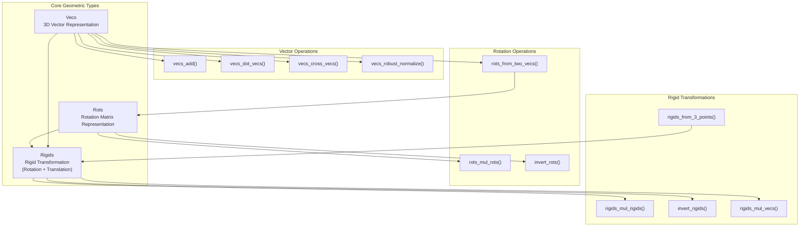
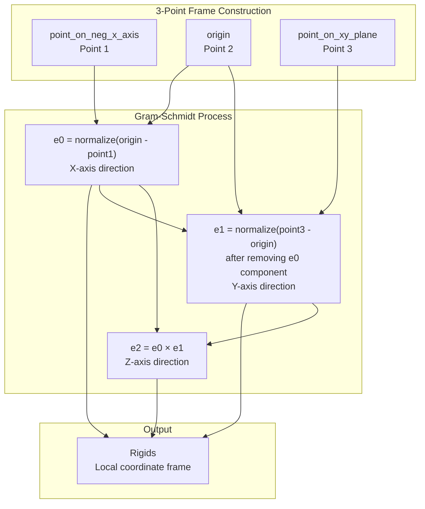
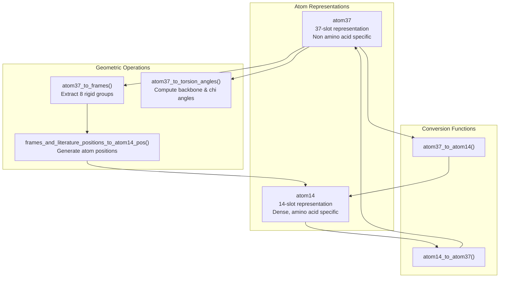
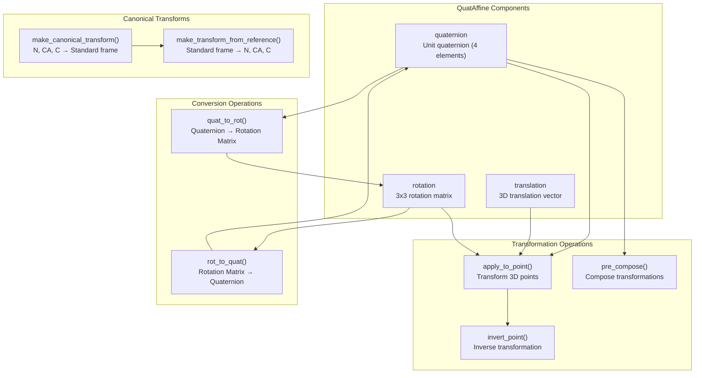
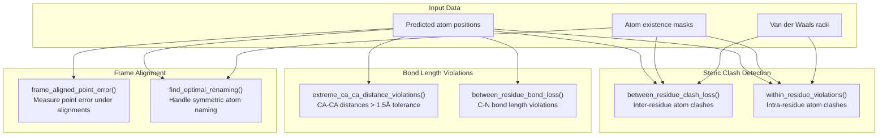

# Geometric Algorithms

> **Relevant source files**
> * [apps/protein_folding/helixfold/alphafold_paddle/model/all_atom.py](https://github.com/PaddlePaddle/PaddleHelix/blob/7fdd7a18/apps/protein_folding/helixfold/alphafold_paddle/model/all_atom.py)
> * [apps/protein_folding/helixfold/alphafold_paddle/model/quat_affine.py](https://github.com/PaddlePaddle/PaddleHelix/blob/7fdd7a18/apps/protein_folding/helixfold/alphafold_paddle/model/quat_affine.py)
> * [apps/protein_folding/helixfold/alphafold_paddle/model/r3.py](https://github.com/PaddlePaddle/PaddleHelix/blob/7fdd7a18/apps/protein_folding/helixfold/alphafold_paddle/model/r3.py)

This document covers the core geometric transformation algorithms and data structures used in protein structure prediction within PaddleHelix. These algorithms handle 3D coordinate transformations, rigid body movements, and protein-specific geometric operations that are fundamental to models like HelixFold and HelixFold3.

For protein structure prediction applications using these algorithms, see [HelixFold](/PaddlePaddle/PaddleHelix/3.1.1-helixfold) and [HelixFold3](/PaddlePaddle/PaddleHelix/3.1.2-helixfold3). For broader protein folding concepts, see [Protein Structure Prediction](/PaddlePaddle/PaddleHelix/3.1-protein-structure-prediction).

## Core Geometric Data Structures

The geometric algorithms are built around three fundamental data structures that represent different aspects of 3D transformations:

Sources: [apps/protein_folding/helixfold/alphafold_paddle/model/r3.py L41-L518](https://github.com/PaddlePaddle/PaddleHelix/blob/7fdd7a18/apps/protein_folding/helixfold/alphafold_paddle/model/r3.py#L41-L518)

### Vector Representation (Vecs)

The `Vecs` class encapsulates 3D vectors and provides coordinate access through properties:

| Property | Description | Code Reference |
| --- | --- | --- |
| `x` | X-coordinate component | [r3.py L76-L77](https://github.com/PaddlePaddle/PaddleHelix/blob/7fdd7a18/r3.py#L76-L77) |
| `y` | Y-coordinate component | [r3.py L79-L81](https://github.com/PaddlePaddle/PaddleHelix/blob/7fdd7a18/r3.py#L79-L81) |
| `z` | Z-coordinate component | [r3.py L83-L85](https://github.com/PaddlePaddle/PaddleHelix/blob/7fdd7a18/r3.py#L83-L85) |
| `translation` | Internal tensor storage | [r3.py L48-L58](https://github.com/PaddlePaddle/PaddleHelix/blob/7fdd7a18/r3.py#L48-L58) |

Sources: [apps/protein_folding/helixfold/alphafold_paddle/model/r3.py L43-L98](https://github.com/PaddlePaddle/PaddleHelix/blob/7fdd7a18/apps/protein_folding/helixfold/alphafold_paddle/model/r3.py#L43-L98)

### Rotation Representation (Rots)

The `Rots` class represents 3×3 rotation matrices with element-wise access:

| Property | Description | Matrix Element |
| --- | --- | --- |
| `xx`, `xy`, `xz` | First row elements | [0,0], [0,1], [0,2] |
| `yx`, `yy`, `yz` | Second row elements | [1,0], [1,1], [1,2] |
| `zx`, `zy`, `zz` | Third row elements | [2,0], [2,1], [2,2] |

Sources: [apps/protein_folding/helixfold/alphafold_paddle/model/r3.py L100-L186](https://github.com/PaddlePaddle/PaddleHelix/blob/7fdd7a18/apps/protein_folding/helixfold/alphafold_paddle/model/r3.py#L100-L186)

## Coordinate System Construction

Protein structures require establishing local coordinate systems from atomic positions. The system constructs rigid transformations from three reference points using Gram-Schmidt orthogonalization:

Sources: [apps/protein_folding/helixfold/alphafold_paddle/model/r3.py L207-L278](https://github.com/PaddlePaddle/PaddleHelix/blob/7fdd7a18/apps/protein_folding/helixfold/alphafold_paddle/model/r3.py#L207-L278)

## Protein-Specific Geometric Operations

The system handles protein-specific coordinate representations and transformations:

### Atom Representation Conversion

Proteins use two primary atomic representations that require geometric transformations:

Sources: [apps/protein_folding/helixfold/alphafold_paddle/model/all_atom.py L76-L653](https://github.com/PaddlePaddle/PaddleHelix/blob/7fdd7a18/apps/protein_folding/helixfold/alphafold_paddle/model/all_atom.py#L76-L653)

### Rigid Group Frame Computation

Each amino acid is decomposed into up to 8 rigid groups based on torsional flexibility:

| Group Index | Description | Atoms |
| --- | --- | --- |
| 0 | Backbone group | N, CA, C |
| 1 | Pre-omega group | (empty) |
| 2 | Phi group | (hydrogens only) |
| 3 | Psi group | CA, C, O |
| 4-7 | Chi1-4 groups | Side chain atoms |

Sources: [apps/protein_folding/helixfold/alphafold_paddle/model/all_atom.py L114-L271](https://github.com/PaddlePaddle/PaddleHelix/blob/7fdd7a18/apps/protein_folding/helixfold/alphafold_paddle/model/all_atom.py#L114-L271)

## Quaternion-Based Transformations

The `QuatAffine` class provides an alternative geometric representation using quaternions for numerical stability:

Sources: [apps/protein_folding/helixfold/alphafold_paddle/model/quat_affine.py L178-L582](https://github.com/PaddlePaddle/PaddleHelix/blob/7fdd7a18/apps/protein_folding/helixfold/alphafold_paddle/model/quat_affine.py#L178-L582)

### Canonical Frame Construction

The canonical transformation places the backbone in a standard orientation:

1. **CA at origin**: Translation = -CA_position
2. **C on x-axis**: Rotation around z-axis, then y-axis
3. **N in xy-plane**: Rotation around x-axis

Sources: [apps/protein_folding/helixfold/alphafold_paddle/model/quat_affine.py L362-L436](https://github.com/PaddlePaddle/PaddleHelix/blob/7fdd7a18/apps/protein_folding/helixfold/alphafold_paddle/model/quat_affine.py#L362-L436)

## Geometric Constraint Validation

The system includes extensive validation for protein geometric constraints:

Sources: [apps/protein_folding/helixfold/alphafold_paddle/model/all_atom.py L656-L1178](https://github.com/PaddlePaddle/PaddleHelix/blob/7fdd7a18/apps/protein_folding/helixfold/alphafold_paddle/model/all_atom.py#L656-L1178)

## Key Design Principles

### Numerical Stability

* Avoids matrix multiplication primitives that might use tensor cores with reduced precision
* Uses robust normalization with epsilon regularization: [r3.py L475-L499](https://github.com/PaddlePaddle/PaddleHelix/blob/7fdd7a18/r3.py#L475-L499)
* Handles edge cases in rotation matrix construction: [r3.py L395-L406](https://github.com/PaddlePaddle/PaddleHelix/blob/7fdd7a18/r3.py#L395-L406)

### Memory Efficiency

* Named tuple `Rigids` avoids object overhead: [r3.py L41](https://github.com/PaddlePaddle/PaddleHelix/blob/7fdd7a18/r3.py#L41-L41)
* Batch operations for vectorized computations
* In-place operations where possible

### Geometric Accuracy

* Gram-Schmidt orthogonalization for stable frame construction
* Quaternion normalization for valid rotations: [quat_affine.py L200-L202](https://github.com/PaddlePaddle/PaddleHelix/blob/7fdd7a18/quat_affine.py#L200-L202)
* Epsilon regularization in distance calculations: [all_atom.py L683](https://github.com/PaddlePaddle/PaddleHelix/blob/7fdd7a18/all_atom.py#L683-L683)

Sources: [apps/protein_folding/helixfold/alphafold_paddle/model/r3.py L15-L32](https://github.com/PaddlePaddle/PaddleHelix/blob/7fdd7a18/apps/protein_folding/helixfold/alphafold_paddle/model/r3.py#L15-L32)

 [apps/protein_folding/helixfold/alphafold_paddle/model/quat_affine.py L15-L32](https://github.com/PaddlePaddle/PaddleHelix/blob/7fdd7a18/apps/protein_folding/helixfold/alphafold_paddle/model/quat_affine.py#L15-L32)