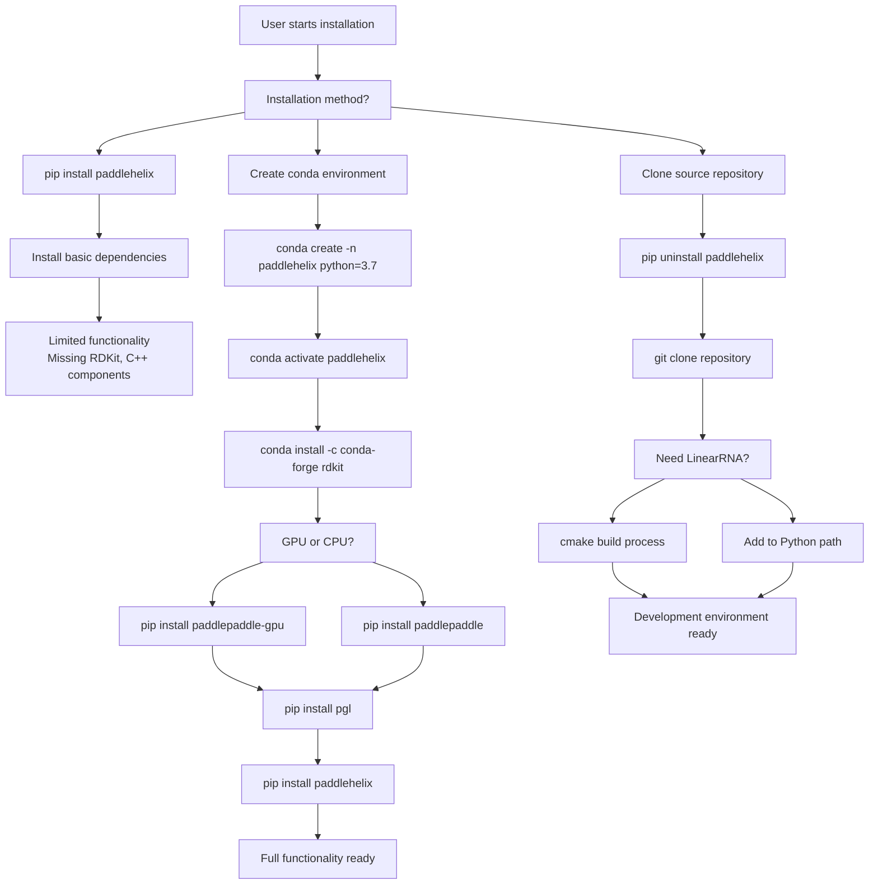
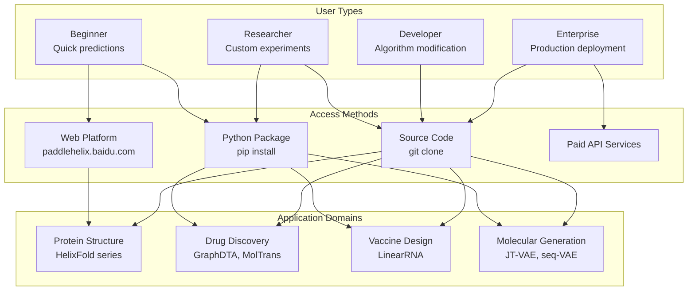
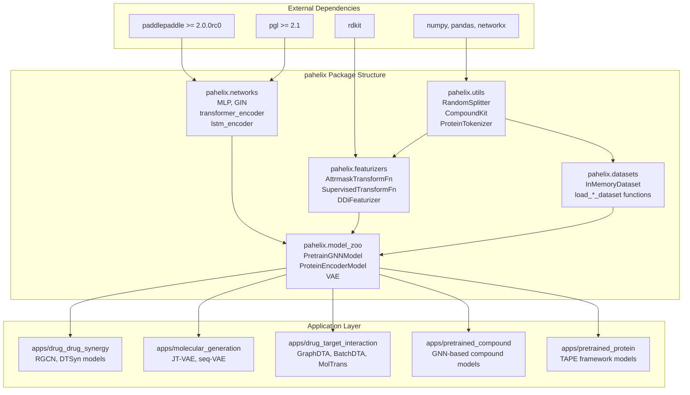

# Getting Started

> **Relevant source files**
> * [developer_guide.md](https://github.com/PaddlePaddle/PaddleHelix/blob/7fdd7a18/developer_guide.md?plain=1)
> * [developer_guide_cn.md](https://github.com/PaddlePaddle/PaddleHelix/blob/7fdd7a18/developer_guide_cn.md?plain=1)
> * [docs/api_doc/datasets.rst](https://github.com/PaddlePaddle/PaddleHelix/blob/7fdd7a18/docs/api_doc/datasets.rst)
> * [docs/api_doc/featurizers.rst](https://github.com/PaddlePaddle/PaddleHelix/blob/7fdd7a18/docs/api_doc/featurizers.rst)
> * [docs/api_doc/model_zoo.rst](https://github.com/PaddlePaddle/PaddleHelix/blob/7fdd7a18/docs/api_doc/model_zoo.rst)
> * [docs/api_doc/networks.rst](https://github.com/PaddlePaddle/PaddleHelix/blob/7fdd7a18/docs/api_doc/networks.rst)
> * [docs/api_doc/utils.rst](https://github.com/PaddlePaddle/PaddleHelix/blob/7fdd7a18/docs/api_doc/utils.rst)
> * [docs/conf.py](https://github.com/PaddlePaddle/PaddleHelix/blob/7fdd7a18/docs/conf.py)
> * [docs/contactus.rst](https://github.com/PaddlePaddle/PaddleHelix/blob/7fdd7a18/docs/contactus.rst)
> * [docs/developer.rst](https://github.com/PaddlePaddle/PaddleHelix/blob/7fdd7a18/docs/developer.rst)
> * [docs/index.rst](https://github.com/PaddlePaddle/PaddleHelix/blob/7fdd7a18/docs/index.rst)
> * [docs/installation.rst](https://github.com/PaddlePaddle/PaddleHelix/blob/7fdd7a18/docs/installation.rst)
> * [docs/readme.rst](https://github.com/PaddlePaddle/PaddleHelix/blob/7fdd7a18/docs/readme.rst)
> * [docs/requirements.txt](https://github.com/PaddlePaddle/PaddleHelix/blob/7fdd7a18/docs/requirements.txt)
> * [docs/tutorials.rst](https://github.com/PaddlePaddle/PaddleHelix/blob/7fdd7a18/docs/tutorials.rst)

This document guides you through installing PaddleHelix, setting up your environment, and beginning to use the bio-computing platform. It covers the essential steps to start working with protein structure prediction, drug discovery, vaccine design, and molecular generation capabilities.

For advanced development and source code modification, see [Developer Guide](/PaddlePaddle/PaddleHelix/7-developer-guide). For detailed API documentation, see [API Reference](/PaddlePaddle/PaddleHelix/7.1-api-reference).

## Installation Methods

PaddleHelix provides multiple installation approaches depending on your use case and technical requirements.

### Quick Installation via pip

The simplest way to get started is through pip installation:

```
pip install paddlehelix
```

This method provides access to all Python-based algorithms and pretrained models but requires additional setup for dependencies like RDKit.

**Installation Flow Diagram**



Sources: [docs/readme.rst L42-L52](https://github.com/PaddlePaddle/PaddleHelix/blob/7fdd7a18/docs/readme.rst#L42-L52)

 [docs/installation.rst L40-L92](https://github.com/PaddlePaddle/PaddleHelix/blob/7fdd7a18/docs/installation.rst#L40-L92)

### Recommended Full Installation

For complete functionality including RDKit chemical informatics support:

```sql
# Create isolated environmentconda create -n paddlehelix python=3.7conda activate paddlehelix # Install RDKit (cannot be installed via pip)conda install -c conda-forge rdkit # Install PaddlePaddle (choose GPU or CPU version)python -m pip install paddlepaddle-gpu -f https://paddlepaddle.org.cn/whl/stable.html# OR for CPU: python -m pip install paddlepaddle # Install PGL graph learning librarypip install pgl # Install PaddleHelixpip install paddlehelix
```

Sources: [docs/installation.rst L46-L91](https://github.com/PaddlePaddle/PaddleHelix/blob/7fdd7a18/docs/installation.rst#L46-L91)

## System Requirements

| Requirement | Specification |
| --- | --- |
| Operating Systems | Windows, Linux, macOS |
| Python Version | 3.6, 3.7 |
| PaddlePaddle | >= 2.0.0rc0 |
| PGL | >= 2.1 |
| Additional Dependencies | numpy, pandas, networkx, rdkit, sklearn |

Sources: [docs/installation.rst L10-L35](https://github.com/PaddlePaddle/PaddleHelix/blob/7fdd7a18/docs/installation.rst#L10-L35)

 [docs/readme.rst L23-L37](https://github.com/PaddlePaddle/PaddleHelix/blob/7fdd7a18/docs/readme.rst#L23-L37)

## Usage Patterns

PaddleHelix supports different usage patterns depending on your needs and technical expertise.

**User Journey and Access Patterns**



Sources: [docs/readme.rst L68-L80](https://github.com/PaddlePaddle/PaddleHelix/blob/7fdd7a18/docs/readme.rst#L68-L80)

 [docs/tutorials.rst L24-L33](https://github.com/PaddlePaddle/PaddleHelix/blob/7fdd7a18/docs/tutorials.rst#L24-L33)

### Package-Based Usage

After installation, import and use PaddleHelix components:

```javascript
import pahelixfrom pahelix.datasets import load_bace_datasetfrom pahelix.featurizers.pretrain_gnn_featurizer import AttrmaskTransformFnfrom pahelix.model_zoo.pretrain_gnns_model import PretrainGNNModel
```

Key modules include:

* `pahelix.datasets` - Built-in biological datasets like BACE, BBBP, Tox21
* `pahelix.featurizers` - Data preprocessing for molecules and proteins
* `pahelix.model_zoo` - Pretrained models and architectures
* `pahelix.networks` - Neural network building blocks
* `pahelix.utils` - Utility functions for splitting, metrics, etc.

Sources: [docs/api_doc/datasets.rst L1-L145](https://github.com/PaddlePaddle/PaddleHelix/blob/7fdd7a18/docs/api_doc/datasets.rst#L1-L145)

 [docs/api_doc/featurizers.rst L1-L46](https://github.com/PaddlePaddle/PaddleHelix/blob/7fdd7a18/docs/api_doc/featurizers.rst#L1-L46)

 [docs/api_doc/model_zoo.rst L1-L60](https://github.com/PaddlePaddle/PaddleHelix/blob/7fdd7a18/docs/api_doc/model_zoo.rst#L1-L60)

### Development Setup

For modifying algorithms or contributing to PaddleHelix:

```markdown
# Remove existing installationpip uninstall paddlehelix # Clone repositorygit clone https://github.com/PaddlePaddle/PaddleHelix.git /path_to_your_repo/cd /path_to_your_repo/ # For LinearRNA C++ components (optional)sh scripts/prepare.shsh scripts/build.sh # For Python algorithms - add to path
```

```javascript
import syssys.path.append('/path_to_your_repo/')import pahelix
```

Sources: [docs/developer.rst L5-L55](https://github.com/PaddlePaddle/PaddleHelix/blob/7fdd7a18/docs/developer.rst#L5-L55)

 [developer_guide.md L3-L48](https://github.com/PaddlePaddle/PaddleHelix/blob/7fdd7a18/developer_guide.md?plain=1#L3-L48)

## Core Component Architecture

**PaddleHelix Module Organization**



Sources: [docs/api_doc/datasets.rst L77-L82](https://github.com/PaddlePaddle/PaddleHelix/blob/7fdd7a18/docs/api_doc/datasets.rst#L77-L82)

 [docs/api_doc/featurizers.rst L12-L39](https://github.com/PaddlePaddle/PaddleHelix/blob/7fdd7a18/docs/api_doc/featurizers.rst#L12-L39)

 [docs/api_doc/model_zoo.rst L7-L53](https://github.com/PaddlePaddle/PaddleHelix/blob/7fdd7a18/docs/api_doc/model_zoo.rst#L7-L53)

 [docs/api_doc/networks.rst L7-L68](https://github.com/PaddlePaddle/PaddleHelix/blob/7fdd7a18/docs/api_doc/networks.rst#L7-L68)

 [docs/api_doc/utils.rst L7-L70](https://github.com/PaddlePaddle/PaddleHelix/blob/7fdd7a18/docs/api_doc/utils.rst#L7-L70)

## Available Applications

PaddleHelix provides ready-to-use applications across multiple biological domains:

| Application Domain | Key Models | Location |
| --- | --- | --- |
| Compound Representation | `PretrainGNNModel`, `AttrmaskModel` | `apps/pretrained_compound` |
| Protein Analysis | `ProteinEncoderModel`, TAPE framework | `apps/pretrained_protein` |
| Drug-Target Interaction | `GraphDTA`, `BatchDTA`, `MolTrans` | `apps/drug_target_interaction` |
| Molecular Generation | `VAE`, JT-VAE, seq-VAE | `apps/molecular_generation` |
| Drug Synergy | RGCN, DTSyn | `apps/drug_drug_synergy` |
| RNA Structure | LinearFold, LinearPartition | `c/pahelix/toolkit/linear_rna` |

Sources: [docs/readme.rst L70-L80](https://github.com/PaddlePaddle/PaddleHelix/blob/7fdd7a18/docs/readme.rst#L70-L80)

 [docs/api_doc/model_zoo.rst L49-L53](https://github.com/PaddlePaddle/PaddleHelix/blob/7fdd7a18/docs/api_doc/model_zoo.rst#L49-L53)

## Getting Help and Next Steps

### Tutorials and Examples

Start with Jupyter notebook tutorials covering each application domain:

* Compound property prediction
* Protein representation learning
* Drug-target interaction prediction
* Molecular generation
* RNA secondary structure prediction

Access tutorials at the repository's `tutorials/` directory after installation.

Sources: [docs/tutorials.rst L24-L48](https://github.com/PaddlePaddle/PaddleHelix/blob/7fdd7a18/docs/tutorials.rst#L24-L48)

### Web Platform Access

For quick predictions without local installation, visit the web platform at paddlehelix.baidu.com which provides access to major models like HelixFold3 and HelixDock.

Sources: [docs/readme.rst L1-L5](https://github.com/PaddlePaddle/PaddleHelix/blob/7fdd7a18/docs/readme.rst#L1-L5)

### Further Documentation

* For specific application guidance: [Core Applications](/PaddlePaddle/PaddleHelix/3-core-applications)
* For pretrained model usage: [Pretrained Models](/PaddlePaddle/PaddleHelix/4-pretrained-models)
* For dataset handling: [Datasets and Utilities](/PaddlePaddle/PaddleHelix/5-datasets-and-utilities)
* For development and contribution: [Developer Guide](/PaddlePaddle/PaddleHelix/7-developer-guide)

Sources: [docs/index.rst L6-L34](https://github.com/PaddlePaddle/PaddleHelix/blob/7fdd7a18/docs/index.rst#L6-L34)