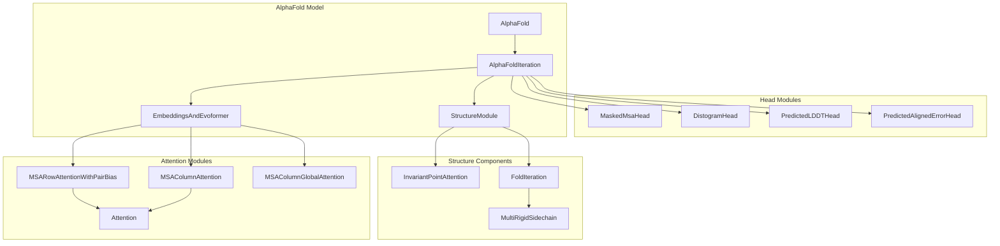
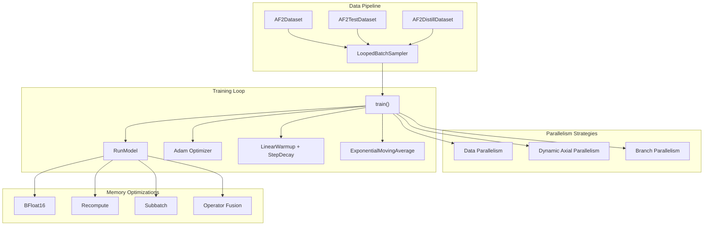
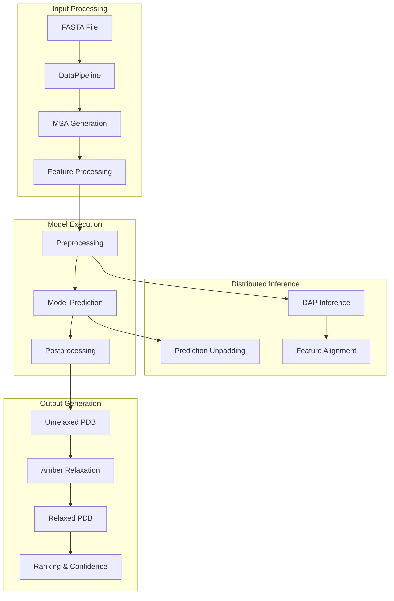
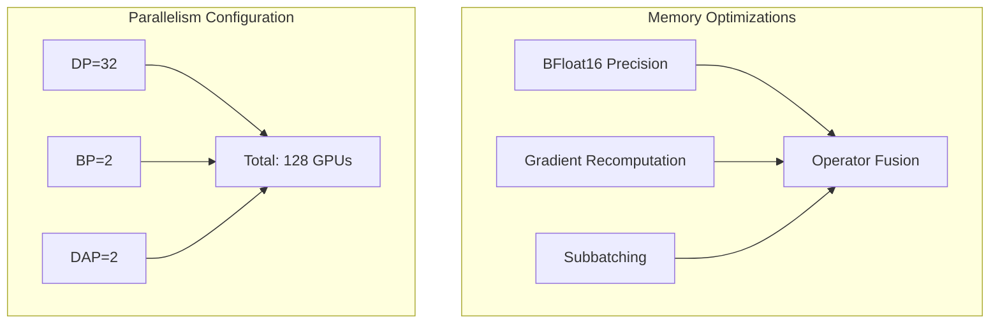

# HelixFold

> **Relevant source files**
> * [apps/protein_folding/helixfold-single/alphafold_paddle/model/folding.py](https://github.com/PaddlePaddle/PaddleHelix/blob/7fdd7a18/apps/protein_folding/helixfold-single/alphafold_paddle/model/folding.py)
> * [apps/protein_folding/helixfold/README.md](https://github.com/PaddlePaddle/PaddleHelix/blob/7fdd7a18/apps/protein_folding/helixfold/README.md?plain=1)
> * [apps/protein_folding/helixfold/README_inference.md](https://github.com/PaddlePaddle/PaddleHelix/blob/7fdd7a18/apps/protein_folding/helixfold/README_inference.md?plain=1)
> * [apps/protein_folding/helixfold/README_train.md](https://github.com/PaddlePaddle/PaddleHelix/blob/7fdd7a18/apps/protein_folding/helixfold/README_train.md?plain=1)
> * [apps/protein_folding/helixfold/alphafold_paddle/model/config.py](https://github.com/PaddlePaddle/PaddleHelix/blob/7fdd7a18/apps/protein_folding/helixfold/alphafold_paddle/model/config.py)
> * [apps/protein_folding/helixfold/alphafold_paddle/model/folding.py](https://github.com/PaddlePaddle/PaddleHelix/blob/7fdd7a18/apps/protein_folding/helixfold/alphafold_paddle/model/folding.py)
> * [apps/protein_folding/helixfold/alphafold_paddle/model/model.py](https://github.com/PaddlePaddle/PaddleHelix/blob/7fdd7a18/apps/protein_folding/helixfold/alphafold_paddle/model/model.py)
> * [apps/protein_folding/helixfold/alphafold_paddle/model/modules.py](https://github.com/PaddlePaddle/PaddleHelix/blob/7fdd7a18/apps/protein_folding/helixfold/alphafold_paddle/model/modules.py)
> * [apps/protein_folding/helixfold/gpu_infer.sh](https://github.com/PaddlePaddle/PaddleHelix/blob/7fdd7a18/apps/protein_folding/helixfold/gpu_infer.sh)
> * [apps/protein_folding/helixfold/gpu_infer_long.sh](https://github.com/PaddlePaddle/PaddleHelix/blob/7fdd7a18/apps/protein_folding/helixfold/gpu_infer_long.sh)
> * [apps/protein_folding/helixfold/gpu_train.sh](https://github.com/PaddlePaddle/PaddleHelix/blob/7fdd7a18/apps/protein_folding/helixfold/gpu_train.sh)
> * [apps/protein_folding/helixfold/requirements.txt](https://github.com/PaddlePaddle/PaddleHelix/blob/7fdd7a18/apps/protein_folding/helixfold/requirements.txt)
> * [apps/protein_folding/helixfold/run_helixfold.py](https://github.com/PaddlePaddle/PaddleHelix/blob/7fdd7a18/apps/protein_folding/helixfold/run_helixfold.py)
> * [apps/protein_folding/helixfold/setup_env](https://github.com/PaddlePaddle/PaddleHelix/blob/7fdd7a18/apps/protein_folding/helixfold/setup_env)
> * [apps/protein_folding/helixfold/train.py](https://github.com/PaddlePaddle/PaddleHelix/blob/7fdd7a18/apps/protein_folding/helixfold/train.py)
> * [apps/protein_folding/helixfold/utils/exponential_moving_average.py](https://github.com/PaddlePaddle/PaddleHelix/blob/7fdd7a18/apps/protein_folding/helixfold/utils/exponential_moving_average.py)
> * [apps/protein_folding/helixfold/utils/utils.py](https://github.com/PaddlePaddle/PaddleHelix/blob/7fdd7a18/apps/protein_folding/helixfold/utils/utils.py)

HelixFold is an efficient and improved implementation of AlphaFold2 using PaddlePaddle that provides complete training and inference pipelines for protein structure prediction. This implementation achieves significant performance improvements through parallelism strategies, operator fusion, and memory optimizations while maintaining competitive accuracy with the original AlphaFold2.

For information about HelixFold3 biomolecular structure prediction, see [HelixFold3](/PaddlePaddle/PaddleHelix/3.1.2-helixfold3). For geometric transformation algorithms used in protein structure prediction, see [Geometric Algorithms](/PaddlePaddle/PaddleHelix/3.1.3-geometric-algorithms).

## Architecture Overview

HelixFold implements the complete AlphaFold2 architecture with several key optimizations for training and inference efficiency. The system consists of the main model components, training pipeline, and inference pipeline with distributed computing support.

### Core Model Architecture



Sources: [apps/protein_folding/helixfold/alphafold_paddle/model/modules.py L124-L300](https://github.com/PaddlePaddle/PaddleHelix/blob/7fdd7a18/apps/protein_folding/helixfold/alphafold_paddle/model/modules.py#L124-L300)

 [apps/protein_folding/helixfold/alphafold_paddle/model/folding.py L343-L480](https://github.com/PaddlePaddle/PaddleHelix/blob/7fdd7a18/apps/protein_folding/helixfold/alphafold_paddle/model/folding.py#L343-L480)

### Model Configuration System

HelixFold uses a hierarchical configuration system that supports multiple model variants corresponding to the original AlphaFold2 models:

| Model Name | MSA Clusters | Extra MSA | Templates | Notes |
| --- | --- | --- | --- | --- |
| `model_1` | 512 | 5120 | Yes | Full model with templates |
| `model_2` | 512 | 1024 | Yes | Reduced extra MSA with templates |
| `model_3` | 512 | 5120 | No | Full model without templates |
| `model_4` | 512 | 5120 | No | Full model without templates |
| `model_5` | 512 | 1024 | No | Optimized for long sequences |

Sources: [apps/protein_folding/helixfold/alphafold_paddle/model/config.py L36-L164](https://github.com/PaddlePaddle/PaddleHelix/blob/7fdd7a18/apps/protein_folding/helixfold/alphafold_paddle/model/config.py#L36-L164)

## Training Pipeline

### Training Architecture



Sources: [apps/protein_folding/helixfold/train.py L226-L307](https://github.com/PaddlePaddle/PaddleHelix/blob/7fdd7a18/apps/protein_folding/helixfold/train.py#L226-L307)

 [apps/protein_folding/helixfold/utils/dataset.py](https://github.com/PaddlePaddle/PaddleHelix/blob/7fdd7a18/apps/protein_folding/helixfold/utils/dataset.py)

### Key Training Components

The training system is implemented in the `train.py` script with several key components:

* **`RunModel`**: Wrapper class that manages the AlphaFold model and loss computation
* **`AF2Dataset`**: Dataset class for loading and processing protein training data
* **Dynamic Features**: Runtime addition of recycling iterations and FAPE clamping parameters
* **Evaluation System**: Comprehensive evaluation with TM-score and LDDT metrics

```javascript
# Key training function signature from train.pydef train(args, cur_step, model, train_data_gen, distill_data_gen,           train_config, model_config, lr_scheduler, optimizer,           res_collect, train_logger, ema)
```

Sources: [apps/protein_folding/helixfold/train.py L226-L307](https://github.com/PaddlePaddle/PaddleHelix/blob/7fdd7a18/apps/protein_folding/helixfold/train.py#L226-L307)

## Inference Pipeline

### Inference Architecture



Sources: [apps/protein_folding/helixfold/run_helixfold.py L52-L278](https://github.com/PaddlePaddle/PaddleHelix/blob/7fdd7a18/apps/protein_folding/helixfold/run_helixfold.py#L52-L278)

 [apps/protein_folding/helixfold/alphafold_paddle/model/model.py L87-L315](https://github.com/PaddlePaddle/PaddleHelix/blob/7fdd7a18/apps/protein_folding/helixfold/alphafold_paddle/model/model.py#L87-L315)

### Inference Components

The inference pipeline is orchestrated through the `predict_structure()` function in `run_helixfold.py`:

* **Data Pipeline**: MSA generation using jackhmmer, hhblits, and hhsearch
* **Feature Caching**: Automatic caching of processed features as `.pkl` files
* **Model Runners**: Dictionary of `RunModel` instances for different model variants
* **Amber Relaxation**: Optional energy minimization of predicted structures

## Performance Optimizations

### Parallelism Strategies

HelixFold implements three complementary parallelism approaches:

#### Branch Parallelism (BP)

Splits computation branches across multiple devices during initial training phases.

#### Dynamic Axial Parallelism (DAP)

Distributes sequence length dimension across devices for memory efficiency.

#### Hybrid Parallelism

Combines BP, DAP, and Data Parallelism (DP) for maximum efficiency.



Sources: [apps/protein_folding/helixfold/train.py L265-L271](https://github.com/PaddlePaddle/PaddleHelix/blob/7fdd7a18/apps/protein_folding/helixfold/train.py#L265-L271)

 [apps/protein_folding/helixfold/gpu_train.sh L243-L310](https://github.com/PaddlePaddle/PaddleHelix/blob/7fdd7a18/apps/protein_folding/helixfold/gpu_train.sh#L243-L310)

### Operator Optimizations

* **Fused Gate Attention**: Combines multiple attention operations into single kernels
* **Tensor Fusion**: Reduces scheduling overhead by fusing thousands of small tensors
* **Custom AMP Lists**: Optimized automatic mixed precision for BFloat16 training

Sources: [apps/protein_folding/helixfold/utils/utils.py L23-L122](https://github.com/PaddlePaddle/PaddleHelix/blob/7fdd7a18/apps/protein_folding/helixfold/utils/utils.py#L23-L122)

 [apps/protein_folding/helixfold/alphafold_paddle/model/modules.py L504-L547](https://github.com/PaddlePaddle/PaddleHelix/blob/7fdd7a18/apps/protein_folding/helixfold/alphafold_paddle/model/modules.py#L504-L547)

## Ultra-Long Sequence Support

HelixFold supports prediction of extremely long protein sequences (up to 6600+ amino acids) through:

* **Low Memory Mode**: Optimized memory usage for long sequences
* **Unified Memory**: CUDA managed memory for sequences exceeding GPU memory
* **Dynamic Subbatching**: Adaptive batch sizing based on sequence length

```javascript
# Example configuration for ultra-long proteinsexport FLAGS_use_cuda_managed_memory=true--enable_low_memory \--subbatch_size=32 \--dap_degree=8
```

Sources: [apps/protein_folding/helixfold/gpu_infer_long.sh L53-L101](https://github.com/PaddlePaddle/PaddleHelix/blob/7fdd7a18/apps/protein_folding/helixfold/gpu_infer_long.sh#L53-L101)

 [apps/protein_folding/helixfold/alphafold_paddle/model/model.py L302-L314](https://github.com/PaddlePaddle/PaddleHelix/blob/7fdd7a18/apps/protein_folding/helixfold/alphafold_paddle/model/model.py#L302-L314)

## Usage Examples

### Training Usage

```markdown
# Single GPU trainingsh gpu_train.sh demo_initial_N1C1 # Multi-GPU distributed training  sh gpu_train.sh demo_initial_N8C64 # Hybrid parallelism trainingsh gpu_train.sh demo_initial_N8C64_dp16_bp2_dap2
```

### Inference Usage

```markdown
# Single GPU inferencepython run_helixfold.py \  --fasta_paths=target.fasta \  --data_dir=/path/to/databases \  --model_names=model_5 \  --output_dir=./output # Multi-GPU distributed inferencepython -m paddle.distributed.launch \  --gpus="0,1,2,3,4,5,6,7" \  run_helixfold.py \  --distributed \  --dap_degree=8 \  --fasta_paths=target.fasta
```

Sources: [apps/protein_folding/helixfold/README_train.md L45-L87](https://github.com/PaddlePaddle/PaddleHelix/blob/7fdd7a18/apps/protein_folding/helixfold/README_train.md?plain=1#L45-L87)

 [apps/protein_folding/helixfold/README_inference.md L54-L122](https://github.com/PaddlePaddle/PaddleHelix/blob/7fdd7a18/apps/protein_folding/helixfold/README_inference.md?plain=1#L54-L122)

## Key Classes and APIs

### Core Model Classes

* **`AlphaFold`**: Main model class implementing recycling and ensemble logic
* **`AlphaFoldIteration`**: Single forward pass through the full architecture
* **`EmbeddingsAndEvoformer`**: MSA and pair representation processing
* **`StructureModule`**: 3D structure prediction from representations
* **`RunModel`**: Training/inference wrapper with preprocessing and postprocessing

### Configuration Management

* **`model_config()`**: Factory function for predefined model configurations
* **`CONFIG_DIFFS`**: Dictionary defining model variant differences
* **Model variants**: `model_1` through `model_5` plus PTM variants

### Training Infrastructure

* **`ExponentialMovingAverage`**: EMA parameter tracking for stable training
* **`AF2Dataset`**: Dataset class with MSA cropping and augmentation
* **Parallelism modules**: `dap`, `bp`, `dp` from `ppfleetx.distributed.protein_folding`

Sources: [apps/protein_folding/helixfold/alphafold_paddle/model/modules.py L124-L424](https://github.com/PaddlePaddle/PaddleHelix/blob/7fdd7a18/apps/protein_folding/helixfold/alphafold_paddle/model/modules.py#L124-L424)

 [apps/protein_folding/helixfold/alphafold_paddle/model/config.py L27-L33](https://github.com/PaddlePaddle/PaddleHelix/blob/7fdd7a18/apps/protein_folding/helixfold/alphafold_paddle/model/config.py#L27-L33)

 [apps/protein_folding/helixfold/utils/exponential_moving_average.py L71-L139](https://github.com/PaddlePaddle/PaddleHelix/blob/7fdd7a18/apps/protein_folding/helixfold/utils/exponential_moving_average.py#L71-L139)