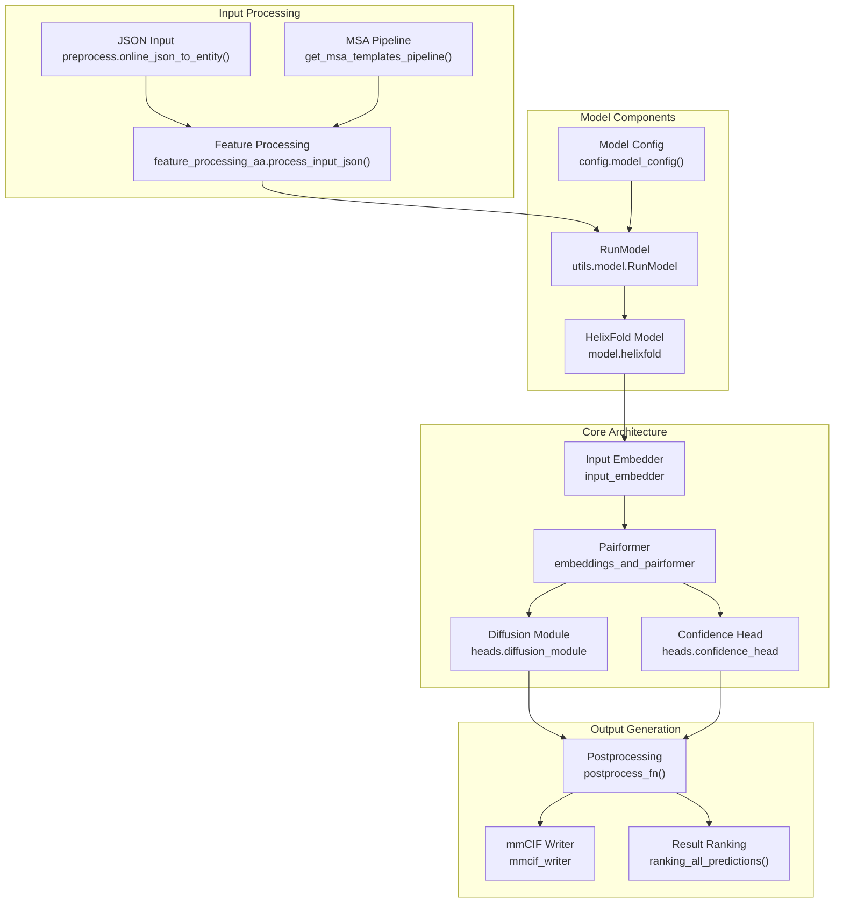
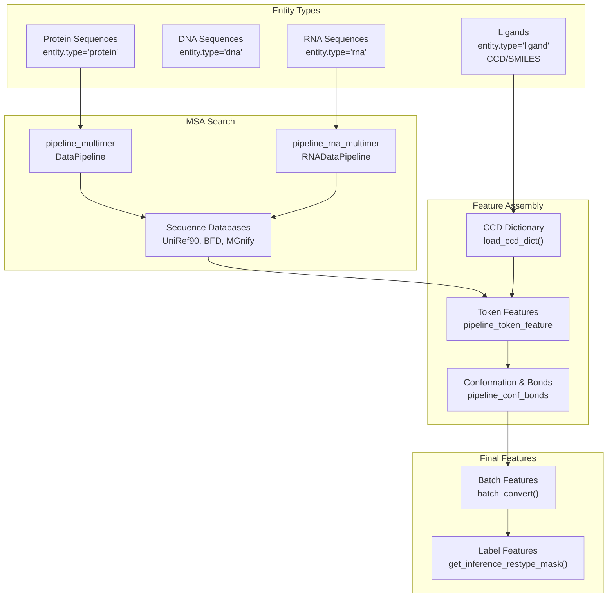
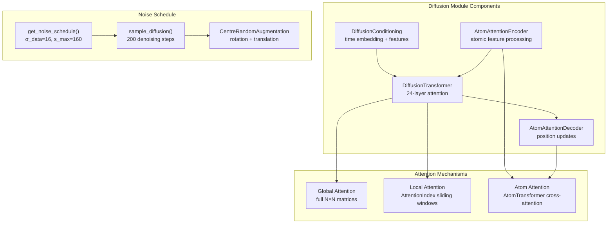
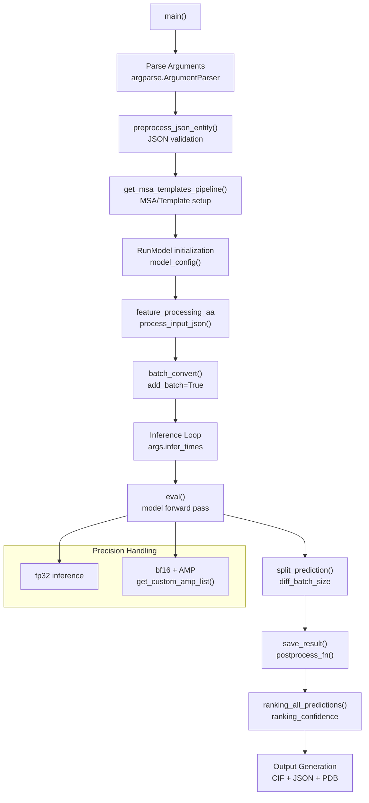

# HelixFold3

> **Relevant source files**
> * [apps/protein_folding/helixfold3/README.md](https://github.com/PaddlePaddle/PaddleHelix/blob/7fdd7a18/apps/protein_folding/helixfold3/README.md?plain=1)
> * [apps/protein_folding/helixfold3/helixfold/model/config.py](https://github.com/PaddlePaddle/PaddleHelix/blob/7fdd7a18/apps/protein_folding/helixfold3/helixfold/model/config.py)
> * [apps/protein_folding/helixfold3/helixfold/model/diffusion.py](https://github.com/PaddlePaddle/PaddleHelix/blob/7fdd7a18/apps/protein_folding/helixfold3/helixfold/model/diffusion.py)
> * [apps/protein_folding/helixfold3/infer_scripts/feature_processing_aa.py](https://github.com/PaddlePaddle/PaddleHelix/blob/7fdd7a18/apps/protein_folding/helixfold3/infer_scripts/feature_processing_aa.py)
> * [apps/protein_folding/helixfold3/infer_scripts/tools/mmcif_writer.py](https://github.com/PaddlePaddle/PaddleHelix/blob/7fdd7a18/apps/protein_folding/helixfold3/infer_scripts/tools/mmcif_writer.py)
> * [apps/protein_folding/helixfold3/inference.py](https://github.com/PaddlePaddle/PaddleHelix/blob/7fdd7a18/apps/protein_folding/helixfold3/inference.py)
> * [apps/protein_folding/helixfold3/run_infer.sh](https://github.com/PaddlePaddle/PaddleHelix/blob/7fdd7a18/apps/protein_folding/helixfold3/run_infer.sh)

HelixFold3 is a biomolecular structure prediction system that replicates the capabilities of AlphaFold3. It predicts the 3D structures of proteins, nucleic acids (DNA/RNA), and small molecule ligands using a diffusion-based neural network architecture. The system supports both interactive web interfaces and high-throughput API access for computational workflows.

For general protein structure prediction capabilities, see [Protein Structure Prediction](/PaddlePaddle/PaddleHelix/3.1-protein-structure-prediction). For single-sequence protein folding without MSAs, see [HelixFold](/PaddlePaddle/PaddleHelix/3.1.1-helixfold).

## System Architecture

HelixFold3 consists of several interconnected components that process biomolecular inputs through feature extraction, model inference, and structure generation phases.



Sources: [apps/protein_folding/helixfold3/inference.py L1-L638](https://github.com/PaddlePaddle/PaddleHelix/blob/7fdd7a18/apps/protein_folding/helixfold3/inference.py#L1-L638)

 [apps/protein_folding/helixfold3/helixfold/model/config.py L27-L35](https://github.com/PaddlePaddle/PaddleHelix/blob/7fdd7a18/apps/protein_folding/helixfold3/helixfold/model/config.py#L27-L35)

## Input Processing Pipeline

The system processes structured JSON inputs containing multiple entity types through a comprehensive feature extraction pipeline.



Sources: [apps/protein_folding/helixfold3/infer_scripts/feature_processing_aa.py L402-L515](https://github.com/PaddlePaddle/PaddleHelix/blob/7fdd7a18/apps/protein_folding/helixfold3/infer_scripts/feature_processing_aa.py#L402-L515)

 [apps/protein_folding/helixfold3/inference.py L109-L158](https://github.com/PaddlePaddle/PaddleHelix/blob/7fdd7a18/apps/protein_folding/helixfold3/inference.py#L109-L158)

## Model Configuration

The model architecture is defined through a hierarchical configuration system with different presets for various use cases.

| Configuration Component | Key Parameters | Description |
| --- | --- | --- |
| **Channel Numbers** | `token_channel: 384``diffusion_token_channel: 768``atom_channel: 128` | Embedding dimensions for different representation levels |
| **Input Embedder** | `atom_encoder``relative_position_encoding` | Processes atomic and positional features |
| **Pairformer** | `num_block: 48``triangle_attention``triangle_multiplication` | Main sequence processing backbone |
| **Diffusion Module** | `test_diff_batch_size: 5``diffusion_transformer: 24 blocks` | Structure generation through denoising |
| **Global Config** | `subbatch_size: 96``num_recycle: 3` | Memory and computation optimization |

The system supports different model configurations through `CONFIG_DIFFS`:

```
CONFIG_DIFFS = {    'allatom_demo': {        'model.heads.confidence_head.weight': 0.01    },    'allatom_subbatch_64_recycle_1': {        'model.global_config.subbatch_size': 64,        'model.num_recycle': 1,    }}
```

Sources: [apps/protein_folding/helixfold3/helixfold/model/config.py L37-L46](https://github.com/PaddlePaddle/PaddleHelix/blob/7fdd7a18/apps/protein_folding/helixfold3/helixfold/model/config.py#L37-L46)

 [apps/protein_folding/helixfold3/helixfold/model/config.py L47-L417](https://github.com/PaddlePaddle/PaddleHelix/blob/7fdd7a18/apps/protein_folding/helixfold3/helixfold/model/config.py#L47-L417)

## Diffusion Architecture

The core prediction engine uses a diffusion-based approach for structure generation with specialized attention mechanisms.



Sources: [apps/protein_folding/helixfold3/helixfold/model/diffusion.py L106-L231](https://github.com/PaddlePaddle/PaddleHelix/blob/7fdd7a18/apps/protein_folding/helixfold3/helixfold/model/diffusion.py#L106-L231)

 [apps/protein_folding/helixfold3/helixfold/model/diffusion.py L320-L348](https://github.com/PaddlePaddle/PaddleHelix/blob/7fdd7a18/apps/protein_folding/helixfold3/helixfold/model/diffusion.py#L320-L348)

## Attention Index System

HelixFold3 implements a sophisticated attention indexing system for handling large biomolecular complexes efficiently through local attention patterns.

| Component | Function | Shape | Description |
| --- | --- | --- | --- |
| **AttentionIndex** | `get_atten_idx(M)` | `[C, n_query, n_key]` | Sliding window indices for local attention |
| **Query/Key Windows** | `n_query=32, n_key=128` | Fixed window sizes | Local attention window parameters |
| **AtomPairUtil** | `to_atompair()` | Dense/Sparse modes | Converts token-pair to atom-pair features |
| **Subset Centers** | `_get_subset_centers(M)` | `[C]` | Centers for attention windows |

The system automatically switches between dense and sparse representations based on sequence length and memory constraints.

Sources: [apps/protein_folding/helixfold3/helixfold/model/diffusion.py L878-L1106](https://github.com/PaddlePaddle/PaddleHelix/blob/7fdd7a18/apps/protein_folding/helixfold3/helixfold/model/diffusion.py#L878-L1106)

 [apps/protein_folding/helixfold3/helixfold/model/diffusion.py L1108-L1387](https://github.com/PaddlePaddle/PaddleHelix/blob/7fdd7a18/apps/protein_folding/helixfold3/helixfold/model/diffusion.py#L1108-L1387)

## Inference Pipeline

The inference process follows a structured workflow from input validation through structure generation to output formatting.



Sources: [apps/protein_folding/helixfold3/inference.py L433-L540](https://github.com/PaddlePaddle/PaddleHelix/blob/7fdd7a18/apps/protein_folding/helixfold3/inference.py#L433-L540)

 [apps/protein_folding/helixfold3/inference.py L178-L200](https://github.com/PaddlePaddle/PaddleHelix/blob/7fdd7a18/apps/protein_folding/helixfold3/inference.py#L178-L200)

## Output Format and Post-processing

HelixFold3 generates comprehensive outputs including structure files, confidence metrics, and metadata.

### Output Directory Structure

```
<output_dir>/
└── <job_name>/
    ├── <job_name>-pred-1-1/
    │   ├── predicted_structure.cif
    │   ├── predicted_structure.pdb  
    │   └── all_results.json
    ├── <job_name>-rank1/
    │   └── [ranked results]
    └── final_features.pkl
```

### Key Output Metrics

| Metric | Description | Source |
| --- | --- | --- |
| **pLDDT** | Per-residue confidence score | `confidence_head['atom_plddts']` |
| **PAE** | Predicted Aligned Error matrix | `confidence_head['pae']` |
| **ipTM** | Interface Template Modeling score | `confidence_head['iptm']` |
| **Ranking Confidence** | Overall structure quality | `confidence_head['ranking_confidence']` |

### mmCIF Enhancement

The system enhances standard mmCIF files with additional metadata including:

* Global confidence scores through `mmcif_meta_append()`
* Ligand bond information via `mmcif_append()`
* License and usage terms
* Model provenance data

Sources: [apps/protein_folding/helixfold3/inference.py L203-L314](https://github.com/PaddlePaddle/PaddleHelix/blob/7fdd7a18/apps/protein_folding/helixfold3/inference.py#L203-L314)

 [apps/protein_folding/helixfold3/infer_scripts/tools/mmcif_writer.py L77-L182](https://github.com/PaddlePaddle/PaddleHelix/blob/7fdd7a18/apps/protein_folding/helixfold3/infer_scripts/tools/mmcif_writer.py#L77-L182)

## Usage and Configuration

### Basic Inference Command

```
python inference.py \    --input_json data/demo_protein_ligand.json \    --output_dir ./output \    --model_name allatom_demo \    --init_model ./init_models/checkpoints.pdparams \    --precision "fp32" \    --infer_times 3
```

### Memory Optimization

For large complexes, adjust these parameters in the model configuration:

* `model.global_config.subbatch_size`: Reduce from 96 to save memory
* `model.num_recycle`: Reduce recycling iterations
* `test_diff_batch_size`: Number of diffusion samples per inference

### Resource Requirements

| Configuration | GPU Memory | Max Tokens | Precision |
| --- | --- | --- | --- |
| **A100-40G** | 32GB+ | ~1200 | bf16 |
| **V100-32G** | 32GB | ~1000 | fp32 |
| **Reduced Mode** | Lower | Configurable | Adjustable subbatch_size |

Sources: [apps/protein_folding/helixfold3/run_infer.sh L1-L39](https://github.com/PaddlePaddle/PaddleHelix/blob/7fdd7a18/apps/protein_folding/helixfold3/run_infer.sh#L1-L39)

 [apps/protein_folding/helixfold3/README.md L228-L240](https://github.com/PaddlePaddle/PaddleHelix/blob/7fdd7a18/apps/protein_folding/helixfold3/README.md?plain=1#L228-L240)