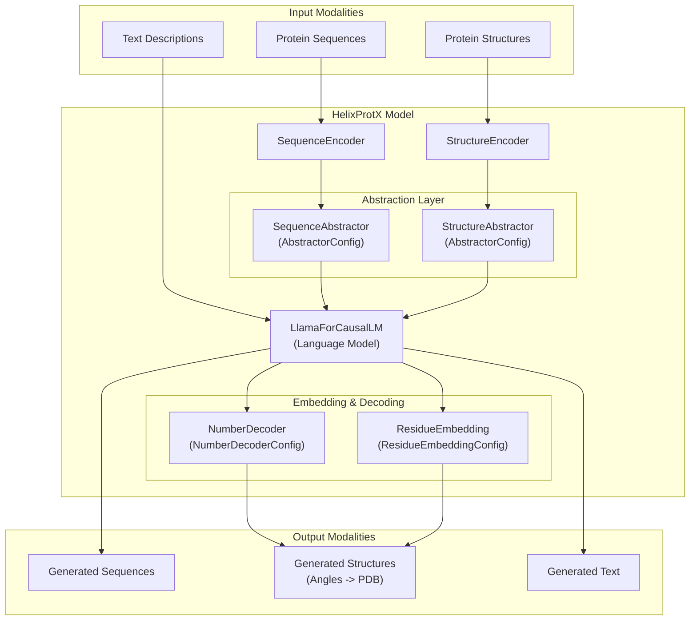
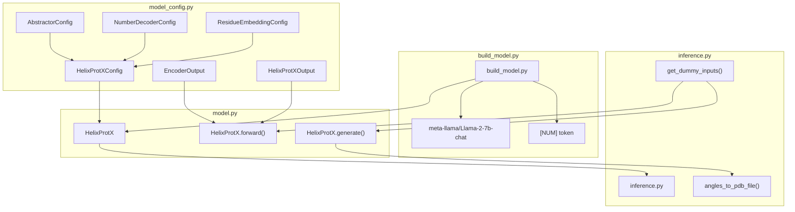

# HelixProtX

> **Relevant source files**
> * [apps/helixprotx/README.md](https://github.com/PaddlePaddle/PaddleHelix/blob/7fdd7a18/apps/helixprotx/README.md?plain=1)
> * [apps/helixprotx/README_cn.md](https://github.com/PaddlePaddle/PaddleHelix/blob/7fdd7a18/apps/helixprotx/README_cn.md?plain=1)
> * [apps/helixprotx/build_model.py](https://github.com/PaddlePaddle/PaddleHelix/blob/7fdd7a18/apps/helixprotx/build_model.py)
> * [apps/helixprotx/inference.py](https://github.com/PaddlePaddle/PaddleHelix/blob/7fdd7a18/apps/helixprotx/inference.py)
> * [apps/helixprotx/model_config.py](https://github.com/PaddlePaddle/PaddleHelix/blob/7fdd7a18/apps/helixprotx/model_config.py)
> * [apps/helixprotx/requirements.txt](https://github.com/PaddlePaddle/PaddleHelix/blob/7fdd7a18/apps/helixprotx/requirements.txt)

HelixProtX is a large multimodal model for any-to-any protein generation that unifies protein sequences, structures, and textual descriptions. This system enables transformation between different protein modalities through a unified architecture combining large language models with specialized protein encoders and decoders.

For general protein structure prediction capabilities, see [Protein Structure Prediction](/PaddlePaddle/PaddleHelix/3.1-protein-structure-prediction). For drug discovery applications involving protein-ligand interactions, see [Drug Discovery](/PaddlePaddle/PaddleHelix/3.2-drug-discovery).

## Architecture Overview

HelixProtX implements a multimodal architecture that processes three types of protein representations: sequences, structures, and textual descriptions. The system uses specialized encoders for each modality, abstraction layers to create unified representations, and decoders to generate outputs in any desired modality.

### Core System Architecture



Sources: [apps/helixprotx/model_config.py L115-L170](https://github.com/PaddlePaddle/PaddleHelix/blob/7fdd7a18/apps/helixprotx/model_config.py#L115-L170)

 [apps/helixprotx/README.md L1-L8](https://github.com/PaddlePaddle/PaddleHelix/blob/7fdd7a18/apps/helixprotx/README.md?plain=1#L1-L8)

### Component Integration and Data Flow



Sources: [apps/helixprotx/model.py L19](https://github.com/PaddlePaddle/PaddleHelix/blob/7fdd7a18/apps/helixprotx/model.py#L19-L19)

 [apps/helixprotx/build_model.py L42](https://github.com/PaddlePaddle/PaddleHelix/blob/7fdd7a18/apps/helixprotx/build_model.py#L42-L42)

 [apps/helixprotx/inference.py L85](https://github.com/PaddlePaddle/PaddleHelix/blob/7fdd7a18/apps/helixprotx/inference.py#L85-L85)

## Key Components

### Configuration System

HelixProtX uses a hierarchical configuration system with specialized configurations for each component:

| Config Class | Purpose | Key Parameters |
| --- | --- | --- |
| `HelixProtXConfig` | Main model configuration | Combines all sub-configs |
| `AbstractorConfig` | Abstraction layer config | `num_tokens`, `encoder_hidden_size`, `num_attention_heads` |
| `NumberDecoderConfig` | Numerical output decoder | `output_size`, `output_scaling`, `loss_scaling` |
| `ResidueEmbeddingConfig` | Residue angle embedding | `num_angles`, `num_embeddings`, `num_range` |
| `StructureEncoderConfig` | Structure input encoder | (Placeholder for future implementation) |
| `SequenceEncoderConfig` | Sequence input encoder | (Placeholder for future implementation) |

Sources: [apps/helixprotx/model_config.py L26-L188](https://github.com/PaddlePaddle/PaddleHelix/blob/7fdd7a18/apps/helixprotx/model_config.py#L26-L188)

### Abstraction Layer

The abstraction layer unifies different protein modalities into a common representation space. Each abstractor processes encoder outputs and generates fixed-length token representations:

* **Structure Abstractor**: Processes 3D structural information with configurable `encoder_hidden_size` (default: 128)
* **Sequence Abstractor**: Handles amino acid sequences with attention mechanisms
* **Token Generation**: Creates `num_tokens` (default: 64) abstract representations per modality

Sources: [apps/helixprotx/model_config.py L34-L58](https://github.com/PaddlePaddle/PaddleHelix/blob/7fdd7a18/apps/helixprotx/model_config.py#L34-L58)

### Number Decoder

The `NumberDecoder` specializes in generating numerical outputs, particularly protein structural angles:

* **Output Size**: 6 angles per residue (phi, psi, omega, chi1, chi2, chi3)
* **Loss Scaling**: Configurable scaling for angle prediction loss
* **Range Constraints**: Enforces valid angle ranges [-π, π]

Sources: [apps/helixprotx/model_config.py L60-L80](https://github.com/PaddlePaddle/PaddleHelix/blob/7fdd7a18/apps/helixprotx/model_config.py#L60-L80)

### Residue Embedding System

The residue embedding system converts numerical angles into embeddings compatible with the language model:

* **Angle Embedding**: Maps 6 angles to dense embeddings
* **Attention Integration**: Uses multi-head attention with the LLM hidden states
* **Output Projection**: Projects to match LLM hidden size for seamless integration

Sources: [apps/helixprotx/model_config.py L82-L113](https://github.com/PaddlePaddle/PaddleHelix/blob/7fdd7a18/apps/helixprotx/model_config.py#L82-L113)

## Model Outputs

HelixProtX produces structured outputs for different generation scenarios:

### Training/Forward Pass Output

```python
@dataclassclass HelixProtXOutput(ModelOutput):    language_model_outputs: Optional[CausalLMOutputWithPast] = None    number_decoder_outputs: Optional[NumberDecoderOutput] = None
```

### Generation Output

```python
@dataclassclass HelixProtXGenerationOutput(ModelOutput):    input_ids: Optional[paddle.Tensor] = None    pred_angles: Optional[paddle.Tensor] = None
```

Sources: [apps/helixprotx/model_config.py L196-L215](https://github.com/PaddlePaddle/PaddleHelix/blob/7fdd7a18/apps/helixprotx/model_config.py#L196-L215)

## Usage Patterns

### Model Initialization

The model initialization process demonstrates the integration of various components:

```markdown
# Initialize with Llama-2 as base LLMmodel.language_model = AutoModelForCausalLM.from_pretrained('meta-llama/Llama-2-7b-chat') # Add special [NUM] token for numerical datatokenizer.add_tokens('[NUM]')model.language_model.resize_token_embeddings(len(tokenizer))
```

Sources: [apps/helixprotx/build_model.py L44-L52](https://github.com/PaddlePaddle/PaddleHelix/blob/7fdd7a18/apps/helixprotx/build_model.py#L44-L52)

### Inference Pipeline

The inference process supports both forward passes and generation:

1. **Forward Pass**: Computes losses for training with `lm_loss` and `rad_loss`
2. **Generation**: Produces text and structural outputs simultaneously
3. **Structure Output**: Converts predicted angles to PDB format

Sources: [apps/helixprotx/inference.py L88-L112](https://github.com/PaddlePaddle/PaddleHelix/blob/7fdd7a18/apps/helixprotx/inference.py#L88-L112)

### Input Format

The model accepts batched inputs with multiple modality indices:

* `struc_idx`: Indices for structure-based samples
* `seq_idx`: Indices for sequence-based samples
* `angle_idx`: Indices for angle prediction samples
* Special token masking for numerical values

Sources: [apps/helixprotx/inference.py L39-L80](https://github.com/PaddlePaddle/PaddleHelix/blob/7fdd7a18/apps/helixprotx/inference.py#L39-L80)

## Installation and Setup

### Environment Requirements

HelixProtX requires specific versions of PaddlePaddle and related libraries:

```sql
conda create -n helixprotx python=3.8conda activate helixprotxpip install -r requirements.txt
```

Key dependencies include:

* `paddlepaddle>=2.6.0`
* `paddlenlp>=2.7.2`
* `biopython==1.78`
* `biotite==0.40.0`

Sources: [apps/helixprotx/requirements.txt L1-L11](https://github.com/PaddlePaddle/PaddleHelix/blob/7fdd7a18/apps/helixprotx/requirements.txt#L1-L11)

 [apps/helixprotx/README.md L19-L25](https://github.com/PaddlePaddle/PaddleHelix/blob/7fdd7a18/apps/helixprotx/README.md?plain=1#L19-L25)

### Model Building

To create a HelixProtX model instance:

```markdown
python build_model.py  # Creates model checkpointpython inference.py    # Runs inference demo
```

The build process integrates the Llama-2 language model with HelixProtX-specific components and saves the combined model for inference.

Sources: [apps/helixprotx/build_model.py L56-L58](https://github.com/PaddlePaddle/PaddleHelix/blob/7fdd7a18/apps/helixprotx/build_model.py#L56-L58)

 [apps/helixprotx/inference.py L16-L17](https://github.com/PaddlePaddle/PaddleHelix/blob/7fdd7a18/apps/helixprotx/inference.py#L16-L17)

## Licensing

HelixProtX is licensed under CC BY-NC (Creative Commons Attribution-NonCommercial), restricting commercial use while allowing academic research and educational applications.

Sources: [apps/helixprotx/README.md L9-L17](https://github.com/PaddlePaddle/PaddleHelix/blob/7fdd7a18/apps/helixprotx/README.md?plain=1#L9-L17)