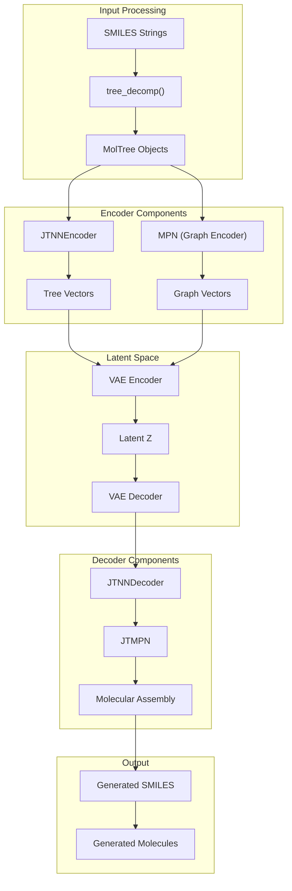
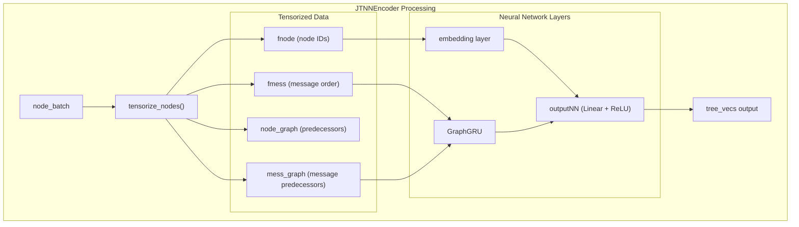
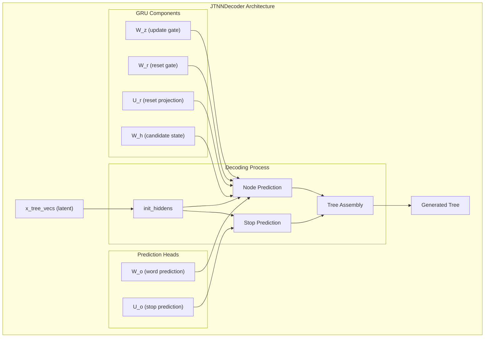
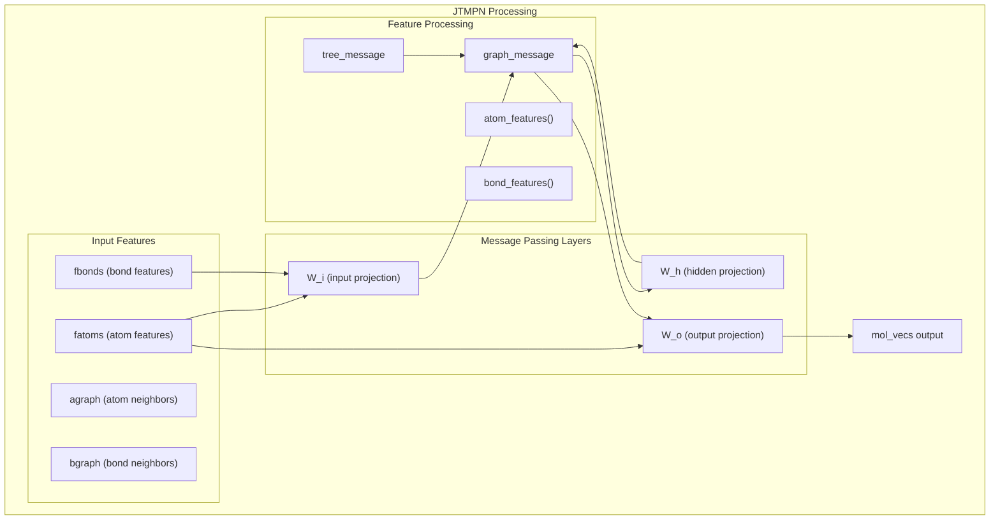
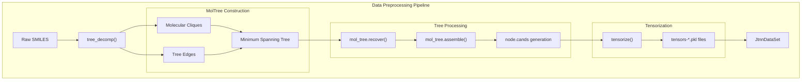
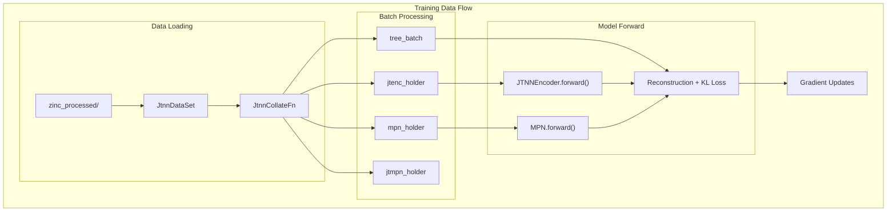
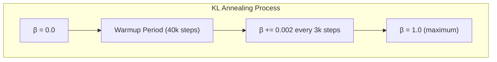

# JT-VAE

> **Relevant source files**
> * [apps/molecular_generation/JT_VAE/README.md](https://github.com/PaddlePaddle/PaddleHelix/blob/7fdd7a18/apps/molecular_generation/JT_VAE/README.md?plain=1)
> * [apps/molecular_generation/JT_VAE/README_cn.md](https://github.com/PaddlePaddle/PaddleHelix/blob/7fdd7a18/apps/molecular_generation/JT_VAE/README_cn.md?plain=1)
> * [apps/molecular_generation/JT_VAE/configs/config.json](https://github.com/PaddlePaddle/PaddleHelix/blob/7fdd7a18/apps/molecular_generation/JT_VAE/configs/config.json)
> * [apps/molecular_generation/JT_VAE/preprocess.py](https://github.com/PaddlePaddle/PaddleHelix/blob/7fdd7a18/apps/molecular_generation/JT_VAE/preprocess.py)
> * [apps/molecular_generation/JT_VAE/sample.py](https://github.com/PaddlePaddle/PaddleHelix/blob/7fdd7a18/apps/molecular_generation/JT_VAE/sample.py)
> * [apps/molecular_generation/JT_VAE/src/__init__.py](https://github.com/PaddlePaddle/PaddleHelix/blob/7fdd7a18/apps/molecular_generation/JT_VAE/src/__init__.py)
> * [apps/molecular_generation/JT_VAE/src/chemutils.py](https://github.com/PaddlePaddle/PaddleHelix/blob/7fdd7a18/apps/molecular_generation/JT_VAE/src/chemutils.py)
> * [apps/molecular_generation/JT_VAE/src/datautils.py](https://github.com/PaddlePaddle/PaddleHelix/blob/7fdd7a18/apps/molecular_generation/JT_VAE/src/datautils.py)
> * [apps/molecular_generation/JT_VAE/src/jtmpn.py](https://github.com/PaddlePaddle/PaddleHelix/blob/7fdd7a18/apps/molecular_generation/JT_VAE/src/jtmpn.py)
> * [apps/molecular_generation/JT_VAE/src/jtnn_dec.py](https://github.com/PaddlePaddle/PaddleHelix/blob/7fdd7a18/apps/molecular_generation/JT_VAE/src/jtnn_dec.py)
> * [apps/molecular_generation/JT_VAE/src/jtnn_enc.py](https://github.com/PaddlePaddle/PaddleHelix/blob/7fdd7a18/apps/molecular_generation/JT_VAE/src/jtnn_enc.py)
> * [apps/molecular_generation/JT_VAE/src/nnutils.py](https://github.com/PaddlePaddle/PaddleHelix/blob/7fdd7a18/apps/molecular_generation/JT_VAE/src/nnutils.py)

This document covers the Junction Tree Variational Autoencoder (JT-VAE) implementation within PaddleHelix, a deep generative model for molecular graph generation. JT-VAE decomposes molecules into junction tree structures and uses variational autoencoders to learn continuous representations for molecular generation and manipulation.

For information about other molecular generation approaches, see [Sequence VAE](/PaddlePaddle/PaddleHelix/3.4.2-sequence-vae). For broader context on molecular generation within PaddleHelix, see [Molecular Generation](/PaddlePaddle/PaddleHelix/3.4-molecular-generation).

## Architecture Overview

JT-VAE implements a two-level hierarchical variational autoencoder that operates on both molecular graphs and their corresponding junction tree decompositions. The architecture consists of tree and graph encoders that produce latent representations, and a tree decoder that reconstructs molecules through sequential assembly.

### High-Level System Architecture



Sources: [apps/molecular_generation/JT_VAE/README.md L15-L16](https://github.com/PaddlePaddle/PaddleHelix/blob/7fdd7a18/apps/molecular_generation/JT_VAE/README.md?plain=1#L15-L16)

 [apps/molecular_generation/JT_VAE/src/jtnn_enc.py L22-L35](https://github.com/PaddlePaddle/PaddleHelix/blob/7fdd7a18/apps/molecular_generation/JT_VAE/src/jtnn_enc.py#L22-L35)

 [apps/molecular_generation/JT_VAE/src/jtnn_dec.py L27-L52](https://github.com/PaddlePaddle/PaddleHelix/blob/7fdd7a18/apps/molecular_generation/JT_VAE/src/jtnn_dec.py#L27-L52)

## Core Components

### Junction Tree Encoder

The `JTNNEncoder` class implements the tree encoding component that converts junction tree representations into fixed-size vector embeddings using a Graph GRU architecture.



Key methods and their roles:

| Method | Purpose | Location |
| --- | --- | --- |
| `tensorize()` | Converts tree batch to tensor format | [src/jtnn_enc.py L71-L79](https://github.com/PaddlePaddle/PaddleHelix/blob/7fdd7a18/src/jtnn_enc.py#L71-L79) |
| `tensorize_nodes()` | Creates node and message graphs | [src/jtnn_enc.py L82-L126](https://github.com/PaddlePaddle/PaddleHelix/blob/7fdd7a18/src/jtnn_enc.py#L82-L126) |
| `forward()` | Performs tree encoding with GraphGRU | [src/jtnn_enc.py L37-L68](https://github.com/PaddlePaddle/PaddleHelix/blob/7fdd7a18/src/jtnn_enc.py#L37-L68) |

Sources: [apps/molecular_generation/JT_VAE/src/jtnn_enc.py L22-L68](https://github.com/PaddlePaddle/PaddleHelix/blob/7fdd7a18/apps/molecular_generation/JT_VAE/src/jtnn_enc.py#L22-L68)

 [apps/molecular_generation/JT_VAE/src/jtnn_enc.py L129-L163](https://github.com/PaddlePaddle/PaddleHelix/blob/7fdd7a18/apps/molecular_generation/JT_VAE/src/jtnn_enc.py#L129-L163)

### Junction Tree Decoder

The `JTNNDecoder` class reconstructs molecular structures by sequentially generating tree nodes and their connections through a learned assembly process.



The decoder implements two key prediction tasks:

* **Word Prediction**: Selects the next junction tree node type
* **Stop Prediction**: Determines when to terminate branch expansion

Sources: [apps/molecular_generation/JT_VAE/src/jtnn_dec.py L27-L52](https://github.com/PaddlePaddle/PaddleHelix/blob/7fdd7a18/apps/molecular_generation/JT_VAE/src/jtnn_dec.py#L27-L52)

 [apps/molecular_generation/JT_VAE/src/jtnn_dec.py L205-L298](https://github.com/PaddlePaddle/PaddleHelix/blob/7fdd7a18/apps/molecular_generation/JT_VAE/src/jtnn_dec.py#L205-L298)

### Subgraph Message Passing Network (JTMPN)

The `JTMPN` class handles message passing over molecular subgraphs during the assembly process, combining tree-level and graph-level information.



Key feature extraction functions:

| Function | Purpose | Feature Dimensions |
| --- | --- | --- |
| `atom_features()` | One-hot atom encoding | 35 dimensions |
| `bond_features()` | Bond type encoding | 5 dimensions |

Sources: [apps/molecular_generation/JT_VAE/src/jtmpn.py L54-L94](https://github.com/PaddlePaddle/PaddleHelix/blob/7fdd7a18/apps/molecular_generation/JT_VAE/src/jtmpn.py#L54-L94)

 [apps/molecular_generation/JT_VAE/src/jtmpn.py L34-L51](https://github.com/PaddlePaddle/PaddleHelix/blob/7fdd7a18/apps/molecular_generation/JT_VAE/src/jtmpn.py#L34-L51)

## Data Flow and Processing

### Preprocessing Pipeline

The system transforms SMILES strings through multiple processing stages to create training-ready molecular tree representations.



The preprocessing involves several chemical algorithms implemented in `chemutils.py`:

| Algorithm | Function | Purpose |
| --- | --- | --- |
| Tree Decomposition | `tree_decomp()` | Splits molecules into junction trees |
| Clique Detection | Ring finding + bond analysis | Identifies molecular fragments |
| Assembly Enumeration | `enum_assemble()` | Generates assembly candidates |

Sources: [apps/molecular_generation/JT_VAE/preprocess.py L22-L42](https://github.com/PaddlePaddle/PaddleHelix/blob/7fdd7a18/apps/molecular_generation/JT_VAE/preprocess.py#L22-L42)

 [apps/molecular_generation/JT_VAE/src/chemutils.py L111-L186](https://github.com/PaddlePaddle/PaddleHelix/blob/7fdd7a18/apps/molecular_generation/JT_VAE/src/chemutils.py#L111-L186)

### Training Data Flow



Sources: [apps/molecular_generation/JT_VAE/src/datautils.py L28-L102](https://github.com/PaddlePaddle/PaddleHelix/blob/7fdd7a18/apps/molecular_generation/JT_VAE/src/datautils.py#L28-L102)

 [apps/molecular_generation/JT_VAE/vae_train.py](https://github.com/PaddlePaddle/PaddleHelix/blob/7fdd7a18/apps/molecular_generation/JT_VAE/vae_train.py)

## Training Configuration

The training process uses a configuration-driven approach with KL annealing for stable VAE training.

### Key Training Parameters

| Parameter | Default Value | Purpose |
| --- | --- | --- |
| `hidden_size` | 450 | Neural network hidden dimension |
| `latent_size` | 56 | VAE latent space dimension |
| `depthT` | 20 | Tree encoder depth |
| `depthG` | 3 | Graph encoder depth |
| `beta` | 0.0 | Initial KL regularization weight |
| `step_beta` | 0.002 | KL weight increment |
| `max_beta` | 1.0 | Maximum KL weight |
| `warmup` | 40000 | Steps before KL annealing |
| `kl_anneal_iter` | 3000 | Steps between KL updates |

### KL Annealing Schedule

The training implements a gradual KL annealing schedule to stabilize VAE training:



Sources: [apps/molecular_generation/JT_VAE/configs/config.json L1-L17](https://github.com/PaddlePaddle/PaddleHelix/blob/7fdd7a18/apps/molecular_generation/JT_VAE/configs/config.json#L1-L17)

 [apps/molecular_generation/JT_VAE/README.md L61-L67](https://github.com/PaddlePaddle/PaddleHelix/blob/7fdd7a18/apps/molecular_generation/JT_VAE/README.md?plain=1#L61-L67)

## Sampling and Generation

### Prior Sampling Process

The model generates new molecules by sampling from the learned latent space and decoding through the tree assembly process.

```mermaid
flowchart TD

TreeStructure["Generated Tree"]
PriorZ["Sample z ~ N(0,I)"]
Decode["JTNNDecoder.decode()"]
RootNode["Root Node Prediction"]
NodeExpansion["Iterative Node Expansion"]
StopDecision["Stop/Continue Decision"]
Assembly["Tree Assembly"]
Recovery["mol_tree.recover()"]
SMILES["Output SMILES"]

subgraph subGraph2 ["Sampling Pipeline"]
    PriorZ
    Decode
    PriorZ --> Decode
    Decode --> RootNode
    Assembly --> TreeStructure

subgraph subGraph1 ["Output Processing"]
    TreeStructure
    Recovery
    SMILES
    TreeStructure --> Recovery
    Recovery --> SMILES
end

subgraph subGraph0 ["Tree Generation"]
    RootNode
    NodeExpansion
    StopDecision
    Assembly
    RootNode --> NodeExpansion
    NodeExpansion --> StopDecision
    StopDecision --> NodeExpansion
    StopDecision --> Assembly
end
end
```



### Evaluation Metrics

The sampling process generates molecules evaluated on standard molecular generation metrics:

| Metric | Description | Typical Value |
| --- | --- | --- |
| `valid` | Fraction of valid molecules | 1.0 |
| `unique@1000` | Uniqueness in 1000 samples | 1.0 |
| `unique@10000` | Uniqueness in 10000 samples | 0.9997 |
| `IntDiv` | Internal diversity | 0.87 |
| `Filters` | Drug-likeness filters | 0.61 |
| `Novelty` | Novel molecules vs training | 0.9999 |

Sources: [apps/molecular_generation/JT_VAE/sample.py L42-L49](https://github.com/PaddlePaddle/PaddleHelix/blob/7fdd7a18/apps/molecular_generation/JT_VAE/sample.py#L42-L49)

 [apps/molecular_generation/JT_VAE/README.md L78-L87](https://github.com/PaddlePaddle/PaddleHelix/blob/7fdd7a18/apps/molecular_generation/JT_VAE/README.md?plain=1#L78-L87)

## Usage Examples

### Basic Training

```markdown
# Preprocess SMILES datapython preprocess.py \    --train data/zinc/250k_rndm_zinc_drugs_clean_sorted.smi \    --save_dir zinc_processed \    --split 100 \    --num_workers 8 # Train the modelCUDA_VISIBLE_DEVICES=0 python vae_train.py \    --train zinc_processed \    --vocab data/zinc/vocab.txt \    --config configs/config.json \    --save_dir vae_models \    --num_workers 2 \    --epoch 50 \    --batch_size 32 \    --use_gpu True
```

### Molecular Sampling

```python
# Sample molecules from trained modelpython sample.py \    --nsample 10000 \    --vocab data/zinc/vocab.txt \    --model vae_models/model.iter-441000 \    --config configs/config.json \    --output sampling_output.txt
```

### Fine-tuning

```python
# Fine-tune from pretrained checkpointCUDA_VISIBLE_DEVICES=0 python vae_train.py \    --train zinc_processed \    --vocab data/zinc/vocab.txt \    --config configs/config.json \    --save_dir vae_models \    --load_epoch 441000 \    --use_gpu True
```

Sources: [apps/molecular_generation/JT_VAE/README.md L41-L107](https://github.com/PaddlePaddle/PaddleHelix/blob/7fdd7a18/apps/molecular_generation/JT_VAE/README.md?plain=1#L41-L107)