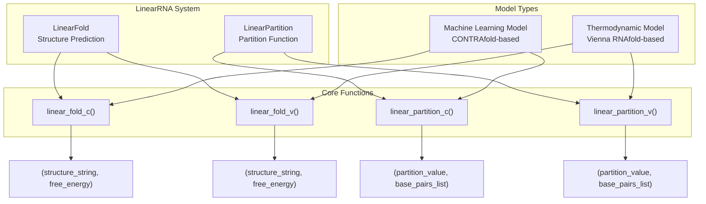
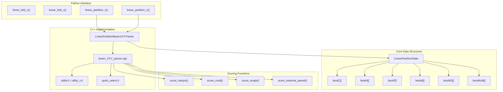
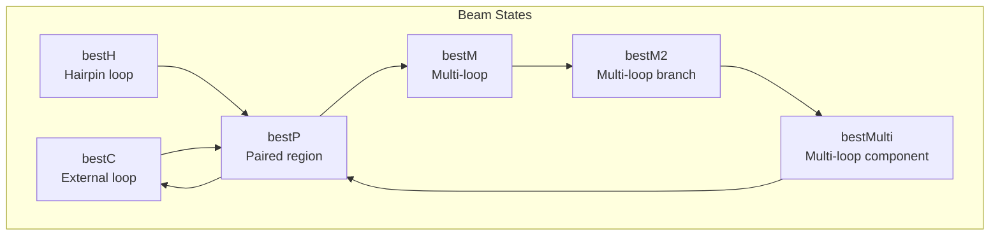
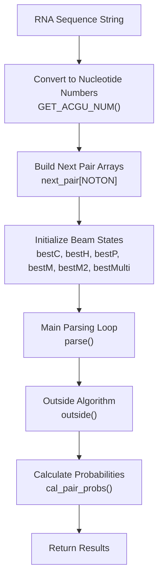

# LinearRNA

> **Relevant source files**
> * [c/pahelix/toolkit/linear_rna/README.md](https://github.com/PaddlePaddle/PaddleHelix/blob/7fdd7a18/c/pahelix/toolkit/linear_rna/README.md?plain=1)
> * [c/pahelix/toolkit/linear_rna/README_cn.md](https://github.com/PaddlePaddle/PaddleHelix/blob/7fdd7a18/c/pahelix/toolkit/linear_rna/README_cn.md?plain=1)
> * [c/pahelix/toolkit/linear_rna/linear_rna/linear_partition/beam_CKY_parser.cpp](https://github.com/PaddlePaddle/PaddleHelix/blob/7fdd7a18/c/pahelix/toolkit/linear_rna/linear_rna/linear_partition/beam_CKY_parser.cpp)
> * [tutorials/linearrna_tutorial.ipynb](https://github.com/PaddlePaddle/PaddleHelix/blob/7fdd7a18/tutorials/linearrna_tutorial.ipynb)
> * [tutorials/linearrna_tutorial_cn.ipynb](https://github.com/PaddlePaddle/PaddleHelix/blob/7fdd7a18/tutorials/linearrna_tutorial_cn.ipynb)

LinearRNA provides linear-time algorithms for RNA secondary structure analysis, including structure prediction and base pair probability calculation. This system implements two core algorithms - LinearFold and LinearPartition - each available with both machine learning and thermodynamic models.

For molecular generation approaches, see [Molecular Generation](/PaddlePaddle/PaddleHelix/3.4-molecular-generation). For other protein structure prediction methods, see [Protein Structure Prediction](/PaddlePaddle/PaddleHelix/3.1-protein-structure-prediction).

## System Overview

LinearRNA revolutionizes RNA structure analysis by replacing traditional cubic-time dynamic programming with linear-time algorithms using beam search and left-to-right parsing. The system reduces computational complexity from O(n³) to O(n) for RNA sequences.

### Algorithm Architecture



Sources: [c/pahelix/toolkit/linear_rna/README.md L1-L145](https://github.com/PaddlePaddle/PaddleHelix/blob/7fdd7a18/c/pahelix/toolkit/linear_rna/README.md?plain=1#L1-L145)

 [c/pahelix/toolkit/linear_rna/README_cn.md L1-L151](https://github.com/PaddlePaddle/PaddleHelix/blob/7fdd7a18/c/pahelix/toolkit/linear_rna/README_cn.md?plain=1#L1-L151)

### Performance Characteristics

| Sequence Length | Traditional Time | LinearRNA Time | Speedup |
| --- | --- | --- | --- |
| 1,000 nt | ~8 seconds | ~0.1 seconds | 80x |
| 10,000 nt | ~55 minutes | ~27 seconds | 120x |
| 30,000 nt | ~12 hours | ~2 minutes | 360x |

Sources: [c/pahelix/toolkit/linear_rna/README.md L35-L37](https://github.com/PaddlePaddle/PaddleHelix/blob/7fdd7a18/c/pahelix/toolkit/linear_rna/README.md?plain=1#L35-L37)

 [c/pahelix/toolkit/linear_rna/README_cn.md L36-L38](https://github.com/PaddlePaddle/PaddleHelix/blob/7fdd7a18/c/pahelix/toolkit/linear_rna/README_cn.md?plain=1#L36-L38)

## LinearFold Algorithm

LinearFold predicts RNA secondary structures using a 5'-to-3' dynamic programming approach with beam search pruning. The algorithm maintains only the most promising intermediate states, dramatically reducing search space.

### Function Interface

**Machine Learning Model:**

```
linear_fold_c(rna_sequence, beam_size=100, use_constraints=False, constraint="", no_sharp_turn=True)
```

**Thermodynamic Model:**

```
linear_fold_v(rna_sequence, beam_size=100, use_constraints=False, constraint="", no_sharp_turn=True)
```

### Parameters

| Parameter | Type | Default | Description |
| --- | --- | --- | --- |
| `rna_sequence` | string | - | Input RNA sequence |
| `beam_size` | int | 100 | Beam pruning size (0 = no pruning) |
| `use_constraints` | bool | False | Enable structural constraints |
| `constraint` | string | "" | Constraint string with symbols `? . ( )` |
| `no_sharp_turn` | bool | True | Disable sharp turns in hairpins |

### Constraint Notation

* `?`: Position with unknown pairing
* `.`: Must be unpaired
* `(`: Must be left parenthesis
* `)`: Must be right parenthesis

Sources: [c/pahelix/toolkit/linear_rna/README.md L50-L55](https://github.com/PaddlePaddle/PaddleHelix/blob/7fdd7a18/c/pahelix/toolkit/linear_rna/README.md?plain=1#L50-L55)

 [tutorials/linearrna_tutorial.ipynb L74-L79](https://github.com/PaddlePaddle/PaddleHelix/blob/7fdd7a18/tutorials/linearrna_tutorial.ipynb#L74-L79)

### Usage Examples

```javascript
import pahelix.toolkit.linear_rna as linear_rna # Basic structure predictionsequence = "GGGCUCGUAGAUCAGCGGUAGAUCGCUUCCUUCGCAAGGAAGCCCUGGGUUCAAAUCCCAGCGAGUCCACCA"result = linear_rna.linear_fold_c(sequence)# Returns: ('(((((((..((((.......))))(((((((.....))))))).(((((.......))))))))))))....', 13.97) # With constraintssequence = "AACUCCGCCAGGCCUGGAAGGGAGCAACGGUAGUGACACUCUCUGUGUGCGUAGGUUGCCUAGCUACCAUUU"constraint = "??(???(??????)?(????????)???(??????(???????)?)???????????)??.???????????"result = linear_rna.linear_fold_c(sequence, use_constraints=True, constraint=constraint)# Returns: ('..(.(((......)((........))(((......(.......).))).....))..)..............', -27.33)
```

Sources: [tutorials/linearrna_tutorial.ipynb L102-L105](https://github.com/PaddlePaddle/PaddleHelix/blob/7fdd7a18/tutorials/linearrna_tutorial.ipynb#L102-L105)

 [tutorials/linearrna_tutorial.ipynb L125-L128](https://github.com/PaddlePaddle/PaddleHelix/blob/7fdd7a18/tutorials/linearrna_tutorial.ipynb#L125-L128)

## LinearPartition Algorithm

LinearPartition calculates partition functions and base pair probabilities for RNA sequences. It models the equilibrium distribution of thousands of possible structures and computes probability matrices for base pairing.

### Function Interface

**Machine Learning Model:**

```
linear_partition_c(rna_sequence, beam_size=100, bp_cutoff=0.0, no_sharp_turn=True)
```

**Thermodynamic Model:**

```
linear_partition_v(rna_sequence, beam_size=100, bp_cutoff=0.0, no_sharp_turn=True)
```

### Parameters

| Parameter | Type | Default | Description |
| --- | --- | --- | --- |
| `rna_sequence` | string | - | Input RNA sequence |
| `beam_size` | int | 100 | Beam pruning size |
| `bp_cutoff` | float | 0.0 | Minimum probability threshold (0.0-1.0) |
| `no_sharp_turn` | bool | True | Disable sharp turns |

### Usage Examples

```javascript
# Partition function calculationsequence = "UGAGUUCUCGAUCUCUAAAAUCG"result = linear_rna.linear_partition_c(sequence, bp_cutoff=0.2)# Returns: (0.64, [(4, 13, 0.2007), (10, 22, 0.2466), (11, 21, 0.2457), (12, 20, 0.2093)]) # Thermodynamic modelresult = linear_rna.linear_partition_v(sequence, bp_cutoff=0.5)# Returns: (-1.96, [(2, 15, 0.8331), (3, 14, 0.8366), (4, 13, 0.8355)])
```

Sources: [tutorials/linearrna_tutorial.ipynb L244-L246](https://github.com/PaddlePaddle/PaddleHelix/blob/7fdd7a18/tutorials/linearrna_tutorial.ipynb#L244-L246)

 [tutorials/linearrna_tutorial.ipynb L281-L282](https://github.com/PaddlePaddle/PaddleHelix/blob/7fdd7a18/tutorials/linearrna_tutorial.ipynb#L281-L282)

## Implementation Architecture

The LinearRNA system is implemented with a hybrid Python/C++ architecture where Python provides the interface and C++ handles the computationally intensive algorithms.

### Core Implementation Classes



Sources: [c/pahelix/toolkit/linear_rna/linear_partition/beam_CKY_parser.cpp L1-L713](https://github.com/PaddlePaddle/PaddleHelix/blob/7fdd7a18/c/pahelix/toolkit/linear_rna/linear_partition/beam_CKY_parser.cpp#L1-L713)

### LinearPartitionBeamCKYParser Class Structure

| Method | Purpose | Line Reference |
| --- | --- | --- |
| `parse()` | Main parsing algorithm | [beam_CKY_parser.cpp L20-L400](https://github.com/PaddlePaddle/PaddleHelix/blob/7fdd7a18/beam_CKY_parser.cpp#L20-L400) |
| `prepare()` | Initialize data structures | [beam_CKY_parser.cpp L402-L418](https://github.com/PaddlePaddle/PaddleHelix/blob/7fdd7a18/beam_CKY_parser.cpp#L402-L418) |
| `outside()` | Calculate outside probabilities | [beam_CKY_parser.cpp L454-L689](https://github.com/PaddlePaddle/PaddleHelix/blob/7fdd7a18/beam_CKY_parser.cpp#L454-L689) |
| `cal_pair_probs()` | Compute base pair probabilities | [beam_CKY_parser.cpp L436-L452](https://github.com/PaddlePaddle/PaddleHelix/blob/7fdd7a18/beam_CKY_parser.cpp#L436-L452) |
| `beam_prune()` | Prune beam search space | [beam_CKY_parser.cpp L691-L711](https://github.com/PaddlePaddle/PaddleHelix/blob/7fdd7a18/beam_CKY_parser.cpp#L691-L711) |

### Beam Search States

The algorithm maintains six types of beam search states:



Sources: [c/pahelix/toolkit/linear_rna/linear_partition/beam_CKY_parser.cpp L63-L68](https://github.com/PaddlePaddle/PaddleHelix/blob/7fdd7a18/c/pahelix/toolkit/linear_rna/linear_partition/beam_CKY_parser.cpp#L63-L68)

 [c/pahelix/toolkit/linear_rna/linear_partition/beam_CKY_parser.cpp L404-L409](https://github.com/PaddlePaddle/PaddleHelix/blob/7fdd7a18/c/pahelix/toolkit/linear_rna/linear_partition/beam_CKY_parser.cpp#L404-L409)

### Energy Model Selection

The system supports two energy models controlled by the `energy_model` parameter:

| Model | Character | Description | Functions Used |
| --- | --- | --- | --- |
| CONTRAfold | 'c' | Machine learning | `score_*()` functions |
| Vienna | 'v' | Thermodynamic | `v_score_*()` functions |

Energy calculations are performed differently based on the model:

```
if (energy_model == 'v') {    float newscore = - v_score_hairpin(j, jnext, nucj, nucj1, nucjnext_1, nucjnext, tetra_hex_tri);    fast_log_plus_equals(bestH[jnext][j].alpha, newscore / kT);} else {    float newscore = score_hairpin(j, jnext, nucj, nucj1, nucjnext_1, nucjnext);    fast_log_plus_equals(bestH[jnext][j].alpha, newscore);}
```

Sources: [c/pahelix/toolkit/linear_rna/linear_partition/beam_CKY_parser.cpp L88-L104](https://github.com/PaddlePaddle/PaddleHelix/blob/7fdd7a18/c/pahelix/toolkit/linear_rna/linear_partition/beam_CKY_parser.cpp#L88-L104)

## Data Processing Pipeline

### Sequence Processing Flow



Sources: [c/pahelix/toolkit/linear_rna/linear_partition/beam_CKY_parser.cpp L20-L400](https://github.com/PaddlePaddle/PaddleHelix/blob/7fdd7a18/c/pahelix/toolkit/linear_rna/linear_partition/beam_CKY_parser.cpp#L20-L400)

### Beam Pruning Algorithm

The beam pruning mechanism maintains computational efficiency by keeping only the most promising states:

```cpp
float LinearPartitionBeamCKYParser::beam_prune(std::unordered_map<int, LinearPartitionState> &beamstep) {    scores.clear();    for (auto &item : beamstep) {        int i = item.first;        LinearPartitionState &cand = item.second;        int k = i - 1;        float newalpha = (k >= 0 ? bestC[k].alpha : 0.0) + cand.alpha;        scores.push_back(make_pair(newalpha, i));    }    if (scores.size() <= beam_size) {        return VALUE_MIN;    }    float threshold = quickselect(scores, 0, scores.size() - 1, scores.size() - beam_size);    for (auto &p : scores) {        if (p.first < threshold) {            beamstep.erase(p.second);        }    }    return threshold;}
```

Sources: [c/pahelix/toolkit/linear_rna/linear_partition/beam_CKY_parser.cpp L691-L711](https://github.com/PaddlePaddle/PaddleHelix/blob/7fdd7a18/c/pahelix/toolkit/linear_rna/linear_partition/beam_CKY_parser.cpp#L691-L711)

## Validation and Datasets

### Benchmark Datasets

| Dataset | Sequences | Max Length | Purpose |
| --- | --- | --- | --- |
| ArchiveII | 3,857 | 2,968 nt | Accuracy validation |
| RNAcentral | Large-scale | 244,296 nt | Efficiency testing |

### Baseline Comparisons

The system is benchmarked against established RNA structure prediction tools:

* **Vienna RNAfold**: Thermodynamic model with O(n³) complexity
* **CONTRAfold**: Machine learning model with O(n³) complexity

LinearRNA achieves comparable or better accuracy while providing dramatic speedup for long sequences.

Sources: [c/pahelix/toolkit/linear_rna/README.md L78-L90](https://github.com/PaddlePaddle/PaddleHelix/blob/7fdd7a18/c/pahelix/toolkit/linear_rna/README.md?plain=1#L78-L90)

 [c/pahelix/toolkit/linear_rna/README_cn.md L80-L92](https://github.com/PaddlePaddle/PaddleHelix/blob/7fdd7a18/c/pahelix/toolkit/linear_rna/README_cn.md?plain=1#L80-L92)