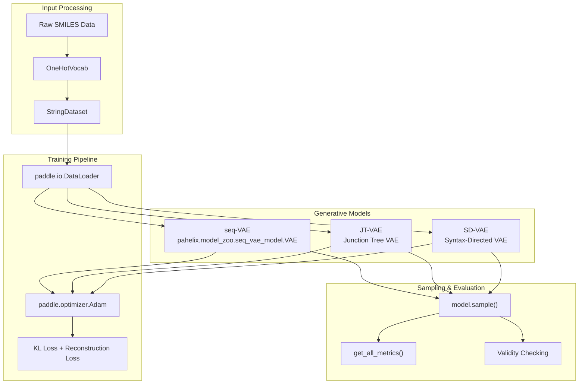
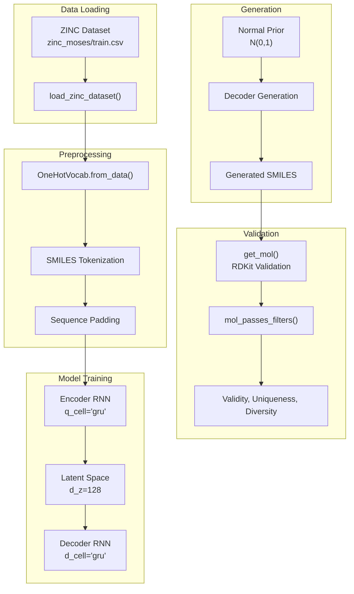
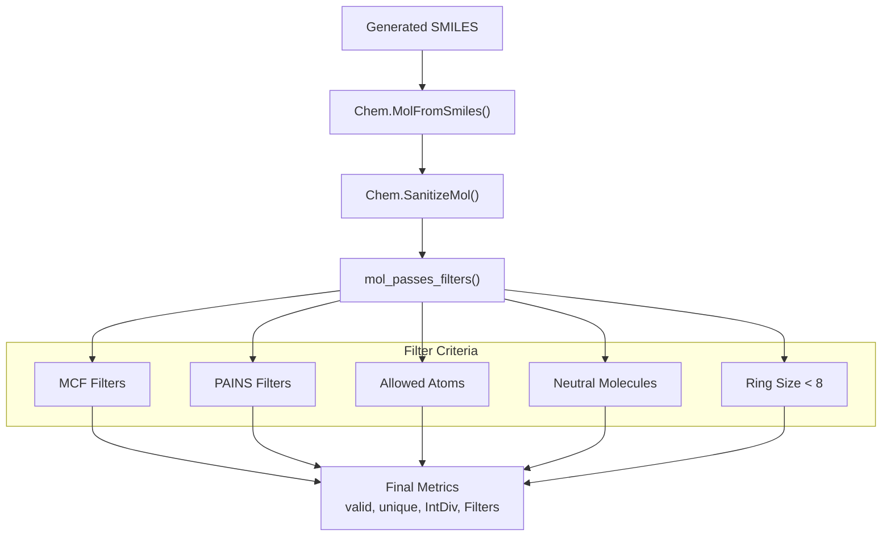

# Molecular Generation

> **Relevant source files**
> * [apps/molecular_generation/JT_VAE/scripts/sample.sh](https://github.com/PaddlePaddle/PaddleHelix/blob/7fdd7a18/apps/molecular_generation/JT_VAE/scripts/sample.sh)
> * [apps/molecular_generation/JT_VAE/scripts/train.sh](https://github.com/PaddlePaddle/PaddleHelix/blob/7fdd7a18/apps/molecular_generation/JT_VAE/scripts/train.sh)
> * [apps/molecular_generation/README.md](https://github.com/PaddlePaddle/PaddleHelix/blob/7fdd7a18/apps/molecular_generation/README.md?plain=1)
> * [apps/molecular_generation/README_cn.md](https://github.com/PaddlePaddle/PaddleHelix/blob/7fdd7a18/apps/molecular_generation/README_cn.md?plain=1)
> * [pahelix/utils/metrics/molecular_generation/utils_.py](https://github.com/PaddlePaddle/PaddleHelix/blob/7fdd7a18/pahelix/utils/metrics/molecular_generation/utils_.py)
> * [tutorials/figures/moltrans_model.png](https://github.com/PaddlePaddle/PaddleHelix/blob/7fdd7a18/tutorials/figures/moltrans_model.png)
> * [tutorials/figures/seq_VAE.png](https://github.com/PaddlePaddle/PaddleHelix/blob/7fdd7a18/tutorials/figures/seq_VAE.png)
> * [tutorials/molecular_generation_tutorial.ipynb](https://github.com/PaddlePaddle/PaddleHelix/blob/7fdd7a18/tutorials/molecular_generation_tutorial.ipynb)
> * [tutorials/molecular_generation_tutorial_cn.ipynb](https://github.com/PaddlePaddle/PaddleHelix/blob/7fdd7a18/tutorials/molecular_generation_tutorial_cn.ipynb)

This page covers PaddleHelix's molecular generation capabilities, which provide deep generative models for creating novel molecular structures. The system supports multiple generative approaches including variational autoencoders for both sequence-based and graph-based molecular representations.

For specific implementation details of individual models, see [JT-VAE](/PaddlePaddle/PaddleHelix/3.4.1-jt-vae) and [Sequence VAE](/PaddlePaddle/PaddleHelix/3.4.2-sequence-vae).

## Overview

PaddleHelix molecular generation enables the creation of novel molecular structures through trained generative models. The system processes molecular inputs in SMILES format and can generate new molecules by sampling from learned latent representations. This capability supports drug discovery applications including virtual screening, molecular optimization, and chemical space exploration.

The platform provides three main generative approaches:

| Method | Input Format | Architecture | Use Case |
| --- | --- | --- | --- |
| **JT-VAE** | SMILES → Junction Tree | Tree-structured VAE | Graph-based generation with chemical validity |
| **seq-VAE** | SMILES sequence | Sequence-to-sequence VAE | Direct sequence generation |
| **SD-VAE** | SMILES | Syntax-directed VAE | Grammar-constrained generation |

Sources: [apps/molecular_generation/README.md L1-L9](https://github.com/PaddlePaddle/PaddleHelix/blob/7fdd7a18/apps/molecular_generation/README.md?plain=1#L1-L9)

 [tutorials/molecular_generation_tutorial.ipynb L32-L38](https://github.com/PaddlePaddle/PaddleHelix/blob/7fdd7a18/tutorials/molecular_generation_tutorial.ipynb#L32-L38)

## System Architecture



Sources: [tutorials/molecular_generation_tutorial.ipynb L66-L301](https://github.com/PaddlePaddle/PaddleHelix/blob/7fdd7a18/tutorials/molecular_generation_tutorial.ipynb#L66-L301)

 [pahelix/utils/metrics/molecular_generation/utils_.py L46-L61](https://github.com/PaddlePaddle/PaddleHelix/blob/7fdd7a18/pahelix/utils/metrics/molecular_generation/utils_.py#L46-L61)

## Data Flow and Processing



Sources: [tutorials/molecular_generation_tutorial.ipynb L123-L139](https://github.com/PaddlePaddle/PaddleHelix/blob/7fdd7a18/tutorials/molecular_generation_tutorial.ipynb#L123-L139)

 [pahelix/utils/metrics/molecular_generation/utils_.py L310-L341](https://github.com/PaddlePaddle/PaddleHelix/blob/7fdd7a18/pahelix/utils/metrics/molecular_generation/utils_.py#L310-L341)

## Implementation Components

### Core Model Classes

The molecular generation system is built around several key classes:

* **`VAE`** ([pahelix/model_zoo/seq_vae_model.py](https://github.com/PaddlePaddle/PaddleHelix/blob/7fdd7a18/pahelix/model_zoo/seq_vae_model.py) ): Main sequence VAE implementation with encoder-decoder architecture
* **`OneHotVocab`** ([apps/molecular_generation/seq_VAE/utils.py](https://github.com/PaddlePaddle/PaddleHelix/blob/7fdd7a18/apps/molecular_generation/seq_VAE/utils.py) ): Vocabulary management for SMILES tokenization
* **`StringDataset`** ([apps/molecular_generation/seq_VAE/utils.py](https://github.com/PaddlePaddle/PaddleHelix/blob/7fdd7a18/apps/molecular_generation/seq_VAE/utils.py) ): Dataset wrapper for SMILES sequences

### Model Configuration

Model parameters are defined through configuration dictionaries:

```css
model_config = {    "max_length": 80,        # Maximum sequence length    "q_cell": "gru",         # Encoder cell type    "q_bidir": 1,           # Bidirectional encoder    "q_d_h": 256,           # Encoder hidden size    "q_n_layers": 1,        # Encoder layers    "d_cell": "gru",        # Decoder cell type    "d_n_layers": 3,        # Decoder layers    "d_z": 128,             # Latent space dimension    "d_d_h": 512,           # Decoder hidden size}
```

Sources: [tutorials/molecular_generation_tutorial.ipynb L234-L250](https://github.com/PaddlePaddle/PaddleHelix/blob/7fdd7a18/tutorials/molecular_generation_tutorial.ipynb#L234-L250)

### Training Process

The training loop implements the standard VAE objective combining KL divergence and reconstruction losses:

1. **Data Loading**: ZINC dataset loaded via `load_zinc_dataset()`
2. **Vocabulary Construction**: `OneHotVocab.from_data()` builds character-level vocabulary
3. **Model Initialization**: `VAE(vocab, model_config)` creates the model
4. **Loss Computation**: `kl_loss, recon_loss = model(data_batch)`
5. **Total Loss**: `loss = kl_weight * kl_loss + recon_loss`

Sources: [tutorials/molecular_generation_tutorial.ipynb L287-L369](https://github.com/PaddlePaddle/PaddleHelix/blob/7fdd7a18/tutorials/molecular_generation_tutorial.ipynb#L287-L369)

## Evaluation Metrics

The system provides comprehensive evaluation through the `get_all_metrics()` function:

| Metric | Description | Implementation |
| --- | --- | --- |
| **Validity** | Fraction of valid SMILES | `get_mol()` + RDKit sanitization |
| **Uniqueness** | Fraction of unique molecules | Set-based deduplication |
| **Diversity** | Internal diversity measures | Tanimoto similarity calculations |
| **Filters** | Drug-like property filters | `mol_passes_filters()` |

### Molecular Validation Pipeline



Sources: [pahelix/utils/metrics/molecular_generation/utils_.py L310-L341](https://github.com/PaddlePaddle/PaddleHelix/blob/7fdd7a18/pahelix/utils/metrics/molecular_generation/utils_.py#L310-L341)

 [tutorials/molecular_generation_tutorial.ipynb L395-L401](https://github.com/PaddlePaddle/PaddleHelix/blob/7fdd7a18/tutorials/molecular_generation_tutorial.ipynb#L395-L401)

## Usage Patterns

### Training Workflow

1. **Dataset Preparation**: Load ZINC dataset with `load_zinc_dataset()`
2. **Vocabulary Setup**: Create `OneHotVocab` from training data
3. **Model Configuration**: Define architecture parameters
4. **Training Loop**: Optimize KL + reconstruction loss
5. **Model Persistence**: Save trained model state

### Generation Workflow

1. **Model Loading**: Restore trained VAE model
2. **Prior Sampling**: Sample from `N(0,1)` latent distribution
3. **Decoding**: Generate SMILES via `model.sample(N_samples, max_len)`
4. **Validation**: Check molecular validity with RDKit
5. **Evaluation**: Compute generation quality metrics

### File Organization

The molecular generation codebase is organized as:

```markdown
apps/molecular_generation/
├── JT_VAE/           # Junction Tree VAE implementation
├── SD_VAE/           # Syntax-Directed VAE  
├── seq_VAE/          # Sequence VAE implementation
└── README.md         # Overview documentation

pahelix/utils/metrics/molecular_generation/
├── metrics_.py       # Main evaluation functions
├── utils_.py         # Utility functions
├── SA_Score/         # Synthetic Accessibility scoring
└── NP_Score/         # Natural Product scoring
```

Sources: [apps/molecular_generation/README.md L1-L9](https://github.com/PaddlePaddle/PaddleHelix/blob/7fdd7a18/apps/molecular_generation/README.md?plain=1#L1-L9)

 [pahelix/utils/metrics/molecular_generation/utils_.py L1-L18](https://github.com/PaddlePaddle/PaddleHelix/blob/7fdd7a18/pahelix/utils/metrics/molecular_generation/utils_.py#L1-L18)