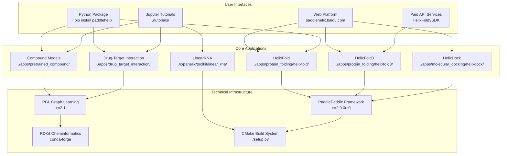
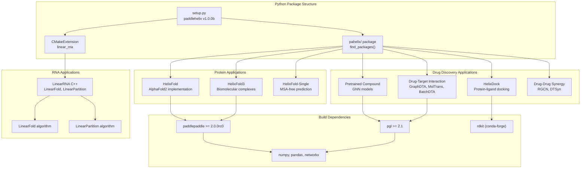
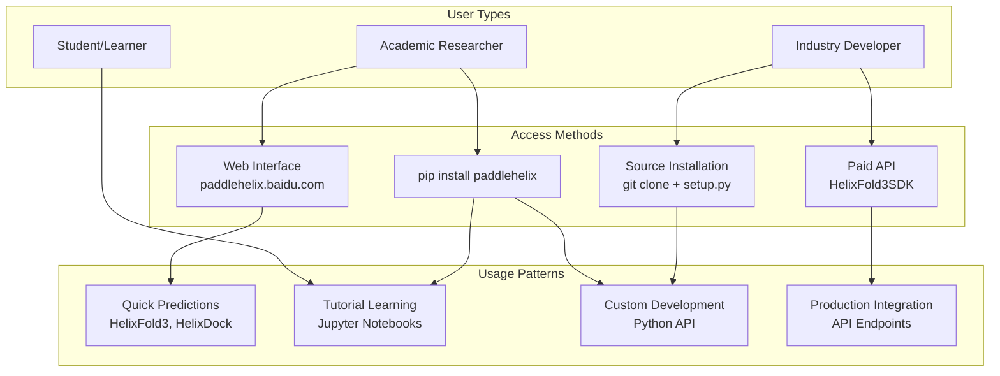

# Overview

# Overview

> **Relevant source files**
> - [\.github/PaddleHelix\_Structure\.png](https://github.com/PaddlePaddle/PaddleHelix/blob/7fdd7a18/.github/PaddleHelix_Structure.png)
> - [README\.md](https://github.com/PaddlePaddle/PaddleHelix/blob/7fdd7a18/README.md?plain=1)
> - [README\_cn\.md](https://github.com/PaddlePaddle/PaddleHelix/blob/7fdd7a18/README_cn.md?plain=1)
> - [apps/README\.md](https://github.com/PaddlePaddle/PaddleHelix/blob/7fdd7a18/apps/README.md?plain=1)
> - [apps/README\_cn\.md](https://github.com/PaddlePaddle/PaddleHelix/blob/7fdd7a18/apps/README_cn.md?plain=1)
> - [apps/molecular\_docking/helixdock/README\.md](https://github.com/PaddlePaddle/PaddleHelix/blob/7fdd7a18/apps/molecular_docking/helixdock/README.md?plain=1)
> - [apps/molecular\_docking/helixdock/README\_cn\.md](https://github.com/PaddlePaddle/PaddleHelix/blob/7fdd7a18/apps/molecular_docking/helixdock/README_cn.md?plain=1)
> - [apps/protein\_function\_prediction/ProteinSIGN/custom\_metrics\.py](https://github.com/PaddlePaddle/PaddleHelix/blob/7fdd7a18/apps/protein_function_prediction/ProteinSIGN/custom_metrics.py)
> - [installation\_guide\.md](https://github.com/PaddlePaddle/PaddleHelix/blob/7fdd7a18/installation_guide.md?plain=1)
> - [installation\_guide\_cn\.md](https://github.com/PaddlePaddle/PaddleHelix/blob/7fdd7a18/installation_guide_cn.md?plain=1)
> - [setup\.py](https://github.com/PaddlePaddle/PaddleHelix/blob/7fdd7a18/setup.py)
> - [tutorials/README\.md](https://github.com/PaddlePaddle/PaddleHelix/blob/7fdd7a18/tutorials/README.md?plain=1)
> - [tutorials/README\_cn\.md](https://github.com/PaddlePaddle/PaddleHelix/blob/7fdd7a18/tutorials/README_cn.md?plain=1)

 PaddleHelix is a comprehensive bio\-computing platform that leverages machine learning and deep neural networks to accelerate research in drug discovery, vaccine design, and precision medicine\. The platform provides both web\-based services and a Python package ecosystem built on the PaddlePaddle deep learning framework\.

 This document covers the overall architecture, core applications, and technical infrastructure of PaddleHelix\. For specific application details, see the respective sections: [Protein Structure Prediction](https://deepwiki.com/PaddlePaddle/PaddleHelix/3.1-protein-structure-prediction), [Drug Discovery](https://deepwiki.com/PaddlePaddle/PaddleHelix/3.2-drug-discovery), [Vaccine Design](https://deepwiki.com/PaddlePaddle/PaddleHelix/3.3-vaccine-design), and [Molecular Generation](https://deepwiki.com/PaddlePaddle/PaddleHelix/3.4-molecular-generation)\.

## System Architecture

 The following diagram illustrates the high\-level architecture of PaddleHelix and its major components:



 Sources: [README\.md?plain=1 L1-L133](https://github.com/PaddlePaddle/PaddleHelix/blob/7fdd7a18/README.md?plain=1#L1-L133) [setup\.py L1-L135](https://github.com/PaddlePaddle/PaddleHelix/blob/7fdd7a18/setup.py#L1-L135) [README\.md?plain=1 L1-L21](https://github.com/PaddlePaddle/PaddleHelix/blob/7fdd7a18/apps/README.md?plain=1#L1-L21)

## Core Application Domains

 PaddleHelix organizes its functionality into four main application domains, each with specific code implementations:

| Domain | Applications | Key Directories | Primary Framework |
| --- | --- | --- | --- |
| Protein Structure | HelixFold, HelixFold3, HelixFold\-Single | \./apps/protein\_folding/ | PaddlePaddle |
| Drug Discovery | Compound representation, Drug\-target interaction, Molecular docking | \./apps/pretrained\_compound/, \./apps/drug\_target\_interaction/, \./apps/molecular\_docking/ | PaddlePaddle \+ PGL |
| Vaccine Design | LinearRNA, LinearFold, LinearPartition | \./c/pahelix/toolkit/linear\_rna/ | C\+\+ \+ CMake |
| Molecular Generation | JT\-VAE, Sequence VAE | \./apps/molecular\_generation/ | PaddlePaddle |

 Sources: [README\.md?plain=1 L69-L74](https://github.com/PaddlePaddle/PaddleHelix/blob/7fdd7a18/README.md?plain=1#L69-L74) [README\.md?plain=1 L3-L21](https://github.com/PaddlePaddle/PaddleHelix/blob/7fdd7a18/apps/README.md?plain=1#L3-L21)

## Application\-to\-Code Entity Mapping

 The following diagram shows how major applications map to specific code entities and build systems:



 Sources: [setup\.py L115-L135](https://github.com/PaddlePaddle/PaddleHelix/blob/7fdd7a18/setup.py#L115-L135) [README\.md?plain=1 L1-L125](https://github.com/PaddlePaddle/PaddleHelix/blob/7fdd7a18/apps/protein_folding/helixdock/README.md?plain=1#L1-L125)

## Technical Stack and Dependencies

 PaddleHelix employs a multi\-layered technical architecture with specific version requirements:

### Core Dependencies

 The platform requires the following core dependencies as specified in the build configuration:

 - **PaddlePaddle**: `>=2.0.0rc0` \- Primary deep learning framework
- **PGL**: `>=2.1` \- Graph learning library for molecular and protein graphs
- **RDKit**: Chemistry toolkit for molecular manipulation
- **Scientific Computing**: `numpy`, `pandas`, `networkx`, `sklearn`

### Build System

 The package uses a hybrid build system combining Python setuptools with CMake for C\+\+ components:

```
# setup.py configurationext_modules=[CMakeExtension("linear_rna")]cmdclass={"build_ext": CMakeBuild}
```

 The `CMakeBuild` class handles compilation of C\+\+ components, particularly for the LinearRNA toolkit located in `./c/pahelix/toolkit/linear_rna/`\.

 Sources: [setup\.py L115-L135](https://github.com/PaddlePaddle/PaddleHelix/blob/7fdd7a18/setup.py#L115-L135) [installation\_guide\.md?plain=1 L8-L19](https://github.com/PaddlePaddle/PaddleHelix/blob/7fdd7a18/installation_guide.md?plain=1#L8-L19)

## Platform Access Patterns

 Users can access PaddleHelix through multiple interfaces depending on their needs:



 Sources: [README\.md?plain=1 L14-L16](https://github.com/PaddlePaddle/PaddleHelix/blob/7fdd7a18/README.md?plain=1#L14-L16) [README\.md?plain=1 L79-L94](https://github.com/PaddlePaddle/PaddleHelix/blob/7fdd7a18/README.md?plain=1#L79-L94) [README\.md?plain=1 L14-L25](https://github.com/PaddlePaddle/PaddleHelix/blob/7fdd7a18/tutorials/README.md?plain=1#L14-L25)

## Installation and Environment Setup

 The platform supports multiple installation methods with specific environment requirements:

### Conda Environment Setup

```
conda create -n paddlehelix python=3.7conda activate paddlehelixconda install -c conda-forge rdkit
```

### Framework Installation

```
# GPU versionpython -m pip install paddlepaddle-gpu -f https://paddlepaddle.org.cn/whl/stable.html # CPU version  python -m pip install paddlepaddle -i https://mirror.baidu.com/pypi/simple # PGL and PaddleHelixpip install pglpip install paddlehelix
```

### Platform Requirements

 - **OS Support**: Windows, Linux, OSX
- **Python Version**: 3\.6, 3\.7
- **Minimum PaddlePaddle**: 2\.0\.0rc0
- **Build Tools**: CMake \(for C\+\+ components\)

 Sources: [installation\_guide\.md?plain=1 L22-L84](https://github.com/PaddlePaddle/PaddleHelix/blob/7fdd7a18/installation_guide.md?plain=1#L22-L84) [setup\.py L115-L121](https://github.com/PaddlePaddle/PaddleHelix/blob/7fdd7a18/setup.py#L115-L121)

## Tutorial and Learning Resources

 PaddleHelix provides comprehensive learning resources organized by application domain:

### Available Tutorials

 - **Drug Discovery**: Compound property prediction, protein representation learning, drug\-target interaction
- **Vaccine Design**: RNA secondary structure prediction using LinearRNA
- **Molecular Generation**: Generative models for novel molecular structures

### Tutorial Execution

 All tutorials are provided as Jupyter Notebooks in the `./tutorials/` directory and can be executed locally:

```
cd path_to_repo/PaddleHelix/tutorials/jupyter-lab
```

 Sources: [README\.md?plain=1 L1-L25](https://github.com/PaddlePaddle/PaddleHelix/blob/7fdd7a18/tutorials/README.md?plain=1#L1-L25) [README\.md?plain=1 L86-L94](https://github.com/PaddlePaddle/PaddleHelix/blob/7fdd7a18/README.md?plain=1#L86-L94)

---
*Source: [https://deepwiki.com/PaddlePaddle/PaddleHelix/1-overview](https://deepwiki.com/PaddlePaddle/PaddleHelix/1-overview) on DeepWiki*