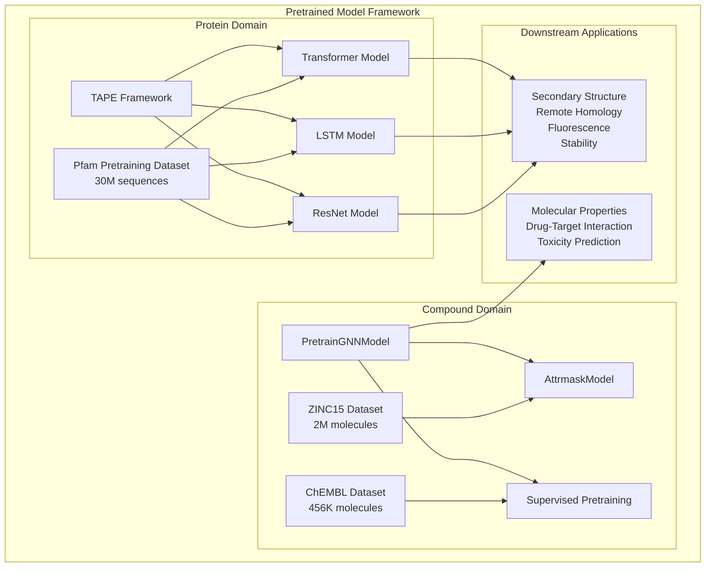
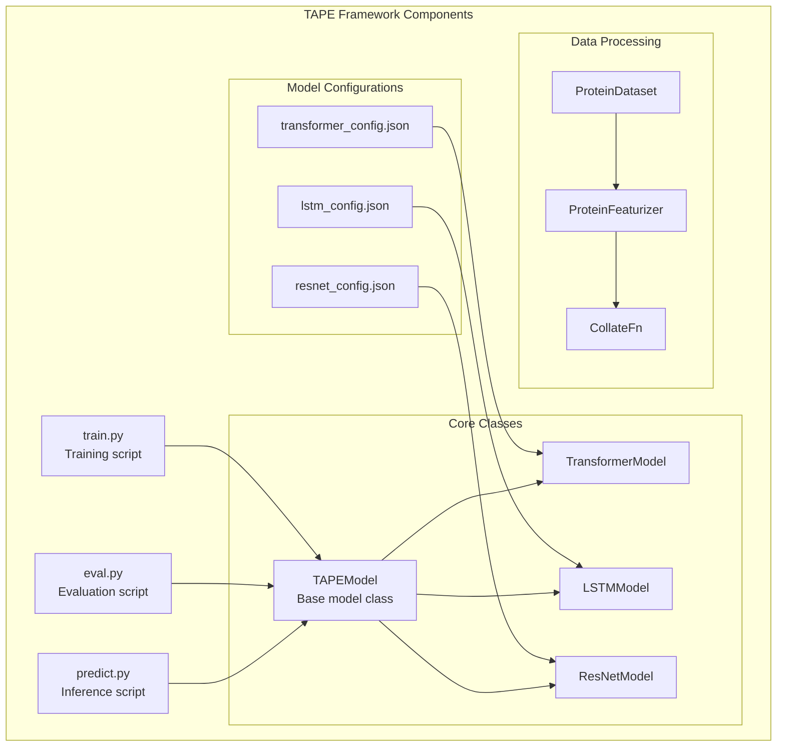
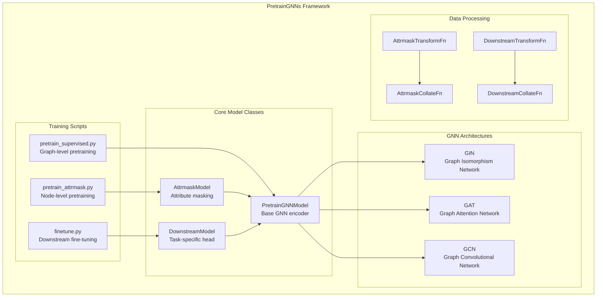
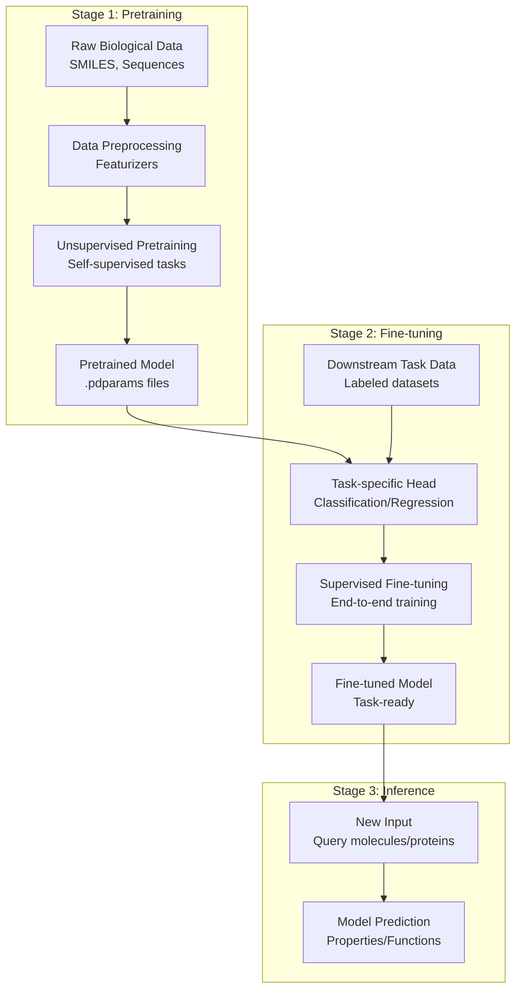

# Pretrained Models

> **Relevant source files**
> * [apps/pretrained_compound/README.md](https://github.com/PaddlePaddle/PaddleHelix/blob/7fdd7a18/apps/pretrained_compound/README.md?plain=1)
> * [apps/pretrained_compound/README_cn.md](https://github.com/PaddlePaddle/PaddleHelix/blob/7fdd7a18/apps/pretrained_compound/README_cn.md?plain=1)
> * [apps/pretrained_compound/pretrain_gnns/README.md](https://github.com/PaddlePaddle/PaddleHelix/blob/7fdd7a18/apps/pretrained_compound/pretrain_gnns/README.md?plain=1)
> * [apps/pretrained_compound/pretrain_gnns/README_cn.md](https://github.com/PaddlePaddle/PaddleHelix/blob/7fdd7a18/apps/pretrained_compound/pretrain_gnns/README_cn.md?plain=1)
> * [apps/pretrained_compound/pretrain_gnns/imgs/Evaluation_results.png](https://github.com/PaddlePaddle/PaddleHelix/blob/7fdd7a18/apps/pretrained_compound/pretrain_gnns/imgs/Evaluation_results.png)
> * [apps/pretrained_compound/pretrain_gnns/imgs/pregnn.png](https://github.com/PaddlePaddle/PaddleHelix/blob/7fdd7a18/apps/pretrained_compound/pretrain_gnns/imgs/pregnn.png)
> * [apps/pretrained_protein/README.md](https://github.com/PaddlePaddle/PaddleHelix/blob/7fdd7a18/apps/pretrained_protein/README.md?plain=1)
> * [apps/pretrained_protein/README_cn.md](https://github.com/PaddlePaddle/PaddleHelix/blob/7fdd7a18/apps/pretrained_protein/README_cn.md?plain=1)
> * [apps/pretrained_protein/tape/README.md](https://github.com/PaddlePaddle/PaddleHelix/blob/7fdd7a18/apps/pretrained_protein/tape/README.md?plain=1)
> * [apps/pretrained_protein/tape/README_cn.md](https://github.com/PaddlePaddle/PaddleHelix/blob/7fdd7a18/apps/pretrained_protein/tape/README_cn.md?plain=1)
> * [tutorials/compound_property_prediction_tutorial.ipynb](https://github.com/PaddlePaddle/PaddleHelix/blob/7fdd7a18/tutorials/compound_property_prediction_tutorial.ipynb)
> * [tutorials/compound_property_prediction_tutorial_cn.ipynb](https://github.com/PaddlePaddle/PaddleHelix/blob/7fdd7a18/tutorials/compound_property_prediction_tutorial_cn.ipynb)

This document provides an overview of pretrained models available in PaddleHelix, covering both protein sequence models and compound graph neural network models. These pretrained models serve as foundation models that can be fine-tuned for downstream biological tasks, enabling transfer learning and improved performance on specialized tasks with limited data.

For detailed information about protein-specific models and tasks, see [Protein Models](/PaddlePaddle/PaddleHelix/4.1-protein-models). For compound representation learning and molecular property prediction, see [Compound Models](/PaddlePaddle/PaddleHelix/4.2-compound-models).

## Overview

PaddleHelix provides pretrained models for two primary biological domains: protein sequences and chemical compounds. Both domains follow a similar paradigm of large-scale unsupervised pretraining followed by task-specific fine-tuning.

### Pretrained Model Architecture

**Sources:** [apps/pretrained_protein/tape/README.md L1-L452](https://github.com/PaddlePaddle/PaddleHelix/blob/7fdd7a18/apps/pretrained_protein/tape/README.md?plain=1#L1-L452)

 [apps/pretrained_compound/pretrain_gnns/README.md L1-L549](https://github.com/PaddlePaddle/PaddleHelix/blob/7fdd7a18/apps/pretrained_compound/pretrain_gnns/README.md?plain=1#L1-L549)

### Available Pretrained Models

| Domain | Model Type | Architecture | Pretraining Dataset | Tasks |
| --- | --- | --- | --- | --- |
| Protein | TAPE Transformer | Transformer | Pfam (30M sequences) | Secondary structure, Remote homology, Fluorescence, Stability |
| Protein | TAPE LSTM | BiLSTM | Pfam (30M sequences) | Secondary structure, Remote homology, Fluorescence, Stability |
| Protein | TAPE ResNet | ResNet | Pfam (30M sequences) | Secondary structure, Remote homology, Fluorescence, Stability |
| Compound | PretrainGNNs | GIN/GAT/GCN | ZINC15 (2M molecules) | Molecular properties, Toxicity, Drug discovery |
| Compound | InfoGraph | GNN | Various datasets | Graph representation learning |

**Sources:** [apps/pretrained_protein/tape/README.md L300-L305](https://github.com/PaddlePaddle/PaddleHelix/blob/7fdd7a18/apps/pretrained_protein/tape/README.md?plain=1#L300-L305)

 [apps/pretrained_compound/pretrain_gnns/README.md L48-L51](https://github.com/PaddlePaddle/PaddleHelix/blob/7fdd7a18/apps/pretrained_compound/pretrain_gnns/README.md?plain=1#L48-L51)

## Code Architecture and Key Components

### Protein Models Code Structure

**Sources:** [apps/pretrained_protein/tape/README.md L47-L89](https://github.com/PaddlePaddle/PaddleHelix/blob/7fdd7a18/apps/pretrained_protein/tape/README.md?plain=1#L47-L89)

 [apps/pretrained_protein/tape/README.md L256-L290](https://github.com/PaddlePaddle/PaddleHelix/blob/7fdd7a18/apps/pretrained_protein/tape/README.md?plain=1#L256-L290)

### Compound Models Code Structure

**Sources:** [apps/pretrained_compound/pretrain_gnns/README.md L67-L131](https://github.com/PaddlePaddle/PaddleHelix/blob/7fdd7a18/apps/pretrained_compound/pretrain_gnns/README.md?plain=1#L67-L131)

 [tutorials/compound_property_prediction_tutorial.ipynb L57-L61](https://github.com/PaddlePaddle/PaddleHelix/blob/7fdd7a18/tutorials/compound_property_prediction_tutorial.ipynb#L57-L61)

## Pretraining and Fine-tuning Workflow

### General Training Pipeline

**Sources:** [tutorials/compound_property_prediction_tutorial.ipynb L11-L261](https://github.com/PaddlePaddle/PaddleHelix/blob/7fdd7a18/tutorials/compound_property_prediction_tutorial.ipynb#L11-L261)

 [apps/pretrained_protein/tape/README.md L245-L253](https://github.com/PaddlePaddle/PaddleHelix/blob/7fdd7a18/apps/pretrained_protein/tape/README.md?plain=1#L245-L253)

### Compound Model Training Example

The compound models follow a two-stage pretraining approach:

1. **Node-level Pretraining** using `AttrmaskModel`: Randomly masks atom types and predicts them based on graph structure
2. **Graph-level Pretraining**: Multi-task supervised learning on molecular properties

Key training components:

* `PretrainGNNModel` - Base GNN encoder supporting GIN, GAT, GCN architectures
* `AttrmaskTransformFn` - Transforms SMILES to graph features with masking
* `AttrmaskCollateFn` - Batches graphs for attribute masking tasks

**Sources:** [apps/pretrained_compound/pretrain_gnns/README.md L189-L236](https://github.com/PaddlePaddle/PaddleHelix/blob/7fdd7a18/apps/pretrained_compound/pretrain_gnns/README.md?plain=1#L189-L236)

 [tutorials/compound_property_prediction_tutorial.ipynb L104-L110](https://github.com/PaddlePaddle/PaddleHelix/blob/7fdd7a18/tutorials/compound_property_prediction_tutorial.ipynb#L104-L110)

### Protein Model Training Example

The protein models use the TAPE framework:

1. **Pretraining** on Pfam dataset (30M protein sequences) with masked language modeling
2. **Fine-tuning** on specific tasks like secondary structure prediction

Key training components:

* Model configuration files (e.g., `transformer_config.json`)
* Training scripts supporting multi-GPU distributed training
* Task-specific evaluation metrics

**Sources:** [apps/pretrained_protein/tape/README.md L143-L290](https://github.com/PaddlePaddle/PaddleHelix/blob/7fdd7a18/apps/pretrained_protein/tape/README.md?plain=1#L143-L290)

## Model Access and Usage

### Available Pretrained Model Downloads

| Model | Download Link | Description |
| --- | --- | --- |
| TAPE Transformer | `baidu-nlp.bj.bcebos.com/.../tape_transformer_pretrain.pdparams` | Transformer pretrained on Pfam |
| TAPE LSTM | `baidu-nlp.bj.bcebos.com/.../tape_lstm_pretrain.pdparams` | BiLSTM pretrained on Pfam |
| TAPE ResNet | `baidu-nlp.bj.bcebos.com/.../tape_resnet_pretrain.pdparam` | ResNet pretrained on Pfam |
| PretrainGNNs | `baidu-nlp.bj.bcebos.com/.../pregnn-attrmask-supervised.zip` | GNN pretrained with attribute masking + supervised |

**Sources:** [apps/pretrained_protein/tape/README.md L301-L304](https://github.com/PaddlePaddle/PaddleHelix/blob/7fdd7a18/apps/pretrained_protein/tape/README.md?plain=1#L301-L304)

 [apps/pretrained_compound/pretrain_gnns/README.md L48-L50](https://github.com/PaddlePaddle/PaddleHelix/blob/7fdd7a18/apps/pretrained_compound/pretrain_gnns/README.md?plain=1#L48-L50)

### Loading and Using Models

Both protein and compound models follow similar loading patterns:

1. **Load model configuration** from JSON files
2. **Initialize model architecture** with configuration parameters
3. **Load pretrained weights** using `paddle.load()`
4. **Fine-tune or perform inference** on downstream tasks

The models integrate with PaddlePaddle's standard training and inference APIs, making them easy to incorporate into custom workflows.

**Sources:** [tutorials/compound_property_prediction_tutorial.ipynb L104-L110](https://github.com/PaddlePaddle/PaddleHelix/blob/7fdd7a18/tutorials/compound_property_prediction_tutorial.ipynb#L104-L110)

 [tutorials/compound_property_prediction_tutorial.ipynb L346-L371](https://github.com/PaddlePaddle/PaddleHelix/blob/7fdd7a18/tutorials/compound_property_prediction_tutorial.ipynb#L346-L371)