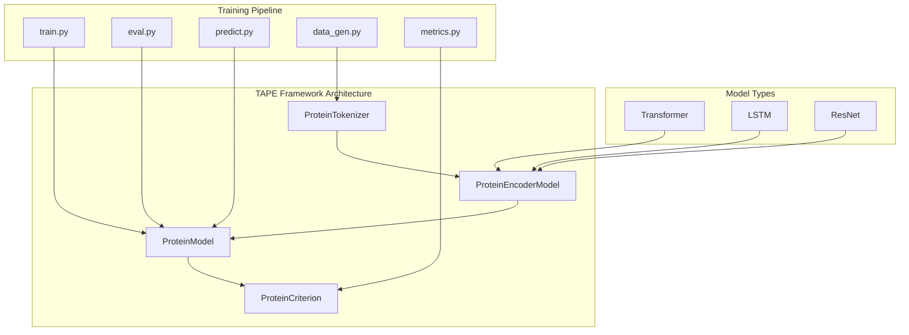
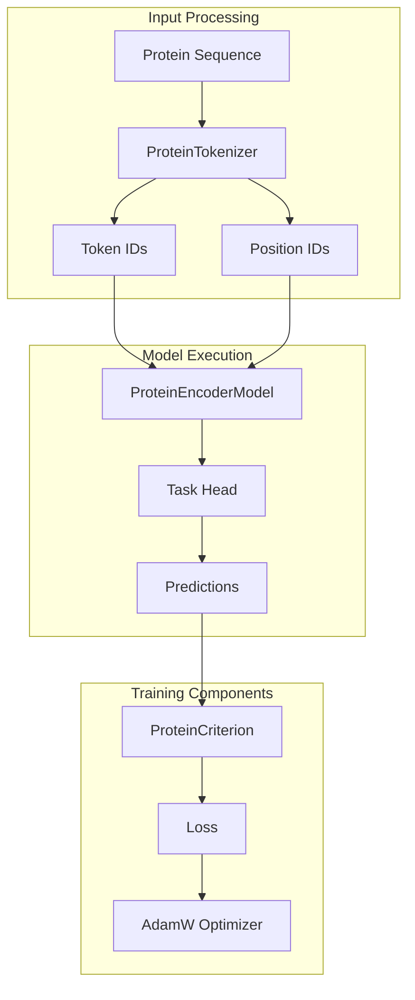
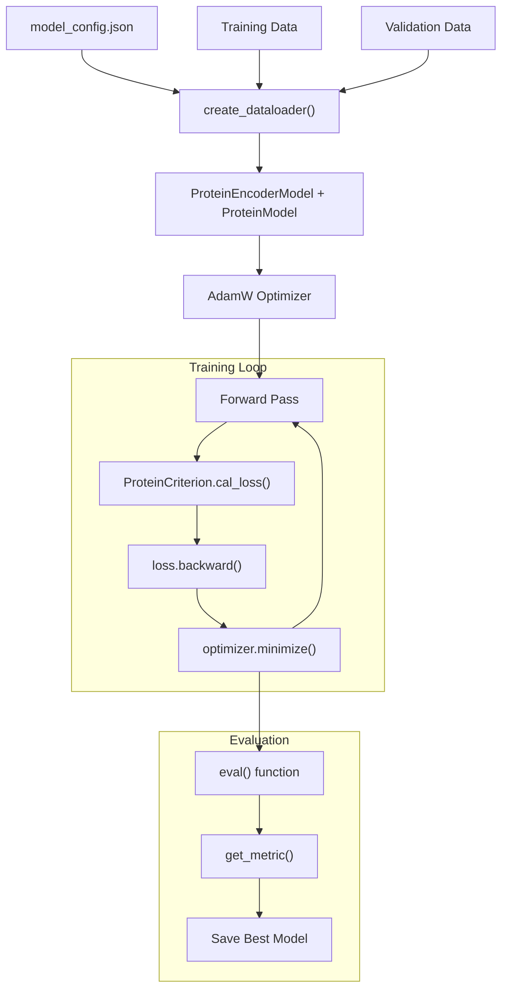
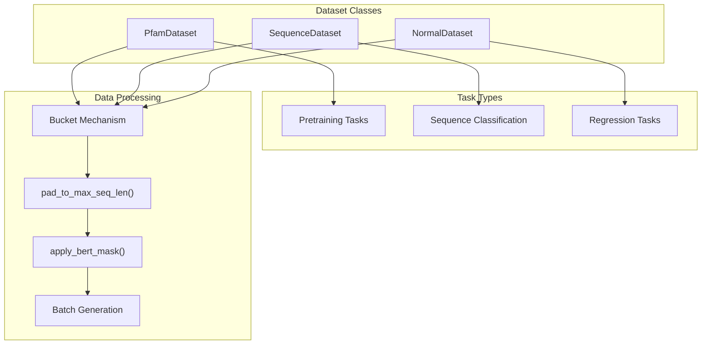

# Protein Models

> **Relevant source files**
> * [apps/pretrained_compound/README.md](https://github.com/PaddlePaddle/PaddleHelix/blob/7fdd7a18/apps/pretrained_compound/README.md?plain=1)
> * [apps/pretrained_compound/README_cn.md](https://github.com/PaddlePaddle/PaddleHelix/blob/7fdd7a18/apps/pretrained_compound/README_cn.md?plain=1)
> * [apps/pretrained_protein/README.md](https://github.com/PaddlePaddle/PaddleHelix/blob/7fdd7a18/apps/pretrained_protein/README.md?plain=1)
> * [apps/pretrained_protein/README_cn.md](https://github.com/PaddlePaddle/PaddleHelix/blob/7fdd7a18/apps/pretrained_protein/README_cn.md?plain=1)
> * [apps/pretrained_protein/tape/README.md](https://github.com/PaddlePaddle/PaddleHelix/blob/7fdd7a18/apps/pretrained_protein/tape/README.md?plain=1)
> * [apps/pretrained_protein/tape/README_cn.md](https://github.com/PaddlePaddle/PaddleHelix/blob/7fdd7a18/apps/pretrained_protein/tape/README_cn.md?plain=1)
> * [apps/pretrained_protein/tape/data_gen.py](https://github.com/PaddlePaddle/PaddleHelix/blob/7fdd7a18/apps/pretrained_protein/tape/data_gen.py)
> * [apps/pretrained_protein/tape/eval.py](https://github.com/PaddlePaddle/PaddleHelix/blob/7fdd7a18/apps/pretrained_protein/tape/eval.py)
> * [apps/pretrained_protein/tape/metrics.py](https://github.com/PaddlePaddle/PaddleHelix/blob/7fdd7a18/apps/pretrained_protein/tape/metrics.py)
> * [apps/pretrained_protein/tape/predict.py](https://github.com/PaddlePaddle/PaddleHelix/blob/7fdd7a18/apps/pretrained_protein/tape/predict.py)
> * [apps/pretrained_protein/tape/train.py](https://github.com/PaddlePaddle/PaddleHelix/blob/7fdd7a18/apps/pretrained_protein/tape/train.py)
> * [tutorials/protein_pretrain_and_property_prediction_tutorial.ipynb](https://github.com/PaddlePaddle/PaddleHelix/blob/7fdd7a18/tutorials/protein_pretrain_and_property_prediction_tutorial.ipynb)
> * [tutorials/protein_pretrain_and_property_prediction_tutorial_cn.ipynb](https://github.com/PaddlePaddle/PaddleHelix/blob/7fdd7a18/tutorials/protein_pretrain_and_property_prediction_tutorial_cn.ipynb)

This document covers the pretrained protein models available in PaddleHelix, focusing on the TAPE (Tasks Assessing Protein Embeddings) framework implementation. These models enable sequence-based protein representation learning through self-supervised pretraining and fine-tuning on downstream tasks. For information about compound representation models, see [Compound Models](/PaddlePaddle/PaddleHelix/4.2-compound-models).

## Overview

The protein models in PaddleHelix implement the TAPE framework, providing pretrained sequence models that can extract meaningful biological representations from protein sequences. The system supports multiple model architectures and enables both pretraining on large unlabeled datasets and fine-tuning on specific downstream tasks.



Sources: [apps/pretrained_protein/tape/README.md L33-L34](https://github.com/PaddlePaddle/PaddleHelix/blob/7fdd7a18/apps/pretrained_protein/tape/README.md?plain=1#L33-L34)

 [apps/pretrained_protein/tape/train.py L16](https://github.com/PaddlePaddle/PaddleHelix/blob/7fdd7a18/apps/pretrained_protein/tape/train.py#L16-L16)

 [pahelix/model_zoo/protein_sequence_model.py](https://github.com/PaddlePaddle/PaddleHelix/blob/7fdd7a18/pahelix/model_zoo/protein_sequence_model.py)

## Model Architecture Components

The protein model system consists of several key components that work together to process protein sequences and generate representations.

### Core Model Classes

The `ProteinEncoderModel` serves as the base encoder that generates contextual representations from protein sequences. The `ProteinModel` wraps the encoder and adds task-specific heads for different downstream applications.



Sources: [apps/pretrained_protein/tape/train.py L76-L77](https://github.com/PaddlePaddle/PaddleHelix/blob/7fdd7a18/apps/pretrained_protein/tape/train.py#L76-L77)

 [apps/pretrained_protein/tape/predict.py L52-L53](https://github.com/PaddlePaddle/PaddleHelix/blob/7fdd7a18/apps/pretrained_protein/tape/predict.py#L52-L53)

### Supported Model Types

The framework supports three different model architectures, each configured through the `model_config` parameter:

| Model Type | Key Parameters | Use Case |
| --- | --- | --- |
| Transformer | `hidden_size`, `layer_num`, `head_num` | Bidirectional context modeling |
| LSTM | `hidden_size`, `layer_num` | Sequential processing |
| ResNet | `hidden_size`, `layer_num`, `filter_num` | Convolutional feature extraction |

Sources: [apps/pretrained_protein/tape/README.md L100-L135](https://github.com/PaddlePaddle/PaddleHelix/blob/7fdd7a18/apps/pretrained_protein/tape/README.md?plain=1#L100-L135)

## Training and Evaluation Workflow

### Training Process

The training pipeline supports both single-GPU and distributed multi-GPU training. The main training loop is implemented in `train.py` with automatic model checkpointing and evaluation.



Sources: [apps/pretrained_protein/tape/train.py L114-L155](https://github.com/PaddlePaddle/PaddleHelix/blob/7fdd7a18/apps/pretrained_protein/tape/train.py#L114-L155)

 [apps/pretrained_protein/tape/train.py L23-L50](https://github.com/PaddlePaddle/PaddleHelix/blob/7fdd7a18/apps/pretrained_protein/tape/train.py#L23-L50)

### Data Processing Pipeline

The data processing system uses bucket-based batching to handle variable-length protein sequences efficiently. Different dataset classes handle different task types.



Sources: [apps/pretrained_protein/tape/data_gen.py L32-L174](https://github.com/PaddlePaddle/PaddleHelix/blob/7fdd7a18/apps/pretrained_protein/tape/data_gen.py#L32-L174)

 [apps/pretrained_protein/tape/data_gen.py L29-L30](https://github.com/PaddlePaddle/PaddleHelix/blob/7fdd7a18/apps/pretrained_protein/tape/data_gen.py#L29-L30)

## Supported Tasks

### Pretraining Tasks

**Pfam**: Large-scale protein family classification using 30 million protein sequences. Uses masked language modeling for self-supervised learning.

Configuration:

```json
{    "task": "pretrain",    "model_type": "transformer"}
```

Sources: [apps/pretrained_protein/tape/README.md L144-L151](https://github.com/PaddlePaddle/PaddleHelix/blob/7fdd7a18/apps/pretrained_protein/tape/README.md?plain=1#L144-L151)

### Downstream Tasks

| Task | Type | Classes | Configuration |
| --- | --- | --- | --- |
| Secondary Structure | Sequence Classification | 3 or 8 | `"task": "seq_classification"` |
| Remote Homology | Classification | 1195 | `"task": "classification"` |
| Fluorescence | Regression | N/A | `"task": "regression"` |
| Stability | Regression | N/A | `"task": "regression"` |

Sources: [apps/pretrained_protein/tape/README.md L154-L242](https://github.com/PaddlePaddle/PaddleHelix/blob/7fdd7a18/apps/pretrained_protein/tape/README.md?plain=1#L154-L242)

### Evaluation Metrics

The system provides task-specific metrics through the `get_metric()` function:

* **PretrainMetric**: Accuracy and perplexity for pretraining tasks
* **ClassificationMetric**: Accuracy for classification tasks
* **RegressionMetric**: MSE and Spearman correlation for regression tasks

Sources: [apps/pretrained_protein/tape/metrics.py L139-L149](https://github.com/PaddlePaddle/PaddleHelix/blob/7fdd7a18/apps/pretrained_protein/tape/metrics.py#L139-L149)

## Usage Examples

### Training a Model

```
python train.py \    --train_data ./train_data \    --valid_data ./valid_data \    --model_config ./transformer_config.json \    --use_cuda \    --lr 0.0001
```

### Model Inference

```
cat protein_sequences.txt | python predict.py \    --model ./trained_model.pdparams \    --model_config ./config.json \    --use_cuda
```

Sources: [apps/pretrained_protein/tape/README.md L47-L87](https://github.com/PaddlePaddle/PaddleHelix/blob/7fdd7a18/apps/pretrained_protein/tape/README.md?plain=1#L47-L87)

## Integration with PaddleHelix

The protein models integrate with the broader PaddleHelix ecosystem through:

* **Model Zoo**: `pahelix.model_zoo.protein_sequence_model` provides the core model classes
* **Utilities**: `pahelix.utils.protein_tools.ProteinTokenizer` handles sequence tokenization
* **Language Model Tools**: `pahelix.utils.language_model_tools.apply_bert_mask` for pretraining

The models can be loaded and used in downstream applications or fine-tuned for specific tasks within the PaddleHelix framework.

Sources: [apps/pretrained_protein/tape/train.py L16-L17](https://github.com/PaddlePaddle/PaddleHelix/blob/7fdd7a18/apps/pretrained_protein/tape/train.py#L16-L17)

 [apps/pretrained_protein/tape/data_gen.py L25-L26](https://github.com/PaddlePaddle/PaddleHelix/blob/7fdd7a18/apps/pretrained_protein/tape/data_gen.py#L25-L26)