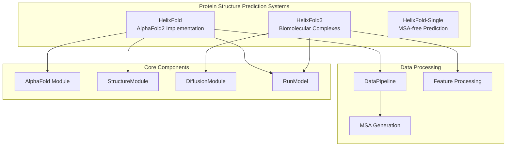
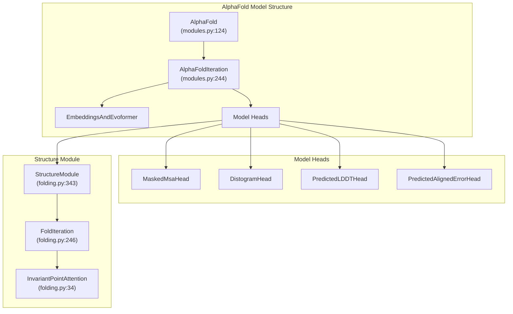
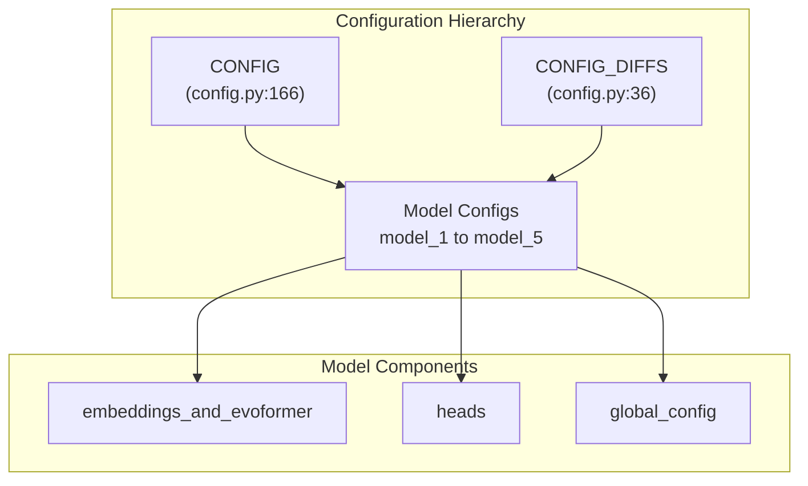
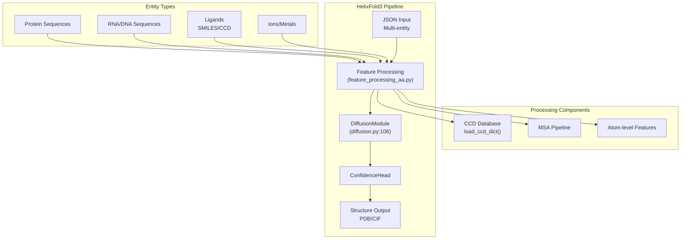
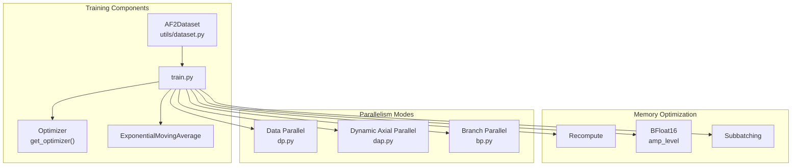
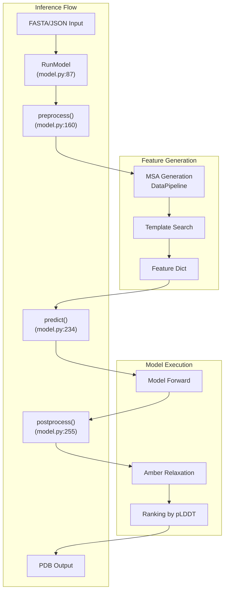

# Protein Structure Prediction

> **Relevant source files**
> * [apps/protein_folding/helixfold-single/alphafold_paddle/model/folding.py](https://github.com/PaddlePaddle/PaddleHelix/blob/7fdd7a18/apps/protein_folding/helixfold-single/alphafold_paddle/model/folding.py)
> * [apps/protein_folding/helixfold/README.md](https://github.com/PaddlePaddle/PaddleHelix/blob/7fdd7a18/apps/protein_folding/helixfold/README.md?plain=1)
> * [apps/protein_folding/helixfold/README_inference.md](https://github.com/PaddlePaddle/PaddleHelix/blob/7fdd7a18/apps/protein_folding/helixfold/README_inference.md?plain=1)
> * [apps/protein_folding/helixfold/README_train.md](https://github.com/PaddlePaddle/PaddleHelix/blob/7fdd7a18/apps/protein_folding/helixfold/README_train.md?plain=1)
> * [apps/protein_folding/helixfold/alphafold_paddle/model/config.py](https://github.com/PaddlePaddle/PaddleHelix/blob/7fdd7a18/apps/protein_folding/helixfold/alphafold_paddle/model/config.py)
> * [apps/protein_folding/helixfold/alphafold_paddle/model/folding.py](https://github.com/PaddlePaddle/PaddleHelix/blob/7fdd7a18/apps/protein_folding/helixfold/alphafold_paddle/model/folding.py)
> * [apps/protein_folding/helixfold/alphafold_paddle/model/model.py](https://github.com/PaddlePaddle/PaddleHelix/blob/7fdd7a18/apps/protein_folding/helixfold/alphafold_paddle/model/model.py)
> * [apps/protein_folding/helixfold/alphafold_paddle/model/modules.py](https://github.com/PaddlePaddle/PaddleHelix/blob/7fdd7a18/apps/protein_folding/helixfold/alphafold_paddle/model/modules.py)
> * [apps/protein_folding/helixfold/gpu_infer.sh](https://github.com/PaddlePaddle/PaddleHelix/blob/7fdd7a18/apps/protein_folding/helixfold/gpu_infer.sh)
> * [apps/protein_folding/helixfold/gpu_infer_long.sh](https://github.com/PaddlePaddle/PaddleHelix/blob/7fdd7a18/apps/protein_folding/helixfold/gpu_infer_long.sh)
> * [apps/protein_folding/helixfold/gpu_train.sh](https://github.com/PaddlePaddle/PaddleHelix/blob/7fdd7a18/apps/protein_folding/helixfold/gpu_train.sh)
> * [apps/protein_folding/helixfold/requirements.txt](https://github.com/PaddlePaddle/PaddleHelix/blob/7fdd7a18/apps/protein_folding/helixfold/requirements.txt)
> * [apps/protein_folding/helixfold/run_helixfold.py](https://github.com/PaddlePaddle/PaddleHelix/blob/7fdd7a18/apps/protein_folding/helixfold/run_helixfold.py)
> * [apps/protein_folding/helixfold/setup_env](https://github.com/PaddlePaddle/PaddleHelix/blob/7fdd7a18/apps/protein_folding/helixfold/setup_env)
> * [apps/protein_folding/helixfold/train.py](https://github.com/PaddlePaddle/PaddleHelix/blob/7fdd7a18/apps/protein_folding/helixfold/train.py)
> * [apps/protein_folding/helixfold/utils/exponential_moving_average.py](https://github.com/PaddlePaddle/PaddleHelix/blob/7fdd7a18/apps/protein_folding/helixfold/utils/exponential_moving_average.py)
> * [apps/protein_folding/helixfold/utils/utils.py](https://github.com/PaddlePaddle/PaddleHelix/blob/7fdd7a18/apps/protein_folding/helixfold/utils/utils.py)
> * [apps/protein_folding/helixfold3/README.md](https://github.com/PaddlePaddle/PaddleHelix/blob/7fdd7a18/apps/protein_folding/helixfold3/README.md?plain=1)
> * [apps/protein_folding/helixfold3/helixfold/model/config.py](https://github.com/PaddlePaddle/PaddleHelix/blob/7fdd7a18/apps/protein_folding/helixfold3/helixfold/model/config.py)
> * [apps/protein_folding/helixfold3/helixfold/model/diffusion.py](https://github.com/PaddlePaddle/PaddleHelix/blob/7fdd7a18/apps/protein_folding/helixfold3/helixfold/model/diffusion.py)
> * [apps/protein_folding/helixfold3/infer_scripts/feature_processing_aa.py](https://github.com/PaddlePaddle/PaddleHelix/blob/7fdd7a18/apps/protein_folding/helixfold3/infer_scripts/feature_processing_aa.py)
> * [apps/protein_folding/helixfold3/infer_scripts/tools/mmcif_writer.py](https://github.com/PaddlePaddle/PaddleHelix/blob/7fdd7a18/apps/protein_folding/helixfold3/infer_scripts/tools/mmcif_writer.py)
> * [apps/protein_folding/helixfold3/inference.py](https://github.com/PaddlePaddle/PaddleHelix/blob/7fdd7a18/apps/protein_folding/helixfold3/inference.py)
> * [apps/protein_folding/helixfold3/run_infer.sh](https://github.com/PaddlePaddle/PaddleHelix/blob/7fdd7a18/apps/protein_folding/helixfold3/run_infer.sh)

## Purpose and Scope

This document covers PaddleHelix's protein structure prediction capabilities, primarily the HelixFold series of models. These systems predict 3D protein structures from sequence data using deep learning approaches based on AlphaFold architectures.

The content includes the core HelixFold (AlphaFold2 implementation), HelixFold3 (biomolecular complex prediction), and related geometric algorithms. For drug-target interaction prediction, see [Drug-Target Interaction](/PaddlePaddle/PaddleHelix/3.2.2-drug-target-interaction). For general molecular property prediction, see [Compound Representation Learning](/PaddlePaddle/PaddleHelix/3.2.1-compound-representation-learning).

## System Overview

PaddleHelix provides three main protein structure prediction systems:



**HelixFold Architecture and Implementation**

Sources: [apps/protein_folding/helixfold/README.md L1-L63](https://github.com/PaddlePaddle/PaddleHelix/blob/7fdd7a18/apps/protein_folding/helixfold/README.md?plain=1#L1-L63)

 [apps/protein_folding/helixfold/alphafold_paddle/model/modules.py L124-L242](https://github.com/PaddlePaddle/PaddleHelix/blob/7fdd7a18/apps/protein_folding/helixfold/alphafold_paddle/model/modules.py#L124-L242)

## HelixFold Core Architecture

HelixFold implements the complete AlphaFold2 pipeline with significant performance optimizations. The system is built around the `AlphaFold` and `AlphaFoldIteration` classes.



**HelixFold Core Model Components**

The `AlphaFold` class [apps/protein_folding/helixfold/alphafold_paddle/model/modules.py L124-L242](https://github.com/PaddlePaddle/PaddleHelix/blob/7fdd7a18/apps/protein_folding/helixfold/alphafold_paddle/model/modules.py#L124-L242)

 manages recycling iterations, while `AlphaFoldIteration` [apps/protein_folding/helixfold/alphafold_paddle/model/modules.py L244-L424](https://github.com/PaddlePaddle/PaddleHelix/blob/7fdd7a18/apps/protein_folding/helixfold/alphafold_paddle/model/modules.py#L244-L424)

 handles the main forward pass through the Evoformer and prediction heads.

Sources: [apps/protein_folding/helixfold/alphafold_paddle/model/modules.py L124-L424](https://github.com/PaddlePaddle/PaddleHelix/blob/7fdd7a18/apps/protein_folding/helixfold/alphafold_paddle/model/modules.py#L124-L424)

 [apps/protein_folding/helixfold/alphafold_paddle/model/folding.py L343-L469](https://github.com/PaddlePaddle/PaddleHelix/blob/7fdd7a18/apps/protein_folding/helixfold/alphafold_paddle/model/folding.py#L343-L469)

### Model Configuration System

HelixFold uses a hierarchical configuration system through `model_config()` function:

| Model Name | Purpose | Key Settings |
| --- | --- | --- |
| `model_1` | Template-based | `use_templates: True`, `max_extra_msa: 5120` |
| `model_2` | Template-based | `use_templates: True`, standard MSA |
| `model_3` | MSA-only | `max_extra_msa: 5120` |
| `model_4` | MSA-only | `max_extra_msa: 5120` |
| `model_5` | Production | `subbatch_size: 48`, optimized memory |



**Model Configuration and Variants**

Sources: [apps/protein_folding/helixfold/alphafold_paddle/model/config.py L27-L165](https://github.com/PaddlePaddle/PaddleHelix/blob/7fdd7a18/apps/protein_folding/helixfold/alphafold_paddle/model/config.py#L27-L165)

## HelixFold3 Advanced Architecture

HelixFold3 extends beyond proteins to predict structures of biomolecular complexes including nucleic acids and ligands using diffusion-based approaches.



**HelixFold3 Multi-Entity Processing**

The `DiffusionModule` [apps/protein_folding/helixfold3/helixfold/model/diffusion.py L106-L566](https://github.com/PaddlePaddle/PaddleHelix/blob/7fdd7a18/apps/protein_folding/helixfold3/helixfold/model/diffusion.py#L106-L566)

 is the core prediction engine, while feature processing handles multiple entity types through `get_inference_restype_mask()` [apps/protein_folding/helixfold3/infer_scripts/feature_processing_aa.py L173-L271](https://github.com/PaddlePaddle/PaddleHelix/blob/7fdd7a18/apps/protein_folding/helixfold3/infer_scripts/feature_processing_aa.py#L173-L271)

Sources: [apps/protein_folding/helixfold3/helixfold/model/diffusion.py L106-L566](https://github.com/PaddlePaddle/PaddleHelix/blob/7fdd7a18/apps/protein_folding/helixfold3/helixfold/model/diffusion.py#L106-L566)

 [apps/protein_folding/helixfold3/infer_scripts/feature_processing_aa.py L37-L171](https://github.com/PaddlePaddle/PaddleHelix/blob/7fdd7a18/apps/protein_folding/helixfold3/infer_scripts/feature_processing_aa.py#L37-L171)

## Training and Inference Workflows

### HelixFold Training Pipeline



**Training Infrastructure and Optimizations**

The training system [apps/protein_folding/helixfold/train.py L226-L546](https://github.com/PaddlePaddle/PaddleHelix/blob/7fdd7a18/apps/protein_folding/helixfold/train.py#L226-L546)

 supports multiple parallelism strategies and memory optimizations to handle large protein sequences efficiently.

Sources: [apps/protein_folding/helixfold/train.py L226-L546](https://github.com/PaddlePaddle/PaddleHelix/blob/7fdd7a18/apps/protein_folding/helixfold/train.py#L226-L546)

 [apps/protein_folding/helixfold/gpu_train.sh L31-L311](https://github.com/PaddlePaddle/PaddleHelix/blob/7fdd7a18/apps/protein_folding/helixfold/gpu_train.sh#L31-L311)

### Inference Pipeline

Both HelixFold and HelixFold3 use the `RunModel` wrapper class for inference:



**Inference Execution Pipeline**

The `RunModel.predict()` method [apps/protein_folding/helixfold/alphafold_paddle/model/model.py L234-L253](https://github.com/PaddlePaddle/PaddleHelix/blob/7fdd7a18/apps/protein_folding/helixfold/alphafold_paddle/model/model.py#L234-L253)

 handles the core prediction logic, while preprocessing [apps/protein_folding/helixfold/alphafold_paddle/model/model.py L160-L232](https://github.com/PaddlePaddle/PaddleHelix/blob/7fdd7a18/apps/protein_folding/helixfold/alphafold_paddle/model/model.py#L160-L232)

 manages feature generation and tensor conversion.

Sources: [apps/protein_folding/helixfold/alphafold_paddle/model/model.py L87-L277](https://github.com/PaddlePaddle/PaddleHelix/blob/7fdd7a18/apps/protein_folding/helixfold/alphafold_paddle/model/model.py#L87-L277)

 [apps/protein_folding/helixfold/run_helixfold.py L52-L173](https://github.com/PaddlePaddle/PaddleHelix/blob/7fdd7a18/apps/protein_folding/helixfold/run_helixfold.py#L52-L173)

## Key Technical Optimizations

### Performance Enhancements

HelixFold achieves 3x training speedup through several optimizations:

* **Operator Fusion**: `fused_gate_attention` combines multiple attention operations
* **Branch Parallelism**: Distributes computation branches across devices during initial training
* **Dynamic Axial Parallelism**: Optimizes memory usage for long sequences
* **Memory Optimizations**: BFloat16 precision, recompute, and subbatching

### Ultra-Long Sequence Support

The system supports proteins up to 6600+ amino acids through:

* `enable_low_memory` flag in model configuration
* Distributed inference with `dap_degree > 1`
* Reduced `subbatch_size` for memory management
* Unified memory allocation options

Sources: [apps/protein_folding/helixfold/README.md L17-L25](https://github.com/PaddlePaddle/PaddleHelix/blob/7fdd7a18/apps/protein_folding/helixfold/README.md?plain=1#L17-L25)

 [apps/protein_folding/helixfold/gpu_infer_long.sh L53-L101](https://github.com/PaddlePaddle/PaddleHelix/blob/7fdd7a18/apps/protein_folding/helixfold/gpu_infer_long.sh#L53-L101)

## Usage Examples

### Basic Inference

```markdown
# HelixFold single protein predictionpython run_helixfold.py \  --fasta_paths=protein.fasta \  --data_dir=/path/to/databases \  --model_names=model_5 \  --output_dir=./output
```

### HelixFold3 Multi-Entity Prediction

```markdown
# HelixFold3 complex predictionpython inference.py \  --input_json=complex.json \  --output_dir=./output \  --model_name=allatom_demo \  --init_model=./init_models/checkpoints.pdparams
```

The JSON input format supports multiple entity types with specified counts and sequences/identifiers.

Sources: [apps/protein_folding/helixfold/README_inference.md L54-L122](https://github.com/PaddlePaddle/PaddleHelix/blob/7fdd7a18/apps/protein_folding/helixfold/README_inference.md?plain=1#L54-L122)

 [apps/protein_folding/helixfold3/run_infer.sh L10-L39](https://github.com/PaddlePaddle/PaddleHelix/blob/7fdd7a18/apps/protein_folding/helixfold3/run_infer.sh#L10-L39)