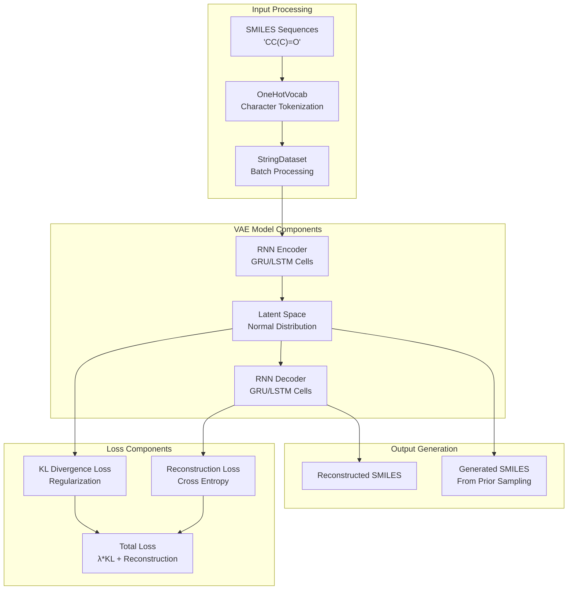
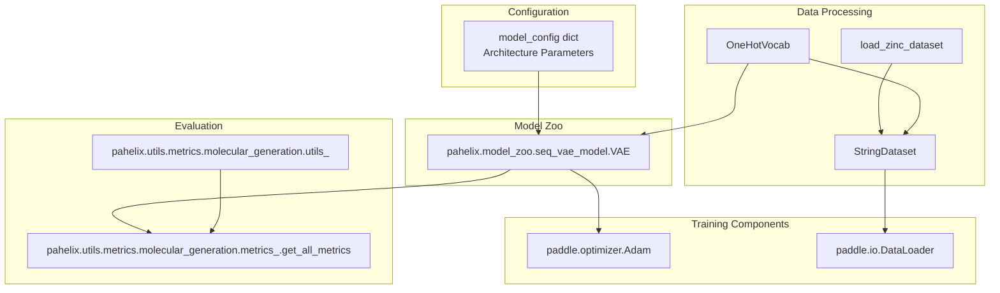
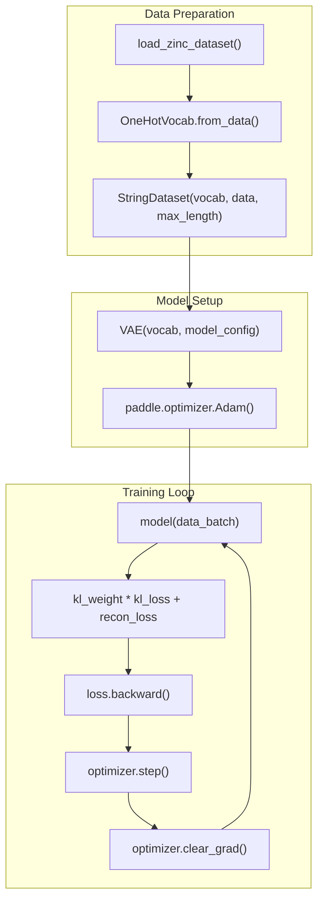
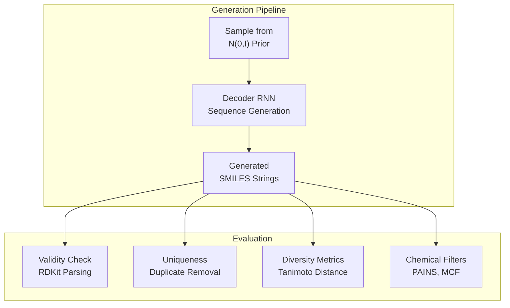

# Sequence VAE

> **Relevant source files**
> * [pahelix/utils/metrics/molecular_generation/utils_.py](https://github.com/PaddlePaddle/PaddleHelix/blob/7fdd7a18/pahelix/utils/metrics/molecular_generation/utils_.py)
> * [tutorials/figures/moltrans_model.png](https://github.com/PaddlePaddle/PaddleHelix/blob/7fdd7a18/tutorials/figures/moltrans_model.png)
> * [tutorials/figures/seq_VAE.png](https://github.com/PaddlePaddle/PaddleHelix/blob/7fdd7a18/tutorials/figures/seq_VAE.png)
> * [tutorials/molecular_generation_tutorial.ipynb](https://github.com/PaddlePaddle/PaddleHelix/blob/7fdd7a18/tutorials/molecular_generation_tutorial.ipynb)
> * [tutorials/molecular_generation_tutorial_cn.ipynb](https://github.com/PaddlePaddle/PaddleHelix/blob/7fdd7a18/tutorials/molecular_generation_tutorial_cn.ipynb)

This document covers the Sequence Variational Autoencoder (VAE) implementation in PaddleHelix for generating molecular SMILES sequences. The Sequence VAE uses an encoder-decoder architecture to learn a continuous latent representation of molecular structures and can generate novel molecules by sampling from this learned distribution.

For information about the Junction Tree VAE approach to molecular generation, see [JT-VAE](/PaddlePaddle/PaddleHelix/3.4.1-jt-vae). For broader molecular generation concepts and other generative models, see [Molecular Generation](/PaddlePaddle/PaddleHelix/3.4-molecular-generation).

## Architecture Overview

The Sequence VAE operates on SMILES string representations of molecules, using recurrent neural networks to encode sequences into a latent space and decode them back to molecular sequences.

### System Architecture



Sources: [tutorials/molecular_generation_tutorial.ipynb L32-L38](https://github.com/PaddlePaddle/PaddleHelix/blob/7fdd7a18/tutorials/molecular_generation_tutorial.ipynb#L32-L38)

 [tutorials/molecular_generation_tutorial.ipynb L269-L270](https://github.com/PaddlePaddle/PaddleHelix/blob/7fdd7a18/tutorials/molecular_generation_tutorial.ipynb#L269-L270)

### Code Entity Relationships



Sources: [tutorials/molecular_generation_tutorial.ipynb L73-L76](https://github.com/PaddlePaddle/PaddleHelix/blob/7fdd7a18/tutorials/molecular_generation_tutorial.ipynb#L73-L76)

 [tutorials/molecular_generation_tutorial.ipynb L269-L270](https://github.com/PaddlePaddle/PaddleHelix/blob/7fdd7a18/tutorials/molecular_generation_tutorial.ipynb#L269-L270)

 [tutorials/molecular_generation_tutorial.ipynb L395](https://github.com/PaddlePaddle/PaddleHelix/blob/7fdd7a18/tutorials/molecular_generation_tutorial.ipynb#L395-L395)

## Model Components

### VAE Architecture Configuration

The `VAE` class accepts a configuration dictionary specifying the encoder and decoder architectures:

| Parameter | Description | Default Range |
| --- | --- | --- |
| `max_length` | Maximum sequence length | 80 |
| `q_cell` | Encoder RNN cell type | "gru" or "lstm" |
| `q_bidir` | Bidirectional encoder | 0 or 1 |
| `q_d_h` | Encoder hidden size | 256 |
| `q_n_layers` | Encoder layers | 1 |
| `q_dropout` | Encoder dropout rate | 0.5 |
| `d_cell` | Decoder RNN cell type | "gru" or "lstm" |
| `d_n_layers` | Decoder layers | 3 |
| `d_dropout` | Decoder dropout rate | 0.2 |
| `d_z` | Latent space dimensionality | 128 |
| `d_d_h` | Decoder hidden size | 512 |
| `freeze_embeddings` | Freeze embedding layer | 0 or 1 |

Sources: [tutorials/molecular_generation_tutorial.ipynb L234-L250](https://github.com/PaddlePaddle/PaddleHelix/blob/7fdd7a18/tutorials/molecular_generation_tutorial.ipynb#L234-L250)

### Vocabulary Management

The `OneHotVocab` class handles character-level tokenization of SMILES strings:

```
vocab = OneHotVocab.from_data(train_data)
```

This creates a vocabulary from the training dataset, mapping each unique character in the SMILES strings to an index for one-hot encoding.

Sources: [tutorials/molecular_generation_tutorial.ipynb L208](https://github.com/PaddlePaddle/PaddleHelix/blob/7fdd7a18/tutorials/molecular_generation_tutorial.ipynb#L208-L208)

## Training Process

### Training Workflow



Sources: [tutorials/molecular_generation_tutorial.ipynb L288-L301](https://github.com/PaddlePaddle/PaddleHelix/blob/7fdd7a18/tutorials/molecular_generation_tutorial.ipynb#L288-L301)

 [tutorials/molecular_generation_tutorial.ipynb L337-L367](https://github.com/PaddlePaddle/PaddleHelix/blob/7fdd7a18/tutorials/molecular_generation_tutorial.ipynb#L337-L367)

### Loss Function

The model optimizes a weighted combination of two loss components:

1. **KL Divergence Loss**: Regularizes the latent space to follow a standard normal distribution
2. **Reconstruction Loss**: Cross-entropy loss between input and reconstructed sequences

```
loss = kl_weight * kl_loss + recon_loss
```

The `kl_weight` parameter controls the balance between reconstruction quality and latent space regularization.

Sources: [tutorials/molecular_generation_tutorial.ipynb L348-L349](https://github.com/PaddlePaddle/PaddleHelix/blob/7fdd7a18/tutorials/molecular_generation_tutorial.ipynb#L348-L349)

## Inference and Sampling

### Molecular Generation

The trained VAE can generate new molecules through sampling from the learned latent distribution:

```
current_samples = model.sample(N_samples, max_len)
```

This method:

1. Samples random vectors from the standard normal distribution
2. Passes them through the decoder to generate SMILES sequences
3. Returns a list of generated molecular strings

Sources: [tutorials/molecular_generation_tutorial.ipynb L398](https://github.com/PaddlePaddle/PaddleHelix/blob/7fdd7a18/tutorials/molecular_generation_tutorial.ipynb#L398-L398)

### Sampling Process



Sources: [tutorials/molecular_generation_tutorial.ipynb L395-L401](https://github.com/PaddlePaddle/PaddleHelix/blob/7fdd7a18/tutorials/molecular_generation_tutorial.ipynb#L395-L401)

## Evaluation Metrics

The generated molecules are evaluated using several metrics implemented in the molecular generation utilities:

### Quality Metrics

| Metric | Description | Implementation |
| --- | --- | --- |
| `valid` | Fraction of valid SMILES | RDKit parsing success |
| `unique@k` | Uniqueness at top-k | Duplicate detection |
| `IntDiv` | Internal diversity | Tanimoto distance |
| `IntDiv2` | Alternative diversity | Scaffold diversity |
| `Filters` | Chemical filter pass rate | PAINS/MCF filtering |

### Evaluation Functions

The `get_all_metrics` function from `pahelix.utils.metrics.molecular_generation.metrics_` provides comprehensive evaluation:

```
metrics = get_all_metrics(gen=current_samples, k=[3])
```

Sources: [tutorials/molecular_generation_tutorial.ipynb L400-L401](https://github.com/PaddlePaddle/PaddleHelix/blob/7fdd7a18/tutorials/molecular_generation_tutorial.ipynb#L400-L401)

 [pahelix/utils/metrics/molecular_generation/utils_.py L310-L341](https://github.com/PaddlePaddle/PaddleHelix/blob/7fdd7a18/pahelix/utils/metrics/molecular_generation/utils_.py#L310-L341)

### Chemical Filtering

The utility functions include molecular filtering based on:

* **PAINS (Pan Assay Interference Compounds)**: Removes problematic structures
* **MCF (Medicinal Chemistry Filters)**: Applies drug-like filters
* **Atom restrictions**: Limits to common chemical elements
* **Ring size constraints**: Filters large ring systems

Sources: [pahelix/utils/metrics/molecular_generation/utils_.py L38-L44](https://github.com/PaddlePaddle/PaddleHelix/blob/7fdd7a18/pahelix/utils/metrics/molecular_generation/utils_.py#L38-L44)

 [pahelix/utils/metrics/molecular_generation/utils_.py L310-L341](https://github.com/PaddlePaddle/PaddleHelix/blob/7fdd7a18/pahelix/utils/metrics/molecular_generation/utils_.py#L310-L341)

## Usage Example

A typical workflow for training and using the Sequence VAE:

```sql
# Load data and create vocabularytrain_data = load_zinc_dataset(data_path)vocab = OneHotVocab.from_data(train_data) # Configure model architecturemodel_config = {    "max_length": 80,    "q_cell": "gru",    "q_d_h": 256,    "d_z": 128,    "d_d_h": 512} # Initialize model and optimizermodel = VAE(vocab, model_config)optimizer = paddle.optimizer.Adam(parameters=model.parameters()) # Training loopfor epoch in range(n_epochs):    for batch_id, data in enumerate(train_dataloader):        kl_loss, recon_loss = model(data)        loss = kl_weight * kl_loss + recon_loss        loss.backward()        optimizer.step()        optimizer.clear_grad() # Generate new moleculessamples = model.sample(1000, max_len=80)metrics = get_all_metrics(gen=samples, k=[3])
```

Sources: [tutorials/molecular_generation_tutorial.ipynb L135-L401](https://github.com/PaddlePaddle/PaddleHelix/blob/7fdd7a18/tutorials/molecular_generation_tutorial.ipynb#L135-L401)