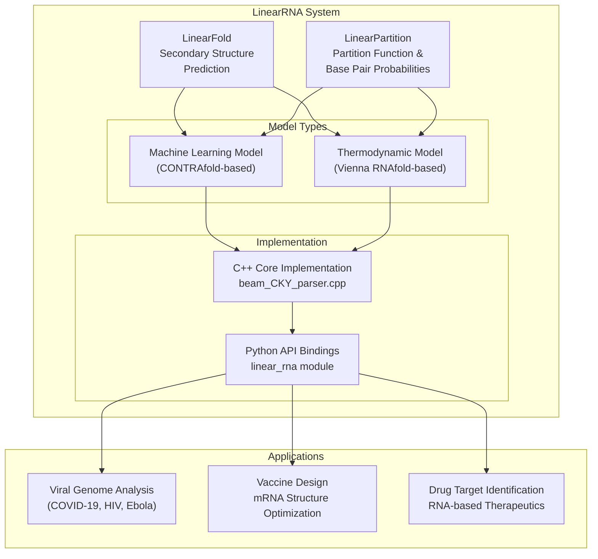
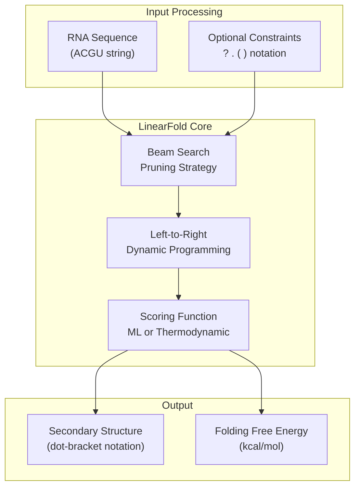
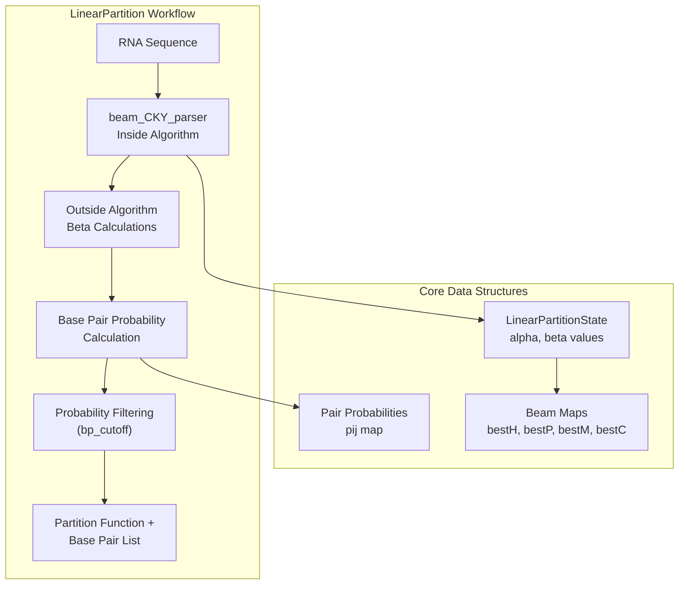
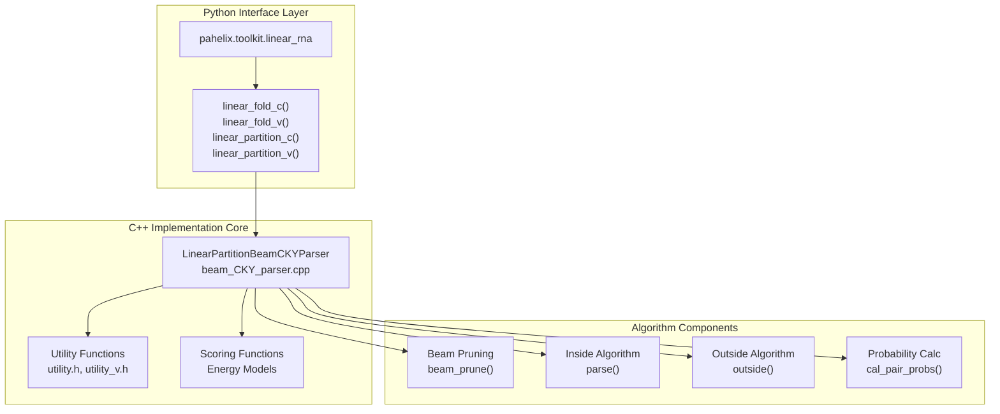

# Vaccine Design

> **Relevant source files**
> * [c/pahelix/toolkit/linear_rna/README.md](https://github.com/PaddlePaddle/PaddleHelix/blob/7fdd7a18/c/pahelix/toolkit/linear_rna/README.md?plain=1)
> * [c/pahelix/toolkit/linear_rna/README_cn.md](https://github.com/PaddlePaddle/PaddleHelix/blob/7fdd7a18/c/pahelix/toolkit/linear_rna/README_cn.md?plain=1)
> * [c/pahelix/toolkit/linear_rna/linear_rna/linear_partition/beam_CKY_parser.cpp](https://github.com/PaddlePaddle/PaddleHelix/blob/7fdd7a18/c/pahelix/toolkit/linear_rna/linear_rna/linear_partition/beam_CKY_parser.cpp)
> * [tutorials/linearrna_tutorial.ipynb](https://github.com/PaddlePaddle/PaddleHelix/blob/7fdd7a18/tutorials/linearrna_tutorial.ipynb)
> * [tutorials/linearrna_tutorial_cn.ipynb](https://github.com/PaddlePaddle/PaddleHelix/blob/7fdd7a18/tutorials/linearrna_tutorial_cn.ipynb)

This section covers PaddleHelix's RNA structure prediction capabilities for vaccine design applications. The primary focus is on the LinearRNA system, which provides linear-time algorithms for analyzing RNA secondary structures - a critical component in understanding viral genomes and designing effective vaccines.

For protein structure prediction applications, see [Protein Structure Prediction](/PaddlePaddle/PaddleHelix/3.1-protein-structure-prediction). For molecular generation approaches, see [Molecular Generation](/PaddlePaddle/PaddleHelix/3.4-molecular-generation).

## Overview

The vaccine design module centers around the LinearRNA system, which implements breakthrough linear-time algorithms for RNA structure analysis. Traditional RNA folding algorithms scale cubically with sequence length, making analysis of long viral genomes computationally expensive. LinearRNA addresses this limitation through two core algorithms:

* **LinearFold**: Linear-time RNA secondary structure prediction
* **LinearPartition**: Linear-time partition function and base pair probability calculation



Sources: [c/pahelix/toolkit/linear_rna/README_cn.md L33-L41](https://github.com/PaddlePaddle/PaddleHelix/blob/7fdd7a18/c/pahelix/toolkit/linear_rna/README_cn.md?plain=1#L33-L41)

 [c/pahelix/toolkit/linear_rna/README.md L31-L39](https://github.com/PaddlePaddle/PaddleHelix/blob/7fdd7a18/c/pahelix/toolkit/linear_rna/README.md?plain=1#L31-L39)

## LinearFold Algorithm

LinearFold revolutionizes RNA secondary structure prediction by changing the traditional bottom-up dynamic programming approach to a left-to-right method with beam pruning. This reduces time complexity from O(n³) to O(n), enabling analysis of extremely long RNA sequences such as viral genomes.

### Algorithm Architecture



Sources: [c/pahelix/toolkit/linear_rna/README_cn.md L35-L38](https://github.com/PaddlePaddle/PaddleHelix/blob/7fdd7a18/c/pahelix/toolkit/linear_rna/README_cn.md?plain=1#L35-L38)

 [tutorials/linearrna_tutorial.ipynb L54-L57](https://github.com/PaddlePaddle/PaddleHelix/blob/7fdd7a18/tutorials/linearrna_tutorial.ipynb#L54-L57)

### API Functions

The LinearFold implementation provides two main functions corresponding to different scoring models:

| Function | Model Type | Description |
| --- | --- | --- |
| `linear_fold_c()` | Machine Learning | Uses CONTRAfold-based conditional random field model |
| `linear_fold_v()` | Thermodynamic | Uses Vienna RNAfold thermodynamic parameters |

#### Parameters

| Parameter | Type | Default | Description |
| --- | --- | --- | --- |
| `rna_sequence` | string | - | Input RNA sequence (ACGU) |
| `beam_size` | int | 100 | Beam pruning size (0 = no pruning) |
| `use_constraints` | bool | False | Enable structural constraints |
| `constraint` | string | "" | Constraint string (? . ( ) notation) |
| `no_sharp_turn` | bool | True | Disable sharp turns in hairpins |

#### Usage Example

```javascript
import pahelix.toolkit.linear_rna as linear_rna # Basic secondary structure predictionsequence = "GGGCUCGUAGAUCAGCGGUAGAUCGCUUCCUUCGCAAGGAAGCCCUGGGUUCAAAUCCCAGCGAGUCCACCA"structure, energy = linear_rna.linear_fold_c(sequence) # With constraintsconstraint = "??(???(??????)?(????????)???(??????(???????)?)???????????)??.???????????"constrained_structure, constrained_energy = linear_rna.linear_fold_c(    sequence, use_constraints=True, constraint=constraint)
```

Sources: [c/pahelix/toolkit/linear_rna/README_cn.md L42-L76](https://github.com/PaddlePaddle/PaddleHelix/blob/7fdd7a18/c/pahelix/toolkit/linear_rna/README_cn.md?plain=1#L42-L76)

 [tutorials/linearrna_tutorial.ipynb L86-L129](https://github.com/PaddlePaddle/PaddleHelix/blob/7fdd7a18/tutorials/linearrna_tutorial.ipynb#L86-L129)

## LinearPartition Algorithm

LinearPartition extends the linear-time approach to compute RNA folding partition functions and base pair probabilities. This enables analysis of ensemble properties rather than just single optimal structures, providing more comprehensive insights into RNA behavior.

### Partition Function Calculation



Sources: [c/pahelix/toolkit/linear_rna/linear_rna/linear_partition/beam_CKY_parser.cpp L20-L400](https://github.com/PaddlePaddle/PaddleHelix/blob/7fdd7a18/c/pahelix/toolkit/linear_rna/linear_rna/linear_partition/beam_CKY_parser.cpp#L20-L400)

### API Functions

| Function | Model Type | Return Value |
| --- | --- | --- |
| `linear_partition_c()` | Machine Learning | `(partition_function, base_pair_list)` |
| `linear_partition_v()` | Thermodynamic | `(partition_function, base_pair_list)` |

#### Parameters

| Parameter | Type | Default | Description |
| --- | --- | --- | --- |
| `rna_sequence` | string | - | Input RNA sequence |
| `beam_size` | int | 100 | Beam pruning parameter |
| `bp_cutoff` | float | 0.0 | Minimum probability threshold (0.0-1.0) |
| `no_sharp_turn` | bool | True | Disable sharp turns |

#### Usage Example

```javascript
# Calculate partition function and base pair probabilitiessequence = "UGAGUUCUCGAUCUCUAAAAUCG"partition_fn, bp_list = linear_rna.linear_partition_c(sequence, bp_cutoff=0.2) # bp_list contains tuples: (i, j, probability)# Example: [(4, 13, 0.2007), (10, 22, 0.2466), ...]
```

Sources: [c/pahelix/toolkit/linear_rna/README_cn.md L118-L142](https://github.com/PaddlePaddle/PaddleHelix/blob/7fdd7a18/c/pahelix/toolkit/linear_rna/README_cn.md?plain=1#L118-L142)

 [tutorials/linearrna_tutorial.ipynb L225-L247](https://github.com/PaddlePaddle/PaddleHelix/blob/7fdd7a18/tutorials/linearrna_tutorial.ipynb#L225-L247)

## Implementation Architecture

The LinearRNA system combines high-performance C++ algorithms with convenient Python interfaces, enabling both research flexibility and production performance.

### Code Structure



Sources: [c/pahelix/toolkit/linear_rna/linear_rna/linear_partition/beam_CKY_parser.cpp L1-L18](https://github.com/PaddlePaddle/PaddleHelix/blob/7fdd7a18/c/pahelix/toolkit/linear_rna/linear_rna/linear_partition/beam_CKY_parser.cpp#L1-L18)

 [tutorials/linearrna_tutorial.ipynb L103-L105](https://github.com/PaddlePaddle/PaddleHelix/blob/7fdd7a18/tutorials/linearrna_tutorial.ipynb#L103-L105)

### Key Classes and Functions

#### LinearPartitionBeamCKYParser Class

The core C++ implementation handles both LinearFold and LinearPartition algorithms:

```python
class LinearPartitionBeamCKYParser {    // Constructor parameters    int beam_size;    char energy_model;  // 'c' for ML, 'v' for thermodynamic    bool no_sharp_turn;    float bpp_cutoff;        // Main algorithm entry point    float parse(string& seq);        // Helper functions      void prepare();    void outside(vector<int> next_pair[]);    void cal_pair_probs(LinearPartitionState& viterbi);    float beam_prune(unordered_map<int, LinearPartitionState>& beamstep);};
```

#### Core Data Structures

| Structure | Purpose | Location |
| --- | --- | --- |
| `LinearPartitionState` | Stores alpha/beta values for dynamic programming | [beam_CKY_parser.cpp L11-L18](https://github.com/PaddlePaddle/PaddleHelix/blob/7fdd7a18/beam_CKY_parser.cpp#L11-L18) |
| `bestH`, `bestP`, `bestM`, `bestC` | Beam storage for different state types | [beam_CKY_parser.cpp L405-L409](https://github.com/PaddlePaddle/PaddleHelix/blob/7fdd7a18/beam_CKY_parser.cpp#L405-L409) |
| `pij` | Base pair probability storage | [beam_CKY_parser.cpp L447](https://github.com/PaddlePaddle/PaddleHelix/blob/7fdd7a18/beam_CKY_parser.cpp#L447-L447) |

Sources: [c/pahelix/toolkit/linear_rna/linear_rna/linear_partition/beam_CKY_parser.cpp L11-L18](https://github.com/PaddlePaddle/PaddleHelix/blob/7fdd7a18/c/pahelix/toolkit/linear_rna/linear_rna/linear_partition/beam_CKY_parser.cpp#L11-L18)

 [c/pahelix/toolkit/linear_rna/linear_rna/linear_partition/beam_CKY_parser.cpp L402-L418](https://github.com/PaddlePaddle/PaddleHelix/blob/7fdd7a18/c/pahelix/toolkit/linear_rna/linear_rna/linear_partition/beam_CKY_parser.cpp#L402-L418)

## Performance Characteristics

LinearRNA achieves significant performance improvements over traditional cubic-time algorithms, particularly for long RNA sequences common in viral genomes.

### Benchmarking Results

| Sequence Type | Length | Traditional Time | LinearRNA Time | Speedup |
| --- | --- | --- | --- | --- |
| COVID-19 genome | ~30,000 nt | 55 minutes | 27 seconds | 120x |
| HIV genome | ~10,000 nt | ~8 minutes | ~4 seconds | 120x |
| Ebola genome | ~20,000 nt | ~30 minutes | ~15 seconds | 120x |

### Datasets and Validation

The algorithms are validated against two major datasets:

#### ArchiveII Dataset

* **Size**: 3,857 RNA sequences across 9 families
* **Max Length**: 2,968 nucleotides
* **Purpose**: Accuracy and efficiency validation
* **Source**: [Rochester RNA Database](http://rna.urmc.rochester.edu/pub/archiveII.tar.gz)

#### RNAcentral Dataset

* **Size**: Large-scale RNA sequence collection
* **Max Length**: 244,296 nucleotides
* **Purpose**: Scalability testing
* **Source**: [RNAcentral Database](https://rnacentral.org/)

### Baseline Comparisons

LinearRNA outperforms established algorithms:

| Algorithm | Model Type | Time Complexity | Accuracy |
| --- | --- | --- | --- |
| Vienna RNAfold | Thermodynamic | O(n³) | Reference standard |
| CONTRAfold | Machine Learning | O(n³) | Improved over Vienna |
| LinearFold | Both | O(n) | Superior on long sequences |

Sources: [c/pahelix/toolkit/linear_rna/README_cn.md L79-L91](https://github.com/PaddlePaddle/PaddleHelix/blob/7fdd7a18/c/pahelix/toolkit/linear_rna/README_cn.md?plain=1#L79-L91)

 [c/pahelix/toolkit/linear_rna/README.md L78-L90](https://github.com/PaddlePaddle/PaddleHelix/blob/7fdd7a18/c/pahelix/toolkit/linear_rna/README.md?plain=1#L78-L90)

## Applications in Vaccine Design

The LinearRNA algorithms enable several critical applications in vaccine research and development:

### Viral Genome Analysis

* Rapid analysis of emerging viral variants
* Identification of conserved structural elements
* Assessment of mutation impact on RNA structure

### mRNA Vaccine Optimization

* Secondary structure prediction for mRNA stability
* Optimization of 5' UTR and 3' UTR regions
* Codon optimization guided by structural constraints

### RNA-based Therapeutics

* siRNA and miRNA design
* Aptamer structure prediction
* Ribozyme engineering

The linear-time performance enables real-time analysis during outbreak situations, as demonstrated during the COVID-19 pandemic where LinearFold reduced full-genome analysis time from nearly an hour to under 30 seconds.

Sources: [c/pahelix/toolkit/linear_rna/README_cn.md L34-L38](https://github.com/PaddlePaddle/PaddleHelix/blob/7fdd7a18/c/pahelix/toolkit/linear_rna/README_cn.md?plain=1#L34-L38)

 [tutorials/linearrna_tutorial.ipynb L7-L15](https://github.com/PaddlePaddle/PaddleHelix/blob/7fdd7a18/tutorials/linearrna_tutorial.ipynb#L7-L15)