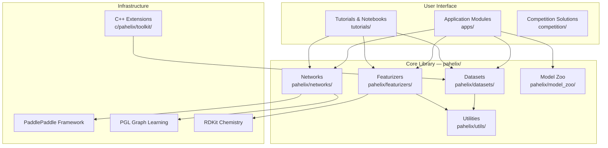

---
slug:1-overview
blog_type:normal
---


PaddleHelix (螺旋桨) 是百度基于 PaddlePaddle 深度学习框架打造的开源生物计算工具包。它为计算生物学领域的三个关键方向：**药物发现**、**疫苗设计**和**蛋白质结构预测**，提供了全面的机器学习模型和工具集。无论你是探索分子特性的计算化学家、预测蛋白质折叠的结构生物学家，还是构建 AI 驱动生物医学应用的开发者，PaddleHelix 都能提供生产就绪的模型、模块化的核心库以及交互式教程，从而加速你的研究进程。


## 什么是 PaddleHelix？

PaddleHelix 的核心在于连接深度学习与生命科学。它将最先进的神经网络架构——包括图神经网络、Transformer 和变分自编码器——与专门处理分子图、蛋白质序列和生物分子复合物的领域数据管道相结合。该工具包围绕两大原则设计：一是**模块化**，你可以自由组合数据集、特征化器和网络模块等组件；二是**可复现性**，每项研究成果均附有已发布的代码，其中许多成果已发表于 *Nature Machine Intelligence*、*KDD* 和 *NeurIPS* 等顶级期刊与会议。

该项目维护活跃，最新主要版本——**HelixFold3.2**（2025 年 7 月）——在蛋白质相关的结构预测任务上，较之前的 HelixFold3 版本带来了显著提升 [README.md](README.md#L11-L14)。

## 高层架构

PaddleHelix 采用分层系统架构。其底层是 `pahelix` 核心库，提供数据处理、分子特征化和神经网络构建模块等可复用的基础组件。在此基础之上，是位于 `apps/` 下的特定领域应用模块，每个模块都针对特定的生物计算任务实现了完整的管道。C++ 扩展层提供了高性能的 RNA 结构算法，而 `tutorials/` 下的交互式教程则提供了引导式的入门途径。



## 仓库结构

该仓库在可复用的库代码与应用特定的实现之间进行了清晰的分离。以下是顶层目录结构的可视化概览：

```
PaddleHelix/
├── pahelix/                  # 核心库
│   ├── datasets/             # 25+ 基准数据集
│   ├── featurizers/          # 分子与蛋白质特征提取
│   ├── networks/             # GNN、Transformer、ResNet 模块
│   ├── model_zoo/            # 预训练模型定义
│   └── utils/                # 化合物/蛋白质工具与评估指标
├── apps/                     # 应用模块
│   ├── pretrained_compound/  # GEM、InfoGraph、PretrainGNNs
│   ├── pretrained_protein/   # TAPE 蛋白质预训练
│   ├── protein_folding/      # HelixFold、HelixFold-Single、HelixFold3
│   ├── drug_target_interaction/  # GraphDTA、MolTrans、SIGN 等
│   ├── molecular_generation/ # JT-VAE、Seq-VAE、SD-VAE
│   └── fewshot_molecular_property/ # PAR (NeurIPS 2021)
├── c/pahelix/toolkit/        # C++ 扩展
├── tutorials/                # Jupyter notebook 教程
├── competition/              # 竞赛方案 (OGB、KDD Cup)
└── docs/                     # Sphinx 文档源码
```

来源：[README.md](README.md#L100-L135)、[setup.py](setup.py#L97-L109)

## 核心能力

PaddleHelix 涵盖了广泛的生物计算任务。下表总结了三大核心领域及其旗舰模型：

| 领域 | 任务 | 核心模型 | 亮点 |
|--------|------|------------|-----------|
| **药物发现** | 分子属性预测 | GEM、PretrainGNNs、HelixGEM-2 | 在 OGB PCQM4Mv2 排行榜上**排名第一** |
| | 药物-靶点相互作用 | GraphDTA、MolTrans、SIGN、BatchDTA | 发表于 *Briefings in Bioinformatics*、*KDD* |
| | 分子生成 | JT-VAE、Seq-VAE、SD-VAE | 基于变分自编码器的从头分子设计 |
| | 小样本学习 | PAR | **NeurIPS 2021 Spotlight** |
| **蛋白质科学** | 蛋白质结构预测 | HelixFold、HelixFold-Single、HelixFold3 | AlphaFold2/3 复现；无 MSA 推理 |
| | 蛋白质功能预测 | DeepFRI、ProteinSIGN | GO 功能词条与 EC 编号预测 |
| | 蛋白质预训练 | TAPE | 基于序列的表示学习 |
| **疫苗设计** | RNA 二级结构 | LinearFold、LinearPartition | C++ 加速的 RNA 折叠算法 |

## `pahelix` 核心库

`pahelix` 包是 PaddleHelix 可编程的核心。它提供了四个相互关联的子系统，供应用模块组合调用：

**数据集**（`pahelix/datasets/`）—— 包含 25 个以上的分子与生物医学基准数据集，所有数据集均基于 `InMemoryDataset` 抽象构建。每个数据集都是一个字典列表（将特征名映射到 NumPy 数组），支持以 `.npz` 格式进行磁盘缓存，并提供内置的 `Dataloader`，支持多进程处理和自定义整理函数 [inmemory_dataset.py](pahelix/datasets/inmemory_dataset.py#L29-L50)。基准数据集包括 MoleculeNet 系列（BACE、BBBP、Tox21、HIV 等）、量子化学数据集（QM7、QM8、QM9）、药物-靶点亲和力数据集（Davis、KIBA）以及 OGB 挑战赛数据集。

**特征化器**（`pahelix/featurizers/`）—— 将原始的分子 SMILES 字符串和蛋白质序列转换为适用于神经网络输入的结构化图表示。特征化器利用 RDKit 进行化学计算，并将原子、键和空间坐标编码为离散与连续特征 [pretrain_gnn_featurizer.py](pahelix/featurizers/pretrain_gnn_featurizer.py#L1-L35)。

**网络模块**（`pahelix/networks/`）—— 神经网络构建模块库，包括用于化合物编码的 `AtomEmbedding` 和 `BondEmbedding` 层 [compound_encoder.py](pahelix/networks/compound_encoder.py#L30-L50)、带图归一化的 GNN 层 [gnn_block.py](pahelix/networks/gnn_block.py#L1-L45)、Transformer 模块、LSTM 模块、ResNet 模块，以及优化器和预处理/后处理函数等训练实用工具。

**模型库**（`pahelix/model_zoo/`）—— 预定义的端到端模型架构，将数据加载器、特征化器和网络模块组合成针对特定任务的可训练管道 [model_zoo/__init__.py](pahelix/model_zoo/__init__.py#L16-L19)。

<CgxTip>
`InMemoryDataset` 是整个 PaddleHelix 通用的数据容器。每一个应用——从分子属性预测到药物-靶点相互作用——都以这种格式消费和生成数据。优先掌握这一抽象概念，将使你能够顺畅地理解整个代码库。
</CgxTip>

## 应用模块深入解析

`apps/` 下的每个目录都是一个独立的项目，实现了特定的算法或模型系列。以下是主要的应用分类：

### 蛋白质结构预测 —— HelixFold 系列

HelixFold 系列代表了 PaddleHelix 最突出的能力，复现并扩展了 DeepMind 的 AlphaFold 系列：

- **HelixFold** —— 对 AlphaFold 2 的完整复现，用于单聚体蛋白质结构预测，具备完整的训练和推理管道。训练时间从 11 天优化至 5.12 天，并支持超长单聚体蛋白质（约 6600 个氨基酸）。
- **HelixFold-Single** —— 无需 MSA（多序列比对）的蛋白质结构预测管道，仅需初级氨基酸序列作为输入，能够在数秒内预测结构。发表于 *Nature Machine Intelligence*。
- **HelixFold-S1** —— HelixFold-Single 的模块化变体，具有分离的推理模块。
- **HelixFold3** —— 复现 AlphaFold 3 能力的生物分子结构预测，可处理蛋白质、核酸和常规配体。最新版本（HelixFold3.2）进一步提升了预测精度 [helixfold3/](apps/protein_folding/helixfold3)。

### 药物发现管道

- **预训练模型** —— 针对化合物（GEM、InfoGraph、PretrainGNNs）和蛋白质（TAPE）的大规模自监督预训练，支持在标记数据有限的下游任务中进行迁移学习 [pretrained_compound/](apps/pretrained_compound)、[pretrained_protein/](apps/pretrained_protein)。
- **药物-靶点相互作用** —— 多种用于预测药物分子与蛋白质靶点间结合亲和力的架构，包括 GraphDTA（基于图）、MolTrans（基于交互）、SIGN（结构感知）、BatchDTA 等 [drug_target_interaction/](apps/drug_target_interaction)。
- **分子生成** —— 用于从头分子设计的变分自编码器方法：联结树 VAE（JT-VAE）、序列 VAE（Seq-VAE）和自蒸馏 VAE（SD-VAE）[molecular_generation/](apps/molecular_generation)。
- **小样本属性预测** —— 属性感知关系（PAR）网络，用于在极少样本的情况下预测分子属性 [fewshot_molecular_property/](apps/fewshot_molecular_property)。

### 其他应用

- **药物-药物协同** —— 用于预测药物对联合作用的模型，包括 DTSyn 和 RGCN 方法 [drug_drug_synergy/](apps/drug_drug_synergy)。
- **蛋白质功能预测** —— DeepFRI 和 ProteinSIGN，用于从蛋白质序列和结构预测基因本体词条和酶分类编号 [protein_function_prediction/](apps/protein_function_prediction)。
- **HelixDock** —— 基于大规模生成对接构象进行预训练的模型，用于蛋白质-配体结构预测 [molecular_docking/](apps/molecular_docking)。
- **HelixProtX** —— 面向蛋白质的专用应用模块，用于推理任务 [helixprotx/](apps/helixprotx)。

## 技术栈与依赖

PaddleHelix 构建在一套精心挑选的框架之上，这些框架将深度学习性能与特定领域的科学计算相结合：

| 组件 | 技术 | 用途 |
|-----------|-----------|---------|
| 深度学习框架 | **PaddlePaddle** | 模型训练与推理 |
| 图神经网络 | **PGL** (Paddle Graph Learning) | 分子图操作 |
| 化学信息学 | **RDKit** | 分子解析、特征化与 3D 构象生成 |
| 数值计算 | **NumPy**、**Pandas** | 数据处理 |
| 图分析 | **NetworkX** | 图构建工具 |
| 机器学习 | **scikit-learn** | 评估指标、数据划分、基线模型 |
| C++ 扩展 | **CMake**、**pybind11** | LinearRNA 算法 |

要求 Python 3.6 及以上版本，该包支持 Linux、Windows 和 macOS [setup.py](setup.py#L97-L104)。

## 竞赛与研究成果

PaddleHelix 在学术论文和竞赛基准测试中均有着卓越的履历。该团队在多个开放图基准（OGB）排行榜上名列前茅，并在顶级 AI 会议上屡获殊荣：

- **OGB PCQM4Mv2 排行榜**：凭借 HelixGEM-2 荣获第一名
- **OGB molhiv 与 molpcba**：第一名（2021 年 3 月）
- **KDD Cup 2021 PCQM4M-LSC**：第二名
- 发表于 *Nature Machine Intelligence*（2 篇论文）、*KDD*、*NeurIPS*（Spotlight）、*Briefings in Bioinformatics*、*Bioinformatics*、*BIBM* 及 *MLCB*

包含完整代码的竞赛方案存放于 [competition/](competition) 目录中以保证可复现性。

## 后续步骤

根据你的背景和目标，PaddleHelix 提供了多种入门途径：

- **初识 PaddleHelix？** 请从[快速入门](2-quick-start)指南开始，在数分钟内完成工具包的安装并运行你的第一次预测。
- **希望动手实践？** [教程与 Notebook](3-tutorials-and-notebooks)页面提供了交互式的 Jupyter Notebook，涵盖化合物属性预测、药物-靶点相互作用、分子生成和 RNA 结构预测。
- **对系统设计感兴趣？** [架构概述](6-architecture-overview)页面深入剖析了核心库模块之间是如何连接与通信的。
- **在寻找特定模型？** 请导航至相关的深度解析页面：[HelixFold](17-helixfold-alphafold2-reproduction)、[GEM 预训练](11-compound-pretraining-with-gem)、[药物-靶点相互作用模型](14-drug-target-interaction-models) 或 [分子生成管道](15-molecular-generation-pipelines)。

如需获取完整的 API 参考和开发者文档，请查阅[在线文档](https://paddlehelix.readthedocs.io/en/dev/)或本地的 [docs/](docs) 目录。