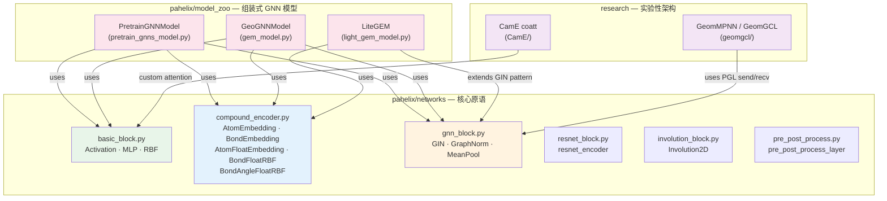
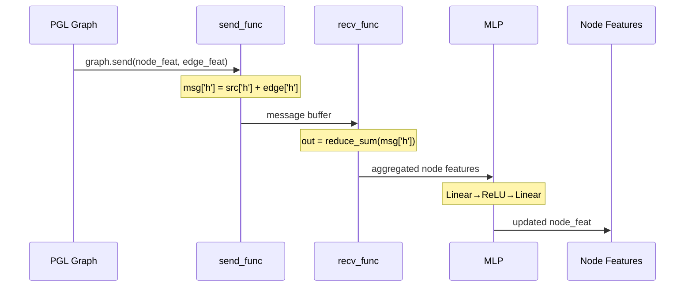
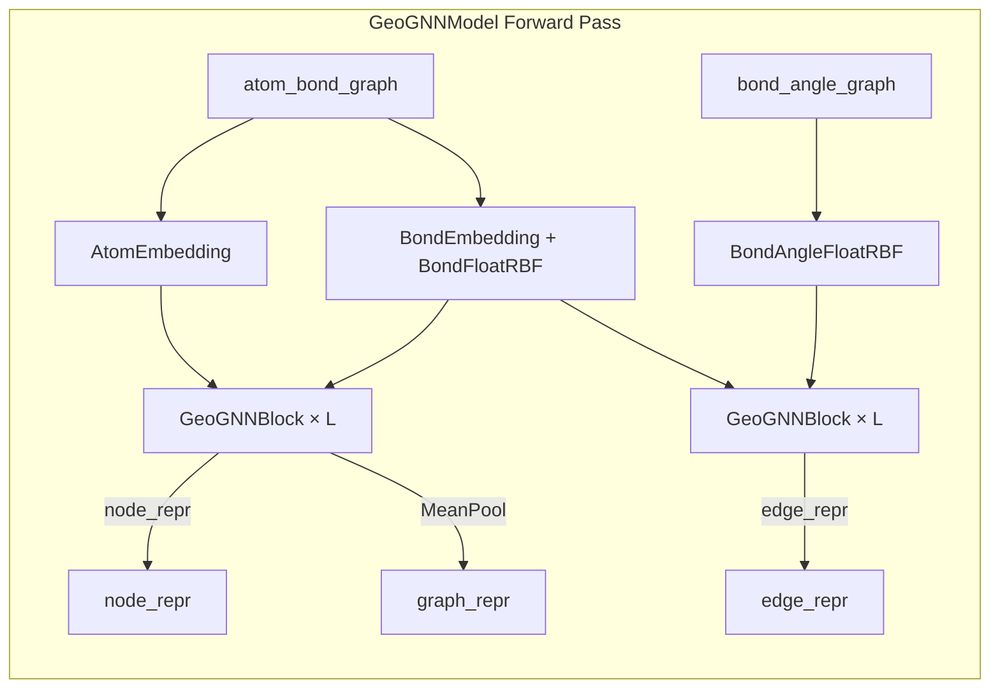
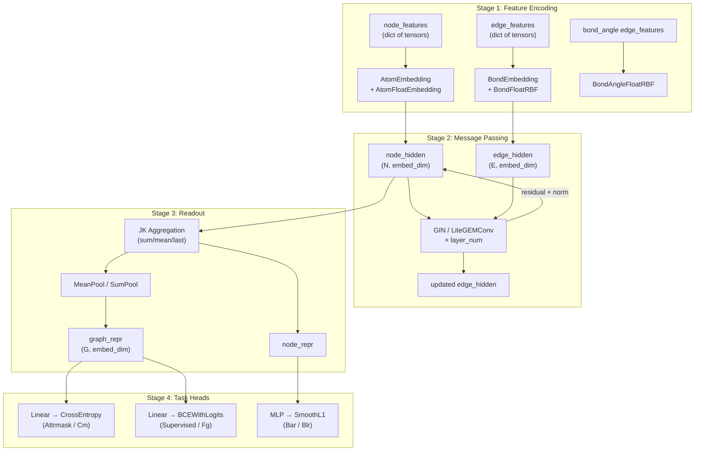

---
slug:10-gnn-blocks-and-network-architecture
blog_type:normal
---

本页深入剖析了构成 PaddleHelix 分子表征学习流水线计算骨干的图神经网络构建模块。这些组件涵盖了从底层的消息传递原语和归一化工具，到完全组装的多层架构，它们接收原始化合物图，并生成节点级和图级嵌入，用于下游属性预测、预训练以及药物发现任务。

## 模块清单与分层架构

`pahelix/networks/` 包提供了一个垂直集成的技术栈：基础数值内核、化合物特征编码器以及图级神经模块。`pahelix/model_zoo/` 中的三个下游模型族将这些原语组合成可训练的 GNN 流水线，而 `research/` 则包含了通过 2D/3D 几何感知消息传递扩展核心词汇表的实验性架构。

来源：[gnn_block.py](pahelix/networks/gnn_block.py#L15-L18)、[basic_block.py](pahelix/networks/basic_block.py#L15-L17)、[compound_encoder.py](pahelix/networks/compound_encoder.py#L15-L17)、[__init__.py](pahelix/networks/__init__.py#L15-L17)

## 基础构建模块

### Activation、MLP 与 RBF

[basic_block.py](pahelix/networks/basic_block.py) 模块提供了三个工具层，几乎被仓库中的所有模型使用。**`Activation`** 是一个轻量级的调度封装器，负责将 `'relu'` 或 `'leaky_relu'` 解析为对应的 Paddle 实现，并在遇到不支持的类型时抛出 `ValueError` [basic_block.py#L28-L35](pahelix/networks/basic_block.py#L28-L35)。**`MLP`** 构建了一个可变深度的全连接网络，其中每个隐藏层后都跟着 `Dropout → Activation`，而最后一层输出时不使用 dropout 或激活函数 [basic_block.py#L46-L61](pahelix/networks/basic_block.py#L46-L61)。**`RBF`**（径向基函数）在一组可学习中心上实现核展开 `exp(-γ(x - c)²)`，将单个连续标量投影为固定宽度的向量——这是编码键长和偏电荷等连续分子特征的核心机制 [basic_block.py#L75-L88](pahelix/networks/basic_block.py#L75-L88)。

来源：[basic_block.py](pahelix/networks/basic_block.py#L24-L88)

| 层 | 输入形状 | 输出形状 | 关键参数 |
|-------|------------|--------------|----------------|
| `Activation` | `(*)` | `(*)` | `act_type: str` |
| `MLP` | `(-1, in_size)` | `(-1, out_size)` | `layer_num, in_size, hidden_size, out_size, act, dropout_rate` |
| `RBF` | `(-1, 1)` | `(-1, n_centers)` | `centers: array, gamma: float` |

### 化合物特征编码器

[compound_encoder.py](pahelix/networks/compound_encoder.py) 模块定义了五个编码器类，它们负责将原始分子特征字典（由特征化器生成）桥接为适用于 GNN 消费的稠密浮点嵌入。这些编码器分为两类：**类别嵌入**（通过 `nn.Embedding` 处理整数索引特征）和**连续 RBF 投影**（通过 `RBF` 后接线性投影处理浮点值特征）。

来源：[compound_encoder.py](pahelix/networks/compound_encoder.py#L28-L192)

**`AtomEmbedding`** 遍历配置的原子特征名称列表（如 `atomic_num`、`chiral_tag`），为每个特征创建一个 `nn.Embedding`，其词表大小取自 `CompoundKit.get_atom_feature_size(name) + 5`（`+5` 为特殊 Token 预留了余量），并将所有逐特征的嵌入求和为一个维度为 `embed_dim` 的向量 [compound_encoder.py#L32-L52](pahelix/networks/compound_encoder.py#L32-L52)。**`BondEmbedding`** 对键级类别特征遵循相同的模式 [compound_encoder.py#L98-L118](pahelix/networks/compound_encoder.py#L98-L118)。

**`AtomFloatEmbedding`** 处理连续的原子属性——范德华半径、偏电荷和质量——每个属性通过专用的 `RBF` 层进行展开（使用特定领域的中心和 γ 值），然后线性投影到 `embed_dim` [compound_encoder.py#L59-L91](pahelix/networks/compound_encoder.py#L59-L91)。**`BondFloatRBF`** 将相同的模式应用于键长，中心跨度为 `[0, 2)` Å [compound_encoder.py#L125-L155](pahelix/networks/compound_encoder.py#L125-L155)。**`BondAngleFloatRBF`** 将其扩展到键角，中心跨度为 `[0, π)` 弧度 [compound_encoder.py#L162-L192](pahelix/networks/compound_encoder.py#L162-L192)。

来源：[compound_encoder.py](pahelix/networks/compound_encoder.py#L28-L192)

<CgxTip>
**RBF 中心校准是特定于领域的**：原子特征使用稀疏中心（例如，在 `[1, 3)` 范围内为范德华半径设置 10 个点），而键角在 `[0, π)` 范围内使用更细的 0.1 弧度网格。当扩展到新的连续特征时，必须根据预期值范围调整 `rbf_params` 字典中的 `(centers, gamma)` 元组——不匹配会导致信息崩塌（中心太少）或过度参数化（中心太多）。
</CgxTip>

## 核心 GNN 模块

### GIN — 图同构网络层

[gnn_block.py](pahelix/networks/gnn_block.py#L75-L105) 中的 **`GIN`** 类是 PaddleHelix GNN 模型库中使用的首要消息传递原语。它改编自 [Pretrain-GNNs](https://github.com/snap-stanford/pretrain-gnns) 实现，执行带有边特征集成的图同构网络更新规则。内部的 MLP 采用两层瓶颈结构：`Linear(hidden, hidden×2) → ReLU → Linear(hidden×2, hidden)` [gnn_block.py#L81-L84](pahelix/networks/gnn_block.py#L81-L84)。

来源：[gnn_block.py](pahelix/networks/gnn_block.py#L75-L105)

消息传递机制使用 PGL 的 `graph.send`/`graph.recv` API。发送函数计算 `h_src + h_edge`（加性边特征注入），接收函数对消息缓冲区应用逐元素求和聚合 [gnn_block.py#L92-L103](pahelix/networks/gnn_block.py#L92-L103)。这推导出了标准的 GIN 公式 `h_v' = MLP(Σ_{u∈N(v)} (h_u + h_{uv}))`，其中边特征在聚合前调制邻居消息。

### GraphNorm 与 MeanPool

**`GraphNorm`** 实现了来自“Benchmarking Graph Neural Networks”论文（Dwivedi 等人，2020）的图级归一化。它将每个节点的特征向量除以 `√(num_nodes_in_graph)`，从而有效地对图大小方差进行归一化 [gnn_block.py#L26-L52](pahelix/networks/gnn_block.py#L26-L52)。该实现使用带有 `pool_type="sum"` 的 `pgl.nn.GraphPool` 来计算每个图的节点数，然后通过 `paddle.gather` 将归一化因子广播回去 [gnn_block.py#L44-L52](pahelix/networks/gnn_block.py#L44-L52)。

来源：[gnn_block.py](pahelix/networks/gnn_block.py#L26-L72)

**`MeanPool`** 提供了一种针对 PGL 均值池化 Bug 的变通方案，通过手动计算 `sum(features) / sum(ones)` 来得出正确的图级均值 [gnn_block.py#L55-L72](pahelix/networks/gnn_block.py#L55-L72)。这两个类在前向传播中都是无状态的——它们不拥有任何可学习参数。

### 前/后处理层

[pre_post_process.py](pahelix/networks/pre_post_process.py#L24-L53) 中的 `pre_post_process_layer` 函数提供了一个可配置的残差-归一化-dropout 流水线，由命令字符串控制。`process_cmd` 中的每个字符都会触发特定操作：`'a'` 添加残差连接，`'n'` 应用层归一化，`'d'` 应用带有训练时放大的 dropout [pre_post_process.py#L32-L52](pahelix/networks/pre_post_process.py#L32-L52)。这是现代 `post_process_layer` 模式的 PaddlePaddle Fluid 时代类似物，主要由蛋白质序列模型和 `resnet_encoder` 使用。

来源：[pre_post_process.py](pahelix/networks/pre_post_process.py#L24-L57)

<CgxTip>
**残差策略分歧**：核心 GNN 模型（`PretrainGNNModel`、`GeoGNNModel`、`LiteGEM`）都在其前向方法中直接实现残差连接，而不是委托给 `pre_post_process_layer`。后者仍局限于 Fluid 遗留组件（ResNet 编码器、Transformer 块）。在构建新的 GNN 架构时，应遵循模型库中确立的模式——在归一化后内联相加残差——而不是将 Fluid 时代的工具函数与动态图模式的 PaddlePaddle 层混用。
</CgxTip>

## 组装式 GNN 模型架构

### PretrainGNNModel — 带有跳跃知识的堆叠 GIN

[pretrain_gnns_model.py](pahelix/model_zoo/pretrain_gnns_model.py) 中的 **`PretrainGNNModel`** 是实现 Hu 等人（2020）自监督预训练框架的参考 GNN 架构。它堆叠了 `layer_num` 个 GIN 层，每层前面有一个逐层的 `BondEmbedding`，后面跟着一个可选的归一化 + `GraphNorm` + `Dropout` 流水线 [pretrain_gnns_model.py#L60-L78](pahelix/model_zoo/pretrain_gnns_model.py#L60-L78)。

来源：[pretrain_gnns_model.py](pahelix/model_zoo/pretrain_gnns_model.py#L31-L141)

前向传播将每一层的节点特征累积到 `node_feat_list` 中，然后通过**跳跃知识**（JK）策略解析出最终的节点表征——可配置为在所有层输出上进行 `'last'`、`'sum'` 或 `'mean'` [pretrain_gnns_model.py#L114-L138](pahelix/model_zoo/pretrain_gnns_model.py#L114-L138)。图级读数操作应用自定义的 `MeanPool` 或 PGL 内置的带有可配置 `pool_type` 的 `GraphPool` [pretrain_gnns_model.py#L80-L84](pahelix/model_zoo/pretrain_gnns_model.py#L80-L84)。当 `residual=True` 时，每层的输出在附加到特征列表之前会与其输入相加 [pretrain_gnns_model.py#L127-L128](pahelix/model_zoo/pretrain_gnns_model.py#L127-L128)。

该模型暴露了 `node_dim` 和 `graph_dim` 属性（均等于 `embed_dim`），使下游任务头能够正确设置其线性投影的大小 [pretrain_gnns_model.py#L98-L106](pahelix/model_zoo/pretrain_gnns_model.py#L98-L106)。有两个特定任务的封装器消费此编码器：用于属性掩码预训练的 **`AttrmaskModel`** 和用于多任务属性预测的 **`SupervisedModel`** [pretrain_gnns_model.py#L144-L195](pahelix/model_zoo/pretrain_gnns_model.py#L144-L195)。

### GeoGNNModel — 双图几何消息传递

[gem_model.py](pahelix/model_zoo/gem_model.py) 中的 **`GeoGNNModel`** 引入了一种**双图架构**，该架构在两种不同的图拓扑上交错进行消息传递：原子-键图和键角图 [gem_model.py#L127-L156](pahelix/model_zoo/gem_model.py#L127-L156)。这是 GEM（Geo-Enhanced Molecular pretraining）框架背后的编码器，也是核心库中架构最丰富的 GNN 模型。

来源：[gem_model.py](pahelix/model_zoo/gem_model.py#L32-L156)

**`GeoGNNBlock`** 将单个 GIN 层与 `LayerNorm → GraphNorm → 可选 ReLU → Dropout → 残差相加` 封装在一起 [gem_model.py#L36-L58](pahelix/model_zoo/gem_model.py#L36-L58)。在每一层 `i`，原子-键图通过原子-键块传播节点特征，而键角图通过键角块传播边特征（由类别 + RBF 嵌入新计算得出）[gem_model.py#L137-L151](pahelix/model_zoo/gem_model.py#L137-L151)。前向传播返回一个三元组 `(node_repr, edge_repr, graph_repr)`，支持在不同结构级别上操作的下游预训练任务 [gem_model.py#L153-L156](pahelix/model_zoo/gem_model.py#L153-L156)。

**`GeoPredModel`** 消费 `GeoGNNModel` 编码器并实现五个自监督预训练目标：上下文掩码（`Cm`）、官能团预测（`Fg`）、键角回归（`Bar`）、键长回归（`Blr`）和原子距离分类（`Adc`）[gem_model.py#L159-L283](pahelix/model_zoo/gem_model.py#L159-L283)。每个损失函数都实现为私有方法，负责收集相关的节点/边表征并应用特定任务的头（线性分类器或 MLP 回归器）。

### LiteGEM — 注意力增强的轻量级 GNN

[light_gem_model.py](pahelix/model_zoo/light_gem_model.py) 中的 **`LiteGEM`** 是 GeoGNN 的轻量级继任者，它用 **softmax 注意力消息传递**机制取代了标准的求和聚合 GIN，并引入了用于全局图上下文的**虚拟节点**嵌入。`LiteGEMConv` 层实现了一种灵活的聚合方案：发送函数要么拼接 `[dst, src, edge]` 特征（当 `concat=True` 时），要么相加 `src + edge`（默认情况），应用 Swish 激活函数，而接收函数通过 `reduce_softmax` 计算注意力加权的聚合 [light_gem_model.py#L163-L181](pahelix/model_zoo/light_gem_model.py#L163-L181)。

来源：[light_gem_model.py](pahelix/model_zoo/light_gem_model.py#L113-L206)

温度参数 `t` 控制 softmax 的锐度，可以通过 `create_parameter` 将其设为可学习的 [light_gem_model.py#L149-L155](pahelix/model_zoo/light_gem_model.py#L149-L155)。完整的 `LiteGEM` 模型添加了逐层残差连接、可配置的归一化（`batch` 或 `layer`）、带 dropout 的 Swish 激活函数，并可选地注入一个虚拟节点嵌入，该嵌入会被求和到每个节点的特征中，并在每个消息传递层之后通过共享的 MLP 进行更新 [light_gem_model.py#L209-L329](pahelix/model_zoo/light_gem_model.py#L209-L329)。虚拟节点充当可学习的全局内存 Token，大致类似于 Transformer 架构中的 CLS Token。

来源：[light_gem_model.py](pahelix/model_zoo/light_gem_model.py#L227-L248)

## 研究级 GNN 架构

### GeomGCL — 2D/3D 几何增强消息传递

`research/geomgcl/` 包通过**几何感知消息传递**扩展了核心 GNN 词汇表，该传递同时在 2D 分子拓扑和 3D 空间坐标上进行操作。[layers.py](research/geomgcl/layers.py) 模块定义了六个专门的卷积层：用于拓扑角度和距离的 `Angle2DConv` 和 `Dist2DConv`，用于空间几何的 `Angle3DConv` 和 `Dist3DConv`，用于以边为中心的聚合的 `EdgeAggConv`，以及用于学习型图级读数的 `AttentivePooling` [layers.py](research/geomgcl/layers.py)。

来源：[layers.py](research/geomgcl/layers.py#L9-L264)

`GeomMPNN` 将这些组装成一个统一的编码器，同时处理两个图输入——2D 拓扑图和 3D 空间图——并通过 MLP 投影头合并它们的表征 [model.py#L86-L134](research/geomgcl/model.py#L86-L134)。`GeomGCL` 通过对比学习目标扩展了这一点，该目标使用余弦相似度和温度缩放的 InfoNCE 风格损失，在共享嵌入空间中对齐 2D 和 3D 表征 [model.py#L136-L190](research/geomgcl/model.py#L136-L190)。专用的 `DistRBF` 和 `AngleRBF` 层处理连续几何特征的径向基展开 [layers.py#L218-L252](research/geomgcl/layers.py#L218-L252)。

## 架构对比

下表总结了仓库中四个 GNN 模型族的设计维度：

| 特性 | PretrainGNNModel | GeoGNNModel | LiteGEM | GeomMPNN/GeomGCL |
|---------|-----------------|-------------|---------|-------------------|
| **核心 GNN 层** | GIN（求和聚合） | GIN（求和聚合） | 自定义（softmax 聚合） | 自定义（角度/距离卷积） |
| **图拓扑** | 单图（原子-键） | 双图（原子-键 + 键角） | 单图（原子-键） | 双图（2D 拓扑 + 3D 空间） |
| **归一化** | BatchNorm / LayerNorm | LayerNorm + GraphNorm | BatchNorm / LayerNorm + GraphNorm | 未指定 |
| **残差连接** | 可选 | 始终开启 | 始终开启 | 未指定 |
| **JK 聚合** | sum / mean / last | 仅 last | 仅 last | 按模态分离 |
| **虚拟节点** | 无 | 无 | 有（可学习） | 无 |
| **边特征处理** | 加性注入 | 加性注入 + RBF | 拼接或加性 | 专用边卷积 |
| **输出** | 节点 + 图表征 | 节点 + 边 + 图表征 | 图 + 节点 + 边表征 | 图表征 |
| **主要用途** | 通用预训练 | 几何感知预训练 | 轻量级微调 | 几何对比学习 |
| **文件** | [pretrain_gnns_model.py](pahelix/model_zoo/pretrain_gnns_model.py) | [gem_model.py](pahelix/model_zoo/gem_model.py) | [light_gem_model.py](pahelix/model_zoo/light_gem_model.py) | [geomgcl/](research/geomgcl/) |

## GNN 流水线中的数据流

通过 PaddleHelix GNN 技术栈的规范推理路径遵循三阶段流水线：由特征化器生成的原始分子图被编码为稠密嵌入，通过堆叠的 GNN 层进行传播，最后被池化为固定大小的表征，供特定任务的预测头使用。

来源：[pretrain_gnns_model.py](pahelix/model_zoo/pretrain_gnns_model.py#L108-L141)、[gem_model.py](pahelix/model_zoo/gem_model.py#L127-L156)、[light_gem_model.py](pahelix/model_zoo/light_gem_model.py#L282-L329)

## 配置参考

### PretrainGNNModel 配置

| 参数 | 默认值 | 描述 |
|-----------|---------|-------------|
| `embed_dim` | 300 | 所有嵌入和隐藏状态的维度 |
| `dropout_rate` | 0.5 | 每个 GIN 层后的 dropout 概率 |
| `norm_type` | `'batch_norm'` | 逐层归一化：`'batch_norm'` 或 `'layer_norm'` |
| `graph_norm` | `False` | 启用 √N 图大小归一化 |
| `residual` | `False` | 在层之间添加残差连接 |
| `layer_num` | 5 | 堆叠的 GIN 层数 |
| `gnn_type` | `'gin'` | GNN 层类型（仅支持 `'gin'`） |
| `JK` | `'last'` | 跳跃知识模式：`'sum'`、`'mean'` 或 `'last'` |
| `readout` | `'mean'` | 图级池化：`'mean'`、`'sum'`、`'max'` |
| `atom_names` | *必填* | 类别原子特征名称列表 |
| `bond_names` | *必填* | 类别键特征名称列表 |

来源：[pretrain_gnns_model.py](pahelix/model_zoo/pretrain_gnns_model.py#L38-L96)

### GeoGNNModel 配置

| 参数 | 默认值 | 描述 |
|-----------|---------|-------------|
| `embed_dim` | 32 | 嵌入维度（低于 PretrainGNN） |
| `dropout_rate` | 0.2 | 每个 GeoGNNBlock 的 dropout |
| `layer_num` | 8 | 双图消息传递层数 |
| `readout` | `'mean'` | 图池化策略 |
| `atom_names` | *必填* | 类别原子特征名称 |
| `bond_names` | *必填* | 类别键特征名称 |
| `bond_float_names` | *必填* | 连续键特征名称（RBF 编码） |
| `bond_angle_float_names` | *必填* | 连续键角特征名称 |

来源：[gem_model.py](pahelix/model_zoo/gem_model.py#L68-L115)

### LiteGEM 配置

| 参数 | 默认值 | 描述 |
|-----------|---------|-------------|
| `emb_dim` | *必填* | 嵌入维度 |
| `num_layers` | *必填* | LiteGEMConv 层数 |
| `dropout_rate` | *必填* | 层间的 dropout |
| `virtual_node` | *必填* | 启用虚拟节点内存 Token |
| `norm` | *必填* | 归一化：`'batch'` 或 `'layer'` |
| `aggr` | *必填* | 聚合类型：`'softmax_sg'` 或 `'softmax'` |
| `learn_t` | *必填* | 使注意力温度可学习 |
| `init_t` | *必填* | 初始 softmax 温度 |
| `concat` | *必填* | 拼接 [dst, src, edge] 与相加 [src, edge] |
| `clf_layers` | *必填* | 分类头深度：1、2 或 3 |
| `graphnorm` | *必填* | 应用 PGL GraphNorm |

来源：[light_gem_model.py](pahelix/model_zoo/light_gem_model.py#L211-L280)

---

**导航**：本页介绍了 PaddleHelix 中的 GNN 构建模块和组装架构。关于在进入这些模块之前如何生成原始分子图，请参阅[化合物与蛋白质特征化器](8-compound-and-protein-featurizers)。关于位于特征化器和 GNN 层之间的化合物编码器和嵌入层，请参阅[化合物编码器与嵌入层](9-compound-encoder-and-embedding-layers)。要了解如何通过自监督预训练训练这些 GNN 架构，请继续阅读[使用 GEM 的化合物预训练](11-compound-pretraining-with-gem)和[Pretrain-GNNs 框架](12-pretrain-gnns-framework)。关于蛋白质建模中使用的不同神经范式，请参阅 [Transformer 块实现](20-transformer-block-implementation)。