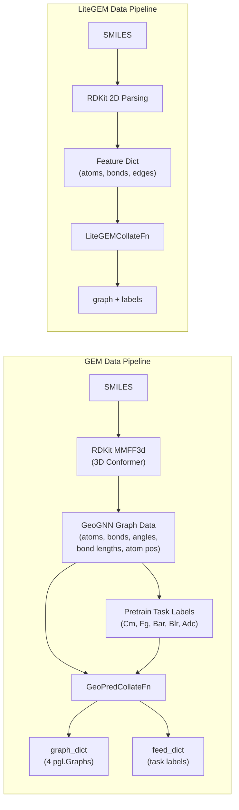

---
slug:11-compound-pretraining-with-gem
blog_type:normal
---


GEM（Graph Enhanced Molecular pretraining，图增强分子预训练）是一个自监督学习框架，旨在从大规模无标签化合物数据中学习丰富的分子表示。通过将几何感知的图神经网络与多任务预训练目标相结合，GEM 能够生成具有良好迁移性的嵌入，从而显著提升下游分子属性预测基准的性能。本页面将同时介绍基于 GeoGNN 的原始 GEM 架构以及改进后的 LiteGEM (GEM-2) 变体，并详细梳理它们的设计原理、预训练任务和微调工作流。

## 为什么要预训练化合物表示？

在有限的标注数据上从头开始训练的分子属性预测模型通常难以具备良好的泛化能力。在大型化合物库（例如包含约 2000 万个分子的 ZINC 数据库）上进行自监督预训练可以解决这一问题，其方式是学习结构模式（原子环境、键几何形状、官能团），这些模式可以迁移到各种下游任务中。GEM 的核心洞察在于，除了拓扑结构外，还要利用 **3D 几何信息**，这能够捕捉纯 2D 表示所遗漏的立体化学和空间关系。这种几何感知能力与五个精心设计的预训练目标相结合，使得编码器能够对未见过的分子骨架具有稳健的泛化能力。

来源：[pretrain.py](/apps/pretrained_compound/ChemRL/GEM/pretrain.py#L100-L120)

## 架构概述

GEM 系列包含两种架构：原始的 **基于 GeoGNN 的 GEM**（双图、几何信息丰富）和精简的 **LiteGEM/GEM-2**（单图、注重效率）。两者遵循相同的模式——接收分子图的编码器会生成节点级、边级和图级表示，随后这些表示在预训练阶段被特定的任务预测头消费，或在微调阶段被单一任务头消费。

```mermaid
graph TB
    subgraph "GEM Pipeline"
        SMILES["SMILES String"] --> FEAT["Featurizer<br/>(GeoPredTransformFn)"]
        FEAT --> DUAL["Dual-Graph Construction"]
        DUAL --> ABG["Atom-Bond Graph<br/>(nodes=atoms, edges=bonds)"]
        DUAL --> BAG["Bond-Angle Graph<br/>(nodes=bonds, edges=angles)"]
        ABG --> GEO["GeoGNN Encoder<br/>(8-layer GIN)"]
        BAG --> GEO
        GEO --> REPR["node_repr, edge_repr, graph_repr"]
        REPR --> TASKS["Pretraining Task Heads<br/>(Cm, Fg, Bar, Blr, Adc)"]
        REPR --> FT["Fine-tuning Head<br/>(MLP Classifier/Regressor)"]
    end

    subgraph "LiteGEM/GEM-2 Pipeline"
        SMILES2["SMILES String"] --> FEAT2["Featurizer<br/>(LiteGEMTransformFn)"]
        FEAT2 --> SG["Single Graph<br/>(nodes=atoms, edges=bonds)"]
        SG --> LITE["LiteGEM Encoder<br/>(N-layer LiteGEMConv)"]
        LITE --> REPR2["graph_repr, node_repr, edge_emb"]
        REPR2 --> FT2["Fine-tuning Head<br/>(Classifier/Regressor)"]
    end
```



下表从关键设计维度对比了这两种架构：

| 特性 | GEM (GeoGNN) | LiteGEM (GEM-2) |
|---|---|---|
| **图结构** | 双图：原子-键 + 键-角 | 单图：原子-键 |
| **3D 几何** | 键长 + 键角 | 可选（通过原子浮点特征） |
| **GNN 骨干网络** | 带 LayerNorm + GraphNorm 的 GIN | LiteGEMConv（可学习的 softmax 聚合） |
| **默认层数** | 8 | 可配置（例如 12） |
| **嵌入维度** | 32 | 256 |
| **虚拟节点** | 无 | 有（可配置） |
| **预训练任务** | 5 个 (Cm, Fg, Bar, Blr, Adc) | 面向下游（单独预训练） |
| **分布式训练** | 基础 DataParallel | SyncBatchNorm + 分布式支持 |

来源：[gem_model.py](/pahelix/model_zoo/gem_model.py#L32-L131), [light_gem_model.py](/pahelix/model_zoo/light_gem_model.py#L113-L329)

## GeoGNN 编码器：双图消息传递

原始 GEM 的核心是 `GeoGNNModel`，这是一种双图架构，在 8 层中迭代地优化原子级和键级表示。这种设计至关重要，因为分子几何本质上是一个**两个尺度上的消息传递问题**：原子聚合键信息，而键聚合角信息。

GeoGNN 的每一层由两个并行的 `GeoGNNBlock` 实例组成——一个用于原子-键图，另一个用于键-角图。在每个块内部，一个 GIN 层执行邻居聚合，随后是 LayerNorm、GraphNorm、可选的 ReLU 激活以及 dropout。残差连接（`out = out + node_hidden`）确保了在 8 层深度上的梯度稳定性。

来源：[gem_model.py](/pahelix/model_zoo/gem_model.py#L32-L58), [gem_model.py](/pahelix/model_zoo/gem_model.py#L127-L156)

### 特征嵌入

编码器在第一个 GIN 层之前，将原始的分类特征和连续特征转换为密集嵌入。初始化过程使用四个嵌入模块，并且每个后续层会创建新的嵌入，以允许特定于层的特征特化：

- **AtomEmbedding**：嵌入 7 个分类原子特征 —— `atomic_num`、`formal_charge`、`degree`、`chiral_tag`、`total_numHs`、`is_aromatic`、`hybridization`
- **BondEmbedding**：嵌入 3 个分类键特征 —— `bond_dir`、`bond_type`、`is_in_ring`
- **BondFloatRBF**：通过径向基函数 (RBF) 将连续的 `bond_length` 映射为嵌入
- **BondAngleFloatRBF**：通过 RBF 将连续的 `bond_angle` 映射为嵌入

初始的边隐藏状态是键分类嵌入和连续嵌入之和：`edge_hidden = bond_embed + bond_float_rbf`。这种组合表示被输入到第一个原子-键 GIN 层中。在后续层中，新的嵌入层为两种图类型生成更新的边表示。

来源：[compound_encoder.py](/pahelix/networks/compound_encoder.py#L28-L187), [gem_model.py](/pahelix/model_zoo/gem_model.py#L87-L99), [geognn_l8.json](/apps/pretrained_compound/ChemRL/GEM/model_configs/geognn_l8.json#L1-L14)

### 前向传播

`GeoGNNModel` 中的前向方法通过 `layer_num` 次迭代处理双图输入，生成三个输出表示：

```
node_repr  → 最终的原子级隐藏状态 (形状: [N, embed_dim])
edge_repr  → 最终的键级隐藏状态 (形状: [E, embed_dim])  
graph_repr → 均值池化的图表示 (形状: [batch, embed_dim])
```

`graph_dim` 和 `node_dim` 属性都返回 `embed_dim`（默认为 32），这证实了所有输出表示共享相同的维度。这种统一性简化了下游预测头的设计。

<CgxTip>
均值池化读出（`self.graph_pool = MeanPool()`）通过对所有节点表示求平均来生成单个图级向量。尽管 `embed_dim` 仅为 32，但多任务预训练目标迫使这些紧凑的表示编码丰富的结构和几何信息，使其在迁移学习中极为有效。
</CgxTip>

来源：[gem_model.py](/pahelix/model_zoo/gem_model.py#L117-L156)

## 五大预训练目标

`GeoPredModel` 将 `GeoGNNModel` 编码器与五个互补的预训练任务包装在一起，每个任务捕捉分子结构的不同方面。每个损失会被计算**两次**——一次在原始图上，一次在上下文掩码图上——这有效地将每个批次的训练信号翻倍。

来源：[gem_model.py](/pahelix/model_zoo/gem_model.py#L159-L283)

### 任务概览

| 任务 | 缩写 | 目标 | 损失函数 | 预测目标 |
|---|---|---|---|---|
| **上下文掩码** | Cm | 被掩码的节点表示 | CrossEntropyLoss | 子图上下文 ID（2400 个类别） |
| **官能团** | Fg | 图表示 | BCEWithLogitsLoss | Morgan FP + Daylight FG + MACCS（494 位） |
| **键角回归** | Bar | 3 节点三元组 (i,j,k) | SmoothL1Loss | 角度 / π（归一化） |
| **键长回归** | Blr | 2 节点对 (i,j) | SmoothL1Loss | 键长值 |
| **原子距离分类** | Adc | 2 节点对 (i,j) | CrossEntropyLoss | 距离分箱（30 个类别，0–20Å） |

### 上下文掩码 (Cm)

在架构上最有趣的任务。与掩码单个原子特征（如掩码语言模型）不同，GEM 掩码的是**上下文子图**：对于每个选定的目标原子，该原子本身及其所有一跳邻居的特征都会被置零。然后，模型必须根据编码器在目标原子位置输出的信息来预测被掩码子图上下文的身份。上下文 ID 是通过将子图的结构指纹（目标原子类型 + 排序后的邻居原子类型 + 排序后的键类型）哈希到 2400 个分箱之一来获得的。这迫使编码器学习丰富且具有消歧能力的节点表示。

来源：[gem_featurizer.py](/pahelix/featurizers/gem_featurizer.py#L39-L109), [gem_model.py](/pahelix/model_zoo/gem_model.py#L209-L213)

### 官能团预测 (Fg)

这是一个图级任务，均值池化后的 `graph_repr` 通过一个线性层投影，以预测一个 494 维的二进制向量，该向量结合了三种指纹类型：Morgan 指纹、Daylight 官能团计数和 MACCS 键。这确保了图表示能够捕捉全局化学功能。

来源：[gem_model.py](/pahelix/model_zoo/gem_model.py#L215-L219)

### 几何回归与分类 (Bar, Blr, Adc)

这三个任务利用通过 RDKit 的 MMFF3d 力场生成的 3D 分子几何信息。键角和键长使用 `SmoothL1Loss` 进行稳健的回归，而原子距离被离散化为 30 个分箱（0–20Å）并构建为分类问题。这些任务对于编码器的几何感知能力至关重要——它们迫使节点表示编码空间关系，而不仅仅是拓扑连通性。

来源：[gem_featurizer.py](/pahelix/featurizers/gem_featurizer.py#L111-L169), [gem_model.py](/pahelix/model_zoo/gem_model.py#L224-L248)

### 双图训练信号

`GeoPredModel.forward()` 中的一个关键设计选择是，除了 Fg 之外的所有任务都在**未掩码图和掩码图**上进行计算。掩码图独立地通过同一个编码器，其损失与原始图的损失相加。这意味着编码器在每次前向传播中会看到每个分子两次——一次是完整的，一次是去除了结构上下文的——这创造了一种强大的对比学习信号，教会模型对部分信息具有稳健性。

来源：[gem_model.py](/pahelix/model_zoo/gem_model.py#L251-L283)

## LiteGEM (GEM-2)：以效率优先的重构

`light_gem_model.py` 中的 `LiteGEM` 类代表了一次为了可扩展性和性能而从零开始的重构。虽然 GEM 使用双图 GeoGNN 结构，但 LiteGEM 在**单一的原子-键图**上运行，并采用了支持可学习聚合的现代化卷积层。

来源：[light_gem_model.py](/pahelix/model_zoo/light_gem_model.py#L209-L329)

### LiteGEMConv：可配置的消息传递

`LiteGEMConv` 层用更具表现力的设计取代了简单的 GIN 层：

- **拼接模式**：当 `concat=True` 时，消息计算会在进行线性投影之前拼接 `[dst_feat, src_feat, edge_feat]`，使模型能够完全访问所有成对信息。
- **可学习温度（softmax 聚合）**：LiteGEMConv 不使用简单的求和或平均，而是支持带有可学习温度参数 `t`（初始化为 `init_t`）的 softmax 加权聚合。这允许模型学习类似注意力机制的邻居重要性权重。
- **MLP 后处理**：在聚合之后，一个多层 MLP（带有可选的批/层归一化和 Swish 激活）在残差连接之前转换输出。

来源：[light_gem_model.py](/pahelix/model_zoo/light_gem_model.py#L113-L207)

### 虚拟节点机制

LiteGEM 可选择性地包含一个**虚拟节点**——一个单一的可学习嵌入向量，它在开始时被加到每个原子的表示上，并在每一层通过池化和 MLP 进行更新。这充当了一个全局记忆单元，允许信息以 O(1) 跳数在图中传播，而不是受限于图的直径。虚拟节点在层之间也会经历 dropout 以进行正则化。

来源：[light_gem_model.py](/pahelix/model_zoo/light_gem_model.py#L241-L255), [light_gem_model.py](/pahelix/model_zoo/light_gem_model.py#L282-L329)

### 分布式训练支持

LiteGEM 包含了用于多 GPU 训练的 SyncBatchNorm，它可以在 GPU 之间同步批归一化统计信息。当在分布式环境中每个 GPU 的批大小变得很小时，这对于保持行为一致性至关重要。

来源：[light_gem_model.py](/pahelix/model_zoo/light_gem_model.py#L32-L44)

## 数据流水线与特征化

### GEM 特征化流水线

GEM 数据流水线由两个组件组成：`GeoPredTransformFn`（单样本转换）和 `GeoPredCollateFn`（批次级整理）。转换函数执行最耗时的步骤——通过 `mol_to_geognn_graph_data_MMFF3d` 将 SMILES 转换为 3D 分子图——该函数调用 RDKit 的 MMFF3d 力场来生成原子坐标。然后它计算所有的预训练目标：通过成对边分析计算键角，从构象中获取键长，以及成对的原子距离。

整理函数负责批处理，这涉及为每个批次创建四个独立的 `pgl.Graph` 对象（原始图 + 掩码图 × 原子-键图 × 键-角图），应用 `mask_ratio=0.15` 的上下文掩码，并将所有特定任务的标签收集到一个 `feed_dict` 中。

来源：[gem_featurizer.py](/pahelix/featurizers/gem_featurizer.py#L170-L350)

### LiteGEM 特征化流水线

LiteGEM 流水线明显更简单，使用 `new_smiles_to_graph_data`（仅限 2D）进行转换。`LiteGEMTransformFn` 将 SMILES 映射到包含原子分类/浮点特征、键特征和边的特征字典中。`LiteGEMCollateFn` 将这些批处理成带有标签的单一 `pgl.Graph`。

来源：[lite_gem_featurizer.py](/pahelix/featurizers/lite_gem_featurizer.py#L31-L89)



来源：[gem_featurizer.py](/pahelix/featurizers/gem_featurizer.py#L170-L350), [lite_gem_featurizer.py](/pahelix/featurizers/lite_gem_featurizer.py#L31-L89)

## 模型配置参考

### GeoGNN 编码器配置 (geognn_l8.json)

| 参数 | 值 | 描述 |
|---|---|---|
| `atom_names` | 7 个特征 | 分类原子描述符 |
| `bond_names` | 3 个特征 | 分类键描述符 |
| `bond_float_names` | `["bond_length"]` | 连续键特征（经 RBF 编码） |
| `bond_angle_float_names` | `["bond_angle"]` | 连续角特征（经 RBF 编码） |
| `embed_dim` | 32 | 所有嵌入的隐藏维度 |
| `dropout_rate` | 0.5 | Dropout 概率 |
| `layer_num` | 8 | GeoGNNBlock 层数 |
| `readout` | `"mean"` | 图级池化策略 |

### 预训练配置 (pretrain_gem.json)

| 参数 | 值 | 描述 |
|---|---|---|
| `pretrain_tasks` | `["Cm", "Fg", "Bar", "Blr", "Adc"]` | 启用所有五个任务 |
| `Cm_vocab` | 2400 | 上下文掩码类别数 |
| `Fg_size` | 494 | 官能团预测维度 |
| `Bar_vocab` | 30 | 键角离散化分箱数 |
| `Blr_vocab` | 30 | 键长离散化分箱数 |
| `Adc_vocab` | 30 | 原子距离分类分箱数 |
| `mask_ratio` | 0.15 | 要掩码的原子比例 (Cm) |
| `hidden_size` | 256 | 任务头中的 MLP 隐藏层大小 |
| `act` | `"leaky_relu"` | 任务头 MLP 中的激活函数 |

来源：[geognn_l8.json](/apps/pretrained_compound/ChemRL/GEM/model_configs/geognn_l8.json#L1-L14), [pretrain_gem.json](/apps/pretrained_compound/ChemRL/GEM/model_configs/pretrain_gem.json#L1-L13)

## 预训练工作流

预训练脚本（`apps/pretrained_compound/ChemRL/GEM/pretrain.py`）编排了整个流水线。它从数据目录加载 SMILES，将其转换为 3D 图数据，并使用所有五个任务训练 `GeoPredModel`。训练循环专为庞大的 ZINC 数据集（约 2000 万个分子）而设计，并通过 `paddle.DataParallel` 提供分布式支持。

训练循环中的关键架构决策：

1. **基于步数的训练**：不是基于轮次对整个数据集进行迭代，而是 `get_steps_per_epoch()` 根据估算的数据集大小和批大小计算每个轮次的固定步数。当数据集太大而无法完全打乱时，这一点至关重要。
2. **仅编码器检查点**：每个轮次仅保存 `compound_encoder.state_dict()`，而不是包含任务头的完整模型。这为下游微调生成了一个干净的编码器检查点。
3. **双图张量转换**：在每次前向传播之前，`graph_dict` 中的每个图都会通过 `.tensor()` 进行转换，并且 `feed_dict` 中的每个键都用 `paddle.to_tensor()` 包装。

来源：[pretrain.py](/apps/pretrained_compound/ChemRL/GEM/pretrain.py#L33-L212)

## 下游任务的微调

预训练后，编码器在分子属性预测任务上被冻结或进行微调。微调脚本（分类任务使用 `finetune_class.py`，回归任务使用 `finetune_regr.py`）支持 8 个 MoleculeNet 基准测试：`bace`、`bbbp`、`clintox`、`hiv`、`muv`、`sider`、`tox21`、`toxcast`。

<CgxTip>
微调工作流为编码器和任务头使用**独立的优化器**（`encoder_opt` 和 `head_opt`），并具有独立的学习率（`--encoder_lr` 和 `--head_lr`）。这是一种标准的迁移学习模式，允许预训练编码器缓慢适应，同时任务头能够快速学习。编码器参数通过 `exempt_parameters()` 被识别并豁免于任务头优化器。
</CgxTip>

数据拆分支持多种策略——`random`、`scaffold`、`random_scaffold` 和 `index`——其中 `ScaffoldSplitter` 是评估分布外泛化的推荐默认策略。结果根据最佳验证轮次报告测试集 AUROC（分类），提供了一种避免测试集泄漏的模型选择协议。

来源：[finetune_class.py](/apps/pretrained_compound/ChemRL/GEM/finetune_class.py#L109-L232), [finetune_class.py](/apps/pretrained_compound/ChemRL/GEM/finetune_class.py#L233-L259)

## GEM-2 训练流水线

GEM-2 变体（`apps/pretrained_compound/ChemRL/GEM-2/`）提供了一个更加模块化的训练脚本（`train_gem2.py`），并为数据集、模型和训练超参数提供了独立的配置文件。它通过 `--inference` 标志支持推理模式，并在训练期间使用 EMA（指数移动平均）进行模型平滑。入口点接受 `--model_config`、`--encoder_config`、`--dataset_config` 和 `--train_config` 作为独立的 JSON 文件，实现了清晰的实验管理。

来源：[train_gem2.py](/apps/pretrained_compound/ChemRL/GEM-2/train_gem2.py#L231-L379)

## 项目结构

```
apps/pretrained_compound/ChemRL/
├── GEM/                          # 原始 GEM 实现
│   ├── pretrain.py               # 自监督预训练脚本
│   ├── finetune_class.py         # 分类微调
│   ├── finetune_regr.py          # 回归微调
│   ├── ana_results.py            # 结果分析工具
│   ├── model_configs/
│   │   ├── pretrain_gem.json     # 预训练任务配置
│   │   ├── geognn_l8.json        # GeoGNN 编码器配置
│   │   ├── down_mlp2.json        # 2 层下游任务头
│   │   └── down_mlp3.json        # 3 层下游任务头
│   └── scripts/
│       ├── pretrain.sh
│       ├── finetune_class.sh
│       └── finetune_regr.sh
└── GEM-2/                        # LiteGEM (GEM-2) 实现
    ├── train_gem2.py             # 统一的训练/推理脚本
    ├── configs/
    │   ├── model_configs/        # LiteGEM 模型超参数
    │   ├── dataset_configs/      # 特定于数据集的设置
    │   └── train_configs/        # 优化器/调度器设置
    └── scripts/
        ├── train.sh
        └── inference.sh
```

核心库组件位于 `pahelix/` 目录下：

```
pahelix/
├── model_zoo/
│   ├── gem_model.py              # GeoGNNModel + GeoPredModel
│   └── light_gem_model.py        # LiteGEM + LiteGEMConv
├── featurizers/
│   ├── gem_featurizer.py         # GeoPredTransformFn/CollateFn
│   └── lite_gem_featurizer.py    # LiteGEMTransformFn/CollateFn
├── networks/
│   ├── compound_encoder.py       # 原子/键/浮点嵌入 + RBF
│   ├── gnn_block.py              # GIN, GraphNorm, MeanPool
│   └── basic_block.py            # MLP 工具
└── utils/
    └── compound_tools.py         # mol_to_geognn_graph_data_MMFF3d
```

来源：[gem_model.py](/pahelix/model_zoo/gem_model.py#L1-L283), [light_gem_model.py](/pahelix/model_zoo/light_gem_model.py#L1-L329), [gem_featurizer.py](/pahelix/featurizers/gem_featurizer.py#L1-L350)

## 后续步骤

- **Pretrain-GNNs 框架**：要了解一种在 2D 图上使用属性掩码和边预测的更简单的自监督方法，请参阅 [Pretrain-GNNs 框架](12-pretrain-gnns-framework)。
- **药物-靶点相互作用模型**：要了解 GEM 编码器如何与蛋白质编码器组合用于 DTI 预测，请参阅 [药物-靶点相互作用模型](14-drug-target-interaction-models)。
- **化合物与蛋白质特征化器**：要了解 GEM 之外更广泛的特征化器生态系统，请参阅 [化合物与蛋白质特征化器](8-compound-and-protein-featurizers)。
- **GNN 模块与网络架构**：要深入了解 GEM 所使用的 GIN、GraphNorm 及其他构建块，请参阅 [GNN 模块与网络架构](10-gnn-blocks-and-network-architecture)。
- **化合物编码器与嵌入层**：要获取 AtomEmbedding、BondEmbedding 和 RBF 层的完整规范，请参阅 [化合物编码器与嵌入层](9-compound-encoder-and-embedding-layers)。