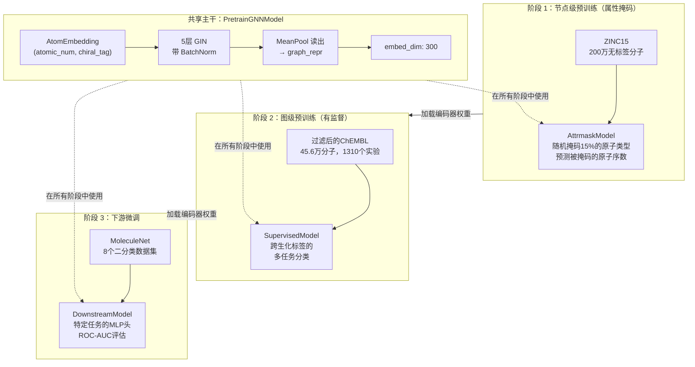
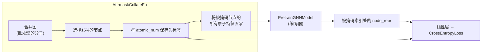
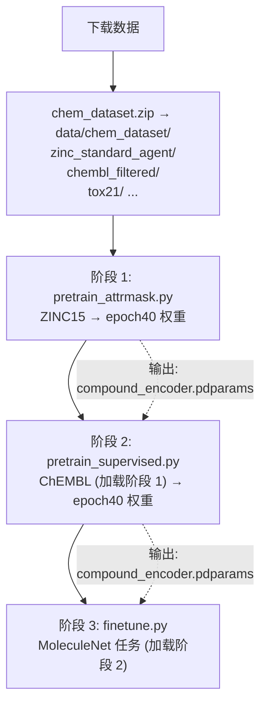
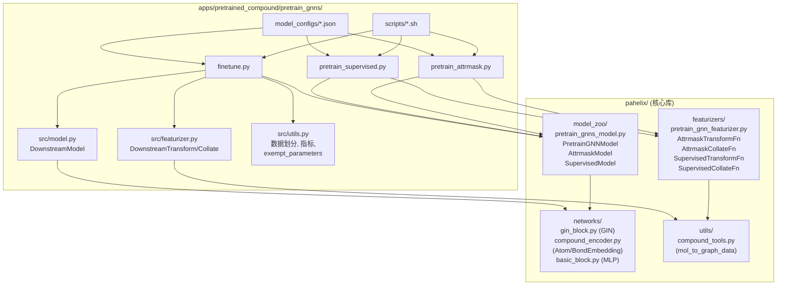

---
slug:12-pretrain-gnns-framework
blog_type:normal
---


PaddleHelix 中的 Pretrain-GNNs 框架是对 **"Strategies for Pre-training Graph Neural Networks"** (Hu et al., arXiv:1905.12265) 论文的复现，实现了一个用于分子属性预测的多阶段迁移学习流水线。它解决了药物发现中的一个根本挑战：标记分子数据的稀缺性。通过在节点和图级别的大规模无标签或弱标签分子数据集上预训练 GNN，然后在下游任务上进行微调，该框架捕获了丰富的化学领域知识，从而显著提高了在小规模特定任务数据集上的泛化能力。

## 架构概述

该框架遵循三阶段流水线——**节点级预训练**、**图级预训练**和**下游微调**——每个阶段都建立在前一个阶段的基础之上。一个共享的 `PretrainGNNModel` 编码器作为所有阶段的主干网络，在预训练期间附加特定于阶段的任务头，并在微调时将其替换为下游分类器。这种设计强制将表示学习（编码器）和特定任务预测（任务头）干净地分离开来。



## 核心编码器：PretrainGNNModel

`PretrainGNNModel` 是核心的架构组件，在核心库中定义为一个 PaddlePaddle 的 `nn.Layer`。它实现了一个基于 GIN（图同构网络）的消息传递架构，具有可配置的深度、归一化和读出策略。每个预训练和微调任务都使用特定于任务的头包装该编码器，以确保学习到的表示能够在各阶段之间干净地迁移。

来源：[pretrain_gnns_model.py](pahelix/model_zoo/pretrain_gnns_model.py#L31-L141)

### 构建与配置

编码器完全通过 `model_config` 字典进行配置，通常从 JSON 文件加载。`pregnn_paper.json` 配置复现了原论文中的架构：

| 参数 | 默认值 | 描述 |
|-----------|---------|-------------|
| `embed_dim` | 300 | 所有节点/边嵌入和隐藏层的维度 |
| `layer_num` | 5 | GIN 消息传递层的数量 |
| `gnn_type` | `"gin"` | GNN 主干类型（目前仅实现了 GIN） |
| `norm_type` | `"batch_norm"` | 逐层归一化（`"batch_norm"` 或 `"layer_norm"`） |
| `JK` | `"last"` | 跳跃知识模式：`"last"`、`"sum"` 或 `"mean"` |
| `readout` | `"mean"` | 图级池化策略 |
| `residual` | `false` | 是否在层之间添加残差连接 |
| `graph_norm` | `false` | 是否应用逐图归一化（GraphNorm） |
| `dropout_rate` | 0.5 | 在每个 GIN 层之后应用的 Dropout |
| `atom_names` | `["atomic_num", "chiral_tag"]` | 要编码的原子特征 |
| `bond_names` | `["bond_dir", "bond_type"]` | 要编码的键特征 |

来源：[pregnn_paper.json](apps/pretrained_compound/pretrain_gnns/model_configs/pregnn_paper.json#L1-L15), [PretrainGNNModel.__init__](pahelix/model_zoo/pretrain_gnns_model.py#L38-L96)

### 前向传播

前向传播遵循分层的消息传递模式。原子特征首先通过 `AtomEmbedding` 进行投影，然后通过 GIN 层进行迭代优化。每一层独立地嵌入边特征（允许每层有不同的键编码），应用 GIN 消息传递操作，接着进行批归一化、可选的图归一化、ReLU 激活（最后一层除外）和 Dropout。可选的残差连接将每层的输入添加到其输出中。在所有层之后，**跳跃知识（JK）**聚合策略将不同深度的表示结合起来——仅使用最后一层（`"last"`）、对所有层求和或取平均值。最后，池化操作（默认：均值）将节点表示降维为单个图级向量。

来源：[PretrainGNNModel.forward](pahelix/model_zoo/pretrain_gnns_model.py#L108-L141)

<CgxTip>
编码器暴露了两个属性——`node_dim` 和 `graph_dim`——两者都等于 `embed_dim`。任务头使用它们来正确设置线性投影的大小，从而使编码器-任务头的接口契约明确且类型安全。
</CgxTip>

## 阶段 1：节点级属性掩码

属性掩码是一种自监督预训练策略，旨在教导 GNN 从其局部图邻域预测被掩码的原子属性。这在概念上类似于 NLP 中的掩码语言建模（例如 BERT 的 MLM），但它作用于图结构的分子数据而不是序列。

### 属性掩码的工作原理

`AttrmaskCollateFn` 是包含掩码逻辑的地方。在通过 PGL 的 `Graph.batch()` 将单个分子图批处理为一个合并图之后，它随机选择所有节点中的 15%（可通过 `mask_ratio` 配置），将它们的 `atomic_num` 特征记录为标签，然后将这些节点的所有原子特征置零。置零的特征对应于 OOV（超出词表）标记，迫使 GNN 完全依赖结构上下文——即未掩码的相邻原子和连接键——来预测被掩码的内容。

来源：[AttrmaskCollateFn.__call__](pahelix/featurizers/pretrain_gnn_featurizer.py#L60-L96)

### AttrmaskModel

`AttrmaskModel` 使用一个单一的线性分类头包装 `PretrainGNNModel` 编码器。它使用 `paddle.gather` 在被掩码的索引处收集节点表示，通过一个大小为可能原子序数（外加 3 个附加特征）的线性层对其进行投影，并针对真实原子序数计算交叉熵损失。这是一个纯节点级任务——虽然计算了图级表示，但并未直接使用。

来源：[AttrmaskModel](pahelix/model_zoo/pretrain_gnns_model.py#L144-L168)

### 训练配置

属性掩码使用来自 ZINC15 数据库的 200 万个无标签分子。数据按 90/10 的比例划分为训练集/测试集，没有验证集划分。训练使用 Adam 优化器，学习率为 1e-3，批次大小为 256，Dropout 覆盖设置为 0.2（而不是编码器默认的 0.5）。编码器在每个 epoch 检查点处保存。

来源：[pretrain_attrmask.py main](apps/pretrained_compound/pretrain_gnns/pretrain_attrmask.py#L87-L149), [pretrain_attrmask.sh](apps/pretrained_compound/pretrain_gnns/scripts/pretrain_attrmask.sh#L12-L30)



## 阶段 2：图级有监督预训练

在节点级预训练之后，通过在过滤后的 ChEMBL 数据集（45.6 万个具有 1310 个多样化生化实验标签的分子）上进行图级多任务有监督预训练，进一步优化编码器。这一阶段教导编码器产生能够捕获分子功能属性的图级表示。

### SupervisedModel

`SupervisedModel` 使用不同的头包装同一个编码器：一个单一的线性层，将图表示投影到 `task_num` 个输出，随后是 `BCEWithLogitsLoss`（带 Logits 的二元交叉熵）。损失仅在有效标签上计算——由于并非每个分子都有所有 1310 个任务的标签，因此 `valids` 掩码确保缺失的标签不会对梯度产生贡献。有效损失为 `sum(loss * valids) / sum(valids)`，无论任务稀疏度如何，这都为每个观察到的标签赋予了相等的权重。

来源：[SupervisedModel](pahelix/model_zoo/pretrain_gnns_model.py#L171-L195)

### 训练流水线

有监督预训练**加载来自阶段 1 的编码器权重**（通常是第 40 个 epoch），创建一个热启动模型。为了提高效率，ChEMBL 数据被预处理并缓存为 `InMemoryDataset` NPZ 文件。训练使用相同的 Adam 优化器，学习率为 1e-3，批次大小为 256，共 41 个 epoch。完整模型和单独的编码器都会在每个 epoch 进行检查点保存。

来源：[pretrain_supervised.py main](apps/pretrained_compound/pretrain_gnns/pretrain_supervised.py#L88-L158), [pretrain_supervised.sh](apps/pretrained_compound/pretrain_gnns/scripts/pretrain_supervised.sh#L12-L31)

<CgxTip>
[src/utils.py](apps/pretrained_compound/pretrain_gnns/src/utils.py#L131-L143) 中的 `exempt_parameters` 工具函数在微调期间用于将编码器参数与任务头参数分离，从而实现**差分学习率**——编码器和预测头可以以不同的速率进行优化（`encoder_lr` 与 `head_lr`），这项技术有助于防止预训练表示的灾难性遗忘。
</CgxTip>

## 阶段 3：下游微调

微调使预训练的编码器适应来自 MoleculeNet 的特定分子属性预测任务。该框架支持 8 个二分类数据集：BACE、BBBP、ClinTox、HIV、MUV、SIDER、Tox21 和 ToxCast。

### DownstreamModel 架构

`DownstreamModel` 用一个可配置的 MLP 分类器替换了预训练头。它使用了 PaddleHelix 基础模块中的 `MLP` 块，支持可变深度。提供了两种配置：

| 配置 | `layer_num` | `hidden_size` | `act` | 描述 |
|--------|-------------|---------------|-------|-------------|
| `down_linear.json` | 1 | 256 | `relu` | 单层线性投影——极简任务头 |
| `down_mlp3.json` | 3 | 256 | `relu` | 3 层 MLP——更具表现力的任务头 |

输出通过 Sigmoid 激活进行概率预测，训练使用 `BCELoss`，并采用与有监督预训练相同的有效性掩码策略。

来源：[src/model.py DownstreamModel](apps/pretrained_compound/pretrain_gnns/src/model.py#L27-L56), [down_linear.json](apps/pretrained_compound/pretrain_gnns/model_configs/down_linear.json#L1-L6), [down_mlp3.json](apps/pretrained_compound/pretrain_gnns/model_configs/down_mlp3.json#L1-L6)

### 数据划分策略

微调通过 `--split_type` 参数支持多种数据划分策略，由 `create_splitter` 工具函数控制。**骨架划分**是默认且推荐的方法：它按 Bemis-Murcko 骨架对化合物进行排序，然后划分为训练集/验证集/测试集。这评估了模型对结构新颖分子的泛化能力——与随机划分相比，这是一个更现实且更具挑战性的场景，因为随机划分可能会导致结构信息在划分之间泄漏。

来源：[src/utils.py create_splitter](apps/pretrained_compound/pretrain_gnns/src/utils.py#L94-L107), [finetune.py main](apps/pretrained_compound/pretrain_gnns/finetune.py#L143-L148)

### 使用差分学习率进行微调

一个关键的实现细节是编码器和任务头参数的分离。`exempt_parameters` 函数计算完整模型参数与编码器参数之间的差集，从而仅得出任务头参数。创建了两个独立的 Adam 优化器——一个用于编码器（`encoder_lr=1e-3`），另一个用于任务头（`head_lr=1e-3`）。两者都在每次反向传播后进行步进更新，并且两者的梯度都会被清空。这种架构允许从业者例如完全冻结编码器（通过设置 `encoder_lr=0`），或者对编码器使用较小的学习率，以在更积极地适应任务头的同时保留预训练知识。

来源：[finetune.py main](apps/pretrained_compound/pretrain_gnns/finetune.py#L116-L126), [src/utils.py exempt_parameters](apps/pretrained_compound/pretrain_gnns/src/utils.py#L131-L143)

### 评估

评估使用 **ROC-AUC**（受试者工作特征曲线下面积），对数据集中的所有任务取平均值。`src/utils.py` 中的 `calc_rocauc_score` 函数计算每个任务的 AUC 分数，然后报告它们的平均值。微调循环在每个 epoch 跟踪验证集和测试集的 AUC，选择与最佳验证集 AUC 对应的测试集 AUC 作为最终报告的指标。

来源：[src/utils.py calc_rocauc_score](apps/pretrained_compound/pretrain_gnns/src/utils.py#L109-L129), [finetune.py evaluate](apps/pretrained_compound/pretrain_gnns/finetune.py#L69-L95)

## 特征化流水线

该框架使用两阶段的特征化流水线：一个将原始 SMILES 字符串转换为图数据的 `TransformFn`（按分子应用），以及一个将图数据批处理为带有特定任务处理的 PGL 合并图的 `CollateFn`。每个预训练阶段和微调阶段都有自己的一对转换和整理函数，所有这些都改编自原始的 Pretrain-GNNs 代码库。

来源：[pretrain_gnn_featurizer.py](pahelix/featurizers/pretrain_gnn_featurizer.py#L15-L163), [src/featurizer.py](apps/pretrained_compound/pretrain_gnns/src/featurizer.py#L16-L96)

| 阶段 | TransformFn | CollateFn | 关键行为 |
|-------|------------|-----------|--------------|
| Attrmask | `AttrmaskTransformFn` | `AttrmaskCollateFn` | 掩码 15% 的节点，返回被掩码的索引 + 标签 |
| Supervised | `SupervisedTransformFn` | `SupervisedCollateFn` | 返回标签（从 {-1,1} 映射到 {0,1}）+ 有效性掩码 |
| Downstream | `DownstreamTransformFn` | `DownstreamCollateFn` | 相同的标签映射，使用 `mol_to_md_graph_data`（设置 `add_3dpos=False`） |

整理函数共享一个通用模式：它们从每个数据样本构建独立的 `pgl.Graph` 对象（带有重塑的节点/边特征），通过 `Graph.batch()` 将它们批处理到单个 `pgl.Graph` 中，然后展平特征维度。这是在图数据上进行高效小批量训练的标准 PGL 模式。

<CgxTip>
[src/featurizer.py](apps/pretrained_compound/pretrain_gnns/src/featurizer.py#L45) 中的下游特征化器调用 `mol_to_md_graph_data`，而不是（预训练特征化器使用的）`mol_to_graph_data`。该函数接受一个设置为 `False` 的 `add_3dpos` 参数，这表明下游流水线被设计为可选地支持 3D 构象特征——尽管当前配置中并未启用此功能。
</CgxTip>

## 支持的数据集

该框架在三个类别的分子数据集上运行，每个类别在预训练流水线中扮演不同的角色：

### 预训练数据集

| 数据集 | 大小 | 标签 | 角色 |
|---------|------|--------|------|
| **ZINC15** (`zinc_standard_agent`) | 约 200 万分子 | 无（无标签） | 节点级属性掩码 |
| **过滤后的 ChEMBL** (`chembl_filtered`) | 45.6 万分子 | 1310 个生化实验 | 图级有监督预训练 |

### 下游数据集 (MoleculeNet)

| 数据集 | 评估任务 | 有效比例 | 领域 |
|---------|----------------|-------------|--------|
| **BACE** | 1/1 | 1.0 | β-分泌酶 1 抑制剂 |
| **BBBP** | 1/1 | 1.0 | 血脑屏障渗透性 |
| **ClinTox** | 2/2 | 1.0 | FDA 批准与临床毒性 |
| **HIV** | 1/1 | 1.0 | HIV 复制抑制 |
| **MUV** | 15–16/17 | 0.155–0.160 | 虚拟筛选基准 |
| **SIDER** | 27/27 | 1.0 | 药物副作用（27 个器官类别） |
| **Tox21** | 12/12 | 0.751–0.760 | 毒理学（核受体 + 应激反应） |
| **ToxCast** | 610/617 | 0.234–0.268 | 扩展毒理学高通量筛选 |

来源：[README.md Datasets](apps/pretrained_compound/pretrain_gnns/README.md#L280-L383)

## 端到端执行指南

完整的流水线按三个顺序阶段运行。以下流程图说明了完整的执行路径，包括阶段之间的数据依赖关系：



### 步骤 1：准备数据

```bash
mkdir -p data && cd data
wget http://snap.stanford.edu/gnn-pretrain/data/chem_dataset.zip
unzip chem_dataset.zip
```

### 步骤 2：节点级预训练（属性掩码）

```bash
cd apps/pretrained_compound/pretrain_gnns
CUDA_VISIBLE_DEVICES=0 python pretrain_attrmask.py \
    --batch_size=256 --num_workers=2 --max_epoch=100 \
    --lr=1e-3 --dropout_rate=0.2 \
    --data_path=../../../data/chem_dataset/zinc_standard_agent \
    --compound_encoder_config=model_configs/pregnn_paper.json \
    --model_config=model_configs/pre_Attrmask.json \
    --model_dir=../../../output/pretrain_gnns/pretrain_attrmask
```

来源：[pretrain_attrmask.sh](apps/pretrained_compound/pretrain_gnns/scripts/pretrain_attrmask.sh#L20-L30)

### 步骤 3：图级有监督预训练

此步骤加载来自阶段 1（第 40 个 epoch）的编码器，并在 ChEMBL 上继续训练：

```bash
CUDA_VISIBLE_DEVICES=0 python pretrain_supervised.py \
    --batch_size=256 --max_epoch=100 \
    --lr=1e-3 --dropout_rate=0.2 \
    --data_path=../../../data/chem_dataset/chembl_filtered \
    --compound_encoder_config=model_configs/pregnn_paper.json \
    --model_config=model_configs/pre_Supervised.json \
    --init_model=../../../output/pretrain_gnns/pregnn_paper-pre_Attrmask/epoch40/compound_encoder.pdparams \
    --model_dir=../../../output/pretrain_gnns/pretrain_supervised
```

来源：[pretrain_supervised.sh](apps/pretrained_compound/pretrain_gnns/scripts/pretrain_supervised.sh#L16-L30)

### 步骤 4：下游微调

```bash
CUDA_VISIBLE_DEVICES=0 python finetune.py \
    --batch_size=32 --max_epoch=100 \
    --dataset_name=tox21 --split_type=scaffold \
    --data_path=../../../data/chem_dataset/tox21 \
    --compound_encoder_config=model_configs/pregnn_paper.json \
    --model_config=model_configs/down_linear.json \
    --init_model=../../../output/pretrain_gnns/pregnn_paper-pre_Attrmask-pre_Supervised/epoch40/compound_encoder.pdparams \
    --model_dir=../../../output/pretrain_gnns/finetune/tox21 \
    --encoder_lr=1e-3 --head_lr=1e-3 --dropout_rate=0.2
```

来源：[finetune.sh](apps/pretrained_compound/pretrain_gnns/scripts/finetune.sh#L23-L42)

或者，可以直接下载预训练权重以跳过阶段 1–2：

```
https://baidu-nlp.bj.bcebos.com/PaddleHelix/pretrained_models/compound/pregnn-attrmask-supervised.zip
```

来源：[README.md Model link](apps/pretrained_compound/pretrain_gnns/README.md#L50-L50)

## 模块交互图

下图展示了核心库（`pahelix/`）和应用目录（`apps/`）中的文件在完整的预训练-微调生命周期中是如何交互的：



## 代码库结构

```
apps/pretrained_compound/pretrain_gnns/
├── pretrain_attrmask.py      # 阶段 1：节点级属性掩码
├── pretrain_supervised.py    # 阶段 2：图级有监督预训练
├── finetune.py               # 阶段 3：下游任务微调
├── model_configs/
│   ├── pregnn_paper.json     # GIN 编码器配置 (5 层, dim=300)
│   ├── pre_Attrmask.json     # 掩码比例配置 (0.15)
│   ├── pre_Supervised.json   # 有监督预训练配置 (空 = 默认值)
│   ├── down_linear.json      # 1 层下游任务头
│   └── down_mlp3.json        # 3 层下游任务头
├── src/
│   ├── model.py              # DownstreamModel (MLP 任务头 + 编码器)
│   ├── featurizer.py         # 下游转换/整理函数
│   └── utils.py              # 数据集加载、划分、评估指标
├── scripts/
│   ├── pretrain_attrmask.sh  # 一键执行阶段 1
│   ├── pretrain_supervised.sh# 一键执行阶段 2
│   └── finetune.sh           # 一键执行阶段 3 (全部 8 个数据集)
└── imgs/
    ├── pregnn.png            # 流水线概览图
    └── Evaluation_results.png# 基准结果可视化
```

## 关键设计模式

Pretrain-GNNs 框架体现了几种值得在此代码库基础上进行开发的开发者注意的迁移学习设计模式：

**编码器-任务头组合。** 每个任务模型（`AttrmaskModel`、`SupervisedModel`、`DownstreamModel`）都将 `PretrainGNNModel` 作为构造函数参数接收，而不是继承它。这种组合优于继承的模式意味着编码器可以独立替换——这在尝试不同 GNN 主干同时保持训练循环固定时非常有用。

**热启动链接。** 每个阶段都通过 `compound_encoder.set_state_dict(paddle.load(...))` 加载上一阶段的编码器权重。这创建了一个顺序的知识积累路径：ZINC 结构模式 → ChEMBL 功能属性 → 特定任务的分子属性。`init_model` 参数是可选的，可以设置为 `None` 以从头开始训练。

**双优化器微调。** `exempt_parameters` 函数通过从完整参数集中减去编码器参数来计算仅属于任务头的参数。这实现了独立的学习率控制，这对于预训练编码器通常比随机初始化的任务头受益于更低学习率的迁移学习来说至关重要。

来源：[finetune.py](apps/pretrained_compound/pretrain_gnns/finetune.py#L116-L126), [pretrain_attrmask.py](apps/pretrained_compound/pretrain_gnns/pretrain_attrmask.py#L112-L121), [pretrain_supervised.py](apps/pretrained_compound/pretrain_gnns/pretrain_supervised.py#L115-L124)

---

为了更深入地理解底层组件，请参阅本文档系列中的相关页面：[化合物编码器与嵌入层](9-compound-encoder-and-embedding-layers) 页面详细介绍了 `AtomEmbedding` 和 `BondEmbedding`，[GNN 模块与网络架构](10-gnn-blocks-and-network-architecture) 页面解释了 GIN 的实现，[化合物与蛋白质特征化器](8-compound-and-protein-featurizers) 页面描述了 `mol_to_graph_data` 转换工具。对于替代的化合物预训练方法，请参阅 [使用 GEM 进行化合物预训练](11-compound-pretraining-with-gem)。