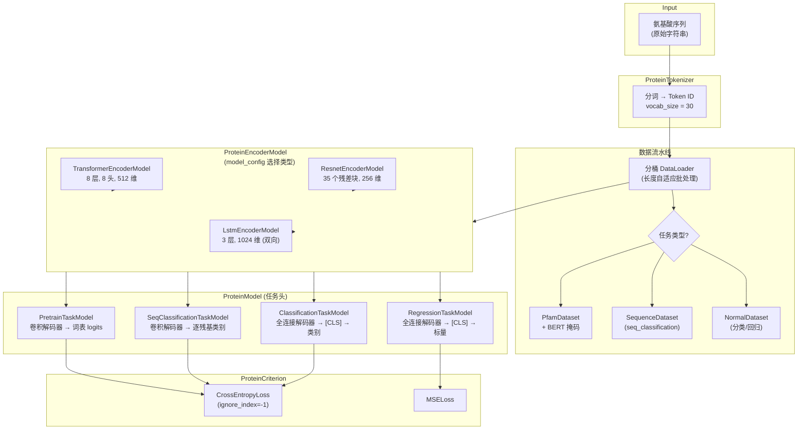
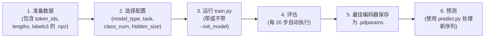

---
slug:13-protein-pretraining-with-tape
blog_type:normal
---


本页文档记录了 PaddleHelix 对 **TAPE**（Tasks Assessing Protein Embeddings，蛋白质嵌入评估任务）的实现。该框架通过在氨基酸序列上进行自监督预训练来学习通用的蛋白质表示，随后将其迁移至下游生物学任务。该实现提供了三种可互换的编码器架构（Transformer、ResNet、LSTM）、一个 BERT 风格的掩码语言建模预训练目标，以及一个支持四种不同下游任务头的统一模型接口。无论你需要逐残基的二级结构预测，还是全蛋白质分类，TAPE 流水线都提供了一个单一的、可组合的架构，用于训练、微调和预测。

## 架构概览

TAPE 实现遵循清晰的编码器-解码器分离模式。**编码器**学习氨基酸序列的上下文表示，而可互换的**任务头**将这些表示映射到特定的输出格式。这种解耦意味着，单个预训练编码器可以在几乎不改变架构的情况下，迁移到截然不同的下游任务中。



简而言之，该系统解决了三个核心问题：**序列如何变为张量**、**张量如何变为表示**，以及**表示如何变为预测**。每个问题都映射到一个具有清晰接口边界的独立模块。

来源：[protein_sequence_model.py](/PaddlePaddle/PaddleHelix/blob/dev/pahelix/model_zoo/protein_sequence_model.py#L393-L434)、[protein_tools.py](/PaddlePaddle/PaddleHelix/blob/dev/pahelix/utils/protein_tools.py#L22-L70)、[data_gen.py](/PaddlePaddle/PaddleHelix/blob/dev/apps/pretrained_protein/tape/data_gen.py#L46-L62)

## 蛋白质分词器与词表

所有模型都消耗由 `ProteinTokenizer` 生成的整数 Token ID。该类定义了一个固定大小为 **30 个 Token** 的词表：5 个特殊 Token（`<pad>`、`<mask>`、`<cls>`、`<sep>`、`<unk>`）加上 25 种标准和扩展的氨基酸单字母代码。分词器在字符级别运行——每个氨基酸字母直接映射到一个 Token ID。

| Token | 符号 | ID |
|-------|--------|----|
| 填充 | `<pad>` | 0 |
| 掩码 | `<mask>` | 1 |
| 类别 / 起始 | `<cls>` | 2 |
| 分隔符 / 结束 | `<sep>` | 3 |
| 未知 | `<unk>` | 4 |
| 丙氨酸 | `A` | 5 |
| 半胱氨酸 | `C` | 7 |
| 亮氨酸 | `L` | 15 |
| ... | ... | ... |
| 酪氨酸 | `Y` | 28 |
| 谷氨酸 / 谷氨酰胺 | `Z` | 29 |

`gen_token_ids` 方法在将原始序列转换为 ID 之前，会用 `<cls>` 和 `<sep>` Token 对其进行包装，为输入 `"ALC..."` 生成类似 `[2, 5, 15, 7, ..., 3]` 的格式。无法识别的字符会静默映射到 `unknown_token_id` (4)，这使得分词器能够稳健地处理真实数据中的非标准残基。

来源：[protein_tools.py](/PaddlePaddle/PaddleHelix/blob/dev/pahelix/utils/protein_tools.py#L22-L129)

## 用于预训练的 BERT 风格掩码

预训练目标采用了与 NLP 中驱动 BERT 相同的掩码语言建模（MLM）策略。`language_model_tools.py` 中的 `apply_bert_mask` 函数实现了经典的三路掩码方案：对于每个位置，如果被选中进行掩码处理（15% 的概率，并遵循填充掩码），则有 80% 的概率将 Token 替换为 `<mask>`，10% 的概率替换为随机词表 Token，还有 10% 的概率保持不变。标签张量在掩码位置存储原始 Token ID，在所有其他位置存储 `-1`，而 `CrossEntropyLoss(ignore_index=-1)` 损失函数会静默忽略这些 `-1`。

| 场景 | 概率 | 操作 |
|----------|-------------|--------|
| 选中掩码 (占 15%) | 15% 的 80% = 12% | 替换为 `<mask>` Token |
| 选中掩码 (占 15%) | 15% 的 10% = 1.5% | 替换为随机 Token |
| 选中掩码 (占 15%) | 15% 的 10% = 1.5% | 保留原始 Token |
| 未选中 | 85% | 保留原始 Token |

这种三路策略至关重要：它迫使模型既要恢复正确的 Token，又要为未掩码的位置生成有意义的表示，从而防止模型仅仅依赖浅层的 `<mask>` 到 Token 的查找。

来源：[language_model_tools.py](/PaddlePaddle/PaddleHelix/blob/dev/pahelix/utils/language_model_tools.py#L23-L54)、[data_gen.py](/PaddlePaddle/PaddleHelix/blob/dev/apps/pretrained_protein/tape/data_gen.py#L95-L108)

## 编码器架构

`ProteinEncoderModel` 是一个工厂类，它根据配置 JSON 中的 `model_type` 字段选择实际的编码器。提供三种架构，每种架构都具有适用于蛋白质序列结构不同方面的独特归纳偏置。

### Transformer 编码器

`TransformerEncoderModel` 是默认且最具表现力的选项。它结合了 Token 嵌入和位置嵌入（最大位置长度为 3000），应用 LayerNorm，然后通过 8 个堆叠的 `TransformerEncoderLayer` 模块，这些模块具有 8 个注意力头、GELU 激活函数，以及前馈维度为 `hidden_size × 4`（默认为 2048）。注意力掩码由填充位置构建：填充 Token 会获得一个较大的负值（`-1e9`），以将其注意力权重归零。

关键超参数：`emb_dim=512`、`hidden_size=512`、`n_layers=8`、`n_heads=8`、`dropout_rate=0.1`。权重初始化遵循正态分布，线性和嵌入层的 `std=0.02`，LayerNorm 的 `epsilon=1e-12`。

来源：[protein_sequence_model.py](/PaddlePaddle/PaddleHelix/blob/dev/pahelix/model_zoo/protein_sequence_model.py#L173-L235)

### ResNet 编码器

`ResnetEncoderModel` 将计算机视觉中的残差网络范式改编用于一维蛋白质序列。在 Token 加位置嵌入（乘以 `√hidden_size` 缩放）之后，一个单独的带填充的卷积层将嵌入维度投影到隐藏维度，随后是 35 个残差块。第一个块使用 `dilation=1`；其余 34 个块使用 `dilation=2`，从而有效地扩大感受野。每个 `ResnetBasicBlock` 包含两条 Conv1D→BatchNorm→GELU→Dropout 路径及一条跳跃连接。卷积核大小默认为 9，这大约可以在每次卷积操作中捕获一个 α-螺旋的圈数——这是一个具有生物学依据的选择。

关键超参数：`emb_dim=128`、`hidden_size=256`、`kernel_size=9`、`n_layers=35`、`dropout_rate=0.1`。与 Transformer 相比，较低的隐藏维度使得该架构在处理极长序列时显著节省内存。

来源：[protein_sequence_model.py](/PaddlePaddle/PaddleHelix/blob/dev/pahelix/model_zoo/protein_sequence_model.py#L60-L171)

### LSTM 编码器

`LstmEncoderModel` 使用 3 层双向 LSTM 提供了一个循环基线。它是最简单的架构，超参数也最少：`emb_dim=128`、`hidden_size=1024`、`n_layers=3`。由于是双向的，消费它的任务头接收的输入通道数为 `hidden_size × 2`。该编码器不使用位置嵌入——循环结构本身就能捕获序列顺序。

来源：[protein_sequence_model.py](/PaddlePaddle/PaddleHelix/blob/dev/pahelix/model_zoo/protein_sequence_model.py#L24-L58)

### 编码器对比

| 特性 | Transformer | ResNet | LSTM |
|---------|-------------|--------|------|
| 默认隐藏维度 | 512 | 256 | 1024 (单方向) |
| 深度 | 8 层 | 35 个残差块 | 3 层 |
| 位置编码 | 可学习嵌入 | 可学习嵌入 | 隐式 (循环) |
| 感受野 | 全局 (自注意力) | 通过空洞卷积扩大 | 序列化 |
| 双向性 | 是 (注意力) | 是 (卷积) | 是 (双向) |
| 实际输出维度 | hidden_size | hidden_size | hidden_size × 2 |
| 最适用场景 | 丰富的上下文建模 | 长序列 | 基线 / 小数据量 |

来源：[protein_sequence_model.py](/PaddlePaddle/PaddleHelix/blob/dev/pahelix/model_zoo/protein_sequence_model.py#L393-L434)

## 任务头与下游任务

`ProteinModel` 用特定于任务的头包装编码器，由配置中的 `task` 字段进行选择。每个头定义了自己的解码器架构和损失函数，但都共享相同的编码器前向传播签名：`(input, pos) → encoder_output`。

### 预训练任务（掩码语言建模）

`PretrainTaskModel` 在编码器之上添加了一个两层卷积解码器：Conv1D(→128, kernel=5) → ReLU → Conv1D(→vocab_size, kernel=3)。输出的形状为 `[batch, seq_len, vocab_size]`，用于预测每个位置上的原始 Token。损失为 `CrossEntropyLoss(ignore_index=-1)`，仅在掩码位置计算。

### 序列分类（逐残基预测）

`SeqClassificationTaskModel` 使用与预训练头相同的解码器结构，但为每个残基输出 `class_num` 个 logits。这是用于**二级结构预测**（3 类：螺旋、折叠、卷曲）的头。损失同样使用 `CrossEntropyLoss(ignore_index=-1)` 来处理可变长度的填充。请注意，在 `predict.py` 的输出中，实现会提取位置 1 到 len(sequence) 的预测结果，去除了 `<cls>` 和 `<sep>` 包装 Token。

### 分类（全蛋白质预测）

`ClassificationTaskModel` 获取位置 0 处的编码器输出（即 `<cls>` Token 嵌入），并将其通过一个两层全连接网络：Linear(→512) → ReLU → Linear(→class_num)。这个头专为**远程同源检测**等任务设计，在这些任务中，单个标签适用于整个蛋白质。损失为 `CrossEntropyLoss(ignore_index=-1)`。

### 回归（全蛋白质连续值）

`RegressionTaskModel` 镜像了分类头的架构，但通过 Linear(→hidden_size) → ReLU → Linear(→1) 输出单个标量。它以相同的方式提取 `<cls>` Token 表示。损失为 `MSELoss`，用于**蛋白质荧光预测**或**稳定性预测**等任务。

来源：[protein_sequence_model.py](/PaddlePaddle/PaddleHelix/blob/dev/pahelix/model_zoo/protein_sequence_model.py#L238-L494)、[predict.py](/PaddlePaddle/PaddleHelix/blob/dev/apps/pretrained_protein/tape/predict.py#L20-L38)

## 数据流水线与分桶批处理

数据流水线实现了一种复杂的**分桶批处理**策略，该策略按近似长度对序列进行分组，以最大程度地减少填充浪费。在 `data_gen.py` 中，有两个数组定义了该系统：`boundaries = [100, 200, 300, 400, 600, 900, 1000, 1200, 1300, 2000, 3000]` 及其对应的 `batch_sizes = [160, 160, 128, 96, 64, 32, 24, 16, 16, 8, 1, 1]`。较短的序列会进行更大批量的批处理（每批最多 160 个），而极长的序列（超过 3000 个残基）则形成单例批次。

三个 `IterableDataset` 子类用于处理不同的任务：

- **PfamDataset** (pretrain)：加载包含拼接的 `token_ids` 和每个序列的 `lengths` 的 `.npz` 文件。在分桶并填满一个桶后，它会调用 `_do_pad_mask`，该函数将序列填充到该桶的最大长度，应用 BERT 掩码，并生成 `(masked_token_ids, seq_len, pos, labels)` 元组。
- **SequenceDataset** (seq_classification)：加载方式类似，但保留来自命名数组（例如 `labels3`）的逐残基标签。不应用掩码。
- **NormalDataset** (classification/regression)：加载每个序列的标量标签，并应用基于长度的分桶，而不进行逐残基标签的填充。

`create_dataloader` 工厂函数检查模型配置中的 `task` 字段并实例化适当的数据集类，将其包装在带有 `collate_fn` 的 `paddle.io.DataLoader` 中，以处理动态填充和标签类型转换。

来源：[data_gen.py](/PaddlePaddle/PaddleHelix/blob/dev/apps/pretrained_protein/tape/data_gen.py#L38-L279)

## 训练流水线

训练脚本（`train.py`）实现了一个基于步数的评估循环，具有以下关键特征：

**优化器设置**：AdamW，`lr=1e-4`，`epsilon=1e-6`，`weight_decay=0.01`。权重衰减是选择性应用的——偏置和归一化参数被明确排除在衰减之外，这是防止类 Transformer 模型训练不稳定的标准做法。应用了基于全局范数的梯度裁剪（`clip_norm=1.0`）。

**评估频率**：每 20 步（`steps_per_epoch = 20`），模型会运行一次完整的验证。每当验证损失有所改善时，编码器权重和完整模型权重都会作为单独的 `.pdparams` 文件保存——这种分离对于下游迁移学习至关重要，因为后者只需要编码器（不需要任务头）。

**预训练权重加载**：`--init_model` 和 `--hot_start` 标志控制现有权重的加载方式。当 `hot_start='hot_start'` 时，将加载完整的模型状态字典（编码器 + 任务头）。否则，仅加载编码器状态字典，从而能够在新的下游任务上从预训练检查点进行微调。这就是驱动 TAPE 核心的“预训练 → 微调”迁移范式的机制。

**分布式训练**：该脚本通过 `--is_distributed` 标志支持 PaddlePaddle 的 `fleet` 分布式策略，用于多 GPU 训练。

来源：[train.py](/PaddlePaddle/PaddleHelix/blob/dev/apps/pretrained_protein/tape/train.py#L53-L170)

## 评估指标

指标模块提供了三个特定于任务的评估类，每个类在周期性的 `show()` 调用之间跟踪适当的统计数据：

| 指标类 | 任务 | 跟踪值 |
|-------------|------|----------------|
| `PretrainMetric` | pretrain | 准确率，困惑度 (平均交叉熵的指数) |
| `ClassificationMetric` | seq_classification, classification | 准确率 (忽略填充) |
| `RegressionMetric` | regression | 均方误差 (MSE)，Spearman 秩相关系数 |

所有指标类都实现了 `clear()`、`update(pred, label, loss)` 和 `show()` 方法。`get_metric(task)` 工厂函数将任务字符串映射到正确的指标实例。

来源：[metrics.py](/PaddlePaddle/PaddleHelix/blob/dev/apps/pretrained_protein/tape/metrics.py#L17-L150)

## 配置系统

每个实验由一个 JSON 配置文件驱动，该文件指定了模型架构和任务。提供的示例虽然极简但具有良好的可扩展性：

**Transformer 二级结构配置** (`configs/transformer_secondary_structure_config.json`)：
```json
{
    "model_name": "secondary_structure",
    "task": "seq_classification",
    "class_num": 3,
    "label_name": "labels3",
    "model_type": "transformer",
    "hidden_size": 512
}
```

**ResNet 二级结构配置** (`configs/resnet_secondary_structure_config.json`)：
```json
{
    "model_name": "secondary_structure",
    "task": "seq_classification",
    "class_num": 3,
    "label_name": "labels3",
    "model_type": "resnet",
    "hidden_size": 256
}
```

配置支持 `ProteinEncoderModel` 带有默认值读取的其他可选键：`emb_dim`（默认 512）、`n_layers`（默认 8）、`n_heads`（默认 8）、`kernel_size`（ResNet 默认为 9）。`task` 字段必须是以下之一：`pretrain`、`seq_classification`、`classification` 或 `regression`。`label_name` 字段告诉数据流水线从 `.npz` 文件中提取哪个数组作为标签。

<CgxTip>
`model_type` 和 `hidden_size` 是两个最具影响力的配置字段。从 `transformer` (512 维) 切换到 `resnet` (256 维) 大约会将内存使用量减半，从而能够在更长的序列或更小的 GPU 上进行训练。当从预训练编码器进行微调时，请确保 `model_type` 和 `hidden_size` 与预训练配置匹配——编码器权重是特定于架构的。
</CgxTip>

来源：[transformer_secondary_structure_config.json](/PaddlePaddle/PaddleHelix/blob/dev/apps/pretrained_protein/tape/configs/transformer_secondary_structure_config.json)、[resnet_secondary_structure_config.json](/PaddlePaddle/PaddleHelix/blob/dev/apps/pretrained_protein/tape/configs/resnet_secondary_structure_config.json)、[protein_sequence_model.py](/PaddlePaddle/PaddleHelix/blob/dev/pahelix/model_zoo/protein_sequence_model.py#L397-L434)

## 快速开始：二级结构预测

该代码库附带了一个玩具数据集，以及用于 Transformer 和 ResNet 训练的即用型 Shell 脚本。以下流程图总结了端到端的过程：



### 步骤 1 — 从头训练 ResNet 模型

```bash
cd apps/pretrained_protein/tape
export PYTHONPATH="../../../"
bash scripts/run_resnet_secondary_structure_train.sh
```

这将使用 ResNet 配置、玩具数据和 GPU 加速来运行 `train.py`。训练循环每 20 步评估一次，并将最佳编码器保存到 `models/epoch_best_encoder.pdparams`。

### 步骤 2 — 训练 Transformer 模型

```bash
bash scripts/run_transformer_secondary_structure_train.sh
```

过程相同，只是替换为具有更大隐藏维度的 Transformer 架构。

### 步骤 3 — 从预训练编码器进行微调

```bash
python train.py \
    --train_data ./secondary_structure_data/ \
    --valid_data ./secondary_structure_data/ \
    --model_config ./configs/transformer_secondary_structure_config.json \
    --init_model ./pretrained_models/transformer_encoder.pdparams \
    --hot_start not_hot_start \
    --use_cuda
```

设置 `--hot_start not_hot_start` 会触发仅加载编码器权重的路径，在随机初始化任务头的同时固定编码器的初始化状态。

### 步骤 4 — 对新序列进行预测

```bash
python predict.py \
    --predict_data ./demo_animo_acid_sequences \
    --model_config ./configs/transformer_secondary_structure_config.json \
    --predict_model ./models/epoch_best.pdparams \
    --use_cuda
```

预测脚本读取原始氨基酸序列（每行一个），用 `<cls>` 和 `<sep>` 包装器对其进行分词，填充到批次最大长度，并打印逐残基的类别预测结果。

来源：[run_resnet_secondary_structure_train.sh](/PaddlePaddle/PaddleHelix/blob/dev/apps/pretrained_protein/tape/scripts/run_resnet_secondary_structure_train.sh)、[run_transformer_secondary_structure_train.sh](/PaddlePaddle/PaddleHelix/blob/dev/apps/pretrained_protein/tape/scripts/run_transformer_secondary_structure_train.sh)、[predict.py](/PaddlePaddle/PaddleHelix/blob/dev/apps/pretrained_protein/tape/predict.py#L41-L87)

<CgxTip>
训练脚本在每次验证改善的检查点处，会**同时**保存完整模型（`epoch_best.pdparams`）和仅编码器权重（`epoch_best_encoder.pdparams`）。对于下游迁移，请始终使用仅编码器文件——将完整模型加载到不同的任务头中会引发形状不匹配错误，因为不同任务之间的解码器层是不同的。
</CgxTip>

## 文件结构参考

```
apps/pretrained_protein/tape/
├── configs/
│   ├── resnet_secondary_structure_config.json    # 用于 3 类 SS 的 ResNet 配置
│   └── transformer_secondary_structure_config.json # 用于 3 类 SS 的 Transformer 配置
├── scripts/
│   ├── run_resnet_secondary_structure_train.sh     # 一键 ResNet 训练脚本
│   └── run_transformer_secondary_structure_train.sh # 一键 Transformer 训练脚本
├── data_gen.py          # 分桶 DataLoader + BERT 掩码
├── train.py             # 带有评估和检查点的训练循环
├── eval.py              # 独立评估脚本 (分布式)
├── predict.py           # 对原始序列文件的推理
├── metrics.py           # PretrainMetric, ClassificationMetric, RegressionMetric
├── demo_animo_acid_sequences  # 预测的示例输入
└── secondary_structure_toy_data/ # 用于快速验证的玩具 .npz 数据集
```

来源：[tape 目录](/PaddlePaddle/PaddleHelix/blob/dev/apps/pretrained_protein/tape/)

## 后续步骤

- **[使用 GEM 进行化合物预训练](11-compound-pretraining-with-gem)** 探索了用于小分子图的类似预训练范式——这是在构建药物-靶点相互作用模型时，对蛋白质序列预训练的天然补充。
- **[药物-靶点相互作用模型](14-drug-target-interaction-models)** 展示了如何将预训练的蛋白质编码器与化合物编码器组合，用于下游 DTI 预测任务。
- **[InMemoryDataset 与数据流水线](7-inmemorydataset-and-data-pipeline)** 深入介绍了 PaddleHelix 在所有应用领域使用的核心数据集抽象。