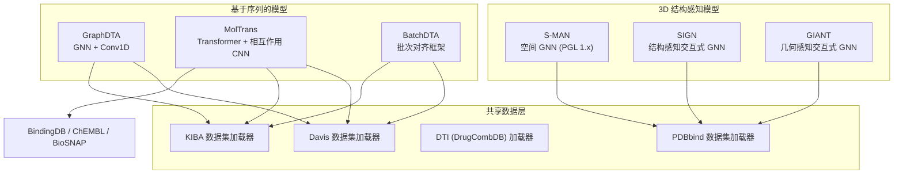
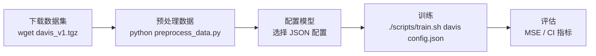
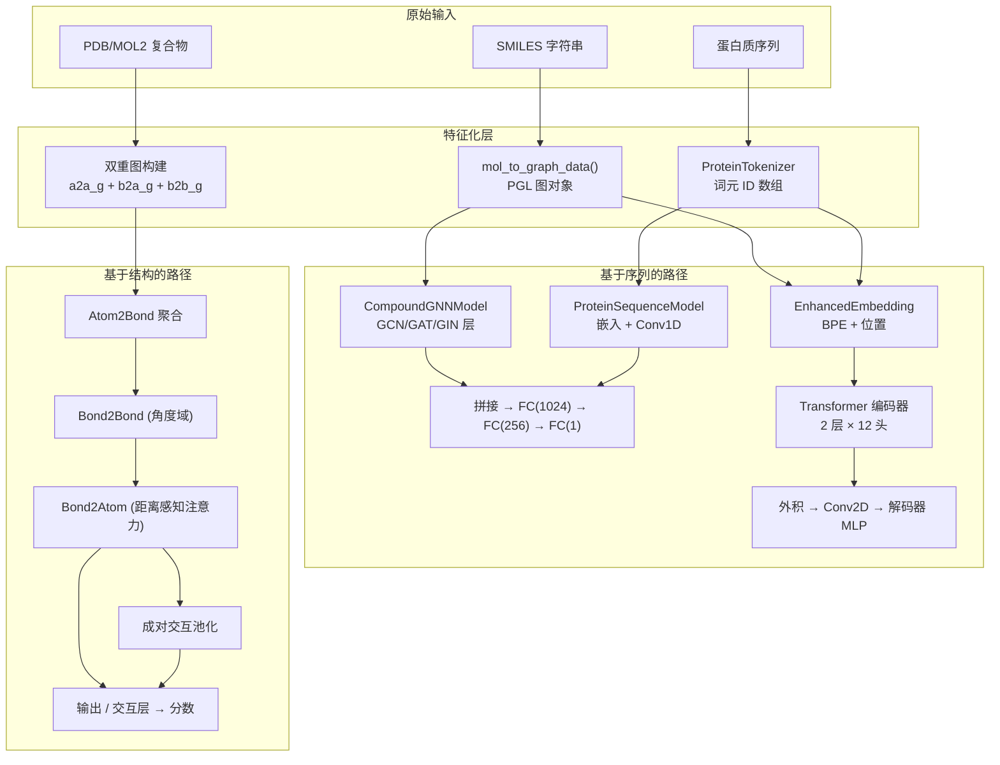

---
slug:14-drug-target-interaction-models
blog_type:normal
---


预测药物如何与其靶点蛋白相互作用，是计算药物发现领域中具有最重大实际影响的任务之一。PaddleHelix 提供了一套包含七个 DTI 模型的完整工具集，涵盖了从基于序列的亲和力回归到 3D 结构感知的相互作用评分的全范围。本文档详细介绍了它们的架构、共享基础设施以及实际使用模式，旨在帮助你掌握选择并训练适合自身问题的模型所需的知识。

## DTI 模型全景图

`apps/drug_target_interaction/` 目录下包含七种不同的实现，每种实现都从不同的表征角度解决结合亲和力预测问题。理解它们之间的分类关系，是选择合适工具的第一步。

来源：[README.md](apps/drug_target_interaction/README.md#L1-L12)



这些模型可以根据其输入模态分为两大类。**基于序列的模型**接受药物的 SMILES 字符串和蛋白质的氨基酸序列作为输入，使其在缺乏 3D 结构的情况下仍能大规模应用。**结构感知模型**则处理从 PDB 文件中提取的蛋白-配体复合物，通过引入空间几何信息来实现更高保真度的预测，但代价是需要结构化数据。

<CgxTip>
在基于序列的模型和结构感知模型之间做出选择，归根结底是一个数据可用性的问题。如果你拥有 3D 蛋白-配体复合物结构（来自 PDBbind、CSAR-HiQ 或分子对接模拟），SIGN 和 GIANT 等模型将利用这些几何信息提供更卓越的准确性。如果你只有 SMILES 和蛋白质序列，那么 GraphDTA、MolTrans 和 BatchDTA 是你的可选方案。
</CgxTip>

## 模型架构深入解析

DTI 工具集中的每个模型都遵循独特的架构理念。下表提供了高层级的对比；后续部分将详细剖析其中三种最具代表性的架构。

| 模型 | 药物编码器 | 蛋白质编码器 | 相互作用模块 | 输入模态 | Paddle 版本 |
|:------|:-------------|:-----------------|:-------------------|:---------------|:---------------|
| **GraphDTA** | GNN (GCN/GAT/GIN) | 1D 卷积 | 拼接 + MLP | SMILES + 序列 | ≥ 2.0 |
| **MolTrans** | BPE 子词嵌入 | BPE 子词嵌入 | Transformer + 交叉 CNN | SMILES + 序列 | ≥ 2.0 |
| **BatchDTA** | DeepDTA/GraphDTA/MolTrans | DeepDTA/GraphDTA/MolTrans | 成对批次对齐 | SMILES + 序列 | ≥ 2.0 |
| **S-MAN** | 空间图注意力 | 空间图 (边到边) | 池化 + MLP | 3D 复合物 | 1.8.4 (fluid API) |
| **SIGN** | Atom2Bond→Bond2Bond→Bond2Atom | 通过空间边集成 | Pi-Pool + MLP | 3D 复合物 | ≥ 2.1.0 |
| **GIANT** | 几何感知 Bond2Bond | 几何感知 Bond2Atom | 交互式输出 | 3D 复合物 | ≥ 2.1.0 |

### GraphDTA：结合蛋白质卷积的 GNN 变体

GraphDTA 是基于序列的模型族中模块化程度最高的模型。它将药物编码为分子图，通过可配置的 GNN 层（GCN、GAT、GIN 或混合的 GAT-GCN）进行处理，并通过在分词后的氨基酸序列上进行一维卷积来编码蛋白质。这两种表征被拼接后，送入一个三层 MLP 回归器。

来源：[model.py](apps/drug_target_interaction/graph_dta/src/model.py#L27-L154)、[model.py](apps/drug_target_interaction/graph_dta/src/model.py#L155-L207)、[model.py](apps/drug_target_interaction/graph_dta/src/model.py#L209-L243)

[model.py](apps/drug_target_interaction/graph_dta/src/model.py#L27-L154) 中的 `CompoundGNNModel` 类是核心的药物编码器。它首先通过 pahelix 工具包中的 `AtomEmbedding` 嵌入原子特征，将其与数值型原子特征（如原子序数、手性）拼接，然后堆叠 GNN 消息传递层。GNN 类型完全可以通过 JSON 配置，在 `pgl.nn.GCNConv`、`pgl.nn.GATConv` 和 `pgl.nn.GINConv` 实现之间切换。消息传递后，图级池化（GCN/GAT 使用最大池化，GIN 使用求和池化，GAT-GCN 混合模型使用最大+平均组合池化）生成固定大小的药物表征。

[model.py](apps/drug_target_interaction/graph_dta/src/model.py#L155-L207) 中的 `ProteinSequenceModel` 通过 `ProteinTokenizer` 对蛋白质序列进行分词，将其嵌入到 128 维空间中，并应用核大小为 8 的一维卷积。一个关键配置参数是 `max_protein_len`：当设置为 -1 时，模型在序列长度上使用平均池化（以适应可变长度的蛋白质）；当设置为正整数时，它会将输出重塑为固定长度的向量。

[model.py](apps/drug_target_interaction/graph_dta/src/model.py#L209-L243) 中的 `DTAModel` 将所有部分整合在一起：

```python
# Simplified from DTAModel.forward()
compound_repr = self.compound_model(graph)          # GNN output: [batch, output_dim]
protein_repr = self.protein_model(token, mask)      # Conv1D output: [batch, output_dim]
compound_protein = paddle.concat([compound_repr, protein_repr], axis=1)
h = self.dropout(self.act(self.fc1(compound_protein)))  # [batch, 1024]
h = self.dropout(self.act(self.fc2(h)))                   # [batch, 256]
pred = self.fc3(h)                                         # [batch, 1]
```

训练过程通过 `DTAModelCriterion` 使用 MSE 损失。配置完全由 JSON 驱动——例如，[gcn_config.json](apps/drug_target_interaction/graph_dta/model_configs/gcn_config.json#L1-L24) 指定了三个具有 256 个隐藏单元的 GCN 层、32 维的原子嵌入，以及化合物和蛋白质编码器均为 128 维的输出。

**在 Davis 数据集上的基准性能：**

| GNN 变体 | MSE ↓ | CI ↑ |
|:-----------|:------|:-----|
| GCN | 0.251 | 0.888 |
| GAT | 0.250 | 0.887 |
| GAT-GCN | 0.244 | 0.885 |
| GIN | 0.242 | 0.889 |

来源：[README.md](apps/drug_target_interaction/graph_dta/README.md#L100-L109)

### MolTrans：基于 Transformer 且具备交互能力的双塔模型

MolTrans 采用了一种根本不同的方法：它没有使用图神经网络来处理药物，而是通过字节对编码（BPE）将药物和蛋白质都分词为子词单元，分别通过独立的 Transformer 编码器进行处理，然后通过外积操作捕获它们的相互作用，最后经由 CNN 和 MLP 解码器输出结果。

来源：[double_towers.py](apps/drug_target_interaction/moltrans_dti/double_towers.py#L32-L120)、[config.json](apps/drug_target_interaction/moltrans_dti/config.json#L1-L15)

[double_towers.py](apps/drug_target_interaction/moltrans_dti/double_towers.py#L32-L120) 中的 `MolTransModel` 类实现了完整的流程。每个输入塔都以 `EnhancedEmbedding` 开始，它将词元嵌入与位置嵌入结合，并应用 Dropout。编码器堆叠了两个具有 12 个注意力头和 384 维隐藏状态的 Transformer 编码器层。关键的创新在于交互模块：MolTrans 并非简单地拼接表征，而是计算药物和靶标编码器输出的逐元素外积，生成一个形状为 `[batch, drug_max_seq, target_max_seq]` 的 2D 相互作用图。该图在隐藏维度上求和，通过 2D 卷积（3×3 核，3 个输出通道），展平后，通过逐级递进的 MLP 进行解码：`81750 → 512 → 64 → 32 → 1`。

来源：[config.json](apps/drug_target_interaction/moltrans_dti/config.json#L1-L15)

[config.json](apps/drug_target_interaction/moltrans_dti/config.json#L1-L15) 揭示了模型的规模：药物序列上限为 50 个子词词元（来自 23,532 个词元的词汇表），蛋白质序列上限为 545 个词元（来自 16,693 个词元的词汇表），中间的 Transformer 使用 1,536 维的前馈层。`vocabulary/` 目录中提供了药物（源自 ChEMBL/BindingDB）和蛋白质（源自 UniProt）子词的 BPE 词汇表文件。

MolTrans 独特地支持**分类**任务（通过 `train_cls.py`）和**回归**任务（通过 `train_reg.py``）。在 DAVIS 分类基准测试中，它达到了 0.912 的 AUROC——超过了所有基线模型，包括 DeepConv-DTI (0.884) 和最初的 MolTrans 论文 (0.907) 的结果。

来源：[README.md](apps/drug_target_interaction/moltrans_dti/README.md#L1-L200)

### SIGN 和 GIANT：结构感知图神经网络

对于有 3D 蛋白-配体复合物结构可用的场景，SIGN 和 GIANT 在根本上运作于更丰富的抽象层级。这两个模型都从复合物中构建了双重图表示：一个编码共价键和空间邻近性的原子到原子图，以及一个捕获键之间角度关系的键到键图。

来源：[model.py](apps/drug_target_interaction/sign/model.py#L23-L81)、[model.py](apps/drug_target_interaction/giant/model.py#L21-L77)

**SIGN** ([sign/model.py](apps/drug_target_interaction/sign/model.py#L23-L81)) 实现了来自 KDD 2021 的“结构感知交互式图神经网络”架构。其前向传播在每一层循环通过三个消息传递阶段：`Atom2BondLayer` 将原子特征聚合到键上，`Bond2BondLayer` 使用 `DomainAttentionLayer` 在按角度域分组的键之间传播信息，而 `Bond2AtomLayer` 则利用距离感知的多头注意力将键信息聚合回原子。随后，`PiPoolLayer` 对键类型执行成对交互池化以预测相互作用矩阵，而 `OutputLayer` 将原子特征映射为最终的结合亲和力分数。

来源：[layers.py](apps/drug_target_interaction/sign/layers.py#L39-L286)

**GIANT** ([giant/model.py](apps/drug_target_interaction/giant/model.py#L21-L77)) 通过 `GemotryInputLayer` 扩展了这一范式，该层编码了距离特征（通过径向基函数）和角度特征。其 `InteractiveOutputLayer` 超越了 SIGN 的简单 MLP，在配体、蛋白质和界面原子组之间引入了显式的交互机制，使模型能够直接对结合界面进行推理。

**S-MAN** ([sman/model.py](apps/drug_target_interaction/sman/model.py#L26-L88)) 是该集合中最早的结构感知模型。它使用了较旧的 PaddlePaddle fluid API (v1.8.4)，并实现了一个 `SpatialConv` 层，该层利用距离嵌入沿节点图和边图同时传播信息。尽管年代较早，但它引入的空间注意力机制是 SIGN 和 GIANT 中更复杂的键到键消息传递的概念雏形。

<CgxTip>
SIGN 和 GIANT 需要从 MOL2 格式文件中提取空间特征的预处理 PDBbind 数据。使用提供的 `preprocess_pdbbind.py` 脚本并设置距离截断值（默认为 5Å）来生成双重图输入。PDBbind 2016 核心集的预处理数据可通过每个模型 README 中的 Dropbox 链接获取。
</CgxTip>

## 数据集基础设施

PaddleHelix 在 `pahelix/datasets/` 中提供了一个统一的数据集加载层，规范化了对标准 DTI 基准的访问。所有数据集加载器都返回 `InMemoryDataset` 实例，确保了无论底层数据源如何，都具有一致的接口。

来源：[dti_dataset.py](pahelix/datasets/dti_dataset.py#L33-L75)、[davis_dataset.py](pahelix/datasets/davis_dataset.py#L40-L127)、[kiba_dataset.py](pahelix/datasets/kiba_dataset.py#L40-L127)

### Davis 和 KIBA：标准回归基准

Davis 和 KIBA 数据集是 DTI 回归任务中使用最广泛的基准。[davis_dataset.py](pahelix/datasets/davis_dataset.py#L40-L127) 中的 `load_davis_dataset` 函数和结构完全相同的 [kiba_dataset.py](pahelix/datasets/kiba_dataset.py#L40-L127) 中的 `load_kiba_dataset` 函数处理了所有的预处理工作：

1. **加载原始数据**：来自 `ligands_can.txt` 的配体 SMILES、来自 `proteins.txt` 的蛋白质序列，以及来自 pickle 文件 (`Y`) 的亲和力矩阵，所有这些都位于标准化的目录结构中。
2. **亲和力转换**：对于 Davis，Kd 值通过 `[-np.log10(y / 1e9) for y in affinity]` 转换为 pKd。对于 KIBA，则直接使用原始的 KIBA 分数。
3. **化合物特征化**：SMILES 通过 RDKit 进行规范化，并使用 [compound_tools.py](pahelix/utils/compound_tools.py) 中的 `mol_to_graph_data` 转换为图数据，生成节点特征、边特征和图拓扑结构。
4. **蛋白质分词**：氨基酸序列通过 `ProteinTokenizer.gen_token_ids` 进行分词，使用 `\x01` 分隔符分割，该分隔符用于链接多个蛋白质结构域。
5. **训练/测试划分**：预定义的折索引（`train_fold_setting1.txt` / `test_fold_setting1.txt`）确保了可复现的评估。

来源：[davis_dataset.py](pahelix/datasets/davis_dataset.py#L72-L105)

生成的数据记录包含图特征（`num_atoms`、`atom_type`、`bond_type` 等）、`protein_token_ids` 和亲和力标签（Davis 为 `Log10_Kd`，KIBA 为 `KIBA`）。这种统一格式直接输入到 [data_gen.py](apps/drug_target_interaction/graph_dta/src/data_gen.py#L85-L128) 中的 `DTACollateFunc`，该函数负责处理 PGL 图输入的批处理、填充和张量转换。

### 数据集参考

| 数据集 | 亲和力指标 | 药物 | 靶标 | 配对数 | 主要模型 |
|:--------|:----------------|:------|:--------|:------|:---------------|
| **Davis** | Kd → pKd (nM) | 72 | 442 | ~30K | GraphDTA, MolTrans, BatchDTA |
| **KIBA** | KIBA 分数 | 2,116 | 229 | ~118K | GraphDTA, MolTrans, BatchDTA |
| **BindingDB** | KD/KI/IC50/EC50 | ~11K | ~110 | ~20K | MolTrans, BatchDTA |
| **ChEMBL** | KD/Kd (nM) | ~1.6M | ~11K | ~14M | MolTrans |
| **BioSNAP** | 二元 (相互作用/否) | — | — | — | MolTrans |
| **PDBbind** | -log(Kd/Ki) | ~4,500 | ~300 | ~4,500 | S-MAN, SIGN, GIANT |
| **DrugCombDB** | 二元配对 | — | — | — | DTI 加载器 |

来源：[dti_dataset.py](pahelix/datasets/dti_dataset.py#L17-L21)、[graph_dta/README.md](apps/drug_target_interaction/graph_dta/README.md#L29-L67)、[moltrans_dti/README.md](apps/drug_target_interaction/moltrans_dti/README.md#L33-L100)、[sign/README.md](apps/drug_target_interaction/sign/README.md#L13-L18)

## BatchDTA：批次效应缓解框架

BatchDTA 在架构上与其他模型截然不同——它不是一个全新的神经网络架构，而是一个**训练框架**，用于包装现有模型（DeepDTA、GraphDTA、MolTrans），以缓解在不同小批次中处理针对同一蛋白质的药物时产生的批次效应。

来源：[README.md](apps/drug_target_interaction/batchdta/README.md#L1-L42)

其核心洞察在于：在点态（标准）训练中，每个药物-蛋白质对都是独立的样本，因此由于随机效应，蛋白质的表征可能会在不同批次之间产生差异。BatchDTA 通过以**成对**方式组织训练来解决这一问题：对于每个蛋白质，它在一个批次内构建所有药物与药物的成对组合，并训练模型以保持相对排序。代码库被组织在 `pairwise/` 和 `pointwise/` 子目录中，每个目录都包含 DeepDTA、GraphDTA 和 MolTrans 的实现。由于配对数量的二次方扩展，成对变体通过 `torch.distributed.launch` 使用多 GPU 分布式训练。

来源：[README.md](apps/drug_target_interaction/batchdta/README.md#L27-L68)

## 入门指南：训练 GraphDTA

以下流程图展示了在 Davis 数据集上训练 GraphDTA 的端到端工作流，该工作流可作为所有基于序列模型的模板：



**步骤 1 — 下载并准备数据集：**

```bash
cd apps/drug_target_interaction/graph_dta
mkdir -p data && cd data
wget https://baidu-nlp.bj.bcebos.com/PaddleHelix/datasets/dti_datasets/davis_v1.tgz -O davis.tgz
tar -zxvf davis.tgz
cd ..
```

**步骤 2 — 预处理为图数据：**

预处理脚本将原始的 SMILES 和蛋白质序列转换为模型所需的 PGL 图格式，在 `data/davis/processed/train/` 和 `data/davis/processed/test/` 目录下生成 `.npz` 文件。

**步骤 3 — 使用选定的 GNN 变体进行训练：**

```bash
# 在 Davis 上训练 GIN（使用 MSE 损失的回归）
./scripts/train.sh davis model_configs/fix_prot_len_gin_config.json

# 在 KIBA 上训练 GIN（需要 --use_kiba_label 标志）
./scripts/train.sh kiba model_configs/fix_prot_len_gin_config.json --use_kiba_label
```

**步骤 4 — 对于 MolTrans 分类任务：**

```bash
cd apps/drug_target_interaction/moltrans_dti
CUDA_VISIBLE_DEVICES=0 python train_cls.py --batchsize 64 --epochs 200 --lr 5e-4 --dataset cls_davis
```

来源：[graph_dta/README.md](apps/drug_target_interaction/graph_dta/README.md#L74-L87)、[moltrans_dti/README.md](apps/drug_target_interaction/moltrans_dti/README.md#L143-L160)

## 交互式教程

PaddleHelix 提供了基于 Notebook 的教程，用于动手探索两种主要的基于序列的 DTI 模型。如果你更喜欢有引导的、可执行的演示而不是命令行训练，这些教程是推荐的起点。

| 教程 | 涵盖模型 | Notebook |
|:---------|:-------------|:---------|
| 药物-靶标相互作用 (GraphDTA) | 包含 GNN 变体的 GraphDTA | [drug_target_interaction_graphdta_tutorial_cn.ipynb](tutorials/drug_target_interaction_graphdta_tutorial_cn.ipynb) |
| 药物-靶标相互作用 (MolTrans) | MolTrans Transformer | [drug_target_interaction_moltrans_tutorial_cn.ipynb](tutorials/drug_target_interaction_moltrans_tutorial_cn.ipynb) |

来源：[tutorials/](tutorials/README.md#L1-L20)

## 架构一览：DTI 流水线中的数据流

下图展示了对于两大类 DTI 模型，数据如何从原始输入流经特征化和模型层：



## 后续步骤

随着 DTI 模型全景图的展开，以下几个前进方向与 PaddleHelix 的其他领域相连接：

- **[化合物编码器与嵌入层](9-compound-encoder-and-embedding-layers)** — 深入探究驱动 GraphDTA 药物表征的 `AtomEmbedding` 和 `mol_to_graph_data` 内部机制。
- **[GNN 模块与网络架构](10-gnn-blocks-and-network-architecture)** — 了解 GraphDTA 所编排的来自 PGL 的 GCN、GAT 和 GIN 实现。
- **[分子生成流水线](15-molecular-generation-pipelines)** — 在预测哪些药物会发生结合之后，使用基于 VAE 的模型生成新型药物候选分子。
- **[Transformer 模块实现](20-transformer-block-implementation)** — 检视 MolTrans 双塔架构所基于的 Transformer 组件。