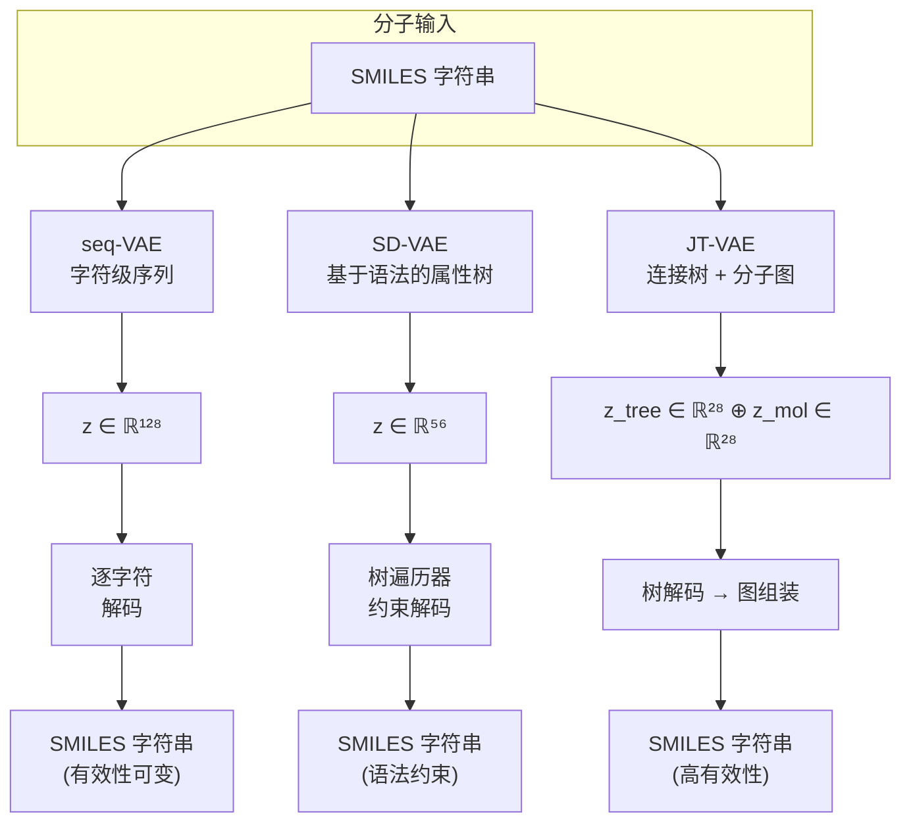

---
slug:15-molecular-generation-pipelines
blog_type:normal
---


PaddleHelix 提供了三种独特的变分自编码器（VAE）架构用于从头分子生成，每种架构针对不同的分子表示范式。这些管线拥有共同的 VAE 基础——将分子编码到连续的潜空间，并将潜向量解码回有效的化学结构——但它们在表示策略、架构复杂性以及提供的化学有效性保证方面存在根本差异。本页面将深入剖析每条管线的内部架构、训练机制和采样过程，帮助你为分子设计任务选择并运行合适的模型。

## 架构概述

这三种管线形成了一个从简单到复杂的谱系：**seq-VAE** 将 SMILES 字符串作为字符序列进行处理，**SD-VAE** 将分子编码为基于语法分解的属性树，而 **JT-VAE** 利用双树图表示法，将拓扑结构与原子级细节分离开来。复杂度的每一次提升，都会在生成时带来更强的化学有效性保证，但代价是更精细的预处理和编码逻辑。



## seq-VAE：字符级 SMILES 生成

seq-VAE 管线将分子生成视为序列到序列的问题，逐字符地将 SMILES 字符串编码为潜空间分布，并通过自回归 GRU 解码器进行重构。这种方法是三者中最直接的，具有训练速度快和数据准备简单的优点，但它不能保证采样时的化学有效性——可能会产生无效的 SMILES，需要事后过滤或重复采样。

### 模型架构

[seq_vae_model.py](pahelix/model_zoo/seq_vae_model.py#L30-L233) 中的 `VAE` 类实现了完整的编码器-解码器管线。编码器通过预初始化的嵌入层（可选冻结）嵌入输入的 token 序列，将其传入双向 GRU，并使用独立的线性层将最终的隐藏状态投影为均值向量 `q_mu` 和对数方差向量 `q_logvar`。标准的 VAE 重参数化技巧（`z = μ + exp(σ²/2) · ε`）从近似后验中产生样本 [seq_vae_model.py](pahelix/model_zoo/seq_vae_model.py#L91-L115)。

解码器将采样得到的潜向量 `z` 与每个输入嵌入沿序列维度拼接，将这种增强后的输入送入 3 层单向 GRU，并应用最终的线性投影得到词表大小的 logits。在训练期间，重构损失计算为预测 token 与平移后的目标 token 之间的交叉熵，同时 KL 散度衡量学习到的后验分布与标准正态先验之间的距离 [seq_vae_model.py](pahelix/model_zoo/seq_vae_model.py#L117-L145)。

### 配置

[model_config.json](apps/molecular_generation/seq_VAE/model_config.json#L1-L17) 中的关键超参数控制着编码器与解码器之间的平衡：

| 参数 | 值 | 作用 |
|-----------|-------|------|
| `q_bidir` | 1 | 双向 GRU 编码器 |
| `q_d_h` | 256 | 编码器隐藏维度 |
| `d_z` | 128 | 潜空间维度 |
| `d_n_layers` | 3 | 解码器 GRU 深度 |
| `d_d_h` | 512 | 解码器隐藏维度 |
| `q_dropout` / `d_dropout` | 0.5 / 0.2 | 正则化 |

### 训练与采样

[trainer.py](apps/molecular_generation/seq_VAE/trainer.py#L83-L110) 中的训练过程使用 Adam 优化器，并通过 `KLAnnealer` 调度器进行 KL 退火，使 KL 权重在各个 epoch 中逐渐从 0 增加到 1。词表是使用 `OneHotVocab` 类从训练集的 SMILES 中动态构建的，该类提供独热字符嵌入 [utils.py](apps/molecular_generation/seq_VAE/utils.py#L101-L106)。

`VAE.sample()` 方法 [seq_vae_model.py](pahelix/model_zoo/seq_vae_model.py#L168-L233) 中的采样过程以自回归方式运行：它以 BOS token 初始化，迭代地将拼接后的 `[embedding, z]` 输入解码器 GRU，使用带温度缩放的 softmax 输出进行采样，并在生成 EOS token 或达到 `max_len`（默认为 100）时停止。由于在解码过程中没有应用化学约束，因此建议在采样后使用 RDKit 进行验证。

### 快速开始

```bash
cd apps/molecular_generation/seq_VAE
export PYTHONPATH="../../../":$PYTHONPATH
python trainer.py --dataset_dir <path_to_zinc> \
    --model_config model_config.json \
    --model_save ./checkpoints/ \
    --max_epoch 30 --batch_size 128 --device gpu
```

来源：[seq_vae_model.py](pahelix/model_zoo/seq_vae_model.py#L30-L233)、[trainer.py](apps/molecular_generation/seq_VAE/trainer.py#L83-L151)、[model_config.json](apps/molecular_generation/seq_VAE/model_config.json#L1-L17)、[utils.py](apps/molecular_generation/seq_VAE/utils.py#L1-L200)

## SD-VAE：语法约束的树解码

SD-VAE（Syntax-Directed VAE）管线引入了基于语法的分子表示。它不再处理原始的 SMILES 字符，而是将分子分解为来自预定义上下文无关文法的一系列产生式决策。从文本文件加载并在 [mol_util.py](apps/molecular_generation/SD_VAE/mol_common/mol_util.py#L22-L49) 中解析的语法规则，枚举了有效的原子类型、键类型和分支模式。每个分子被表示为具有维度 `DECISION_DIM = MAX_NESTED_BONDS + TOTAL_NUM_RULES + 2` 的定长决策序列 [mol_util.py](apps/molecular_generation/SD_VAE/mol_common/mol_util.py#L84)。

这种语法约束意味着解码器在每个时间步都在化学有效的决策空间内运行，与无约束的序列生成相比，显著提高了有效性比率。

### 模型架构

[sd_vae_model.py](pahelix/model_zoo/sd_vae_model.py#L209-L247) 中的 `MolVAE` 类由三个子组件构成：

1. **CNNEncoder** ([sd_vae_model.py](pahelix/model_zoo/sd_vae_model.py#L150-L196))：一个一维卷积编码器，包含三个卷积层（卷积核大小分别为 9、9、11；通道数变化为 `DECISION_DIM → 9 → 9 → 10`），其后接一个全连接层，用于产生 `μ` 和 `log σ²`。有效感受野决定了最大序列长度（`max_decode_steps = 278`）。

2. **StateDecoder** ([sd_vae_model.py](pahelix/model_zoo/sd_vae_model.py#L37-L76))：一个 3 层 GRU，接收重参数化后的潜向量 `z`，通过带 ReLU 激活的线性层进行投影，将其复制到所有时间步，并在 `DECISION_DIM` 个决策上产生每个时间步的 logits。

3. **PerpCalculator** ([sd_vae_model.py](pahelix/model_zoo/sd_vae_model.py#L79-L148))：支持三种损失模式——`binary` 交叉熵、`perplexity`（数值稳定的对数似然）和 `vanilla` 对数似然——所有模式都遵循 `rule_masks`，该掩码在每个时间步将无效决策的概率置零。

语法掩码机制是关键的差异化因素：在每一个解码步骤中，只有与语法（以及到目前为止构建的部分分子）一致的决策才具有非零概率。`rule_ranges` 字典将语法中的每个非终结符映射到其有效的产生式索引，而 `rule_masks` 在训练和推理期间对 logits 强制执行这些约束 [mol_util.py](apps/molecular_generation/SD_VAE/mol_common/mol_util.py#L22-L49)。

### 配置

| 参数 | 值 | 作用 |
|-----------|-------|------|
| `latent_dim` | 56 | 潜空间维度 |
| `max_decode_steps` | 278 | 最大语法决策序列长度 |
| `eps_std` | 0.01 | 重参数化噪声的标准差 |
| `encoder_type` | `"cnn"` | 编码器架构（仅限 CNN 选项） |
| `rnn_type` | `"gru"` | 解码器 RNN 类型 |

### 树遍历器与约束解码

解码管线使用了 `mol_decoder` 包中的两个类。[attribute_tree_decoder.py](apps/molecular_generation/SD_VAE/mol_decoder/attribute_tree_decoder.py#L46-L589) 中的 `AttMolGraphDecoder` 通过递归的 `tree_generator` 管理实际的分子图构建，该生成器应用语法规则、跟踪闭环并验证化合价约束。[tree_walker.py](apps/molecular_generation/SD_VAE/mol_decoder/tree_walker.py#L125-L173) 中的 `ConditionalDecoder` 封装了原始模型的 logits，以执行带掩码的采样——在每一步仅选择符合语法的索引。

<CgxTip>
`rule_masks` 张量在数据准备期间（通过 `batch_make_att_masks`）针对每个分子进行预计算，并编码了在每个决策步骤中哪些语法产生式是合法的。在推理期间，`ConditionalDecoder.sample_index_with_mask` 在采样前将此掩码应用于 logits，从而确保每个生成的分子在构造上都符合语法。
</CgxTip>

### 从先验分布中采样

[sample_prior.py](apps/molecular_generation/SD_VAE/paddle_eval/sample_prior.py#L36-L86) 脚本演示了先验采样：它生成 `nb_latent_point`（200）个随机潜向量，通过带有语法约束的树遍历器对每个向量进行解码，并报告有效性比率。由于语法掩码在每一步都约束了决策，因此有效性比率远高于 seq-VAE，尽管由于语法中的边缘情况，部分分子仍可能无法通过 RDKit 的净化处理。

来源：[sd_vae_model.py](pahelix/model_zoo/sd_vae_model.py#L37-L247)、[mol_util.py](apps/molecular_generation/SD_VAE/mol_common/mol_util.py#L1-L85)、[attribute_tree_decoder.py](apps/molecular_generation/SD_VAE/mol_decoder/attribute_tree_decoder.py#L46-L589)、[tree_walker.py](apps/molecular_generation/SD_VAE/mol_decoder/tree_walker.py#L52-L173)、[sample_prior.py](apps/molecular_generation/SD_VAE/paddle_eval/sample_prior.py#L36-L86)

## JT-VAE：连接树与图双编码

JT-VAE 管线是三者中架构最复杂的。它将分子分解为由官能团团构成的**连接树**（由 `MolTree` 分解处理）和由单个原子与键构成的**分子图**。两个独立的编码器分别为其生成潜表示，这些表示被拼接成单个潜向量。解码分两个阶段进行：首先，树解码器重构连接树拓扑结构；其次，图组装模块选择附着点并重新组装完整的分子图。

这种两阶段方法提供了最强的化学有效性保证，因为 (a) 连接树解码器在具有化学意义的子结构词表上运行，并且 (b) 组装步骤显式检查附着点的几何兼容性。

### 分子分解：MolTree

[mol_tree.py](apps/molecular_generation/JT_VAE/src/mol_tree.py#L22-L120) 模块处理关键的预处理步骤。`MolTree` 接收一个 SMILES 字符串，识别团（由至少两个环键或桥键连接的原子组），并构造一棵树，其中每个节点都是一个代表分子片段的 `MolTreeNode`。每个节点上的 `assemble()` 方法生成候选附着配置（片段如何连接到其相邻节点），在连接树中产生一组带标签的边。在预处理期间，会提取训练集中所有唯一片段 SMILES 的词表 [preprocess.py](apps/molecular_generation/JT_VAE/preprocess.py#L22-L70)。

### 模型架构

[jtnn_vae.py](apps/molecular_generation/JT_VAE/src/jtnn_vae.py#L24-L328) 中的 `JTNNVAE` 类编排了完整的管线：

1. **JTNNEncoder** ([jtnn_enc.py](apps/molecular_generation/JT_VAE/src/jtnn_enc.py#L22-L127))：一个在连接树拓扑上运行的消息传递网络。它沿树边传播隐藏状态，迭代 `depthT = 20` 次，从根节点产生树级别的嵌入。

2. **MPN** ([mpn.py](apps/molecular_generation/JT_VAE/src/mpn.py#L54-L171))：一个在分子图（原子和键）上运行的标准消息传递神经网络，迭代 `depthG = 3` 次。原子特征对元素类型、度数、形式电荷、杂化方式和芳香性使用独热编码（总共 `ATOM_FDIM` 个维度），而键特征则编码键类型和共轭性。

3. **JTNNDecoder** ([jtnn_dec.py](apps/molecular_generation/JT_VAE/src/jtnn_dec.py#L27-L356))：通过在每个节点预测 (a) 放置哪个词表片段（`pred_loss`）和 (b) 是停止还是继续（`stop_loss`）来重构连接树。解码使用带有潜向量条件的深度优先遍历。

4. **Graph Assembly** ([jtnn_vae.py](apps/molecular_generation/JT_VAE/src/jtnn_vae.py#L148-L197))：在树解码之后，`JTMPN` 为每个节点的候选邻居生成候选附着嵌入。这些嵌入通过双线性打分（`A_assm` 线性投影 + 点积）与图级别的潜向量进行评分，交叉熵损失训练模型以选择正确的附着配置。

### 损失函数与训练

[jtnn_vae.py](apps/molecular_generation/JT_VAE/src/jtnn_vae.py#L105-L139) 中的前向传播计算复合损失：

```
total_loss = word_loss + topo_loss + assm_loss + β · KL_divergence
```

其中 `word_loss` 是片段预测交叉熵，`topo_loss` 是树拓扑停止 token 损失，`assm_loss` 是图组装交叉熵，`KL_divergence` 结合了树和图的 KL 项（各占 56 维潜空间的一半）。[config.json](apps/molecular_generation/JT_VAE/configs/config.json#L1-L18) 中的 KL 退火调度从 `beta = 0.0` 开始，每次迭代增加 `step_beta = 0.002`，直到 `max_beta = 1.0`，学习率预热为 40,000 步，并且每 40,000 步以 0.95 的因子进行退火。

[vae_train.py](apps/molecular_generation/JT_VAE/vae_train.py#L42-L112) 中的训练循环加载预处理后的张量批次（通过 [preprocess.py](apps/molecular_generation/JT_VAE/preprocess.py#L44-L70) 进行 pickle 序列化），使用带有梯度裁剪的 Adam 优化器（`clip_norm = 50.0`），并报告每次迭代的词准确率、拓扑准确率和组装准确率。

<CgxTip>
JT-VAE 的潜空间被均分：前 28 维编码树拓扑（`z_tree`），后 28 维编码图细节（`z_mol`）。这种分离在生成时实现了细粒度控制——你可以在树潜空间内进行插值以探索骨架多样性，同时保持图细节固定，反之亦然。
</CgxTip>

### 配置

| 参数 | 值 | 作用 |
|-----------|-------|------|
| `hidden_size` | 450 | 所有编码器/解码器的隐藏维度 |
| `latent_size` | 56 | 总潜空间维度（28 树 + 28 图） |
| `depthT` | 20 | 树消息传递迭代次数 |
| `depthG` | 3 | 图消息传递迭代次数 |
| `beta` → `max_beta` | 0.0 → 1.0 | KL 退火调度 |
| `warmup` | 40000 | 学习率预热步数 |

### 采样与重构

`sample_prior()` 方法 [jtnn_vae.py](apps/molecular_generation/JT_VAE/src/jtnn_vae.py#L97-L102) 从标准正态先验中抽取随机的 `z_tree` 和 `z_mol`，并将它们送入两阶段解码器（树解码 → 图组装）。`reconstruction()` 方法 [jtnn_vae.py](apps/molecular_generation/JT_VAE/src/jtnn_vae.py#L104-L113) 对输入分子进行编码并重构它们以进行评估。[sample.sh](apps/molecular_generation/JT_VAE/scripts/sample.sh#L1-L19) 脚本从训练好的检查点生成 1,000 个分子。

### 快速开始

```bash
# 预处理：将 SMILES 分解为连接树张量
cd apps/molecular_generation/JT_VAE
export PYTHONPATH="../../../":$PYTHONPATH
python preprocess.py --train_path zinc.txt --save_dir zinc_processed --split 100

# 训练
bash scripts/train.sh

# 从先验分布中采样
python sample.py --nsample 1000 --vocab data/zinc/vocab.txt \
    --model vae_models/model.iter-441000 --config configs/config.json \
    --output sampling_output.txt
```

来源：[jtnn_vae.py](apps/molecular_generation/JT_VAE/src/jtnn_vae.py#L24-L328)、[jtnn_enc.py](apps/molecular_generation/JT_VAE/src/jtnn_enc.py#L22-L166)、[jtnn_dec.py](apps/molecular_generation/JT_VAE/src/jtnn_dec.py#L27-L356)、[mpn.py](apps/molecular_generation/JT_VAE/src/mpn.py#L54-L171)、[mol_tree.py](apps/molecular_generation/JT_VAE/src/mol_tree.py#L22-L157)、[config.json](apps/molecular_generation/JT_VAE/configs/config.json#L1-L18)、[vae_train.py](apps/molecular_generation/JT_VAE/vae_train.py#L42-L112)

## 管线对比

| 特性 | seq-VAE | SD-VAE | JT-VAE |
|---------|---------|--------|--------|
| **表示方法** | SMILES 字符 | 语法决策序列 | 连接树 + 分子图 |
| **编码器** | 双向 GRU | 一维 CNN（3 个卷积层） | 树 MPN + 图 MPN |
| **解码器** | 自回归 GRU | GRU + 语法掩码 | 树解码器 + 图组装 |
| **潜空间维度** | 128 | 56 | 56 (28 + 28) |
| **有效性保证** | 无（需要后过滤） | 语法约束的决策 | 双阶段化学验证 |
| **预处理** | SMILES 分词 | 语法规则提取 | 连接树分解 |
| **训练数据** | ZINC SMILES | ZINC（预编码） | ZINC（预张量化，100 个拆分） |
| **复杂度** | 低 | 中 | 高 |

## 选择管线

对于允许进行有效性过滤的快速原型设计和大规模筛选，**seq-VAE** 以最少的设置提供了最快的迭代周期。当需要语法级别的有效性且无需图组装的开销时，**SD-VAE** 通过其约束解码机制提供了一个平衡的中间方案。对于要求最高有效性比率和结构质量的应用——例如先导化合物优化或骨架跃迁——**JT-VAE** 通过其拓扑与原子级生成的显式分离提供了最强的保证，但代价是更复杂的预处理和更长的训练时间。

要了解分子表示在编码前是如何进行特征化的，请参阅[化合物与蛋白质特征化器](8-compound-and-protein-featurizers)。有关 JT-VAE 图编码器中使用的 GNN 消息传递组件的背景信息，请参阅[GNN 模块与网络架构](10-gnn-blocks-and-network-architecture)。要探索如何在下游评估生成的分子，请参阅[药物-靶标相互作用模型](14-drug-target-interaction-models)。