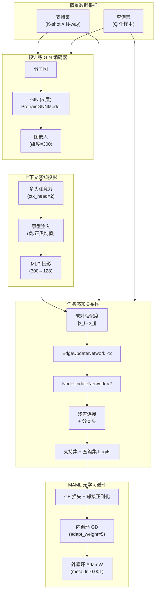
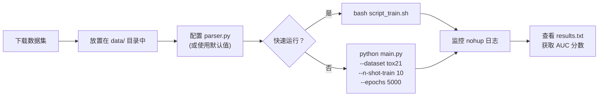

---
slug:16-few-shot-molecular-property-prediction
blog_type:normal
---


本页文档记录了 PaddleHelix 对 **属性感知关系网络 (PAR)** 的实现——该元学习框架作为 NeurIPS 2021 Spotlight 论文发表——旨在仅通过每个检测少量标记样本即可预测分子属性。其核心创新在于，在支持集和查询集分子上构建任务感知的关系图，然后执行迭代消息传递，以捕获分子间相似性和标签-结构耦合，所有这些都在 MAML 风格的元学习循环中完成。

## 架构概述


PAR 流水线遵循三阶段架构，逐步将原始分子图转化为属性感知的预测结果。预训练的 GIN 编码器生成固定维度的嵌入，上下文感知投影注入类原型信号，任务感知关系图执行迭代消息传递以进行最终分类。



来源：[main.py](apps/fewshot_molecular_property/main.py#L12-L44)、[mol_model.py](apps/fewshot_molecular_property/chem_lib/models/mol_model.py#L50-L98)、[relation.py](apps/fewshot_molecular_property/chem_lib/models/relation.py#L245-L326)

## 项目结构

该实现位于 `apps/fewshot_molecular_property/` 目录下，在入口点、配置以及包含所有模型、数据集和工具组件的 `chem_lib` 包之间进行了清晰的分离。

```
apps/fewshot_molecular_property/
├── main.py                  # 入口点：训练循环编排
├── parser.py                # 参数解析与任务配置
├── script_train.sh          # tox21/muv 实验的快速启动脚本
├── PAR-thumbnail.png        # 架构图
├── data/                    # 数据集存储 (tox21, sider, muv, toxcast)
└── chem_lib/
    ├── datasets/
    │   ├── __init__.py      # 导出：sample_meta_datasets, sample_test_datasets, MoleculeDataset
    │   ├── loader.py        # 数据集加载与图构建
    │   └── samples.py       # 情景 N-way K-shot 采样逻辑
    ├── models/
    │   ├── __init__.py      # 导出：ContextAwareRelationNet, Meta_Trainer
    │   ├── mol_model.py     # ContextAwareRelationNet (顶层模型)
    │   ├── relation.py      # TaskAwareRelation, EdgeUpdateNetwork, NodeUpdateNetwork, ContextMLP
    │   ├── maml.py          # 用于元学习的 MAML 封装器
    │   └── trainer.py       # Meta_Trainer：情景训练/测试编排
    ├── model_gin/
    │   └── supervised_contextpred.pdparams  # 预训练的 GIN 权重 (上下文预测)
    └── utils.py             # 日志记录器、参数计数、试验路径管理
```

来源：[README.md](apps/fewshot_molecular_property/README.md#L1-L49)、[parser.py](apps/fewshot_molecular_property/parser.py#L11-L100)

## 分子编码器与预训练初始化

主干网络是一个源自 PaddleHelix `PretrainGNNModel` 的 **5 层 GIN**（图同构网络），并使用替换了默认设置的自定义原子和键嵌入层。原子通过结合 `atomic_num`（120 种类型，包含掩码 token）和 `chiral_tag`（3 种类型）的双因子嵌入进行编码；键类似地结合了 `bond_type`（6 种类型，包含芳香键和自环）与 `bond_direction`（3 种类型）。当启用预训练时（这是默认且推荐的配置），编码器会从 [`supervised_contextpred.pdparams`](apps/fewshot_molecular_property/chem_lib/model_gin/supervised_contextpred.pdparams) 的有监督上下文预测检查点加载权重。这种预训练提供了强大的分子表示能力，极大地降低了下游少样本任务的数据饥渴程度。

编码器的配置受到约束：预训练强制使用 5 层、300 维嵌入和 0.5 的 dropout，而较浅的配置（≤3 层）会自动降至 200 维嵌入和 0.1 的 dropout。Jumping Knowledge 聚合默认设置为 `"last"`，图级读出使用均值池化。嵌入维度贯穿整个流水线——从 GIN 的 300 维输出，经过上下文投影，降至关系图的 128 维。

来源：[mol_model.py](apps/fewshot_molecular_property/chem_lib/models/mol_model.py#L10-L83)、[parser.py](apps/fewshot_molecular_property/parser.py#L49-L65)、[parser.py](apps/fewshot_molecular_property/parser.py#L107-L113)

## 上下文感知投影层

`ContextMLP` 模块通过将**特定任务的类原型信息**注入到每个分子表示中，弥合了原始 GIN 嵌入与关系图之间的差距。正是这种机制使得 PAR 具备“属性感知”能力——每个分子的嵌入都以支持样本在各类别中的分布为条件。

该模块在由 `pre_fc` 标志控制的两种模式下运行。在默认模式（`pre_fc=0`）下，所有支持和查询嵌入首先沿序列维度拼接，然后将特定类的原型（正负支持样本的均值嵌入）作为额外的注意力键堆叠起来。一个多头自注意力层（默认为 2 个头）允许每个分子同时关注其同类分子和类原型。注意力输出与原始嵌入拼接后，通过 MLP 产生最终的投影表示（300 → 128 维）。在备选模式（`pre_fc=1`）下，MLP 投影在注意力之前而非之后应用，相应的隐藏层维度减半。

这种设计确保了每个查询分子的表示都被丰富了关于当前任务中“正样本”和“负样本”特征的信号——相比于缺乏显式类条件约束的标准关系网络，这是一个关键优势。

来源：[relation.py](apps/fewshot_molecular_property/chem_lib/models/relation.py#L60-L105)、[mol_model.py](apps/fewshot_molecular_property/chem_lib/models/mol_model.py#L85-L87)、[parser.py](apps/fewshot_molecular_property/parser.py#L67-L71)

## 任务感知关系图

`TaskAwareRelation` 模块是 PAR 的架构核心。它在所有支持集和查询集分子上构建一个全连接图，然后通过交替的更新网络迭代地优化边权重（成对关系）和节点特征（分子表示）。

### 边更新网络

`EdgeUpdateNetwork` 根据绝对差值 `|x_i - x_j|` 计算成对相似度特征，当 `adj_type='sim'` 时，通过指数核进行变换。这些成对特征输入到一个多层 1×1 卷积网络，为每一对输出一个标量相似度分数。邻接矩阵支持两个边通道（同类和不同类，默认 `edge_dim=2`），采用 sigmoid 激活并对角线掩码。提供了一个 top-k 稀疏化选项，但默认禁用（`top_k=-1`）。

### 节点更新网络

`NodeUpdateNetwork` 使用计算出的邻接权重聚合邻域信息。对于每个节点，它在边权重和邻居特征之间执行批量矩阵乘法，将结果与原始节点特征拼接，并应用 1×1 卷积变换。这类似于单步图注意力操作，但作用于学习到的邻接矩阵而非固定的邻接矩阵。

### 堆叠的迭代优化

`TaskAwareRelation` 堆叠了 `num_layers=2` 次交替的边和节点更新迭代。关键在于，当 `node_concat=True`（默认值）时，节点特征维度在每一层通过将更新后的特征与原始特征拼接而增长——后续层的输入维度变为 `inp_dim + hidden_dim`，然后是 `inp_dim + 2*hidden_dim`。最后的线性投影映射回原始维度，并带有按 `res_alpha` 缩放的残差连接。最后一个线性层为支持集和查询集节点生成 2 类 logits。支持集 logits 在元训练适应期间使用，而查询集 logits 提供最终的任务特定预测。

来源：[relation.py](apps/fewshot_molecular_property/chem_lib/models/relation.py#L156-L242)、[relation.py](apps/fewshot_molecular_property/chem_lib/models/relation.py#L245-L326)、[mol_model.py](apps/fewshot_molecular_property/chem_lib/models/mol_model.py#L125-L148)

## 标签到边的转换与邻接正则化

PAR 通过将离散的类标签转换为可与学习到的关系图进行比较的连续邻接矩阵，引入了一种独特的监督信号。`label2edge` 方法根据支持集标签构建二值同类/不同类邻接矩阵，可选择在距离模式（`adj_type='dist'`）下进行反转，并扩展为两个通道。在训练期间，预测的邻接矩阵（关系图的最后一层）与该标签衍生邻接矩阵之间的 MSE 损失，提供了由 `reg_adj`（默认为 1.0）控制权重的辅助监督信号。这种正则化强制关系图在内部编码类结构，从而提高在未见任务上的泛化能力。

在测试时，当查询标签未知时，邻接正则化仅在支持集对上计算，使用所有查询批次的邻接矩阵均值以获得稳定的梯度信号。

来源：[mol_model.py](apps/fewshot_molecular_property/chem_lib/models/mol_model.py#L102-L123)、[trainer.py](apps/fewshot_molecular_property/chem_lib/models/trainer.py#L207-L234)

## MAML 元学习集成

`MAML` 封装器通过为内循环梯度下降提供清晰的参数克隆，使模型适配于元学习。它封装了 `ContextAwareRelationNet` 并暴露了一个 `clone()` 方法，用于深拷贝模型权重，从而在不直接修改元参数的情况下实现任务特定的适应。`first_order` 标志控制是否通过内循环计算二阶梯度——PAR 默认使用二阶（`second_order=1`）以实现最大的元学习保真度，尽管为了内存效率可以启用一阶近似。

内循环适应使用一组可配置的“可适应权重”（由 `adapt_weight` 参数控制，默认为 5），决定了在任务特定适应期间更新哪些模型组件。该系统支持 8 个级别（0-7）的参数冻结，从仅冻结编码器（级别 0）到适应所有参数（级别 7）。级别 5 冻结编码器和所有关系图层（边和节点更新），仅适应最终的分类头——这是默认设置，代表了一种折中方案，既保留了预训练的分子表示和学习到的图结构，又允许任务特定的读出适应。

来源：[maml.py](apps/fewshot_molecular_property/chem_lib/models/maml.py#L5-L65)、[trainer.py](apps/fewshot_molecular_property/chem_lib/models/trainer.py#L21-L22)、[trainer.py](apps/fewshot_molecular_property/chem_lib/models/trainer.py#L152-L186)

## 训练循环：情景元学习

`Meta_Trainer` 实现了完整的情景训练协议。每次元训练迭代采样一批任务（默认每批 9 个任务），从每个任务构建 N-way K-shot 情景，并执行以下序列：

1. **内循环适应**：对于每个任务，克隆模型，在支持数据上以 `flag=1`（仅支持集损失）计算预测，并在指定的可适应权重上以 `inner_lr=0.1` 执行 `inner_update_step=1` 步梯度下降。
2. **外循环评估**：适应后，以 `flag=0`（查询损失）计算预测，在批次中的所有任务上累加，并通过反向传播使用 `meta_lr=0.001` 和 `weight_decay=5e-5` 的 AdamW 更新元参数。

由 `meta_warm_step` 和 `meta_warm_step2` 控制的预热调度对可适应权重进行门控：在初始预热阶段（`epoch < meta_warm_step`，默认为 0）和越过第二个预热边界后（`epoch > meta_warm_step2`，默认为 10000），内循环期间适应所有参数。在两个边界之间，仅更新指定的可适应权重子集，提供了一种逐渐缩小适应范围的课程学习策略。

总损失结合了交叉熵和邻接正则化项。NaN/Inf 检测保护机制通过将损坏的损失置零来确保数值稳定性。训练默认运行 5000 个 epoch，每 10 个 epoch 评估一次，每 2000 个 epoch 保存一次检查点。

来源：[trainer.py](apps/fewshot_molecular_property/chem_lib/models/trainer.py#L256-L299)、[trainer.py](apps/fewshot_molecular_property/chem_lib/models/trainer.py#L188-L234)、[trainer.py](apps/fewshot_molecular_property/chem_lib/models/trainer.py#L176-L178)

## 测试时适应协议

测试遵循一种独特的协议，利用了模型从支持样本进行适应的能力。对于每个测试任务，克隆模型并通过 `update_step_test=1` 个内循环步骤使用支持集进行适应。至关重要的是，测试时的适应使用**仅支持集监督**（支持集交叉熵 + 支持集邻接正则化），绝不接触查询标签。适应后，模型通过 `forward_query_loader` 在完整的查询集上进行评估，该函数为提高内存效率以批处理方式处理查询。预测通过 softmax 转换为概率，正类概率作为计算 AUC 的分数。

评估报告每个任务的 AUC 分数、所有测试任务的平均值、中位数（一个更稳健的中心趋势度量），以及在训练期间观察到的最佳平均 AUC。结果通过 `Logger` 工具进行记录，该工具会将结果持久化到磁盘并在训练结束时生成一个汇总的 DataFrame。

来源：[trainer.py](apps/fewshot_molecular_property/chem_lib/models/trainer.py#L302-L359)、[trainer.py](apps/fewshot_molecular_property/chem_lib/models/trainer.py#L94-L140)

## 配置参考

下表按子系统总结了最具影响力的超参数。所有默认值均对应于可复现结果的推荐配置。

| 类别 | 参数 | 默认值 | 描述 |
|----------|-----------|---------|-------------|
| **少样本** | `n-shot-train` | 10 | 训练期间每个类的支持样本数 |
| | `n-shot-test` | 10 | 测试期间每个类的支持样本数 |
| | `n-query` | 16 | 每个情景的查询样本数 |
| **元学习** | `meta-lr` | 0.001 | 外循环学习率 (AdamW) |
| | `inner-lr` | 0.1 | 内循环适应学习率 |
| | `weight_decay` | 5e-5 | 元参数上的 L2 正则化 |
| | `batch_task` | 9 | 每个元批次采样的任务数 |
| | `adapt_weight` | 5 | 参数冻结级别 (0=冻结编码器, 5=冻结边+节点) |
| | `second_order` | 1 | 启用二阶 MAML 梯度 |
| | `epochs` | 5000 | 元训练总轮数 |
| **编码器** | `enc_gnn` | gin | GNN 主干类型 |
| | `enc_layer` | 5 | GIN 消息传递层数 |
| | `emb_dim` | 300 | 嵌入维度 (使用预训练时强制执行) |
| | `pretrained` | 1 | 加载预训练的上下文预测权重 |
| **关系图** | `rel-hidden-dim` | 128 | 关系网络的隐藏维度 |
| | `rel-layer` | 2 | 交替边/节点更新层数 |
| | `rel-edge-layer` | 2 | 每个边更新网络的卷积层数 |
| | `rel_edge` | 2 | 边通道 (同类 + 不同类) |
| | `rel_adj` | sim | 邻接类型：相似度或距离 |
| **上下文投影** | `map_dim` | 128 | 投影嵌入维度 |
| | `map_layer` | 2 | 上下文投影中的 MLP 层数 |
| | `ctx_head` | 2 | 原型注入的注意力头数 |
| **正则化** | `reg_adj` | 1.0 | 邻接重构损失的权重 |
| | `rel-res` | 0.0 | 关系图中的残差连接权重 |

来源：[parser.py](apps/fewshot_molecular_property/parser.py#L11-L100)

## 可适应权重级别

`adapt_weight` 参数实现了一种分层参数冻结策略，控制哪些模型组件参与内循环适应。这是平衡表示稳定性（保留预训练知识）与任务特定灵活性的关键杠杆。

| 级别 | 适应的组件 | 冻结的组件 |
|-------|-------------------|-------------------|
| 0 | 关系图 + 投影 + 分类器 | 仅编码器 |
| 1 | 编码器 + 投影 + 分类器 | 仅关系图 |
| 2 | 投影 + 分类器 | 编码器 + 关系图 |
| 3 | 边更新 + 投影 + 分类器 | 编码器 + 节点更新 |
| 4 | 节点更新 + 投影 + 分类器 | 编码器 + 边更新 |
| **5 (默认)** | **投影 + 分类器** | **编码器 + 边 + 节点更新** |
| 6 | 边 + 节点 + 投影 + 分类器 | 编码器 + 分类器 |
| 7 | 所有参数 | 无 |

来源：[trainer.py](apps/fewshot_molecular_property/chem_lib/models/trainer.py#L152-L186)

## 快速开始

### 环境配置

```bash
pip install paddlepaddle==2.0.2 pgl==2.1.5 paddlehelix==1.0.1
```

### 数据集准备

从 [Google Drive 链接](https://drive.google.com/file/d/1K3c4iCFHEKUuDVSGBtBYr8EOegvIJulO/view?usp=sharing) 下载预处理的数据集 (Tox21, SIDER, MUV, ToxCast)，解压并放置在 `apps/fewshot_molecular_property/data/` 目录中。

### 训练



快速启动脚本 [`script_train.sh`](apps/fewshot_molecular_property/script_train.sh#L1-L12) 演示了在 MUV 上进行 5000 个 epoch 的 10-shot 配置：

```bash
cd apps/fewshot_molecular_property
bash script_train.sh
```

对于自定义实验，可直接使用所需的超参数调用 `main.py`：

```bash
python main.py --dataset tox21 --test-dataset tox21 \
    --n-shot-train 10 --n-shot-test 10 --n-query 16 \
    --pretrained 1 --epochs 5000 --eval_steps 10 \
    --gpu_id 0 --seed 0
```

<CgxTip>
`--test-dataset` 参数支持跨数据集评估——在一个基准（例如 Tox21）上训练，并在另一个基准（例如 ToxCast）上测试。当 `test-dataset` 等于 `dataset` 时，它会在内部被设置为 `None`，以执行标准的数据集内评估。在此配置下，任务列表会自动合并和去重。

</CgxTip>

来源：[script_train.sh](apps/fewshot_molecular_property/script_train.sh#L1-L12)、[README.md](apps/fewshot_molecular_property/README.md#L17-L43)

<CgxTip>
预热调度（`meta_warm_step=0`、`meta_warm_step2=10000`）控制可适应权重过滤何时激活。默认情况下使用这些值，第二个边界 (10000) 超过了典型的训练持续时间（5000 个 epoch），因此级别 5 的可适应权重过滤在整个训练运行中实际上是处于激活状态的。要禁用过滤并在整个过程中适应所有参数，请将 `meta_warm_step2` 设置为大于总 epoch 数的值。

</CgxTip>

## 前向传播模式

`ContextAwareRelationNet` 暴露了针对不同训练/测试阶段优化的多种前向传播策略，反映了各个阶段不同的计算和内存约束。

| 方法 | 使用场景 | 支持集处理 | 查询集处理 |
|--------|----------|-------------------|-----------------|
| `forward()` | 内循环元训练 | 批量处理所有支持集 | 批量处理所有查询集 |
| `forward_one_batch()` | 单批次推理 | 批量处理 | 批量处理 |
| `forward_query_list()` | 小规模查询评估 | 批量处理 | 逐查询循环 |
| `forward_query_loader()` | 大规模测试 | 批量处理 | DataLoader 迭代 |

`forward()` 方法在内循环适应期间使用，将支持和查询作为单个批处理的 PGL 图进行处理。`forward_query_loader()` 方法在测试时使用，对支持集编码一次并迭代查询小批量——这是一种针对具有大型查询集的数据集的内存高效策略。`q_pred_adj` 标志启用一种预测模式，在该模式下，查询预测直接从学习到的邻接矩阵与支持样本的相似性中得出，绕过了完整的分类头。

来源：[mol_model.py](apps/fewshot_molecular_property/chem_lib/models/mol_model.py#L140-L198)

## 继续探索

该实现将基于图的分子表示学习与少样本适应的元学习连接起来。关于用作编码器主干的基础图神经网络组件，请参阅 [GNN Blocks and Network Architecture](10-gnn-blocks-and-network-architecture)。要了解如何通过自监督上下文预测获得预训练权重，请参阅 [Pretrain-GNNs Framework](12-pretrain-gnns-framework)。对于不依赖少样本学习的替代分子属性预测方法，请参阅 [InMemoryDataset and Data Pipeline](7-inmemorydataset-and-data-pipeline) 中的核心化合物属性预测基础设施。更广泛的药物发现应用全景，包括药物-靶点相互作用模型，在 [Drug-Target Interaction Models](14-drug-target-interaction-models) 中有所涵盖。