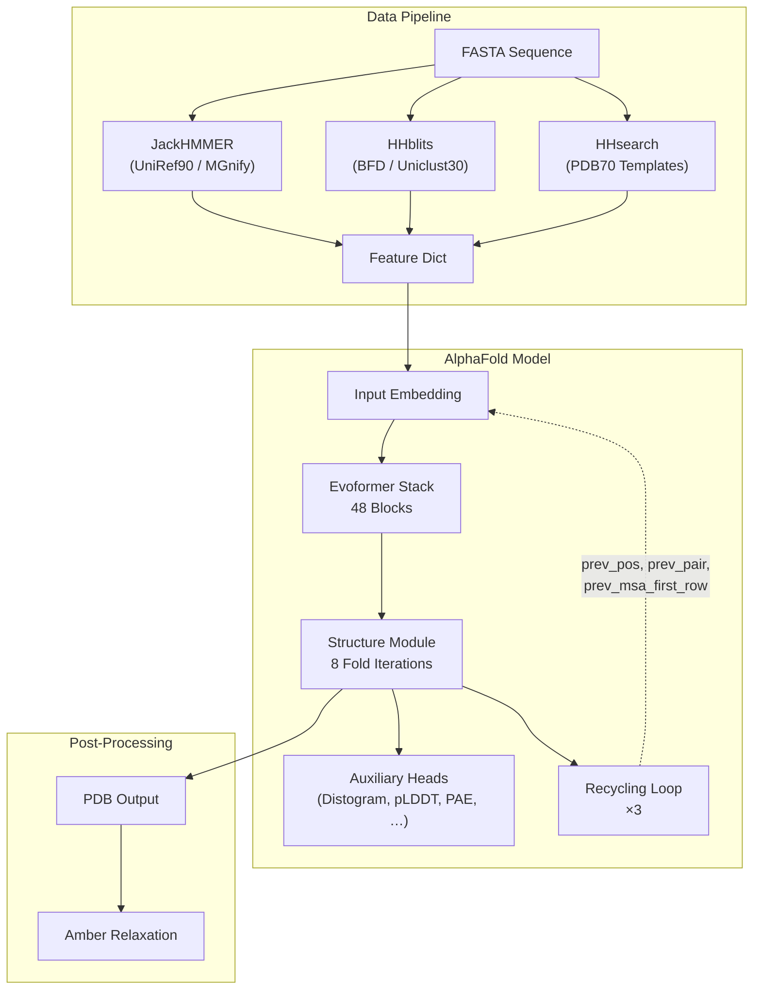

---
slug:17-helixfold-alphafold2-reproduction
blog_type:normal
---


HelixFold 是 DeepMind AlphaFold2 的忠实且经过显著优化的复现版本，完全基于 PaddlePaddle 实现。它涵盖了从 MSA 特征生成、Evoformer 编码器到结构模块的完整生命周期，支持训练和推理。HelixFold 区别于简单移植的亮点在于其一系列系统级优化：**分支并行**、算子融合以及多维内存缩减技术，这些技术共同使得从头训练和超长单体预测（约 6600 个残基）成为可能，而这在原框架中是无法实现的。

来源：[README.md](apps/protein_folding/helixfold/README.md#L1-L44)

## 架构概述

HelixFold 镜像了 AlphaFold2 的架构，但在每个阶段都引入了并行性和算子级优化。该系统可分解为四个协同工作的子系统：**数据管道**（MSA 搜索和特征组装）、**Evoformer**（联合 MSA-配对表示学习）、**结构模块**（通过不变点注意力生成 3D 坐标）以及**辅助头**（距离图、pLDDT、预测对齐误差等）。



循环机制是核心所在：在每次经过 Evoformer 和结构模块后，预测的原子坐标和配对表示会被反馈作为下一次迭代的输入特征，从而逐步优化结构预测。

来源：[modules.py](apps/protein_folding/helixfold/alphafold_paddle/model/modules.py#L124-L243), [config.py](apps/protein_folding/helixfold/alphafold_paddle/model/config.py#L166-L365)

## 项目结构

HelixFold 位于 `apps/protein_folding/helixfold/` 目录下，组织为三个同心层：核心模型库（`alphafold_paddle/`）、训练基础设施（`train.py` + `utils/`）以及推理入口（`run_helixfold.py`）。

```
helixfold/
├── run_helixfold.py              # Inference entry point (CLI)
├── train.py                       # Training entry point (CLI)
├── gpu_infer.sh / gpu_train.sh   # Launch scripts (GPU)
├── dcu_infer.sh / dcu_train.sh   # Launch scripts (DCU)
├── train_configs/                 # Training hyperparameter JSONs
│   ├── demo.json
│   ├── finetune.json
│   └── initial.json
├── scripts/                       # Database download scripts
├── demo_data/                     # CASP14 demo FASTA + features
├── alphafold_paddle/              # Core model library
│   ├── common/                    # Protein constants, confidence metrics
│   ├── data/                      # Pipeline, featurizers, parsers
│   ├── model/                     # Neural network modules
│   └── relax/                     # Amber relaxation post-processing
└── utils/                         # Training utilities (dataset, EMA, metrics)
```

来源：[README.md](apps/protein_folding/helixfold/README.md#L10-L17)

## 核心模型：`AlphaFold` 与循环机制

顶层的 `AlphaFold` 类实现了补充算法 2 中的“推理”过程，并包含一个可配置的循环机制。在每次迭代中，它会切分集成批次数据，将其传入 `AlphaFoldIteration`，然后从结果中提取 `final_atom_positions`、`msa_first_row` 和 `pair` 以作为下一个周期的种子。循环迭代的次数可以**在训练期间动态调整**——由批次数据中的 `num_iter_recycling` 字段控制——这作为一种课程学习策略。

关键实现细节：在启用 `low_memory=True` 的推理过程中，中间结果会在循环步骤之间被显式删除并进行垃圾回收，同时 `prev_pair` 会以 `bfloat16` 而非 `float32` 格式存储，以减少内存占用。

来源：[modules.py](apps/protein_folding/helixfold/alphafold_paddle/model/modules.py#L124-L243)

## Evoformer：联合 MSA 与配对表示学习

`EmbeddingsAndEvoformer` 模块（补充算法 2 第 5–18 行）首先将原始特征投影到三个并行通道中——**MSA**（256 维）、**pair**（128 维）和 **single**（384 维）表示——然后运行 **48 个 Evoformer 块**。每个 `EvoformerIteration`（补充算法 6 第 2–10 行）包含完整的注意力堆栈：

| 组件 | 补充算法 | 作用 |
|---|---|---|
| `MSARowAttentionWithPairBias` | 算法 7 | 由配对表示引入偏置的行级 MSA 注意力 |
| `MSAColumnGlobalAttention` | 算法 19 | 跨序列的列级全局注意力 |
| `MSATransition` | 算法 9 | MSA 行的前馈过渡 |
| `OuterProductMean` | 算法 10 | 从 MSA 更新配对表示 |
| `TriangleMultiplication`（出向/入向） | 算法 11–12 | 对配对表示进行三角更新 |
| `TriangleAttention`（起始/结束节点） | 算法 13–14 | 对配对表示进行三角自注意力计算 |
| `PairTransition` | 算法 15 | 配对表示的前馈过渡 |

此外，一个**额外 MSA 堆栈**（4 个块）在将最多 1024 条额外序列（超出 512 个 MSA 聚类的部分）送入外积均值之前，通过其自身的 `MSARowAttentionWithPairBias` 进行处理，从而在不承担主 MSA 注意力全部计算开销的情况下丰富了配对表示。

来源：[modules.py](apps/protein_folding/helixfold/alphafold_paddle/model/modules.py#L1224-L1514), [config.py](apps/protein_folding/helixfold/alphafold_paddle/model/config.py#L207-L358)

## 结构模块：从表示到 3D 坐标

`StructureModule`（补充算法 20）通过 **8 个 `FoldIteration`** 块，将 Evoformer 的配对表示和单序列表示转换为全原子 3D 坐标。每次迭代在四元数仿射框架上应用 `InvariantPointAttention` (IPA)，随后接一个过渡层和框架更新。IPA 至关重要：它使用基于点和基于框架的注意力来查询局部框架，从而实现具备旋转/平移等变性的结构优化。

侧链原子由 `MultiRigidSidechain` 模块生成，该模块使用由预测扭转角参数化的刚体变换。结构模块计算五种不同的损失函数：

| 损失 | 描述 |
|---|---|
| `backbone_loss` | 骨架框架上的 FAPE 损失 |
| `sidechain_loss` | 使用重命名刚性组的全原子 FAPE 损失 |
| `structural_violation_loss` | 对空间位阻冲突和键长违规的惩罚 |
| `supervised_chi_loss` | 扭转角预测损失 |
| 辅助头 | 距离图、pLDDT、预测对齐误差、掩码 MSA、实验解析结果 |

来源：[folding.py](apps/protein_folding/helixfold/alphafold_paddle/model/folding.py#L34-L496), [folding.py](apps/protein_folding/helixfold/alphafold_paddle/model/folding.py#L562-L842)

## 数据管道：从 FASTA 到特征

`DataPipeline` 类协调序列搜索工具以构建特征字典。它接收一个 FASTA 文件并运行：

1. **JackHMMER**：分别针对 UniRef90（最多 10,000 个命中）和 MGnify（最多 501 个命中）进行搜索
2. **HHblits**：针对 BFD（或针对 `reduced_dbs` 预设使用 small_bfd）和 Uniclust30 进行搜索
3. **HHsearch**：针对 PDB70 进行模板检测（最多 20 个模板）
4. **Kalign**：用于 MSA 序列比对

三种预设配置了搜索范围和集成策略：

| 预设 | 集成 | 数据库范围 | 使用场景 |
|---|---|---|---|
| `reduced_dbs` | 无 (1×) | 小型 BFD，无 BFD/Uniclust30 | 快速推理，资源有限 |
| `full_dbs` | 无 (1×) | 完整 BFD，Uniclust30，UniRef90，MGnify | 标准推理 |
| `casp14` | 8× 集成 | 完整数据库 | 追求最高精度，竞赛环境 |

来源：[pipeline.py](apps/protein_folding/helixfold/alphafold_paddle/data/pipeline.py#L81-L170), [run_helixfold.py](apps/protein_folding/helixfold/run_helixfold.py#L346-L354)

## 训练管道

HelixFold 支持在多种硬件配置下进行完整的从头训练。训练系统围绕三个数据集类构建：

- **`AF2Dataset`** — 使用真实结构进行标准训练
- **`AF2DistillDataset`** — 蒸馏阶段训练（从高置信度结构进行自蒸馏）
- **`AF2TestDataset`** — 可迭代的测试/评估数据集

训练遵循由 `model_name` 控制的两阶段策略：**`initial`**（使用裁剪后的残基从头训练，示例中 `crop_size=100`）和 **`finetune`**（在全长蛋白质上进行微调，可选择从预训练权重开始）。启动脚本为单机单卡（`N1C1`）、单机 8 卡（`N1C8`）和多机（`N8C64`）设置提供了现成的配置，默认使用 `bf16` 精度和 `O2` AMP 级别。

来源：[train.py](apps/protein_folding/helixfold/train.py#L308-L584), [dataset.py](apps/protein_folding/helixfold/utils/dataset.py#L84-L434), [gpu_train.sh](apps/protein_folding/helixfold/gpu_train.sh#L1-L200)

## 推理管道

推理入口 `run_helixfold.py` 封装了 `RunModel` 类（来自 `alphafold_paddle/model/model.py`），该类协调了预处理、预测和后处理流程：

1. **`preprocess`** — 将原始 numpy 特征转换为具有正确形状的 PaddlePaddle 张量
2. **`predict`** — 运行 AlphaFold 模型，可选地执行集成并返回表示结果
3. **`postprocess`** — 计算 pLDDT 置信度，写入未松弛的 PDB 文件，并可选择运行 Amber 松弛处理

关键的推理标志包括 `--enable_low_memory`（激活子批次分块和循环内存优化）、`--precision bf16`（减少内存并加速计算），以及带有 `--dap_degree` 的 `--distributed`（为长序列启用设备并行）。`--subbatch_size` 参数（默认为 384）控制长蛋白质注意力计算的块大小。

<CgxTip>
对于超过约 1000 个残基的序列，请启用 `--enable_low_memory`，并考虑在多 GPU 环境下使用 `--distributed --dap_degree=8`。低内存模式以 `bfloat16` 格式存储 `prev_pair`，并在循环步骤之间对中间张量进行垃圾回收，从而实现对超长单体（约 6600 个残基）的预测。
</CgxTip>

来源：[model.py](apps/protein_folding/helixfold/alphafold_paddle/model/model.py#L87-L315), [run_helixfold.py](apps/protein_folding/helixfold/run_helixfold.py#L52-L175)

## 技术亮点：效率优化

HelixFold 相比直接移植的 AlphaFold2，其核心贡献在于三个维度的系统级优化：

**分支并行** 将 Evoformer 中的两个并行计算分支（MSA 行注意力和外积均值路径）拆分到不同设备上，从而解决了在训练早期阶段两个分支在同一 GPU 上运行时出现的利用率不足问题。结合**数据并行 (DAP)**，这形成了一种混合并行策略（`--bp_degree` × `--dap_degree`），能够将训练扩展到数十个 GPU。

**算子与张量融合** 解决了由数千个小算子带来的调度开销问题。融合门控自注意力将投影、偏置加法、门控和 softmax 合并为单个复合算子。张量融合将 einsum 操作重写为融合内核，显著降低了启动开销。

**多维内存优化** 结合了四种技术：(1) 从可配置索引开始的 Evoformer 块上的**重计算**（梯度检查点），(2) 用于激活值存储和计算的 **BFloat16** 混合精度，(3) 在数学安全的前提下使用**原地操作**，以及 (4) **子批次/分块**，即将大型注意力矩阵切分为适合 GPU 内存的分块。

来源：[README.md](apps/protein_folding/helixfold/README.md#L17-L27), [modules.py](apps/protein_folding/helixfold/alphafold_paddle/model/modules.py#L45-L47), [config.py](apps/protein_folding/helixfold/alphafold_paddle/model/config.py#L233-L234)

## 快速参考：关键配置参数

| 参数 | 默认值 | 描述 |
|---|---|---|
| `evoformer_num_block` | 48 | Evoformer 迭代次数 |
| `extra_msa_stack_num_block` | 4 | 额外 MSA 堆栈深度 |
| `msa_channel` | 256 | MSA 表示维度 |
| `pair_channel` | 128 | 配对表示维度 |
| `seq_channel` | 384 | 单序列表示维度 |
| `num_recycle` | 3 | 循环迭代次数 |
| `max_extra_msa` | 1024 | 额外 MSA 序列数 |
| `crop_size`（训练） | 100 | 初始训练的随机裁剪窗口大小 |
| `precision` | `fp32` | `fp32` 或 `bf16` |
| `amp_level` | `O1` | AMP 优化级别（`O1` 或 `O2`） |
| `subbatch_size` | 384 | 长序列的注意力子批次大小 |
| `preset` | `full_dbs` | `reduced_dbs`、`full_dbs` 或 `casp14` |

来源：[config.py](apps/protein_folding/helixfold/alphafold_paddle/model/config.py#L207-L244), [demo.json](apps/protein_folding/helixfold/train_configs/demo.json#L1-L10), [gpu_infer.sh](apps/protein_folding/helixfold/gpu_infer.sh#L1-L92)

## 导航

要全面了解 PaddleHelix 中的蛋白质结构预测套件，请继续阅读消除了昂贵 MSA 搜索步骤的无 MSA 变体：[HelixFold-Single: MSA-Free Prediction](18-helixfold-single-msa-free-prediction)。关于涵盖蛋白质-配体及蛋白质-核酸相互作用的最新多生物分子扩展，请参阅 [HelixFold3: Biomolecular Structure Prediction](19-helixfold3-biomolecular-structure-prediction)。要理解 HelixFold 中使用的基础 transformer 构建模块，请参考 [Transformer Block Implementation](20-transformer-block-implementation)。