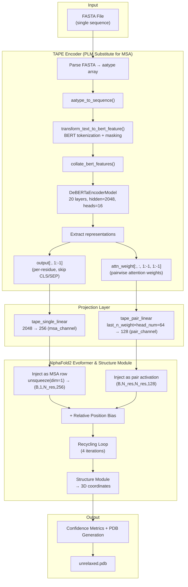
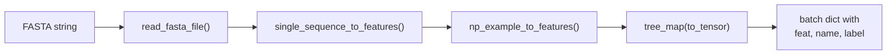
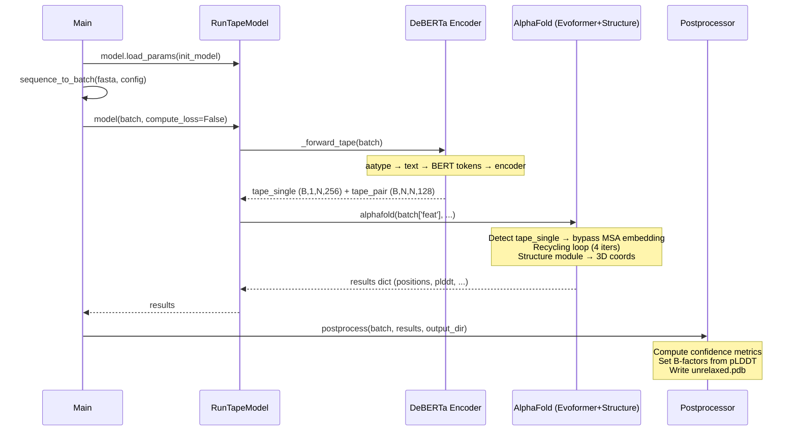

---
slug:18-helixfold-single-msa-free-prediction
blog_type:normal
---


HelixFold-Single 通过使用预训练蛋白质语言模型（PLM）的学习表征来替代同源序列的共进化信息，消除了 AlphaFold2 推理流水线中最耗时的组件——多序列比对（MSA）搜索。该系统接受**单一氨基酸序列**作为输入并生成 3D 原子坐标，在高度保守靶标上仅有轻微精度损失的情况下，大幅缩短了实际预测时间。本文档面向需要理解、扩展或部署该系统的开发者，详细记录了 HelixFold-Single 的架构、数据流、配置和推理机制。

## 架构动机：为何移除 MSA？

AlphaFold2 的预测能力从根本上依赖于两个外部输入：MSA（编码数千个同源序列间的进化约束）和结构模板（提供来自实验解析同源物的空间先验）。通过 HHblits、JackHMMER 和 HHsearch 等工具搜索这些输入，每个靶标可能需要消耗 **30 分钟到数小时**——这通常远超神经网络自身的计算时间。对于孤儿蛋白、宏基因组序列或快速筛选场景而言，这种预处理瓶颈是难以接受的。

HelixFold-Single 的核心假设是：在海量蛋白质序列语料库上通过掩码语言建模预训练的、规模足够大的蛋白质语言模型，能够内化足够的结构和进化信号，从而作为 MSA 的直接替代品。此处使用的基于 DeBERTa 的编码器（10 亿参数，20 层，16 个注意力头）同时生成**单一表征**（逐残基嵌入）和**成对表征**（逐残基对注意力权重矩阵），这些表征随后被线性投影到 AlphaFold2 Evoformer 所需的通道维度。这一替换点是该系统最具决定性的架构选择。

来源：[README.md](apps/protein_folding/helixfold-single/README.md)、[model_tape.py](apps/protein_folding/helixfold-single/utils/model_tape.py)

## 端到端架构

下图展示了从 FASTA 文件到 PDB 结构输出的完整推理流水线，重点突出了 PLM 替代 MSA 流水线的关键替换边界。



该流水线包含三个界限分明的阶段：PLM 编码（替代 MSA 搜索）、线性投影至兼容 AF2 的通道，以及标准的 AlphaFold2 Evoformer 到结构模块的流水线。循环机制和结构模块直接继承自 AlphaFold2 架构，未作任何修改。

来源：[helixfold_single_inference.py](apps/protein_folding/helixfold-single/helixfold_single_inference.py)、[model_tape.py](apps/protein_folding/helixfold-single/utils/model_tape.py)、[modules.py](apps/protein_folding/helixfold-single/alphafold_paddle/model/modules.py)

## 组件深度剖析

### RunTapeModel 编排器

[utils/model_tape.py](apps/protein_folding/helixfold-single/utils/model_tape.py) 中的 `RunTapeModel` 类是顶层的 `paddle.nn.Layer`，负责将 PLM 连接到 AF2 主干。其 `__init__` 方法执行了三项关键的初始化操作：

1. **TAPE 编码器**：通过 `_init_tape_encoder()` 实例化包裹在 `ProteinModel` 中的 `ProteinEncoderModel` → `DeBERTaEncoderModel`，以及两个线性投影头。
2. **TAPE 单一线性层**：将维度从 PLM 隐藏层大小（2048）映射到 AF2 的 MSA 通道（256），将逐残基的 PLM 嵌入转换到 MSA 表征空间。
3. **TAPE 成对线性层**：将维度从 `last_n_weight × head_num`（4 × 16 = 64）映射到 AF2 的成对通道（128），将注意力权重矩阵转换为残基对交互特征。

`forward()` 方法首先委托给 `_forward_tape()`，该方法会将 `tape_single` 和 `tape_pair` 注入批次字典中，随后将增强后的批次传递给标准的 `AlphaFold` 模块。AF2 的 `EmbeddingsAndEvoformer.forward()` 会检测批次中是否存在 `tape_single`，并**绕过标准的 MSA 嵌入路径**，直接使用 PLM 表征 [modules.py](apps/protein_folding/helixfold-single/alphafold_paddle/model/modules.py)。

来源：[model_tape.py](apps/protein_folding/helixfold-single/utils/model_tape.py#L32-L146)

### 带有注意力权重提取的 DeBERTa 编码器

PLM 主干是一个 DeBERTa（具有解缠结注意力的解码增强型 BERT）变体，在 [deberta_1B_bs_cp.json](apps/protein_folding/helixfold-single/tape/configs/deberta_1B_bs_cp.json) 中进行配置：

| 参数 | 值 | 意义 |
|-----------|-------|-------------|
| `model_type` | `"deberta"` | 解缠结的内容到位置注意力 |
| `hidden_size` | 2048 | 嵌入维度 |
| `intermediate_size` | 8192 | FFN 中间层 |
| `head_num` | 16 | 每层注意力头数 |
| `layer_num` | 20 | Transformer 编码器深度 |
| `only_c2p` | `true` | 仅使用内容到位置注意力（无位置到内容） |

`only_c2p` 标志在架构上具有重要意义：标准 DeBERTa 同时使用内容到位置（c2p）和位置到内容（p2c）的解缠结注意力。仅启用 c2p 能够减少计算量，同时仍能为蛋白质序列提供有意义的相对位置编码。当指定了 `return_last_n_weight` 时，编码器的 `forward()` 方法会同时返回 `output`（最终的隐藏状态）和 `attn_weight`（来自最后 `n` 层的注意力权重矩阵）。

`dyna_batch_mapping` 配置将序列长度映射到批次大小，从而在训练期间实现针对变长蛋白质的内存高效动态批处理——这是一种在推理路径中不存在的实际优化，但对生产部署至关重要。

来源：[deberta_1B_bs_cp.json](apps/protein_folding/helixfold-single/tape/configs/deberta_1B_bs_cp.json)、[protein_sequence_model_dynamic.py](apps/protein_folding/helixfold-single/tape/others/protein_sequence_model_dynamic.py#L163-L230)

### 单一与成对表征提取

[model_tape.py](apps/protein_folding/helixfold-single/utils/model_tape.py#L88-L110) 中的 `_forward_tape()` 方法执行了一系列精心编排的提取和重塑操作：

**单一表征路径：**
- PLM 编码器输出的形状为 `(B, N_res, 2048)`，其中 CLS 和 SEP 标记分别位于位置 0 和 N_res+1。
- 切片 `[:, :, 1:-1]` 移除这些特殊标记，生成 `(B, num_res, 2048)`。
- 通过 `_insert_recycle_dim()` 插入循环维度，生成 `(B, num_recycle, num_res, 2048)`。
- `tape_single_linear` 将其投影为 `(B, num_recycle, num_res, 256)`。

**成对表征路径：**
- 注意力权重的形状为 `(B, num_recycle, num_res+2, num_res+2, head_num)`。
- 切片 `[:, :, 1:-1, 1:-1]` 移除 CLS/SEP 交互 → `(B, num_recycle, num_res, num_res, 16)`。
- 转置为 `(B, num_recycle, num_res, num_res, 16)`，使头维度位于最后。
- `tape_pair_linear` 将维度从 `last_n_weight × head_num = 4 × 16 = 64` 投影到 `(B, num_recycle, num_res, num_res, 128)`。

[tape-lnw4.json](apps/protein_folding/helixfold-single/model_configs/tape-lnw4.json) 中的 `last_n_weight: 4` 配置指定了在投影前，需将最后 4 层的注意力权重沿头维度进行拼接。这种多层注意力提取策略能够捕获层次化的结构信息——早期层编码局部二级结构模式，而更深层则捕获长程三级接触。

来源：[model_tape.py](apps/protein_folding/helixfold-single/utils/model_tape.py#L74-L110)、[tape-lnw4.json](apps/protein_folding/helixfold-single/model_configs/tape-lnw4.json)

### AF2 主干：EmbeddingsAndEvoformer 处的分支点

这种替换边界表现为 [modules.py](apps/protein_folding/helixfold-single/alphafold_paddle/model/modules.py#L1647-L1662) 中 `EmbeddingsAndEvoformer.forward()` 内部的一个条件分支：

```python
if 'tape_single' in batch:
    msa_activations = paddle.unsqueeze(batch['tape_single'], axis=1)  # (B,1,N,256)
    pair_activations = batch['tape_pair']                             # (B,N,N,128)
else:
    # Standard AF2 path: preprocess_1d + preprocess_msa for MSA,
    # left_single + right_single for pair initialization
    ...
```

当存在 TAPE 表征时，标准的 `preprocess_1d`、`preprocess_msa`、`left_single` 和 `right_single` 线性层将被完全绕过。PLM 的单一表征沿 MSA 维度进行维度扩展（unsqueeze），成为单行 MSA（B, 1, N_res, 256），而 PLM 的成对表征则直接替代左右外积初始化。从此处开始——相对位置偏置注入、循环机制、Evoformer 堆栈以及结构模块——其计算过程与标准的 AlphaFold2 完全一致。

所使用的 AF2 模型配置为 `seq512_pair64_l24_vio0`，对应于一个禁用了结构违反损失，并采用了适合单序列输入的特定 MSA/成对通道设置的模型变体。

来源：[modules.py](apps/protein_folding/helixfold-single/alphafold_paddle/model/modules.py#L1520-L1662)、[config.py](apps/protein_folding/helixfold-single/alphafold_paddle/model/config.py)

## 数据流：从 FASTA 到特征批次

[helixfold_single_inference.py](apps/protein_folding/helixfold-single/helixfold_single_inference.py#L53-L65) 中的 `sequence_to_batch()` 函数编排了此次转换：



[data_utils.py](apps/protein_folding/helixfold-single/alphafold_paddle/data/data_utils.py#L40-L44) 中的 `single_sequence_to_features()` 函数构建了一个仅包含查询序列的合成 A3M 字符串，并将其传递给标准的 `a3m_to_features()` 路径。这会生成一个包含单行 MSA 字段（无同源序列）的特征字典，随后 `np_example_to_features()` 根据 AF2 模型配置对其进行填充和处理。最终结果是一个批次字典，其中每个与 MSA 相关的张量在序列轴上的深度均为 1——这是 AlphaFold2 所需的最小有效输入。

在 `_forward_tape()` 期间，批次的 `aatype` 张量通过 `aatype_to_sequence()` 被解码回文本序列，然后使用 `transform_text_to_bert_feature()` 为 BERT/DeBERTa 模型重新进行分词。之所以存在这种往返转换（数值 → 文本 → BERT 标记），是因为 AF2 特征流水线和 TAPE 分词器使用了不同的氨基酸编码方式。

来源：[helixfold_single_inference.py](apps/protein_folding/helixfold-single/helixfold_single_inference.py#L53-L65)、[data_utils.py](apps/protein_folding/helixfold-single/alphafold_paddle/data/data_utils.py#L40-L83)、[model_tape.py](apps/protein_folding/helixfold-single/utils/model_tape.py#L74-L87)

## 配置系统

HelixFold-Single 采用三层配置堆栈，在推理初始化时加载：

| 配置文件 | 格式 | 作用域 |
|------------|--------|-------|
| `model_configs/tape-lnw4.json` | JSON | TAPE 集成：`last_n_weight=4` |
| `tape/configs/deberta_1B_bs_cp.json` | JSON | PLM 架构：隐藏层大小、层数、头数、动态批处理映射 |
| AF2 `seq512_pair64_l24_vio0` (内置) | Python ConfigDict | Evoformer 维度、循环机制、头数、结构模块 |

`last_n_weight` 参数控制 DeBERTa 编码器最后有多少层为成对表征提供注意力权重。当该值为 4 时，意味着最后 4 层的注意力模式（4 × 16 个头 = 64 个通道）将在投影到 128 个通道之前进行拼接。增加此值可以捕获更多的层次化信息，但同时也会增加成对张量的内存开销。

AF2 模型变体 `seq512_pair64_l24_vio0` 的特点在于其缩减的通道大小和被禁用的结构违反损失，这在没有模板监督的情况下运行是非常合理的。

来源：[helixfold_single_inference.py](apps/protein_folding/helixfold-single/helixfold_single_inference.py#L91-L97)、[config.py](apps/protein_folding/helixfold-single/alphafold_paddle/model/config.py)

## 推理执行

### 运行预测

完整的推理命令仅需三个参数：

```bash
python helixfold_single_inference.py \
    --init_model=./helixfold-single.pdparams \
    --fasta_file=data/7O9F_B.fasta \
    --output_dir="./output"
```

| 参数 | 描述 |
|----------|-------------|
| `--init_model` | 预训练 HelixFold-Single 检查点的路径（包含 PLM 和 AF2 权重的单一 `.pdparams` 文件） |
| `--fasta_file` | 包含单一蛋白质序列的输入 FASTA 文件 |
| `--output_dir` | 写入 `unrelaxed.pdb` 的目录 |

输出目录包含一个 `unrelaxed.pdb` 文件，按照 AlphaFold2 的约定，其每个原子的 B-factor 被设置为预测的 LDDT 置信度分数。“unrelaxed” designation 表明未应用 Amber 弛豫处理——这些坐标是结构模块的直接输出。在生产环境中，可将 AlphaFold2 弛豫流水线（位于 `alphafold_paddle/relax/`）作为后处理步骤应用。

来源：[helixfold_single_inference.py](apps/protein_folding/helixfold-single/helixfold_single_inference.py#L100-L122)、[helixfold_single_inference.py](apps/protein_folding/helixfold-single/helixfold_single_inference.py#L67-L81)

### 推理流程详解



来源：[helixfold_single_inference.py](apps/protein_folding/helixfold-single/helixfold_single_inference.py#L85-L110)

## 项目文件结构

```
helixfold-single/
├── helixfold_single_inference.py    # Entry point: CLI arg parsing, batch creation, post-processing
├── model_configs/
│   └── tape-lnw4.json               # TAPE-AF2 bridge config (last_n_weight)
├── tape/
│   ├── configs/
│   │   └── deberta_1B_bs_cp.json    # PLM architecture config
│   └── others/
│       ├── protein_sequence_model_dynamic.py  # DeBERTa/Transformer/Rotary encoders
│       ├── dataset.py                # BERT feature transform, collation
│       ├── protein_tools.py          # ProteinTokenizer
│       ├── transformer_block.py      # DeBERTa encoder layer primitives
│       └── utils.py                  # Utilities
├── alphafold_paddle/                 # AF2 trunk (PaddlePaddle reimplementation)
│   ├── model/
│   │   ├── modules.py                # AlphaFold, Evoformer, EmbeddingsAndEvoformer
│   │   ├── config.py                 # AF2 model variant configurations
│   │   ├── features.py               # Feature processing
│   │   ├── folding.py                # Structure module
│   │   ├── all_atom.py               # All-atom geometry operations
│   │   └── lddt.py                   # LDDT computation
│   ├── data/
│   │   ├── data_utils.py             # single_sequence_to_features, a3m parsing
│   │   ├── pipeline.py               # make_sequence_features, make_msa_features
│   │   ├── parsers.py                # A3M/FASTA parsers
│   │   └── templates.py              # Template processing
│   ├── common/
│   │   ├── protein.py                # PDB serialization (to_pdb, from_prediction)
│   │   └── residue_constants.py      # Atom types, restype mappings
│   ├── distributed/                  # Distributed training primitives (bp, dap)
│   └── relax/                        # Amber relaxation (optional post-processing)
├── utils/
│   ├── model_tape.py                 # RunTapeModel: PLM→AF2 integration layer
│   └── utils.py                      # tree_map, parameter size utilities
├── data/                             # Sample FASTA files (7O9F_B, T1026, T1037)
└── requirements.txt                  # Python dependencies
```

来源：[helixfold-single/](apps/protein_folding/helixfold-single/)

<CgxTip>
DeBERTa 配置中的 `only_c2p: true` 标志是一项深思熟虑的架构选择，与完整的 DeBERTa 相比，它将注意力计算量减半。由于蛋白质序列本身已具备位置结构（线性链），仅凭内容到位置的解缠结注意力就足以提供用于结构推断的相对位置信号。对于此特定的下游任务，重新启用位置到内容注意力会增加浮点运算量，却无法带来同等的精度提升。
</CgxTip>

<CgxTip>
`_forward_tape()` 中的 `_insert_recycle_dim()` 函数通过在所有循环迭代中对 PLM 输出进行平铺来插入循环维度。这意味着在每一个循环步骤中重用的是相同的 PLM 嵌入——PLM 在循环期间绝不会重新运行。仅有 AF2 Evoformer 和结构模块参与循环，与 O(N²) 的 PLM 注意力计算相比，这使得每次循环的开销降到了最低。
</CgxTip>

## 环境与部署

HelixFold-Single 具有特定的环境要求，依赖于 PaddlePaddle 的 `dev` 分支和 CUDA 11.2：

| 组件 | 所需版本 | 备注 |
|-----------|-----------------|-------|
| Python | 3.7 | 兼容 PaddlePaddle dev 构建 |
| CUDA | 11.2 | 提供的 wheel 所必需 |
| cuDNN | 8.10.1 | 必须与 CUDA 版本匹配 |
| NCCL | 2.12.12 | 用于分布式推理（可选） |
| PaddlePaddle | `dev` 分支 | 稳定的 PyPI 发布版中不提供 |

提供了一个适用于配备 CUDA 11.2 的 A100 GPU 的预构建 PaddlePaddle wheel。对于其他 GPU 架构，需要从源码安装 PaddlePaddle `dev` 版本。

来源：[README.md](apps/protein_folding/helixfold-single/README.md#L18-L32)

## 与相关系统的对比

| 特性 | HelixFold-Single | HelixFold (MSA) | OmegaFold |
|---------|-----------------|-----------------|-----------|
| **输入** | 单一序列 | MSA + 模板 | 单一序列 |
| **PLM 主干** | DeBERTa 1B | 不适用 | 3-SE(3)-Transformer |
| **结构主干** | AlphaFold2 Evoformer | AlphaFold2 Evoformer | 自定义 SE(3) 主干 |
| **成对表征** | PLM 注意力权重 | MSA 嵌入的外积 | SE(3) 等变注意力 |
| **循环机制** | 4 次迭代 | 3-4 次迭代 | 单次传递 |
| **MSA 搜索时间** | 0 秒 | 30 分钟至数小时 | 0 秒 |
| **靶标精度** | 接近 AF2（高 MSA 情况下） | 最先进水平 | 具有竞争力 |

HelixFold-Single 独特的设计选择在于利用 PLM 的**注意力权重矩阵**作为结构成对表征，而不是从头学习单独的成对嵌入或使用几何不变量。这是一种数据高效策略：注意力权重本身已经编码了在预训练期间学习到的残基对关系。

## 延伸阅读

- **HelixFold（基于 MSA 的 AlphaFold2）**：HelixFold-Single 结构主干的来源，即完整的基于 MSA 的流水线——参见 [HelixFold: AlphaFold2 Reproduction](17-helixfold-alphafold2-reproduction)。
- **使用 TAPE 进行蛋白质预训练**：DeBERTa 编码器背后的预训练方法——参见 [Protein Pretraining with TAPE](13-protein-pretraining-with-tape)。
- **HelixFold3**：下一代生物分子结构预测系统——参见 [HelixFold3: Biomolecular Structure Prediction](19-helixfold3-biomolecular-structure-prediction)。
- **Transformer Block Implementation**：整个 HelixFold 生态系统中使用的注意力机制详情——参见 [Transformer Block Implementation](20-transformer-block-implementation)。