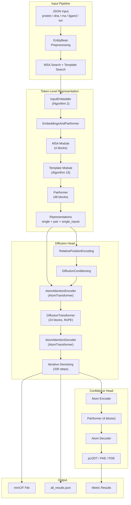
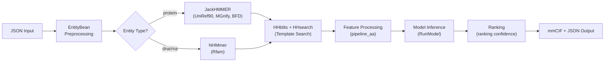

---
slug:19-helixfold3-biomolecular-structure-prediction
blog_type:normal
---


HelixFold3 是 PaddleHelix 对 AlphaFold3 统一生物分子结构预测能力的复现，完全基于 PaddlePaddle 深度学习框架实现。与其孤立处理蛋白质的前代版本不同，HelixFold3 能够在单次前向传播中，预测蛋白质、核酸（DNA/RNA）、小分子配体、离子以及翻译后修饰的联合全原子结构。该系统用**基于扩散的生成头**取代了 AlphaFold2 的刚体结构模块，直接对原子坐标进行采样，从而能够对异质生物分子组装体中的共价与非共价相互作用进行灵活建模。

来源：[README.md](apps/protein_folding/helixfold3/README.md)、[modules_all_atom.py](apps/protein_folding/helixfold3/helixfold/model/modules_all_atom.py#L50-L151)

## 架构概述

HelixFold3 的架构遵循两阶段设计：**Token 级表示提取器**（源自 AlphaFold2 的 Evoformer 演化分支）生成对表示和单表示，随后由**扩散模块**消费这些表示，迭代地对 3D 原子坐标进行去噪。其关键创新在于连接 Token 级与原子级表示的基于注意力的机制，使得扩散模块能够对每个原子（包括配体重原子）进行推理，同时不牺牲可扩展性。



来源：[modules_all_atom.py](apps/protein_folding/helixfold3/helixfold/model/modules_all_atom.py#L53-L84)、[diffusion.py](apps/protein_folding/helixfold3/helixfold/model/diffusion.py#L112-L228)、[config.py](apps/protein_folding/helixfold3/helixfold/model/config.py#L46-L417)

## 核心模型：HelixFold3 前向传播

`HelixFold3` 类负责编排整个预测流程。接收到批次数据后，它首先通过 `InputEmbedder` 生成 Token 级嵌入，然后通过 `EmbeddingsAndPairformer` 进行迭代循环（可配置 `num_recycle` 轮次），最后将收敛后的表示分发给扩散头和置信度头。

前向传播揭示了一种经过深思熟虑的精度管理策略：当启用 AMP bfloat16 时，表示会在进入扩散头之前被显式转换回 float32，以在 200 步去噪过程中保持数值稳定性。这一点至关重要，因为扩散调度涉及极小的噪声值（`s_min = 4e-4`），在此情况下 float16 精度会累积灾难性的舍入误差。

来源：[modules_all_atom.py](apps/protein_folding/helixfold3/helixfold/model/modules_all_atom.py#L87-L151)

### Token 级表示主干网络

表示主干网络高度镜像了 AlphaFold2 的架构，并针对多链、多实体系统进行了针对性修改。`InputEmbedder` 利用残基类型嵌入、位置编码和实体类型指示器构建初始的单表示和对表示。`EmbeddingsAndPairformer` 模块将模板嵌入、MSA 处理和 Pairformer 主体串联在一起。

配置中的**关键架构维度**揭示了模型的规模：

| 组件 | 参数 | 值 | 备注 |
|---|---|---|---|
| Token 通道 | `token_channel` | 384 | 单表示维度 |
| 对通道 | `token_pair_channel` | 128 | 对表示维度 |
| MSA 通道 | `msa_channel` | 64 | MSA 特征维度 |
| MSA 模块块数 | `num_block` | 4 | MSA 深度为 4096 |
| Pairformer 块数 | `num_block` | 48 | 核心迭代优化 |
| 扩散 Token 通道 | `diffusion_token_channel` | 768 | 为扩散头扩展 |
| 原子通道 | `atom_channel` | 128 | 每个原子的特征维度 |

**MSA 模块**采用 `MSAPairWeightedAveraging`（算法 10）而非标准的行注意力，该机制利用对表示对 MSA 信息进行加权聚合——这是在 EvoformerV3 实现中记录的 HelixFold3 特有修改。Pairformer 本身保留了熟悉的三角乘法（外向/内向）和三角注意力（起始/终止节点）模式，dropout 率为 0.25，在具有 4 个注意力头和 128 个中间通道的对表示上进行操作。

来源：[config.py](apps/protein_folding/helixfold3/helixfold/model/config.py#L46-L255)、[modules_all_atom.py](apps/protein_folding/helixfold3/helixfold/model/modules_all_atom.py#L283-L645)

### 扩散模块：生成式全原子结构预测

`DiffusionModule` 是 HelixFold3 生成能力的核心。它不再预测一组固定的帧（如 AlphaFold2 的结构模块），而是通过迭代去噪扩散过程，为系统中的**所有原子**（包括蛋白质侧链原子、核酸原子和配体重原子）采样 3D 坐标。

扩散过程使用**Karras 类型噪声调度**，包含以下超参数：`sigma_data = 16`、`s_max = 160`、`s_min = 4e-4`、`p = 7`，共 200 个采样步。从按 `c_list[0]` 缩放的纯高斯噪声开始，每一步执行中心随机增强，添加基于当前噪声水平的条件随机噪声，通过前向模型进行去噪，并应用带有 eta 调整（`eta = 1.5`）的 Euler 步更新。一个值得注意的启发式策略是，当 Token 数量超过 1400 时会禁用随机性（`gamma0 = 0`），通过牺牲采样多样性来换取大型复合体的推理速度。

每个去噪步骤中的前向模型遵循以下流程：

1. **DiffusionConditioning** 使用基于 `sigma_data` 的自适应缩放，从时间步 `t_hat`、相对位置编码和主干表示生成条件信号 `si`（单表示）和 `zij`（对表示）。
2. 对含噪坐标进行归一化以生成 `r_noisy`。
3. **AtomAttentionEncoder** 使用带有跳跃连接的局部窗口注意力（`n_query=32`，`n_key=128`）将 Token 级信号转换为原子级特征。
4. 线性投影将原子特征桥接到更宽的扩散 Token 通道（768）。
5. **DiffusionTransformer** 执行 24 个带有对偏置和 RoPE（启用时）的全局注意力块。
6. **AtomAttentionDecoder** 通过另一个 AtomTransformer 聚合回原子级坐标更新。
7. 输出通过学习到的 c-skip 和 c-out 系数，将跳跃预测的去噪信号与原始含噪输入结合起来。

<CgxTip>
`AttentionIndex` 单例实现了一项**局部序列注意力**优化，将原子划分为 32 个查询 / 128 个键原子的重叠窗口。这将原子级的注意力复杂度从 O(N²) 降低到了 O(N·128)，使得配体建模变得切实可行。该索引采用延迟缓存机制，并在遇到更大分子时动态扩展。
</CgxTip>

来源：[diffusion.py](apps/protein_folding/helixfold3/helixfold/model/diffusion.py#L112-L268)、[diffusion.py](apps/protein_folding/helixfold3/helixfold/model/diffusion.py#L368-L410)、[diffusion.py](apps/protein_folding/helixfold3/helixfold/model/diffusion.py#L1038-L1288)

### 旋转位置编码与链感知编码

HelixFold3 在扩散 Transformer 和原子注意力层中引入了**旋转位置编码（RoPE）**。与 AlphaFold2 中使用的绝对位置编码不同，RoPE 通过应用于查询/键对的旋转矩阵来编码相对位置，从而对可变长度序列提供更好的泛化能力。`allatom_demo` 配置在所有扩散 Transformer 组件（`atom_encoder`、`diffusion_transformer`、`atom_decoder`）中启用了 RoPE。

此外，`ChainIDEmbedding` 通过对输入批次中的 `entity_id` 和 `asym_id` 进行嵌入，提供实体类型和非对称链感知能力，使得模型能够在多链复合体中区分不同的链和实体类型（蛋白质、DNA、RNA、配体）。

来源：[rotary.py](apps/protein_folding/helixfold3/helixfold/model/rotary.py#L42-L110)、[config.py](apps/protein_folding/helixfold3/helixfold/model/config.py#L37-L44)

### 置信度预测头

`ConfidenceHead`（算法 31）作用于扩散输出，以预测每原子和每 Token 的质量指标。它镜像了扩散模块的编码器-解码器结构：一个 4 块的 Pairformer 处理 Token 级表示，而原子编码器/解码器桥接到原子级预测。该头部产生三个主要指标，并具有可配置的分箱设置：

| 指标 | 分箱数 | 步长 | 用途 |
|---|---|---|---|
| pLDDT | 50 | — | 每残基局部置信度 |
| PAE | 64 | 0.5 Å | Token 对之间的预测对齐误差 |
| PDE | 64 | 0.5 Å | 预测距离误差 |

置信度头根据 `confidence_head.weight` 配置参数（默认为 0.0，在 `allatom_demo` 配置中设置为 0.01）进行条件实例化，允许在纯推理场景中禁用它以节省内存。

来源：[modules_all_atom.py](apps/protein_folding/helixfold3/helixfold/model/modules_all_atom.py#L929-L1080)、[config.py](apps/protein_folding/helixfold3/helixfold/model/config.py#L304-L399)

## 输入规范与预处理流程

HelixFold3 接受基于 JSON 的输入格式，其中每个预测任务被描述为一个**实体**列表——这些异质生物分子组件共同构成待预测的复合体。

```json
{
    "entities": [
        {
            "type": "protein",
            "sequence": "MDTEVYESPYADPEEIR...",
            "count": 1
        },
        {
            "type": "dna",
            "sequence": "CCATTATAGC",
            "count": 1,
            "modification": [
                {"type": "residue_replace", "ccd": "5CM", "index": 2}
            ]
        },
        {
            "type": "ligand",
            "ccd": "QF8",
            "count": 1
        }
    ]
}
```

每个实体指定其 `type`（`protein`、`dna`、`rna`、`ligand` 或 `ion` 之一）、主序列或标识符，以及用于同聚拷贝的 `count`。在 `preprocess.py` 中实现的预处理流程将每个实体转换为 `EntityBean` 数据类，该类携带 CCD 编码的序列、MSA 序列、实体计数和原始分子信息。**配体可以通过 CCD 代码**（来自 wwPDB 化学组分字典）**或 SMILES 字符串指定**，后者通过预处理的 CCD pickle 文件，利用基于 RDKit 的 3D 构象生成（ETKDG 方法）进行处理。

`modification` 字段支持使用 CCD 代码和基于 1 的索引进行残基级别的修饰（例如甲基化碱基、磷酸化残基）。`input_validation.py` 中的验证层强制执行约束条件，包括最小序列长度（4）、SMILES 的最大重原子数（100）以及 CCD 代码的有效性，并通过 `EntityBean` 中定义的结构化错误代码系统（代码 0–16）报告错误。

来源：[README.md](apps/protein_folding/helixfold3/README.md)、[preprocess.py](apps/protein_folding/helixfold3/infer_scripts/preprocess.py#L38-L236)、[entity_bean.py](apps/protein_folding/helixfold3/infer_scripts/entity_bean.py#L24-L120)

## 推理流程

推理流程集成了 MSA/模板搜索、特征提取、模型执行和输出序列化。`inference.py` 中的 `main()` 函数编排了整个工作流。



该流程支持两种数据库预设：用于更快迭代的 `reduced_dbs`（下载约 190 GB，解压后约 530 GB），以及 `full_dbs`（暂未提供）。每个实体触发相应的 MSA 搜索流程——蛋白质实体使用 JackHMMER 搜索 UniRef90、MGnify 和（可选的）BFD，而 DNA/RNA 实体使用 NHMmer 搜索 Rfam。通过 HH-suite 进行的模板搜索会查询 PDB_seqres 和 mmCIF 数据库。

`RunModel` 封装器负责处理模型实例化、权重加载和分批推理调度。`eval()` 函数在 `paddle.no_grad()` 下运行推理，处理扩散模块的每样本输出，并委托给 `save_result()`，该函数按排名划分多样本预测结果，并通过 `mmcif_writer` 和 `post_calculate` 工具写入 mmCIF 结构文件和 JSON 指标结果。

来源：[inference.py](apps/protein_folding/helixfold3/inference.py#L90-L637)、[utils/model.py](apps/protein_folding/helixfold3/utils/model.py#L24-L52)、[run_infer.sh](apps/protein_folding/helixfold3/run_infer.sh)

## 关键推理参数

| 参数 | 默认值 | 描述 |
|---|---|---|
| `--input_json` | *必填* | 输入 JSON 文件路径 |
| `--output_dir` | *必填* | 结果输出目录 |
| `--ccd_preprocessed_path` | *必填* | CCD 预处理 pickle 文件路径（ETKDG 构象） |
| `--model_name` | — | 模型配置名称（`allatom_demo`） |
| `--init_model` | — | 检查点 `.pdparams` 文件路径 |
| `--infer_times` | 1 | 要生成的随机样本数量 |
| `--diff_batch_size` | -1 | 覆盖扩散批次大小（-1 表示使用配置默认值 5） |
| `--preset` | `full_dbs` | 数据库预设（`reduced_dbs` 或 `full_dbs`） |
| `--precision` | `fp32` | 精度模式（`fp32` 或 `bf16`） |
| `--amp_level` | `O1` | AMP 优化级别 |
| `--max_template_date` | *必填* | 模板过滤的截止日期 |
| `--seed` | None | 用于可复现性的随机种子 |

来源：[inference.py](apps/protein_folding/helixfold3/inference.py#L548-L637)

## 环境与安装

HelixFold3 需要特定的软件栈，已在 NVIDIA A100 硬件上完成验证：

| 组件 | 版本 |
|---|---|
| Python | 3.10 |
| CUDA | 12.0 |
| cuDNN | 8.4.0 |
| NCCL | 2.14.3 |
| PaddlePaddle | 3.1.0 |

安装遵循双环境模式：`msa_env` conda 环境提供生物信息学工具（JackHMMER、HH-suite、Kalign，以及通过 HMMER 提供的 NHMmer），而 `helixfold` 环境则承载 PaddlePaddle 和 Python 依赖项。`download_all_data.sh` 脚本使用 `aria2c` 进行并行下载，自动完成遗传数据库的获取。

模型检查点作为单个 zip 压缩包分发（例如 `HelixFold3-params-20250714.zip`），包含 `.pdparams` 文件，需放置在 `./init_models/` 目录下以供推理脚本引用。

来源：[README.md](apps/protein_folding/helixfold3/README.md)、[run_infer.sh](apps/protein_folding/helixfold3/run_infer.sh)

## HelixFold3.2 更新（2025 年 7 月）

最新版本 **HelixFold3.2** 在蛋白质结构预测质量方面引入了针对性的改进。在 FoldBench 上的基准测试表明，该更新在蛋白质相关任务上取得了可测量的收益，同时在**原子空间冲突**（生成式结构模型中的一种常见失效模式，即预测的原子违反了物理距离约束）方面实现了显著减少。这些改进是通过更新的检查点权重实现的，无需更改架构，这意味着推理流程和配置保持完全一致。

来源：[README.md](apps/protein_folding/helixfold3/README.md)

## 延伸阅读

HelixFold3 在其前代产品建立的演化基础之上，引入了根本性的新生成能力。要了解其架构谱系，请参阅 [HelixFold：AlphaFold2 复现](17-helixfold-alphafold2-reproduction) 以获取最初的 Pairformer 和结构模块设计，并参阅 [HelixFold-Single：无 MSA 预测](18-helixfold-single-msa-free-prediction) 以了解消除 MSA 依赖性的蛋白质语言模型方法。对于整个模型中使用的底层注意力原语，请参阅 [Transformer Block 实现](20-transformer-block-implementation)。[InMemoryDataset 与数据流程](7-inmemorydataset-and-data-pipeline) 页面涵盖了 PaddleHelix 工具包中的核心数据集抽象。