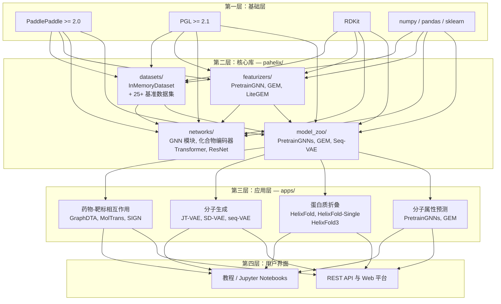
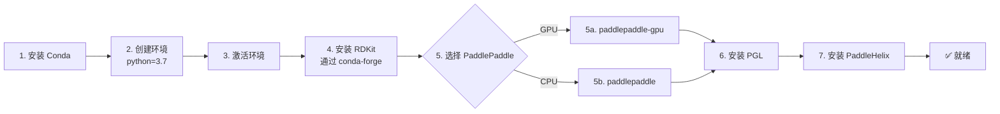
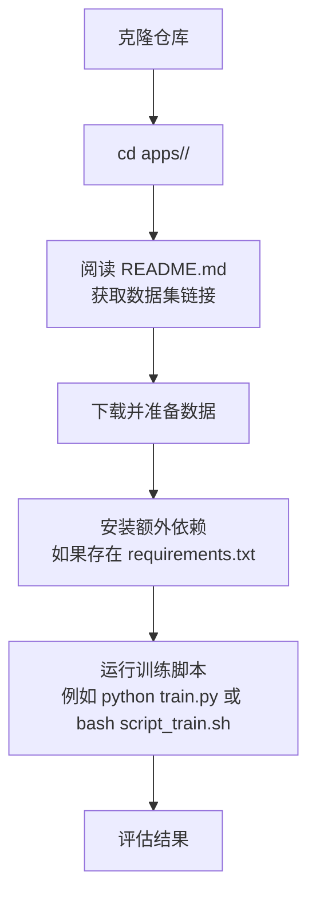

---
slug:2-quick-start
blog_type:normal
---


在你的机器上运行 PaddleHelix，并在 15 分钟内构建你的第一个分子属性预测模型。本指南将引导你完成环境搭建、库结构介绍，以及核心数据流水线的实战演练——为你使用 PaddlePaddle 探索药物发现、蛋白质折叠和分子生成打下坚实基础。


## 宏观架构

在输入任何终端命令之前，先从结构层面理解 PaddleHelix 到底是什么会很有帮助。它并非一个单体应用，而是一个构建于 PaddlePaddle 和 PGL（Paddle Graph Learning）之上的分层工具包，共分为四个同心层。下图展示了这些层级，并说明了数据如何从原始分子和蛋白质一直流转到特定任务的预测结果。



**核心要点**：第二层（`pahelix/`）中的所有内容都是纯 Python 代码，可以直接导入。第三层（`apps/`）包含独立的项目——每个项目都有自己的 `README.md`、训练脚本和配置文件。第一层是你首先需要安装的外部依赖项集合。

## 步骤 1 — 安装依赖

PaddleHelix 需要 Conda 环境，因为其中一个关键依赖——**RDKit**（化学信息学工具包）——无法仅通过 `pip` 安装。完整的依赖矩阵如下表所示。

| 依赖项 | 最低版本 | 安装方式 | 用途 |
|---|---|---|---|
| Python | 3.6 / 3.7 | conda | 运行环境 |
| paddlepaddle | ≥ 2.0.0rc0 | pip | 深度学习框架 |
| pgl | ≥ 2.1 | pip | 图神经网络库 |
| rdkit | 任意 | conda | 分子特征化 |
| numpy | 任意 | pip | 数值计算 |
| pandas | 任意 | pip | 数据处理 |
| networkx | 任意 | pip | 图工具 |
| sklearn | 任意 | pip | 评估指标 |

来源：[installation_guide.md](installation_guide.md#L8-L18)、[setup.py](setup.py#L117-L121)

完整的安装流程共分为八个步骤。请按顺序执行——每一步都依赖于前一步的成功执行。



打开终端并执行以下命令：

```bash
# 步骤 1-2：创建专属的 conda 环境
conda create -n paddlehelix python=3.7

# 步骤 3：激活环境
conda activate paddlehelix

# 步骤 4：安装 RDKit（化学信息学——分子特征化所需）
conda install -c conda-forge rdkit

# 步骤 5a：安装 PaddlePaddle GPU 版本
python -m pip install paddlepaddle-gpu -f https://paddlepaddle.org.cn/whl/stable.html

# — 或 步骤 5b：安装 PaddlePaddle CPU 版本 —
# python -m pip install paddlepaddle -i https://mirror.baidu.com/pypi/simple

# 步骤 6：安装 PGL (Paddle Graph Learning)
pip install pgl

# 步骤 7：安装 PaddleHelix
pip install paddlehelix
```

来源：[installation_guide.md](installation_guide.md#L20-L84)

<CgxTip>
如果你打算进行蛋白质折叠或分子对接相关工作，请查看各应用目录下的独立 `requirements.txt` 文件——它们通常包含一些非核心安装部分的额外依赖，如 `openmm`、`ml-collections` 或 `biopython`。
</CgxTip>

## 步骤 2 — 验证安装

安装完成后，验证所有关键模块是否能正确导入。创建一个快速测试脚本或以交互方式运行以下检查：

```python
import paddle
print(f"PaddlePaddle version: {paddle.__version__}")    # 预期 >= 2.0.0

import pgl
print(f"PGL imported successfully")                      # 无报错即成功

from rdkit import Chem
mol = Chem.MolFromSmiles('CCO')                          # 乙醇
print(f"RDKit molecule created: {Chem.MolToSmiles(mol)}") # CCO

import pahelix
print("PaddleHelix imported successfully")
```

如果出现导入失败，最常见的原因是： 安装 PaddlePaddle 的 conda 环境与安装 PaddleHelix 的环境不一致，或者 Python 版本不匹配。请重新检查步骤 1，并确保所有命令都在同一个已激活的 `paddlehelix` 环境中运行。

## 步骤 3 — 了解核心库

安装 PaddleHelix 后，`pahelix` 包将成为你的主要接口。以下是该库四个子包的结构图及其各自包含的内容。

```
pahelix/
├── datasets/          # 25+ 内置基准数据集 + InMemoryDataset 基类
│   ├── inmemory_dataset.py    ← 核心数据容器（加载、保存、转换、批次处理）
│   ├── bbbp_dataset.py        ← 血脑屏障穿透性
│   ├── bace_dataset.py        ← BACE 抑制剂活性
│   ├── hiv_dataset.py         ← HIV 活性预测
│   ├── qm9_dataset.py         ← 量子化学属性
│   ├── tox21_dataset.py       ← 毒性预测
│   └── ... (20+ 更多数据集)
├── featurizers/        # 将原始分子/蛋白质转换为模型可用的张量
│   └── pretrain_gnn_featurizer.py  ← AttrmaskTransformFn, SupervisedTransformFn
├── networks/           # 可复用的神经网络构建模块
│   ├── gnn_block.py           ← 图卷积层
│   ├── compound_encoder.py    ← 分子嵌入
│   ├── transformer_block.py   ← 注意力机制
│   └── resnet_block.py        ← 残差网络
└── model_zoo/          # 预构建的端到端模型
    ├── pretrain_gnns_model.py ← 预训练分子 GNN
    └── light_gem_model.py     ← 几何增强模型
```

来源：[pahelix/datasets/__init__.py](pahelix/datasets/__init__.py#L1-L40)、[pahelix/featurizers/__init__.py](pahelix/featurizers/__init__.py#L1-L20)、[pahelix/model_zoo/__init__.py](pahelix/model_zoo/__init__.py#L1-L21)

首先需要理解的最重要类是 **`InMemoryDataset`** ——它是 PaddleHelix 中每个数据集和应用所依赖的通用数据容器。它接受原始的 Python 字典列表或预缓存的 `.npz` 文件路径，并内置了并行特征化、批次处理和序列化方法。

来源：[pahelix/datasets/inmemory_dataset.py](pahelix/datasets/inmemory_dataset.py#L33-L169)

## 步骤 4 — 选择你的应用领域

PaddleHelix 涵盖三个主要领域。使用下表来确定哪个应用领域符合你的目标，然后导航到相应的目录。

| 领域 | 应用 | 目录 | 核心方法 | 输出 |
|---|---|---|---|---|
| **药物发现** | 化合物属性预测 | `apps/pretrained_compound/` | GEM, PretrainGNNs, InfoGraph | 分子属性值 |
| | 药物-靶标相互作用 | `apps/drug_target_interaction/` | GraphDTA, MolTrans, SIGN, BatchDTA, SMAN | 结合亲和力评分 |
| | 分子生成 | `apps/molecular_generation/` | JT-VAE, SD-VAE, seq-VAE | 新型分子结构 |
| | 药物-药物协同作用 | `apps/drug_drug_synergy/` | DTSyn, RGCN | 协同评分 |
| | 少样本预测 | `apps/fewshot_molecular_property/` | PAR | 带有限标签的属性 |
| **蛋白质科学** | 蛋白质结构预测 | `apps/protein_folding/helixfold/` | HelixFold (AlphaFold2) | 3D 蛋白质结构 |
| | 无 MSA 结构预测 | `apps/protein_folding/helixfold-single/` | HelixFold-Single | 快速生成 3D 结构 |
| | 生物分子结构 | `apps/protein_folding/helixfold3/` | HelixFold3 | 蛋白质 + 配体 + 核酸 |
| | 蛋白质功能 | `apps/protein_function_prediction/` | DeepFRI, PTHL | 功能注释 |
| | 蛋白质-蛋白质相互作用 | `apps/protein_protein_interaction/` | Multimodal PPI | 相互作用预测 |
| **精准医疗** | 癌症药物响应 | `apps/cancer_drug_response/` | DeepCDR, STR | 药物敏感性 |
| | 分子对接 | `apps/molecular_docking/helixdock/` | HelixDock | 蛋白质-配体构象 |

来源：[README.md](README.md#L92-L130)

<CgxTip>
`apps/` 下的每个应用都是**独立运行**的。每个子目录都包含自己的 `README.md`，其中提供了数据集下载说明、训练命令和预期结果。你无需了解完整的 PaddleHelix 库即可使用特定应用——但理解 `pahelix` 核心库将有助于你进行定制和扩展。
</CgxTip>

## 步骤 5 — 运行你的第一个教程

建立直观认识的最快方法是使用提供的 Jupyter Notebook 教程。它们涵盖了端到端的工作流：从加载数据集和分子特征化，到训练 GNN 模型，再到在基准任务上评估结果。

### 可用教程

| 教程 | 领域 | 你将学到 |
|---|---|---|
| 化合物属性预测 | 药物发现 | 加载 MoleculeNet 数据集、构建 GNN、预测毒性 |
| 蛋白质预训练与属性预测 | 蛋白质科学 | 预训练蛋白质表示、在下游任务上进行微调 |
| 药物-靶标相互作用：GraphDTA | 药物发现 | 基于图的药物-靶标亲和力预测 |
| 药物-靶标相互作用：MolTrans | 药物发现 | 基于 Transformer 的相互作用预测 |
| 分子生成 | 药物发现 | 使用 VAE 模型生成新型分子 |
| RNA 二级结构 | 疫苗设计 | 使用 LinearRNA 预测 RNA 折叠 |

来源：[tutorials/README.md](tutorials/README.md#L1-L25)

### 设置与启动

```bash
# 确保在你的 paddlehelix 环境中安装了 Jupyter
pip install jupyterlab

# 克隆仓库（如果尚未克隆）
git clone https://github.com/PaddlePaddle/PaddleHelix.git
cd PaddleHelix/tutorials/

# 启动 Jupyter Lab
jupyter-lab
```

Jupyter Lab 在浏览器中打开后，导航至任意 `.ipynb` 文件并按顺序执行代码单元格。每个 Notebook 都设计为可在标准工作站上运行——入门教程不需要 GPU，但拥有 GPU 会使训练速度更快。

来源：[tutorials/README.md](tutorials/README.md#L15-L25)

## 步骤 6 — 从源码运行应用

出于生产环境使用或定制化需求，你会希望直接从源代码运行应用，而不是通过 Notebook。所有应用通用的一般模式如下：



例如，运行 **GraphDTA** 药物-靶标相互作用模型：

```bash
cd apps/drug_target_interaction/graph_dta/
# 阅读 README 了解数据集准备步骤
# 安装任何额外的依赖
pip install -r requirements.txt  # 如果存在该文件
# 运行训练
bash scripts/train.sh
```

每个应用目录都遵循一致的结构：包含完整说明的 `README.md`、训练/评估脚本以及模型配置文件。具体命令因应用而异，因此请始终从 README 开始。

来源：[developer_guide.md](developer_guide.md#L1-L50)

## 开发者模式设置

如果你打算修改 PaddleHelix 的核心算法（而不仅仅是运行应用），你需要从 pip 安装的包切换到源代码仓库。关键区别在于：卸载 pip 包，克隆仓库，并将其添加到你的 Python 路径中。

```bash
# 如果存在 pip 安装的版本，请先卸载
pip uninstall paddlehelix

# 克隆仓库并添加到路径
git clone https://github.com/PaddlePaddle/PaddleHelix.git /path_to_your_repo/
```

然后在你的 Python 代码中：

```python
import sys
sys.path.append('/path_to_your_repo/')
import pahelix  # 现在从源码导入
```

如果你需要修改 C++ 扩展（LinearRNA），则需要使用 `cmake` 以及 `scripts/prepare.sh` 和 `scripts/build.sh` 中提供的构建脚本执行额外的编译步骤。

来源：[developer_guide.md](developer_guide.md#L1-L50)

## 常见问题与故障排除

| 问题 | 原因 | 解决方案 |
|---|---|---|
| `ImportError: No module named pgl` | 活动环境中未安装 PGL | 激活 `paddlehelix` 环境，运行 `pip install pgl` |
| `ImportError: No module named rdkit` | RDKit 安装在了错误的 conda 环境中 | 运行前确保执行了 `conda activate paddlehelix` |
| `paddlepaddle` 版本冲突 | 多个环境中存在不同版本 | 执行 `pip list \| grep paddle` 以验证当前活动环境的版本 |
| CMake 构建失败 | 缺少 cmake 或 g++ | 安装 `cmake >= 3.6` 和 `g++ >= 4.8` |
| HelixFold 推理时 OOM | 蛋白质序列过长 | 对于超过 1000 个残基的序列，请使用 HelixFold-Single |

## 后续学习方向

既然你已经安装并运行了 PaddleHelix，接下来的最佳路径取决于你的兴趣：

- **深入理解数据流水线** → [InMemoryDataset 与数据流水线](7-inmemorydataset-and-data-pipeline)
- **了解分子如何转化为模型输入** → [化合物与蛋白质特征化器](8-compound-and-protein-featurizers)
- **探索驱动大多数模型的 GNN 架构** → [GNN 模块与网络架构](10-gnn-blocks-and-network-architecture)
- **进入交互式 Notebook 教程** → [教程与 Notebooks](3-tutorials-and-notebooks)
- **查看完整系统架构** → [架构概述](6-architecture-overview)