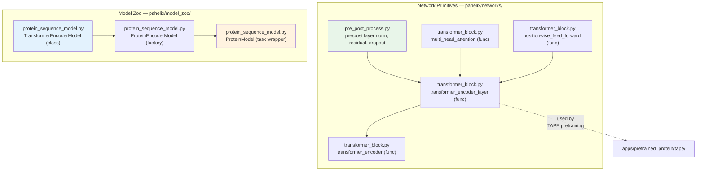

---
slug:20-transformer-block-implementation
blog_type:normal
---


PaddleHelix 提供了**两种不同的 Transformer 实现**，反映了该框架的架构演进：核心网络库中为 TAPE 蛋白质预训练流水线设计的**函数式静态图变体**，以及模型库中支撑下游蛋白质编码任务的**现代面向对象动态图变体**。理解这两者对于浏览代码库并为你的用例选择合适的工具至关重要。

## 架构概述

PaddleHelix 中的 Transformer 基础设施分为两层：`pahelix/networks/` 中的底层**构建块层**暴露了细粒度的函数式原语，而 `pahelix/model_zoo/` 中的更高层**模型层**则将 PaddlePaddle 内置的 `nn.TransformerEncoder` 封装为可直接用于任务的编码器模型。这两层之间并非直接的依赖关系——它们服务于不同的范式——但共同定义了框架的完整 Transformer 功能面。



**函数式层**使用 `paddle.fluid`（静态图），而**模型库层**使用 `paddle.nn`（动态图）。这种区分并非偶然——它反映了 PaddlePaddle API 的历史性转变，并对哪些下游应用能够使用每种实现产生了实际影响。

来源: [transformer_block.py](pahelix/networks/transformer_block.py#L15-L21), [protein_sequence_model.py](pahelix/model_zoo/protein_sequence_model.py#L14-L20)

## 前置与后置处理层

Transformer 编码器层稳定性的基础在于 [pre_post_process.py](pahelix/networks/pre_post_process.py) 中定义的**前/后置处理函数**。PaddleHelix 并未将残差连接和归一化硬编码到注意力模块和 FFN 模块本身中，而是将这些操作解耦为一个可组合的、由字符串控制的命令驱动层。

`pre_post_process_layer` 函数遍历 `process_cmd` 字符串中的每个字符，并按顺序应用相应的操作：

| 命令 | 操作 | 描述 |
|---------|-----------|-------------|
| `"n"` | Layer Normalization | 沿最后一个轴应用 `layers.layer_norm`，epsilon 可配置 |
| `"a"` | 残差加法 | 将 `prev_out` 加到 `out` 上（当 `prev_out` 为 `None` 时跳过） |
| `"d"` | Dropout | 使用 `upscale_in_train` 实现应用 dropout |

通过 `functools.partial` 创建了两个便捷的别名：**`pre_process_layer`** 绑定了 `prev_out=None`，因此它仅对进入核心计算之前的输入流执行归一化和/或 dropout。**`post_process_layer`** 同时接收原始输入和子层输出，从而能够进行残差相加。Transformer 编码器中的默认配置使用 `preprocess_cmd="n"`（仅层归一化）和 `postprocess_cmd="da"`（残差 + dropout），实现了 Transformer 架构的 **Post-LN** 变体。

来源: [pre_post_process.py](pahelix/networks/pre_post_process.py#L24-L57)

## 多头注意力

`multi_head_attention` 函数实现了标准的缩放点积注意力机制，并支持跨时间步的缓存，这一特性对于 TAPE 掩码语言建模任务中的自回归解码至关重要。

### QKV 投影

三个输入——查询、键和值——分别通过全连接层投影到 `d_key * n_head`（对于值则是 `d_value * n_head`）的维度。当 `keys` 或 `values` 为 `None` 时，它们默认为 `queries`，从而启用**自注意力**模式。每次投影都使用由 `name` 参数限定作用域的命名参数（`_query_fc`、`_key_fc`、`_value_fc`），允许多个注意力层共存而不会发生参数冲突。

来源: [transformer_block.py](pahelix/networks/transformer_block.py#L54-L82)

### 头部拆分与合并

投影后的张量通过 `__split_heads` 从 `[batch_size, seq_len, n_head * d_key]` 重塑为 `[batch_size, n_head, seq_len, d_key]`。这种转置将头维度置于序列维度之前，使得能够在所有头上同时进行批量矩阵乘法。在注意力计算之后，`__combine_heads` 通过转置回 `[batch_size, seq_len, n_head, d_key]` 然后展平最后两个维度来逆转此变换。

来源: [transformer_block.py](pahelix/networks/transformer_block.py#L84-L116)

### 缩放点积注意力

`scaled_dot_product_attention` 中的核心注意力计算遵循标准公式：查询乘以 `d_key ** -0.5` 进行缩放，与转置后的键矩阵相乘，可选择性地加上 `attn_bias` 偏置，然后在乘以值之前经过 softmax 和 dropout。`attn_bias` 参数尤为重要——它允许外部调用者注入掩码张量（例如因果掩码或填充掩码），强制特定位置的注意力权重归零。

<CgxTip>
`attn_bias` 张量被**直接加到 softmax 前的 logits 上**（第 125 行）。对于填充掩码，调用者应在要排除的位置传递较大的负值（例如 `-1e9`），这会使其 softmax 输出趋近于零，而无需特殊的稀疏操作。
</CgxTip>

来源: [transformer_block.py](pahelix/networks/transformer_block.py#L118-L134)

### 自回归缓存

当 `cache` 不为 `None` 时，该函数为增量解码实现了一个**键值缓存**。先前时间步的键和值通过 `layers.gather` 从缓存中检索，与当前时间步的投影拼接，并写回缓存。`store` 标志控制是存储完整序列还是仅存储单步更新，从而支持全序列编码和逐步的自回归生成。

来源: [transformer_block.py](pahelix/networks/transformer_block.py#L138-L160)

## 位置前馈网络

`positionwise_feed_forward` 函数实现了一个两层瓶颈 MLP，中间包含激活函数，在序列的每个位置上以相同方式应用。其架构为：`FC(d_model → d_inner_hid)` → 激活函数 (`hidden_act`) → dropout → `FC(d_inner_hid → d_model)`。`d_inner_hid` 维度通常为模型维度的 4 倍，遵循标准的 Transformer 缩放惯例。

与注意力模块的一个显著区别在于，前馈网络将激活函数显式地作为参数传递给 `layers.fc`（第一个线性层），而不是作为单独的操作。`num_flatten_dims` 参数（默认为 2）控制在展平操作期间保留多少个前导维度，这支持了具有不同张量秩的输入。

来源: [transformer_block.py](pahelix/networks/transformer_block.py#L183-L218)

## Transformer 编码器层

`transformer_encoder_layer` 函数根据处理命令配置，将前置/后置处理、多头注意力和前馈子层连接在一起，组合成单个编码器块。这是函数式实现的架构核心。

数据流遵循精确的顺序：

1. **注意力前归一化**：输入通过带有命令 `"n"`（层归一化）的 `pre_process_layer`
2. **自注意力**：归一化后的输入作为 `multi_head_attention` 的查询、键和值（所有 `None` 默认指向同一张量）
3. **注意力后残差 + dropout**：注意力输出通过带有命令 `"da"` 的 `post_process_layer` 与原始（未归一化的）输入组合
4. **FFN 前归一化**：注意力输出通过另一个带有命令 `"n"` 的 `pre_process_layer`
5. **前馈网络**：归一化后的张量流经 `positionwise_feed_forward`
6. **FFN 后残差 + dropout**：FFN 输出通过带有命令 `"da"` 的 `post_process_layer` 与注意力输出组合

该函数返回一个元组：`(ffd_output, [attn_output, ffd_output])`，其中第二个元素提供了**检查点**——下游层（例如预训练中的辅助损失）可能会消费的中间表示。

来源: [transformer_block.py](pahelix/networks/transformer_block.py#L221-L302)

## Transformer 编码器栈

顶层的 `transformer_encoder` 函数将 `n_layer` 个相同的编码器层堆叠成一个深层编码器。它处理由 `param_share` 参数控制的两种参数共享策略：

| 策略 | 行为 |
|----------|----------|
| `"normal"` | 每层获得一个唯一的名称（`_layer_0`、`_layer_1` 等），因此所有层都具有独立的参数 |
| `"inner_share"` | 层被分组为大小为 `n_layer_per_block` 的块，并且在相同块位置内的层共享参数（例如，如果 `n_layer_per_block=2`，层 0 和层 1 共享相同的名称） |

`n_layer_per_block` 参数实现了通用 Transformer 风格的权重共享，其中层的子集在不同深度重用相同的参数。最后一层的输出在返回前会经过一个额外的 `pre_process_layer`（命令 `"n"`）进行最终的层归一化。

来源: [transformer_block.py](pahelix/networks/transformer_block.py#L305-L371)

## 模型库：现代动态图 Transformer

对于下游应用，PaddleHelix 的模型库在 [protein_sequence_model.py](pahelix/model_zoo/protein_sequence_model.py) 中提供了 `TransformerEncoderModel`——这是一个基于 PaddlePaddle 的 `nn.TransformerEncoderLayer` 和 `nn.TransformerEncoder` 构建的简洁的**动态图实现**。这是在药物-靶点相互作用、功能预测和预训练任务中用于蛋白质序列编码的实现。

### 架构

该模型遵循标准的仅编码器 Transformer 模式：

1. **词元嵌入**：针对蛋白质氨基酸词表的 `nn.Embedding`
2. **位置嵌入**：最大序列长度为 3000 的 `nn.Embedding`
3. **嵌入组合**：词元嵌入 + 位置嵌入，随后进行层归一化和 dropout
4. **注意力掩码构建**：通过将其注意力偏置设置为 `-1e9` 来掩码填充位置
5. **Transformer 编码器栈**：带有 GELU 激活函数和可配置 dropout 率的 `nn.TransformerEncoder`

```python
# Key initialization (simplified)
self.transformer_encoder_layer = nn.TransformerEncoderLayer(
    emb_dim, n_heads, dim_feedforward=hidden_size * 4,
    dropout=0.1, activation='gelu', attn_dropout=0.1, act_dropout=0
)
self.transformer_encoder = nn.TransformerEncoder(
    self.transformer_encoder_layer, n_layers
)
```

### 权重初始化

所有 `nn.Linear` 和 `nn.Embedding` 权重均通过 `apply(self.init_weights)` 调用从均值为 `0.0`、标准差为 `0.02` 的正态分布进行初始化。`LayerNorm` 层使用的 epsilon 为 `1e-12`。

来源: [protein_sequence_model.py](pahelix/model_zoo/protein_sequence_model.py#L173-L235)

## 函数式与面向对象：对比

PaddleHelix 中的两种 Transformer 实现**不可互换**——它们针对不同的执行范式，且具有不同的功能集。下表总结了主要差异：

| 方面 | `transformer_block.py` (函数式) | `protein_sequence_model.py` (面向对象) |
|--------|--------------------------------------|-----------------------------------|
| **PaddlePaddle API** | `paddle.fluid` / `paddle.fluid.layers` | `paddle.nn` |
| **范式** | 静态图 (函数) | 动态图 (类) |
| **注意力偏置** | 外部 `attn_bias` 张量参数 | 内部构建的填充掩码 |
| **自回归缓存** | 通过 `cache` / `gather_idx` 支持 | 不支持 |
| **参数共享** | `"normal"` 或 `"inner_share"` 策略 | 标准的逐层参数 |
| **激活函数** | 通过 `hidden_act` 参数配置 | GELU (硬编码) |
| **主要使用者** | TAPE 蛋白质预训练 (静态图时代) | 药物发现应用中的蛋白质编码 |
| **检查点输出** | 返回中间表示 | 仅返回编码器输出 |

<CgxTip>
如果你正在为蛋白质序列、药物-靶点相互作用或属性预测构建新模型，请使用**模型库的 `TransformerEncoderModel`**——它与 PaddlePaddle 的动态图模式无缝集成，是该框架的未来发展方向。函数式的 `transformer_block.py` 主要与维护或扩展 TAPE 预训练流水线相关。
</CgxTip>

来源: [transformer_block.py](pahelix/networks/transformer_block.py#L24-L39), [protein_sequence_model.py](pahelix/model_zoo/protein_sequence_model.py#L173-L221)

## 任务集成：从编码器到预测

`TransformerEncoderModel` 并非孤立存在——它被 `ProteinEncoderModel` 工厂和 `ProteinModel` 任务包装器消费，从而为不同的下游目标生成端到端的模型：

| 任务模型 | 解码器架构 | 用例 |
|------------|---------------------|----------|
| `PretrainTaskModel` | 2 层一维卷积 | 掩码语言建模预训练 |
| `SeqClassificationTaskModel` | 2 层一维卷积 | 逐残基序列标注 |
| `ClassificationTaskModel` | 2 层全连接 (CLS 词元) | 全序列分类 |
| `RegressionTaskModel` | 2 层全连接 (CLS 词元, 输出=1) | 连续属性预测 |

所有任务模型都会提取编码器输出并应用其各自的解码器。分类和回归模型使用 **CLS 词元**（第一个位置，`encoder_output[:, 0, :]`）作为序列级表示，而预训练和序列分类模型则保留完整的逐位置输出。`ProteinEncoderModel` 充当工厂，根据 `model_type` 配置键（`"transformer"`、`"lstm"` 或 `"resnet"`）实例化相应的编码器，使编码器的选择完全由配置驱动。

来源: [protein_sequence_model.py](pahelix/model_zoo/protein_sequence_model.py#L238-L465)

## 关键参数参考

### `transformer_encoder` (函数式 API)

| 参数 | 类型 | 默认值 | 描述 |
|-----------|------|---------|-------------|
| `n_layer` | int | — | 编码器层的总数 |
| `n_head` | int | — | 注意力头的数量 |
| `d_key` | int | — | 每个头的键维度 |
| `d_value` | int | — | 每个头的值维度 |
| `d_model` | int | — | 模型隐藏维度 |
| `d_inner_hid` | int | — | FFN 内层维度 (通常为 `d_model` 的 4 倍) |
| `prepostprocess_dropout` | float | — | 残差连接的 dropout 率 |
| `attention_dropout` | float | — | 注意力权重的 dropout 率 |
| `act_dropout` | float | — | FFN 激活后的 dropout 率 |
| `hidden_act` | str | — | 激活函数名称 (例如 `"relu"`、`"gelu"`) |
| `preprocess_cmd` | str | `"n"` | 子层前处理：`"n"` = 层归一化 |
| `postprocess_cmd` | str | `"da"` | 子层后处理：`"d"` = dropout，`"a"` = 残差 |
| `param_share` | str | `"normal"` | 参数共享：`"normal"` 或 `"inner_share"` |
| `epsilon` | float | `1e-5` | 层归一化的 epsilon |

### `TransformerEncoderModel` (动态图 API)

| 参数 | 类型 | 默认值 | 描述 |
|-----------|------|---------|-------------|
| `vocab_size` | int | — | 词表大小 (设置为 `len(ProteinTokenizer.vocab)`) |
| `emb_dim` | int | `512` | 嵌入和模型维度 |
| `hidden_size` | int | `512` | Transformer 隐藏维度 |
| `n_layers` | int | `8` | 编码器层的数量 |
| `n_heads` | int | `8` | 注意力头的数量 |
| `padding_idx` | int | `0` | 嵌入的填充词元索引 |
| `dropout_rate` | float | `0.1` | Dropout 率 |

来源: [transformer_block.py](pahelix/networks/transformer_block.py#L305-L327), [protein_sequence_model.py](pahelix/model_zoo/protein_sequence_model.py#L177-L184)

---

**后续步骤**：要了解 Transformer 编码器如何应用于药物发现应用，请探索 [药物-靶点相互作用模型](21-competition-solutions-and-benchmarks)。若要了解使用图神经网络而非序列的并行架构模式，请参见 [GNN 构建块与网络架构](10-gnn-blocks-and-network-architecture)。要了解最初部署函数式 Transformer 的蛋白质预训练流水线，请参阅 [使用 TAPE 进行蛋白质预训练](13-protein-pretraining-with-tape)。