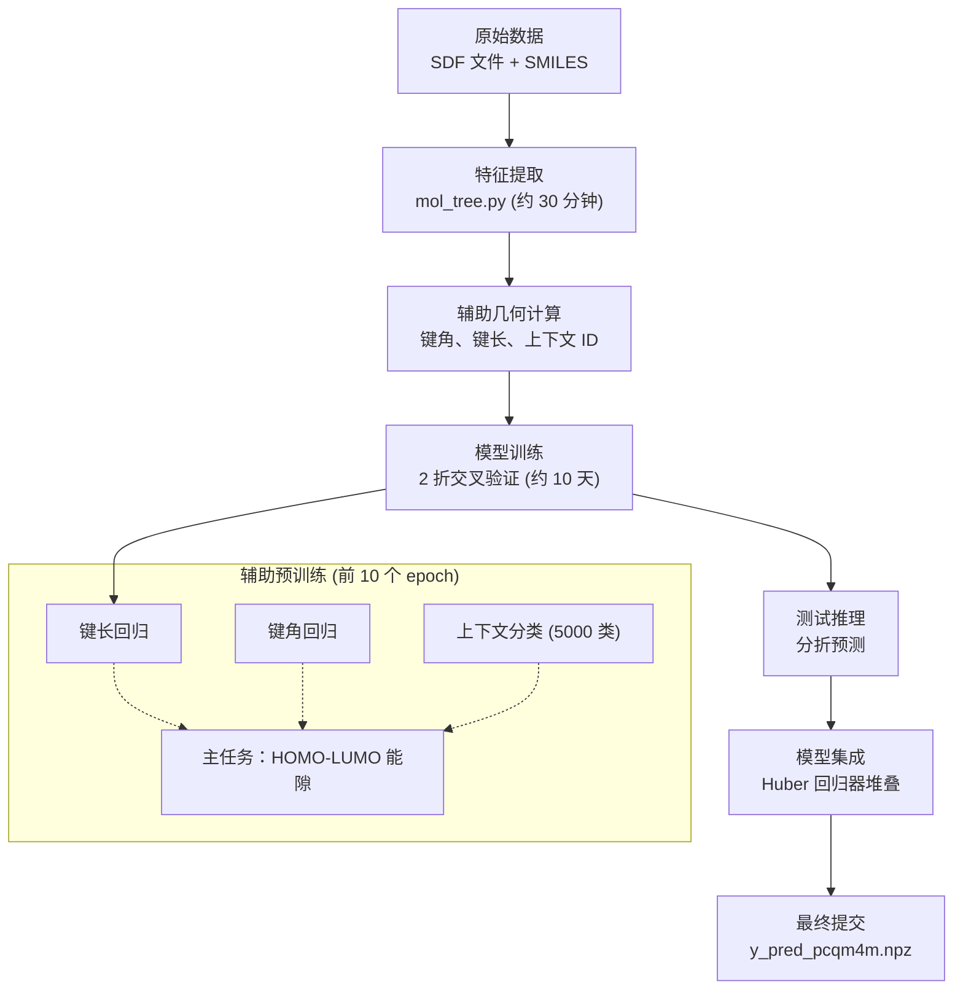
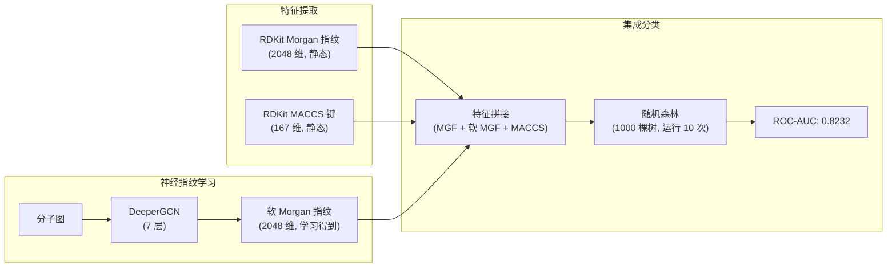
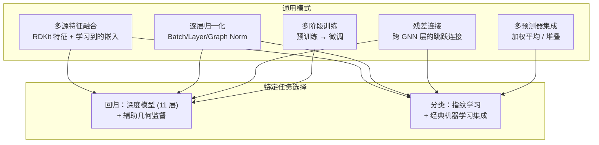

---
slug:21-competition-solutions-and-benchmarks
blog_type:normal
---


PaddleHelix 通过两次里程碑式的竞赛参赛作品，展示了图神经网络在分子属性预测方面的实用潜力。这两个方案——在 KDD Cup 2021 量子化学回归任务中斩获亚军，以及在 OGB 分子属性排行榜上夺得冠军——共享着一种共同的架构理念：在将原始分子图表示送入深度 GNN 骨干网络之前，先利用几何与结构先验知识对其进行丰富，随后通过校准的集成策略组合预测结果。本页将从实现层面深度剖析这两个方案，揭示将竞赛级流水线与基线模型区分开来的具体设计决策。

来源：[competition/README.md](competition/README.md#L1-L6)

## 竞赛格局概览

这两个方案针对的是截然不同的预测任务——量子属性的连续回归与生物活性的二分类——因此采用了不同的模型家族和训练机制。下表总结了对比的关键维度。

| 维度 | LiteGEM (KDD Cup 2021 PCQM4M-LSC) | Neural Fingerprints (OGB molhiv) |
|---|---|---|
| **排名** | 亚军 | 冠军 |
| **任务类型** | 回归（HOMO-LUMO 能隙预测） | 二分类（HIV 活性） |
| **评估指标** | 平均绝对误差 (MAE) | ROC-AUC |
| **结果** | 0.1204 MAE | 0.8232 ± 0.0047 ROC-AUC |
| **核心架构** | 11 层 LiteGEMConv（含虚拟节点） | 7 层 DeeperGCN → 指纹投影 |
| **关键创新** | 辅助几何预训练（键角、键长、上下文） | 神经 Morgan 指纹学习 + 随机森林集成 |
| **模型参数** | 74M | ~2.4M (GNN) + 随机森林集成 |
| **框架** | PaddlePaddle 2.1 + PGL 2.1.4 | PaddlePaddle 1.8.4 + PGL 1.2.1 |
| **硬件** | 8× Tesla P40 (24 GB)，分布式训练 | Tesla V100 (32 GB)，单 GPU |
| **训练时长** | ~10 天（2 折交叉验证） | ~100 个 epoch |

来源：[kddcup2021-PCQM4M-LSC/README.md](competition/kddcup2021-PCQM4M-LSC/README.md#L93-L100), [ogbg_molhiv/README.md](competition/ogbg_molhiv/README.md#L14-L18)

---

## LiteGEM：KDD Cup 2021 PCQM4M-LSC（亚军）

PCQM4M-LSC 赛道要求参赛者预测约 380 万个分子的 DFT 计算 HOMO-LUMO 能隙——这是一种连续的量子化学属性。LiteGEM（轻量化几何增强分子表示学习）实现了 **0.1204** 的测试 MAE，尽管采用了一种基于多任务几何预训练的截然不同的架构策略，但其性能仍以显著优势超越了所有 GIN 和 GCN 基线变体。

来源：[kddcup2021-PCQM4M-LSC/README.md](competition/kddcup2021-PCQM4M-LSC/README.md#L93-L100)

### 流水线架构

LiteGEM 方案遵循一个四阶段流水线，依次处理原始分子数据、几何预处理、多任务 GNN 训练、测试推理以及复杂的集成策略。每个阶段均可独立复现，完整的流水线由单个 shell 脚本统一编排。



来源：[kddcup2021-PCQM4M-LSC/README.md](competition/kddcup2021-PCQM4M-LSC/README.md#L42-L90), [kddcup2021-PCQM4M-LSC/src/config.yaml](competition/kddcup2021-PCQM4M-LSC/src/config.yaml#L13-L15)

### 数据准备与几何特征工程

预处理阶段在 [mol_tree.py](competition/kddcup2021-PCQM4M-LSC/features/mol_tree.py) 中实现，将原始 SDF 分子文件和 SMILES 字符串转化为丰富的图表示。该流水线从 SDF 文件中加载 DFT 计算的 3D 分子结构，对于缺失几何数据的分子，使用原始 CSV 中的回退条目进行补充，然后在 32 个工作进程中并行提取标准图特征和辅助几何标注。

[extended_feature.py](competition/kddcup2021-PCQM4M-LSC/features/extended_feature.py) 模块计算了一整套全面的几何与结构特征。对于节点（原子），它提取环大小归属、部分电荷、氢原子数、范德华半径以及外壳层电子价态。对于边（化学键），它计算两个原子是否共享一个环、拓扑路径长度，以及来自 DFT 优化结构的实际 3D 几何距离。至关重要的一点是，它还通过 [`get_bond_angle_index()`](competition/kddcup2021-PCQM4M-LSC/features/extended_feature.py#L387-L426) 生成键角三元组，并通过 [`get_bond_angle()`](competition/kddcup2021-PCQM4M-LSC/features/extended_feature.py#L427-L457) 计算实际键角，这些将作为预训练期间的辅助监督信号。

来源：[kddcup2021-PCQM4M-LSC/features/mol_tree.py](competition/kddcup2021-PCQM4M-LSC/features/mol_tree.py#L220-L316), [kddcup2021-PCQM4M-LSC/features/extended_feature.py](competition/kddcup2021-PCQM4M-LSC/features/extended_feature.py#L210-L274)

### 模型架构：带辅助预训练的 LiteGEM

完整的模型定义在 [`GNN`](competition/kddcup2021-PCQM4M-LSC/src/model.py#L115-L227) 中，它将多个组件编排为一个统一的多任务学习框架。该架构以 [`LiteGEMConv`](competition/kddcup2021-PCQM4M-LSC/models/layers.py#L23-L114) 层为中心，该层引入了基于 softmax 的邻接消息注意力机制。与采用均匀聚合的标准 GIN 不同，LiteGEMConv 计算 `α = softmax(h_neighbors × t)`，其中 `t` 是一个可学习或固定的温度参数，允许模型在消息传递过程中对结构上更重要的化学键赋予更高的权重。

完整的 11 层 GNN 堆栈封装在 [`LiteGEM`](competition/kddcup2021-PCQM4M-LSC/models/conv.py#L13-L120) 类中，该类引入了一个虚拟节点，用于维护一个全局的图级别嵌入，并在每一层之后通过 MLP 进行更新。该虚拟节点会广播回所有原子，在每一层深度将全局上下文注入到局部表示中——这对于目标属性依赖于整体分子结构而非局部基序的回归任务来说，是一项关键机制。

多任务预训练机制通过 [config.yaml](competition/kddcup2021-PCQM4M-LSC/src/config.yaml#L15) 中的 `pretrain_tasks` 参数进行配置，设置为 `"Bl,Ba,Con"`：

| 预训练任务 | 实现 | 损失函数 | 目的 |
|---|---|---|---|
| **键长** | [`PretrainBondLength`](competition/kddcup2021-PCQM4M-LSC/src/model.py#L50-L80) | 基于成对原子嵌入的 SmoothL1Loss | 迫使模型学习原子间距离表示 |
| **键角** | [`PretrainBondAngle`](competition/kddcup2021-PCQM4M-LSC/src/model.py#L17-L49) | 基于三元组原子嵌入的 SmoothL1Loss | 将角度几何信息编码到节点表示中 |
| **上下文** | 上下文 MLP（5000 类） | CrossEntropyLoss | 用于自监督学习的结构上下文分类 |

预训练阶段在前 10 个 epoch 中运行，辅助损失系数为 `aux_alpha: 0.2`，此后模型切换到纯回归训练。预测头是一个 3 层分类器：`Linear(1024→512) → BatchNorm → Swish → Linear(512→256) → BatchNorm → Swish → Linear(256→1)`。

来源：[kddcup2021-PCQM4M-LSC/src/model.py](competition/kddcup2021-PCQM4M-LSC/src/model.py#L17-L227), [kddcup2021-PCQM4M-LSC/models/conv.py](competition/kddcup2021-PCQM4M-LSC/models/conv.py#L13-L120), [kddcup2021-PCQM4M-LSC/src/config.yaml](competition/kddcup2021-PCQM4M-LSC/src/config.yaml#L13-L76)

### 训练配置

训练循环定义在 [`train_and_eval()`](competition/kddcup2021-PCQM4M-LSC/src/main.py#L381-L501) 中，通过 PaddlePaddle Fleet 在 8 个 GPU 上进行分布式训练。学习率调度采用多步衰减，边界经过精心调整：在第 1–10 个 warmup epoch 期间从 0.0008 升至约 0.008 的峰值，然后在第 30、50、90 和 130 个 epoch 的里程碑处衰减，gamma 值为 0.96。来自[配置文件](competition/kddcup2021-PCQM4M-LSC/src/config.yaml)的关键超参数如下：

| 参数 | 值 | 备注 |
|---|---|---|
| `num_layers` | 11 | 深度 GNN 堆栈 |
| `emb_dim` | 1024 | 嵌入维度 |
| `virtual_node` | True | 注入全局上下文 |
| `drop_ratio` | 0.2 | Dropout 概率 |
| `batch_size` | 256 | 单 GPU 批大小 |
| `epochs` | 150 | 总训练 epoch 数 |
| `lr` | 0.0001 | 基础学习率（被调度器覆盖） |
| `norm` | batch | 批归一化 |
| `aggr` | softmax | Softmax 注意力聚合 |
| `exfeat` | True | 扩展原子特征（浮点型） |
| `graph_pooling` | mean | 用于图级别表示的均值池化 |

来源：[kddcup2021-PCQM4M-LSC/src/config.yaml](competition/kddcup2021-PCQM4M-LSC/src/config.yaml#L40-L76), [kddcup2021-PCQM4M-LSC/src/main.py](competition/kddcup2021-PCQM4M-LSC/src/main.py#L381-L501)

### 集成策略

最终提交使用了一种复杂的二折交叉验证集成策略，在 [ensemble.py](competition/kddcup2021-PCQM4M-LSC/ensemble/ensemble.py) 中实现。该策略分三个阶段进行：首先，过滤掉贡献微弱的模型（在 Huber 回归中系数绝对值 < 1.8）；其次，设定 0.2 的 `max_min_drop_rate`，通过对各个模型的单样本预测进行排序并剔除最高和最低的 20% 后再取平均，从而修整极端预测值；最后，使用 Huber 回归器将修整后的交叉验证预测值拟合到真实值，产生用于测试时组合的校准权重。该集成还利用了来自训练集的数据泄露——如果测试分子的 SMILES 出现在训练数据中，则直接使用其已知的 HOMO-LUMO 能隙。

<CgxTip>
该集成的基于修整的异常值移除机制（`max_min_drop_rate = 0.2`）对于回归任务特别有效，因为在这种任务中，个别模型可能会对分布外分子产生极端预测。这比简单的平均更鲁棒，并且当模型数量较少时，避免了学习权重堆叠的过拟合风险。
</CgxTip>

来源：[kddcup2021-PCQM4M-LSC/ensemble/ensemble.py](competition/kddcup2021-PCQM4M-LSC/ensemble/ensemble.py#L1-L134)

### 复现结果

完整的流水线在 8 块 Tesla P40 GPU 上大约需要 10 天的训练时间。以下是基础单 GPU 训练的快速入门：

```bash
# 1. 安装依赖
pip install ogb==1.3.0 rdkit paddlepaddle-gpu>=2.1.0 pgl>=2.1.4

# 2. 下载并准备数据
cd competition/kddcup2021-PCQM4M-LSC
mkdir dataset && cd dataset
wget http://ogb-data.stanford.edu/data/lsc/pcqm4m_kddcup2021.zip && unzip pcqm4m_kddcup2021.zip
wget https://baidu-nlp.bj.bcebos.com/PaddleHelix/datasets/PCQM_pretrain/sdf.tar.gz
tar -xzvf sdf.tar.gz
cd ..

# 3. 预处理特征 (约 30 分钟)
cd features && python mol_tree.py && cd ..

# 4. 使用单 GPU 验证集划分进行训练
cd src && python main.py --config config.yaml
```

来源：[kddcup2021-PCQM4M-LSC/README.md](competition/kddcup2021-PCQM4M-LSC/README.md#L13-L90)

---

## Neural Fingerprints：OGB molhiv（冠军）

OGB（开放图基准）molhiv 挑战赛要求对分子是否具有抗 HIV 活性进行二分类。PaddleHelix 的解决方案实现了 **0.8232 ± 0.0047 的测试 ROC-AUC**，其采用了一种创新策略，将 GNN 预测问题转化为指纹学习问题：GNN 不是直接预测分子活性，而是学习生成*神经 Morgan 指纹*——即经典 Morgan 指纹的软性、可微近似——然后使用随机森林集成进行分类。

来源：[ogbg_molhiv/README.md](competition/ogbg_molhiv/README.md#L14-L18)

### 架构：从 GNN 到神经指纹

其核心洞察在于，经典的 Morgan 指纹（环形子结构哈希）本身就是非常有效的分子表示。该方案通过 [`DeeperGCNModel`](competition/ogbg_molhiv/models/gnn_model.py#L86-L175) 实现，学习以可微的方式近似这些指纹，产生“软”指纹向量，这些向量可以在训练期间进行反向传播，同时保留了对经典机器学习方法的可解释性和兼容性。



[`DeeperGCNModel`](competition/ogbg_molhiv/models/gnn_model.py#L86-L175) 架构基于广义聚合网络（GEN）卷积模式并带有残差连接。每一层应用 LayerNorm → ReLU → Dropout → GEN-Conv → 残差相加，并带有可选的 RePool 机制，将池化后的图特征广播回各个节点。在最后一层 GNN 之后，一个 APPNP 扩散步（α=0.2, k=5）平滑节点表示，并在指纹投影前通过 GraphNorm 稳定输出。

关键的 [`get_mgf_repr()`](competition/ogbg_molhiv/models/gnn_model.py#L163-L168) 方法将 256 维的节点表示投影到 2048 维空间并经过 softmax 激活，然后对每个图中的所有节点求和——这直接模仿了经典 Morgan 指纹的碰撞计数行为，但使用的是学习到的特征。

来源：[ogbg_molhiv/models/gnn_model.py](competition/ogbg_molhiv/models/gnn_model.py#L86-L175), [ogbg_molhiv/model.py](competition/ogbg_molhiv/model.py#L43-L81)

### 作为指纹重建的训练

GNN 使用定义在 [`MgfModel.loss()`](competition/ogbg_molhiv/model.py#L61-L68) 中的重建目标进行训练。该模型最小化预测的软 Morgan 指纹与由 [extract_fingerprint.py](competition/ogbg_molhiv/extract_fingerprint.py) 提取的真实经典 Morgan 指纹之间的 `sigmoid_cross_entropy_with_logits`。这种自监督方法意味着 GNN 从未直接接触 HIV 活性标签——它完全通过指纹重建来学习丰富的分子表示，从而将表示学习与下游分类任务解耦。

来自 [hiv_config.yaml](competition/ogbg_molhiv/hiv_config.yaml) 的训练配置显示了一个相对紧凑的模型：

| 参数 | 值 |
|---|---|
| `num_layers` | 7 |
| `embed_dim` | 256 |
| `hidden_size` | 256 |
| `dropout_rate` | 0.2 |
| `appnp` | True (α=0.2) |
| `GN` (GraphNorm) | True |
| `epochs` | 100 |
| `batch_size` | 32 |
| `lr` | 0.001 |

来源：[ogbg_molhiv/model.py](competition/ogbg_molhiv/model.py#L61-L68), [ogbg_molhiv/hiv_config.yaml](competition/ogbg_molhiv/hiv_config.yaml#L1-L49)

### 随机森林集成

在训练 GNN 并提取所有分子的软 Morgan 指纹向量后，[random_forest.py](competition/ogbg_molhiv/random_forest.py#L28-L135) 脚本构建最终的分类器。它将每个分子的三个特征向量进行拼接：经典 Morgan 指纹（来自 RDKit 的 2048 维）、学习到的软 Morgan 指纹（来自 GNN 的 2048 维）以及 MACCS 键（来自 RDKit 的 167 维），产生一个 4263 维的特征向量。

使用具有 1000 个估计器和熵准则的 `RandomForestClassifier` 进行训练，并设置 `class_weight={0:1, 1:10}` 以处理 HIV 筛选数据中固有的类别不平衡问题。该实验使用不同的随机种子重复 10 次，以产生报告的平均值 ± 标准差。值得注意的是，最小叶子大小设为 2 以防止在稀有子结构上过拟合。

来源：[ogbg_molhiv/random_forest.py](competition/ogbg_molhiv/random_forest.py#L28-L135), [ogbg_molhiv/extract_fingerprint.py](competition/ogbg_molhiv/extract_fingerprint.py#L1-L70)

### 复现结果

```bash
# 1. 创建 conda 环境
conda create -n ogbg_hiv python=3.6
conda activate ogbg_hiv
conda install -c conda-forge rdkit
pip install paddlepaddle-gpu==1.8.4 pgl==1.2.1 ogb

# 2. 提取经典指纹
cd competition/ogbg_molhiv
python extract_fingerprint.py --dataset_name ogbg-molhiv

# 3. 训练 GNN 以学习软指纹
CUDA_VISIBLE_DEVICES=0 python main.py --config hiv_config.yaml

# 4. 运行随机森林分类
python random_forest.py --dataset_name ogbg-molhiv
```

来源：[ogbg_molhiv/README.md](competition/ogbg_molhiv/README.md#L23-L55)

<CgxTip>
神经指纹方法之所以异常强大，是因为它在深度学习和经典化学信息学之间架起了桥梁。通过训练 GNN 重建已知指纹，你可以获得一种既具有表现力（从图结构中学习得到），又与成熟的机器学习流水线（随机森林、SVM）兼容的表示，这些经典算法在小型、不平衡数据集上可能优于神经分类器。
</CgxTip>

---

## 架构对比与设计模式

尽管针对的任务不同，这两个方案都共享着底层模式，这些模式代表了分子图学习中经过竞赛验证的最佳实践。

### 共享设计模式



| 设计模式 | LiteGEM 实现 | Neural Fingerprints 实现 |
|---|---|---|
| **特征融合** | AtomEncoder（类别型） + AtomEncoderFloat（连续型特征：电荷、范德华半径、价态） | AtomEncoder（来自 OGB 的类别型） + 在集成阶段使用 RDKit Morgan/MACCS |
| **深度消息传递** | 11 层，具有类似残差的跳跃连接（output = GNN(h) + h） | 7 层 DeeperGCN，具有显式残差连接 |
| **全局上下文** | 虚拟节点 MLP 逐层更新，并广播回原子 | 图池化 → RePool（将池化特征广播回节点） |
| **GNN 后平滑** | 可选 APPNP（在最终配置中禁用） | APPNP（α=0.2, k=5）用于表示平滑 |
| **归一化** | 每层后使用 BatchNorm，可选 GraphNorm | 每层后使用 LayerNorm + GraphNorm |
| **训练策略** | 10 个 epoch 的辅助预训练，然后 140 个 epoch 的微调 | 100 个 epoch 的指纹重建，然后进行独立的随机森林训练 |

来源：[kddcup2021-PCQM4M-LSC/models/conv.py](competition/kddcup2021-PCQM4M-LSC/models/conv.py#L13-L120), [ogbg_molhiv/models/gnn_model.py](competition/ogbg_molhiv/models/gnn_model.py#L86-L175)

---

## 目录结构参考

这两个竞赛方案遵循一致的模块化布局，清晰地将特征、模型、工具和训练脚本分离。

```
competition/
├── kddcup2021-PCQM4M-LSC/          # LiteGEM — 亚军
│   ├── src/                        # 训练、评估、配置
│   │   ├── main.py                 # 训练循环 + 分布式编排
│   │   ├── model.py                # GNN + 预训练头 (GNN, MLP)
│   │   ├── dataset.py              # AuxDataset, 拼接函数
│   │   └── config.yaml             # 所有超参数 (98 行)
│   ├── models/                     # 模型构建块
│   │   ├── conv.py                 # LiteGEM, GNNVirt, JuncGNNVirt
│   │   ├── layers.py               # LiteGEMConv, CatGINConv, GINConv
│   │   └── mol_encoder.py          # 原子/键编码器
│   ├── features/                   # 特征工程
│   │   ├── extended_feature.py     # 3D 几何、键角、部分电荷
│   │   ├── local_feature.py        # RDKit 原子/键特征向量
│   │   └── mol_tree.py             # SDF 解析 → PGL 图对象
│   └── ensemble/                   # 提交集成
│       └── ensemble.py             # Huber 堆叠 + 基于修整的异常值移除
│
└── ogbg_molhiv/                    # Neural Fingerprints — 冠军
    ├── main.py                     # 训练 + 推理编排
    ├── model.py                    # MgfModel (指纹重建)
    ├── dataset.py                  # MolDataset + MgfCollateFn
    ├── hiv_config.yaml             # 模型与训练配置
    ├── extract_fingerprint.py      # RDKit Morgan + MACCS 提取
    ├── random_forest.py            # 最终的随机森林集成分类器
    ├── models/
    │   ├── gnn_model.py            # GNNModel, DeeperGCNModel, GraphTransformerModel
    │   ├── layers.py               # gin_layer, gen_layer, graph_transformer
    │   └── mol_encoder.py          # AtomEncoder, BondEncoder
    └── utils/                      # 配置解析器, 日志
```

来源：[kddcup2021-PCQM4M-LSC/README.md](competition/kddcup2021-PCQM4M-LSC/README.md#L37-L45), [ogbg_molhiv/README.md](competition/ogbg_molhiv/README.md#L23-L55)

---

## 延伸阅读

这些竞赛方案建立在核心 PaddleHelix 组件之上。要了解底层库以及如何在自己的项目中应用类似技术，请浏览本文档中的以下页面：

- [InMemoryDataset 和数据流水线](7-inmemorydataset-and-data-pipeline) — PaddleHelix 中通用于图数据管理的 `InMemoryDataset` 类
- [化合物与蛋白质特征化器](8-compound-and-protein-featurizers) — 这两个方案均通过自定义几何特征对其进行扩展的特征化框架
- [GNN 模块与网络架构](10-gnn-blocks-and-network-architecture) — 作为 LiteGEMConv 和 DeeperGCN 基础的 GNN 层实现（如 GINConv 等）
- [基于 GEM 的化合物预训练](11-compound-pretraining-with-gem) — LiteGEM 为竞赛环境进行扩展的生产级几何增强预训练框架
- [化合物编码器与嵌入层](9-compound-encoder-and-embedding-layers) — 两个方案中用于类别型原子/键特征的嵌入策略