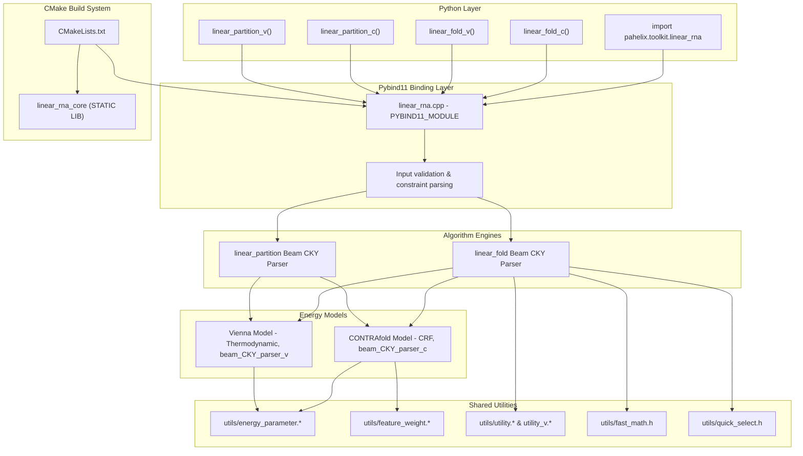

---
slug:22-c-extension-and-linearrna
blog_type:normal
---


PaddleHelix 附带了一个原生的 C++ 扩展，该扩展通过 **pybind11** 将高性能的 RNA 二级结构分析算法暴露给 Python。此扩展实现了 **LinearRNA**——这是一套发表于 ISMB/Bioinformatics 的线性时间算法套件，它用 5′ 到 3′ 的束搜索策略取代了立方时间复杂度的动态规划，在全长的冠状病毒基因组（30,000 nt：55 分钟 → 27 秒）上实现了高达 120 倍的加速。该扩展是代码库中唯一的 C++ 组件，作为原始计算生物学算法与 PaddleHelix Python 生态系统之间至关重要的性能关键桥梁。

来源：[setup.py](setup.py#L1-L135)、[README.md](c/pahelix/toolkit/linear_rna/README.md#L1-L145)

## 架构概述

C++ 扩展遵循分层架构：静态核心库实现算法引擎，轻量级的 pybind11 绑定层暴露四个可供 Python 调用的函数。整个子系统通过 CMake 构建，并通过 `setup.py` 中的自定义 `CMakeExtension` 集成到 PaddleHelix 中。



来源：[CMakeLists.txt](c/pahelix/toolkit/linear_rna/CMakeLists.txt#L1-L12)、[linear_rna.cpp](c/pahelix/toolkit/linear_rna/linear_rna/linear_rna.cpp#L200-L235)、[setup.py](setup.py#L16-L135)

## 构建系统集成

C++ 扩展使用由 CMake 驱动的构建流水线，该流水线在执行 `pip install paddlehelix` 期间会被透明地调用。构建系统由两个协作机制组成：一个定义了 `CMakeExtension` 类的根级 `setup.py`，以及 linear_rna 源代码树中专门的 `CMakeLists.txt`。

CMake 配置执行三项任务：首先，它将 `linear_rna/linear_fold/` 和 `linear_rna/linear_partition/` 下的所有 `*.cpp` 文件编译成一个名为 `linear_rna_core` 的静态库；然后，将 `linear_rna.cpp`（即 pybind11 绑定源文件）编译为共享模块；最后，将该共享模块与 `pybind11::module` 和 `linear_rna_core` 进行链接。输出的共享目标文件通过 `CMAKE_LIBRARY_OUTPUT_DIRECTORY` 标志放置在 `pahelix/toolkit/linear_rna.{so/pyd}` 路径下，这正是 Python 的 `import pahelix.toolkit.linear_rna` 解析原生模块的方式。

来源：[CMakeLists.txt](c/pahelix/toolkit/linear_rna/CMakeLists.txt#L1-L12)、[setup.py](setup.py#L62-L76)、[setup.py](setup.py#L128-L135)

## Pybind11 绑定层

[linear_rna.cpp](c/pahelix/toolkit/linear_rna/linear_rna/linear_rna.cpp) 中的绑定层作为 Python 与 C++ 算法核心之间的接口。它定义了四个公共函数和三个内部验证例程。第 200 行的 `PYBIND11_MODULE` 宏使用显式的默认参数注册了所有绑定，确保该模块即使在无参数调用的情况下，也能通过合理的默认值在 Python 中正常使用。

这四个导出函数直接映射到两种算法与两种能量模型的矩阵组合：

| Python 函数 | 算法 | 能量模型 | C++ 解析器类 | 值类型 |
|---|---|---|---|---|
| `linear_fold_c()` | LinearFold | CONTRAfold (CRF) | `LinearFoldBeamCKYParserC` | `double` |
| `linear_fold_v()` | LinearFold | Vienna (热力学) | `LinearFoldBeamCKYParserV` | `int` |
| `linear_partition_c()` | LinearPartition | CONTRAfold (CRF) | `LinearPartitionBeamCKYParser` ('c') | `float` |
| `linear_partition_v()` | LinearPartition | Vienna (热力学) | `LinearPartitionBeamCKYParser` ('v') | `float` |

从公共 API 到具体解析器的调度发生在 [beam_CKY_parser.cpp](c/pahelix/toolkit/linear_rna/linear_rna/linear_fold/beam_CKY_parser.cpp#L1-L26) 中，其中 `linear_fold()` 根据 `energy_model` 字符选择 `LinearFoldBeamCKYParserC` 或 `LinearFoldBeamCKYParserV`。对于 LinearPartition，其调度在 [linear_rna.cpp](c/pahelix/toolkit/linear_rna/linear_rna/linear_rna.cpp#L15-L19) 中内联进行，通过传入相应的模型标志来构造 `LinearPartitionBeamCKYParser`。

<CgxTip>
CONTRAfold 变体（`_c` 后缀）使用 `ValueType = double`（浮点数 CRF 分数）参数化基础解析器模板，而 Vienna 变体（`_v` 后缀）使用 `ValueType = int`（以十分之一千卡/摩尔为单位的离散化自由能）。这种设计选择意味着，在 [beam_CKY_parser.h](c/pahelix/toolkit/linear_rna/linear_rna/linear_fold/beam_CKY_parser.h#L136-L151) 中经过模板特化的分数比较逻辑，能够在无运行时分支的情况下处理两种根本不同的数值语义。
</CgxTip>

来源：[linear_rna.h](c/pahelix/toolkit/linear_rna/linear_rna/linear_rna.h#L1-L49)、[beam_CKY_parser.cpp](c/pahelix/toolkit/linear_rna/linear_rna/linear_fold/beam_CKY_parser.cpp#L1-L26)、[linear_rna.cpp](c/pahelix/toolkit/linear_rna/linear_rna/linear_rna.cpp#L200-L235)

## 输入验证与约束处理

在调用任何解析器之前，绑定层会通过 [linear_rna.cpp](c/pahelix/toolkit/linear_rna/linear_rna/linear_rna.cpp#L95-L195) 中定义的三个函数执行严格的输入验证。理解此验证流水线对于调试与约束相关的错误至关重要。

`check_input()` 通过将序列转为大写并将 T 替换为 U（从而透明地接受 DNA 输入）来标准化序列，随后验证所有字符均为字母。`check_input_constraints()` 针对序列解析点括号约束字符串，并强制执行三条规则：(1) 约束字符串的长度必须与序列长度相同；(2) 每个位置只能使用 `?`、`.`、`(` 或 `)`；(3) 显式配对的位置 `(` ... `)` 必须形成有效的 Watson-Crick 或摆动配对（AU、UA、CG、GC、GU、UG）。无效的配对（例如强制 A-A 配对）会被立即拒绝。`check_input_references()` 从参考结构中剥离伪结字符（`[]`、`{}`、`<>`）并验证剩余字符。

约束索引存储在 `std::vector<int>` 中，每个位置的编码如下：`-2` 表示强制不成对（`.`），`-1` 表示未知（`?`），非负整数表示配对伙伴的索引。

来源：[linear_rna.cpp](c/pahelix/toolkit/linear_rna/linear_rna/linear_rna.cpp#L95-L195)

## LinearFold：基于束搜索的 CKY 解析

LinearFold 使用在 CKY 风格动态规划格点上进行的 5′ 到 3′ 束搜索，预测单一的最优 RNA 二级结构。其算法创新在于用从左到右的扫描取代了传统的 O(n³) 自底向上填充方式，该扫描在每个位置仅保留前 *k* 个候选者，从而将复杂度降低至 O(n · k · w)，其中 *w* 是考虑的最大跨度。

### 状态机与分解文法

解析器在六种束类型上运行——`bestH`、`bestP`、`bestM2`、`bestMulti`、`bestM` 和 `bestC`——每种类型均实现为 `std::vector<std::unordered_map<int, LinearFoldState<ValueType>>>`。每个束存储一个以结构组件右端位置 `j` 为键的哈希表，在剪枝后最多保留 `beam_size` 个条目。[utility.h](c/pahelix/toolkit/linear_rna/linear_rna/linear_fold/utility.h#L14-L30) 中定义的 13 个 `Manner` 枚举值编码了分解文法：

| Manner | 值 | 结构规则 |
|---|---|---|
| `MANNER_H` | 1 | 发夹候选（可配对但尚未承诺） |
| `MANNER_HAIRPIN` | 2 | 发夹环：闭合配对，无内部配对 |
| `MANNER_SINGLE` | 3 | 单分支（凸环/内部环）：(i,j) 包围 (p,q) |
| `MANNER_HELIX` | 4 | 堆叠螺旋延伸：(i,j) 堆叠在 (i+1,j−1) 之上 |
| `MANNER_MULTI` | 5 | 多分支环：包含 ≥2 条螺旋 |
| `MANNER_MULTI_EQ_MULTI_PLUS_U` | 6 | 带有不成对碱基的多分支延伸 |
| `MANNER_P_EQ_MULTI` | 7 | 源自多分支的配对区域 |
| `MANNER_M2_EQ_M_PLUS_P` | 8 | M2 分解为 M + P |
| `MANNER_M_EQ_M2` | 9 | M 穿过 M2 |
| `MANNER_M_EQ_M_PLUS_U` | 10 | M 以不成对碱基延伸 |
| `MANNER_M_EQ_P` | 11 | M 包裹一个配对区域 |
| `MANNER_C_EQ_C_PLUS_U` | 12 | 外部环以不成对碱基延伸 |
| `MANNER_C_EQ_C_PLUS_P` | 13 | 外部环吸收一个配对区域 |

[state.h](c/pahelix/toolkit/linear_rna/linear_rna/linear_fold/state.h#L4-L43) 中的 `LinearFoldState` 模板携带一个 `score`、一个 `manner` 标签以及一个 `TraceInfo` 联合体，该联合体存储一个 `split` 索引（用于 M2 分解）或一对 `(l1, l2)` 填充对（用于单分支环）。回溯信息使得在前向传递完成后能够进行回溯，并在 `get_parentheses()` 中重建点括号结构。

<CgxTip>
束剪枝阈值在 `beam_prune()` 中计算，该函数从束步骤中提取所有分数，使用 `std::nth_element`（通过 `quick_select.h`）找到第 *beam_size* 大的分数，然后擦除低于该阈值的所有条目。将 `beam_size` 设置为 `0` 会完全禁用剪枝，以显著增加内存使用为代价产生精确的 O(n³) 结果。
</CgxTip>

来源：[beam_CKY_parser.h](c/pahelix/toolkit/linear_rna/linear_rna/linear_fold/beam_CKY_parser.h#L1-L200)、[state.h](c/pahelix/toolkit/linear_rna/linear_rna/linear_fold/state.h#L1-L43)、[utility.h](c/pahelix/toolkit/linear_rna/linear_rna/linear_fold/utility.h#L14-L30)

## LinearPartition：带束剪枝的内外算法

LinearPartition 使用束 CKY 解析器的内外变体计算配分函数 Z 和逐碱基对后验概率。[beam_CKY_parser.h](c/pahelix/toolkit/linear_rna/linear_rna/linear_partition/beam_CKY_parser.h#L30-L80) 中的 `LinearPartitionBeamCKYParser` 类与 LinearFold 共享相同的束架构，但其在对数空间概率而非分数上运行。

每个 `LinearPartitionState` 存储两个值：`alpha`（内部概率）和 `beta`（外部概率）。解析器首先执行计算 `alpha` 值的前向（内部）传递，然后执行通过 `outside()` 计算 `beta` 值的后向（外部）传递，最后在 `cal_pair_probs()` 中计算后验概率 `p(i,j) = alpha(i,j) · beta(i,j) / Z`。结果存储在带有自定义 `hash_pair` 函数的 `unordered_map<pair<int,int>, float>` 中，并在返回给 Python 之前通过 `bpp_cutoff` 进行过滤。

与 LinearFold 的关键架构差异在于，LinearPartition 必须在整个序列中保留所有束条目以用于后向传递——它不能在处理完成后丢弃束，这使得其内存占用为 O(n · beam_size)，而不是单结构情况下的 O(beam_size)。

来源：[beam_CKY_parser.h (partition)](c/pahelix/toolkit/linear_rna/linear_rna/linear_partition/beam_CKY_parser.h#L30-L80)、[linear_rna.cpp](c/pahelix/toolkit/linear_rna/linear_rna/linear_rna.cpp#L15-L55)

## 能量模型基础设施

共享的 `utils/` 目录提供了 LinearFold 和 LinearPartition 均使用的评分基础。两个并行的实用程序头文件服务于两种能量范式：

- [utility.h](c/pahelix/toolkit/linear_rna/linear_rna/utils/utility.h) —— CONTRAfold 模型：使用从 [feature_weight.h](c/pahelix/toolkit/linear_rna/linear_rna/utils/feature_weight.h) 加载的 `float` 类型特征权重，为碱基配对、螺旋堆叠、末端错配、悬垂端、发夹、内部环、凸环和多分支环构型提供基于 CRF 的分数。
- [utility_v.h](c/pahelix/toolkit/linear_rna/linear_rna/utils/utility_v.h) —— Vienna 模型：使用从 [energy_parameter.h](c/pahelix/toolkit/linear_rna/linear_rna/utils/energy_parameter.h) 加载的 `int` 类型能量参数（十分之一千卡/摩尔），并通过 [intl11.cpp](c/pahelix/toolkit/linear_rna/linear_rna/utils/intl11.cpp)、[intl21.cpp](c/pahelix/toolkit/linear_rna/linear_rna/utils/intl21.cpp) 和 [intl22.cpp](c/pahelix/toolkit/linear_rna/linear_rna/utils/intl22.cpp) 提供额外的 Turn38 和三环特殊情况查找。

两个模型共享一组通用的结构常量定义（`SINGLE_MAX_LEN = 30`、`HAIRPIN_MAX_LEN = 30`、`MULTI_MAX_LEN = 30` 等）以及通过 `GET_ACGU_NUM()` 进行的核苷酸编码，该函数将 A 映射为 0，C 映射为 1，G 映射为 2，U 映射为 3，并将 4 保留给非标准碱基。允许的配对存储在全局布尔矩阵 `g_allowed_pairs[5][5]` 中，由 `initialize()` 函数初始化，两个绑定变体均在模块加载时调用该函数。

来源：[utility.h](c/pahelix/toolkit/linear_rna/linear_rna/utils/utility.h#L1-L50)、[utility_v.h](c/pahelix/toolkit/linear_rna/linear_rna/utils/utility_v.h)

## API 参考

### LinearFold 函数

| 参数 | 类型 | 默认值 | 描述 |
|---|---|---|---|
| `sequence` | `str` | `""` | RNA 序列（接受 A/C/G/U/T；自动标准化） |
| `beam_size` | `int` | `100` | 束宽度；设置为 `0` 以获得精确结果（无剪枝） |
| `use_constraints` | `bool` | `False` | 启用点括号约束强制执行 |
| `constraint` | `str` | `""` | 约束字符串（`?`、`.`、`(`、`)`） |
| `no_sharp_turn` | `bool` | `True` | 禁止包含少于 3 个不成对碱基的发夹环 |

**返回值：** `tuple[str, float]` ——（点括号结构，自由能分数）

### LinearPartition 函数

| 参数 | 类型 | 默认值 | 描述 |
|---|---|---|---|
| `sequence` | `str` | `""` | RNA 序列 |
| `beam_size` | `int` | `100` | 束宽度；设置为 `0` 以获得精确结果 |
| `bp_cutoff` | `float` | `0.0` | 最小后验概率阈值（0.0–1.0） |
| `no_sharp_turn` | `bool` | `True` | 禁止急转弯 |

**返回值：** `tuple[float, list[tuple[int, int, float]]]` ——（配分函数值，包含 `(i, j, probability)` 元组的列表）

### 约束语法

约束使用一个与输入序列等长的字符串，包含四种符号：

| 符号 | 含义 | 作用 |
|---|---|---|
| `?` | 无约束 | 该位置可配对或保持不成对 |
| `.` | 强制不成对 | 该位置不能形成任何碱基对 |
| `(` | 左括号 | 该位置必须与其右侧匹配的 `)` 配对 |
| `)` | 右括号 | 该位置必须与其左侧匹配的 `(` 配对 |

显式配对的位置会根据标准碱基对集合 {AU, UA, CG, GC, GU, UG} 进行验证；非标准的强制配对会导致立即验证失败。

来源：[linear_rna.h](c/pahelix/toolkit/linear_rna/linear_rna/linear_rna.h#L1-L49)、[linear_rna.cpp](c/pahelix/toolkit/linear_rna/linear_rna/linear_rna.cpp#L95-L195)、[README.md](c/pahelix/toolkit/linear_rna/README.md#L30-L80)

## 使用示例

### 二级结构预测

```python
import pahelix.toolkit.linear_rna as linear_rna

# 使用 CONTRAfold 模型进行无约束预测
seq = "GGGCUCGUAGAUCAGCGGUAGAUCGCUUCCUUCGCAAGGAAGCCCUGGGUUCAAAUCCCAGCGAGUCCACCA"
structure, energy = linear_rna.linear_fold_c(seq)
# 返回: ('(((((((..((((.......))))(((((((.....))))))).(((((.......))))))))))))....', 13.97)

# 使用 Vienna 热力学模型进行无约束预测
structure, energy = linear_rna.linear_fold_v(seq)
# 返回: ('(((((((..((((.......))))(((((((.....))))))).(((((.......))))))))))))....', -31.5)

# 带约束的预测 — 强制特定的配对
input_seq = "AACUCCGCCAGGCCUGGAAGGGAGCAACGGUAGUGACACUCUCUGUGUGCGUAGGUUGCCUAGCUACCAUUU"
constraint = "??(???(??????)?(????????)???(??????(???????)?)???????????)??.???????????"
linear_rna.linear_fold_c(input_seq, use_constraints=True, constraint=constraint)
# 返回: ('..(.(((......)((........))(((......(.......).))).....))..)..............', -27.33)
```

### 碱基对概率估计

```python
# 带概率过滤的配分函数计算
z, pairs = linear_rna.linear_partition_v("UGAGUUCUCGAUCUCUAAAAUCG", bp_cutoff=0.2)
# 返回: (-1.96, [(2, 15, 0.833), (3, 14, 0.837), (4, 13, 0.836)])
```

来源：[README.md](c/pahelix/toolkit/linear_rna/README.md#L45-L80)、[linearrna_tutorial.ipynb](tutorials/linearrna_tutorial.ipynb#L1-L200)

## 基准数据集与基线模型

LinearRNA 算法在两个基准数据集上进行了验证。**ArchiveII** 数据集（[下载](http://rna.urmc.rochester.edu/pub/archiveII.tar.gz)）包含来自 9 个家族的 3,857 条具有实验确定结构的 RNA 序列（最大长度 2,968 nt），用于准确性评估。**RNAcentral** 数据集（[下载](https://rnacentral.org/)）包含长达 244,296 nt 的序列，无黄金标准结构，用于可扩展性分析。

两个基线系统定义了竞争格局：**Vienna RNAfold** 使用相同的热力学模型配合立方级 O(n³) 动态规划，而 **CONTRAfold** 引入了基于 CRF 的机器学习进行 RNA 结构预测，但仍保留了立方时间算法。LinearRNA 的束搜索近似实现了几乎相同的准确性（在 ArchiveII 上的 F1 值在 1% 以内），同时在长序列上按数量级减少了挂钟时间。

| 算法 | 时间复杂度 | 能量模型 | 30,000 nt 运行时间 |
|---|---|---|---|
| Vienna RNAfold | O(n³) | 热力学 | ~55 分钟 |
| CONTRAfold | O(n³) | CRF (ML) | ~55 分钟 |
| **LinearFold** | **O(n · k · w)** | 两者皆可 | **~27 秒** |

来源：[README.md](c/pahelix/toolkit/linear_rna/README.md#L10-L30)、[README_cn.md](c/pahelix/toolkit/linear_rna/README_cn.md#L10-L30)

## 源文件映射

```
c/pahelix/toolkit/linear_rna/
├── CMakeLists.txt                          # 构建：静态库 + pybind11 模块
├── README.md / README_cn.md                # 面向用户的 API 文档
└── linear_rna/
    ├── linear_rna.cpp                      # PYBIND11_MODULE，输入验证，调度
    ├── linear_rna.h                        # 公共函数声明
    ├── linear_fold/
    │   ├── beam_CKY_parser.h/.cpp          # 模板基类：LinearFoldBeamCKYParser<ValueType>
    │   ├── beam_CKY_parser_c.h/.cpp        # CONTRAfold 特化版 (ValueType=double)
    │   ├── beam_CKY_parser_v.h/.cpp        # Vienna 特化版 (ValueType=int)
    │   ├── state.h                         # LinearFoldState, DecoderResult 模板
    │   └── utility.h                       # Manner 枚举（13 条分解规则）
    ├── linear_partition/
    │   ├── beam_CKY_parser.h/.cpp          # LinearPartitionBeamCKYParser（内外算法）
    │   └── beam_CKY_parser_c.h/.cpp        # CONTRAfold 配分函数变体
    └── utils/
        ├── energy_parameter.h/.cpp         # Vienna 能量表 (Turner 2004/2012)
        ├── feature_weight.h/.cpp           # CONTRAfold CRF 特征权重
        ├── utility.h/.cpp                  # CONTRAfold 评分函数 (float)
        ├── utility_v.h                     # Vienna 评分函数 (int)
        ├── fast_math.h                     # 用于配分函数的对数空间算术
        ├── quick_select.h                  # 用于束剪枝的 O(n) nth_element
        ├── intl11.cpp/.h                   # 内部环 1×1 特殊情况
        ├── intl21.cpp/.h                   # 内部环 2×1 特殊情况
        └── intl22.cpp/.h                   # 内部环 2×2 特殊情况
```

来源：[CMakeLists.txt](c/pahelix/toolkit/linear_rna/CMakeLists.txt#L1-L12)、[beam_CKY_parser.h](c/pahelix/toolkit/linear_rna/linear_rna/linear_fold/beam_CKY_parser.h#L1-L351)

## 后续步骤

若要更广泛地了解 C++ 扩展在 PaddleHelix 中的定位，请参阅[架构概述](6-architecture-overview)。如需探索输入计算生物学工作流的 Python 级数据流水线，请参见 [InMemoryDataset 与数据流水线](7-inmemorydataset-and-data-pipeline)。如果你对该框架内的其他算法实现感兴趣，[Transformer Block 实现](20-transformer-block-implementation) 介绍了蛋白质语言模型中使用的注意力机制，而 [GNN 模块与网络架构](10-gnn-blocks-and-network-architecture) 记录了用于分子性质预测的图神经网络组件。对于实际操作，[linearrna_tutorial.ipynb](tutorials/linearrna_tutorial.ipynb) 笔记本提供了 LinearFold 和 LinearPartition 的可执行示例。