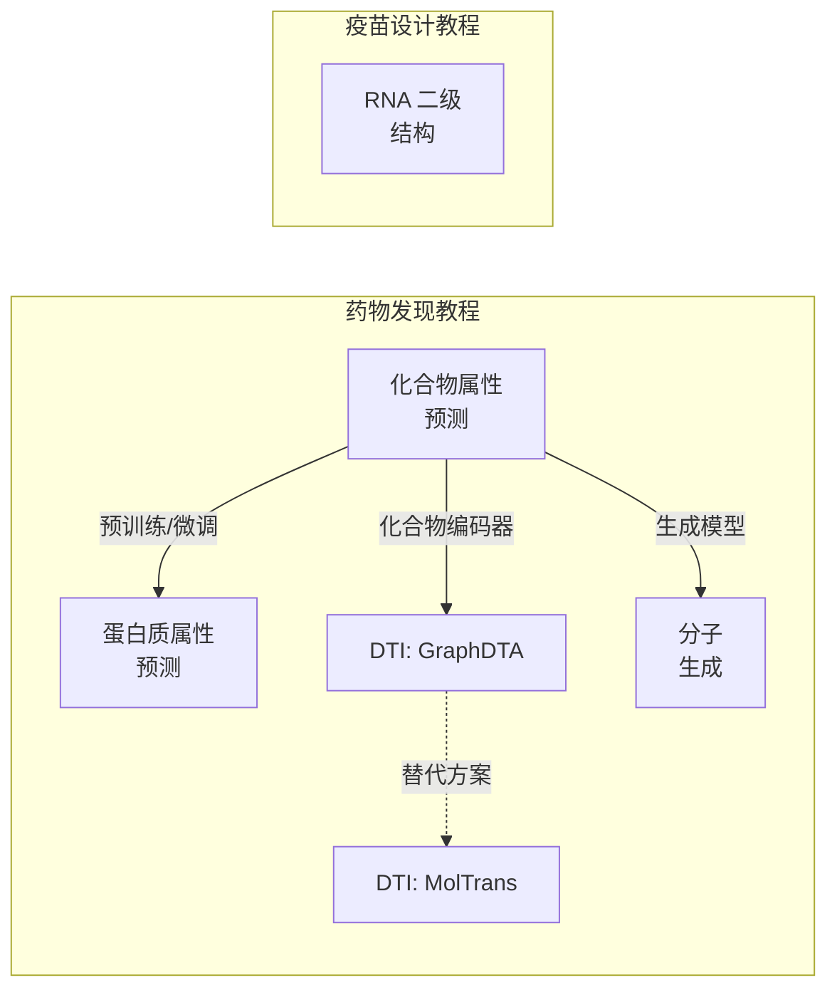
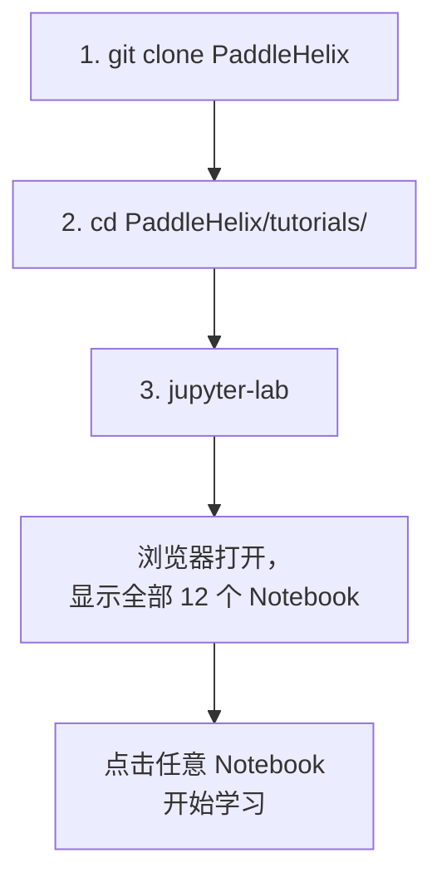

---
slug:3-tutorials-and-notebooks
blog_type:normal
---

PaddleHelix 提供了一套精心策划的 6 个实战 Jupyter Notebook 教程，每个教程均附有中文版，涵盖了该框架支持的各类生物计算任务——从化合物属性预测、药物-靶点相互作用建模，到分子生成和 RNA 结构分析。这些 Notebook 旨在为你提供从“安装 PaddleHelix”到“运行首个实验”的最快路径，其中嵌入了真实的训练循环、数据集下载和推理调用，你可以在本地机器上端到端地执行它们。
来源：[tutorials/README.md](tutorials/README.md)、[docs/tutorials.rst](docs/tutorials.rst)

## 教程概览

这 6 个教程直接对应 PaddleHelix 的核心应用领域，分为两大类：**药物发现**（5 个教程）和**疫苗设计**（1 个教程）。每个 Notebook 都是独立的，但它们共享一个通用的结构模式——加载配置、下载数据、定义模型、训练以及评估或推理——这使得你在完成任意一个教程后，就能轻松地推进后续教程的学习。

下表汇总了每个教程的范围、底层模型架构，以及代码库中包含该 Notebook 所演示的完整生产代码的应用目录：

| 教程 | 领域 | 模型 / 架构 | 应用目录 | Notebook |
|---|---|---|---|---|
| 化合物属性预测 | 分子属性 | GIN (Pretrain-GNNs) | `apps/pretrained_compound/pretrain_gnns/` | [EN](tutorials/compound_property_prediction_tutorial.ipynb) · [CN](tutorials/compound_property_prediction_tutorial_cn.ipynb) |
| 蛋白质属性预测 | 蛋白质属性 | LSTM / Transformer / ResNet | `apps/pretrained_protein/tape/` | [EN](tutorials/protein_pretrain_and_property_prediction_tutorial.ipynb) · [CN](tutorials/protein_pretrain_and_property_prediction_tutorial_cn.ipynb) |
| DTI — GraphDTA | 药物-靶点亲和力 | GNN + 1D-CNN | `apps/drug_target_interaction/graph_dta/` | [EN](tutorials/drug_target_interaction_graphdta_tutorial.ipynb) · [CN](tutorials/drug_target_interaction_graphdta_tutorial_cn.ipynb) |
| DTI — MolTrans | 药物-靶点相互作用 | FCS + Transformer | `apps/drug_target_interaction/moltrans_dti/` | [EN](tutorials/drug_target_interaction_moltrans_tutorial.ipynb) · [CN](tutorials/drug_target_interaction_moltrans_tutorial_cn.ipynb) |
| 分子生成 | 从头分子设计 | 序列 VAE (GRU) | `apps/molecular_generation/seq_VAE/` | [EN](tutorials/molecular_generation_tutorial.ipynb) · [CN](tutorials/molecular_generation_tutorial_cn.ipynb) |
| RNA 二级结构 | 疫苗 / 结构生物学 | LinearFold + LinearPartition | `c/pahelix/toolkit/` | [EN](tutorials/linearrna_tutorial.ipynb) · [CN](tutorials/linearrna_tutorial_cn.ipynb) |

来源：[tutorials/README.md](tutorials/README.md#L7-L22)、[tutorials/README_cn.md](tutorials/README_cn.md#L7-L20)

## 设置与运行教程

在打开任何 Notebook 之前，你需要在系统上安装两个前置条件：**Jupyter Lab**（或 Jupyter Notebook）和 **PaddleHelix** 本身。PaddleHelix 的安装指南可在 [快速开始](2-quick-start) 页面找到。Jupyter 可通过 `pip install jupyterlab` 安装，或按照 [jupyter.org/install](https://jupyter.org/install) 上的官方说明进行安装。

当两者都准备就绪后，每个教程的启动流程都是相同的：

关键细节在于，每个 Notebook 在开始执行时，都会通过 `os.chdir()` 将工作目录更改至相应的 `apps/` 子目录。例如，化合物属性 Notebook 会重定向到 `../apps/pretrained_compound/pretrain_gnns/`，而 GraphDTA Notebook 会重定向到 `../apps/drug_target_interaction/graph_dta/`。这意味着这些 `apps/` 目录下的完整生产脚本、模型配置以及任何附加的工具模块都变得可导入，而无需在 Notebook 内手动调整 `PYTHONPATH`。
来源：[tutorials/README.md](tutorials/README.md#L15-L25)、[compound_property_prediction_tutorial.ipynb](tutorials/compound_property_prediction_tutorial.ipynb#L20-L22)、[drug_target_interaction_graphdta_tutorial.ipynb](tutorials/drug_target_interaction_graphdta_tutorial.ipynb#L24-L27)

<CgxTip>
**工作目录切换**：每个 Notebook 都会执行 `os.chdir()` 跳转至其目标 `apps/` 子文件夹。如果你将代码单元复制到 `tutorials/` 目录之外的自己的脚本中，你必须复制此 `chdir` 调用或相应地调整 `sys.path`。否则，对于像 `from src.model import DownstreamModel` 这样的本地 `src/` 导入，将会引发 `ModuleNotFoundError`。
</CgxTip>

## 化合物属性预测

本教程演示了 PaddleHelix 化合物建模策略核心的完整**“预训练-微调”**工作流。它分为两部分，镜像了 Pretrain-GNNs 框架中实际使用的两阶段训练流水线。

**第一部分 — 预训练**加载 Zinc 数据集并训练一个 `AttrmaskModel`，该模型会随机屏蔽分子图中节点的原子类型，并尝试预测它们。这种自监督任务迫使 GNN 编码器（带有 GIN 层的 `PretrainGNNModel`）学习有意义的结构表示。配置从 `model_configs/` 下的 JSON 文件加载，指定了一个 5 层 GIN，具有 300 维嵌入、批归一化和均值读出。在仅进行 2 个演示轮次的训练后（损失从约 2.75 降至约 0.94），化合物编码器权重将被保存以供下游复用。
来源：[compound_property_prediction_tutorial.ipynb](tutorials/compound_property_prediction_tutorial.ipynb#L28-L42)、[compound_property_prediction_tutorial.ipynb](tutorials/compound_property_prediction_tutorial.ipynb#L67-L79)

**第二部分 — 微调**将预训练的编码器加载到 `DownstreamModel`（带有特定于任务的分类头）中，然后使用 `ScaffoldSplitter` 在 Tox21 毒性数据集上进行微调，以实现具有化学意义的训练/验证/测试集划分。下游任务是针对 12 个 Tox21 检测目标的多标签二分类，使用 ROC-AUC 进行评估。这种两阶段模式——在大规模无标签语料库（Zinc，约 25 万个分子）上进行自监督预训练，然后在小型有标签数据集（Tox21，约 7800 个分子）上进行特定任务的微调——是标签数据稀缺时的推荐方法。
来源：[compound_property_prediction_tutorial.ipynb](tutorials/compound_property_prediction_tutorial.ipynb#L231-L256)、[compound_property_prediction_tutorial.ipynb](tutorials/compound_property_prediction_tutorial.ipynb#L307-L315)

## 蛋白质属性预测

蛋白质教程遵循相似的结构，但目标是从分子图转变为氨基酸序列。它演示了在来自 TAPE 基准测试的蛋白质下游任务上训练序列模型（可配置为 **LSTM**、**Transformer** 或 **ResNet**）。

该 Notebook 涵盖了由模型配置中的 `task` 字段控制的丰富任务类型：`"pretrain"` 用于在 TAPE 数据集上进行自监督学习，`"classification"` 用于远程同源性预测，`"regression"` 用于荧光性和稳定性预测，以及 `"seq_classification"` 用于二级结构预测（每个残基的 3 类标记）。演示使用了具有 3 层、512 个隐藏单元的 LSTM 编码器和一个二级结构数据集。训练会产生逐步的损失输出和准确率指标，并将训练好的模型保存用于推理。在第二部分中，推理直接在原始氨基酸序列上执行，生成每个残基的类别概率分布，除了通过 `ProteinTokenizer` 进行分词外，无需任何手动预处理。
来源：[protein_pretrain_and_property_prediction_tutorial.ipynb](tutorials/protein_pretrain_and_property_prediction_tutorial.ipynb#L42-L64)、[protein_pretrain_and_property_prediction_tutorial.ipynb](tutorials/protein_pretrain_and_property_prediction_tutorial.ipynb#L87-L104)、[protein_pretrain_and_property_prediction_tutorial.ipynb](tutorials/protein_pretrain_and_property_prediction_tutorial.ipynb#L168-L175)

## 药物-靶点相互作用：GraphDTA

**GraphDTA** 是一个双编码器架构，它将化合物药物表示为由 GNN 处理的分子图，并将靶点蛋白质表示为由一维卷积滤波器处理的氨基酸序列。将两个学习到的表示拼接起来，并传递给一个全连接预测器，以输出结合亲和力（表示为 log₁₀(Kd)）。

该 Notebook 演示了在 **Davis** 数据集（25046 个训练对 / 5010 个测试对）上的完整流水线。一个关键的配置选择是 `max_protein_len`：将其设置为正值会截断/填充蛋白质序列，而设置为 `-1` 则使用全长序列（计算成本更高）。训练使用 MSE 损失和 Adam 优化器，学习率为 0.0005。评估同时采用 MSE 和一致性指数（CI），并带有一个智能优化：当 MSE 未比当前最佳值有所改善时，会跳过计算成本较高的 CI 计算。该 Notebook 以一个端到端的**推理示例**结束：给定一个原始 SMILES 字符串（`'CCN1C2=C(C=CC(=C2)OC)SC1=CC(=O)C'`）和一段蛋白质序列，模型预测结合亲和力并将其转换回以摩尔为单位的 Kd 值。
来源：[drug_target_interaction_graphdta_tutorial.ipynb](tutorials/drug_target_interaction_graphdta_tutorial.ipynb#L60-L83)、[drug_target_interaction_graphdta_tutorial.ipynb](tutorials/drug_target_interaction_graphdta_tutorial.ipynb#L166-L190)、[drug_target_interaction_graphdta_tutorial.ipynb](tutorials/drug_target_interaction_graphdta_tutorial.ipynb#L372-L413)

## 药物-靶点相互作用：MolTrans

**MolTrans**（Molecular Interaction Transformer）采用了与 GraphDTA 截然不同的方法。它不处理原始分子图，而是利用 **FCS（频繁化合物子结构）挖掘模块**，将输入的药物和蛋白质分解为从大规模无标签生物医学数据中提取的高质量子结构。然后将这些子结构标记输入到基于 Transformer 的双塔编码器中进行相互作用预测。

MolTrans 教程同时支持**分类**和**回归**任务，并提供独立的训练脚本（`train_cls.py` 和 `train_reg.py`）。它在更丰富的数据集上运行，包括用于回归的 DAVIS、KIBA、BindingDB 和 ChEMBL，以及用于分类的 BIOSNAP（具有全数据、未见药物、未见蛋白质和缺失数据划分）。该 Notebook 指导你完成数据下载（约 187MB 压缩包）、预处理、训练和评估，全面展示了如何将 Transformer 架构应用于药物-靶点相互作用预测。
来源：[drug_target_interaction_moltrans_tutorial.ipynb](tutorials/drug_target_interaction_moltrans_tutorial.ipynb#L18-L30)、[drug_target_interaction_moltrans_tutorial.ipynb](tutorials/drug_target_interaction_moltrans_tutorial.ipynb#L62-L72)

## 分子生成

本教程介绍了 **Sequence VAE**——一种变分自编码器，它将分子视为 SMILES 字符串，并学习将其编码到连续的潜在空间，再将其解码回来。该架构使用一个双向 GRU 编码器将 SMILES 压缩为固定长度的潜在向量，并使用一个多层 GRU 解码器从该向量重建 SMILES。

工作流分为两个清晰的阶段。**第一部分 — 训练**下载 ZINC-MOSES 数据集，从训练集的 SMILES 中构建独热词汇表，配置 VAE 超参数（潜在维度为 128，最大序列长度为 80，编码器隐藏层大小为 256，解码器隐藏层大小为 512），并使用 KL 散度（权重为 0.1）和重建损失的组合损失进行演示轮次的训练。**第二部分 — 采样**直接从先验分布生成 1000 个新分子（无需输入），并使用一套综合指标对其进行评估：有效性、唯一性@3、内部多样性（IntDiv/IntDiv2）以及类药性过滤。
来源：[molecular_generation_tutorial.ipynb](tutorials/molecular_generation_tutorial.ipynb#L40-L56)、[molecular_generation_tutorial.ipynb](tutorials/molecular_generation_tutorial.ipynb#L183-L208)、[molecular_generation_tutorial.ipynb](tutorials/molecular_generation_tutorial.ipynb#L341-L354)

## 使用 LinearRNA 预测 RNA 二级结构

LinearRNA 教程与其他教程有所不同：它**完全不需要模型训练**。相反，它演示了直接在 Notebook 中调用 `pahelix.toolkit.linear_rna` C++ 扩展模块中预构建的线性时间算法。安装只需执行 `pip install paddlehelix`。

**LinearFold** 使用束搜索在线性时间内（相对于传统算法的 O(n³)）预测 RNA 二级结构。它提供两种模型后端：基于 CONTRAfold 的机器学习模型（`linear_fold_c`）和来自 Vienna RNAfold 的热力学模型（`linear_fold_v`）。两者都接受关于束大小、结构约束（使用 `? . ( )` 符号）和急转弯控制的参数。**LinearPartition** 在线性时间内计算配分函数值和碱基对概率，同样提供机器学习和热力学两种变体（`linear_partition_c`、`linear_partition_v`），并带有用于过滤低概率碱基对的 `bp_cutoff` 参数。

该教程提供了即时且可解释的输出：给定一段 RNA 序列，LinearFold 返回点括号结构字符串和折叠自由能，而 LinearPartition 返回配分函数值和 (位置_i, 位置_j, 概率) 元组列表。对于任何对 RNA 生物学或疫苗设计感兴趣并希望在几秒钟内（而不是几小时）获得结果的人来说，这是一个理想的起点。
来源：[linearrna_tutorial.ipynb](tutorials/linearrna_tutorial.ipynb#L30-L51)、[linearrna_tutorial.ipynb](tutorials/linearrna_tutorial.ipynb#L168-L186)、[linearrna_tutorial.ipynb](tutorials/linearrna_tutorial.ipynb#L210-L237)

<CgxTip>
**零训练教程**：LinearRNA 是唯一一个无需任何 GPU 或模型训练就能产生有意义的科学结果的教程。如果你的机器没有 GPU，或者你想要立即获得输出，请从这里开始——它能在 2 分钟内验证你的 PaddleHelix 安装，并为你提供一个可用的 RNA 结构预测器。
</CgxTip>

## 推荐学习路径

这些教程是相互独立的，可以按任意顺序完成，但以下进阶路径能够自然地建立概念依赖关系，并逐步引入复杂性：

| 步骤 | 教程 | 为何采用此顺序 |
|---|---|---|
| 1 | [RNA 二级结构](tutorials/linearrna_tutorial.ipynb) | 除了 pip install 之外零配置；验证环境；即时获得结果 |
| 2 | [化合物属性预测](tutorials/compound_property_prediction_tutorial.ipynb) | 引入 GNN、SMILES 特征化以及贯穿整个框架的 预训练→微调 范式 |
| 3 | [蛋白质属性预测](tutorials/protein_pretrain_and_property_prediction_tutorial.ipynb) | 将相同的 预训练→微调 模式扩展到序列模型 (LSTM/Transformer) |
| 4 | [DTI — GraphDTA](tutorials/drug_target_interaction_graphdta_tutorial.ipynb) | 将化合物 GNN 与蛋白质 CNN 结合为联合架构；提供端到端推理示例 |
| 5 | [分子生成](tutorials/molecular_generation_tutorial.ipynb) | 引入生成式建模 (VAE) —— 与前面所有预测性教程截然不同的范式 |
| 6 | [DTI — MolTrans](tutorials/drug_target_interaction_moltrans_tutorial.ipynb) | 数据量最大的教程；引入基于 Transformer 的架构和 FCS 挖掘 |

完成这些教程后，自然的下一步是探索 `apps/` 目录中完整的生产应用，或者在 [架构概览](6-architecture-overview) 页面深入探讨核心库架构。如果你对教程 2 和 3 中演示的预训练框架特别感兴趣，请参阅 [使用 GEM 进行化合物预训练](11-compound-pretraining-with-gem) 和 [使用 TAPE 进行蛋白质预训练](13-protein-pretraining-with-tape)。对于教程 4 和 6 中涵盖的 DTI 模型，请继续阅读 [药物-靶点相互作用模型](14-drug-target-interaction-models)。