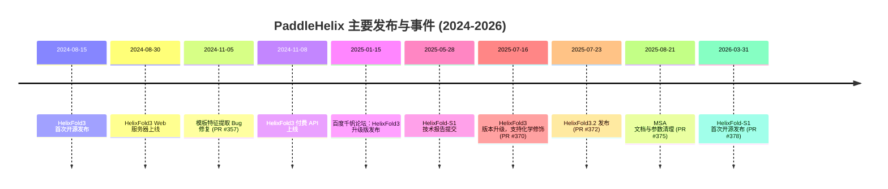

---
slug:4-latest-updates
blog_type:buzz
---

PaddleHelix 一直保持着强劲的发展势头。在 2024 年中旬到 2026 年初期间，该仓库先后发布了 HelixFold3、HelixFold3.2 等重要版本，最近更是开源了 HelixFold-S1——一个引导式构象探索系统，相关描述见 [arXiv 论文 (2507.09251)](https://arxiv.org/abs/2507.09251)。如果你是关注该仓库的开发者或研究人员，以下是针对其新增内容、变更细节及未来关注点的结构化梳理。

---

## 发布时间线一览

---

## HelixFold-S1：开源发布（2026 年 3 月）

近期最具影响力的变更是 [HelixFold-S1 的首次开源发布](https://github.com/PaddlePaddle/PaddleHelix/commit/c83d99dc0d39274987169071b2314acd3d7a3218)，该 PR 于 2026 年 3 月 31 日通过 [PR #378](https://github.com/PaddlePaddle/PaddleHelix/pull/378) 合入。

HelixFold-S1 **并非**一个全新的基础模型。它是构建在 HelixFold3 架构之上的引导式规划层。如 [arXiv 论文 (2507.09251)](https://arxiv.org/abs/2507.09251) 所述，其核心思想是将预测的链间接触概率作为“蓝图”，引导基于扩散的结构生成过程朝向构象空间中最具信息量的区域进行，而非盲目采样。作者报告称：

- **结构准确度显著提升**，优于传统的无引导采样。
- **采样需求降低了一个数量级**，这意味着只需更少的前向传播即可达到同等或更优的质量。
- 接触概率输出可同时作为粗略的难度/采样效用指标。

该技术报告于 [2025 年 5 月](https://github.com/PaddlePaddle/PaddleHelix/commit/7fdd7a18c9e9cbdad807010d69ec7d1e6a366559)首次提交至仓库，但直到此次合入才公开了实际的源代码。对于运行高通量虚拟筛选或大规模结构基因组学流水线的团队而言，这是最重要的更新：它无需重新训练即可带来实际的算力节约。

---

## HelixFold3.2：质量提升与修饰支持（2025 年 7 月）

2025 年 7 月 23 日，README 更新并宣布了 [HelixFold3.2](https://github.com/PaddlePaddle/PaddleHelix/commit/c48e99c608707d720689110bd91b707e33050096) (PR #372) 的发布。在此前一周，一个[版本升级提交](https://github.com/PaddlePaddle/PaddleHelix/commit/dc7058336557c8ffadf17f844e92580905cf9677) (PR #370) 已经重构了 HelixFold3 代码库，并**新增了对化学修饰的支持**——这对于从事翻译后修饰、共价药物设计或 RNA 修饰研究的团队来说，是一个重要的功能扩展。

与初版 HelixFold3 相比，3.2 版本的主要改进如下：

| 方面 | HelixFold3 (2024 年 8 月) | HelixFold3.2 (2025 年 7 月) |
|--------|----------------------|------------------------|
| 蛋白质结构质量 | 与 AlphaFold3 相当 | 显著提升 |
| 化学修饰支持 | 初始版本未包含 | 已添加 |
| 依赖配置 | 初始设置 | 已优化 |
| 代码库状态 | 首次发布 | 已重构，移除了冗余代码 |

化学修饰功能与百度在 2025 年 1 月的[千帆智库生命科学论坛](https://news.aibase.com/news/14796)上展示的内容相吻合，在此次论坛上，升级版的 HelixFold3 被证明在 RNA 修饰预测任务上优于 AlphaFold3。

---

## 基础设施与 Bug 修复浪潮（2024 年底 -- 2025 年 8 月）

在 2024 年 11 月至 2025 年 8 月期间，有几项虽不起眼但对开发者至关重要的变更落地：

**模板特征提取修复** ([PR #357](https://github.com/PaddlePaddle/PaddleHelix/pull/357)，2024 年 11 月)：解决了在模板特征提取过程中，因缺少 mmCIF 结构坐标和语法问题导致的[报错](https://github.com/PaddlePaddle/PaddleHelix/commit/b8a83566ec26563880d4d251d7906449a8673bc3)。该修复解决了多起用户报告的崩溃问题，包括 [TemplateAtomMaskAllZerosError](https://github.com/PaddlePaddle/PaddleHelix/issues/351) 和 [ref_atom_name_chars 断言失败](https://github.com/PaddlePaddle/PaddleHelix/issues/353)。

**末端原子修复** ([PR #350](https://github.com/PaddlePaddle/PaddleHelix/pull/350)，2024 年 9 月)：在预测蛋白质的羧基端补充了缺失的末端氧原子，解决了 [Issue #345](https://github.com/PaddlePaddle/PaddleHelix/issues/345) 中每个输出结构都缺少 OXT 原子的问题——对于下游的分子动力学或对接工作流而言，这是一个细微但结构意义重大的错误。

**MSA 文档与参数清理** ([PR #375](https://github.com/PaddlePaddle/PaddleHelix/pull/375)，2025 年 8 月)：修正了 README 中的拼写错误，并移除了未使用的遗传数据库参数，确保文档与代码保持同步。

**HelixFold3 付费 API**（2024 年 11 月）：百度为 HelixFold3 推出了[付费 API 服务](https://paddlehelix.baidu.com/app/all/helixfold3/forecast)，主要面向需要高通量访问但又不想自行管理 GPU 基础设施的学术和商业用户。这是一个显著的战略转变：开源模型依然可用，但商业化层面现已正式确立。

---

## 已知痛点（尚未解决）

有少量问题仍未解决，对于计划在生产环境中部署 PaddleHelix 的人员值得重点关注：

- **GPU 架构兼容性**：[Issue #369](https://github.com/PaddlePaddle/PaddleHelix/issues/369) 反映，由于 PaddlePaddle 驱动/运行时的限制，目前不支持 Hopper 架构的 GPU（H100、H200，计算能力 9.0）。这是一个框架层面的阻碍，严格来说并非 PaddleHelix 本身的 Bug，但它直接影响着使用现代数据中心硬件的团队。

- **安装摩擦**：[Issue #374](https://github.com/PaddlePaddle/PaddleHelix/issues/374) 记录了 `requirements.txt` 存在损坏的问题，其引用了一个过时的 Python 3.7 wheel 包（`paddlepaddle_gpu-0.0.0.post116-cp37-cp37m-linux_x86_64.whl`）。协作者 RyanGarciaLI 澄清称，该用户是误装了旧版的 HelixFold 而非 HelixFold3，但旧版目录中遗留的过时 wheel 包仍容易引起混淆。此外，讨论串中还指出并确认了一个独立的数据下载脚本 Bug（gzip 路径错误）。

- **推理性能**：[Issue #376](https://github.com/PaddlePaddle/PaddleHelix/issues/376) 反映，在 L40S GPU 上，即便使用了 `--preset='reduced_dbs'` 参数，预测一个三链抗体-抗原复合物仍需约 22.8 分钟。用户表示这对他们的实验计划而言“慢得令人无法接受”。目前尚未发布解决方案。

- **预训练权重不匹配**：[Issue #364](https://github.com/PaddlePaddle/PaddleHelix/issues/364) 和 [Issue #377](https://github.com/PaddlePaddle/PaddleHelix/issues/377) 均报告了提供的检查点权重与当前模型架构不匹配的情况。Issue #364 显示了 GeoGNN 嵌入层中存在的形状不匹配问题，而 Issue #377 则请求提供用于复现 CASF-2016 的 GIaNt 预训练模型。这两个问题均未得到处理。

---

## 版本历史摘要

| 版本 / 里程碑 | 日期 | 类型 | 参考 |
|---------------------|------|------|-----------|
| HelixFold3 首次发布 | 2024-08-15 | 开源 | [GitHub README](https://github.com/PaddlePaddle/PaddleHelix) |
| HelixFold3 Web 服务器 | 2024-08-30 | 服务上线 | [paddlehelix.baidu.com](https://paddlehelix.baidu.com/app/all/helixfold3/forecast) |
| 模板提取修复 | 2024-11-05 | Bug 修复 | [PR #357](https://github.com/PaddlePaddle/PaddleHelix/pull/357) |
| HelixFold3 付费 API | 2024-11-08 | 服务 | [README 公告](https://github.com/PaddlePaddle/PaddleHelix) |
| HelixFold3 升级（百度论坛） | 2025-01-15 | 公告 | [36Kr 报道](https://eu.36kr.com/en/p/3123829879019526) |
| HelixFold-S1 技术报告 | 2025-05-28 | 文档 | [Commit](https://github.com/PaddlePaddle/PaddleHelix/commit/7fdd7a18c9e9cbdad807010d69ec7d1e6a366559) |
| HelixFold3 版本升级 | 2025-07-16 | 功能 | [PR #370](https://github.com/PaddlePaddle/PaddleHelix/pull/370) |
| HelixFold3.2 发布 | 2025-07-23 | 主要版本 | [PR #372](https://github.com/PaddlePaddle/PaddleHelix/pull/372) |
| MSA 参数清理 | 2025-08-21 | 维护清理 | [PR #375](https://github.com/PaddlePaddle/PaddleHelix/pull/375) |
| HelixFold-S1 开源 | 2026-03-31 | 开源 | [PR #378](https://github.com/PaddlePaddle/PaddleHelix/pull/378) |

---

## 后续展望

发展轨迹已然清晰。PaddleHelix 正将 HelixFold3 定位为 AlphaFold3（目前仍部分闭源）的开源替代方案，同时在其上叠加差异化特性——化学修饰支持、引导式构象探索（HelixFold-S1）以及商业化 API 访问。从目前的未决问题来看，团队应当优先考虑以下几点：

1. **硬件兼容性**：适配当前一代 GPU（Hopper 及更新架构），因为 PaddlePaddle 对计算能力的支持目前落后于 PyTorch 和 JAX。
2. **权重检查点一致性**：确保跨模型版本的权重一致性，以防止架构不匹配错误。
3. **性能分析与优化**：针对多链推理进行优化，因为目前的速度对于许多实验工作流而言仍然过慢。

对于开发者而言，HelixFold-S1 是最值得克隆和基准测试的版本。如果其声称的采样成本降低一个数量级的效果能够兑现，它将重塑团队在 PaddlePaddle 生态内开展高通量结构预测的方式。